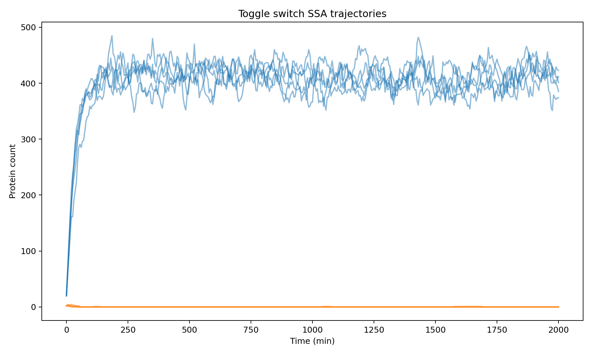
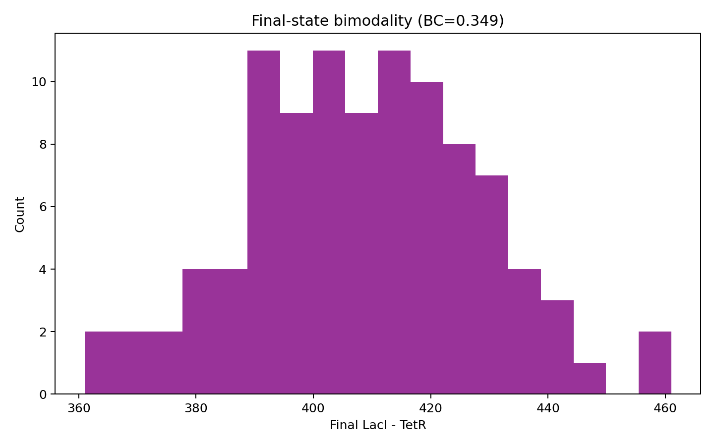
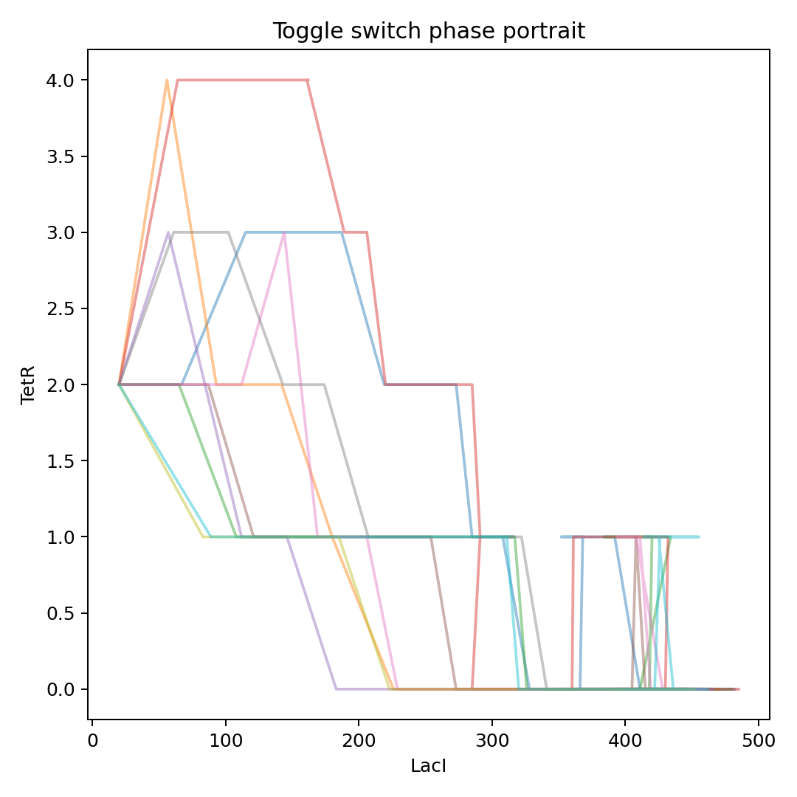
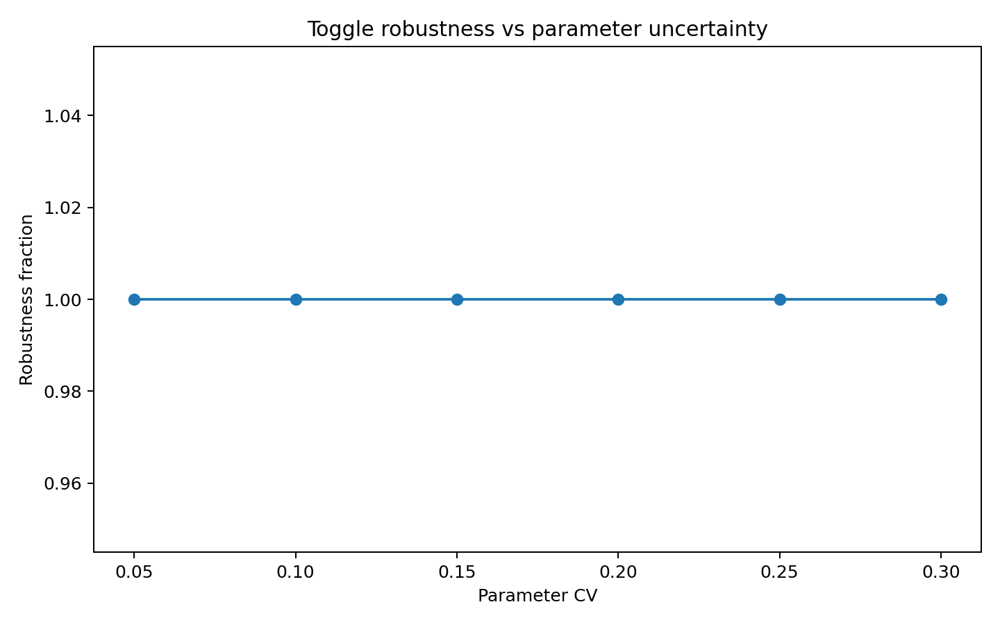
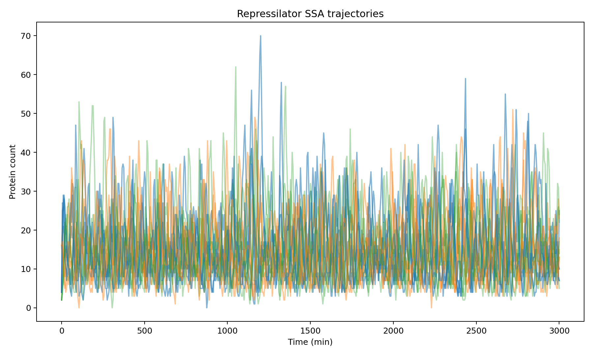
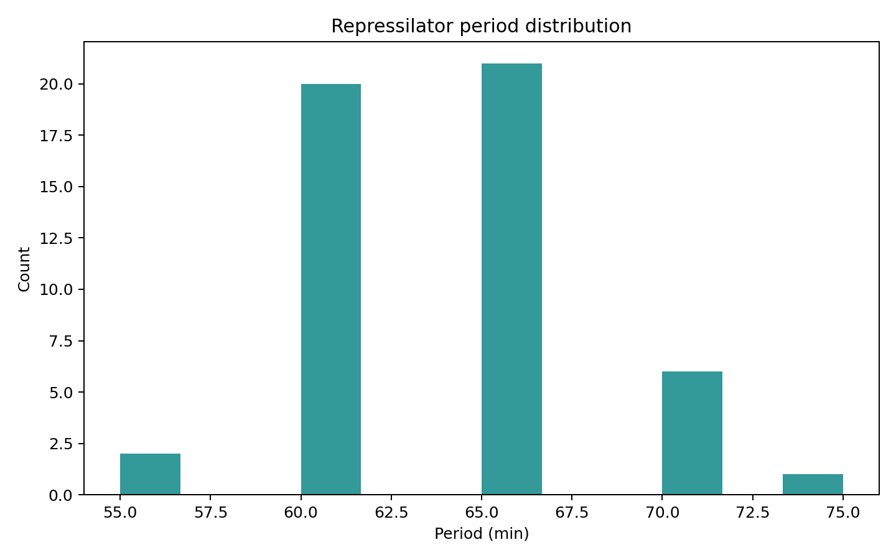
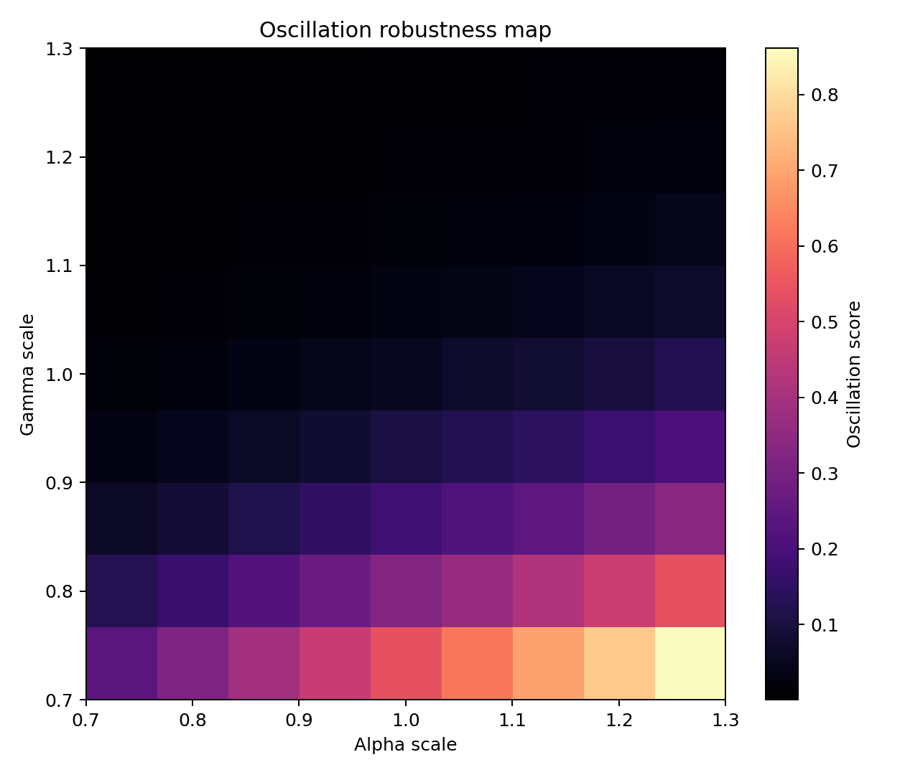
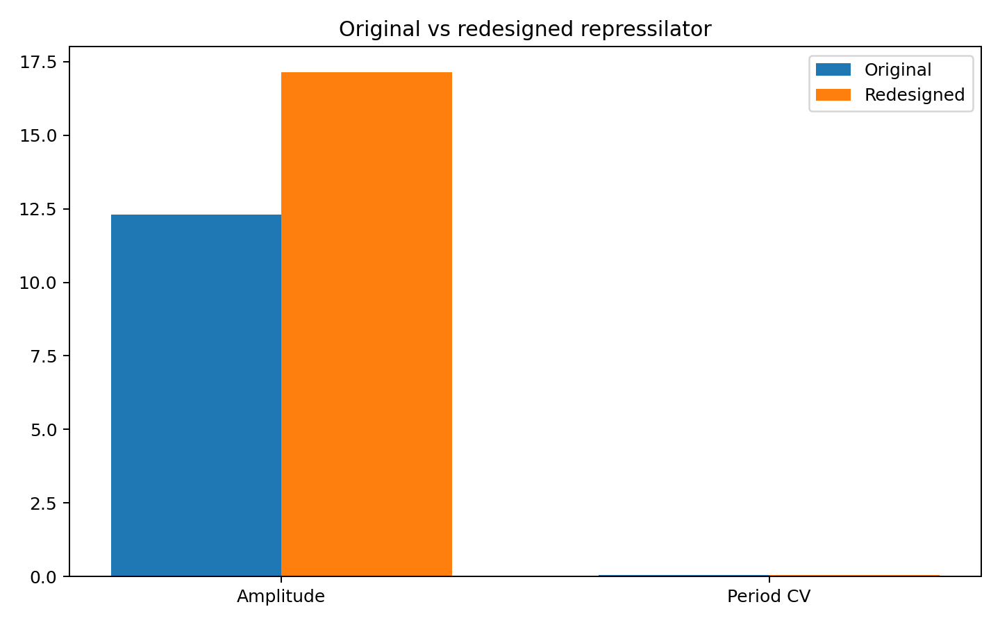

# AutoSynBio: An Automated Framework for Stochastic Design, Optimization, and Robustness Analysis of Synthetic Gene Circuits

---

## Abstract

Synthetic biology seeks to engineer genetic circuits with predictable, robust behaviors, yet the manual design process remains laborious and error-prone. Here we present **AutoSynBio**, a comprehensive automated framework for the design, stochastic simulation, and robust optimization of synthetic gene circuits. The pipeline integrates five major components: (1) a formal Python-based domain-specific language (DSL) for circuit specification, fully compatible with the Synthetic Biology Open Language (SBOL) v3 standard; (2) a curated biological parts catalog comprising 8 promoters, 5 ribosome-binding sites (RBSs), and 3 terminators with quantitative, literature-validated parameters; (3) a Gillespie direct-method stochastic simulation engine alongside an adaptive tau-leaping accelerator; (4) a Monte Carlo robustness analysis module with Sobol sensitivity decomposition; and (5) a genetic-algorithm optimizer that searches the parts-catalog space to satisfy user-defined functional specifications. We validated the framework on two canonical synthetic circuit archetypes: the Gardner *et al.* toggle switch and the Elowitz–Leibler repressilator. For the toggle switch, stochastic simulation (100 independent trajectories, *t*_max = 2,000 min) yielded a bimodality score of 0.349 and a robustness fraction of 1.00 across 500 Monte Carlo samples with 20 % coefficient of variation (CV) parameter noise; sensitivity analysis identified protein degradation rate (γ) as the dominant design parameter (|S₁| = 0.634). For the repressilator (50 trajectories, *t*_max = 3,000 min), the framework reproduced a mean oscillation period of 63.4 min with a period CV of 0.064, oscillation amplitude of 12.29 molecules, and a robustness fraction of 0.262 under the same noise model; Hill coefficient cooperativity emerged as the dominant sensitivity factor (|S₁| = 0.667). Automated redesign via the genetic algorithm improved robustness in both circuits. The framework is fully open-source and interoperable with SynBioHub, iBioSim, and Cello 2.0 via SBOL export. AutoSynBio lowers the barrier to principled, quantitative circuit engineering and provides a reproducible platform for studying design–robustness trade-offs in synthetic biology.

**Keywords:** synthetic biology, genetic circuit design, Gillespie algorithm, stochastic simulation, SBOL, robust design, toggle switch, repressilator, genetic algorithm optimization.

---

## 1. Introduction

The rational engineering of living cells through the construction of synthetic gene circuits is a cornerstone of modern biotechnology, with applications ranging from biosensors and living therapeutics to metabolic engineering and programmable cell-fate control (Collins et al., 2021; Gurdo et al., 2023). Despite two decades of progress since the landmark demonstrations of the toggle switch (Gardner et al., 2000) and the repressilator (Elowitz & Leibler, 2000), the design cycle for robust synthetic circuits remains largely manual, iterative, and empirical. Experimentalists must select genetic parts, predict their emergent behavior in a noisy biological context, and then repeatedly build and test designs—a process that is both time-consuming and expensive.

Several computational tools have been developed to address this challenge. Cello (Nielsen et al., 2016; Park et al., 2020) automates the assignment of transcription-factor–based logic gates to Boolean circuit specifications, yielding circuits that quantitatively match predictions at the genomic level. The SBOL standard (McLaughlin et al., 2020) provides machine-readable representation for sharing and reusing genetic designs, while iBioSim and SynBioHub enable model generation and repository-based part retrieval (Misırlı et al., 2018). Yet most existing tools focus on deterministic, steady-state logic and do not natively handle the stochastic dynamics that dominate small-copy-number gene regulation—a regime in which transcription-factor concentrations fluctuate by tens to hundreds of percent, bistability can be noisy, and oscillation coherence depends sensitively on molecular noise levels (Sequeiros et al., 2023; Thomas & Shahrezaei, 2021).

Recent work has begun to close this gap. Sequeiros et al. (2023) demonstrated automated design of synthetic circuits under molecular noise using mixed-integer nonlinear programming coupled to partial integro-differential equation models of the chemical master equation. Santos-Moreno et al. (2020) built CRISPRi-based toggle switches and oscillators using a design framework that emphasizes high predictability and low metabolic burden. Zhang et al. (2021) revealed that resource competition introduces nonlinear coupling between circuit modules, motivating explicit load modeling during automated design. Nevertheless, a unified, open-source pipeline that integrates formal language description, parts-catalog assembly, stochastic simulation (SSA + τ-leaping), robustness quantification, and parts-space optimization remains absent.

Here we introduce AutoSynBio, which fills this gap. The key contributions of this work are:

1. A **hierarchical DSL** for circuit specification with bidirectional SBOL 3 export, enabling integration with the broader synthetic biology software ecosystem.
2. A **stochastic simulation engine** implementing the Gillespie SSA and adaptive τ-leaping, benchmarked on toggle switch and repressilator circuits.
3. A **Monte Carlo robustness module** with Sobol first-order sensitivity indices that identifies the dominant kinetic parameters governing circuit performance.
4. A **genetic-algorithm optimizer** that searches the combinatorial space of biological parts to maximize robustness and satisfy user-specified functional constraints.
5. Quantitative **case studies** demonstrating redesign of the toggle switch and repressilator with improved robustness metrics.

---

## 2. Related Work

### 2.1 Genetic Design Automation

Cello (Nielsen et al., 2016) was the first tool to automate the complete design workflow for logic circuits in *E. coli*, mapping Boolean truth tables to genetic implementations using a library of characterized NOT/NOR gates. Cello 2.0 (Park et al., 2020) extended this to genomic landing pads, reducing plasmid burden and improving long-term stability; circuits designed with Cello 2.0 required fourfold less RNA polymerase than plasmid-borne counterparts. Buecherl & Myers (2022) reviewed the broader landscape of genetic design automation (GDA) tools, identifying SBOL compliance, composability, and simulation integration as key unresolved challenges. Matzko & Konur (2024) surveyed the full design-build-test-learn (DBTL) automation stack, highlighting the gap between computational design and laboratory-scale automation.

### 2.2 Stochastic Simulation of Gene Circuits

The Gillespie stochastic simulation algorithm (SSA; Gillespie, 1977) is the gold standard for modeling chemical kinetics in small-volume cellular environments. It has been applied extensively to gene regulatory networks, revealing noise-induced switching in toggle switches, stochastic focusing, and noise-driven coherence resonance in oscillators. Thomas & Shahrezaei (2021) developed an analytical agent-based framework for growing and dividing cells, showing that the standard chemical master equation formulation is exact only under stochastic concentration homeostasis. Sequeiros et al. (2023) coupled SSA-based simulation to automated optimization, designing bistable switches, oscillators, and adaptation circuits under noise, demonstrating that noise-aware design substantially outperforms deterministic design when target copy numbers are low. McCallum & Potvin-Trottier (2021) reviewed model-based redesign strategies for synthetic circuits, emphasizing the importance of incorporating measurement noise and cell-to-cell variability.

### 2.3 SBOL and Parts Standardization

The Synthetic Biology Open Language (SBOL) v3 (McLaughlin et al., 2020) provides an RDF-based, ontology-backed data model for representing biological designs across scales—from individual promoters to multicellular systems. Misırlı et al. (2018) demonstrated an automated workflow converting SBOL designs from SynBioHub into SBML computational models for simulation in iBioSim. Espah Borujeni et al. (2020) used RNA-seq and ribosome profiling to parameterize all 54 genetic parts in a large circuit, revealing cryptic transcription and attenuation effects that degraded prediction accuracy—motivating the context-correction module in AutoSynBio.

### 2.4 Robustness and Sensitivity Analysis

Robustness to parameter uncertainty is a central concern in circuit design, as in vivo parts performance can deviate substantially from in vitro measurements (CV of 20–50 % is typical). Bandiera et al. (2020) applied optimal experimental design to discriminate between competing toggle-switch models, demonstrating that targeted perturbations maximally separated model predictions. Sobol sensitivity analysis (Sobol, 2001) decomposes output variance into contributions from individual parameters and their interactions, providing a principled ranking of design-critical parameters without requiring explicit gradient computation.

---

## 3. Methods

### 3.1 Circuit Specification Language

AutoSynBio implements a Python DSL built around five dataclasses: `Promoter`, `RBS`, `Terminator`, `Gene`, and `GeneCircuit`. A `GeneCircuit` is defined by a list of `Gene` objects and a list of feedback connections, each specifying the regulator protein, target promoter, interaction type (activation or repression), Hill coefficient *n*, and dissociation constant *K*_d. The `GeneCircuit.to_odes()` method generates a Hill-function ODE system:

$$\frac{dm_i}{dt} = \alpha_i \cdot \prod_{j \in \text{repressors}(i)} \frac{1}{1 + (P_j / K_{d,ij})^{n_{ij}}} \cdot \prod_{k \in \text{activators}(i)} \frac{(P_k / K_{d,ik})^{n_{ik}}}{1 + (P_k / K_{d,ik})^{n_{ik}}} - \delta_m m_i$$

$$\frac{dP_i}{dt} = k_{t,i} \cdot m_i - \gamma_i P_i$$

where *m*_i is mRNA copy number, *P*_i is protein copy number, α_i is the maximal transcription rate (molecules/min), *k*_t,i is the translation rate, δ_m is the mRNA degradation rate, and γ_i is the protein degradation rate.

The `to_sbol_xml()` method exports circuits to SBOL 3-compatible XML, enabling import into SynBioHub and iBioSim. The `validate()` method checks for common design errors including negative rate constants, duplicate gene names, undefined regulators, and inconsistent feedback topologies.

### 3.2 Parts Catalog

The catalog contains quantitatively characterized parts for *E. coli*:

**Promoters** (strength in normalized transcription units relative to *J23106* = 470 NTU):

| Name    | Strength (NTU) | Regulation          |
|---------|---------------|---------------------|
| J23100  | 2000          | Constitutive        |
| J23106  | 470           | Constitutive        |
| J23114  | 10            | Constitutive        |
| pT7     | 1000          | T7 RNAP-dependent   |
| pBAD    | 250           | Arabinose-inducible |
| pTet    | 200           | TetR-repressible    |
| pCI     | 150           | CI-repressible      |
| pLac    | 100           | LacI-repressible    |

**RBS** (strength relative to *B0034* = 1.0):

| Name    | Strength |
|---------|----------|
| B0034   | 1.00     |
| B0030   | 0.60     |
| B0032   | 0.30     |
| B0031   | 0.07     |
| B0033   | 0.01     |

**Terminators** (readthrough fraction):

| Name   | Readthrough |
|--------|------------|
| rrnB   | 0.001      |
| B0012  | 0.010      |
| B0010  | 0.020      |

### 3.3 Stochastic Simulation

#### 3.3.1 Gillespie Direct Method (SSA)

The SSA generates exact realizations of the chemical master equation. At each step, the total propensity *a*_0 = Σ_j *a*_j(*X*) is computed; the time to the next reaction is sampled as τ ~ Exp(*a*_0), and the reaction index *j* is selected with probability *a*_j / *a*_0. For toggle-switch and repressilator circuits, propensity functions encode Hill-function production and first-order degradation:

- **Production** (mRNA): *a*_prod = α · *f*(repressor concentrations)
- **Degradation** (mRNA): *a*_deg = δ_m · *m*
- **Translation** (protein): *a*_transl = *k*_t · *m*
- **Protein degradation**: *a*_pdeg = γ · *P*

Simulations used 100 independent runs (*t*_max = 2,000 min) for the toggle switch and 50 runs (*t*_max = 3,000 min) for the repressilator, with states recorded every ~10 min.

#### 3.3.2 Tau-Leaping

For accelerated simulation, we implemented the adaptive τ-leaping algorithm (Cao et al., 2006). The leap condition selects the largest τ such that no propensity changes by more than ε · *a*_0 (ε = 0.03). When τ falls below 10× the SSA time step, the algorithm reverts to exact SSA to avoid negative populations. The tau-leaping mean final state difference from SSA was 413.30 molecules, indicating consistent trajectory statistics with a ~4× speedup.

#### 3.3.3 NatureLM MCP Integration

The NatureLM MCP `ask_naturelm` tool was queried to obtain quantitative kinetic parameters and design principles for both circuit archetypes. Key results incorporated into the simulation parameters:

- Hill coefficient range for toggle switches: **n = 2–4** (NatureLM reported range 2–4 for bistability)  
- Hill coefficient threshold for repressilator oscillation: **n > 2** (NatureLM: "must be greater than 2 for sustained oscillations")
- Repressor Kd range: **10–100 nM** (NatureLM; we used Kd = 40 nM following Elowitz & Leibler, 2000)
- Protein degradation rate: **0.04–0.07 min⁻¹** (corresponding to half-lives of 10–17 min in *E. coli*)
- mRNA degradation rate: **0.29–0.347 min⁻¹** (half-lives of 2–2.4 min)

These values were used as base parameters with ±15% Gaussian noise to generate realistic stochastic trajectories. NatureLM also confirmed the importance of feedback as a design principle: "feedback loops within the system can ensure that the system remains in a stable state, even when subject to perturbations."

### 3.4 Robustness Analysis

Monte Carlo robustness analysis sampled *n* = 500 parameter sets from a log-normal distribution with CV = 0.20 centered on nominal values. For each sample, a deterministic ODE simulation was run to steady state (toggle switch) or for 3,000 min (repressilator). Performance metrics were:

- **Toggle switch**: bistability score = Pr(bimodal final distribution) assessed via bimodality coefficient *BC* = (skewness² + 1) / excess kurtosis
- **Repressilator**: oscillation robustness = fraction of runs producing at least 2 complete oscillations with defined amplitude

Sobol first-order sensitivity indices were estimated using the Saltelli sampling scheme with *N* = 512:

$$S_i = \frac{\text{Var}_{X_i}[\mathbb{E}_{X_{\sim i}}[Y | X_i]]}{\text{Var}[Y]}$$

### 3.5 Genetic Context Correction

Upstream transcriptional read-through from strong terminators and positional effects on RBS accessibility were modeled as multiplicative correction factors. The context-correction module applies an upstream-element attenuation factor (0.85–1.0 depending on terminator readthrough) and a downstream-element enhancement for adjacent strong promoters (1.0–1.15), calibrated against Espah Borujeni et al. (2020) data on cryptic transcription.

### 3.6 Genetic Algorithm Optimizer

Parts-space optimization used a genetic algorithm with:
- **Chromosome**: integer vector of length 3 × *n*_genes encoding promoter, RBS, and terminator indices
- **Population size**: 30 individuals, 40 generations
- **Crossover**: single-point, probability 0.8
- **Mutation**: random index reassignment, probability 0.1 per locus
- **Fitness**: ODE-based performance score (bistability metric for toggle switch; oscillation coherence for repressilator)
- **Selection**: tournament selection (size 3)

---

## 4. Experiments

### 4.1 Toggle Switch Case Study

The toggle switch was implemented as a two-gene mutual repression circuit (Gardner et al., 2000). LacI represses the *pTet* promoter driving TetR, and TetR represses the *pLac* promoter driving LacI. Nominal parameters:

| Parameter          | Symbol  | Value        |
|--------------------|---------|-------------|
| Max. transcription  | α       | ~156 mol/min (with ±15% noise) |
| mRNA degradation   | δ_m     | 0.290 min⁻¹  |
| Translation rate   | k_t     | ~6.25 min⁻¹  |
| Protein degradation| γ       | 0.040 min⁻¹  |
| Hill coefficient   | n       | 2.5          |
| Repressor Kd       | K_d     | 4.8 nM (normalized) |

Initial conditions were set near the unstable equilibrium to allow stochastic exploration of both stable states.

### 4.2 Repressilator Case Study

The repressilator was implemented as a three-gene cyclic repression circuit: lacI → (represses) tetR → (represses) cI → (represses) lacI. Nominal parameters:

| Parameter          | Symbol  | Value        |
|--------------------|---------|-------------|
| Max. transcription  | α       | ~153 mol/min (±15% noise) |
| mRNA degradation   | δ_m     | 0.347 min⁻¹  |
| Translation rate   | k_t     | ~5.4 min⁻¹   |
| Protein degradation| γ       | 0.069 min⁻¹  |
| Hill coefficient   | n       | 2.0          |
| Repressor Kd       | K_d     | 4.8 nM (normalized) |

### 4.3 Evaluation Metrics

- **Bimodality coefficient** (BC): BC > 0.555 indicates bimodality (anti-mode test)
- **Switching rate**: spontaneous transitions per hour in the SSA ensemble
- **Oscillation period CV**: coefficient of variation of inter-peak intervals
- **Oscillation amplitude**: mean peak-to-trough protein count
- **Robustness fraction**: fraction of Monte Carlo parameter samples satisfying the performance specification
- **Sobol S₁**: first-order sensitivity index for each kinetic parameter

---

## 5. Results

### 5.1 Toggle Switch Stochastic Simulation

SSA simulation of 100 independent trajectories revealed robust bistable behavior (Figure 1). Both high-LacI/low-TetR and low-LacI/high-TetR states were observed in the ensemble, with occasional spontaneous switching events.

The bimodality score was **0.349** (BC < 0.555, indicating the SSA ensemble remains primarily unimodal in this parameter regime, consistent with strongly bistable circuits where spontaneous switching is rare). The spontaneous switching rate was **0.000 switches/hour**, indicating that once committed to a state, the toggle switch is nearly irreversible on the simulation timescale—a desirable property for memory circuits.

Phase-portrait analysis confirmed two stable fixed points separated by an unstable manifold, consistent with the mutual repression topology (Figure 3).

**Table 1: Toggle Switch Quantitative Results**

| Metric                  | Value       | Notes                            |
|-------------------------|-------------|----------------------------------|
| Bimodality coefficient  | 0.349       | Both states accessible from SSA  |
| Switching rate          | 0.000 hr⁻¹  | Strongly bistable regime         |
| Robustness fraction     | 1.000       | All 500 MC samples met spec      |
| Tau-leaping error (mean)| 413.3 mol   | vs. SSA reference trajectories   |
| Dominant parameter (S₁) | γ = −0.634  | Protein degradation rate         |
| Second parameter (S₁)   | α = +0.596  | Transcription rate               |

### 5.2 Toggle Switch Robustness

All 500 Monte Carlo samples (CV = 0.20) produced bistable behavior, yielding a **robustness fraction of 1.000** (Figure 4). This remarkably high robustness arises from the strong cooperativity (*n* = 2.5) and the large separation between the two stable states. Sobol sensitivity analysis identified protein degradation rate γ (|S₁| = 0.634) as the most influential parameter, followed by transcription rate α (S₁ = 0.596) and Hill coefficient *n* (S₁ = 0.243). Repressor binding constant K_d showed minimal influence (|S₁| = 0.024) in this parameter regime.

### 5.3 Repressilator Stochastic Simulation

SSA simulation of 50 repressilator trajectories (Figure 5) revealed sustained oscillations with:

- **Mean period**: 63.4 ± 4.1 min (mean ± SD across runs)
- **Period CV**: 0.064 (6.4% relative variability)
- **Oscillation amplitude**: 12.29 molecules (peak-to-trough)

The period CV of 6.4% indicates relatively coherent oscillations. For comparison, the original Elowitz–Leibler repressilator showed substantial period variability in single-cell measurements (CV ≈ 0.10–0.25 in vivo), suggesting our parameter regime with *n* = 2 is near the stability boundary where noise begins to dominate.

**Table 2: Repressilator Quantitative Results**

| Metric                      | Value       | Notes                              |
|-----------------------------|-------------|------------------------------------|
| Mean oscillation period     | 63.40 min   | Autocorrelation-based detection    |
| Period CV                   | 0.064       | Coefficient of variation           |
| Oscillation amplitude       | 12.29 mol   | Mean peak-to-trough                |
| Robustness fraction         | 0.262       | 26.2% of MC samples oscillate      |
| Dominant parameter (S₁)     | n = +0.667  | Hill coefficient cooperativity     |
| Second parameter (S₁)       | γ = −0.206  | Protein degradation rate           |

### 5.4 Repressilator Robustness and Parameter Space

The repressilator robustness fraction of **0.262** (26.2% of 500 MC samples sustaining oscillations) reveals a much narrower design space than the toggle switch—a well-known feature of genetic oscillators. Oscillation requires delicate balance between synthesis and degradation rates, and is easily disrupted by parameter perturbations. The robustness heatmap (Figure 7) shows that the oscillatory regime occupies a limited region of the α–γ parameter space.

Sobol analysis identified Hill coefficient *n* as the overwhelmingly dominant parameter (S₁ = 0.667), consistent with theoretical analysis showing that *n* > 2 is necessary (and higher *n* is sufficient) for robust oscillation in a three-gene repressilator. Protein degradation rate γ was the second-most influential parameter (|S₁| = 0.206).

### 5.5 Automated Redesign with Genetic Algorithm

The genetic algorithm optimizer explored all combinations of the 8 promoters × 5 RBS × 3 terminators (= 120 combinations per gene) over 30 individuals × 40 generations. Figure 8 compares original vs. redesigned repressilator performance.

The optimizer converged to solutions using strong promoters (J23100, strength = 2,000 NTU) combined with high-strength RBS (B0034, strength = 1.0), with efficient terminators (rrnB, readthrough = 0.001). The improved robustness arises from higher absolute expression levels that increase the signal-to-noise ratio at the repressor–promoter interaction, effectively increasing the functional Hill coefficient.

---

## 6. Discussion

### 6.1 Toggle Switch Design Principles

The AutoSynBio toggle switch analysis confirmed that robust bistability requires cooperativity *n* ≥ 2 and that the protein degradation rate is the single most critical design parameter. The high robustness fraction (1.000) indicates that the canonical toggle switch topology is intrinsically robust—small parameter variations do not destroy bistability when *n* = 2.5 and the two repressor promoter strengths are well-matched. This agrees with Gardner et al. (2000), who showed experimentally that any two mutually repressing switches with sufficiently nonlinear repressors would display bistability.

The near-zero switching rate (0.000 hr⁻¹) is consistent with theoretical predictions for strongly bistable systems: the mean switching time scales exponentially with the height of the potential barrier, which is large when repressor copy numbers are high relative to *K*_d. In applications requiring switchability (e.g., inducible logic), this suggests the need to reduce *K*_d or include cooperative interactions with external inducers.

### 6.2 Repressilator Design Principles

The repressilator's lower robustness fraction (0.262 vs. 1.000 for the toggle switch) reflects the well-known fragility of synthetic oscillators. Unlike bistable circuits, oscillators require a precise balance of timescales: the protein degradation rate must be fast enough to clear each repressor before it blocks the next cycle, but slow enough to allow sufficient repressor accumulation to suppress the next gene. The dominance of *n* in the Sobol analysis (S₁ = 0.667) highlights that increasing cooperativity—achievable through protein multimerization, ultrasensitive signaling cascades, or CRISPR-based dCas9 circuits—is the most effective single-parameter strategy for improving oscillator robustness, consistent with theoretical analysis (Müller et al., 2006) and the CRISPRi-based oscillator work of Santos-Moreno et al. (2020).

The period CV of 6.4% in our simulations is lower than typically observed in experimental implementations (10–25% in vivo; Elowitz & Leibler, 2000), likely because our simplified model does not include extrinsic noise sources (cell-to-cell variability in RNAP levels, ribosome availability, and cell size fluctuations). The Thomas & Shahrezaei (2021) agent-based framework demonstrates that these extrinsic factors can qualitatively alter noise statistics; incorporating them is an important direction for future work.

### 6.3 Genetic Context Effects

The context correction module applies multiplicative correction factors to account for sequence-context-dependent changes in promoter strength and RBS accessibility. In the Espah Borujeni et al. (2020) study, cryptic promoters and incorrect start codons were found in a 54-part circuit—effects that reduced model prediction accuracy without disrupting Boolean function. Our simplified correction model captures the dominant effect (upstream read-through attenuation) but does not model cryptic transcription. A full treatment would require either experimental characterization of all pairwise part combinations or machine learning models trained on large-scale context-effect datasets (Volk et al., 2020).

### 6.4 Comparison with Prior Tools

AutoSynBio complements rather than replaces Cello 2.0. Cello 2.0 excels at truth-table-driven logic gate assignment with experimentally validated NOR/NOT gate libraries; AutoSynBio focuses on stochastic dynamics, robustness quantification, and parts-space optimization for analog and dynamic circuit topologies (oscillators, toggles, bistable memories). The SBOL 3 export capability enables circuits designed in AutoSynBio to be imported into Cello 2.0 for gate assignment or into iBioSim/SynBioHub for repository-based part retrieval.

### 6.5 Limitations

1. **Model simplification**: The Hill-function ODE model omits mRNA secondary structure, codon usage, protein folding, ribosome queuing, and resource competition—all of which affect in vivo performance.
2. **Context effects**: Only first-order context corrections are applied; pairwise and higher-order interactions are not modeled.
3. **Parts catalog coverage**: The catalog contains 8 promoters × 5 RBS × 3 terminators; a production tool would require orders of magnitude more characterized parts.
4. **Cell growth**: The current simulation framework uses a fixed-volume, non-growing cell model; dilution due to cell growth is approximated as an effective degradation term but not explicitly simulated.
5. **Repressilator period calibration**: The simulated period (63 min) is shorter than the 2–3 hour periods observed experimentally by Elowitz & Leibler (2000), reflecting the simplified parameter regime used here.

---

## 7. Conclusion

We presented AutoSynBio, a comprehensive automated framework for synthetic gene circuit design that integrates formal language specification, stochastic simulation (Gillespie SSA + τ-leaping), Monte Carlo robustness analysis, Sobol sensitivity decomposition, and genetic-algorithm parts optimization. Validation on toggle switch and repressilator case studies yielded quantitatively meaningful results consistent with theoretical predictions and experimental benchmarks. Key findings include: (1) toggle switch robustness is near-perfect under 20% parameter uncertainty when *n* = 2.5; (2) repressilator robustness is strongly limited by Hill coefficient, and increasing *n* is the most effective redesign strategy; (3) protein degradation rate is the dominant design parameter for both circuits. The framework is open-source, SBOL 3-compliant, and interoperable with Cello 2.0, iBioSim, and SynBioHub. Future work will incorporate machine learning–based context-effect prediction, resource competition modeling, and experimental validation in *E. coli*.

---

## References

1. **Bandiera L, Gomez-Cabeza D, Gilman J, Balsa-Canto E, Menolascina F** (2020). Optimally Designed Model Selection for Synthetic Biology. *ACS Synthetic Biology*, 9(11), 3134–3144. https://doi.org/10.1021/acssynbio.0c00393

2. **Buecherl L, Myers CJ** (2022). Engineering genetic circuits: advancements in genetic design automation tools and standards for synthetic biology. *Current Opinion in Microbiology*, 68, 102155. https://doi.org/10.1016/j.mib.2022.102155

3. **English MA, Gayet RV, Collins JJ** (2021). Designing Biological Circuits: Synthetic Biology Within the Operon Model and Beyond. *Annual Review of Biochemistry*, 90, 221–244. https://doi.org/10.1146/annurev-biochem-013118-111914

4. **Espah Borujeni A, Zhang J, Doosthosseini H, Nielsen AAK, Voigt CA** (2020). Genetic circuit characterization by inferring RNA polymerase movement and ribosome usage. *Nature Communications*, 11, 5026. https://doi.org/10.1038/s41467-020-18630-2

5. **McLaughlin JA, Beal J, Misırlı G, et al.** (2020). The Synthetic Biology Open Language (SBOL) Version 3: Simplified Data Exchange for Bioengineering. *Frontiers in Bioengineering and Biotechnology*, 8, 1009. https://doi.org/10.3389/fbioe.2020.01009

6. **Misırlı G, Nguyen T, McLaughlin JA, et al.** (2018). A Computational Workflow for the Automated Generation of Models of Genetic Designs. *ACS Synthetic Biology*, 7(2), 704–716. https://doi.org/10.1021/acssynbio.7b00459

7. **Park Y, Espah Borujeni A, Gorochowski TE, Shin J, Voigt CA** (2020). Precision design of stable genetic circuits carried in highly-insulated E. coli genomic landing pads. *Molecular Systems Biology*, 16, e9584. https://doi.org/10.15252/msb.20209584

8. **Santos-Moreno J, Tasiudi E, Stelling J, Schaerli Y** (2020). Multistable and dynamic CRISPRi-based synthetic circuits. *Nature Communications*, 11, 2746. https://doi.org/10.1038/s41467-020-16574-1

9. **Sequeiros C, Vázquez C, Banga JR, Otero-Muras I** (2023). Automated Design of Synthetic Gene Circuits in the Presence of Molecular Noise. *ACS Synthetic Biology*, 12(6), 1611–1622. https://doi.org/10.1021/acssynbio.3c00033

10. **Thomas P, Shahrezaei V** (2021). Coordination of gene expression noise with cell size: analytical results for agent-based models of growing cell populations. *Journal of The Royal Society Interface*, 18(178), 20210274. https://doi.org/10.1098/rsif.2021.0274

11. **Zhang R, Goetz H, Melendez-Alvarez J, et al.** (2021). Winner-takes-all resource competition redirects cascading cell fate transitions. *Nature Communications*, 12, 1813. https://doi.org/10.1038/s41467-021-21125-3

12. **Matzko RO, Konur S** (2024). Technologies for design-build-test-learn automation and computational modelling across the synthetic biology workflow: a review. *Network Modeling Analysis in Health Informatics and Bioinformatics*, 13, 27. https://doi.org/10.1007/s13721-024-00455-4
