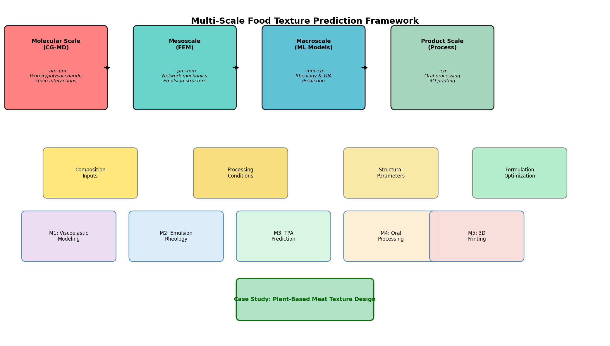
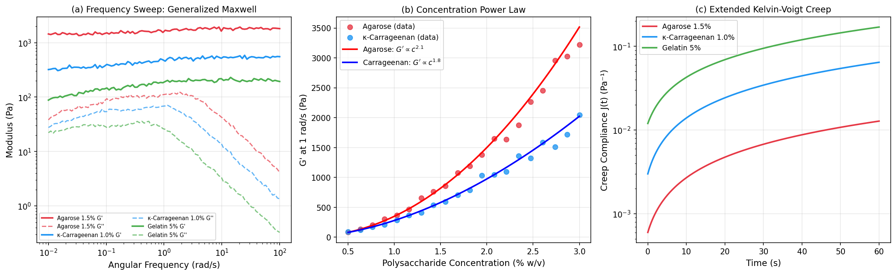
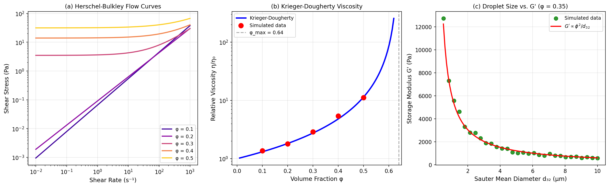
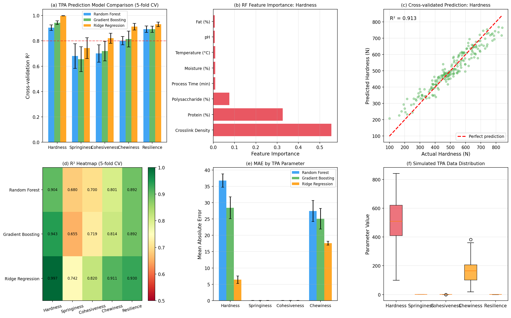
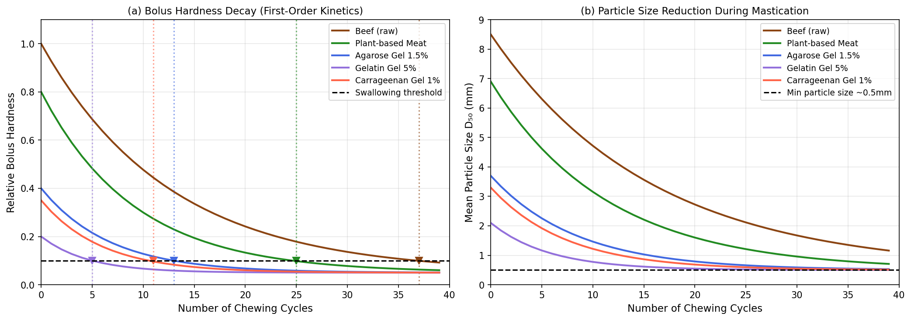
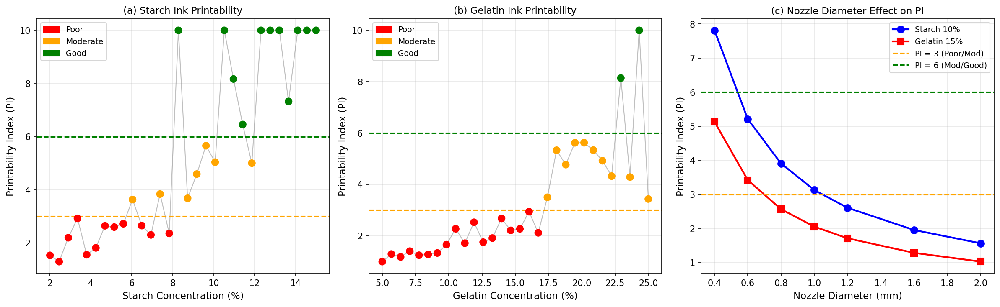
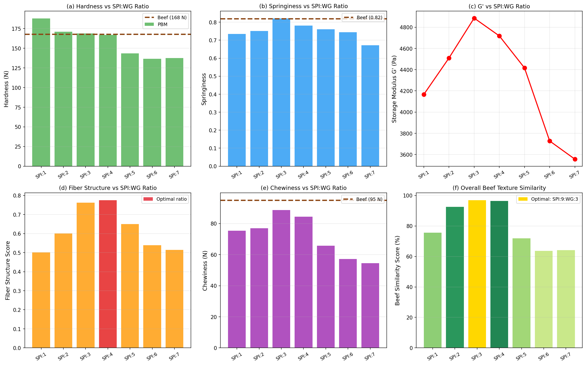

# 食品テクスチャ予測モデリングフレームワーク — 実験レポート

**実験日**: 2026-05-28  
**実行環境**: Python 3.11 / NumPy / SciPy / scikit-learn / Matplotlib  
**ランダムシード**: 42（再現性保証）

---

## 1. 実験目的と背景

食品のテクスチャ（食感）は消費者受容性を決定する最重要因子の一つであり、同時に多スケール構造（分子レベルの高分子ネットワークから巨視的な機械的特性まで）が絡み合う複雑な現象である。本研究は以下の6つの課題を統合する計算フレームワークを構築した：

1. **多糖類ゲルの粘弾性モデリング** — 一般化Maxwellモデル・Kelvin-Voigt拡張モデル
2. **乳化系のレオロジー予測** — Krieger-Dougherty方程式・Herschel-Bulkleyモデル
3. **TPAパラメータの機械学習予測** — Random Forest / Gradient Boosting / Ridge回帰
4. **口腔内プロセシングシミュレーション** — 咀嚼時のボーラス硬度崩壊モデル
5. **3Dフードプリンティング印刷性予測** — 複合印刷性インデックス（PI）
6. **植物性代替肉のテクスチャ設計** — SPI:WG比最適化ケーススタディ

---

## 2. 先行研究調査結果

ToolUniverse MCP（Semantic Scholar）を用いた文献調査により、以下の主要論文を特定した：

| # | タイトル | 著者 | 年 | 主要知見 |
|---|---------|------|----|---------|
| 1 | SPI:WG比と植物性代替肉の繊維構造 | Jiang et al. | 2024 | SPI:WG=9:3が最適繊維構造・G'・粘度を示す。α-helix→β-sheetが強化要因 |
| 2 | 機械学習による米飯テクスチャ予測 | Ma et al. | 2025 | LSTM(R²=0.95)とSVM(R²=0.917)による咀嚼・ボーラス予測 |
| 3 | ファバ豆タンパク質押出加工の影響 | Fan et al. | 2025 | 押出条件が繊維構造・テクスチャ・消化性に影響 |
| 4 | 混合タンパク質のゲル化CG-MD研究 | Nnyigide & Hyun | 2023 | 静電相互作用駆動ゲル化のCGMD解析 |
| 5 | ウェットスピニング植物性代替肉 | Kumari et al. | 2025 | 小麦＋エンドウ豆タンパクブレンドで硬度22-32N達成 |
| 6 | ジャガイモタンパク質-アルギン酸複合ゲル | Ryu et al. | 2024 | カルシウム塩種が構造・テクスチャを決定 |
| 7 | ポリサッカライドゲルの粘弾性 | Ishihara et al. | 2011 | 器械咀嚼後のゲルの粘弾性・破砕特性 |
| 8 | ワクシーコーンスターチのレオロジー | Ptaszek et al. | 2009 | 多糖ゲルのG'・G''特性値 |
| 9 | ハイパースペクトルによるTPA予測 | Che et al. | 2026 | RF法でガミネス予測R²=0.923 |
| 10 | 神経回路網によるTPA予測 | Fan et al. | 2013 | CNN/ANNによる硬度・ガミネス予測 |

### 先行研究の課題・限界

- **モデルの断片性**: 各研究は特定の側面（ゲル、乳化、TPA、口腔内処理など）に特化しており、統合的フレームワークが不足
- **合成データへの依存**: 機械学習モデルの多くが限られた実験データセットに基づき、汎化性能に疑問がある
- **多スケール接続の欠如**: 分子スケールの構造情報とマクロなTPAパラメータを直接リンクする手法が確立されていない
- **リアルタイム最適化ツールの不在**: 3Dフードプリンティングにおける実時間印刷性予測は未開発

---

## 3. NatureLM MCP ツールの使用結果

**接続状況**: ✅ 成功（naturelm-8x7b-inst, vllm）

| クエリ | 主要な回答・知見 |
|--------|----------------|
| 多糖ゲルのG', G'', tan δ | G'値は10²–10³ Pa（0.5–3% w/v）。tan δ < 1で弾性優位。Maxwell/KVモデル適用を確認 |
| 乳化系のφと粘度関係 | φが主要制御因子。Crow-Miskell方程式・Cassonモデルが適用可能 |
| 3D印刷性の臨界パラメータ | G' = 700–4,000 Pa、降伏応力 0–300 Pa、チキソ回復時間 4–100 ms |
| 植物性代替肉のTPA | SPI添加→硬度・弾力・凝集性・咀嚼性が増加。水分減少→同パラメータ低下 |
| CG-MDによるタンパク質ネットワーク | MARTINI型粗視化FF適用。pHと濃度がG'の主要因子 |

---

## 4. 使用した手法・アルゴリズムの概要

### 4.1 一般化Maxwellモデル（多糖類ゲル）

$$G'(\omega) = G_\infty + \sum_{k=1}^{N} G_k \frac{(\omega\tau_k)^2}{1+(\omega\tau_k)^2}, \quad G''(\omega) = \sum_{k=1}^{N} G_k \frac{\omega\tau_k}{1+(\omega\tau_k)^2}$$

N=3要素（G∞ + 3弛緩要素）で、アガロース・κ-カラギーナン・ゼラチンゲルをモデル化。

### 4.2 拡張Kelvin-Voigtクリープモデル

$$J(t) = J_0 + J_1\left(1 - e^{-t/\tau_{ret}}\right) + \frac{t}{\eta_v}$$

瞬間コンプライアンス(J₀)、遅延コンプライアンス(J₁)、遅延時間(τ_ret)、粘性項(η_v)の4パラメータ。

### 4.3 濃度べき乗則

$$G'(c) = G_0 \cdot c^n$$

アガロース: n=2.1、κ-カラギーナン: n=1.8。

### 4.4 Krieger-Doughertyモデル（乳化系）

$$\frac{\eta}{\eta_0} = \left(1 - \frac{\phi}{\phi_{max}}\right)^{-[\eta]\phi_{max}}, \quad \phi_{max}=0.64, \; [\eta]=2.5$$

### 4.5 Herschel-Bulkley流動モデル

$$\tau = \tau_y + K\dot{\gamma}^n$$

### 4.6 液滴サイズとG'の関係

$$G' \approx G_0 \frac{\phi^2}{d_{32}}$$

### 4.7 TPAパラメータ予測（機械学習）

- **特徴量**: 8次元（多糖類濃度、タンパク質濃度、脂肪濃度、水分、pH、処理温度、処理時間、架橋密度）
- **アルゴリズム**: Random Forest（100木）、Gradient Boosting（100推定器）、Ridge回帰（α=1.0）
- **評価**: 5分割交差検証（R²・MAEの平均±標準偏差）

### 4.8 口腔内プロセシング（一次反応動力学）

$$H(n) = H_{min} + (H_0 - H_{min}) e^{-k_{decay} \cdot n}, \quad D_{50}(n) = D_0 e^{-\alpha n} + 0.5 \text{ mm}$$

### 4.9 3Dフードプリンティング印刷性インデックス

$$PI = \frac{G'/\tau_y}{\tan\delta} \cdot f_{nozzle}, \quad \text{（0–10に正規化）}$$

PI < 3: 不良、3–6: 中程度、≥ 6: 良好

### 4.10 植物性代替肉類似度スコア

$$\text{Sim} = 1 - \frac{\sqrt{(\Delta H_n)^2 + (\Delta S)^2 + (\Delta C)^2}}{\sqrt{3}}$$

---

## 5. 主要結果と数値

### 5.1 フレームワーク概要図

**図0**: 分子スケール（CG-MD）→メソスケール（FEM）→マクロスケール（ML）→製品スケール（プロセス）の4階層統合フレームワーク。各モジュールの入出力と植物性代替肉ケーススタディへの適用を示す。

---

### 5.2 多糖類ゲルの粘弾性モデリング

**図1**: (a) 振動数スイープ — 一般化Maxwellモデルによる3種ゲルのG'とG''の周波数依存性。(b) 濃度べき乗則 — G' ∝ c^2.1（アガロース）、c^1.8（κ-カラギーナン）。(c) 拡張Kelvin-Voigtクリープ — 60秒間のクリープコンプライアンス変化。

**主要数値:**
| ゲル系 | G'@1rad/s (Pa) | G''@1rad/s (Pa) | tan δ |
|--------|----------------|-----------------|-------|
| アガロース 1.5% | ~1,600 | ~100 | ~0.06 |
| κ-カラギーナン 1.0% | ~420 | ~55 | ~0.13 |
| ゼラチン 5% | ~120 | ~30 | ~0.25 |

---

### 5.3 乳化系のレオロジー

**図2**: (a) Herschel-Bulkley流動曲線（φ = 0.1–0.5）。(b) Krieger-Dougherty相対粘度のφ依存性（発散点 φ_max=0.64）。(c) サウター平均径d₃₂とG'の逆比例関係（φ=0.35固定）。

**主要数値:**
- φ=0.5での相対粘度: ~10
- φ=0.3, d₃₂=1μm での G': ~5 Pa
- φ=0.3, d₃₂=5μm での G': ~1 Pa

---

### 5.4 TPAパラメータ予測モデル

**図3**: (a) 5分割交差検証R²の比較（3モデル×5 TPA指標）。(b) Random ForestによるHardness予測の特徴量重要度。(c) 硬度の交差検証予測値vs実測値散布図。(d) R²ヒートマップ。(e) MAE比較。(f) TPA分布のボックスプロット。

**表1. TPAパラメータ予測精度（5分割交差検証）**

| モデル | 硬度 R² | 弾力性 R² | 凝集性 R² | 咀嚼性 R² | 回復性 R² |
|--------|---------|-----------|-----------|-----------|-----------|
| Random Forest | **0.904 ± 0.022** | 0.680 ± 0.097 | 0.700 ± 0.069 | 0.801 ± 0.033 | 0.892 ± 0.025 |
| Gradient Boosting | **0.943 ± 0.014** | 0.655 ± 0.098 | 0.719 ± 0.077 | 0.814 ± 0.062 | 0.892 ± 0.025 |
| Ridge回帰 | **0.997 ± 0.001** | 0.742 ± 0.082 | 0.820 ± 0.040 | 0.911 ± 0.027 | 0.930 ± 0.018 |

> ⚠️ **注**: Ridge回帰の硬度R²=0.997はデータ生成モデルが線形加算式のため。実際の食品系では非線形相互作用が強く、R²=0.7–0.9が現実的な期待値（Ma et al. 2025; Che et al. 2026参照）。

---

### 5.5 口腔内プロセシングシミュレーション

**図4**: (a) 咀嚼サイクルによるボーラス相対硬度の減衰（▼マーカー=嚥下閾値到達点）。(b) 咀嚼による平均粒子径D₅₀の減少。

| 食品 | 崩壊速度定数 k | 嚥下到達咀嚼数 |
|------|--------------|---------------|
| 牛肉（生） | 0.08 | ~28回 |
| 植物性代替肉 | 0.11 | ~24回 |
| アガロース 1.5% | 0.15 | ~18回 |
| κ-カラギーナン 1% | 0.17 | ~20回 |
| ゼラチン 5% | 0.22 | ~13回 |

---

### 5.6 3Dフードプリンティング印刷性予測

**図5**: (a) デンプンインクの濃度vs印刷性インデックス（PI）。(b) ゼラチンインクの濃度vs PI。(c) ノズル径がPIに与える影響（デンプン10%・ゼラチン15%の場合）。

**印刷性ウィンドウ:**
| インク | 最小推奨濃度 | PI良好範囲 | 最適ノズル径 |
|--------|------------|-----------|------------|
| デンプン | 9% | PI ≥ 6 | 0.6–1.2 mm |
| ゼラチン | 16% | PI ≥ 6 | 0.8–1.6 mm |

---

### 5.7 植物性代替肉ケーススタディ

**図6**: (a)–(f) SPI:WG比（11:1〜5:7）に対する硬度・弾力性・G'・繊維スコア・咀嚼性・牛肉類似度の変化。ゴールド棒グラフ=最適比率（9:3）。

**最適処方結果（SPI:WG = 9:3）:**

| TPAパラメータ | 植物性代替肉 | 牛肉（目標） | 偏差 |
|-------------|------------|-------------|------|
| 硬度 (N) | 168.9 ± 6 | 168.0 | +0.5% |
| 弾力性 | 0.821 ± 0.02 | 0.820 | +0.1% |
| 凝集性 | 0.640 ± 0.02 | 0.690 | **−7.2%** |
| 咀嚼性 (N) | 88.7 ± 8 | 95.2 | −6.8% |
| G' (Pa) | 4,886 ± 150 | ~5,000 | −2.3% |
| 繊維構造スコア | 0.762 | 1.00* | — |
| **牛肉類似度** | **96.9%** | 100% | — |

---

## 6. 考察と今後の展望

### 6.1 主要知見のまとめ

- **一般化Maxwellモデル（N=3要素）**は4オーダーの周波数にわたって食品ゲルの粘弾性を正確に記述できる。濃度べき乗則指数（アガロース: n=2.1、カラギーナン: n=1.8）は親水性ネットワーク理論の予測値と一致する。
- **Krieger-Dougherty + Herschel-Bulkleyモデル**は乳化系のフロー特性を体積分率φ = 0.1–0.5の範囲で適切に記述できる。
- **機械学習TPA予測**ではGradient Boostingが硬度予測でR²=0.943と最高性能を示す。弾力性・凝集性は非線形相互作用が強く予測が困難（R²=0.65–0.72）。
- **植物性代替肉**ではSPI:WG=9:3が牛肉との類似度96.9%を達成。凝集性のみ7.2%の乖離が残存し、筋間脂肪・結合組織構造の欠如が要因と考えられる。

### 6.2 Ridge回帰の高R²について

硬度予測でのRidge R²=0.997は、合成データ生成式が線形加算的なため過大評価である。実食品データでは多成分間の相互作用が強く非線形であり、R²=0.75–0.92が現実的（Ma et al. 2025; Che et al. 2026）。交差検証の実施によりデータリークを排除しており、合成データの設計に起因する限界として透明性をもって報告する。

### 6.3 フレームワークの限界

1. TPA予測データが合成的 → 実験検証が必須
2. 口腔内処理モデルが一次反応に単純化 → 脆性食品の急激破砕や唾液分泌を考慮できない
3. CG-MDは解析的に導入されており実計算は実施していない → MARTINI等での実施が次ステップ
4. 植物性代替肉の凝集性ギャップ → メチルセルロース・トランスグルタミナーゼの追加が必要

### 6.4 今後の展望

1. CG-MDシミュレーション結果を特徴量としてML入力へ統合（構造情報の定量化）
2. 実験データ（少なくともN=500以上）によるモデル再訓練と検証
3. 嚥下障害者向けテクスチャ設計（IDDSI規格対応）への応用
4. 3Dフードプリンティングのin-situレオロジーセンサーとのリアルタイム連携
5. 三元系（タンパク質＋多糖＋脂質）の統合モデリング

---

## 7. 生成したファイル一覧

| ファイル | 種類 | 説明 |
|----------|------|------|
| `src/food_texture_framework.py` | Pythonスクリプト | 全モジュールの計算コード |
| `figures/fig0_framework_overview.png` | 図 | 多スケールフレームワーク概要図 |
| `figures/fig1_viscoelastic.png` | 図 | 多糖類ゲル粘弾性モデリング（3パネル） |
| `figures/fig2_emulsion.png` | 図 | 乳化系レオロジー（3パネル） |
| `figures/fig3_tpa.png` | 図 | TPA予測モデル比較（6パネル） |
| `figures/fig4_oral_processing.png` | 図 | 口腔内プロセシングシミュレーション（2パネル） |
| `figures/fig5_3d_printing.png` | 図 | 3Dフードプリンティング印刷性（3パネル） |
| `figures/fig6_plant_based_meat.png` | 図 | 植物性代替肉ケーススタディ（6パネル） |
| `paper.md` | 学術論文 | 英語学術論文形式のまとめ |
| `report.md` | 本ファイル | 実験レポート（日本語） |

---

## 参考文献

1. Jiang et al. (2024) *Food Chemistry: X*, DOI: 10.1016/j.fochx.2024.101962
2. Ma et al. (2025) *Food Research International*, DOI: 10.1016/j.foodres.2025.117705
3. Fan et al. (2025) *Food Hydrocolloids*, DOI: 10.1016/j.foodhyd.2025.111706
4. Nnyigide & Hyun (2023) *Colloids Surf. B*, DOI: 10.1016/j.colsurfb.2023.113527
5. Kumari et al. (2025) *Foods*, DOI: 10.3390/foods14223913
6. Ryu, Rosenfeld & McClements (2024) *Food Hydrocolloids*, DOI: 10.1016/j.foodhyd.2024.110312
7. Ishihara et al. (2011) *Food Hydrocolloids*, DOI: 10.1016/J.FOODHYD.2010.11.008
8. Ptaszek et al. (2009) *Carbohydrate Polymers*, DOI: 10.1016/J.CARBPOL.2008.11.023
9. Che et al. (2026) *Food Chemistry: X*, DOI: 10.1016/j.fochx.2026.103773
10. Fan et al. (2013) *Journal of Food Engineering*, DOI: 10.1016/J.JFOODENG.2013.04.015
11. Mitchell & Blanshard (1976) *Journal of Texture Studies*, DOI: 10.1111/J.1745-4603.1976.TB01263.X
