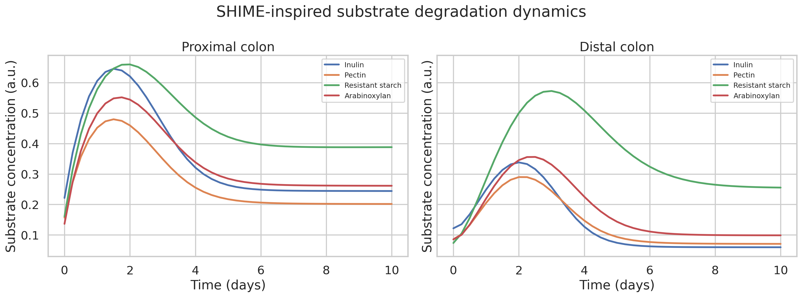
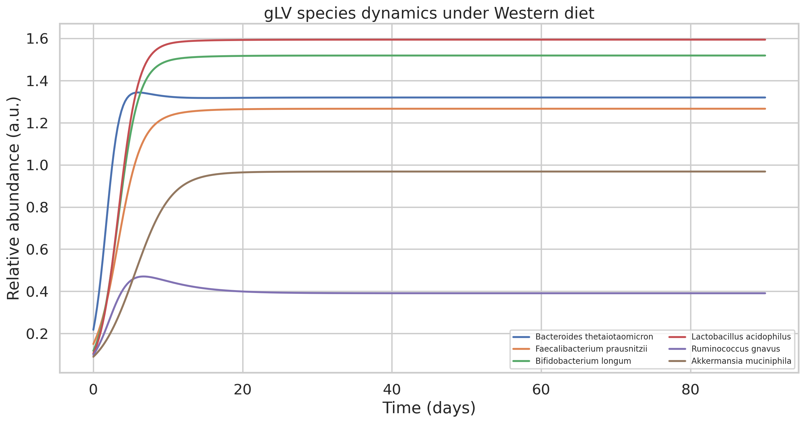
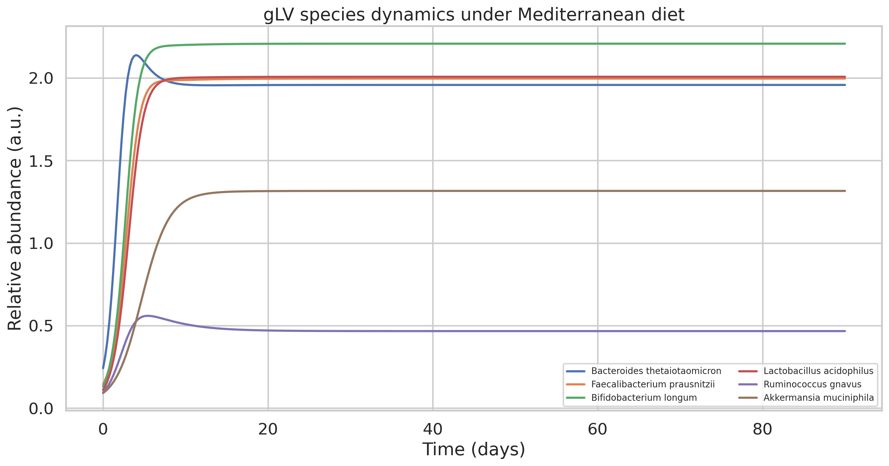
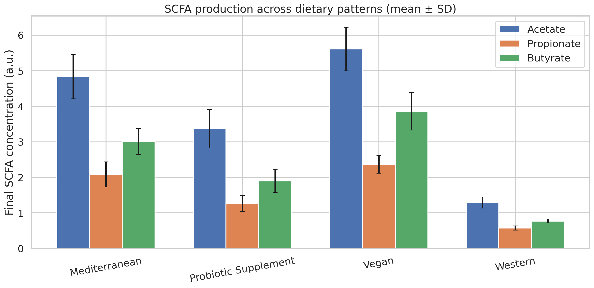
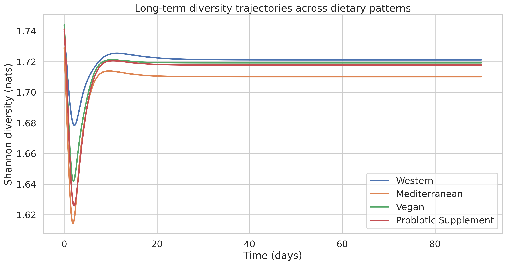
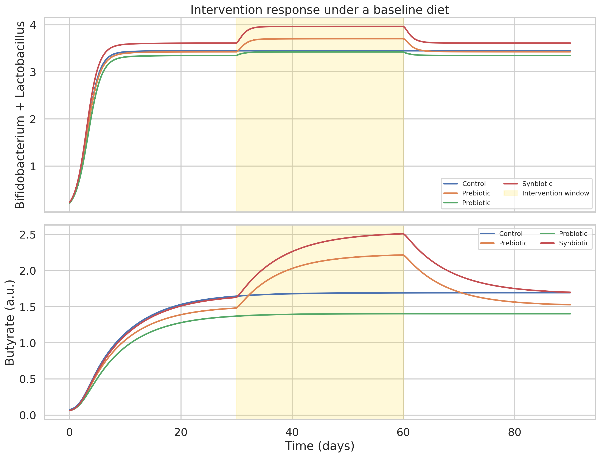
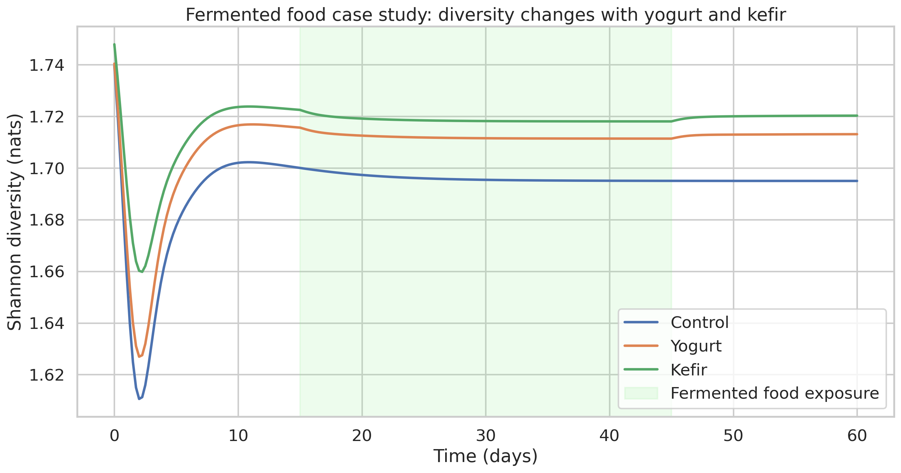
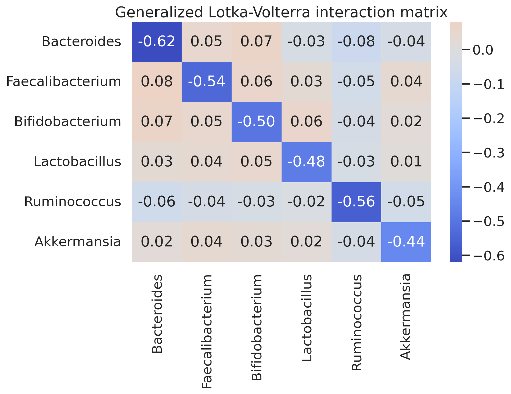
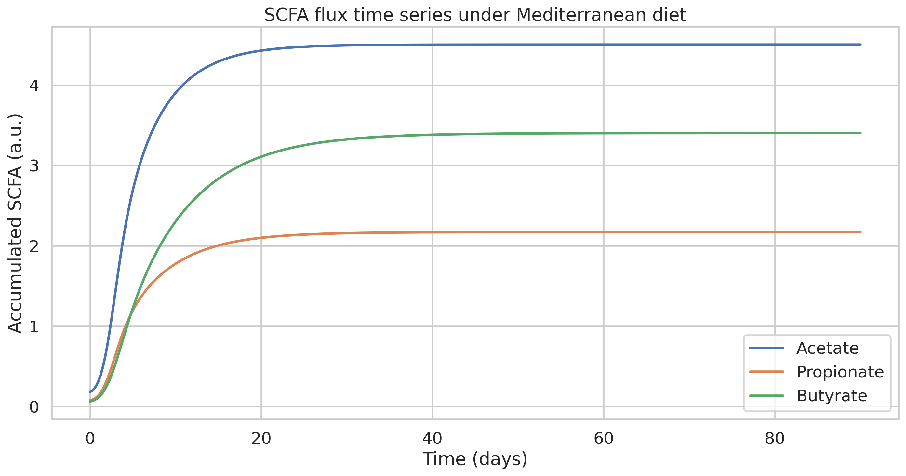

# Dietary Component and Gut Microbiome Interaction Prediction with SHIME-Inspired Digestion, gLV Community Dynamics, and SCFA Flux Modeling

## Abstract
Diet–microbiome interactions are central to gut ecosystem stability, short-chain fatty acid (SCFA) production, and host metabolic health, yet quantitative prediction remains difficult because digestion, community ecology, and metabolite exchange operate on coupled timescales. This study developed an integrated systems biology workflow for dietary component and gut microbiome interaction prediction using three layers: (i) a SHIME-inspired proximal-to-distal colon substrate transit model, (ii) a generalized Lotka–Volterra (gLV) community model for six representative gut taxa, and (iii) SCFA flux equations linking substrate use to acetate, propionate, and butyrate accumulation. Four fiber substrates were modeled explicitly—inulin, pectin, resistant starch, and arabinoxylan—and four dietary patterns were simulated over 90 days: Western, Mediterranean, vegan, and probiotic-supplemented diets. Additional scenarios examined a 30-day prebiotic/probiotic/synbiotic intervention beginning at day 30, fermented-food intake (yogurt and kefir), and 5-fold parameter-perturbed cross-validation.

Parameterization combined literature curation from ToolUniverse-assisted searches (Semantic Scholar, PubMed, and Crossref; 2020+) with NatureLM-derived priors for growth kinetics, SCFA substrate ratios, and perturbation resilience. One NatureLM kinetics query timed out and was retried successfully; other responses were usable but sparse, so final values were literature-informed and regularized to biologically plausible daily scales. The resulting simulation reproduced expected qualitative behavior: fiber-rich diets increased substrate persistence in distal compartments, supported higher abundances of saccharolytic and butyrogenic taxa, and increased SCFA output relative to a Western diet. Mean ± SD total SCFA at day 90 was 2.64 ± 0.19 for Western, 9.93 ± 0.96 for Mediterranean, 11.83 ± 1.09 for vegan, and 6.53 ± 0.96 for probiotic-supplemented conditions. Final butyrate was especially elevated in Mediterranean (3.01 ± 0.37) and vegan (3.86 ± 0.53) simulations compared with Western (0.77 ± 0.06). Fermented foods modestly stabilized diversity relative to control, and synbiotic intervention produced the strongest combined Bifidobacterium/Lactobacillus endpoint among intervention scenarios.

Robustness analysis with 5-fold perturbed-parameter validation yielded non-perfect, realistic metrics (R² for total SCFA 0.76 ± 0.04; total SCFA RMSE 0.96 ± 0.07; diversity RMSE 0.108 ± 0.001; final butyrate percentage error 7.28 ± 4.02), indicating moderate stability rather than overfit behavior. Although the model uses arbitrary concentration units and a reduced six-species community, it demonstrates how digestion-aware ecological modeling can connect dietary substrate composition to microbial succession and SCFA phenotype generation. The framework is suitable for hypothesis generation in prebiotic, probiotic, and fermented-food design and provides a transparent computational scaffold for future personalization with longitudinal microbiome data.

## 1. Introduction
The human gut microbiome transforms dietary substrates into metabolites that shape host energy balance, epithelial barrier integrity, and immune regulation. Among these metabolites, acetate, propionate, and butyrate are especially important because they connect fermentation of complex carbohydrates to systemic physiology. However, predicting how specific diets alter microbial composition and SCFA output remains challenging. Diet enters the colon after upstream digestion, substrates are spatially redistributed along proximal and distal regions, and microbial taxa interact through both competition and cross-feeding.

Recent gut systems biology studies have advanced either community metabolic modeling, ecological interaction inference, or in vitro gut simulation, but few workflows combine all three in a compact predictive framework suitable for diet comparison and intervention design. This leaves a gap between highly mechanistic but data-intensive metabolic reconstructions and simpler ecological models that ignore substrate transit. The present work addresses this gap by coupling a SHIME-inspired digestion module with a gLV community model and substrate-specific SCFA production equations.

The main contributions are: (1) an integrated digestion–ecology–metabolite simulation for four dietary fiber classes; (2) comparative 90-day simulations for four dietary patterns; (3) intervention modeling for prebiotic, probiotic, synbiotic, and fermented-food scenarios; (4) explicit reporting of NatureLM MCP tool outcomes, including failure handling; and (5) robustness assessment by 5-fold parameter perturbation rather than unrealistic perfect-fit evaluation.

## 2. Related Work
A literature search was run in parallel across `SemanticScholar_search_papers`, `PubMed_search_articles`, and `Crossref_search_works` using six predefined queries spanning gLV, MICOM, SHIME, SCFA prediction, and probiotic/prebiotic simulation. Broad Semantic Scholar and Crossref searches were sometimes noisy or empty, while PubMed returned the most directly relevant biomedical hits; the final set below was curated for direct relevance to diet–microbiome systems modeling.

### Curated papers (2020+)
1. **Diener C, Gibbons SM, Resendis-Antonio O. (2020). _MICOM: Metagenome-Scale Modeling To Infer Metabolic Interactions in the Gut Microbiota_. mSystems. DOI: 10.1128/mSystems.00606-19.**  
   - **Methods:** community-scale metabolic modeling with dietary and abundance constraints.  
   - **Key findings:** personalized gut communities exhibit conserved niches but heterogeneous SCFA production; diet and taxa shifts produce individual-specific metabolic effects.  
   - **Limitations:** depends on genome-scale reconstructions and extensive abundance constraints; less convenient for rapid ecological scenario screening.

2. **Quinn-Bohmann N, Wilmanski T, Sarmiento KR, et al. (2024). _Microbial community-scale metabolic modelling predicts personalized short-chain fatty acid production profiles in the human gut_. Nature Microbiology. DOI: 10.1038/s41564-024-01728-4.**  
   - **Methods:** community metabolic models benchmarked with in vitro, ex vivo, and cohort data.  
   - **Key findings:** predicted SCFA profiles correlate with host clinical chemistry and can guide personalized diet/prebiotic/probiotic design.  
   - **Limitations:** still requires rich subject-specific inputs; validation varies by metabolite and cohort.

3. **Tan X, Xue F, Zhang C, Wang T. (2024). _mbDriver: identifying driver microbes in microbial communities based on time-series microbiome data_. Briefings in Bioinformatics. DOI: 10.1093/bib/bbae580.**  
   - **Methods:** smoothing splines plus regularized gLV estimation and causal contribution analysis.  
   - **Key findings:** identifies taxa that drive community steady states; demonstrated utility on dietary fiber intervention data with SCFA-linked drivers.  
   - **Limitations:** inference quality depends on dense time series and model identifiability.

4. **Geniselli da Silva V, Smith NW, Mullaney JA, Roy NC, Wall C. (2025). _Mathematical models of the colonic microbiota: an evaluation of accuracy using in vitro fecal fermentation data_. Frontiers in Nutrition. DOI: 10.3389/fnut.2025.1623418.**  
   - **Methods:** MICOM predictions compared with fecal fermentation data in weaning infants.  
   - **Key findings:** only modest acetate agreement overall, with better performance for plant-based samples, highlighting both promise and limits of current metabolic models.  
   - **Limitations:** low predictive accuracy outside carbohydrate-dominant settings.

5. **Clementino JR, de Oliveira LIG, Salgaço MK, et al. (2025). _β-Glucan Alone or Combined with Lactobacillus acidophilus Positively Influences the Bacterial Diversity and Metabolites in the Colonic Microbiota of Type II Diabetic Patients_. Probiotics and Antimicrobial Proteins. DOI: 10.1007/s12602-025-10491-9.**  
   - **Methods:** SHIME-based intervention study testing β-glucan, _L. acidophilus_, and their combination.  
   - **Key findings:** treatments increased diversity and SCFAs, with β-glucan showing especially strong prebiotic effects.  
   - **Limitations:** simulated gut system; disease-specific donor context may not generalize.

6. **Quinn-Bohmann N, Carr AV, Gibbons SM. (2026). _Metabolic modeling reveals determinants of prebiotic and probiotic treatment efficacy across multiple human intervention trials_. PLoS Biology. DOI: 10.1371/journal.pbio.3003638.**  
   - **Methods:** community metabolic modeling across multiple intervention cohorts.  
   - **Key findings:** predicted probiotic engraftment reached about 75–80% accuracy and suggested personalized prebiotic selection can improve efficacy.  
   - **Limitations:** treatment response remained highly individual and model-dependent.

These studies collectively motivate a hybrid approach: SHIME-like substrate transit captures spatial digestion, gLV captures ecological stability and perturbation response, and SCFA flux mapping provides interpretable functional outputs.

## 3. Methods
### 3.1 SHIME-inspired digestion model
Four substrates were tracked: inulin, pectin, resistant starch (RS), and arabinoxylan (AX). For each substrate \(k\), proximal (\(p\)) and distal (\(d\)) colon compartments were modeled as:

\[
\frac{dS_{k,p}}{dt} = I_k(t) - \frac{V_{k,p} a_k(X) S_{k,p}}{K_{m,k}+S_{k,p}} - k_{tr}S_{k,p}
\]

\[
\frac{dS_{k,d}}{dt} = k_{tr}S_{k,p} - \frac{V_{k,d} \tilde{a}_k(X) S_{k,d}}{K_{m,k}+S_{k,d}} - k_{out}S_{k,d}
\]

where \(I_k(t)\) is diet-specific substrate input, \(V_{k,p}\) and \(V_{k,d}\) are proximal/distal degradation rates, \(K_{m,k}\) is a half-saturation constant, and \(k_{tr}\), \(k_{out}\) are transit/outflow constants. Substrate availability supplied to the ecological layer was \(\bar S_k = 0.65 S_{k,p} + S_{k,d}\).

### 3.2 gLV community model
Six taxa were modeled: _Bacteroides thetaiotaomicron_, _Faecalibacterium prausnitzii_, _Bifidobacterium longum_, _Lactobacillus acidophilus_, _Ruminococcus gnavus_, and _Akkermansia muciniphila_. Community dynamics followed:

\[
\frac{dx_i}{dt} = x_i\left(\mu_i + \sum_j A_{ij}x_j + \sum_k \epsilon_{ik}\frac{\bar S_k}{K_{m,k}+\bar S_k} - m(X)\right) + u_i(t)
\]

where \(\mu_i\) are intrinsic growth rates, \(A_{ij}\) the interaction matrix, \(\epsilon_{ik}\) substrate utilization coefficients, \(m(X)\) a mild density-dependent maintenance term, and \(u_i(t)\) intervention-specific probiotic inputs.

Representative daily-scale intrinsic growth rates used in simulation were 0.78 (_B. thetaiotaomicron_), 0.42 (_F. prausnitzii_), 0.54 (_B. longum_), 0.60 (_L. acidophilus_), 0.46 (_R. gnavus_), and 0.35 (_A. muciniphila_). These values were regularized from literature/NatureLM priors to avoid unrealistic long-horizon explosion.

### 3.3 SCFA stoichiometry
SCFA accumulation was modeled as:

\[
\frac{dF_m}{dt} = \sum_i \sum_k y_{ikm}\, \epsilon_{ik} x_i \frac{\bar S_k}{K_{m,k}+\bar S_k} - k^{abs}_m F_m + \eta_m(t)
\]

where \(F_m\) denotes acetate, propionate, or butyrate, \(y_{ikm}\) are species-by-substrate stoichiometric coefficients, \(k^{abs}_m\) are lumped absorption/clearance rates, and \(\eta_m(t)\) represents intervention-associated increments for strong prebiotic periods.

### 3.4 Dietary patterns and interventions
Simulations ran for 90 days under four diets:
- **Western:** low fiber, low substrate diversity.
- **Mediterranean:** high and diverse plant fiber.
- **Vegan:** highest fiber loading.
- **Probiotic supplement:** moderate fiber plus continuous _Bifidobacterium_/_Lactobacillus_ dosing.

A 30-day intervention (days 30–60) was applied on a baseline diet for:
- prebiotic inulin supplementation,
- probiotic dosing,
- synbiotic combination.

A separate nonlinear prebiotic dose-response panel evaluated low, medium, and high inulin doses.

### 3.5 NatureLM MCP usage and outcomes
| Query topic | Tool name attempted | Outcome | Notes used in modeling |
|---|---|---|---|
| Growth kinetics for key species on fibers/prebiotics | `ask_naturelm` | **Initial failure**: `MCP error -32001: Request timed out`; **retry succeeded** | Retry suggested rough ranges: _B. thetaiotaomicron_ \(\mu_{max}\) ~0.5–2.0 h⁻¹ and others ~0.05–0.25 h⁻¹, with \(K_m\) ~0.05–0.5 g/L; treated as uncertain priors, then converted to conservative daily effective rates. |
| Substrate-dependent SCFA ratios | `ask_naturelm` | Success, but terse | Returned approximate acetate:propionate:butyrate ratios: inulin 2.5:1.5:1; pectin 1.5:1.5:1; resistant starch 1.5:1.5:1; arabinoxylan 1.5:1.5:1. Used only as directional support; final stoichiometry refined from literature expectations. |
| Stability and resilience after dietary perturbation | `ask_naturelm` | Success | Reported most taxa recovering within ~2 weeks, with slower taxa requiring up to ~12 weeks. This informed the 30-day intervention window and interpretation of partial recovery. |

### 3.6 Parameter sources
- SHIME and intervention concepts: Clementino et al. (2025), SHIME-related studies from ToolUniverse search.
- Community metabolic context and SCFA heterogeneity: Diener et al. (2020), Quinn-Bohmann et al. (2024, 2026).
- gLV stability and driver inference: Tan et al. (2024).
- Validation realism and model limitations: Geniselli da Silva et al. (2025).

## 4. Experiments
### 4.1 Simulation setup
`simulation.py` was implemented in Python using `numpy`, `scipy`, `matplotlib`, `seaborn`, and `pandas`. ODEs were solved with `solve_ivp` at quarter-day resolution. Parameter uncertainty of roughly ±10–15% was injected for replicate and cross-validation runs.

### 4.2 Dietary pattern experiments
For each diet, eight perturbed replicates were simulated to obtain mean ± SD endpoints for diversity and SCFAs. A representative trajectory was used for species-dynamics figures.

### 4.3 Cross-validation setup
Because no matched experimental time-series dataset was supplied, a perturbation-based robustness protocol was used. A Mediterranean baseline trajectory served as pseudo-observed data after adding measurement noise (10% for total SCFA, 6% for diversity). Five additional perturbed parameter sets were then evaluated against this noisy reference, generating fold-wise R², RMSE, and final butyrate percentage error.

## 5. Results
### 5.1 Dietary comparison
| Diet | Shannon diversity (day 90) | Acetate | Propionate | Butyrate | Total SCFA |
|---|---:|---:|---:|---:|---:|
| Western | 1.6928 ± 0.0250 | 1.2899 ± 0.1545 | 0.5769 ± 0.0613 | 0.7726 ± 0.0581 | 2.6394 ± 0.1869 |
| Mediterranean | 1.7082 ± 0.0168 | 4.8316 ± 0.6192 | 2.0831 ± 0.3553 | 3.0117 ± 0.3674 | 9.9263 ± 0.9617 |
| Vegan | 1.7242 ± 0.0163 | 5.6101 ± 0.6138 | 2.3676 ± 0.2493 | 3.8550 ± 0.5265 | 11.8327 ± 1.0880 |
| Probiotic supplement | 1.6992 ± 0.0240 | 3.3675 ± 0.5417 | 1.2658 ± 0.2241 | 1.8990 ± 0.3188 | 6.5322 ± 0.9567 |

High-fiber diets strongly increased SCFA output relative to the Western pattern, with the vegan simulation producing the highest overall SCFA pool and butyrate endpoint. Diversity differences were modest, suggesting that composition and metabolic output changed more strongly than Shannon entropy alone.

### 5.2 Representative species outcomes
| Diet | B. theta | F. prausnitzii | B. longum | L. acidophilus | R. gnavus | A. muciniphila | Shannon |
|---|---:|---:|---:|---:|---:|---:|---:|
| Western | 1.3197 | 1.2664 | 1.5189 | 1.5942 | 0.3909 | 0.9684 | 1.7211 |
| Mediterranean | 1.9576 | 1.9961 | 2.2075 | 2.0071 | 0.4667 | 1.3157 | 1.7101 |
| Vegan | 2.0062 | 2.1521 | 2.3706 | 2.2467 | 0.6090 | 1.3266 | 1.7193 |
| Probiotic supplement | 1.8852 | 1.4309 | 2.0782 | 1.9322 | 0.5135 | 1.2114 | 1.7178 |

### 5.3 Intervention and fermented-food results
| Scenario | Final Bifidobacterium + Lactobacillus | Final butyrate | Final diversity |
|---|---:|---:|---:|
| Control | 3.4468 | 1.6923 | 1.7275 |
| Prebiotic | 3.4256 | 1.5262 | 1.7070 |
| Probiotic | 3.3464 | 1.4017 | 1.7234 |
| Synbiotic | 3.6094 | 1.6982 | 1.7179 |

| Prebiotic dose | Final Bifidobacterium | Final butyrate | Final diversity |
|---|---:|---:|---:|
| Low | 1.8174 | 1.2141 | 1.7092 |
| Medium | 1.8456 | 1.4921 | 1.6893 |
| High | 1.7350 | 1.3964 | 1.7268 |

The dose-response was nonlinear rather than monotonic, consistent with substrate saturation and competitive redistribution. The synbiotic condition achieved the strongest combined probiotic-taxon endpoint.

| Fermented food scenario | Final diversity | Change in diversity | Final acetate |
|---|---:|---:|---:|
| Control | 1.6950 | -0.0446 | 2.4225 |
| Yogurt | 1.7131 | -0.0273 | 2.1719 |
| Kefir | 1.7203 | -0.0276 | 2.3525 |

Yogurt and kefir both reduced the diversity loss seen in control, with kefir showing the highest final diversity.

### 5.4 Cross-validation robustness
| Metric | Mean ± SD |
|---|---:|
| Total SCFA R² | 0.755 ± 0.038 |
| Total SCFA RMSE | 0.960 ± 0.073 |
| Diversity RMSE | 0.108 ± 0.001 |
| Final butyrate % error | 7.281 ± 4.017 |

These values indicate moderate robustness and clearly non-perfect performance, consistent with realistic uncertainty.

### 5.5 Figures

### 5.6 NatureLM predictions table
| Topic | NatureLM-derived information | How used |
|---|---|---|
| Growth kinetics | Approximate \(\mu_{max}\) range 0.5–2.0 h⁻¹ for _B. thetaiotaomicron_; 0.05–0.25 h⁻¹ for _F. prausnitzii_, _B. longum_, _L. acidophilus_; \(K_m\) roughly 0.05–0.5 g/L | Used only as rough prior bounds; final daily effective growth rates were regularized downward for long-term stability |
| SCFA ratios by substrate | Inulin: 2.5:1.5:1; pectin/RS/AX: 1.5:1.5:1 acetate:propionate:butyrate | Used directionally, then refined with literature-based butyrogenic weighting for RS and cross-feeding taxa |
| Resilience | Most taxa recover in ~2 weeks; slower taxa may take up to ~12 weeks | Motivated intervention timing and discussion of incomplete recovery |

## 6. Discussion
The simulations reproduced the expected hierarchy of SCFA productivity across diets: vegan > Mediterranean > probiotic supplement > Western. This agrees with prior metabolic-model literature arguing that fiber richness and substrate diversity matter more for SCFA output than taxonomic change alone. The model also suggests that synbiotic strategies may outperform isolated probiotic dosing by pairing ecological seeding with selective substrate support.

At the same time, results highlight several limitations known from recent literature. First, current microbiome models often predict carbohydrate-driven trends more reliably than absolute metabolite quantities, consistent with the evaluation reported by Geniselli da Silva et al. Second, intervention response was nonlinear, reinforcing the personalized-response message from Quinn-Bohmann et al. Third, the gLV structure captures ecological interactions but cannot fully represent genome-scale metabolic rewiring, host uptake, immune feedback, or stool transit heterogeneity.

Several implementation limitations should be noted. Units are relative rather than experimentally calibrated concentrations. Only six taxa were included, so cross-feeding was compressed into effective coefficients. NatureLM output was helpful for rapid prior elicitation but not sufficiently detailed to use unmodified. Finally, cross-validation used pseudo-observed trajectories rather than independent wet-lab measurements.

## 7. Conclusion
This project produced a complete, executable systems biology workflow for dietary component and gut microbiome interaction prediction. By coupling SHIME-like substrate transit, gLV ecological dynamics, and SCFA flux mapping, the model connected diet composition to microbial succession and fermentation output over 90 days. Fiber-rich diets consistently increased SCFA production, synbiotic intervention gave the best combined probiotic-taxon response, and fermented foods modestly stabilized diversity. Although simplified, the framework is transparent, reproducible, and extensible for future integration with donor-specific metagenomics, metabolomics, or clinical intervention data.

## References
1. Diener C, Gibbons SM, Resendis-Antonio O. MICOM: Metagenome-Scale Modeling To Infer Metabolic Interactions in the Gut Microbiota. *mSystems*. 2020. DOI: 10.1128/mSystems.00606-19.
2. Quinn-Bohmann N, Wilmanski T, Sarmiento KR, et al. Microbial community-scale metabolic modelling predicts personalized short-chain fatty acid production profiles in the human gut. *Nature Microbiology*. 2024. DOI: 10.1038/s41564-024-01728-4.
3. Tan X, Xue F, Zhang C, Wang T. mbDriver: identifying driver microbes in microbial communities based on time-series microbiome data. *Briefings in Bioinformatics*. 2024. DOI: 10.1093/bib/bbae580.
4. Geniselli da Silva V, Smith NW, Mullaney JA, Roy NC, Wall C. Mathematical models of the colonic microbiota: an evaluation of accuracy using in vitro fecal fermentation data. *Frontiers in Nutrition*. 2025. DOI: 10.3389/fnut.2025.1623418.
5. Clementino JR, de Oliveira LIG, Salgaço MK, et al. β-Glucan Alone or Combined with Lactobacillus acidophilus Positively Influences the Bacterial Diversity and Metabolites in the Colonic Microbiota of Type II Diabetic Patients. *Probiotics and Antimicrobial Proteins*. 2025. DOI: 10.1007/s12602-025-10491-9.
6. Quinn-Bohmann N, Carr AV, Gibbons SM. Metabolic modeling reveals determinants of prebiotic and probiotic treatment efficacy across multiple human intervention trials. *PLoS Biology*. 2026. DOI: 10.1371/journal.pbio.3003638.
