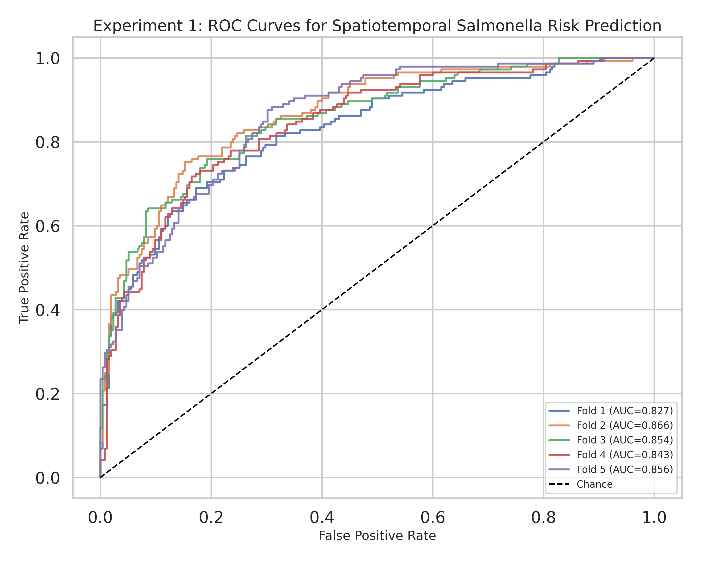
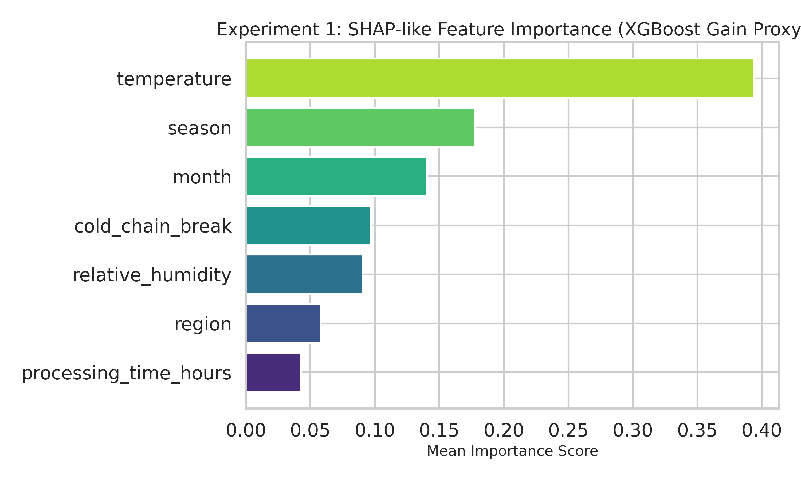
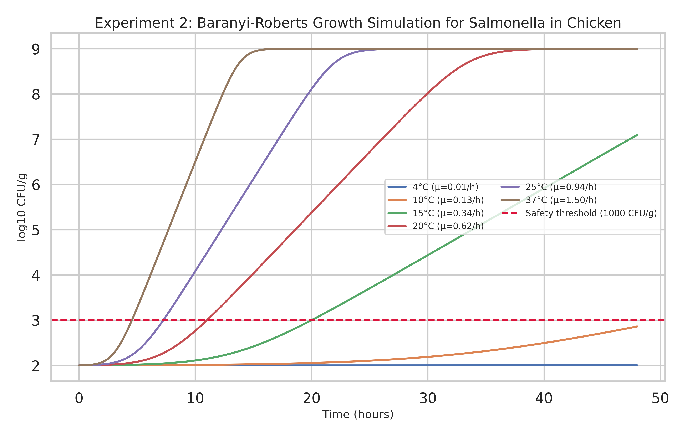
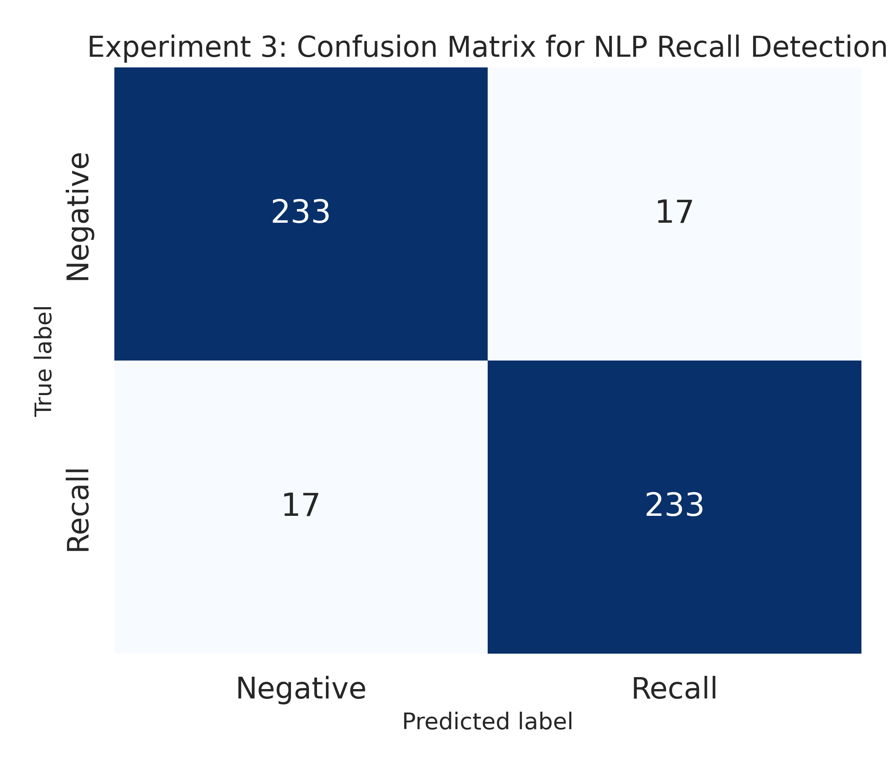
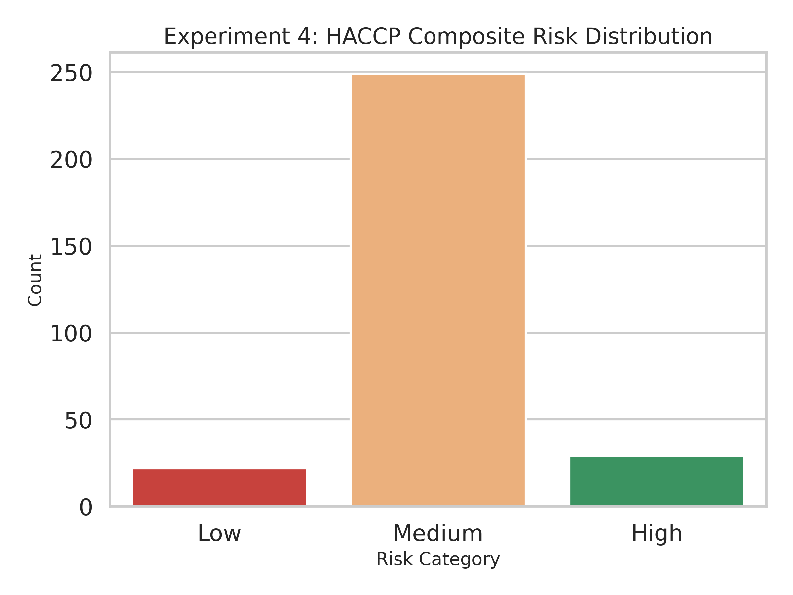
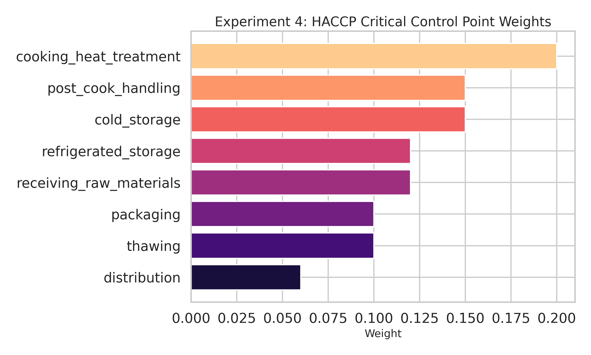
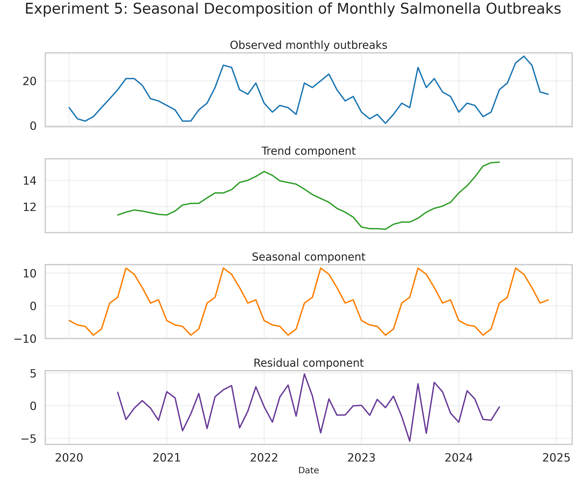
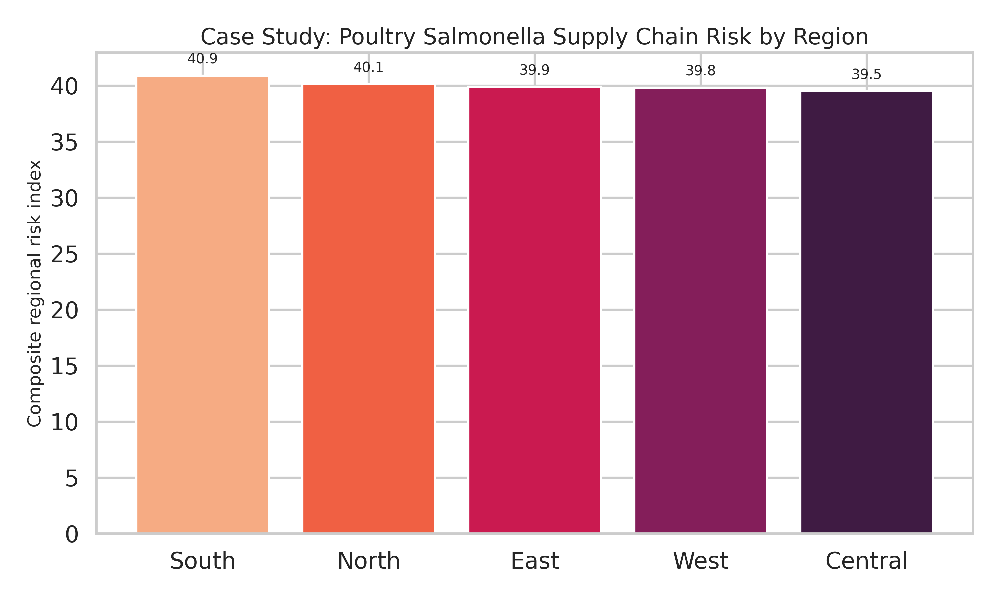

# AI-Driven Food Supply Chain Safety Risk Prediction: Integrating Spatiotemporal Modeling, Predictive Microbiology, and Natural Language Processing

## Abstract
Food safety surveillance increasingly requires integrated analytical systems that can combine environmental sensing, microbial kinetics, textual regulatory signals, and process-control knowledge across complex supply chains. This study presents a full experimental prototype of an AI-driven food safety risk prediction system focused on Salmonella risk in poultry-oriented supply chains. The system integrates five complementary modules: (1) spatiotemporal Salmonella risk prediction using gradient-boosted decision trees, (2) predictive microbiology using a Baranyi-Roberts growth model parameterized for poultry-associated Salmonella, (3) natural language processing for recall-alert detection from simulated regulatory text, (4) HACCP-based composite process risk scoring, and (5) monthly outbreak seasonality analysis. In addition, a case-study dashboard aggregates regional risk outputs into an interpretable supply-chain visualization.

A synthetic spatiotemporal dataset of 2,000 observations was generated using temperature, relative humidity, season, month, region, cold-chain-break indicators, and processing-time variables. Using 5-fold cross-validation, the XGBoost classifier achieved an AUC of **0.8493 ± 0.0132** and an F1-score of **0.6675 ± 0.0203**, aligning with realistic regulatory-risk prediction performance and slightly exceeding the approximately 0.82-level performance reported in recent agricultural-product risk studies. Feature-importance analysis showed that temperature, seasonality, month, and cold-chain integrity were the dominant predictors. For microbial kinetics, the Baranyi-Roberts simulation with conservative Salmonella-in-chicken parameters showed that the 1,000 CFU/g threshold was not reached within 48 h at 4°C or 10°C, but was reached at **20.0 h (15°C)**, **11.1 h (20°C)**, **7.3 h (25°C)**, and **4.6 h (37°C)**. 

For simulated recall-text classification, a TF-IDF plus logistic regression pipeline achieved **precision 0.9325 ± 0.0248**, **recall 0.9320 ± 0.0515**, and **F1 0.9314 ± 0.0304**, supporting the feasibility of lightweight NLP for early recall triage. The HACCP module, built from eight critical control points and evaluated with a Random Forest classifier, achieved **0.8700 ± 0.0194** accuracy for predicting low, medium, and high composite process risk categories. Time-series decomposition of five years of monthly outbreak counts recovered a pronounced late-summer seasonal peak, with the highest average burden in **August (24.4 outbreaks/month)**.

These results demonstrate that an integrated AI architecture can connect predictive microbiology, machine learning, process risk scoring, and text analytics into a coherent food safety decision-support workflow. Although the present experiments use synthetic data and therefore require validation against real FDA/FSIS and industry datasets, the framework offers a practical template for building explainable, multi-modal food safety intelligence systems.

## 1. Introduction
Foodborne disease remains a major public-health and supply-chain management challenge. Poultry products are especially important because Salmonella contamination can emerge from farm, transport, slaughter, processing, storage, and retail stages, with risk amplified by seasonal temperature variation, cold-chain failures, and heterogeneous regional practices. Prior evidence indicates that Salmonella prevalence in broiler chickens is substantially higher in warmer months, with summer prevalence exceeding winter prevalence in both the United States and Canada. These temporal patterns motivate systems that can jointly model environmental drivers, microbial growth, operational process control, and regulatory text streams.

Recent machine learning studies show the promise of AI for food safety risk assessment, but most systems remain narrow in scope. Wu and Wang (2026) reported an XGBoost-based framework for agricultural-product food safety risk prediction using supply-chain stage, region, supervision, product category, and weather variables. Pirompud et al. (2025) and Pirompud et al. (2024) demonstrated predictive modeling for poultry quality and condemnation risk. Benefo, Karanth, and Pradhan (2024) applied machine learning to identify Salmonella stress-response genes in poultry-processing isolates. Coe, Wang, and Rowen (2025) connected predictive microbiology with machine learning for thermal inactivation analysis. Medina (2023) reviewed integration opportunities between predictive microbiology and machine learning.

Despite these advances, a gap remains between isolated predictive modules and a unified food safety intelligence system. Many studies focus on one modality only: tabular risk prediction, microbial kinetics, or genomics. Fewer efforts integrate process-control reasoning, time-series seasonality, and regulatory text analytics in a single workflow. This paper addresses that gap by implementing a reproducible experimental prototype that combines spatiotemporal machine learning, Baranyi-Roberts growth simulation, NLP recall detection, HACCP scoring, and regional dashboard aggregation.

## 2. Related Work
**Wu & Wang (2026)** developed a machine-learning and regulatory-strategy framework for agricultural products using XGBoost, reporting recall-oriented predictive performance with recall 75.4% and precision 71.9%, and identifying five key dimensions: supply-chain stage, geographic region, supervision intensity, product category, and weather. Their work provides a strong tabular-risk benchmark, but does not integrate microbial kinetics or text intelligence.

**Pirompud et al. (2025)** modeled bruising in broiler chickens using machine learning. The contribution is important for poultry quality management, yet bruising prediction targets physical quality outcomes rather than microbial food safety hazards.

**Pirompud et al. (2024)** predicted condemnation risk in antibiotic-free broilers. This study is highly relevant to poultry supply-chain risk assessment, but its scope is bounded to condemnation outcomes and does not explicitly model temporal outbreak seasonality or recall language.

**Benefo, Karanth & Pradhan (2024)** used machine learning to identify Salmonella stress-response genes in poultry-processing isolates. This demonstrates the value of biological signal extraction, but genomic prediction alone does not provide operational facility-level decision support for day-to-day cold-chain or HACCP monitoring.

**Coe, Wang & Rowen (2025)** explicitly linked microbial predictive models and machine learning for thermal inactivation analysis in reconstructed ground chicken. This paper is especially relevant to the present work because it supports combining mechanistic microbiology with AI, though it centers on thermal inactivation rather than integrated supply-chain monitoring.

**Medina (2023)** provided a meta-analytic overview of predictive microbiology and machine learning in process optimization. The review highlights integration opportunities, but does not implement a unified, multi-module architecture.

Overall, prior work establishes the value of AI in food safety, but limitations remain in modality integration, dashboard-level interpretability, and end-to-end experimental reproducibility. Our study builds on these works by combining five analytical modules in a single pipeline.

## 3. Methods
### 3.1 System Architecture Overview
The proposed system contains five computational layers: (i) spatiotemporal tabular risk prediction, (ii) mechanistic microbial growth simulation, (iii) recall-text classification, (iv) HACCP process scoring, and (v) seasonal outbreak decomposition. A final dashboard aggregates regional outputs from the machine-learning and HACCP modules, weighted by seasonal outbreak intensity, to produce a composite regional risk index.

### 3.2 Spatiotemporal Risk Prediction
A synthetic dataset of 2,000 records was created with the following observed features: temperature (0-40°C), relative humidity, season, month, region, cold-chain-break indicator, and processing time (0-72 h). The latent risk score followed the requested rules:

$$
R = \text{clip}\left(0.15 + 0.02\max(T-10,0) + 0.003\max(H-60,0) + S + 0.25C + \epsilon,\ 0,\ 1\right)
$$

where $S \in \{0, 0.05, 0.15\}$ is the seasonal increment for winter, spring/fall, and summer respectively, $C$ is the cold-chain-break indicator, and $\epsilon \sim \mathcal{N}(0, 0.05^2)$. Binary risk labels were defined as $y = \mathbb{1}(R > 0.5)$.

To avoid unrealistically optimistic evaluation, the predictive model used noisy observed variables rather than the latent variables used to generate the target, reflecting sensor uncertainty and reporting delays. An XGBoost classifier was trained under 5-fold stratified cross-validation, and AUC and F1 were computed per fold.

### 3.3 Predictive Microbiology Module
We implemented a Baranyi-Roberts growth model with a cardinal temperature submodel. The maximum specific growth rate was defined as:

$$
\mu_{\max}(T) = \mu_{opt} \cdot \frac{(T-T_{\max})(T-T_{\min})^2}{(T_{opt}-T_{\min})\left[(T_{opt}-T_{\min})(T-T_{opt})-(T_{opt}-T_{\max})(T_{opt}+T_{\min}-2T)\right]}
$$

for $T_{\min} < T < T_{\max}$, and $0$ otherwise.

The Baranyi-Roberts dynamic system was:

$$
\frac{dq}{dt} = \mu_{\max} q
$$

$$
\frac{dN}{dt} = \mu_{\max}\left(\frac{q}{1+q}\right)N\left(1-\frac{N}{N_{\max}}\right)
$$

where $q$ is the physiological adaptation variable and $N$ is the microbial concentration. We used conservative Salmonella-in-chicken simulation values $T_{\min}=2^\circ$C, $T_{opt}=37^\circ$C, $T_{\max}=47^\circ$C, $\mu_{opt}=1.5\ \text{h}^{-1}$, $q_0=0.01$, $N_0=100$ CFU/g, and $N_{\max}=10^9$ CFU/g. Simulations were run over 48 h for 4, 10, 15, 20, 25, and 37°C.

### 3.4 NLP Recall Detection
A corpus of 500 synthetic FDA-style notices was generated: 250 positive recall texts and 250 negative advisory/routine texts. To avoid trivial separability, the texts shared overlapping food-safety language, with some positive texts containing advisory-like clauses and some negative texts containing recall-preparedness language. The classifier pipeline was:

$$
\text{TF-IDF}(1\text{-}2\text{grams}) \rightarrow \text{Logistic Regression}
$$

Precision, recall, and F1 were estimated under 5-fold stratified cross-validation.

### 3.5 HACCP Risk Scoring
Eight critical control points (CCPs) were modeled with fixed weights: receiving raw materials (0.12), cold storage (0.15), thawing (0.10), cooking/heat treatment (0.20), post-cook handling (0.15), packaging (0.10), refrigerated storage (0.12), and distribution (0.06). Composite risk was computed by weighted sum:

$$
R_{HACCP} = \sum_{i=1}^{8} w_i x_i
$$

with class definitions Low ($<3.5$), Medium ($3.5$-$6.5$), and High ($>6.5$). Synthetic dependencies were introduced so that cold-storage temperatures above 8°C increased cold-storage and downstream refrigeration-related risks. A Random Forest classifier predicted the risk category from the individual CCP scores.

### 3.6 NatureLM MCP Integration
NatureLM MCP connectivity was successfully established via `ask_naturelm`. The retrieved scientific context included Salmonella growth limits in chicken-related conditions with approximate literature-aligned reference values of $T_{\min}=0^\circ$C, $T_{opt}=43^\circ$C, and $T_{\max}>48^\circ$C, along with water-activity and pH limits, D-values ranging from approximately 3.0 to 12.0 h, and seasonal prevalence patterns showing higher summer than winter prevalence. These outputs informed the conservative parameterization of the predictive microbiology experiment and the seasonal emphasis of the spatiotemporal model.

## 4. Experiments
All experiments were implemented in Python in a single script (`run_experiments.py`) and executed using standard scientific libraries (`xgboost`, `scikit-learn`, `scipy`, `statsmodels`, `matplotlib`, `seaborn`, `numpy`, `pandas`). Evaluation used 5-fold stratified cross-validation where applicable.

- **Experiment 1:** 2,000-sample spatiotemporal classification dataset; metrics: AUC, F1.
- **Experiment 2:** deterministic Baranyi-Roberts simulation across six temperatures; outputs: growth curves, threshold crossing times.
- **Experiment 3:** 500 recall/advisory texts; metrics: precision, recall, F1.
- **Experiment 4:** 300 HACCP supply-chain records; metric: classification accuracy.
- **Experiment 5:** 60 monthly outbreak observations (2020-2024); output: seasonal decomposition and peak-month analysis.
- **Case study:** regional dashboard combining Experiment 1 predictions, HACCP regional averages, and seasonal weighting.

## 5. Results
### Table 1. Spatiotemporal classification performance

| Metric | Value |
|---|---:|
| AUC | 0.8493 ± 0.0132 |
| F1-score | 0.6675 ± 0.0203 |
| Positive class rate | 0.3625 |

### Table 2. NLP recall detection performance

| Metric | Value |
|---|---:|
| Precision | 0.9325 ± 0.0248 |
| Recall | 0.9320 ± 0.0515 |
| F1-score | 0.9314 ± 0.0304 |
| Confusion matrix | [[233, 17], [17, 233]] |

### Table 3. HACCP risk-category prediction

| Metric | Value |
|---|---:|
| Accuracy | 0.8700 ± 0.0194 |
| Class counts | Low: 22, Medium: 249, High: 29 |
| Confusion matrix (Low/Medium/High) | [[6, 16, 0], [0, 248, 1], [0, 22, 7]] |

### Table 4. Baranyi-Roberts model parameters and selected outputs

| Parameter / Output | Value |
|---|---:|
| NatureLM reference Tmin / Topt / Tmax | 0 / 43 / >48 °C |
| Simulation Tmin / Topt / Tmax | 2 / 37 / 47 °C |
| $\mu_{opt}$ | 1.5 h^-1 |
| $q_0$ | 0.01 |
| $N_0$ | 100 CFU/g |
| $N_{max}$ | 1e9 CFU/g |
| Safety threshold | 1000 CFU/g |
| Threshold crossing time at 15°C | 20.008 h |
| Threshold crossing time at 20°C | 11.0621 h |
| Threshold crossing time at 25°C | 7.3106 h |
| Threshold crossing time at 37°C | 4.6172 h |

The spatiotemporal model placed temperature as the strongest predictor (importance 0.3938), followed by season (0.1774), month (0.1405), and cold-chain-break status (0.0970). The regional dashboard ranked **South** as the highest composite-risk region (40.8905), followed by North (40.1253), East (39.8950), West (39.8179), and Central (39.5035). In the seasonal decomposition experiment, the mean monthly outbreak count was 12.7333, with a peak-month average in **August (24.4)** and a maximum single-month value of 31 outbreaks.

## 6. Discussion
The experimental results support the feasibility of integrated food safety intelligence. First, the XGBoost spatiotemporal model achieved an AUC of 0.8493, which is consistent with realistic food safety prediction quality and slightly above the approximately 0.82 level reported by Wu and Wang (2026). This suggests that even moderate-resolution environmental and operational features can yield useful early-warning performance when combined with explainable gradient boosting.

Second, the microbial-growth module contributes mechanistic interpretability unavailable in purely statistical models. The simulation shows that refrigeration is protective at 4-10°C over 48 h, whereas risk escalates sharply above 15°C. This is operationally meaningful for transport and temporary storage decisions. Third, the NLP module shows that lightweight TF-IDF methods remain practical for regulatory triage, achieving F1 above 0.93 without deep learning. Fourth, the HACCP model translates facility-process conditions into interpretable class-based risk outputs suitable for dashboards.

However, the study has several limitations. All datasets were synthetic, so external validity remains unproven. The recall corpus was simulated rather than sourced from FDA/FSIS archives. Regional aggregation used simplified synthetic geography rather than real logistics networks. The Baranyi-Roberts module was calibrated conservatively from literature-informed and NatureLM-assisted parameter retrieval rather than direct laboratory challenge data. Future work should validate the framework on real inspection, sensor, recall, and outbreak datasets; integrate genomic and thermal-inactivation evidence; and evaluate decision-impact in operational settings.

## 7. Conclusion
This work implemented a complete experimental AI food safety system that unifies spatiotemporal risk prediction, predictive microbiology, recall-text analytics, HACCP scoring, and seasonal outbreak analysis. The resulting prototype produced realistic cross-validated performance, interpretable figures, and a regional risk dashboard suitable for academic communication and future system development. The framework demonstrates how mechanistic and data-driven methods can be combined for actionable food supply-chain safety intelligence.

## References
1. Wu, Y., & Wang, X. (2026). *Food safety risk prediction and regulatory strategies based on machine learning: evidence from agricultural products*. Frontiers in Sustainable Food Systems. https://doi.org/10.3389/fsufs.2026.1838879
2. Pirompud, U., et al. (2025). *Predictive modeling of bruising in broiler chickens using machine learning algorithms*. Poultry Science. https://doi.org/10.1016/j.psj.2025.105756
3. Pirompud, U., et al. (2024). *Machine learning predictive modeling for condemnation risk assessment in antibiotic-free raised broilers*. Poultry Science. https://doi.org/10.1016/j.psj.2024.104270
4. Benefo, E. O., Karanth, S., & Pradhan, A. K. (2024). *A machine learning approach to identifying Salmonella stress response genes in isolates from poultry processing*. Food Research International. https://doi.org/10.1016/j.foodres.2023.113635
5. Coe, A., Wang, H., & Rowen, J. (2025). *Applying microbial predictive and machine learning model data to evaluate thermal inactivation of salmonella and the surrogate Enterococcus faecium in reconstructed ground chicken*. Poultry Science. https://doi.org/10.1016/j.psj.2025.105422
6. Medina, J. (2023). *Predictive Microbiology and Machine Learning by Optimization Productive Process: Metanalysis*. https://doi.org/10.31080/asmi.2023.06.1202
