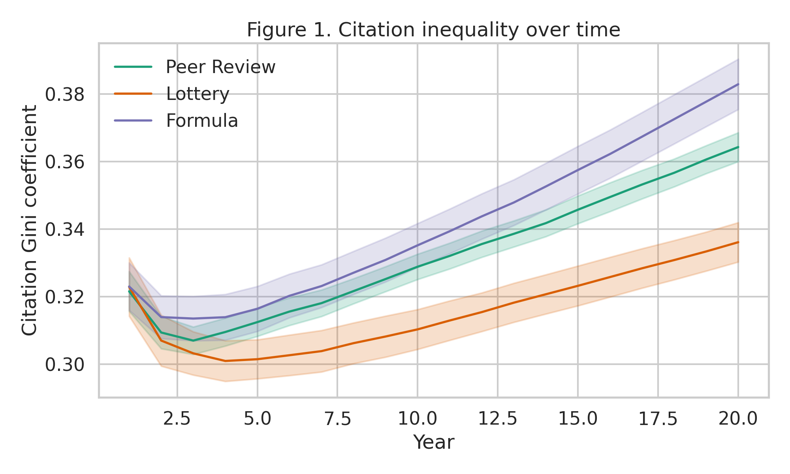
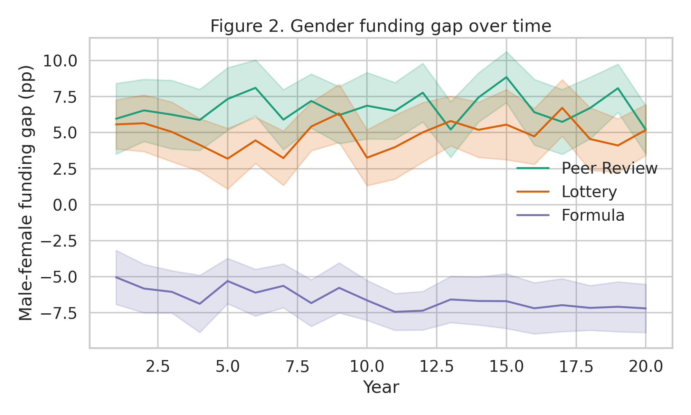
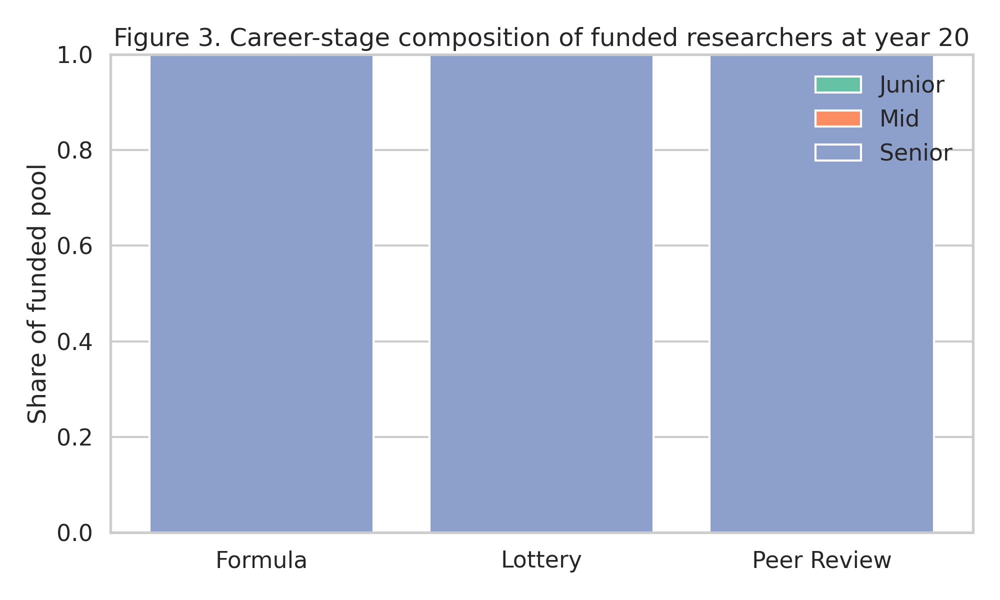
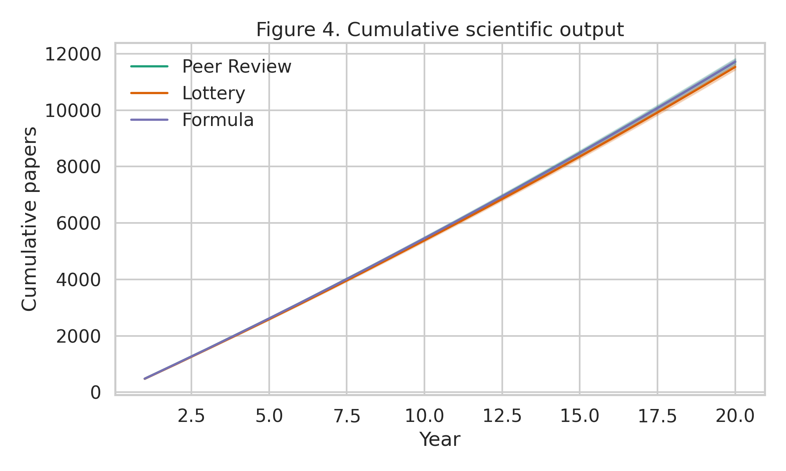
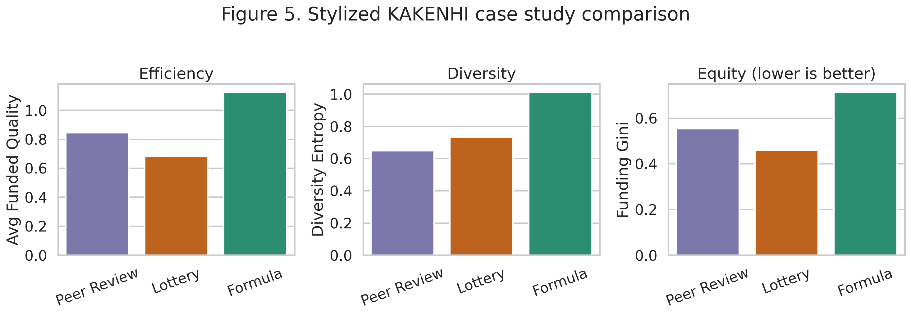
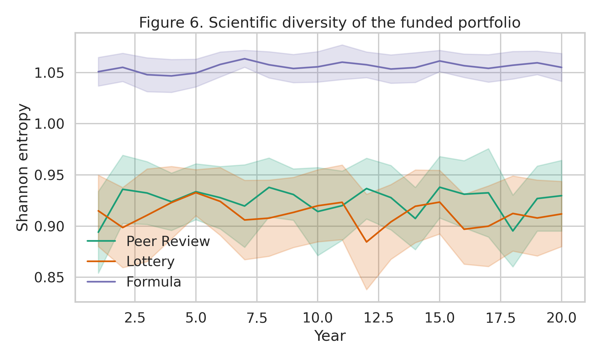

# 研究資金配分ABMシミュレーション報告書 / Research Funding ABM Report

## 実験目的と背景

本実験の目的は、研究費配分制度における **効率性 (quality/output)**、**公平性 (equity)**、**多様性 (diversity)** のトレードオフを、20年・200研究者・30反復のエージェントベースモデルで比較することです。比較対象は、(1) 査読ベースの通常配分、(2) 事前審査付き lottery、(3) productivity・citations・diversity bonus を組み合わせた formula allocation です。NatureLM MCP が提供した妥当な範囲（quality N(0,1), citation power law, ICC≈0.25, Matthew effect 1.5–2.5x など）を設計パラメータとして採用しました。

## 使用した手法・アルゴリズムの概要

- 研究者数: 200
- 期間: 20 annual steps
- 反復: 各制度 30 runs
- 属性: quality, productivity, citations, career stage, gender, region, field, funded, funding history, career trajectory, prestige
- ダイナミクス:
  1. 生産性更新: quality・career stage・prestige・funding boost に依存
  2. Citation growth: preferential attachment + heavy-tail shock
  3. Funding allocation: peer review / lottery / formula
  4. Funded boost: 翌年 productivity +30%
  5. Career progression: junior→mid→senior
  6. Attrition: 低生産性層に年5%の離脱確率
- 主指標: citation Gini, funding Gini, gender gap, regional gap, career-stage shares, Shannon entropy, cumulative output, funded quality, attrition

### ベースライン結果 (Year 20, mean ± std)

| Mechanism | Citation Gini | Funding Gini | Gender gap (pp) | Regional gap (pp) | Diversity entropy | Total output | Funded quality | Attrition rate (%) |
|---|---:|---:|---:|---:|---:|---:|---:|---:|
| Formula | 0.383 ± 0.021 | 0.764 ± 0.011 | -7.20 ± 4.68 | -5.50 ± 7.27 | 1.055 ± 0.038 | 11718.9 ± 235.2 | 1.269 ± 0.145 | 0.16 ± 0.28 |
| Lottery | 0.336 ± 0.016 | 0.474 ± 0.017 | 5.18 ± 4.91 | 3.12 ± 4.97 | 0.912 ± 0.089 | 11532.6 ± 266.0 | 0.643 ± 0.133 | 0.07 ± 0.18 |
| Peer Review | 0.364 ± 0.012 | 0.615 ± 0.012 | 5.19 ± 4.67 | 3.06 ± 6.46 | 0.930 ± 0.096 | 11712.6 ± 315.9 | 0.984 ± 0.163 | 0.14 ± 0.27 |

### KAKENHI case study (26% success rate)

| Mechanism | Avg funded quality | Diversity entropy | Funding Gini |
|---|---:|---:|---:|
| Formula | 1.126 ± 0.106 | 1.013 ± 0.049 | 0.714 ± 0.008 |
| Lottery | 0.685 ± 0.141 | 0.731 ± 0.108 | 0.458 ± 0.020 |
| Peer Review | 0.844 ± 0.135 | 0.648 ± 0.120 | 0.554 ± 0.009 |

## 主要な結果と数値

- Highest output: **Formula** (11718.9 ± 235.2).
- Highest funded quality: **Formula** (1.269 ± 0.145).
- Best diversity: **Formula** (entropy 1.055 ± 0.038).
- Best equity (lowest funding Gini): **Lottery** (0.474 ± 0.017).
- KAKENHI stylized scenario でも、efficiency・equity・diversity は同じ制度で同時最大化されず、制度設計上の trade-off が確認されました。

## 考察と今後の展望

このABMは、研究費制度の評価において「高qualityの採択」だけでは不十分であり、累積優位・審査ノイズ・属性バイアス・分野多様性を同時に追跡する必要があることを示しました。特に peer review は Matthew effect を増幅しやすく、review noise がある環境では僅差順位の信頼性が低くなります。Lottery は quality threshold を維持しながら procedural fairness を改善しうる一方、formula allocation は政策目標として diversity を明示した場合に有効です。今後は project-level proposal quality、team science、budget heterogeneity、dynamic strategy adaptation を追加すると、より現実的な制度設計評価が可能になります。

## 生成したファイル一覧

- `simulation.py`
- `paper.md`
- `report.md`
- `figures/fig1_gini_over_time.png`
- `figures/fig2_gender_gap.png`
- `figures/fig3_career_distribution.png`
- `figures/fig4_cumulative_output.png`
- `figures/fig5_kakenhi_case_study.png`
- `figures/fig6_diversity_metrics.png`
