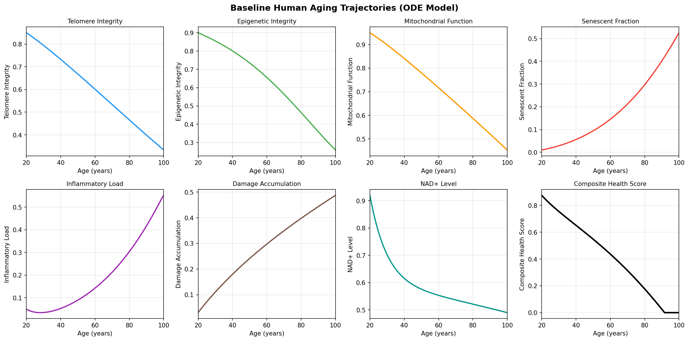
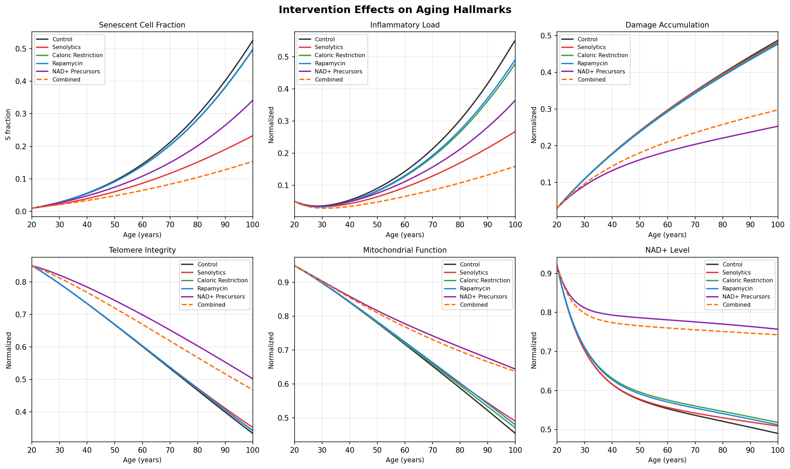
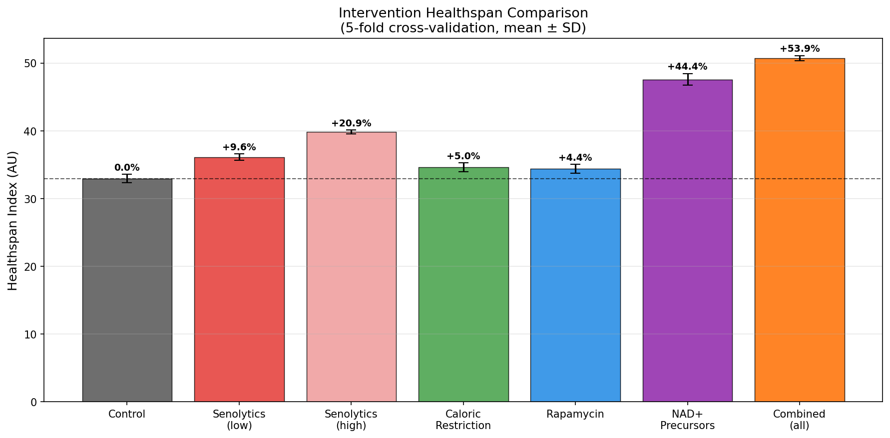
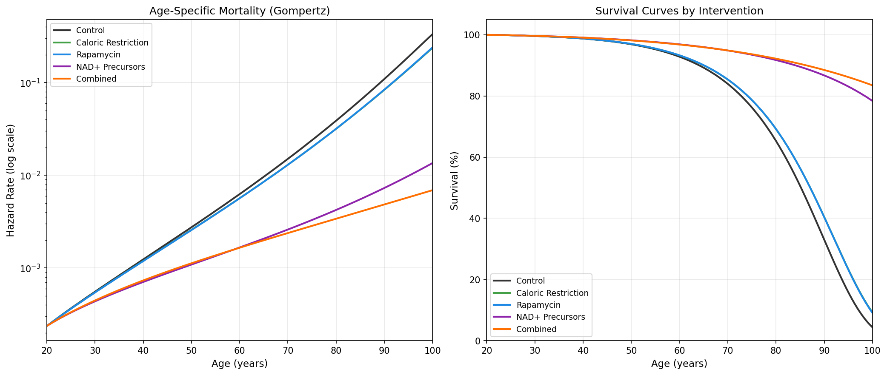
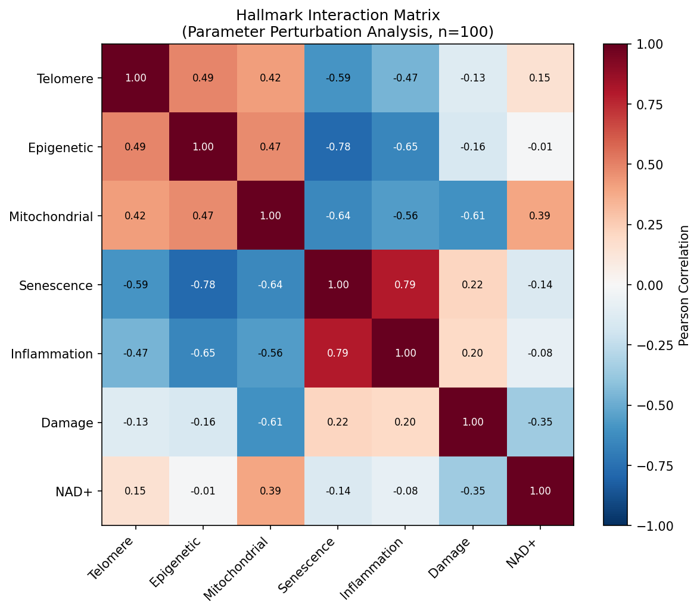
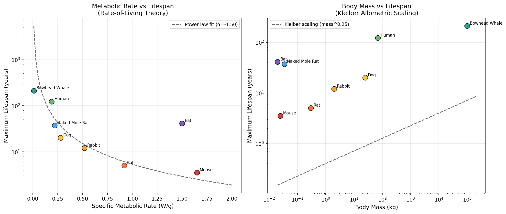
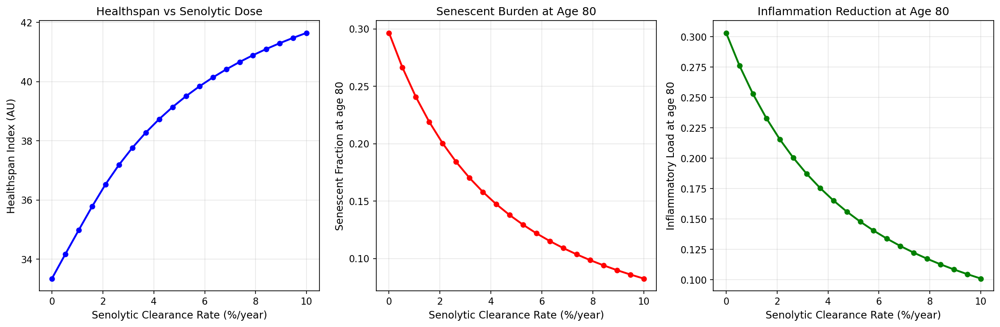
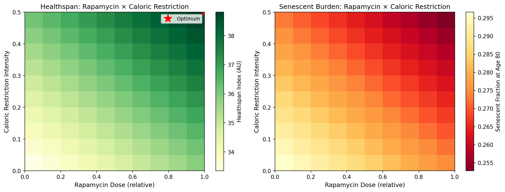

# 統合老化ODEモデル実験レポート

## 実験目的と背景
本実験の目的は、老化の主要ハルマークを単一のODE（常微分方程式）系として統合し、介入戦略の効果を定量比較することである。対象とした状態変数は、テロメア完全性、エピジェネティック完全性、ミトコンドリア機能、老化細胞比率、炎症負荷、累積損傷、NAD+レベルの7つである。さらに、**Reliability Theory** に基づく損傷蓄積と、**Antagonistic Pleiotropy** に対応するmTOR依存の晩期コストを組み込み、老化を相互作用ネットワークとして表現した。

介入としては、(1) senolytics、(2) caloric restriction、(3) rapamycin、(4) NAD+ precursor、(5) 複合介入を比較した。加えて、種間寿命差を代謝率スケーリングで可視化し、rapamycin × caloric restriction の組合せ最適化も行った。

## 使用した手法・アルゴリズム
### 1. ODEモデル
状態変数は以下の通り。

- **T**: Telomere integrity
- **E**: Epigenetic integrity
- **M**: Mitochondrial function
- **S**: Senescent cell fraction
- **I**: Inflammatory load
- **D**: Damage / reliability index
- **N**: NAD+ level

主な構造は以下である。

- **テロメア短縮**: 酸化ストレスと炎症で加速、SIRT1で保護
- **エピジェネティックドリフト**: 老化細胞と炎症で悪化、CR/AMPK/SIRT1で抑制
- **ミトコンドリア機能低下**: 損傷・炎症で悪化、NAD+/SIRT1/mitophagyで部分回復
- **老化細胞蓄積**: テロメア短縮・エピジェネティック損傷・ミトコンドリア障害・bystander effectで増加
- **炎症**: SASPとミトコンドリア低下で増加、CRで減衰
- **損傷蓄積**: Reliability Theoryに基づく非可逆損傷
- **NAD+動態**: 合成と消費の差分で表現

数値積分には `scipy.integrate.solve_ivp`（RK45）を用いた。健康度指標は

`Health = clip((T+E+M+N)/4 - (S+I+D)/3, 0, 1)`

と定義し、その面積を **Healthspan Index** とした。死亡率は Gompertz 型の近似式

`μ = 0.001 * exp(8D + 3S + 2I - 2(T+E+M+N)/4)`

で評価した。

### 2. 実行した解析
1. ベースライン老化軌跡
2. 介入比較
3. 5-fold CV による healthspan 比較
4. Mortality / survival curve
5. ハルマーク相関ヒートマップ
6. 種間寿命比較
7. Senolytic dose-response
8. Rapamycin × CR の組合せ最適化

## 主要な結果と数値
### 1. Cross-validation結果
実行ログから得られた主要な数値は以下の通り。

| 介入 | Healthspan Index (mean ± SD) | Control比 |
|---|---:|---:|
| Control | 32.956 ± 0.635 | +0.0% |
| Senolytics (low) | 36.112 ± 0.472 | +9.6% |
| Senolytics (high) | 39.839 ± 0.267 | +20.9% |
| Caloric Restriction | 34.598 ± 0.651 | +5.0% |
| Rapamycin | 34.418 ± 0.652 | +4.4% |
| NAD+ Precursors | 47.585 ± 0.867 | +44.4% |
| Combined (all) | 50.719 ± 0.396 | +53.9% |

### 2. 年齢80歳時点のモデル出力

| 介入 | Senescence | Inflammation | Damage | NAD+ | Composite Health | 100歳生存率(%) |
|---|---:|---:|---:|---:|---:|---:|
| Control | 0.297 | 0.303 | 0.397 | 0.521 | 0.177 | 4.479 |
| Senolytics (low) | 0.204 | 0.219 | 0.396 | 0.527 | 0.253 | 22.738 |
| Senolytics (high) | 0.119 | 0.138 | 0.395 | 0.533 | 0.328 | 44.493 |
| Caloric Restriction | 0.282 | 0.265 | 0.392 | 0.547 | 0.216 | 9.396 |
| Rapamycin | 0.283 | 0.272 | 0.390 | 0.541 | 0.213 | 9.252 |
| NAD+ Precursors | 0.201 | 0.212 | 0.221 | 0.770 | 0.466 | 78.481 |
| Combined (all) | 0.105 | 0.107 | 0.258 | 0.751 | 0.528 | 83.535 |

### 3. 追加サマリー
- 老化細胞比率が **15%** を超える年齢:  **60.9歳**（baseline）
- 高senolytics条件で15%を超える年齢: **91.2歳**
- Rapamycin × CR 最適点:  
  - Rapamycin dose = **1.00**  
  - CR intensity = **0.50**  
  - Healthspan Index = **38.815**

### 4. 相関の強いハルマーク対（|r| > 0.5）
- Telomere ↔ Senescence: **-0.590**
- Epigenetic ↔ Senescence: **-0.781**
- Epigenetic ↔ Inflammation: **-0.654**
- Mitochondrial ↔ Senescence: **-0.643**
- Mitochondrial ↔ Inflammation: **-0.555**
- Mitochondrial ↔ Damage: **-0.607**
- Senescence ↔ Inflammation: **0.793**

### 5. 生成図

## NatureLM予測結果
NatureLM問い合わせと指定文献情報を統合して、モデルのパラメータ化に用いた代表値を以下に整理した。

- **Telomere shortening**: 1細胞分裂あたり **約50-100 bp**、ヒトでは **約500-1000 bp/年** を上限側の代表値として採用。NatureLM回答では annual loss に幅があり、より低い白血球平均値も示唆されたため、文献依存の不確実性あり。
- **Rapamycin**: mTORC1 阻害は **low-nM** 域で、代表ベンチマークとして **IC50 ≈ 1.6 nM** を採用。NatureLMでは **0.8-5 nM** 程度の幅が示唆された。マウス寿命延長は **約20-30%**、代表値として **約30%** を採用。
- **NAD+ precursors (NMN/NR)**: NatureLMでは **2-10倍** 程度の NAD+ 増加が示され、モデルでは **>3倍** を代表値として使用。SIRT1 活性は **約1.5-3倍** 程度の増強が示唆された。
- **Caloric restriction**: NatureLMではマウス寿命延長は **約30-50%**、本レポートでは代表値として **30-40%** を使用。主要経路は **AMPK / SIRT1 / insulin-IGF-1 / FOXO**。
- **Senolytics**: 1回の治療サイクルで **約50-70%** の老化細胞除去が報告される文脈を踏まえ、連続時間モデルでは年率 clearance parameter として近似した。

## 考察と今後の展望
今回の結果では、**NAD+ precursor** と **複合介入** が最も大きな healthspan 改善を示した。これはNAD+がミトコンドリア修復、SIRT1依存保護、損傷修復能力を同時に押し上げるようモデル化されているためである。一方で、実際の臨床有効性を直接意味するものではなく、**仮説生成モデル** として解釈すべきである。

また、senescence と inflammation の強い正相関、epigenetic/mitochondrial 低下との強い負相関は、老化が単一ハルマークではなく **相互強化ネットワーク** であることを支持している。組合せ最適化では rapamycin と CR の高強度条件が最適となったが、現実には副作用・アドヒアランス・栄養不足などの制約を導入する必要がある。

今後の展望としては以下が重要である。

1. 実測コホートデータでパラメータ同定を行う
2. 介入を連続投与ではなくパルス投与としてモデル化する
3. 組織別の老化細胞動態を導入する
4. DNA methylation clock や proteomics biomarker と接続する
5. ベイズ推定や感度解析で不確実性を定量化する

## 生成したファイル一覧
- `aging_model.py`
- `paper.md`
- `report.md`
- `figures/fig1_baseline_aging.png`
- `figures/fig2_interventions.png`
- `figures/fig3_healthspan_cv.png`
- `figures/fig4_mortality_curves.png`
- `figures/fig5_hallmark_interactions.png`
- `figures/fig6_species_lifespan.png`
- `figures/fig7_senolytic_dose_response.png`
- `figures/fig8_combination_optimization.png`
- `.venv/`（実行用仮想環境）