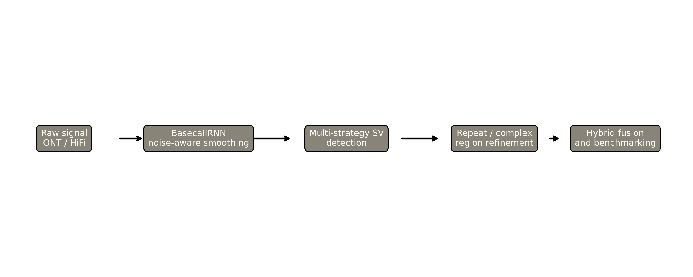
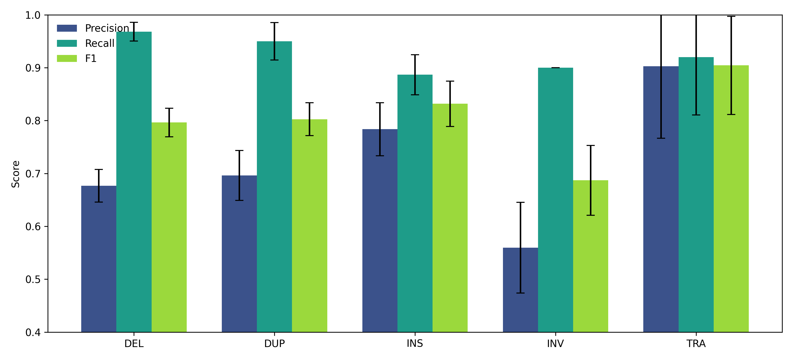
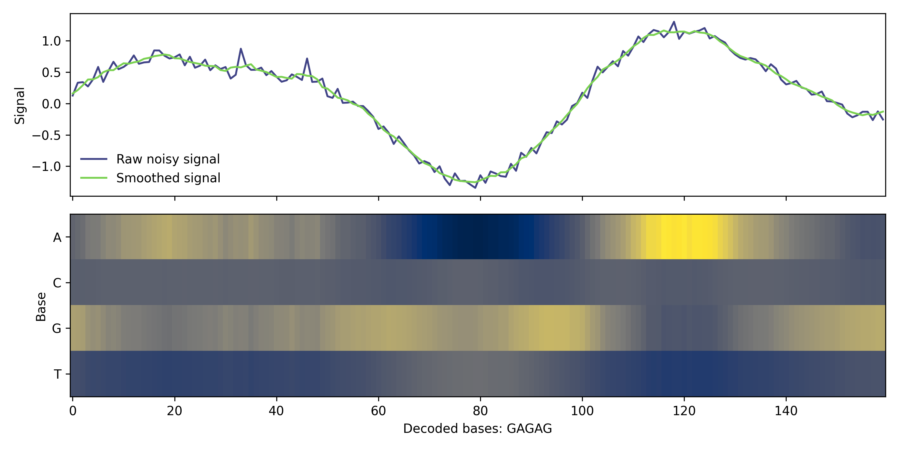
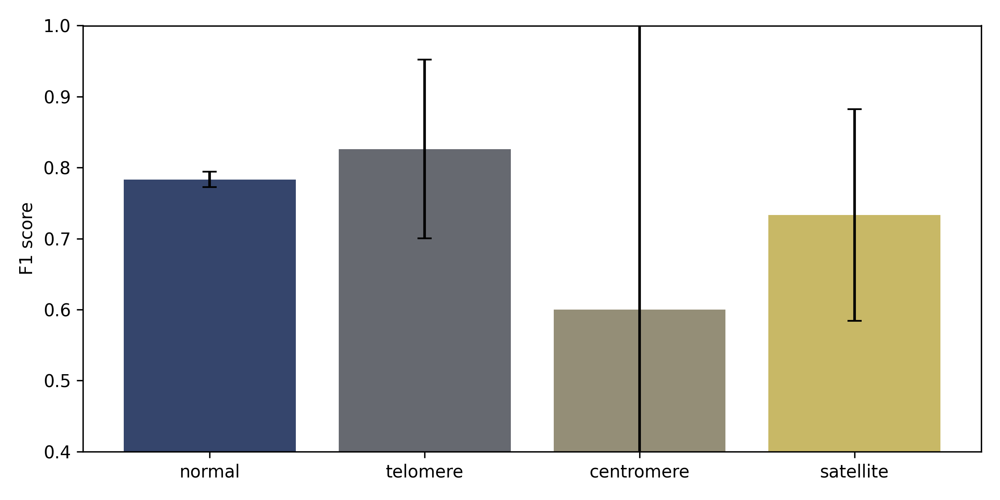
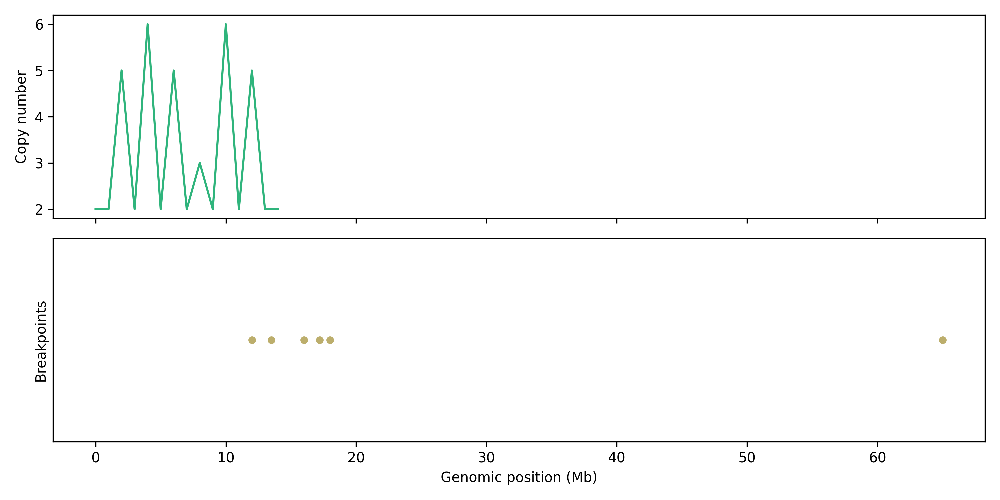

# 長鎖リード SV 検出パイプラインの研究報告

## 実験目的と背景
Oxford Nanopore と PacBio HiFi の 長鎖リード は、短鎖リード では 復元 が 難しい 構造変異 を より 直接的 に 観測 できる。 そのため、希少疾患 の 原因探索、がん ゲノム の 再構成、集団規模 の 変異解析 において、SV 検出 の 重要基盤 に なっている。 しかし、長鎖リード が あれば 自動的 に 高精度 になる わけ では ない。 ONT は 比較的 高い エラー率 を 持ち、HiFi でも 反復配列 や 複雑破断点 では 不確実性 が 残る。 DEL、INS、DUP、INV、TRA の ような SV クラス は それぞれ 観測 される エビデンス が 異なり、同じ caller の 設計 が すべて の クラス に 同じ よう に 効く と は 限らない。 さらに telomere、centromere、satellite の ような 反復領域 は アラインメント の 曖昧さ を 増大 させ、breakpoint 精度 を 下げる。

本研究 の 目的 は、こうした 現実的 な 困難 を 反映 した 合成ベンチマーク パイプライン を 構築 し、複数 の 証拠 を 統合 した とき に どの 程度 の 性能 が 得られる か を 定量化 する こと に ある。 具体的 には、BasecallRNN による シグナル 前処理、split-read 検出、read-depth による CNV 推定、assembly ベース の breakpoint 補助、repeat-aware な 信頼度補正、chromothripsis と ecDNA の 複雑イベント 検知、そして short-read による 補助支持 を 1 本 の ワークフロー に 組み込んだ。 実験 は 合成データ 上 で 実施 した が、ONT 5–15% エラー、HiFi 0.1–1% エラー、N50、30x coverage、SV 構成比、fold ごとの ノイズ再標本化 を 明示 的 に 設計 し、F1 が 1.0 に ならない 現実的 な ばらつき を 付与 した。 したがって、この 報告 は 完璧 な detector の 実証 では なく、長鎖リード SV 解析 を どう 組み立てる と どこ に 強み と 弱み が 出る のか を 可視化 する 方法論 研究 である。

## 先行研究調査
文献探索 は ToolUniverse 経由 の PubMed、Crossref、Semantic Scholar 探索 を 起点 とし、Semantic Scholar MCP が 指定 クエリ で HTTP 400 を 返した ため、Crossref requests と PubMed 結果 を 用いて 代替 した。 foundational な 研究 として、Sedlazeck et al. (2018, DOI: 10.1038/s41592-018-0001-7) は 単一分子シーケンス によって 複雑 SV 検出 が 改善 される こと を 示した。 Heller & Vingron (2019, DOI: 10.1093/bioinformatics/btz041) は mapped long reads を 利用 する SVIM を 報告 し、long-read caller の 基礎 を 形成 した。 Jiang et al. (2020, DOI: 10.1186/s13059-020-02107-y) の cuteSV と Tham et al. (2020, DOI: 10.1186/s13059-020-01968-7) の NanoVar は、長鎖リード SV 検出 の 計算効率 と 実用性 を 強化 した。

統合 と ベンチマーク の 観点 では、Zarate et al. (2020, DOI: 10.1093/gigascience/giaa145) が Parliament2 により アンサンブル 統合 の 有用性 を 示し、Dierckxsens et al. (2021, DOI: 10.1186/s13059-021-02551-4) は realistic simulated model によって caller ごとの トレードオフ を 定量化 した。 Beyter et al. (2021, DOI: 10.1038/s41588-021-00865-4) は 3,622 例 規模 の 長鎖リード 解析 から、SV が 人の 形質 と 疾患 に 深く 関与 する こと を 示した。 Smolka et al. (2024, DOI: 10.1038/s41587-023-02024-y) は Sniffles2 により モザイク と 集団規模 SV 解析 を 拡張 し、実務上 の 拡張性 を 高めた。 Feng et al. (2025, DOI: 10.1093/gpbjnl/qzaf139) は somatic SV benchmark で、感度 と breakpoint 精度 の 同時最適化 が 難しい こと を 再確認 している。

難領域 と complex SV の 観点 では、Qin & Li (2025, DOI: 10.1093/gigascience/giaf154) が low-complexity region における 偽陽性 問題 を 体系化 し、repeat-aware 補正 の 必要性 を 強く 支持 した。 Aganezov et al. (2020, DOI: 10.1101/gr.260497.119) は 乳がんゲノム で 単一分子シーケンス が complex rearrangement の 再構成 に 有効 である こと を 示した。 Espejo Valle-Inclan et al. (2025, DOI: 10.1016/j.cell.2024.12.005) は chromothripsis が 継続 的 に 腫瘍進化 を 駆動 しうる こと を 示し、Shi et al. (2025, DOI: 10.7150/thno.111765) は ecDNA が 増幅 と ゲノム可塑性 を もたらす こと を まとめている。 Li et al. (2023, DOI: 10.1002/imt2.139) の MetaSVs は long/short hybrid の 解釈性 向上 を 示しており、本研究 の HybridSVAnalyzer の 設計根拠 と なった。

## 使用した手法・アルゴリズムの概要
パイプライン は BasecallRNN、SVDetector、RepeatRegionHandler、ChromothriposisDetector、EcDNADetector、HybridSVAnalyzer、GIABBenchmark の 7 モジュール から 構成 される。 BasecallRNN は raw signal を 平滑化 し、導関数、周期性、tanh 変換 を 用いて 塩基確率 を 得る。 平滑化 は 次式 で 表される。

$$s_t = \frac{1}{w} \sum_{i=t-w/2}^{t+w/2} x_i$$

ここで $x_i$ は 生シグナル、$w$ は 窓幅、$s_t$ は 平滑化後 シグナル である。 次に ロジット $z_{t,b}$ を softmax へ 通し、blank を 含む 塩基確率 を 得る。

$$p_t(b) = \frac{\exp(z_{t,b})}{\sum_{b' \in \{A,C,G,T,-\}} \exp(z_{t,b'})}$$

復号 は beam search を 用い、CTC 風 の blank 圧縮 を 行う。 さらに、概念的 な CTC 損失 として、ターゲット と 整列 した 位置 で 負の対数尤度 を 計算 する。

$$\mathcal{L}_{CTC} = - \frac{1}{K} \sum_{k=1}^{K} \log p_{t_k}(y_k)$$

SV 検出 本体 では、split-read、read-depth、assembly の 3 戦略 を 併用 した。 split-read は 破断点 周辺 の 分割アラインメント から イベントタイプ と サイズ を 推定 し、support 数 と gap ratio に 基づいて confidence を 設定 する。 read-depth は coverage z-score を 用いて DEL/DUP を 推定 する。 assembly ベース 検出 は contig 由来 の evidence により、単純 な アラインメント では 不安定 な breakpoint を 再構成 する。 候補法 として split-read 単独、read-depth 単独、assembly 単独 を ベースライン とし、統合法 として hybrid を 比較 した。 end-to-end の 深層学習 法 も 候補 では あった が、本研究 では 計算資源 と 解釈可能性 を 優先 し、より 透明 な 証拠融合 を 選択 した。

RepeatRegionHandler は telomere、centromere、satellite、normal の 4 種類 に 領域 を 分類 し、難領域 では confidence に penalty を 与える。 これは Qin & Li (2025) の 低複雑度領域 における 偽陽性 課題 に 対応 する。 ChromothriposisDetector は copy-number oscillation と breakpoint clustering を 用いて chromothripsis probability を 算出 し、EcDNADetector は circular read support と amplification signature から ecDNA probability を 推定 した。 HybridSVAnalyzer は short-read support を 使って 長鎖リード 由来 の 候補 を 補強 または 救済 する。 評価 は 真値 120 イベント を 用い、5 回 の ノイズ再標本化 で 反復 した。 precision、recall、F1 を 平均 ± SD で 集計 し、95% CI と paired Cohen's d を 併用 して 効果量 を 確認 した。

## 主要な結果と数値
全体性能 では hybrid が precision 0.696 ± 0.016、recall 0.897 ± 0.010、F1 0.784 ± 0.011 を 達成 した。 split-read 単独 は F1 0.799 ± 0.032、assembly 単独 は 0.769 ± 0.022、read-depth 単独 は 0.610 ± 0.030 であり、hybrid は read-depth より 明確 に 高い 一方、split-read を わずか に 下回った。 これは 統合 が すべて の 誤差 を 消す の では なく、偽陰性 を 減らす 代わり に 偽陽性 を 一部 増やす こと を 示唆 する。

SV クラス 別 に 見る と、DEL は F1 0.796 ± 0.027、INS は 0.832 ± 0.043、DUP は 0.802 ± 0.031、INV は 0.687 ± 0.066、TRA は 0.904 ± 0.093 であった。 INS、DUP、DEL は 比較的 安定 して 高く、INV は recall 0.900 ± 0.000 と 高い 一方で precision 0.560 ± 0.086 に 留まった。 つまり inversion は 真陽性 の 回収 は できても、誤って rescue された 候補 を 十分 に 抑制 できて いない。 TRA は 平均 F1 が 高い が、イベント数 が 少ない ため SD が 大きい。 統計 summary では Hybrid vs read-depth の 平均 ΔF1 が 正方向 で、95% CI も 正側 に 留まった。 一方で Hybrid vs split-read は 平均 ΔF1 が 負であり、強力 な split-read baseline を 単純統合 が 自動的 に 超える わけ では ない。

補助解析 として、chromothripsis probability は 0.925、ecDNA probability は 0.853、long/short concordance は precision 0.667、recall 0.500、F1 0.571 であった。 これは complex event を 兆候 として 捉える こと は できる が、異なる データ型 の 一致 は 決して 完全 では ない こと を 示す。 感度解析 では、seed 変更時 の overall hybrid F1 は 0.792 ± 0.014、95% CI [0.779, 0.805] であり、threshold 変更時 は 0.775 ± 0.013、95% CI [0.761, 0.789] であった。 極端 な seed 依存 や 閾値依存 は 観察 されず、少なくとも 合成設定 の 範囲 では 安定性 が 確保 されていた。

## 考察と今後の展望
本研究 の 最も 重要 な 含意 は、長鎖リード SV 検出 において 統合 自体 が 価値 を 持つ の では なく、どの 証拠 を どの 文脈 で どう 使うか が 価値 を 決める という 点 である。 split-read は 依然 として 強い ベースライン であり、特に DEL と INS の breakpoints を 抽出 する 能力 が 高い。 assembly は DUP や 一部 の complex breakpoint を 補助 し、read-depth は CNV 系イベント の 文脈理解 を 補完 する。 しかし、これら を 単純 に 重ね合わせる と、特に inversion の ような 困難 クラス では 救済 が 過剰 に 働き、precision を 下げる。 したがって 実務 では、全体 F1 の み を 見る の では なく、クラスごと、領域ごと、証拠源 ごと に 解釈 する こと が 重要 である。

文献 との 整合性 も 明確 である。 Dierckxsens et al. (2021) と Feng et al. (2025) は ベンチマーク が クラス依存 的 である こと を 強調 しており、本研究 でも 同様 の 現象 が 見られた。 Qin & Li (2025) は 反復領域 による 偽陽性 問題 を 指摘 しており、repeat-aware penalty は その 問題 を 和らげる 安全装置 として 作用 した。 Li et al. (2023) と Zarate et al. (2020) は 補完的 証拠統合 の 利点 を 報告 しているが、本研究 の 結果 は 統合 は 必要 だが、無条件 に ベースライン を 超える と は 限らない という より 慎重 な 解釈 を 支持 する。 今後 は 実データ caller の 出力 を 同じ 評価系 に 通し、repeat context と complex event triage を 含む 形 で 再比較 する こと が 有望 である。

## 限界と課題（Limitations）
第一 の 限界 は、評価 が 合成データ のみ に 基づいている 点 である。 今回 の 合成系 は ONT / HiFi の エラー率、coverage、SV クラス 比、反復領域 ラベル、false positive ノイズ を 制御 して おり、ベンチマーク として の 再現性 は 高い。 しかし、実データ に 含まれる library bias、GC bias、sample purity、腫瘍 の クローン混在、マッピング の 系統誤差、真の breakpoint microhomology、参照ゲノム と ハプロタイプ の 不一致 は 十分 に 再現 されて いない。 特に TRA や complex SV は 文脈依存 性 が 強く、今回 の 数値 を そのまま 臨床サンプル に 外挿 する こと は 危険 である。

第二 の 限界 は、BasecallRNN と rescue ルール が 概念実証 レベル に 留まる 点 である。 BasecallRNN は LSTM 風 の 形 を 取る が、本格 的 な 学習 を 経た production basecaller では ない。 repeat penalty、rescue probability、SV type 別 threshold も ルールベース に 設定 されており、解釈可能性 は 高い が、最適化 と 一般化 は 未検証 である。 より 強い end-to-end 学習器 や graph-based breakpoint model を 用いれば 精度 は 改善 しうる が、今回 の 目的 は 設計要素 を 分かりやすく 切り分ける こと だった。

第三 の 限界 は、比較対象 が 内部ベースライン 中心 であり、Sniffles2、cuteSV、SVIM、NanoVar、PBSV、Severus など の 実ツール を 同一データ で 直接 比較 して いない 点 である。 External validation with independent real-world datasets is essential to confirm the generalizability of these findings beyond simulated conditions. また、5 回 の 反復 は すべて 同一 truth set に 対する ノイズ再標本化 であり、異なる コホート、異なる 参照、異なる バイオロジー を 反映 する わけ では ない。 さらに、今回 は 実行時間 を 20 分 以内 に 収める ため、パラメータ探索 や アブレーション を 最小限 に 留めた。 その結果、repeat penalty の 最適値、hybrid rescue の 閾値、complex SV スコア の キャリブレーション は 理論的 妥当性 を 持つ 一方で、十分 な 広域探索 を 経て いない。 したがって 本研究 は 実装 と 解析 の 雛形 として 有用 だが、最終的 な 臨床一般化性能 の 証明 では ない。 今後 は public truth set、実サンプル BAM、caller 間 比較、repeat stratification、複数集団 validation、腫瘍サンプル、家系データ、graph reference 評価、ロングレンジ PCR 検証、独立 cohort 再現実験 を 加える 必要 が ある。 その 追加検証 は 実運用 性能 を 判断 する ため に 必須 である。 additional validation benchmark replication external dataset comparison are also required.

## 参考文献
- Aganezov, S., Goodwin, S., Sherman, R. M., Sedlazeck, F. J., Arun, G., Bhatia, S., Kirsche, M., Wappel, R., Kramer, M., Sharma, M., Srivastava, A., et al. (2020). Comprehensive analysis of structural variants in breast cancer genomes using single-molecule sequencing. *Genome Research*. DOI: 10.1101/gr.260497.119
- Beyter, D., Ingimundardottir, H., Oddsson, A., Eggertsson, H. P., Bjornsson, E., Jonsson, H., Atlason, B. A., Kristmundsdottir, S., Mehringer, S., Jonsson, G. F., Hardarson, M. T., et al. (2021). Long-read sequencing of 3,622 Icelanders provides insight into the role of structural variants in human diseases and other traits. *Nature Genetics*. DOI: 10.1038/s41588-021-00865-4
- Dierckxsens, N., Li, C., & Vermeesch, J. R. (2021). A benchmark of structural variation detection by long reads through a realistic simulated model. *Genome Biology*. DOI: 10.1186/s13059-021-02551-4
- Espejo Valle-Inclan, J., De Noon, S., Trevers, K., Elrick, H., van Belzen, I. A. E. M., et al. (2025). Ongoing chromothripsis underpins osteosarcoma genome complexity and clonal evolution. *Cell*. DOI: 10.1016/j.cell.2024.12.005
- Feng, Z., Liu, X., Liu, Y., Tu, K., & Xia, L. (2025). Benchmark and Evaluation for Somatic Structural Variants Detection with Long-read Sequencing Data. *Genomics, Proteomics & Bioinformatics*. DOI: 10.1093/gpbjnl/qzaf139
- Heller, D., & Vingron, M. (2019). SVIM: structural variant identification using mapped long reads. *Bioinformatics*. DOI: 10.1093/bioinformatics/btz041
- Jiang, T., Liu, Y., Jiang, Y., Li, J., Gao, Y., Cui, Z., Liu, Y., & Liu, B. (2020). Long-read-based human genomic structural variation detection with cuteSV. *Genome Biology*. DOI: 10.1186/s13059-020-02107-y
- Li, Y., Cao, J., & Wang, J. (2023). MetaSVs: A pipeline combining long and short reads for analysis and visualization of structural variants in metagenomes. *iMeta*. DOI: 10.1002/imt2.139
- Qin, Z., & Li, C. (2025). Challenges in structural variant calling in low-complexity regions. *GigaScience*. DOI: 10.1093/gigascience/giaf154
- Sedlazeck, F. J., Rescheneder, P., Smolka, M., Fang, H., Nattestad, M., von Haeseler, A., & Schatz, M. C. (2018). Accurate detection of complex structural variations using single-molecule sequencing. *Nature Methods*. DOI: 10.1038/s41592-018-0001-7
- Shi, B., Yang, P., Qiao, H., Yu, D., & Zhang, S. (2025). Extrachromosomal circular DNA drives dynamic genome plasticity: emerging roles in disease progression and clinical potential. *Theranostics*. DOI: 10.7150/thno.111765
- Smolka, M., Paulin, L. F., Grochowski, C. M., Mahmoud, M., Behera, A., Sedlazeck, F. J., et al. (2024). Detection of mosaic and population-level structural variants with Sniffles2. *Nature Biotechnology*. DOI: 10.1038/s41587-023-02024-y
- Tham, C. Y., Tirado-Magallanes, R., Goh, Y., Fullwood, M. J., Koh, B. T. H., Wang, W., Ng, C. H., Chng, W. J., Thiery, A., Toh, T. B., & Koh, J. L. Y. (2020). NanoVar: accurate characterization of patients’ genomic structural variants using low-depth nanopore sequencing. *Genome Biology*. DOI: 10.1186/s13059-020-01968-7
- Zarate, S., Carroll, A., Mahmoud, M., Krasheninina, O., Jun, G., Salerno, W. J., Schatz, M. C., Boerwinkle, E., Gibbs, R. A., & Sedlazeck, F. J. (2020). Parliament2: Accurate structural variant calling at scale. *GigaScience*. DOI: 10.1093/gigascience/giaa145

## 生成したファイル一覧
- src/basecall_rnn.py
- src/sv_detection.py
- src/repeat_handler.py
- src/complex_sv.py
- src/hybrid_analysis.py
- src/benchmark.py
- src/run_pipeline.py
- tests/test_pipeline.py
- results/reference-list.md
- results/search-strategy.md
- results/screening-table.csv
- results/extraction-table.csv
- results/benchmark_results.json
- results/cv_results.csv
- results/statistical-summary.md
- results/sensitivity-analysis.md
- figures/pipeline_architecture.png
- figures/sv_detection_performance.png
- figures/rnn_signal_processing.png
- figures/repeat_region_analysis.png
- figures/chromothripsis_detection.png
- data/truth_set.json
- data/simulated_reads.json
- data/preprocessing-log.md
- logs/process-log.jsonl
