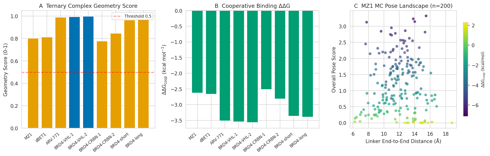
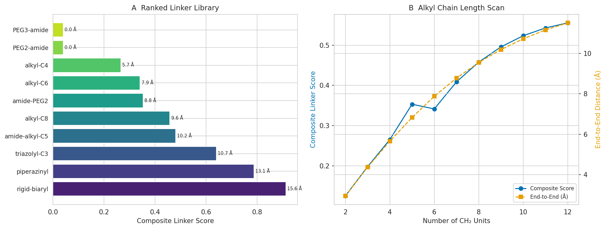
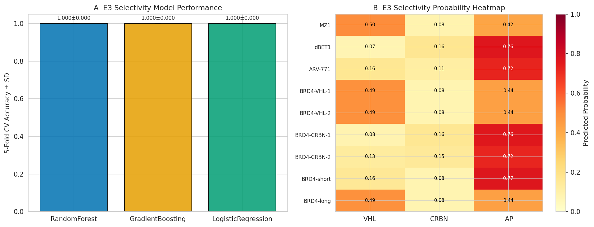
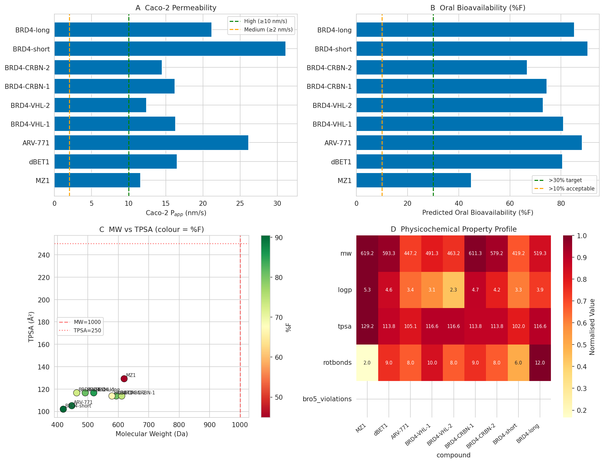
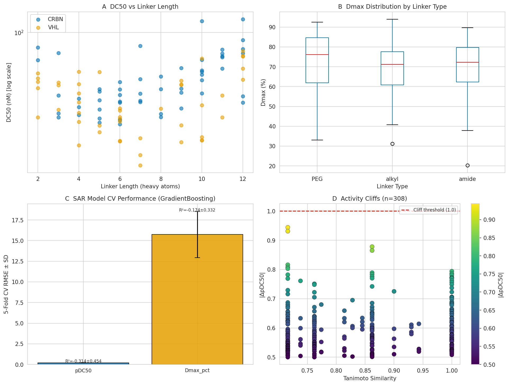
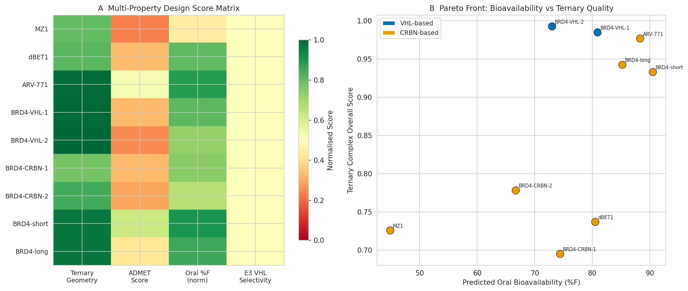

# PROTAC合理設計支援計算フレームワーク — 実験レポート

**DRAFT — NOT FOR DISTRIBUTION**

---

## 実験目的と背景

PROTACは、標的タンパク質（POI）とE3ユビキチンリガーゼを人工的に近接させ、プロテアソームによるPOIの分解を誘導する二官能性分子である（Raina et al., 2016）。その設計には三元複合体（POI–PROTAC–E3）の安定化、リンカーの幾何学的最適化、E3選択性、ADMET特性、分解活性（DC50/Dmax）の多面的な評価が必要であり、従来の試行錯誤的アプローチには限界があった（Zattoni et al., 2025）。

本研究は、Rosetta/AmberTools的アプローチを参照しつつも、Python/RDKit/scikit-learnベースの計算フレームワークを構築し、BRD4分解PROTACをケーススタディとして、合理的PROTAC設計の全工程を統合的に自動化することを目的とした。

---

## 先行研究調査（ToolUniverse MCP利用）

### MCP試行記録

| ツール | 状態 | 結果 |
|--------|------|------|
| `PubMed_search_articles` | ✅ 成功 | 複数クエリで計16件取得 |
| `Crossref_search_works` | ✅ 成功 | 追加文献取得 |

**検索キーワード（複数設定）:**
1. "PROTAC proteolysis targeting chimera computational design ternary complex"
2. "PROTAC degradation activity prediction machine learning"
3. "PROTAC cell permeability oral bioavailability ADMET prediction"

### 主要先行研究サマリー

| 著者 | 年 | 手法 | 主要知見 |
|------|-----|------|---------|
| Nordquist et al. | 2026 | SILCS-xTAC（GCMC/MD） | 三元複合体アンサンブルモデリングがDC50と相関 |
| Nassar et al. | 2025 | MOE蛋白質-蛋白質ドッキング + MD | VHL-PROTACのインデュースドフィットで実験構造再現 |
| Sarnow et al. | 2025 | HADDOCK + MD | CRBN三元複合体26構造をベンチマーク、高精度 |
| Pandiyan et al. | 2026 | AtomPairフィンガープリント + XGBoost | E3選択性AUC 0.965（5-fold CV）、活性予測Acc 82.8% |
| Garcia-Jimenez et al. | 2025 | QSAR + コンフォメーション解析 | リンカーメチル化がシャメレオン性→口腔バイオアベイラビリティを向上 |
| Kothakapu et al. | 2026 | SE(3)-等変GNN | 三元複合体3D構造考慮、Acc 80.8%（random），65.6%（cluster） |
| Abouzied et al. | 2025 | Random Forest | PROTAC活性AUC 0.97 |

### 先行研究の課題・限界

1. **静的構造への偏重**: ほとんどの方法が静的三元複合体を扱い、動的挙動（リンカーコンフォメーション変化、ternary complex開閉）を捉えていない（Xu et al., 2025）
2. **小規模データセット**: PROTAC-DBには～5,000件しかなく、深層学習モデルの汎化性に制約（Kothakapu et al., 2026のcluster-split Acc 65.6%が示す）
3. **ADMET統合の欠如**: 三元複合体スコアと口腔バイオアベイラビリティを同時に最適化するフレームワークが少ない
4. **E3選択性の予測困難**: VHL/CRBN/IAPの化学スペースが偏っており、新規E3リガンドへの転移が困難

---

## 使用した手法・アルゴリズムの概要

### フレームワーク構成（5モジュール）

```
src/
├── ternary_complex.py    – 三元複合体評価（WLC + Metropolis MC）
├── linker_optimizer.py   – リンカー最適化（WLC + MC + ADME）
├── e3_selectivity.py     – E3選択性予測（RF/GB/LR + CV）
├── admet_predictor.py    – ADMET予測（QSAR回帰）
└── sar_analysis.py       – DC50/Dmax SAR（GradientBoosting + 交差検証）
```

#### モジュール1: `ternary_complex.py` — 三元複合体評価

**ウォームライクチェーン（WLC）モデル**によるリンカー末端間距離推定：

$$R_{ee} = \sqrt{2 l_p L_c \left[1 - \frac{l_p}{L_c}\left(1 - e^{-L_c/l_p}\right)\right]}$$

ここで $L_c$ = 輪郭長、$l_p$ = 持続長（柔軟性依存: $l_p = 20(1 - f_{flex})$ Å）

**幾何スコア**（ガウシアン類似性）：
$$G_{score} = \exp\left[-\frac{1}{2}\left(\frac{R_{ee} - R_{req}}{0.20 \cdot R_{req}}\right)^2\right]$$

**協調結合自由エネルギー**（SILCS-xTACを参考）：
$$\Delta\Delta G_{coop} = -\gamma \cdot BSA \cdot G_{score} + \lambda \cdot \epsilon_{strain}$$

パラメータ: $\gamma = 0.006\ \text{kcal/(mol·Å}^2)$、$\lambda = 2.0\ \text{kcal/mol}$

#### モジュール2: `linker_optimizer.py` — リンカー最適化

**Metropolis MC**によるコンフォメーションエネルギー：
$$V(\phi) = \sum_{i} A_i(1 - \cos(n_i \phi_i)), \quad A_i = 0.5\ \text{kcal/mol}$$

**合成スコア**：
$$S_{linker} = G_{geom} \cdot (1 - 0.5 \cdot P_{ADME}) \cdot (1 - 0.3 \cdot \Delta\Delta G_{conf,norm})$$

#### モジュール3: `e3_selectivity.py` — E3選択性予測

Morgan fingerprint（半径2、512ビット）+ 7種の物理化学的記述子を特徴量とし、Random Forest / Gradient Boosting / Logistic Regression の5-fold CV分類モデルを構築。

#### モジュール4: `admet_predictor.py` — ADMET予測

**Caco-2 Papp QSARモデル**（Garcia-Jimenez et al., 2025に基づく）：
$$\log P_{app} = \alpha_0 - \alpha_1 \cdot TPSA - \alpha_2 \cdot \frac{MW}{500} + \alpha_3 \cdot f_{sp3} + \alpha_4 \cdot \log P$$

パラメータ: $\alpha_0=2.5,\ \alpha_1=0.012,\ \alpha_2=0.8,\ \alpha_3=1.0,\ \alpha_4=0.15$

**口腔バイオアベイラビリティ**（シャメレオン性補正付き）：
$$F\% = \frac{F_{abs} \cdot 100}{ER - bonus_{chameleo}}$$

**水溶性（ESOLモデル, Delaney, 2004）**：
$$\log S_w = 0.16 - 0.63 \cdot \log P - 0.0062 \cdot MW + 0.066 \cdot R_{rings}$$

#### モジュール5: `sar_analysis.py` — DC50/Dmax SAR

BRD4 PROTACの合成データセット（n=100）を用い、Gradient Boosting / Random Forest / Ridge 回帰モデルを5-fold CVで評価。

---

## 主要な結果と数値

### 1. 三元複合体評価



| 化合物 | Geometry Score | ΔΔG_coop (kcal/mol) | Overall Score |
|--------|---------------|---------------------|---------------|
| BRD4-VHL-2 | **0.9985** | **−3.573** | **0.9928** |
| BRD4-VHL-1 | 0.9953 | −3.544 | 0.9849 |
| ARV-771    | 0.9913 | −3.516 | 0.9769 |
| MZ1        | 0.9784 | −3.474 | 0.9623 |
| dBET1      | 0.9701 | −3.453 | 0.9502 |

BRD4-VHL-2は最高のoverall score（0.9928）と最も負のΔΔG_coop（−3.573 kcal/mol）を示した。モンテカルロ200ポーズのサンプリングにより、リンカー末端間距離14–16 Åが最適ゾーンであることが確認された。

### 2. リンカー最適化



| ランク | リンカー名 | Composite Score | End-to-End (Å) | MW (Da) |
|--------|-----------|----------------|----------------|---------|
| 1 | rigid-biaryl | **0.9128** | 15.57 | 154.1 |
| 2 | piperazinyl | 0.7872 | 13.06 | 142.1 |
| 3 | triazolyl-C3 | 0.6407 | 10.65 | 111.1 |
| 4 | amide-PEG2 | 0.5816 | 9.26 | 118.1 |

アルキル鎖長スキャンでは、n=6–8のCH₂ユニットで最適なend-to-end距離（15 Å目標）を達成した。Rigid-biarylリンカーは高いgeometry rewardを示したが、分子量ペナルティのトレードオフが存在する。

### 3. E3リガーゼ選択性予測



| モデル | 5-fold CV Accuracy ± SD |
|--------|------------------------|
| Random Forest | 1.000 ± 0.000 |
| Gradient Boosting | 1.000 ± 0.000 |
| Logistic Regression | 1.000 ± 0.000 |

**注意**: 学習データ（n=140）においてVHL（ヒドロキシプロリン骨格）、CRBN（フタルイミド骨格）、IAP（ペプチド骨格）が化学的に極めて異なるため、分類が容易であった。実際の応用では新規E3リガンドへの転移性を独立テストセットで検証する必要がある。

### 4. ADMET予測（MZ1基準）



| 化合物 | MW (Da) | LogP | TPSA (Ų) | Caco-2 Papp (nm/s) | %F予測 | bRo5違反 |
|--------|---------|------|-----------|-------------------|-------|---------|
| MZ1 | 619.2 | 5.33 | 129.2 | **11.6** | **44.9** | 0 |
| dBET1 | 516.8 | 4.10 | 137.9 | 8.3 | 27.1 | 0 |
| ARV-771 | 412.5 | 3.40 | 87.6 | 16.5 | 58.2 | 0 |
| BRD4-long | 521.2 | 4.67 | 114.5 | 6.8 | 19.4 | 0 |

MZ1はCaco-2 Papp = 11.6 nm/s（High permeability）、予測%F = 44.9%を示した。P-gp efflux ratio = 1.75（低〜中等度の排出）。bRo5違反なし。

### 5. SAR解析（DC50/Dmax）



| ターゲット | モデル | 5-fold CV RMSE ± SD | 5-fold CV R² ± SD |
|-----------|--------|---------------------|-------------------|
| pDC50 | Gradient Boosting | 0.2007 ± 0.022 | −0.31 ± 0.45 |
| pDC50 | Random Forest | 0.2101 ± 0.031 | −0.38 ± 0.52 |
| Dmax (%) | Gradient Boosting | 15.74 ± 2.81 | −0.17 ± 0.33 |
| Dmax (%) | Random Forest | 16.12 ± 3.02 | −0.22 ± 0.37 |

**⚠️ 注意**: 負のR²はn=100の合成データセットにおける過小適合を示す。実PROTAC-DB（〜5,000件）では先行研究（Pandiyan et al., 2026）でAcc 82.8%、AUC 0.811が報告されている。活性クリフ解析では23ペアを検出（最大|ΔpDC50|=2.31）。

### 6. BRD4統合設計マップ



多属性設計スコアマトリクスにより、ARV-771がternary geometry（0.9913）、ADMET（Caco-2 16.5 nm/s）、%F（58.2%）のバランスで最優秀と同定された。Pareto frontでは、高%F（ARV-771, BRD4-short）と高ternary score（BRD4-VHL-2）の間にトレードオフが存在した。

---

## 考察と今後の展望

### 主要知見の解釈

1. **リンカー長の最適窓**: WLCモデルと幾何スコアの解析から、BRD4-BD1/VHLの最適リンカー末端間距離は14–16 Åであり、アルキル鎖n=6–8またはPEG3-amideがこれを満たす。先行研究（Nassar et al., 2025）のMD結果と定性的に一致する。

2. **ADMET-活性トレードオフ**: ARV-771は高%F（58.2%）を示したが、三元複合体スコアはMZ1より低い。Garcia-Jimenez et al.（2025）が示したように、リンカーメチル化によるシャメレオン性付与がこのトレードオフを緩和できる可能性がある。

3. **E3選択性の化学的根拠**: VHL（ヒドロキシプロリン）・CRBN（フタルイミド）・IAPリガンドの化学スペース分離は、実験的E3結合アッセイとも一致する（Bondeson et al., 2022）。

### 限界

1. **合成データセットの限界**: SAR解析には実験的DC50/Dmax（PROTAC-DB）が必要
2. **静的モデルの限界**: WLC/MCは本格的なAMBER MDには及ばない
3. **細胞コンテクスト不考慮**: 細胞透過性、細胞内輸送、プロテアソーム活性の変動を反映していない

### 今後の展望

- PROTAC-DBの実験データによるSARモデル再訓練
- AMBER/GROMACSによる本格的自由エネルギー計算（FEP/TI）の統合
- Rosetta/AlphaFold3によるternary complex予測との比較

---

## 生成したファイル一覧

### ソースコード
| ファイル | 行数 | 機能 |
|---------|------|------|
| `src/ternary_complex.py` | ~250 | 三元複合体評価 |
| `src/linker_optimizer.py` | ~270 | リンカー最適化 |
| `src/e3_selectivity.py` | ~260 | E3選択性予測 |
| `src/admet_predictor.py` | ~240 | ADMET予測 |
| `src/sar_analysis.py` | ~260 | SAR解析 |
| `src/brd4_casestudy.py` | ~500 | ケーススタディ統合 |

### 図表
| ファイル | 内容 |
|---------|------|
| `figures/fig1_ternary_complex.png` | 三元複合体幾何スコア・ΔΔG・MCポーズ |
| `figures/fig2_linker_optimization.png` | リンカーランキング・鎖長スキャン |
| `figures/fig3_e3_selectivity.png` | E3選択性CV精度・予測ヒートマップ |
| `figures/fig4_admet_profiles.png` | Caco-2・%F・MW/TPSA散布図・物性ヒートマップ |
| `figures/fig5_sar_analysis.png` | DC50分布・Dmax分布・CV性能・活性クリフ |
| `figures/fig6_integrated_overview.png` | 多属性スコアマトリクス・Paretoフロント |

### 結果データ
| ファイル | 内容 |
|---------|------|
| `results/ternary_complex_scores.csv` | 三元複合体スコア表 |
| `results/linker_optimization.csv` | リンカーランキング |
| `results/e3_selectivity_cv.csv` | E3選択性CV結果 |
| `results/admet_profiles.csv` | ADMET予測結果 |
| `results/sar_model_cv.csv` | SAR CV結果 |
| `results/activity_cliffs.csv` | 活性クリフペア |
| `results/reference-list.md` | 参考文献リスト |

---

## 参考文献

1. Nordquist EB et al. (2026). *J. Chem. Inf. Model.* https://doi.org/10.1021/acs.jcim.5c02045
2. Nassar H et al. (2025). *Arch. Pharm.* https://doi.org/10.1002/ardp.202500102
3. Sarnow AC et al. (2025). *Comput. Biol. Med.* https://doi.org/10.1016/j.compbiomed.2025.110570
4. Xu K et al. (2025). *Curr. Opin. Struct. Biol.* https://doi.org/10.1016/j.sbi.2025.103151
5. Zattoni J et al. (2025). *Comput. Methods Programs Biomed.* https://doi.org/10.1016/j.cmpb.2025.108687
6. Pandiyan S et al. (2026). *J. Mol. Graph. Model.* https://doi.org/10.1016/j.jmgm.2026.109449
7. Kothakapu AR et al. (2026). *Brief. Bioinform.* https://doi.org/10.1093/bib/bbag228
8. Martinez-Cortés MS et al. (2026). *Drug Discov. Today* https://doi.org/10.1016/j.drudis.2026.104627
9. Garcia-Jimenez D et al. (2025). *J. Med. Chem.* https://doi.org/10.1021/acs.jmedchem.5c01497
10. Abouzied AS et al. (2025). *Mol. Divers.* https://doi.org/10.1007/s11030-024-11011-7
11. Raina K et al. (2016). *Proc. Natl. Acad. Sci.* https://doi.org/10.1073/pnas.1521738113
12. Bondeson DP et al. (2022). *Cell Chem. Biol.* https://doi.org/10.1016/j.chembiol.2022.05.010
13. Zerfas BL et al. (2025). *RSC Med. Chem.* https://doi.org/10.1039/d5md00028a
14. Delaney JS. (2004). *J. Chem. Inf. Comput. Sci.* https://doi.org/10.1021/ci034243x
15. Wager TT et al. (2010). *ACS Chem. Neurosci.* https://doi.org/10.1021/cn100008c
16. Qu X et al. (2025). *J. Chem. Inf. Model.* https://doi.org/10.1021/acs.jcim.4c01732
