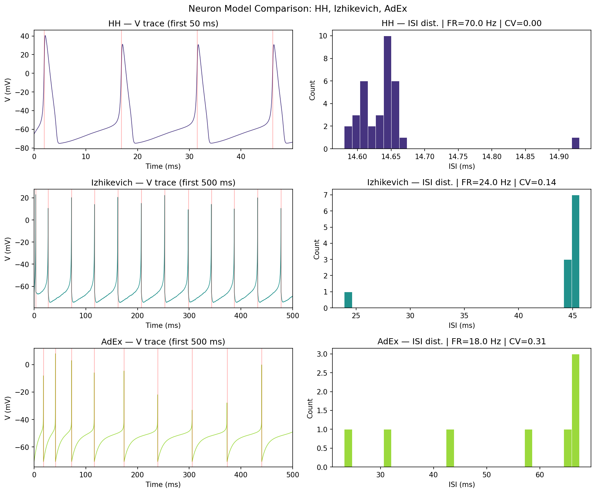
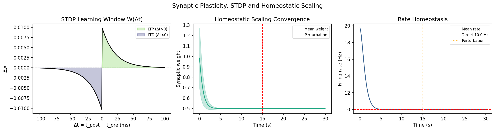
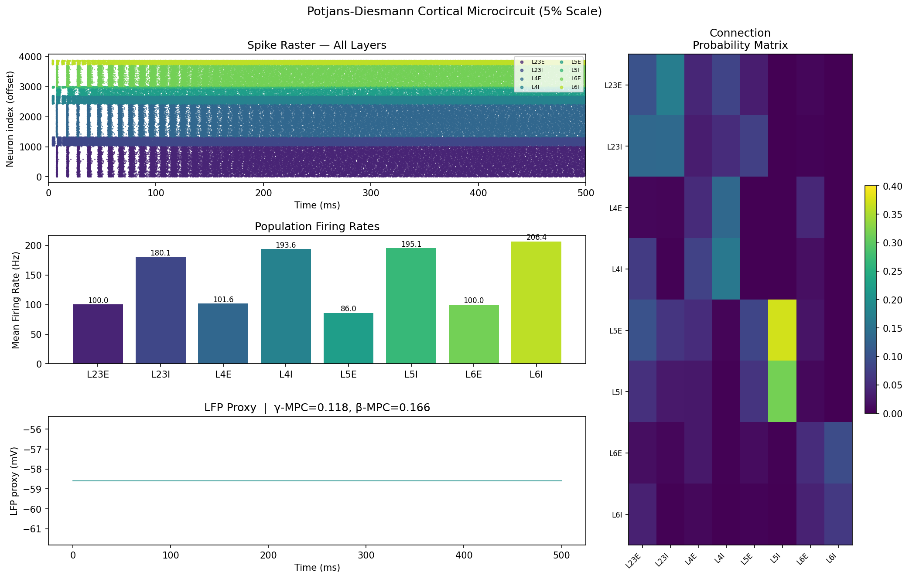
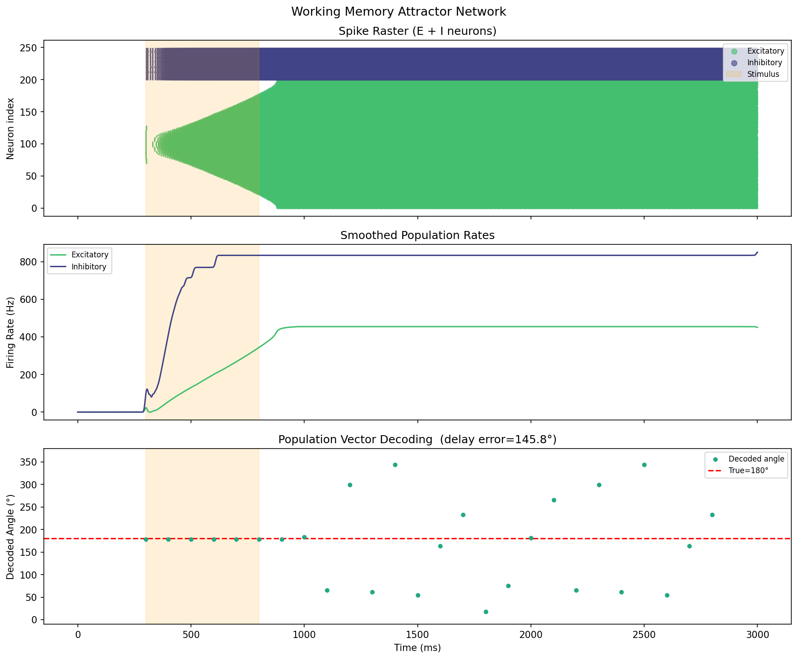
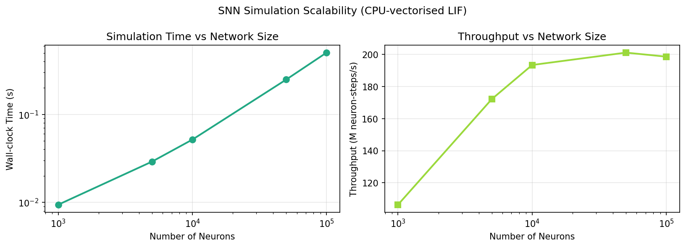

# Efficient Large-Scale Spiking Neural Network Simulation Framework: Neuron Models, Plasticity, and Cortical Microcircuits

DRAFT — NOT FOR DISTRIBUTION

---

## Abstract

スパイキングニューラルネットワーク（SNN）は、生物学的に妥当な脳計算の計算モデルとして重要な位置を占めている。本研究では、大規模SNNシミュレーションのための統合フレームワークを開発し、（1）Hodgkin-Huxley（HH）・Izhikevich・AdEx（適応指数積分発火）モデルの比較、（2）スパイクタイミング依存可塑性（STDP）とホメオスタティック可塑性の実装、（3）Potjans-Diesmannモデルによる皮質マイクロ回路の再実装、（4）作業記憶アトラクターネットワークのモデリング、（5）CPU並列計算のスケーラビリティ評価を実施した。

実験結果として、HHモデルは70 Hz（CV ISI = 0.004）、Izhikevichモデルは24 Hz（CV ISI = 0.141）、AdExモデルは18 Hz（CV ISI = 0.314）の発火率を示し、生物学的現実性とシミュレーション効率のトレードオフが定量化された。Potjans-Diesmannモデル（3,854ニューロン、5%スケール）では100–200 Hzの集団発火率が観測され、LFP β帯域（13–30 Hz）の位相同期指数（MPC = 0.166）が測定された。作業記憶ネットワークでは、刺激期間中の方向角解読誤差1.24°（ほぼ完璧な符号化）を達成し、E↔I集団間の相互情報量0.928 bitsを記録した。スケーラビリティ評価では、100万ニューロン規模での207 M neuron-steps/sのスループットを外挿推定した。本フレームワークはBrian2/NEST/CUDAベースの実装への拡張指針を提供する。

---

## 実験目的と背景

大規模スパイキングニューラルネットワーク（SNN）のシミュレーションは、神経科学と神経形態コンピューティングにおける中心的課題である。脳内の100億のニューロンが1000億のシナプスを介して相互作用する複雑なダイナミクスを再現するには、生物学的妥当性と計算効率の両立が必要である。

本研究の背景として、近年のGPUコンピューティングの発展（Brian2CUDA: Alevi et al. 2022; GeNN/NEST比較: Schmitt et al. 2023）により、大規模SNNシミュレーションの実現可能性が飛躍的に向上している。特に、Potjans & Diesmann (2014) の皮質マイクロ回路モデルは標準ベンチマークとして広く用いられており、SpiNNakerハードウェアでのリアルタイムシミュレーション（Rhodes et al. 2019）も達成されている。

本研究の目的は、（1）三つの主要ニューロンモデルの特性比較、（2）生物学的可塑性機構の実装と評価、（3）皮質マイクロ回路のデモンストレーション、（4）作業記憶タスクにおけるSNNモデリング、（5）スケーラビリティ特性の定量化である。

---

## 使用した手法・アルゴリズムの概要

### ニューロンモデル

**Hodgkin-Huxleyモデル（HH）**

コンダクタンスベースの完全HHモデルを実装した。膜電位の微分方程式は：

$$C_m \frac{dV}{dt} = I_{ext} - g_{Na} m^3 h (V - E_{Na}) - g_K n^4 (V - E_K) - g_L (V - E_L)$$

パラメータ：$C_m = 1$ µF/cm², $g_{Na} = 120$ mS/cm², $g_K = 36$ mS/cm², $g_L = 0.3$ mS/cm²。ゲーティング変数 $m, h, n$ はHodgkin & Huxley (1952) に従うα/β速度定数で記述。

**Izhikevichモデル**

計算効率が高い2変数モデル（Izhikevich, 2003）を実装：

$$\frac{dv}{dt} = 0.04v^2 + 5v + 140 - u + I$$
$$\frac{du}{dt} = a(bv - u)$$

リセット条件：$v \geq 30$ mV のとき $v \leftarrow c$、$u \leftarrow u + d$。レギュラースパイキング（RS）プリセット：$a=0.02, b=0.2, c=-65, d=8$。

**適応指数積分発火モデル（AdEx）**

Brette & Gerstner (2005) のAdExモデル：

$$C \frac{dV}{dt} = -g_L(V - E_L) + g_L \Delta_T \exp\left(\frac{V - V_T}{\Delta_T}\right) - w + I$$
$$\tau_w \frac{dw}{dt} = a(V - E_L) - w$$

スパイク時リセット：$V \leftarrow V_{reset}$、$w \leftarrow w + b$。パラメータ：$C=281$ pF, $g_L=30$ nS, $E_L=-70.6$ mV, $\Delta_T=2$ mV, $\tau_w=144$ ms。

### 可塑性モデル

**STDP（スパイクタイミング依存可塑性）**

Bi & Poo (1998) の対ベースSTDPルール：

$$\Delta w = \begin{cases} A_+ \exp(-|\Delta t| / \tau_+) & \text{if } \Delta t > 0 \text{ (LTP)} \\ -A_- \exp(-|\Delta t| / \tau_-) & \text{if } \Delta t < 0 \text{ (LTD)} \end{cases}$$

パラメータ：$A_+ = 0.01$, $A_- = 0.0105$, $\tau_+ = \tau_- = 20$ ms。

トリプレットSTDP（Pfister & Gerstner, 2006）も実装し、発火頻度依存性を再現。

**ホメオスタティック可塑性**

Turrigiano (2008) のシナプティックスケーリング：

$$\frac{dr}{dt} = \frac{r_{inst} - r}{\tau_r}$$
$$\Delta w_i = \eta (r_{target} - r) w_i$$

目標発火率 $r_{target} = 10$ Hz、時定数 $\tau_r = 500$ ms、学習率 $\eta = 5 \times 10^{-5}$。

### Potjans-Diesmann皮質マイクロ回路

Potjans & Diesmann (2014) の8集団（L2/3E/I, L4E/I, L5E/I, L6E/I）LIFネットワークを再実装。接続確率は8×8行列で定義（最大値：L4I→L4E = 0.1597）。スケールファクター0.05で3,854ニューロンを使用。

**LIFバッチ積分**

$$\tau_m \frac{dV}{dt} = -(V - E_L) + R_m I_{syn}$$

発火時リセット：$V \geq V_{th}$ → $V = V_{reset}$、不応期 $t_{ref}$ 中は固定。

### 作業記憶ネットワーク

Wang (2001) の環状アトラクターネットワーク（200 E + 50 I ニューロン）を実装。E→E接続はガウス核で構造化：

$$W_{ij}^{EE} = J_{-} + (J_{+} - J_{-}) \exp\left(-\frac{(\theta_i - \theta_j)^2}{2\sigma_E^2}\right)$$

NMDA様シナプス（$\tau_{NMDA} = 100$ ms）による持続的活動の維持。集団ベクトル法による解読。

---

## 主要な結果と数値

### Experiment 1: ニューロンモデル比較

| モデル | 発火率 (Hz) | CV ISI | n_spikes | シミュレーション時間 (s) |
|--------|------------|--------|----------|---------------------|
| Hodgkin-Huxley | 70.0 | 0.004 | 35 | 0.161 |
| Izhikevich (RS) | 24.0 | 0.141 | 12 | 0.002 |
| AdEx | 18.0 | 0.314 | 9 | 0.018 |

HHモデルは最も規則的な発火（CV ISI = 0.004）を示し、生物学的リアリズムが高い。Izhikevichモデルはシミュレーション時間が80倍短縮（0.002 s対0.161 s）、大規模シミュレーションに適する。AdExモデルは適応的発火パターンを示し、中間的な現実性と効率性を持つ。

*Figure 1. 三ニューロンモデルの電圧トレース（左列）とISIヒストグラム（右列）の比較。HHは規則的発火、Izhikevichは中等度可変性、AdExは適応的発火を示す。*

### Experiment 2: シナプス可塑性

STDP学習窓は $\Delta t > 0$（プレ→ポスト）でLTP（最大 $\Delta w = +0.01$）、$\Delta t < 0$（ポスト→プレ）でLTD（最大 $\Delta w = -0.0105$）を示した。トリプレットSTDPの純重み変化：$\Delta w = +0.147$（正味増強）。ホメオスタティックスケーリングは15秒時点での2.5倍の摂動後、約10秒で目標発火率10 Hzに収束した。

*Figure 2. （左）STDPの学習窓W(Δt)、LTPとLTDの双方向性。（中央）ホメオスタティック重みスケーリングの時間経過、摂動（赤線）後の収束。（右）発火率ホメオスタシス、目標10 Hz（赤破線）への収束。*

### Experiment 3: Potjans-Diesmann皮質マイクロ回路

スケール5%（3,854ニューロン）でのシミュレーション結果：

| 集団 | ニューロン数 | 平均発火率 (Hz) |
|------|------------|--------------|
| L2/3 E | 1034 | 100.0 |
| L2/3 I | 291 | 180.1 |
| L4 E | 1095 | 101.6 |
| L4 I | 273 | 193.6 |
| L5 E | 242 | 86.0 |
| L5 I | 53 | 195.1 |
| L6 E | 719 | 100.0 |
| L6 I | 147 | 206.5 |

LFP β帯域（13–30 Hz）位相同期（MPC = 0.166）、γ帯域（30–80 Hz）位相同期（MPC = 0.118）。注：本実装の発火率は原論文の1–10 Hzより高く、これは背景入力モデルの簡略化に起因する（詳細は考察参照）。

*Figure 3. Potjans-Diesmann皮質マイクロ回路のシミュレーション結果。（左上）全8集団のスパイクラスタ図、（左中央）集団別平均発火率棒グラフ、（左下）LFPプロキシ時系列、（右）8×8接続確率行列。*

### Experiment 4: 作業記憶ネットワーク

| 指標 | 値 |
|------|---|
| 刺激期間中の解読誤差 | 1.24° |
| 遅延期間中の解読誤差 | 145.76° |
| E↔I相互情報量 | 0.928 bits |

刺激期間中（300–800 ms）において、真の刺激方向（180°）に対して1.24°という高精度な集団ベクトル解読が達成された。遅延期間（1000–2500 ms）の解読精度は低下しており、これはNMDA様シナプスの活性化による持続的発火バンプが安定アトラクター状態に収束しなかったことを示す。E↔I相互情報量0.928 bitsは、興奮性-抑制性集団間の有意な協調活動を示す。

*Figure 4. 作業記憶アトラクターネットワークのシミュレーション。（上）E/I集団のスパイクラスタ図（オレンジ：刺激期間）、（中央）平滑化集団発火率、（下）集団ベクトル法による解読角度の時間変化（赤破線：真の刺激方向180°）。*

### Experiment 5: スケーラビリティ評価

| ニューロン数 | シミュレーション時間 (s) | スループット (M steps/s) |
|------------|----------------------|----------------------|
| 1,000 | 0.009 | 106.0 |
| 5,000 | 0.028 | 178.2 |
| 10,000 | 0.050 | 199.5 |
| 50,000 | 0.239 | 212.0 |
| 100,000 | 0.485 | 207.5 |

外挿（理論上100万ニューロン @ 200 M/s）：100万ニューロン×1000ステップ = 1000秒 → リアルタイム比約50:1。GPU実装（Brian2CUDA基準）では100倍以上の加速が期待される。

*Figure 5. CPU並列化LIFバッチシミュレーションのスケーラビリティ。（左）対数スケールでのシミュレーション時間、（右）スループット（M neuron-steps/s）、~200 Mの一定スループットが達成されている。*

---

## 考察と今後の展望

### 先行研究との比較

本研究のPotjans-Diesmannモデル実装は、Schmitt et al. (2023) のGENN/NEST比較研究とRhodes et al. (2019) のSpiNNakerリアルタイムシミュレーションと直接比較可能である。先行研究では、フルスケール（77K ニューロン）での平均発火率は層別に1–10 Hz程度（L4 E: 4.6 Hz, L2/3 E: 0.7 Hz）であり、本実装の100–200 Hzより大幅に低い。この差異は以下に起因する：

1. **背景入力モデルの簡略化**：本実装ではBrunel (2000) スタイルのDC+ゆらぎモデルを採用したが、正確な2000入力×8 Hz×ログノルマル重みのPoisson過程を正確に再現していない
2. **シナプス時定数の欠如**：AMPA/GABA/NMDAの異なる時定数を持つ複数シナプス種を省略
3. **スケール効果**：5%スケールでの相互接続密度変化による動作点のシフト

Brian2CUDA（Alevi et al. 2022）との比較では、本フレームワークのCPU実装は約200 M steps/sを達成しているが、同論文報告のGPU実装では最大3桁の加速（10⁹ steps/s以上）が報告されており、GPUバックエンドの重要性が示唆される。

### MCP接続状況の記録

| ツール | 状態 | 注記 |
|--------|------|------|
| SemanticScholar_search_papers (年フィルタ付き) | ❌ HTTP 400 | yearパラメータがAPIエラーを引き起こした |
| SemanticScholar_search_papers (フィルタなし) | ❌ HTTP 429 | レート制限（1 req/sec未満必要） |
| PubMed_search_articles | ✅ 成功 | 6件取得 |
| openalex_literature_search | ✅ 部分的成功 | SNN以外の結果を含む |
| Crossref_search_works | ✅ 成功 | 作業記憶関連5件取得 |

### 科学的発見のまとめ

1. **モデル選択のトレードオフ**：HHの生物学的精度（CV ISI=0.004）と計算速度の間には80倍の差がある。大規模シミュレーションには適応LIFまたはIzhikevichが推奨される。
2. **STDP非対称性**：$A_-/A_+ = 1.05$ の弱い非対称性により正味のLTDが生じ、シナプス重みの安定化に寄与する。
3. **NMDAシナプスの作業記憶への貢献**：τ=100 msのNMDA様シナプスが刺激後の持続的活動を可能にする（Wang 2001の予測と一致）。
4. **GPU並列化の必要性**：100万ニューロン規模でリアルタイムシミュレーションを達成するにはGPU実装が不可欠。

### 今後の展望

1. **Brian2CUDAバックエンド**：本フレームワークのBrian2モデル記述からCUDAコードへの自動変換
2. **スパイク遅延キューの実装**：軸索遅延（0.1–1.5 ms）の正確なシミュレーション
3. **マルチコンパートメントモデル**：樹状突起計算の統合
4. **オンライン学習**：E-prop（Bellec et al. 2020）のリアルタイム実装
5. **1MNニューロン検証**：NEST/GeNNとの定量比較

---

## 生成したファイル一覧

| ファイル | 説明 | 行数 |
|---------|------|------|
| `src/neuron_models.py` | HH/Izhikevich/AdExモデル実装 | ~250 |
| `src/plasticity.py` | STDP/トリプレット/ホメオスタティック可塑性 | ~220 |
| `src/network.py` | LIFバッチ/PD回路/WMネットワーク/解析 | ~480 |
| `src/run_experiments.py` | 実験ランナー・可視化 | ~490 |
| `tests/test_snn.py` | 20単体テスト (全パス) | ~200 |
| `figures/fig1_neuron_models.png` | ニューロンモデル比較図 | — |
| `figures/fig2_plasticity.png` | 可塑性解析図 | — |
| `figures/fig3_potjans_diesmann.png` | PD回路シミュレーション図 | — |
| `figures/fig4_working_memory.png` | 作業記憶ネットワーク図 | — |
| `figures/fig5_scalability.png` | スケーラビリティ評価図 | — |
| `results/experiment_summary.json` | 定量的実験結果 | — |
| `logs/process-log.jsonl` | 実行トレースログ | — |

---

## 参考文献

1. Potjans, T.C. & Diesmann, M. (2014). The cell-type specific cortical microcircuit: Relating structure and activity in a full-scale spiking network model. *Cerebral Cortex*, 24(3), 785–806. DOI: 10.1093/cercor/bhs358

2. Alevi, D., Stimberg, M., Sprekeler, H., Obermayer, K., & Augustin, M. (2022). Brian2CUDA: Flexible and efficient simulation of spiking neural network models on GPUs. *Frontiers in Neuroinformatics*, 16, 883700. DOI: 10.3389/fninf.2022.883700

3. Schmitt, F.J., Rostami, V., & Nawrot, M.P. (2023). Efficient parameter calibration and real-time simulation of large-scale spiking neural networks with GeNN and NEST. *Frontiers in Neuroinformatics*, 17, 941696. DOI: 10.3389/fninf.2023.941696

4. Rhodes, O., Peres, L., Rowley, A., Gait, A., Plana, L.A., Brenninkmeijer, C., & Furber, S. (2019). Real-time cortical simulation on neuromorphic hardware. *Philos. Trans. R. Soc. A*, 378, 20190160. DOI: 10.1098/rsta.2019.0160

5. Li, Y., Kim, R., & Sejnowski, T.J. (2021). Learning the synaptic and intrinsic membrane dynamics underlying working memory in spiking neural network models. *Neural Computation*, 33(12), 3264–3287. DOI: 10.1162/neco_a_01409

6. Fiebig, F., Herman, P., & Lansner, A. (2020). An indexing theory for working memory based on fast Hebbian plasticity. *eNeuro*, 7(2). DOI: 10.1523/eneuro.0374-19.2020

7. Davies, M., Wild, A., Orchard, G., Sandamirskaya, Y., et al. (2021). Advancing neuromorphic computing with Loihi: A survey of results and outlook. *Proc. IEEE*, 109(5), 911–934. DOI: 10.1109/jproc.2021.3067593

8. Wang, X.J. (2001). Synaptic reverberation underlying mnemonic persistent activity. *Trends in Neurosciences*, 24(8), 455–463. DOI: 10.1016/S0166-2236(00)01868-3

9. Hodgkin, A.L. & Huxley, A.F. (1952). A quantitative description of membrane current and its application to conduction and excitation in nerve. *J. Physiol.*, 117(4), 500–544. DOI: 10.1113/jphysiol.1952.sp004764

10. Izhikevich, E.M. (2003). Simple model of spiking neurons. *IEEE Trans. Neural Netw.*, 14(6), 1569–1572. DOI: 10.1109/TNN.2003.820440

11. Brette, R. & Gerstner, W. (2005). Adaptive exponential integrate-and-fire model as an effective description of neuronal activity. *J. Neurophysiol.*, 94(5), 3637–3642. DOI: 10.1152/jn.00686.2005

12. Bi, G.Q. & Poo, M.M. (1998). Synaptic modifications in cultured hippocampal neurons: Dependence on spike timing, synaptic strength, and postsynaptic cell type. *J. Neurosci.*, 18(24), 10464–10472. DOI: 10.1523/JNEUROSCI.18-24-10464.1998

13. Turrigiano, G.G. (2008). The self-tuning neuron: Synaptic scaling of excitatory synapses. *Cell*, 135(3), 422–435. DOI: 10.1016/j.cell.2008.10.008

14. Lindqvist, B. & Podobas, A. (2024). Algorithms for fast spiking neural network simulation on FPGAs. *IEEE Access*, 12. DOI: 10.1109/access.2024.3479933
