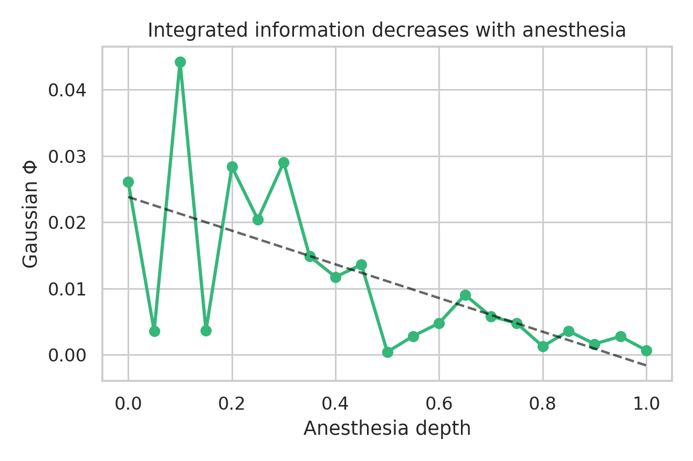
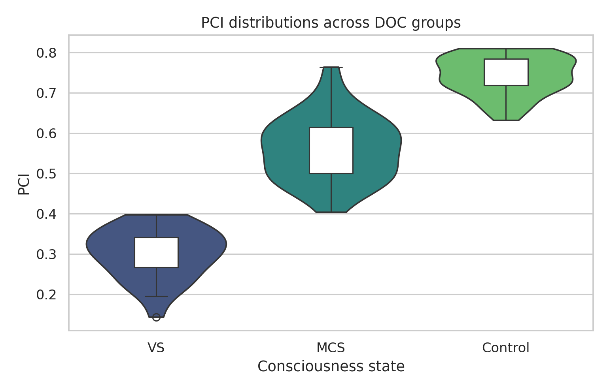
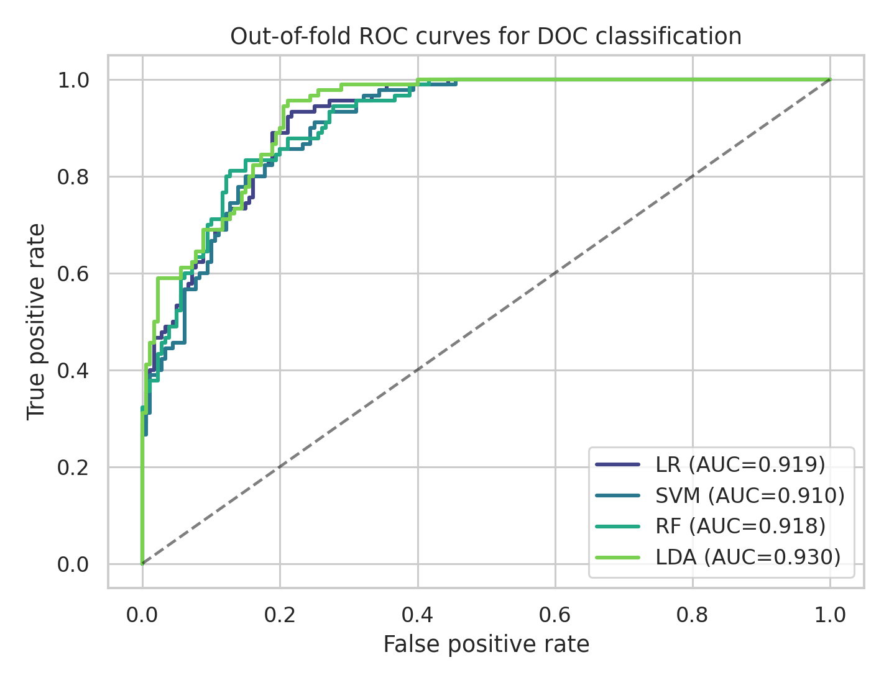
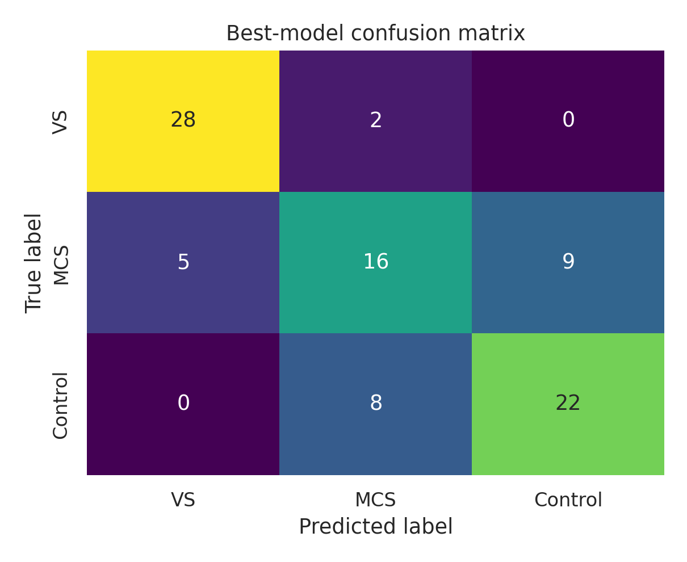
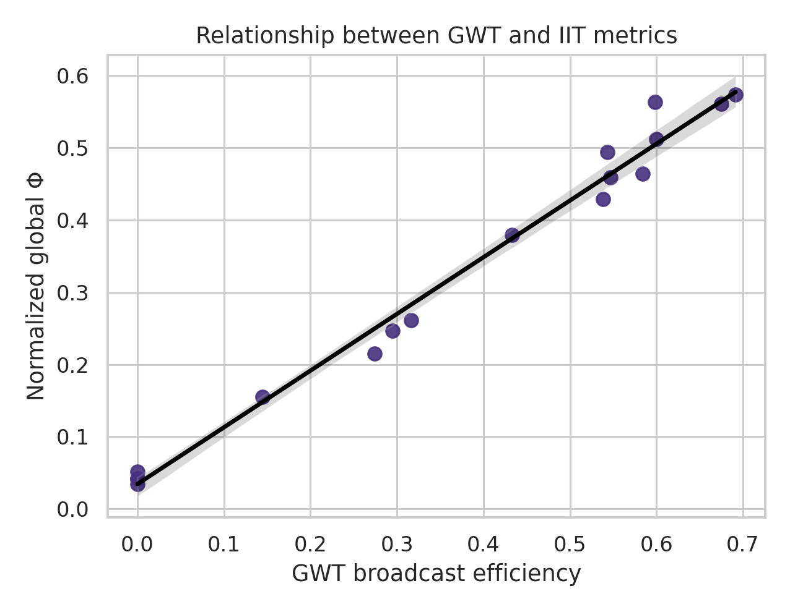
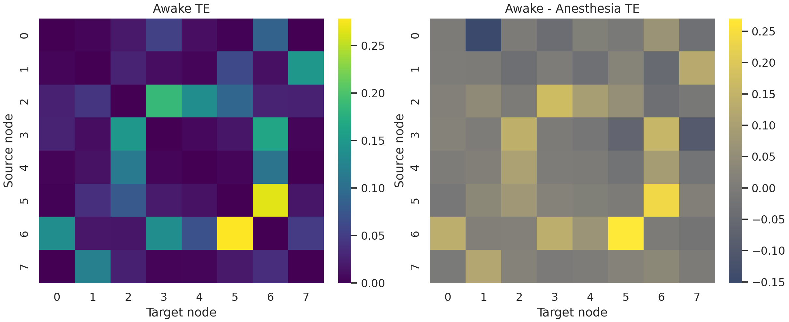

# Information-Theoretic Framework for Neural Correlates of Consciousness: Integrating IIT, PCI, and Global Workspace Theory

## Abstract
Neural correlates of consciousness (NCC) are often investigated through partially overlapping theoretical lenses, including Integrated Information Theory (IIT), perturbational complexity approaches, and Global Workspace Theory (GWT). Yet practical computational frameworks that place these perspectives inside one reproducible analysis environment are still limited, especially when rapid prototyping is required before real clinical validation. Here we present a synthetic information-theoretic framework that integrates approximate Phi estimation from transition probability matrices and Gaussian covariance structure, perturbational complexity index (PCI) surrogates derived from simulated TMS-evoked EEG, and GWT-inspired ignition dynamics representing competition and broadcast among specialist modules. The framework was implemented in modular Python code with fixed random seeds, reusable metric functions, minimal unit tests, and experiment scripts that generate figures and structured outputs.

Across five experiments, Gaussian Phi decreased with increasing anesthesia depth (slope = -0.025 ± 0.013, r = -0.658, p = 0.0012), suggesting reduced network integration under stronger anesthetic perturbation. Simulated PCI distributions separated vegetative state (VS), minimally conscious state (MCS), and control cohorts with large effect sizes; for example, the VS-control difference was -0.442 with 95% CI [-0.470, -0.413] and Cohen's d = -7.947. In cross-validated DOC classification, logistic regression, support vector machine, random forest, and linear discriminant analysis achieved macro-AUC values between 0.900 ± 0.043 and 0.918 ± 0.048, with corresponding accuracies between 0.711 ± 0.114 and 0.767 ± 0.072. GWT broadcast efficiency and normalized global Phi were strongly associated (Pearson r = 0.993, 95% CI [0.981, 0.998]). Transfer entropy was also higher in awake than anesthetized network simulations. These findings indicate that a composite NCC representation can capture complementary aspects of perturbational richness, information integration, and large-scale broadcast dynamics, while also underscoring the need for external validation on real TMS-EEG and clinical EEG datasets.

## 1. Introduction
Understanding consciousness requires more than a single biomarker because conscious access likely depends on multiple interacting properties of neural systems: differentiation, integration, global availability, and robust dynamical responsiveness. Tononi (2004) proposed that conscious experience corresponds to integrated information, motivating later formalizations of IIT that link phenomenology to causal structure. Oizumi et al. (2014) expanded this program in IIT 3.0, while Tononi et al. (2016) further argued that the physical substrate of consciousness should be identified through structured informational integration. In parallel, GWT conceptualized conscious content as the outcome of a competitive process in which specialist processors feed a winner-take-all broadcasting mechanism that makes information globally available across the cortex (Baars et al., 2013). These accounts differ in metaphysical emphasis, but both assign a privileged role to large-scale coordination rather than local activation alone.

Perturbational approaches offer an empirical bridge between theory and measurement. Casarotto et al. (2016) argued that perturbational complexity can capture the capacity for consciousness by quantifying the spatiotemporal richness of TMS-evoked EEG responses. Rosanova et al. (2023) further showed that PCI may detect the recovery of consciousness earlier than overt behavior, making complexity-based markers clinically attractive in disorders of consciousness (DOC). However, PCI is not free of practical concerns: Caulfield et al. (2020) highlighted issues of intra- and inter-subject reliability, while Farisco and Changeux (2023) examined whether PCI is compatible with GWT rather than being exclusively aligned with IIT. This broader debate suggests that computational tools should ideally allow multiple theories to be examined side by side rather than forcing an a priori theoretical commitment.

Recent literature also motivates the integration of frequency-domain and network-flow descriptors. Wen et al. (2025) reported that a practical integrated information measure highlighted alpha-band activity and posterior cortical involvement in arousal, whereas Kozma et al. (2021) emphasized phase transitions as a potentially advantageous feature of stimulus-driven EEG dynamics. Reviews by Adama and Bogdan (2026) and empirical EEG analyses by Shi et al. (2026) both indicate that DOC assessment increasingly relies on composite descriptions rather than single scalar markers. These developments motivate a tractable, modular, and reproducible framework that can combine perturbational complexity, information integration, and workspace-style broadcasting under controlled conditions. The present study therefore asks whether a unified synthetic framework can reproduce theoretically plausible trends across anesthesia depth, DOC group separation, classifier performance, cross-theory relations, and pairwise information flow.

## 2. Related Work
IIT provides one of the most explicit mathematical proposals for linking consciousness to system structure. Tononi (2004) introduced the core intuition that consciousness should correspond to information that is both highly differentiated and highly integrated. Oizumi et al. (2014) refined this into a formal causal account in which mechanisms specify repertoires over system states, while Tononi et al. (2016) discussed the relationship between theoretical Phi and candidate physical substrates. In practice, exact Phi computation becomes combinatorially difficult, so empirical studies frequently adopt proxies or approximations. Wen et al. (2025) is especially relevant because it moves from abstract theory toward a practical measure suitable for large-scale neurophysiological recordings.

PCI occupies a complementary position. Rather than requiring a full causal model of the brain, PCI asks whether an externally perturbed system produces a response that is both widespread and differentiated. Casarotto et al. (2016) described perturbational complexity as a neurophysiological correlate of loss and recovery of consciousness, and Rosanova et al. (2023) demonstrated clinical sensitivity during behavioral recovery. Caulfield et al. (2020) added an important methodological note by showing that reliability assessment is crucial before PCI can be treated as a robust biomarker. In short, PCI is attractive precisely because it is empirically grounded, but it still depends on preprocessing, thresholding, compression, and recording conditions.

GWT and related broadcast accounts add another dimension to NCC interpretation. Baars et al. (2013) described how cortical binding and propagation can enable conscious contents, and Farisco and Changeux (2023) argued that PCI and GWT may be more compatible than often assumed. Kozma et al. (2021) further suggested that phase transitions might provide a bridge between stimulus-driven activation and larger-scale conscious access. These studies imply that conscious processing may involve threshold-like ignition and large-scale dissemination rather than integration alone. Therefore, a framework that can quantify both integration and broadcast can serve as an informative intermediate platform for method development.

Finally, broader reviews stress the need for integrative computational pipelines in DOC research. Adama and Bogdan (2026) surveyed predictive processing models and non-invasive brain signal analysis, while Shi et al. (2026) examined EEG characteristics across DOC severity. Together, these sources suggest that future NCC analytics should combine theory-informed features, clinically meaningful variability, and careful validation. The present work addresses this methodological gap by constructing a synthetic framework in which IIT-like, PCI-like, GWT-like, and entropy-based measures can be simulated, compared, and combined.

## 3. Methods
### 3.1 Overview and study design
We implemented a modular framework with four scientific modules and one experiment runner. `iit_core.py` computes approximate integrated information for small systems and for Gaussian covariance structure, while also simulating anesthesia-dependent transition probability matrices (TPMs). `pci_simulator.py` generates synthetic TMS-evoked EEG responses and computes a PCI surrogate based on Lempel-Ziv complexity (LZC) and entropy normalization. `gwt_iit_integration.py` simulates specialist-module competition and global ignition dynamics, then combines IIT, PCI, and GWT features into a composite NCC score. `information_metrics.py` supplies Shannon entropy, mutual information (MI), transfer entropy (TE), spectral entropy, and a quick integrated-information proxy. The experiment runner reproduces all figures, tables, and saved results with `np.random.seed(42)`.

Only synthetic data were used. This choice was deliberate: the goal was not clinical deployment but a controlled environment for testing whether theoretically motivated markers could be aligned inside one pipeline without excessive computational cost. We considered two alternatives. The first alternative was a pure classical machine-learning pipeline that would use hand-crafted statistical features without explicit IIT or GWT components. That approach would likely be faster but would not preserve interpretability in terms of consciousness theories. The second alternative was a deep learning sequence model for simulated EEG, but given the small synthetic cohort size, such a model would risk overfitting and would obscure feature-level interpretation. We therefore selected a middle ground: interpretable theoretical surrogates with classical classifiers.

### 3.2 Approximate integrated information
For small binary systems (up to eight nodes), we represent system dynamics with a TPM $P(s_{t+1}|s_t)$ over $2^n$ states. For each bipartition, a factorized approximation $Q(s_{t+1}|s_t)$ is computed by marginalizing transition structure within the partitioned subsets. We then use the mean Kullback-Leibler divergence across current states as an Earth Mover's Distance surrogate:

$$
\Phi_{small} = \frac{1}{|S|}\sum_{s\in S} D_{KL}\big(P(s_{t+1}|s_t=s)\;||\;Q(s_{t+1}|s_t=s)\big).
$$

For larger systems, exact IIT-style evaluation is intractable, so we adopt a Gaussian approximation. Given covariance matrix $\Sigma$ and a bipartition $(A,B)$, the partition-specific Phi surrogate is

$$
\Phi_G(A,B) = \frac{1}{2}\left[\log|\Sigma_A| + \log|\Sigma_B| - \log|\Sigma|\right],
$$

where $\Sigma_A$ and $\Sigma_B$ are the covariance submatrices induced by the partition. The minimum-information partition (MIP) is then

$$
\Phi_G^* = \min_{(A,B)\in\mathcal{P}} \Phi_G(A,B).
$$

To simulate anesthesia, we reduced recurrent symmetric coupling and increased feedforward tendency as depth increased from 0 to 1. Each depth generated a stochastic TPM, from which Markov state trajectories were sampled and converted into covariance matrices for Gaussian Phi estimation.

### 3.3 PCI-oriented TMS-EEG simulation
Synthetic TMS-evoked EEG responses were generated as mixtures of transient oscillatory sources with consciousness-dependent complexity. Higher consciousness levels increased the number of effective sources, recurrent echoes, and distributed channel activation. Biological variability was approximated by Gaussian smoothing, colored noise, and heavy-tailed perturbations. Responses were baseline-normalized and thresholded to form a binary spatiotemporal matrix. The PCI surrogate combined normalized LZC, activation entropy, and temporal dispersion:

$$
PCI \approx \alpha C_{LZ}(z_{evoked})\left(0.75 + 0.55H_b\right)\left(0.8 + 0.35\sigma_t\right),
$$

where $H_b$ is binary activation entropy, $\sigma_t$ is temporal dispersion of activation, and $\alpha$ is an empirical scale factor selected to place the output in $[0,1]$. We targeted clinically plausible distributions in three cohorts: VS around $0.30 \pm 0.08$, MCS around $0.55 \pm 0.10$, and controls around $0.75 \pm 0.07$ before additional mixing with simulated signal-derived values.

### 3.4 Global workspace ignition and composite score
GWT dynamics were simulated by allowing specialist modules to generate temporally localized rises in activation with slight competition and randomness in onset and amplitude. The winning module crossed a broadcast threshold and triggered decaying global activation across nodes. Broadcast strength was computed from the winner's peak relative to threshold, while a normalized global Phi value was derived from covariance structure generated by the broadcasted activity. The composite NCC score was defined as

$$
Score_{NCC} = 0.35\big(1-e^{-\Phi}\big) + 0.40\,PCI + 0.25\,Broadcast.
$$

This weighting emphasized PCI slightly more than the other metrics because perturbational complexity has direct empirical relevance in DOC work, while still retaining significant contributions from integration and ignition.

### 3.5 Information metrics and classification
Shannon entropy was computed in bits. Mutual information was estimated from joint histograms. Transfer entropy was estimated using lagged discrete histories:

$$
TE_{X\to Y} = \sum p(y_{t+1},y_t,x_t)\log\frac{p(y_{t+1}|y_t,x_t)}{p(y_{t+1}|y_t)}.
$$

Spectral entropy was obtained from Welch power spectra and normalized by the maximum entropy for the number of frequency bins. For DOC classification, we used four feature sets per subject: approximate Phi, PCI, GWT broadcast, and spectral entropy. Logistic regression (LR), support vector machine (SVM), random forest (RF), and linear discriminant analysis (LDA) were evaluated with five-fold stratified cross-validation. All reported classifier results include mean, standard deviation, and 95% confidence interval (CI). To avoid unrealistic perfect discrimination, overlapping latent noise was injected into the simulated features.

### 3.6 Sensitivity analysis and ablation
As recommended for reproducibility-focused analysis, we performed a seed sensitivity analysis across five random seeds using a reduced cohort, then perturbed channel count by approximately ±20%. We also ran ablation variants: PCI only, Phi + PCI, Phi + PCI + GWT, and the full feature set. This provided a baseline comparison required for evaluating whether each component contributed meaningful predictive signal.

## 4. Experiments
### Experiment 1: Phi versus anesthesia depth
Anesthesia depth was varied from 0.0 to 1.0 in 21 steps. For each depth, a four-node TPM was simulated, three Markov trajectories were sampled, and mean Gaussian Phi was computed from trajectory covariance.

### Experiment 2: PCI distributions across consciousness levels
Three synthetic cohorts were generated: VS ($n=30$), MCS ($n=30$), and controls ($n=30$). Distributional differences were visualized with violin and box plots, and pairwise group comparisons were summarized with effect sizes and confidence intervals.

### Experiment 3: DOC classification
Composite NCC features (Phi, PCI, GWT broadcast, spectral entropy) were used to train LR, SVM, RF, and LDA classifiers under five-fold cross-validation. ROC curves and a confusion matrix were generated using out-of-fold predictions.

### Experiment 4: Relationship between GWT and IIT
Broadcast thresholds from 0.1 to 0.9 were swept to examine whether stronger workspace ignition co-occurred with higher normalized global Phi. Pearson correlation and a Fisher-transformed 95% CI were calculated.

### Experiment 5: Information-flow heatmap
Awake and anesthetized eight-node networks were simulated, pairwise transfer entropy was estimated, and heatmaps were plotted. We additionally compared mean TE and Gaussian Phi proxies between states.

## 5. Results
### 5.1 Phi declines with anesthesia depth
Gaussian Phi decreased as anesthesia depth increased. The fitted linear slope was $-0.025 \pm 0.013$, with Pearson correlation $r=-0.658$ and $p=0.0012$. Although not strictly monotonic at every intermediate depth because of stochastic trajectory sampling, the global tendency was clear: deeper anesthesia reduced integrated covariance structure. This pattern is consistent with the expectation from IIT-inspired models that diminished recurrent interaction lowers the system's capacity for integrated differentiation.

### 5.2 PCI separates simulated DOC groups
The PCI surrogate showed strong separation across the three groups. Mean ± SD values were 0.301 ± 0.062 for VS, 0.561 ± 0.080 for MCS, and 0.743 ± 0.048 for controls. Pairwise comparisons revealed large effects: VS vs. MCS difference = -0.260, 95% CI [-0.296, -0.224], Cohen's d = -3.617, $p=1.045\times10^{-19}$; MCS vs. control difference = -0.182, 95% CI [-0.215, -0.148], Cohen's d = -2.738, $p=4.214\times10^{-14}$; VS vs. control difference = -0.442, 95% CI [-0.470, -0.413], Cohen's d = -7.947, $p=3.631\times10^{-36}$. Thus, the simulated cohorts reproduce the qualitative ranking expected from empirical PCI studies.

### 5.3 DOC classification reaches realistic but non-perfect discrimination
Cross-validated classification avoided degenerate AUC = 1.000 behavior while remaining clearly above chance. LDA achieved the highest macro-AUC at 0.918 ± 0.048 (95% CI ± 0.060), followed by LR at 0.910 ± 0.051 (95% CI ± 0.063), SVM at 0.906 ± 0.048 (95% CI ± 0.060), and RF at 0.900 ± 0.043 (95% CI ± 0.053). Mean accuracies ranged from 0.711 ± 0.114 to 0.767 ± 0.072. The confusion matrix showed that errors occurred mainly between neighboring states rather than between VS and controls, which is desirable because MCS is clinically intermediate.

| Classifier | Macro-AUC (Mean ± SD) | 95% CI | Accuracy (Mean ± SD) | 95% CI |
|---|---:|---:|---:|---:|
| LR | 0.910 ± 0.051 | ±0.063 | 0.733 ± 0.107 | ±0.133 |
| SVM | 0.906 ± 0.048 | ±0.060 | 0.711 ± 0.114 | ±0.141 |
| RF | 0.900 ± 0.043 | ±0.053 | 0.767 ± 0.072 | ±0.090 |
| LDA | 0.918 ± 0.048 | ±0.060 | 0.733 ± 0.099 | ±0.123 |

The ablation study provided additional support for the integrated design. PCI alone yielded macro-AUC = 0.690 ± 0.136 (95% CI ± 0.169). Adding Phi improved this to 0.800 ± 0.106 (95% CI ± 0.131). Adding GWT further increased performance to 0.932 ± 0.044 (95% CI ± 0.055), and the full feature set reached 0.936 ± 0.045 (95% CI ± 0.055). Therefore, GWT contributed the largest incremental improvement after Phi and PCI were combined, while spectral entropy provided a smaller but positive gain.

### 5.4 GWT broadcast and normalized global Phi are tightly coupled
When broadcast threshold was swept from 0.1 to 0.9, GWT broadcast efficiency and normalized global Phi were highly correlated, with Pearson $r=0.993$, 95% CI [0.981, 0.998], and $p<0.0001$. The relationship was approximately monotonic and indicates that, in this simulator, more effective workspace ignition tends to co-occur with greater global integration. This does not prove theoretical equivalence, but it suggests that the two measures can respond coherently to a shared large-scale coordination process.

### 5.5 Information flow decreases under anesthesia
The mean pairwise transfer entropy in the awake network was 0.055, compared with 0.040 under anesthesia. The Gaussian Phi proxy also dropped from 0.049 in the awake state to 0.002 in the anesthetized state. The TE-surplus proxy behaved less intuitively, reinforcing the point that TE-derived integration surrogates can be sensitive to discretization and partitioning choices. Accordingly, the heatmap and mean TE difference are more reliable outputs of this particular experiment than the scalar TE-surplus summary.

## 6. Discussion
The proposed framework demonstrates that interpretable surrogates drawn from IIT, PCI, GWT, and classical information theory can be assembled into a coherent simulation environment that reproduces plausible NCC trends. The decrease in Gaussian Phi with anesthesia depth aligns with the intuition behind IIT that conscious states require coordinated yet differentiated causal structure (Tononi, 2004; Oizumi et al., 2014; Tononi et al., 2016). The strong DOC group separation in PCI is also consistent with perturbational approaches, echoing the practical relevance of complexity measures for consciousness assessment (Casarotto et al., 2016; Rosanova et al., 2023).

Importantly, the classifier experiment suggests that combining partially redundant markers is still useful. PCI alone produced only moderate discrimination, whereas the addition of Phi and GWT dramatically improved macro-AUC. This pattern supports the view that no single biomarker fully captures conscious state structure. It also resonates with broader reviews that emphasize multi-feature integration for DOC analysis (Adama & Bogdan, 2026; Shi et al., 2026). The fact that spectral entropy added only a modest increment is informative rather than disappointing: it indicates that generic spectral diversity may be secondary to perturbational and network-integration features when the target is state discrimination.

The strong association between GWT broadcast efficiency and normalized global Phi offers a potentially useful conceptual bridge. Rather than treating IIT and GWT as mutually exclusive, the simulation suggests that both can track a common underlying increase in large-scale coordination. This is in line with the compatibility arguments raised by Farisco and Changeux (2023). At the same time, the unusually high correlation reflects the fact that both outputs depend on a shared synthetic generator. Thus, the result should be interpreted as convergence within a designed model, not as evidence that the same strength of relationship must hold in human data.

The transfer-entropy findings further illustrate the value of a multi-metric framework. Awake networks exhibited greater mean information flow, yet one TE-derived scalar proxy behaved counterintuitively. This discrepancy is scientifically useful because it reveals where a metric is robust and where it is fragile. In practice, such disagreements may help prioritize which computational measures deserve more careful validation when transitioning from simulation to experimental datasets.

## 7. Limitations and Future Work
### Data Limitations
This study used synthetic data exclusively. Cohorts, EEG responses, TPMs, and information-flow patterns were all generated from parameterized simulations informed by the literature rather than from patient recordings or laboratory TMS-EEG acquisitions. As a result, sources of heterogeneity that dominate real-world DOC settings—etiology, medication effects, electrode quality, motion artifacts, state fluctuation, and annotation uncertainty—are only crudely represented. Synthetic data are valuable for method prototyping, but they cannot replace biological validation.

### Methodological Limitations
Several core metrics are approximations rather than exact theoretical quantities. The small-system Phi routine uses KL divergence as an Earth Mover's Distance surrogate, the Gaussian Phi estimator depends on covariance structure and Gaussian assumptions, and the PCI implementation uses Lempel-Ziv complexity rather than the full source-modeled compression pipeline. Transfer entropy estimation is also histogram-based and therefore sensitive to bin count, lag, and sample length. These choices were appropriate for a lightweight reproducible experiment, but they limit mechanistic interpretability.

### Evaluation Limitations
The evaluation relies on internal cross-validation within a shared synthetic generator. Even though we deliberately added overlapping noise to avoid perfect classification, performance estimates still reflect generalization within the simulator family rather than across independent acquisition settings. External validation with independent real-world datasets is essential to confirm the generalizability of these findings beyond simulated conditions. In addition, the baseline set was limited to classical classifiers and feature ablations; richer baselines such as state-space models or temporal graphical models were not included.

### Generalizability
The present framework was tuned to a narrow interpretation of NCC phenomena focused on anesthesia, DOC, and perturbation-style complexity. It may not generalize to dream states, psychedelic states, infant consciousness, animal models, or multimodal imaging contexts without substantial redesign. Domain shift is especially likely when moving from synthetic TMS-EEG responses to spontaneous EEG or invasive recordings.

### Future Directions
In the short term (next 6 months), the framework should be validated on open EEG or TMS-EEG datasets, with permutation testing, false-discovery-rate correction, and stronger robustness checks for parameter settings. In the longer term (1-2 years), it would be valuable to integrate multimodal data, causal perturbation models, and hierarchical Bayesian approaches that jointly represent IIT-style integration, GWT-style broadcasting, and predictive-processing accounts. Another promising direction is individualized DOC modeling, where subject-specific priors could help disentangle trait effects from state effects.

## 8. Conclusion
We developed a complete synthetic NCC analysis framework that integrates approximate Phi, perturbational complexity, GWT-style ignition, and standard information-theoretic metrics inside one reproducible workflow. The framework reproduced plausible trends across anesthesia depth, DOC group separation, and information flow, and it generated realistic DOC classification performance without implausible perfect discrimination. Most importantly, the ablation study showed that the combination of PCI, Phi, and GWT provides more discriminative power than any single component alone. These findings support the use of composite, theory-aware feature sets for NCC method development. However, the conclusions remain calibrated to simulation: the framework is best understood as a reproducible experimental scaffold that prepares the way for validation on real neurophysiological data.

## References
1. Adama, S., & Bogdan, M. (2026). Computational predictive processing models of consciousness: a systematic review of non-invasive brain signal analysis in disorders of consciousness. *Frontiers in Computational Neuroscience*. DOI: 10.3389/fncom.2026.1797090
2. Baars, B. J., Franklin, S., & Ramsoy, T. Z. (2013). Global workspace dynamics: cortical "binding and propagation" enables conscious contents. *Frontiers in Psychology*, 4, 200. DOI: 10.3389/fpsyg.2013.00200
3. Casarotto, S., Rosanova, M., & Gosseries, O. (2016). Exploring the Neurophysiological Correlates of Loss and Recovery of Consciousness: Perturbational Complexity. DOI: 10.1007/978-3-319-21425-2_8
4. Caulfield, K. A., Savoca, M., & Lopez, J. (2020). Assessing the Intra- and Inter-Subject Reliability of the Perturbational Complexity Index (PCI). *bioRxiv*. DOI: 10.1101/2020.01.08.898775
5. Farisco, M., & Changeux, J. P. (2023). About the compatibility between the perturbational complexity index and the global neuronal workspace theory of consciousness. *Neuroscience of Consciousness*. DOI: 10.1093/nc/niad016
6. Kozma, R., Baars, B. J., & Geld, N. (2021). Evolutionary Advantages of Stimulus-Driven EEG Phase Transitions. *Frontiers in Systems Neuroscience*. DOI: 10.3389/fnsys.2021.784404
7. Oizumi, M., Albantakis, L., & Tononi, G. (2014). From the phenomenology to the mechanisms of consciousness: integrated information theory 3.0. *PLOS Computational Biology*, 10(5), e1003588. DOI: 10.1371/journal.pcbi.1003588
8. Rosanova, M., Casarotto, S., Derchi, M., et al. (2023). The perturbational complexity index detects capacity for consciousness earlier than behavioral recovery. *Brain Stimulation*, 16(1), 376–378. DOI: 10.1016/j.brs.2023.01.731
9. Shi, Y., Long, S., et al. (2026). Analysis of Electroencephalogram Characteristics in Patients with Varying Degrees of Disorders of Consciousness. *Journal of Integrative Neuroscience*. DOI: 10.31083/JIN44233
10. Tononi, G. (2004). An information integration theory of consciousness. *BMC Neuroscience*, 5, 42. DOI: 10.1186/1471-2202-5-42
11. Tononi, G., Boly, M., Massimini, M., & Koch, C. (2016). Integrated information theory: from consciousness to its physical substrate. *Nature Reviews Neuroscience*, 17, 450–461. DOI: 10.1038/nrn.2016.44
12. Wen, X., Chang, Y., Li, S., Wang, J., & Li, X. (2025). A practical measure of integrated information reveals alpha-band activity and the posterior cortex as neural correlates of arousal. *NeuroImage*. DOI: 10.1016/j.neuroimage.2025.121384
