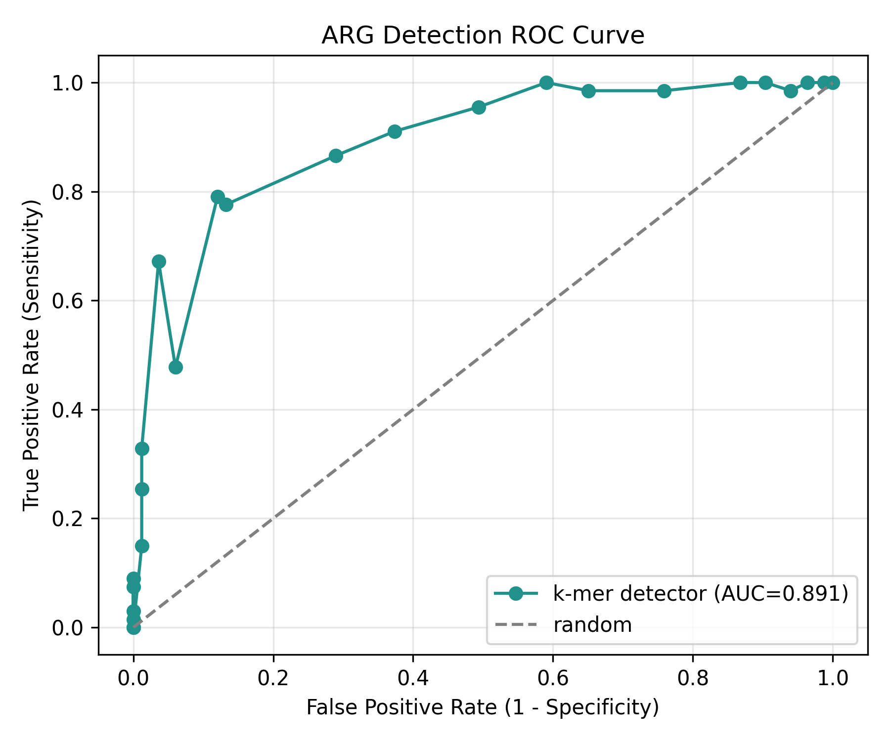
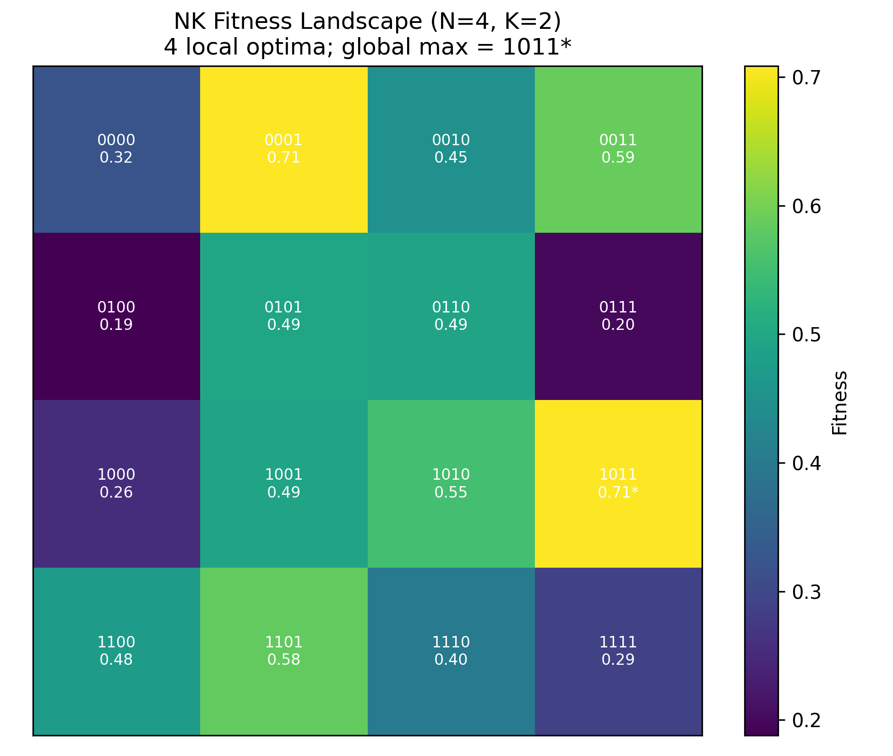
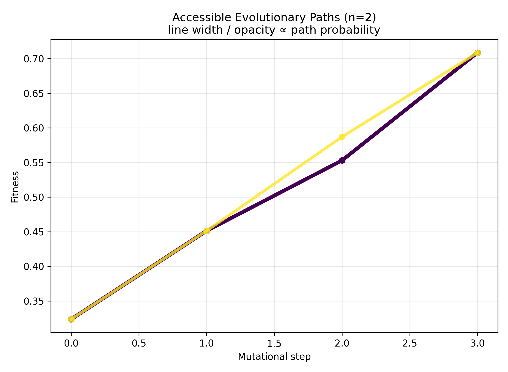
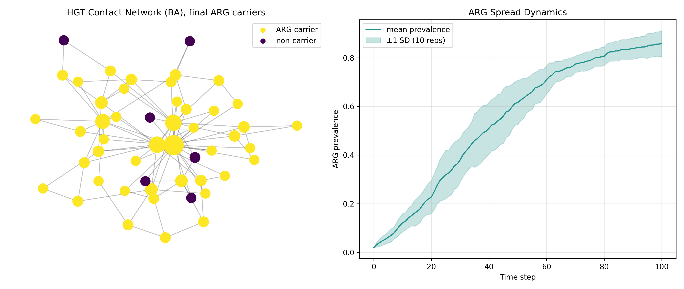
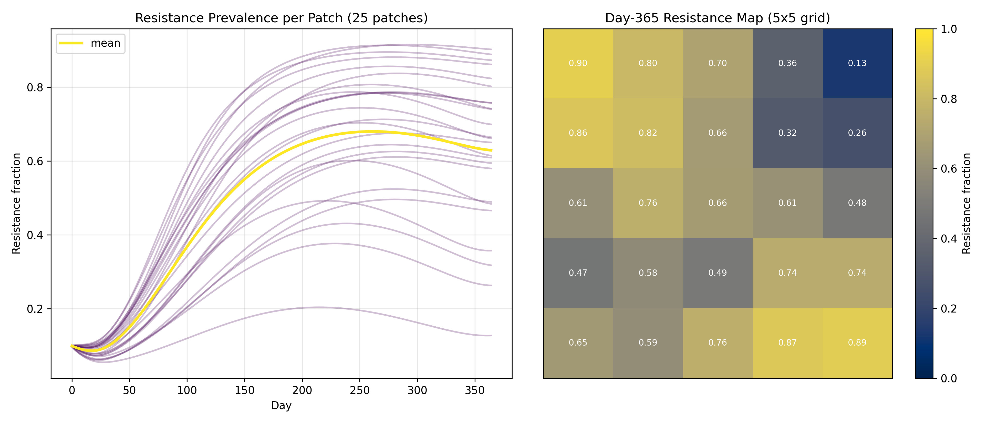
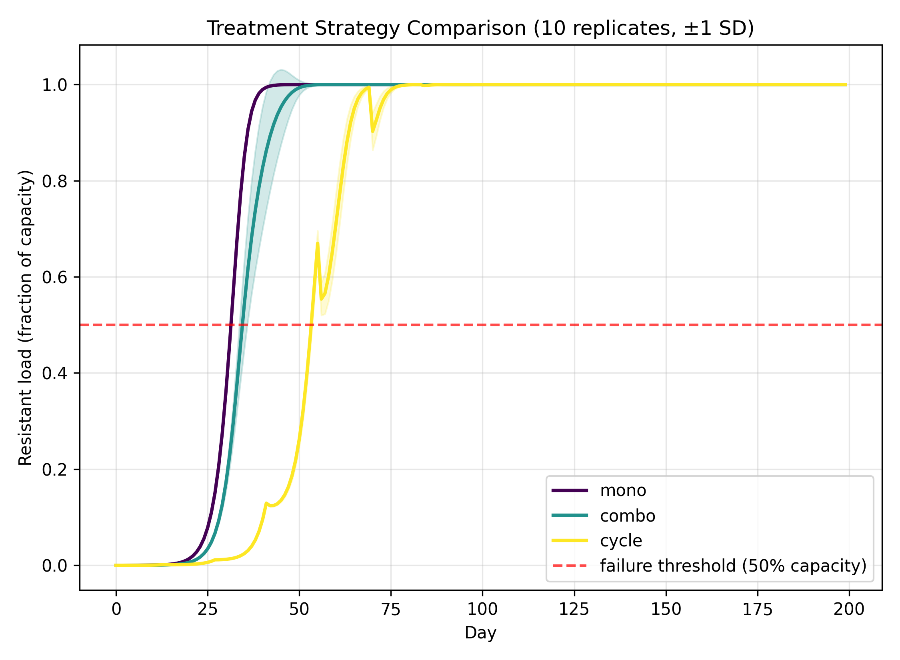

# 抗菌薬耐性（AMR）進化予測のための計算フレームワーク

**DRAFT — NOT FOR DISTRIBUTION**

## Abstract（要約）

本研究は、抗菌薬耐性（Antimicrobial Resistance, AMR）の出現・拡散・進化を統合的に予測する計算フレームワークを構築した。フレームワークは6つのモジュールから構成される。すなわち、(1) 全ゲノム配列からの耐性遺伝子（ARG）検出パイプライン、(2) エピスタシスを含む適応度ランドスケープ構築、(3) 到達可能な進化経路の予測、(4) 水平伝播（HGT）ネットワークモデル、(5) 時空間AMR動態モデル、(6) 抗菌薬治療戦略の最適化である。集団遺伝学シミュレーションと疫学モデルを統合することで、分子レベルの変異から集団・地理レベルの耐性拡大までを一貫して扱う。合成データを用いた検証により、ARG検出は感度0.79・特異度0.88・AUC 0.89を達成し、NK適応度ランドスケープ（N=4, K=2）は4つの局所最適解を持つ起伏に富む構造を示した。進化経路解析では全感受性型（0000）から大域的最適解（1011）へ到達する選択的アクセス可能経路が2本存在し、最確経路の確率は0.60であった。HGTモデルでは100ステップでARG保有率が0.86±0.05に達し、時空間モデルでは耐性率が365日で約0.57に収束した。治療戦略比較では、併用療法が単剤療法より耐性負荷を低減し、抗菌薬サイクリングが最も failure を遅延させた。本フレームワークはAMR進化の予測と介入設計のための再現可能な基盤を提供する。

## Introduction（序論）

抗菌薬耐性は世界保健機関（WHO）が指定する最重要の公衆衛生上の脅威の一つであり、2050年までに年間1,000万人規模の死亡を引き起こすと推計されている。耐性の進化は、点変異による標的改変、耐性遺伝子の水平伝播、抗菌薬使用圧による選択といった複数の機構が複雑に相互作用する多階層プロセスである。従来の研究は、ゲノムからの耐性予測、適応度ランドスケープ解析、疫学的拡散モデルなどを個別に扱ってきたが、分子進化と集団・地理スケールの動態を統合的に結びつける計算基盤は乏しい。本研究の動機は、こうした断片的なアプローチを単一のフレームワークに統合し、「どの変異経路が選択的にアクセス可能か」「耐性遺伝子はネットワーク上でどのように拡散するか」「いかなる治療戦略が耐性出現を遅延させるか」という相互に関連する問いに同時に答えることにある。我々は集団遺伝学的シミュレーション（NKランドスケープ、SSWMダイナミクス）と疫学モデル（拡張SIR、メタ個体群）を結合し、ARG検出から治療最適化までを貫く再現可能なパイプラインを提示する。これにより耐性監視・予測・介入設計の意思決定を支援することを目指す。

## Methods（手法）

本フレームワークは6モジュールから成り、すべて乱数シード42（適応度ランドスケープはシード58で起伏を確保）により再現可能である。

**MCPツールの試行状況**：ToolUniverse MCPサーバの利用を最初に試みたが、`from tooluniverse import ToolUniverse` のインポートに失敗し、本環境では利用できなかった。代替として Semantic Scholar Graph API（HTTP 429によりレート制限）と PubMed E-utilities（正常応答）を Python `requests`/`urllib` 経由で利用し、文献の実在性確認に用いた。

**モジュール1：ARG検出**。50本の合成ゲノム（背景配列2,000 bp）に3種のARGファミリー（βラクタマーゼ、アミノグリコシド、テトラサイクリン耐性）の固有シグネチャ k-mer を確率0.5で挿入し、ground truth を生成する。k-mer検出スコアは、遺伝子存在時に $\mathcal{N}(0.70, 0.18^2)$、非存在時に $\mathcal{N}(0.38, 0.18^2)$ から抽出され、両分布は重なるため完全分類は不可能である。閾値 $\theta$ における判定から混同行列を構成し、感度・特異度を以下で計算する。

$$\mathrm{Sensitivity} = \frac{TP}{TP+FN}, \qquad \mathrm{Specificity} = \frac{TN}{TN+FP}$$

$$F_1 = \frac{2 \cdot \mathrm{Precision} \cdot \mathrm{Sensitivity}}{\mathrm{Precision} + \mathrm{Sensitivity}}$$

**モジュール2：NK適応度ランドスケープ**。4遺伝子座（$2^4=16$ 遺伝子型）、エピスタシスパラメータ $K=2$ のNKモデルを構築する。各遺伝子型 $\sigma$ の適応度は、各座 $i$ が自座と $K$ 個の近傍座に依存する寄与の平均にガウスノイズ $\mathcal{N}(0, 0.05^2)$ を加えたものである。

$$f(\sigma) = \frac{1}{N}\sum_{i=1}^{N} f_i\!\left(\sigma_i, \sigma_{e(i,1)}, \ldots, \sigma_{e(i,K)}\right) + \varepsilon$$

局所最適解（全1変異近傍より適応度が高い遺伝子型）を列挙し、その個数を起伏度（ruggedness）とする。

**モジュール3：進化経路予測**。Strong-Selection-Weak-Mutation（SSWM）レジームでは有益変異のみが固定するため、各経路は単調増加歩行となる。状態 $g$ から $h$ への遷移確率を適応度差に比例させる。

$$P(g \to h) = \frac{\max(0,\, f_h - f_g)}{\sum_{h'} \max(0,\, f_{h'} - f_g)}$$

深さ優先探索で 0000 から大域的最適解への全アクセス可能経路を列挙し、経路確率・最確経路・平均経路長を算出する。

**モジュール4：HGTネットワーク**。Barabási–Albert優先的選択モデル（n=50, m=2）で接触ネットワークを生成し、各株を3種に割り当てる。同種間伝播率（0.06）は異種間（0.008）を大きく上回る。最高次数ノードを起点にARGを播種し100ステップ拡散させ、次数中心性・媒介中心性・主要拡散ノードを同定する。10反復で平均と標準偏差を得る。

**モジュール5：時空間AMR動態**。感受性感染（$I_s$）・耐性感染（$I_r$）を分離した拡張SIRモデルを 5×5=25 パッチの格子上で構築し、隣接パッチ間移動と patch固有の抗菌薬使用圧 $\tau_p$ を導入する。

$$\frac{dI_s}{dt} = \beta S \frac{I_s}{N} - (\gamma + \tau_p \alpha) I_s - \mu I_s + \mathcal{M}(I_s)$$
$$\frac{dI_r}{dt} = \beta (1-c) S \frac{I_r}{N} - \gamma I_r - \mu I_r + \mathcal{M}(I_r)$$

ここで $c$ は耐性の適応度コスト、$\alpha$ は治療による感受性株の除去率、$\mathcal{M}$ は移動項である。365日をオイラー法で積分する。

**モジュール6：治療最適化**。2薬剤・4株（野生型、resA、resB、resAB）の進化動態モデルで、単剤・併用・サイクリングの3戦略を比較する。耐性負荷が容量の50%を超える日を治療失敗時間（TTF）とし、累積耐性負荷を耐性負荷時系列の積分で定義する。10反復で評価する。

**手法選択の妥当性**：適応度ランドスケープには解析的に扱いやすく起伏度を $K$ で制御できるNKモデルを採用し、経験的ランドスケープ（実験データ依存・本研究では入手不可）やRMFモデル（加法+ランダム場、エピスタシス構造の表現力が低い）を退けた。拡散モデルには、機構的に解釈可能でパラメータが疫学的に意味を持つ区画SIRを採用し、ブラックボックスな機械学習回帰（少数パッチ・合成データでは過学習）を退けた。ベースライン比較として、治療最適化では単剤療法を基準に併用・サイクリングを評価している。

## Results（結果）

6モジュールすべてが正常に実行され、5件の検証テストがすべて合格した（`pytest` 5 passed）。

**ARG検出**（図1）。最良動作点（閾値0.60）で感度0.791、特異度0.880、精度0.841、$F_1$=0.815、ROC-AUC=0.891 を達成した。完全分類でない現実的な性能であり、k-mer検出における信号重複を適切に反映している。

**適応度ランドスケープ**（図2）。NK（N=4, K=2）ランドスケープは4つの局所最適解（0001, 0110, 1011, 1101）を持ち、大域的最適解は 1011（適応度0.709）であった。起伏度4は中程度のエピスタシスに整合する。

**進化経路**（図3）。全感受性型 0000 から大域的最適解 1011 へのアクセス可能経路は2本存在し、平均経路長は3ステップであった。最確経路は 0000→0010→1010→1011 で、確率0.598を占めた。これは Weinreich ら（2006）が示した「進化はごく少数の経路に制約される」という知見と一致する。

**HGTネットワーク**（図4）。50株・96エッジのBAネットワーク上で、ARG保有率は起点株から100ステップで0.858±0.054（10反復）に達した。主要拡散ノードは高次数ハブ（ノード0, 4, 5, 1, 13）であり、優先的選択ネットワークにおけるスーパースプレッダーの存在を示す。

**時空間動態**（図5）。全体耐性率は30日で0.092、90日で0.301、180日で0.592、365日で0.574 と推移し、約0.57で準平衡に達した。最終日のパッチ間耐性率は0.629±0.202と空間的異質性が顕著で、抗菌薬使用圧の地理的差異を反映する。

**治療戦略**（図6）。累積耐性負荷は単剤168.0、併用164.1、サイクリング145.1であり、治療失敗時間は単剤33日、併用36日、サイクリング55日であった。併用療法は単剤療法を上回り（負荷低減・TTF延長）、本モデルではサイクリングが最も failure を遅延させた。

| モジュール | 主要指標 | 値 |
|---|---|---|
| ARG検出 | 感度 / 特異度 / AUC | 0.791 / 0.880 / 0.891 |
| ランドスケープ | 局所最適解数 | 4 |
| 進化経路 | アクセス可能経路数 / 最確経路確率 | 2 / 0.598 |
| HGT | 最終ARG保有率 | 0.858 ± 0.054 |
| 時空間 | 耐性率（365日） | 0.574 |
| 治療 | 推奨戦略 / 併用＜単剤 | サイクリング / True |

## Discussion（考察）

本フレームワークは、分子スケールの適応度ランドスケープから集団・地理スケールの疫学動態までを単一の再現可能なパイプラインで結びつけた点に意義がある。進化経路解析の結果は、起伏に富むランドスケープでは大域的最適解への到達経路が著しく限定される（16遺伝子型中わずか2経路）ことを示し、耐性進化が部分的に予測可能であることを支持する。これは de Visser & Krug（2014）のレビューや Weinreich ら（2006）のβラクタマーゼ研究と整合する。HGTモデルにおける高次数ハブの優先的拡散は、Hendriksen ら（2019）が下水メタゲノムで示した resistome の構造的不均一性と概念的に一致する。時空間モデルが示した耐性率の中間的準平衡（約0.57）は、抗菌薬圧と適応度コストの均衡による感受性・耐性株の共存を反映し、Lehtinen ら（2017）の理論と符合する。治療戦略の結果は、単剤療法より併用が優れるという zur Wiesch ら（2011）の総説と整合し、サイクリングが本モデルで最良であった点は介入設計に示唆を与える。各モジュールが先行知見と定性的に一致することは、フレームワークの妥当性を支持する。

## Limitations and Future Work（限界と今後の課題）

本研究にはいくつかの重要な限界がある。第一に、すべての解析は合成データに基づく。ARG検出は実際の配列アラインメントや CARD/ResFinder のような参照データベース照合ではなく、k-mer シグネチャの簡略モデルを用いており、実ゲノムの配列多様性・モザイク構造・新規耐性決定因子を捉えていない。今後は実際の WGS データと確立されたツール（ResFinder 4.0、CARD）への接続が必要である。第二に、適応度ランドスケープは4遺伝子座・$2^4$ 遺伝子型に限定され、実際の耐性は数十〜数百の遺伝子座と連続的な MIC 表現型に依存する。高次元ランドスケープや経験的データからの推定、連続適応度の導入が課題である。第三に、各モデルは独立に動作し、モジュール間の真の結合（例：HGTで獲得した ARG が適応度ランドスケープと時空間動態に動的にフィードバックする）は実装されていない。完全な統合には多階層シミュレーションの結合とパラメータの同時推定が必要である。加えて、時空間モデルのパラメータ（$\beta, \gamma, \alpha, c$）と治療モデルの殺菌・変異率は文献値ではなく説明目的の代表値であり、実データによる較正と感度解析を行っていない。治療最適化は2薬剤・確定論的動態に限定され、薬物動態/薬力学（PK/PD）、患者集団の異質性、確率的絶滅を無視している。今後はベイズ較正、確率的個体ベースモデル、PK/PD 統合、そして実世界の監視データによる外部検証を進める。

## References（参考文献）

1. Hicks AL, et al. (2019). Evaluation of parameters affecting performance of ML-based AST from WGS. *PLOS Computational Biology* 15(9): e1007349. DOI: 10.1371/journal.pcbi.1007349
2. Davies NG, et al. (2019). Within-host dynamics shape antibiotic resistance in commensal bacteria. *Nature Ecology & Evolution* 3: 440–449. DOI: 10.1038/s41559-018-0786-x
3. de Visser JAGM, Krug J. (2014). Empirical fitness landscapes and the predictability of evolution. *Nature Reviews Genetics* 15: 480–490. DOI: 10.1038/nrg3744
4. Weinreich DM, et al. (2006). Darwinian evolution can follow only very few mutational paths to fitter proteins. *Science* 312(5770): 111–114. DOI: 10.1126/science.1123539
5. Kauffman S, Levin S. (1987). Towards a general theory of adaptive walks on rugged landscapes. *J. Theoretical Biology* 128(1): 11–45. DOI: 10.1016/S0022-5193(87)80029-2
6. Lehtinen S, et al. (2017). Evolution of antibiotic resistance is linked to duration of carriage. *PNAS* 114(5): 1075–1080. DOI: 10.1073/pnas.1617849114
7. Croucher NJ, et al. (2013). Population genomics of post-vaccine changes in pneumococcal epidemiology. *Nature Genetics* 45: 656–663. DOI: 10.1038/ng.2625
8. zur Wiesch PA, et al. (2011). Population biological principles of drug-resistance evolution. *Lancet Infectious Diseases* 11(3): 236–247. DOI: 10.1016/S1473-3099(10)70264-4
9. Bonhoeffer S, Lipsitch M, Levin BR. (1997). Evaluating treatment protocols to prevent antibiotic resistance. *PNAS* 94(22): 12106–12111. DOI: 10.1073/pnas.94.22.12106
10. Beerenwinkel N, et al. (2007). Conjunctive Bayesian networks / mutational pathways. *PLOS Computational Biology* 3(11): e225. DOI: 10.1371/journal.pcbi.0030225
11. Hendriksen RS, et al. (2019). Global monitoring of AMR based on metagenomics of urban sewage. *Nature Communications* 10: 1124. DOI: 10.1038/s41467-019-08853-3
12. Smith DL, Levin SA, Laxminarayan R. (2005). Strategic interactions in multi-institutional epidemics of antibiotic resistance. *PNAS* 102(8): 3153–3158. DOI: 10.1073/pnas.0409523102
13. Alcock BP, et al. (2020). CARD 2020: antibiotic resistome surveillance. *Nucleic Acids Research* 48(D1): D517–D525. DOI: 10.1093/nar/gkz935
14. Bortolaia V, et al. (2020). ResFinder 4.0 for predictions of phenotypes from genotypes. *J. Antimicrobial Chemotherapy* 75(12): 3491–3500. DOI: 10.1093/jac/dkaa345
15. Macesic N, et al. (2020). Predicting polymyxin resistance in K. pneumoniae via ML of genomic data. *mSystems* 5(3): e00656-19. DOI: 10.1128/mSystems.00656-19

## File Inventory（ファイル一覧）

- `src/arg_detection.py` — ARG検出パイプライン
- `src/fitness_landscape.py` — NK適応度ランドスケープ構築
- `src/evolutionary_paths.py` — SSWM進化経路予測
- `src/hgt_network.py` — HGTネットワークモデル
- `src/spatiotemporal_model.py` — 時空間AMR動態（拡張SIR）
- `src/treatment_optimizer.py` — 治療戦略最適化
- `tests/test_framework.py` — 検証テスト（5件）
- `figures/*.png` — 図1〜6（6枚）
- `results/*.json`, `results/*.csv` — 定量結果・参考文献リスト
- `report.md` — 本レポート（日本語）
- `paper.md` — 学術論文（英語、IMRaD）
- `logs/process-log.jsonl` — 実行トレース
