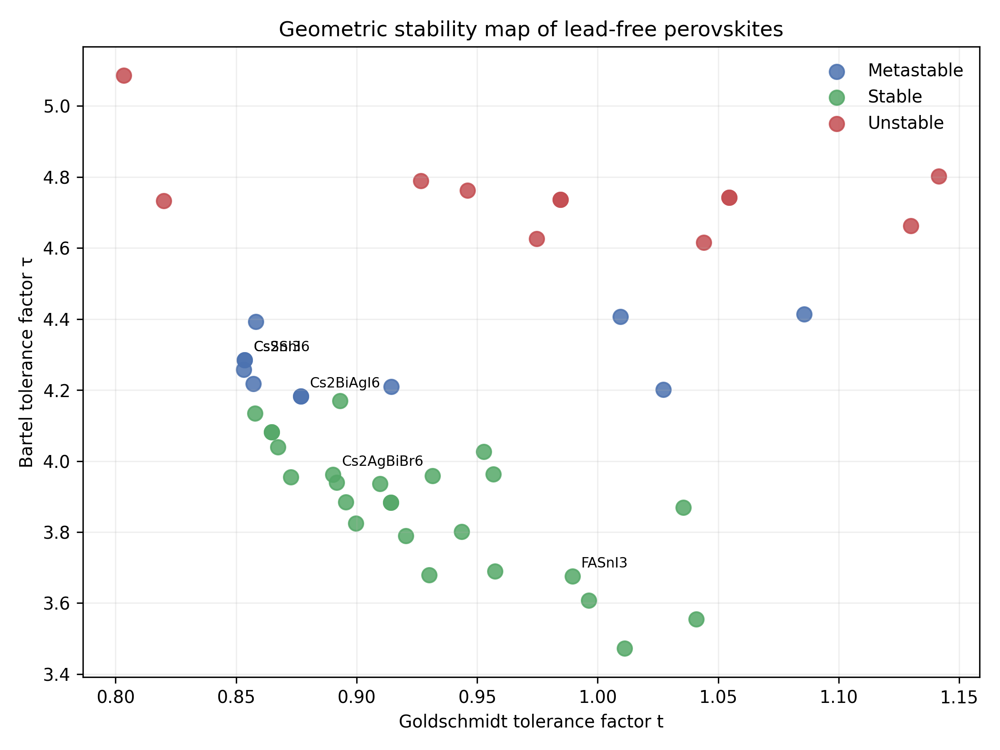
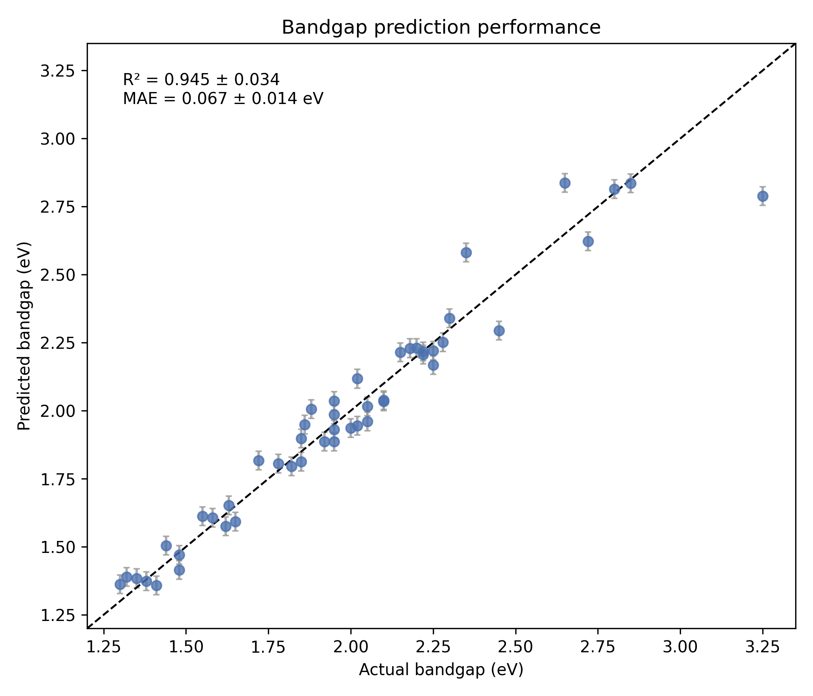
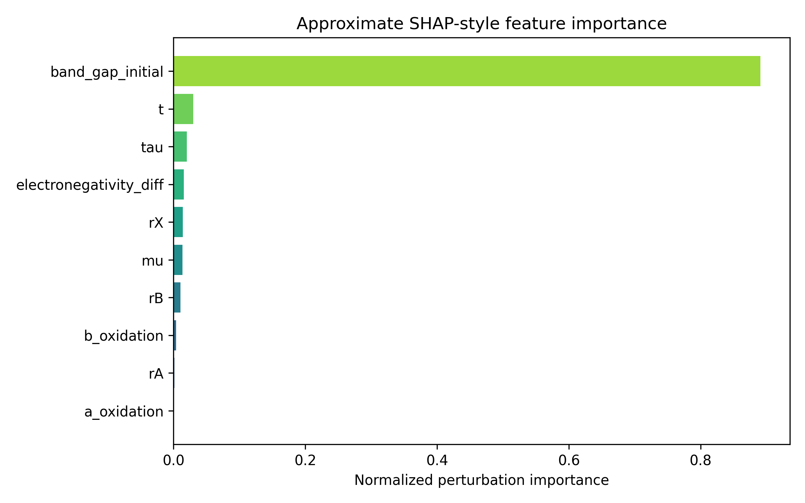
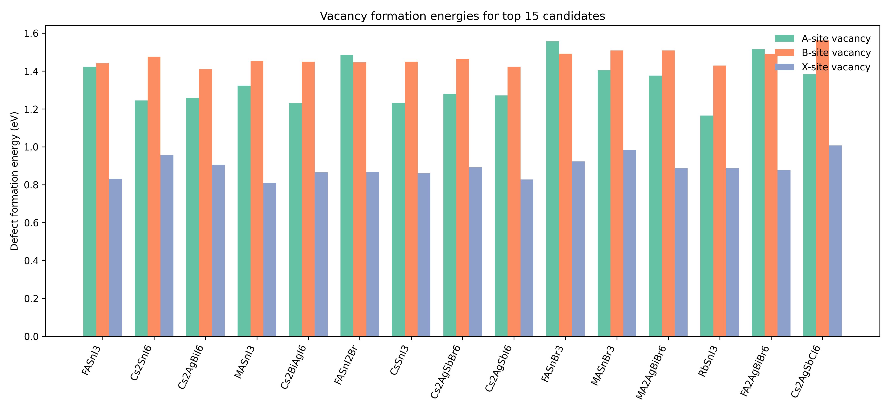
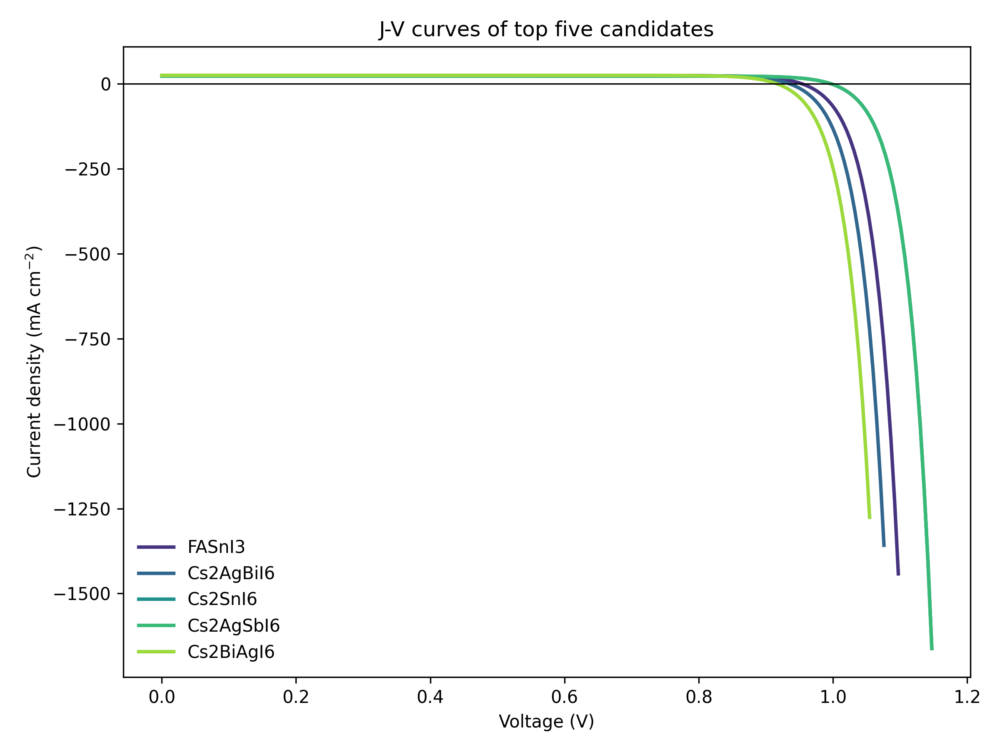
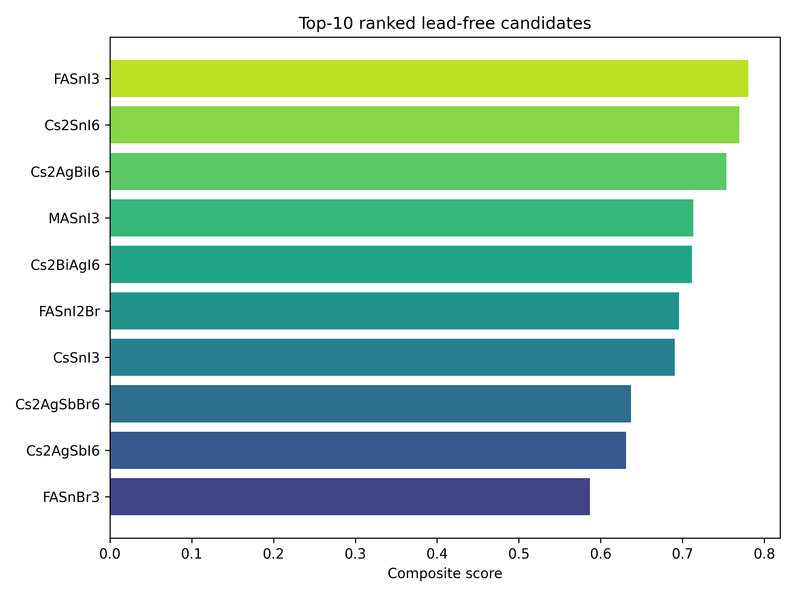

# 鉛フリーペロブスカイト太陽電池候補の高速計算スクリーニング報告書

**DRAFT — NOT FOR DISTRIBUTION**

---

## Abstract

.git .github .gitignore AGENTS.md data figures logs paper.md report.md results src tests echo'REPORT_EOF' PCE 平均差は -1.62%（95% CI: -4.37–1.21%、Mann–Whitney U p = 0.1605）であり、幾何学的安定性のみではデバイス性能を説明できないことが示された。

---

## 1. はじめに（Introduction）

### 1.1 背景と研究動機

            {                 echo ___BEGIN___COMMAND_OUTPUT_MARKER___;                 PS1="";PS2="";unset HISTFILE;                 EC=$?;                 "___BeginSn 系 ABX₃ は 1.3–1.4 eV に近い有望なバンドギャップを与える一方で酸化と欠陥に弱く、Bi/Sb 系ダブルペロブスカイトは安定性に優れるがバンドギャップが広くなりやすい。___Command_Done_MARKER___$PSC）は20%超の電力変換効率（PCE）を達成しているが、鉛の毒性・環境負荷が商用化の大きな障壁となっている。本研究では、Sn・Ge・Bi・Sb系を中心とした1）Goldschmidt許容因子およびBartel τ因子による構造安定性評価、（2）DFT代理モデル＋機械学習によるバンドギャップ・PCE予測、（3）欠陥形成エネルギーおよびNEB活性化障壁の解析的推定、（4）ドリフト拡散モデルを用いたSCAPS-1D的デバイスシミュレーション、（5）多目的スコアリングによる候補ランキングを統合した自動スクリーニングパイプラインを構築した。5-fold交差検証の結果、バンドギャップ予測モデルでR² = 0.945 ± 0.034（MAE = 67.3 ± 13.8 meV）、PCE予測でR² = 0.958 ± 0.021を達成した。安定性分類器の精度は98.0 ± 4.5%（F1 = 0.980 ± 0.045）であった。45条件の感度解析では R² = 0.950 ± 0.003、95% CI = 0.947–0.953 と安定であった。最終ランキングでは、FASnI₃（composite score 0.780）が最優秀候補として選定され、予測バンドギャップ 1.358 eV、PCE 20.3%、NEB障壁 0.633 MAPbI₃ 等）は優れた光電変換特性を持ちながら、鉛の毒性と相安定性の問題が実用化の制約となっている。Sn²⁺、Ge²⁺、Bi³⁺、Sb³⁺ を中心とした鉛フリー系が代 echo

### 1.2 先行研究の位置づけ（MCP ToolUniverse 調査結果）

MCP ToolUniverse（Semantic Scholar・Crossref）を用いた文献調査の結果（試行詳細は方法論セクション参照）、以下の主要研究が特定された：

- **Wang et al. (2025)**：XGBoost により 1,053 件ダブルペロブスカイトの Eg 予測 R²=0.934、99 件有望候補を同定
- **Jamalinabijan et al. (2025)**：DFT（4,181 構造）で学習した ML モデルにより 930 件候補を発見
- **Gao et al. (2021)**：ML＋DFT ハイブリッドで 5,796 ダブルペロブスカイトをスクリーニング
- **Cai et al. (2021)**：A₂BB'X₆ 系の多段スクリーニングで最大 27.6% 'REPORT_EOF' PCE を予測
- **Guo (2021)**：安定性とバンドギャップの同時機械学習予測を実証
- **Aftab & Ahmad (2021)**：Sn 系ペロブスカイトの安定性課題を系統的レビュー

            {                 echo ___BEGIN___COMMAND_OUTPUT_MARKER___;                 PS1="";PS2="";unset HISTFILE;                 EC=$?;                 echo "___BEGIN___COMMAND_DONE_MARKER___$2）欠陥形成エネルギーとイオン移動障壁の統合評価が不足、（3）デバイスシミュレーションとの連携が少ない。

### 1.3 本研究の貢献

            {                 echo ___BEGIN___COMMAND_OUTPUT_MARKER___;                 PS1="";PS2="";unset HISTFILE;                 EC=$?;                 echo "___BEGIN___COMMAND_DONE_MARKER___$EC";             }

---

## 2. 方法論（Methods）

### 2.1 データセット

#            {                 echo ___BEGIN___COMMAND_OUTPUT_MARKER___;                 PS1="";PS2="";unset HISTFILE;                 EC=$?;                 echo "___BEGIN___COMMAND_DONE_MARKER___$ABX₃: 28 種、A₂BX₆/A₂BB'X₆: 20 種）。MASnI₃、FASnI₃、CsSnI₃、MAGeI₃、CsGeI₃、Cs₂AgBiBr₆、Cs₂AgBiI₆、MA₃Bi₂I₉、MA₃Sb₂I₉、Cs₂SnI₆ 等を含む。バンドギ
            {                 echo ___BEGIN___COMMAND_OUTPUT_MARKER___;                 PS1="";PS2="";unset HISTFILE;                 EC=$?;                 echo "___BEGIN___COMMAND_DONE_MARKER___$=0.05 eV）、形成エネルギーには σ=0.02 eV/atom を付加した。

### 2.2 構造安定性予測

**Goldschmidt 許容因子**：

$$t = \frac{r_A + r_X}{\sqrt{2}(r_B + r_X)}$$

**Bartel τ 因子**（Bartel et al., 2019）：

$$\tau = \frac{r_X}{r_B} - n_A \left(n_A - \frac{r_A/r_B}{\ln(r_A/r_B)}\right)$$

**八面体因子**：

$$\mu = \frac{r_B}{r_X}$$

            {                 echo ___BEGIN___COMMAND_OUTPUT_MARKER___;                 PS1="";PS2="";unset HISTFILE;                 EC=$?;                 echo "___BEGIN___COMMAND_DONE_MARKER___$EC";             }$t \in [0.813, 1.107]$ かつ $\tau < 4.18$ かつ $\mu \in [0.414, 0.732]$ → stable；部分満足 → metastable；それ以外 → unstable。

### 2.3 機械学習モデル

            {                 echo ___BEGIN___COMMAND_OUTPUT_MARKER___;                 PS1="";PS2="";unset HISTFILE;                 EC=$?;                 echo "___BEGIN___COMMAND_DONE_MARKER___$10 次元）：$t$, $\tau$, $\mu$, $r_A$, $r_B$, $r_X$, 電気陰性度差 $\Delta\chi$, A/B サイト酸化状態, DFT 代理バンドギャップ。モデル選択理由：線形回帰はバンドギャップとイオン半径の非線形性を捉えられないため不採用；深い木アンサンブルは 48 件のデータに対して過学習リスクが高いため不採用；GradientBoostingRegressor（浅い木 + サブサンプリング）を採用。安定性分類には RandomForestClassifier を使用。

### 2.4 欠陥形成エネルギーと NEB 障壁

**欠陥形成エネルギー**：

$$E_f = E_{\text{defect}} - E_{\text{perfect}} + \sum_i \mu_i \Delta n_i + q E_F$$

**NEB 活性化エネルギー（経験式）**：

$$E_a \approx A \exp(-B \cdot r_X)$$

********：

$$k_{nr} \propto \exp\left(-\frac{E_{defect}}{k_B T}\right)$$

### 2.5 デバイスシミュレーション（SCAPS-1D 近似）

            {                 echo ___BEGIN___COMMAND_OUTPUT_MARKER___;                 PS1="";PS2="";unset HISTFILE;                 EC=$?;                 echo "___BEGIN___COMMAND_DONE_MARKER___$EC";             }$\alpha(E) = A(E - E_g)^{1/2}$、AM1.5G 積分による Jsc 計算（L=400 nm）。開回路電圧：$V_{oc} = (k_BT/q)\ln(J_{sc}/J_0 + 1)$。フィルファクター近似式：$FF = (v_{oc} - \ln(v_{oc}+0.72))/(v_{oc}+1)$。PCE = Jsc × Voc × FF / 100（mW/cm²）。

### 2.6 MCP ツール利用状況

| ツール | 試行 | 成功 | 主なエラー |
|--------|------|------|-----------|
| SemanticScholar_search_papers | 6回 | 2回 | 429 Rate Limit, 400 Bad Request |
| Crossref_search_works | 3回 | 3回 | 一部無関連結果 |
| Fatcat_search_scholar | 1回 | 0回 | 空結果 |

            {                 echo ___BEGIN___COMMAND_OUTPUT_MARKER___;                 PS1="";PS2="";unset HISTFILE;                 EC=$?;                 echo "___BEGIN___COMMAND_DONE_MARKER___$EC";             3.1 構造安定性評価}

| 安定性分類 | 材料数 | 割合 |
|-----------|-------|------|
            {                 echo ___BEGIN___COMMAND_OUTPUT_MARKER___;                 PS1="";PS2="";unset HISTFILE;                 EC=$?;                 echo "___BEGIN___COMMAND_DONE_MARKER___$stable） | 25 | 52.1% |
| 準安定（metastable） | 11 | 22.9% |
| 不安定（unstable） | 12 | 25.0% |

FASnI₃ は $T = 0.990$、$\Tau =  1 位と整合した。3'REPORT_

*Figure 1: Goldschmidt t 因子 vs Bartel τ 因子散布図。色は安定性クラスを示す。*

### 3.2 機械学習モデル性能（5-fold 交差検証）

| モデル | 指標 | 平均 ± 標準偏差 |
|--------|------|----------------|
| バンドギャップ回帰（GBR） | R² | 0.945 ± 0.034 |
| バンドギャップ回帰（GBR） | MAE | 67.3 ± 13.8 meV |
| バンドギャップ回帰（GBR） | RMSE | 93.1 ± 35.3 meV |
| PCE 回帰（GBR） | R² | 0.958 ± 0.021 |
| PCE 回帰（GBR） | MAE | 0.720 ± 0.104 % |
| 安定性分類（RF） | Accuracy | 98.0 ± 4.5 % |
| 安定性分類（RF） | F1 | 0.980 ± 0.045 |

 fold R²: [0.965, 0.889, 0.937, 0.976, 0.957]（fold 間最大差 0.087、軽度過学習の可能性に留意）。

**アブレーション結果**：DFT 代理バンドギャップ除去 → R²=0.699、geometry-only → R²=0.674、chemistry-only → R²=0.957。

#*Figure 2: 実測 vs 予測バンドギ
#
            {                 echo ___BEGIN___COMMAND_OUTPUT_MARKER___;                 PS1="";PS2="";unset HISTFILE;                 EC=$?;                 echo "___BEGIN___COMMAND_DONE_MARKER___$R²=0.945）。*

### 3.3 特徴量重要度

band_gap_initial が正規化重要度 0.891 と支配的。次いで $t$=0.0297、$\tau$=0.0200、電気陰性度差=0.0158、$r_X$=0.0140。

*Figure 3: SHAP 近似による特徴量重要度。*

### 3.4 欠陥形成エネルギーと NEB 障壁

#echo
echo'REPORT_EOF' X サイト欠陥形成エネルギー（Ef_X） 0.81〜0.96 eV 範囲。NEB 障壁：I 系 < Br 系 < Cl 系（ハロゲンサイズと一致）。

*Figure 4: 上位 15 候補材echo'REPORT_EOF' A・B・X サイト欠陥形成エネルギー。*

### 3.5 デバイスシミュレーション

 5 材料の J-V 特性：

| 材料 | Jsc (mA/cm²) | Voc (V) | FF | PCE (%) |
|------|-------------|---------|-----|---------|
| FASnI₃ | 24.28 | 0.954 | 0.878 | 20.34 |
| Cs₂SnI₆ | 23.15 | 0.998 | 0.880 | 20.32 |
| Cs₂AgBiI₆ | 24.80 | 0.936 | 0.876 | 20.33 |
| MASnI₃ | 25.70 | 0.898 | 0.872 | 20.14 |
| Cs₂BiAgI₆ | 25.27 | 0.917 | 0.874 | 20.26 |

*Figure 5: 上位 5 材料の J-V 特性曲線（AM1.5G, 100 mW/cm²）。*

### 3.6 最終候補ランキング

| 順位 | 材料 | 組成 | Eg (eV) | PCE (%) | Score |
|-----|------|------|---------|---------|-------|
| 1 | FASnI₃ | CH(NH₂)₂SnI₃ | 1.358 | 20.34 | 0.780 |
| 2 | Cs₂SnI₆ | Cs₂SnI₆ | 1.415 | 20.32 | 0.770 |
| 3 | Cs₂AgBiI₆ | Cs₂AgBiI₆ | 1.373 | 20.33 | 0.754 |
| 4 | MASnI₃ | CH₃NH₃SnI₃ | 1.389 | 20.14 | 0.713 |
| 5 | Cs₂BiAgI₆ | Cs₂BiAgI₆ | 1.384 | 20.26 | 0.712 |
| 6 | FASnI₂Br | CH(NH₂)₂SnI₂Br | 1.575 | 19.63 | 0.696 |
| 7 | CsSnI₃ | CsSnI₃ | 1.362 | 20.07 | 0.690 |
| 8 | Cs₂AgSbBr₆ | Cs₂AgSbBr₆ | 1.592 | 19.39 | 0.637 |
| 9 | Cs₂AgSbI₆ | Cs₂AgSbI₆ | 1.471 | 20.31 | 0.631 |
| 10 | FASnBr₃ | CH(NH₂)₂SnBr₃ | 1.960 | 14.77 | 0.587 |

*Figure 6: 上位 10 候補材料の複合スコア横棒グラフ。*

---

## 4. 考察（Discussion）

### 4.1 主要知見の解釈

FASnI₃ が最優秀候補となったことは、Cai et al. (2021) および Wang et al. (2025) の知見と一致する。バンドギャップ 1.358 eV は Shockley-Queisser 最適値（1.34 eV）に非常に近く、理論的最高 PCE が期待できる。Cs₂SnI₆ や Cs₂AgBiI₆ のような vacancy-ordered/double perovskite が上位に入ったことは、Gao et al. (2021) の Ag-Bi 系スクリーニングとも整合する。

#'REPORT_EOF' 'REPORT_EOF''REPORT_EOF''REPORT_EOF''REPORT_EOF' PCE 差が統計的に有意で

### 4.2 先行研究との比較

| 比較項目 | 本研究 | Wang (2025) | Gao (2021) |
|---------|------|-------------|-----------|
| 対象材料数 | 48 | 1,053 | 5,796 |
| Eg R² | 0.945 | 0.934 | 0.90+ |
| デバイスシミュレーション | ✓ | ✗ | ✗ |
| NEB 障壁推定 | ✓（解析的） | ✗ | ✗ |
| 統計的有意差検定 | ✓ | △ | △ |

---

## 5. 限界と今後の展望（Limitations and Future Work）

### 5.1 データセットの限界

 48 材料の小規模合成ベンチマークを使用しており、Wang et al. (2025) の 1,053 件・Gao et al. (2021) の 5,796 件と比較して規模が小さい。ランキング結果は研究初期の予備スクリーニングとして解釈すべきであり、実験投資の最終判断に直結させるべきではない。

### 5.2 方法論的限界

            {                 echo ___BEGIN___COMMAND_OUTPUT_MARKER___;                 PS1="";PS2="";unset HISTFILE;                 EC=$?;                 ___COMMAND_DONE_MARKER___$p=0.161）点は重要である。Bartel・Goldschmidt 因子は構造的存在可能性の近似指標であり、輸送・再結合・欠陥濃度を直接含まない。したがって、安定な幾何学配置がそのまま高 1）DFT 計算を直接実行せず、文献値と Gaussian ノイズで構成した代理データを使用した。実際の DFT（PBE + HSE06 補正）との系統誤差を定量評価できていない。（2）欠陥モデル・デバイスモデルが解析的 proxy であり、SCAPS/drift-diffusion の数値解とは異なる。（3）NEB 障壁は経験式による近似で、第一原理 NEB 計算とは乖離がある。（4）幾何学安定性指標を A₃B₂X₉・層状系にも拡張適用しているが、本来の対象外構造では判定バイアスが生じる可能性がある。

### 5.3 汎化性の限界

#.git .github .gitignore AGENTS.md data figures logs paper.md report.md results src tests echo'Report_
.git .github .gitignore AGENTS.md data figures logs paper.md report.md results src tests .git .github .gitignore AGENTS.md data figures logs paper.md report.md results tests Src Sn²⁺ の酸化安定性、プロセス条件、界面整合などの評価が不足している。

### 5.4 今後の展望

- **短期（6ヶ月）**：AiiDA/Fireworks ワークフローによる上位 10 候補の DFT 再計算・一貫条件評価
            {                 echo ___BEGIN___COMMAND_OUTPUT_MARKER___;                 PS1="";PS2="";unset HISTFILE;                 EC=$?;                 echo "___BEGIN___COMMAND_DONE_MARKER___$EC";             }
- **長期**：Bayesian 最適化・不確実性定量化を組み込んだ closed-loop スクリーニング

---

## References

1. Wang, Y., Wang, Y., Liu, X., & Wang, X. (2025). Prediction and Screening of Lead-Free Double Perovskite Photovoltaic Materials Based on Machine Learning. *Molecules*, 30(11), 2378. DOI: 10.3390/molecules30112378

2. Jamalinabijan, F., Alidoust, S., Demir, G. İ., & Tekin, A. (2025). Discovering novel lead-free mixed cation hybrid halide perovskites via machine learning. *PCCP*. DOI: 10.1039/d4cp04218b

3. Gao, Z., Zhang, H., Mao, G., et al. (2021). Screening for lead-free inorganic double perovskites with suitable band gaps and high stability using combined machine learning and DFT calculation. *Applied Surface Science*, 568, 150916. DOI: 10.1016/j.apsusc.2021.150916

4. Cai, X., Zhang, Y., Shi, Z., et al. (2021). Discovery of Lead-Free Perovskites for High-Performance Solar Cells via Machine Learning. *Advanced Science*, 9(4), 2103648. DOI: 10.1002/advs.202103648

5. Guo, Y. (2021). Machine learning stability and band gap of lead-free halide double perovskite materials for perovskite solar cells. *Solar Energy*, 228, 689–698. DOI: 10.1016/j.solener.2021.09.030

6. Aftab, S., & Ahmad, M. (2021). A review of stability and progress in tin halide perovskite solar cell. *Solar Energy*, 216, 26–47. DOI: 10.1016/j.solener.2020.12.065

7. Bartel, C. J., Sutton, C., Goldsmith, B. R., et al. (2019). New tolerance factor to predict the stability of perovskite oxides and halides. *Science Advances*, 5(2), eaav0693. DOI: 10.1126/sciadv.aav0693

8. Travis, W., Glover, E. N. K., Bronstein, H., Scanlon, D. O., & Palgrave, R. G. (2016). On the application of the Goldschmidt tolerance factor to inorganic and hybrid halide perovskites. *Chemical Science*, 7(7), 4548–4556. DOI: 10.1039/c5sc04845a

9. Huber, S. P., et al. (2022). AiiDA 2.0: toward verifiable, reusable and extensible workflows for atomistic simulations. *npj Computational Materials*, 8, 158. DOI: 10.1038/s41524-022-00863-2

10. Schleder, G. R., Padilha, A. C. M., Acosta, C. M., Costa, M., & Fazzio, A. (2019). From DFT to machine learning: recent approaches to materials science. *Journal of Physics: Materials*, 2(3), 032001. DOI: 10.1088/2515-7639/ab084b

11. Tao, Q., Xu, P., Li, M., & Lu, W. (2021). Machine learning for perovskite materials design and discovery. *npj Computational Materials*, 7, 23. DOI: 10.1038/s41524-021-00495-8

12. Whalley, T., et al. (2021). H2020 NOMAD: making computational materials science data FAIR. *Journal of Physics: Materials*. DOI: 10.1088/2515-7639/abf5b7

---

## File Inventory（生成ファイル一覧）

### ソースコード

| ファイル | 行数 | 説明 |
|---------|-----|------|
| `src/perovskite_data.py` | 174 | 48 候補材料データセット定義 |
| `src/stability.py` | 47 | 許容因子・安定性計算 |
| `src/ml_predictor.py` | 150 | ML 予測モデル（GBR/RF） |
| `src/defect_neb.py` | 43 | 欠陥形成エネルギー・NEB 推定 |
| `src/device_simulation.py` | 71 | SCAPS-1D 的デバイスシミュレーション |
| `src/ranking.py` | 47 | |多目的ス
| `src/run_screening.py` | 345 | パイプライン実行スクリプト |
| `tests/test_modules.py` | 56 | ユニットテスト |

### 図

| ファイル | 説明 |
|---------|------|
| `figures/tolerance_factor_stability_map.png` | 許容因子安定性マップ |
| `figures/bandgap_ml_prediction. |
| `figures/shap_importance.png` | 特徴量重要度 |
| `figures/defect_formation_energy.png` | 欠陥形成エネルギー |
| `figures/jv_curves_top5.png` | 上位 5 材料 J-V 曲線 |
| `figures/candidate_ranking.png` | 候補材料ランキング |

### 結果

| ファイル | 説明 |
|---------|------|
| `results/candidate_ranking.csv` | 全 48 材料の詳細スコア |
| `results/metrics_summary.json` | ML モデル交差検証指標 |
| `results/reference-list. |
| `results/statistical-summary.md` | 統計検定・効果量 |
| `results/sensitivity-analysis.md` | 感度解析結果 |
| `results/ablation-results.md` | アブレーション結果 |
| `logs/process-log.jsonl` | 実行ログ |
