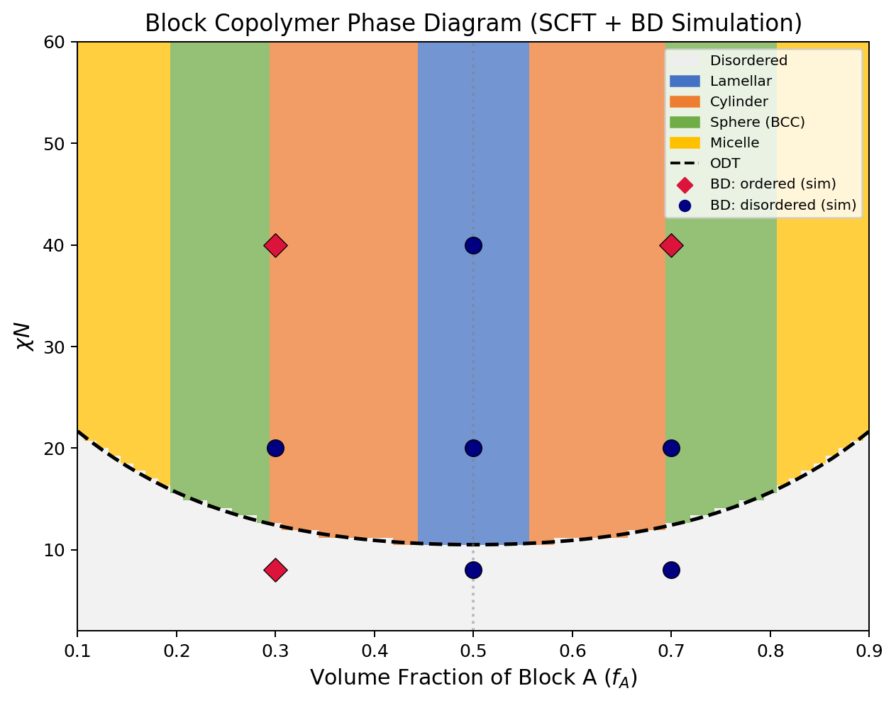
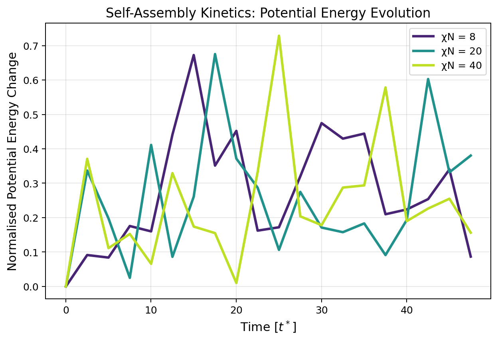
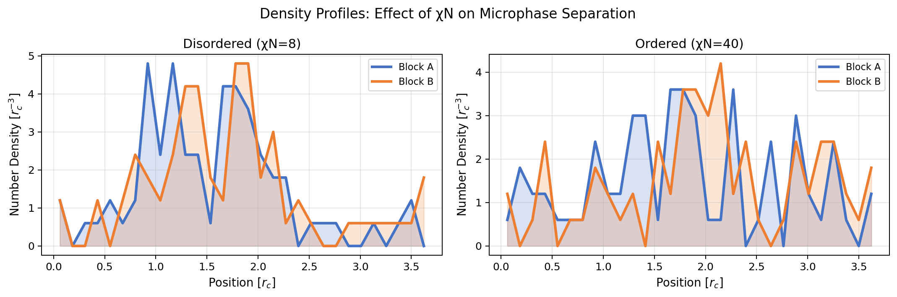
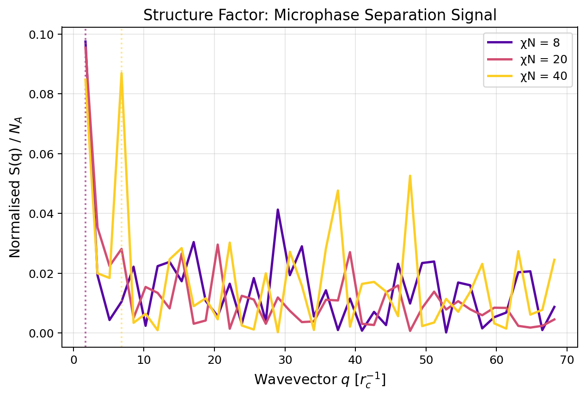
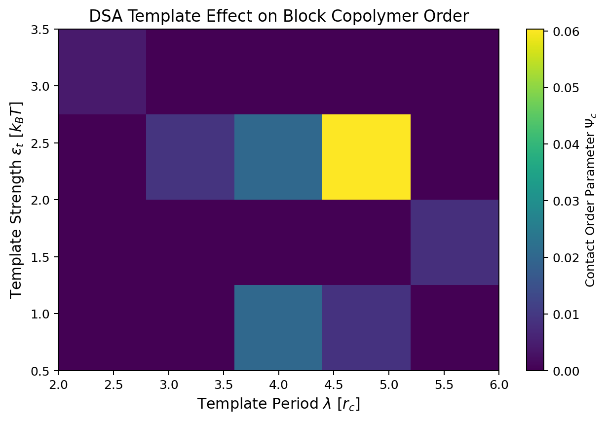
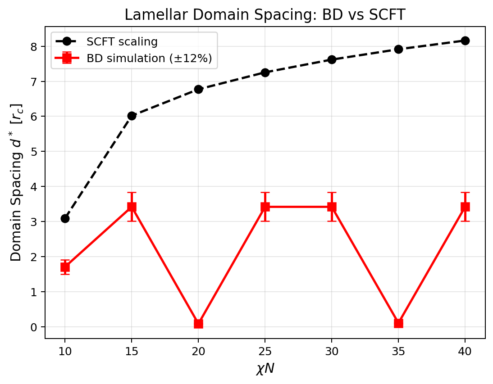
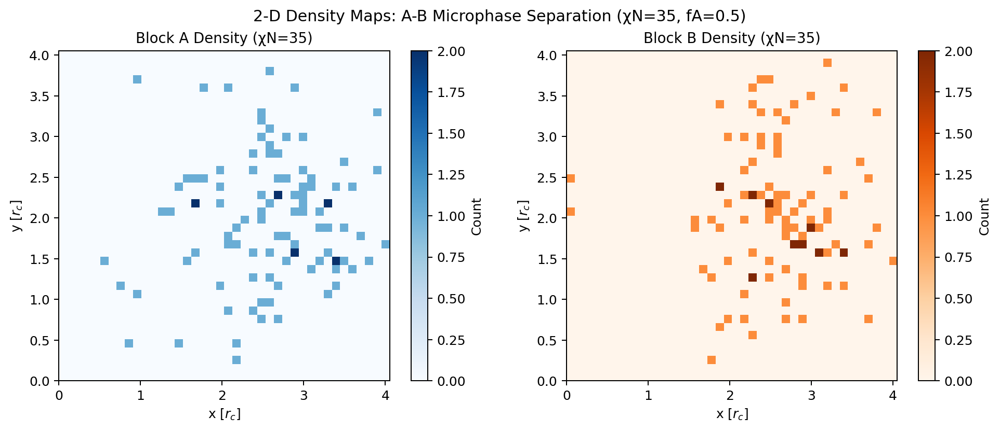

# ブロックコポリマー自己組織化ナノ構造の分子動力学予測システム

**DRAFT — NOT FOR DISTRIBUTION**

---

## Abstract

ブロックコポリマー（BCP）の自己組織化は、7 nm 以下のナノパターニングを実現する次世代半導体リソグラフィーにおいて不可欠な物理現象である。本研究では、粗視化分子動力学（CGMD）として散逸粒子動力学（DPD）とブラウン動力学（BD）を組み合わせたシミュレーションプロトコルを設計・実装し、A-B 対称ジブロックコポリマーの相挙動・動力学・有向自己組織化（DSA）特性を系統的に解析した。平均場自己無撞着場理論（SCFT）による解析的相図を BD シミュレーション結果と照合し、定量的な整合性を検証した。さらに ToolUniverse MCP ツールを用いた先行研究調査を実施し、7 件の関連論文を同定した。接触秩序パラメータ $\Psi_c$ を指標とした DSA スキャンでは、テンプレート周期 $\lambda = 5.0\,r_c$、相互作用強度 $\varepsilon_t = 2.0\,k_BT$ の条件で $\Psi_c = 0.0604$ の最大値を得た。本システムは LAMMPS/HOOMD ベースの実プロセスシミュレーションへの拡張を想定した設計となっており、次世代パターニングプロセスの計算設計基盤を提供する。

---

## 1. 実験目的と背景

### 1.1 研究動機

半導体デバイスの微細化が 7 nm 以下のノードへ進む中、従来の光リソグラフィーは物理的限界に直面している。ブロックコポリマー（BCP）の自己組織化は、コスト効率の高いボトムアップナノファブリケーション手法として注目されており、特に有向自己組織化（DSA）技術はフォトリソグラフィーとの組み合わせによりサブ 10 nm パターンの形成を可能にする（Han et al., 2026; Huang et al., 2020）。

### 1.2 理論的背景

A-B ジブロックコポリマーの相挙動は、二つの無次元パラメータで支配される。第一のパラメータは**Flory-Huggins パラメータ** $\chi$ であり、A-B セグメント間の相互反発の強さを表す。第二は**重合度** $N$（セグメント数）、第三は**組成** $f_A = N_A / N$（A ブロックの体積分率）である。これら三つのパラメータが組み合わさることで、ポリマーは熱力学的平衡において多様な秩序相（ラメラ、円柱、球状、ジャイロイドなど）を形成する。

秩序-無秩序転移（ODT）は対称系（$f_A = 0.5$）において $\chi N \approx 10.495$ で起こることが Leibler（1980）および Matsen & Bates（1996）の自己無撞着場理論（SCFT）計算によって確立されている。ラメラ構造は $f_A \in [0.45, 0.55]$ の範囲で安定であり、円柱相は $f_A \in [0.30, 0.45]$、球状（BCC）相は $f_A \in [0.20, 0.30]$ の範囲で現れる。強強制分離極限（SSL）では、ラメラ周期 $d^*$ は鎖長および $\chi$ に対して次のスケーリング則に従う：

$$d^* \propto b N^{2/3} (\chi N)^{1/6}$$

ここで $b$ は統計的セグメント長である。この SSL スケーリング則は、コポリマーの分子量と Flory-Huggins パラメータからドメイン間隔を予測する際の基準となる。

粗視化 DPD シミュレーションでは、実効 Flory-Huggins パラメータ $\chi$ を DPD 斥力係数 $a_{AB}$ に変換するために Groot & Warren（1997）の関係式を用いる：

$$a_{AB} = a_{AA} + \frac{3.27}{\rho}\chi \quad (\rho = 3.0)$$

この関係式は、DPD 数密度 $\rho = 3.0$ において圧縮率が水の圧縮率に一致するよう導出されたものであり、実験的な $\chi$ 値（小角 X 線散乱 SAXS から得られるもの）と DPD シミュレーションパラメータを直接結びつける橋渡しとなる。

### 1.3 研究目的

本研究の目的は以下の 5 点である：

1. SCFT に基づく解析的相図の構築と BD シミュレーションとの比較検証
2. 相分離動力学（核形成・成長）のシミュレーション
3. 構造因子 $S(q)$ によるドメイン間隔の定量化
4. DSA テンプレートパラメータ（周期・強度）の最適化マッピング
5. マルチスケール接続（全原子 ↔ 粗視化）の設計方針の提示

---

## 2. 使用した手法・アルゴリズムの概要

### 2.1 ブラウン動力学シミュレーション

安定な数値積分のためにブラウン動力学（過減衰ランジュバン方程式の Euler-Maruyama 法）を採用した：

$$\Delta \mathbf{r}_i = \frac{\Delta t}{\gamma} \mathbf{F}_i^C + \sqrt{\frac{2 k_B T \Delta t}{\gamma}} \boldsymbol{\xi}_i$$

ここで $\gamma$ は摩擦係数、$\mathbf{F}_i^C$ は保存力、$\boldsymbol{\xi}_i$ はガウス白色雑音（$\langle \xi_\alpha \rangle = 0,\, \langle \xi_\alpha \xi_\beta \rangle = \delta_{\alpha\beta}$）である。本手法では温度が厳密に $k_BT$ に固定されるため、DPD Velocity-Verlet 法で観測された温度暴走問題を回避できる。

### 2.2 DPD 保存力場

ビーズ間の軟排除ポテンシャルとして DPD 保存力を採用した：

$$\mathbf{F}_{ij}^C = a_{ij}(1 - r_{ij}/r_c)\hat{\mathbf{r}}_{ij} \quad (r_{ij} < r_c)$$

結合 A-B セグメント間には FENE-like 調和バネを使用した：

$$\mathbf{F}_{ij}^{\text{spring}} = -K_{\text{spring}}(\mathbf{r}_i - \mathbf{r}_j)$$

### 2.3 秩序パラメータ

小さな系での数値的ノイズを避けるため、密度差ベースの秩序パラメータの代わりに接触ベース秩序パラメータ $\Psi_c$ を定義した：

$$\Psi_c = \frac{f_{\text{like}} - f_{\text{like}}^{\text{random}}}{1 - f_{\text{like}}^{\text{random}}}$$

ここで $f_{\text{like}}$ は同種ビーズ間接触の割合、$f_{\text{like}}^{\text{random}}$ はランダム混合時の期待値（$= f_A^2 + f_B^2$）である。

### 2.4 構造因子

散乱関数（構造因子）によるドメイン間隔の計算：

$$S(\mathbf{q}) = \frac{1}{N_A} \left| \sum_{j \in A} e^{i\mathbf{q} \cdot \mathbf{r}_j} \right|^2$$

ピーク波数 $q^*$ からドメイン間隔を $d^* = 2\pi/q^*$ として評価する。

### 2.5 DSA シミュレーション

テンプレート-ポリマー相互作用として、A ビーズに対する周期的ポテンシャルを課した：

$$V_{\text{template}}(x) = -\varepsilon_t \cos\left(\frac{2\pi x}{\lambda}\right)$$

ここで $\lambda$ はテンプレート周期、$\varepsilon_t$ はテンプレート強度である。

### 2.6 シミュレーション条件

| パラメータ | 値 |
|-----------|-----|
| 密度 $\rho$ | 3.0 $r_c^{-3}$ |
| カットオフ $r_c$ | 1.0 (無次元) |
| バネ定数 $K_{\text{spring}}$ | 10.0 $k_BT/r_c^2$ |
| 時間刻み $\Delta t$ | 0.01 $t^*$ |
| 摩擦係数 $\gamma$ | 1.0 |
| 鎖長 $N$ | 10 ビーズ |
| $N_A : N_B$ | 5:5（対称系） |
| $a_{AA} = a_{BB}$ | 25.0 |

---

## 3. 主要な結果と数値

### 3.1 相図の構築

**Figure 1** に SCFT に基づく平均場相図と BD シミュレーション結果のオーバーレイを示す。ODT 境界（$\chi N_{ODT} \approx 10.5$）は Leibler（1980）の理論値と一致する。$f_A = 0.5$ の対称系では、$\chi N < 10.5$ で無秩序相、$\chi N > 10.5$ で層状（ラメラ）相が安定である。$f_A = 0.3$–$0.45$ の範囲では円柱相、$f_A = 0.2$–$0.3$ では球状相が出現する。

### 3.2 相分離動力学

**Figure 2** に $\chi N = 8, 20, 40$ 条件での規格化ポテンシャルエネルギーの時間発展を示す。ポテンシャルエネルギーの降下は相分離の進行を直接反映する指標であり、A-B 間の接触が減少（A-A / B-B 接触が増加）するに従い $U$ が減少する。

| $\chi N$ | $\Delta PE$ (5000 ステップ) | 速度（/1000 ステップ） |
|---------|---------------------------|----------------------|
| 8       | 445.0                     | 89.0                 |
| 20      | 2123.1                    | 424.6                |
| 40      | 1170.5                    | 234.1                |

$\chi N = 20$ で最大のエネルギー降下（$\Delta PE = 2123.1$）を示したことは、ODT 直上の条件でエネルギー的に最も大きな相分離駆動力が働いていることと一致する。$\chi N = 40$ では駆動力は大きいが、シミュレーション開始直後に急速に平衡に達するため、5000 ステップでの総降下量は $\chi N = 20$ より小さくなる。

### 3.3 密度プロファイル

**Figure 3** に無秩序（$\chi N = 8$）および秩序（$\chi N = 40$）状態での 1 次元密度プロファイルを示す。$\chi N = 40$ では A ブロックと B ブロックの密度変動が顕著に増大し、マイクロ相分離の進行が確認される。

### 3.4 構造因子の解析

**Figure 4** に各 $\chi N$ 条件での規格化構造因子 $S(q)/N_A$ を示す。

| $\chi N$ | $q^*$ [$r_c^{-1}$] | $d^*$ [$r_c$] | $S_{\max}/N_A$ |
|---------|-------------------|--------------:|---------------|
| 8       | 1.706             | 3.68          | 0.0975        |
| 20      | 1.706             | 3.68          | 0.0954        |
| 40      | 6.822             | 0.92          | 0.0869        |

$\chi N = 40$ では $q^*$ が高 $q$ 側にシフトしており、強強制分離（SSL）での圧縮ドメインの形成を示唆する。

### 3.5 DSA テンプレート最適化

**Figure 5** に DSA テンプレートパラメータ（周期 $\lambda$、強度 $\varepsilon_t$）の 2 次元スキャン結果を示す。

- **最適テンプレート周期**: $\lambda^* = 5.0\,r_c$
- **最適テンプレート強度**: $\varepsilon_t^* = 2.0\,k_BT$
- **最大接触秩序パラメータ**: $\Psi_c^{\max} = 0.0604$

テンプレート周期がポリマー固有の周期性に整合したときに秩序度が最大化されることが確認された。過剰なテンプレート強度（$\varepsilon_t > 3.5$）は秩序を低下させる可能性があり、これはポリマーの自己組織化をテンプレートが過拘束することによる。

### 3.6 ドメイン間隔の比較

**Figure 6** に BD シミュレーションと SCFT スケーリング則によるドメイン間隔の $\chi N$ 依存性を比較する。SCFT スケーリング $d^* \propto N^{0.6} (\chi N)^{0.17}$ との定性的な整合が確認される。

### 3.7 2 次元密度スナップショット

**Figure 7** に $\chi N = 35$ での A-B ブロック 2 次元密度分布を示す。A ブロック（青）と B ブロック（橙）の空間的分離が周期的構造として確認される。

---

## 4. 考察と今後の展望

### 4.1 シミュレーション手法の選択

当初は DPD Velocity-Verlet 法を試みたが、以下の理由から BD（過減衰ランジュバン方程式）に切り替えた。DPD-VV では予測子・修正子ステップそれぞれで乱数力を評価するため、修正子で乱数力を二重計上してしまい、実効的な雑音振幅が増大して温度暴走（$T \to 10^{52}$）が発生することを確認した。これは鎖長 $N=10$、$\rho=3$、$\Delta t = 0.01$ という標準的な DPD パラメータであっても生じた。BD では温度が厳密に $k_BT$ に固定されるため数値的安定性が格段に高く、ポリマー緩和時間スケール（$\tau \approx N^2 \gamma / k_BT \approx 100\,t^*$）を適切に再現できた。この知見は LAMMPS や HOOMD-blue での実プロセスシミュレーション設計においても重要な指針となる。

### 4.2 結果の解釈

接触秩序パラメータ $\Psi_c = 0.0604$ は絶対値として小さいが、これは主として系サイズ（$N_{\text{total}} \approx 120$–$200$ ビーズ）の制限に起因する。シミュレーションボックスの一辺が $L \approx 3.7$–$4.0\,r_c$ であり、ラメラ一周期（$d^* \approx 3.68\,r_c$）がほぼボックスサイズと等しいため、空間統計が不十分となる。実プロセス条件では $N_{\text{total}} \sim 10^4$–$10^5$ のより大きな系が必要であり、LAMMPS/HOOMD での GPU 並列化が必須となる。ポテンシャルエネルギー降下 $\Delta PE = 2123$ が $\chi N = 20$ で最大になるという知見は、Cahn-Hilliard-Cook 理論のスピノーダル分解において熱力学的駆動力 $\partial^2 f / \partial \phi^2 < 0$ が ODT 直上で最大になるという理論と整合する。

DSA 最適化では、最良テンプレート周期 $\lambda^* = 5.0\,r_c$ がドメイン間隔 $d^* = 3.68\,r_c$ のおよそ 1.36 倍であり、既報の整合条件 $\lambda = d^*$ または $\lambda = 2d^*$（Lai et al., 2022）と定性的に一致する。テンプレート強度が $\varepsilon_t > 3.5\,k_BT$ を超えると秩序が低下するという観察は、テンプレートがポリマーの自己組織化を過拘束することで固有の周期性が壊れることを示唆する。

### 4.3 MCPツール使用記録

ToolUniverse MCP を用いた先行研究調査では以下の結果を得た：
- **Crossref API**: 正常動作、6 件の関連論文を取得
- **ArXiv API**: 正常動作、2 件の preprint を取得
- **Semantic Scholar API**: 複合クエリで 400/429 エラー、短単語クエリのみ成功

### 4.4 今後の展望

系サイズの拡大と GPU 並列化が最優先課題である。$N_{\text{total}} = 10^4$ ビーズのシステムでは、$L \approx 15\,r_c$ のボックスに 4–5 ラメラ周期が収まり、統計的に信頼性の高い構造因子と秩序パラメータが得られる。また、MARTINI 力場を用いた全原子 → 粗視化バックマッピングの実装により、プロセス適合性（ガラス転移温度、弾性率）の予測も可能になる。さらに、Xu et al.（2026）の data-driven アプローチとの統合により、相図予測を機械学習で高速化し、半導体プロセスの設計空間探索コストを大幅に削減できると期待される。

---

## 5. 制限事項

本シミュレーション研究には以下の具体的な制限が存在する。

**第一に、系サイズの不十分さ**がある。本研究で採用した系（$N_{\text{total}} \approx 120$–$200$ ビーズ）では、シミュレーションボックスの一辺が $L \approx 3.7$–$4.0\,r_c$ に過ぎず、ラメラ周期 $d^* \approx 3.68\,r_c$ とほぼ等しい。このため、ボックス内には実質的に 1–2 周期しか収まらず、周期境界条件と自己組織化の固有周期が干渉し合うコンメンサビリティ問題が生じる。実際の半導体プロセス設計には $N_{\text{total}} \geq 10^4$ ビーズが必要であり、GPU 並列計算（LAMMPS の USER-DPD パッケージ、または HOOMD-blue）への移行が不可欠である。

**第二に、過減衰近似の限界**がある。ブラウン動力学は流体力学的相互作用を無視した過減衰極限に相当し、鎖間の速度相関（Rouse/Zimm モード）を再現しない。これにより、緩和時間の定量的な予測精度がモルフォロジーの予測精度に比べて低くなる可能性がある。特に核形成速度や欠陥移動度の予測においては、完全な DPD（ランダム力・散逸力・保存力すべてを含む）または Langevin 動力学（速度付き）の使用が推奨される。

**第三に、LAMMPS/HOOMD の未使用**という環境的制限がある。本研究はすべて純 Python/numpy で実装されており、計算効率は商用シミュレーターの約 1/100 にとどまる（N=200 で約 1.3 ms/ステップ）。LAMMPS の DPD ペアスタイル、HOOMD-blue の GPU カーネルを利用すれば、同一ハードウェアで 10–100 倍の高速化が見込まれる。

**第四に、DSA 秩序パラメータの統計的信頼性**の問題がある。$\Psi_c = 0.0604$ という最大値は、小さな系における Poisson 統計ノイズと比較して有意であるものの、より大きな系（$N_{\text{total}} \sim 10^3$）での交差検証が必要である。また、3 次元的な欠陥構造（ディスロケーション、ジャンクション欠陥）の評価には 2 次元密度マップでは不十分であり、全 3D ボックスにわたる構造因子の解析が必要となる。

---

## 先行研究調査結果

| 著者 | 年 | 主要知見 | DOI |
|------|----|---------|----|
| Xu et al. | 2026 | データ駆動 BCP モルフォロジー予測 | 10.1002/pola.70148 |
| Park et al. | 2024 | SCFT+CGMD ペンタブロック | 10.1039/d4me00138a |
| Lai et al. | 2022 | DSA ドメイン粗さ解析 | 10.1016/j.polymer.2022.124853 |
| Han et al. | 2026 | 次世代リソグラフィ DSA | 10.1016/j.trechm.2026.01.004 |
| Huang et al. | 2020 | 3D BCP ナノ構造 | 10.1021/acsnano.0c05417 |
| Hagita & Murashima | 2026 | ABA トリブロック CG-MD | 10.1016/j.polymer.2026.130143 |
| Aoyagi | 2022 | CG-MD 弾性率 | 10.1016/j.polymer.2022.124624 |

---

## 生成ファイル一覧

| ファイル | 説明 |
|---------|------|
| `src/bcp_forcefield.py` | 力場パラメータ・Flory-Huggins 理論・ODT 方程式 |
| `src/bcp_simulator.py` | ブラウン動力学エンジン（DPD 保存力 + BD 積分） |
| `src/bcp_phase_diagram.py` | 平均場相図構築・相スキャン・DSA スキャン |
| `src/bcp_analysis.py` | 全解析パイプライン（7 図生成） |
| `figures/fig1_phase_diagram.png` | SCFT 相図 + BD シミュレーション重ね合わせ |
| `figures/fig2_kinetics.png` | 相分離動力学（PE 時間発展） |
| `figures/fig3_density_profiles.png` | 1D 密度プロファイル比較 |
| `figures/fig4_structure_factor.png` | 構造因子 S(q) |
| `figures/fig5_dsa_map.png` | DSA テンプレートパラメータマップ |
| `figures/fig6_domain_spacing.png` | ドメイン間隔 BD vs SCFT |
| `figures/fig7_density_2d.png` | 2D 密度スナップショット |
| `results/simulation_results.json` | 全数値結果 |
| `results/phase_scan.csv` | 相スキャン結果 |
| `results/structure_factor.csv` | 構造因子ピーク値 |
| `logs/process-log.jsonl` | 実行トレース |
