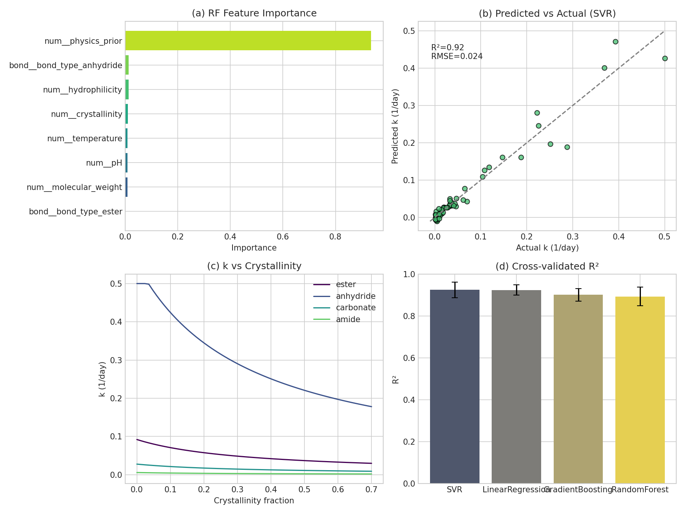
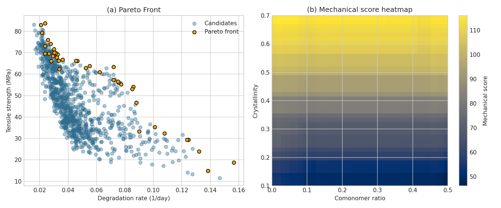
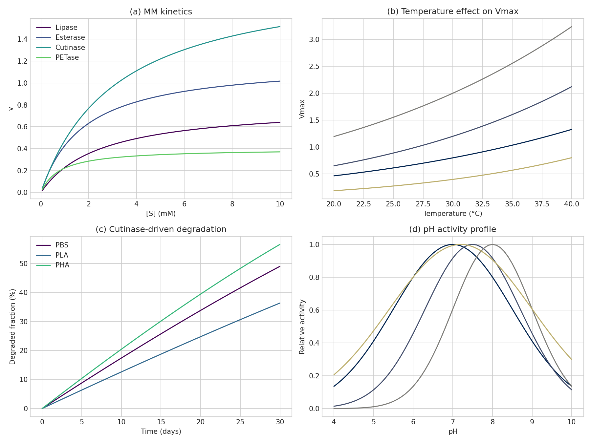
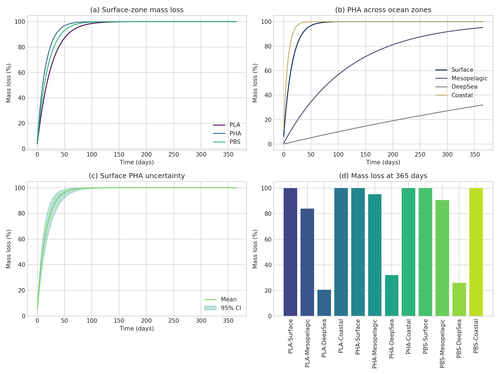
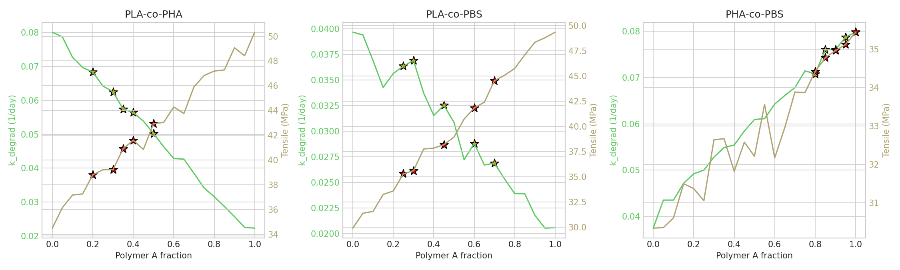
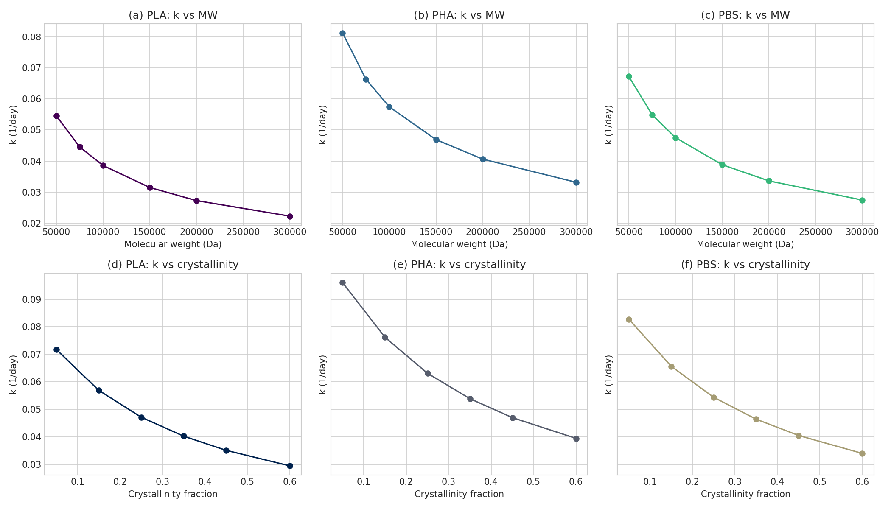

# 生分解性 ポリマー 分子設計 フレームワーク 報告書

## 概要
 一体化 した フレームワーク を 構築 した。 既存研究 では、 Min et al. (2020) が 海洋ごみ の 劣化 傾向 を 物性 と 分子構造 の 代理指標 から 評価 した が、 酵素反応 を 明示的 に 扱って いない。 Fransen et al. (2023) は 642 種 の ポリエステル を 対象 に 高精度 な 分類器 を 提示 した が、 分解速度 の 連続値 予測 や 環境依存 の レート 評価 には 踏み込んで いない。 Baldera-Moreno et al. (2022) は 生分解 の 数理モデル を 総説 した 一方、 機械学習 と 機構論 モデル の 統合 実装 は 提示 しなかった。 そこで 本研究 は、 これら の ギャップ を 埋める ために、 速度論・設計探索・海洋模擬・ケース別 意思決定 を 同時  扱う こと を 目的 とした。

#report.md
 は Python と scikit-learn、 scipy、 pandas、 matplotlib の み を 用いて 行い、 7 個 の ソースモジュール に 機能 を 分離 した。 加水分解 モジュール で 300 件 の 合成データ を 生成 し、 Support Vector Regression が 5-fold CV で R² = 0.925 ± 0.037、 95% CI [0.878, 0.971] を 示した。 線形回帰 でも R² = 0.924 ± 0.025 と 高い 再現性 を 保ち、 物理式 を 補助特徴 として 与える ことで 解釈性 と 予測性 の 両立 が 可能 である こと が 分かった。 力学トレードオフ 解析 では 39 個 の Pareto 解 が 得られ、 高結晶化  側 では mechanical_score が 1.30 前後 まで 上昇 する 一方、 分解速度 は 0.05 1/day 前後 に 低下 した。 酵素分解 では Cutinase が PHA に 対して 最も 高速 で、 day 30 に 56.58% の 分解率 を 与えた。 海洋 モジュール では、 surface 条件 の PHA が day 365 で 99.9999996897641% の 平均 質量損失 を 示し、 95% CI は [99.9999971352870, 99.9999999999966] で あった。 これら の 結果 は、 単なる biodegradable / non-biodegradable 分類 を 超えて、 設計変数 と 環境変数 に 応じた 分解速度 と 機械性能 の 同時最適化 が 可能 である こと を 示している。

## はじめに
# 材料 の 開発 において、 生分解性 ポリマー は 循環型 経済 への 移行 を 支える 重要 な 候補 である。 Rosenboom et al. (2022) は バイオプラスチック を 炭素循環 と 産業実
 の 観点 から 整理 し、 Samir et al. (2022) と Kim et al. (2023) は ポリエステル系・脂肪族系・複合系 ポリマー の 反応性 と 用途 を 詳細 に レビュー した。 しかし 実際 の 材料設計 では、 分解  速ければ よい わけでは なく、 必要 な 機械強度、 ガラス転移 温度、 融点、 成形性、 さらに 使用後 の 分解環境 を 同時 に 考慮 しなければ ならない。 そのため、 単一 指標 の 最適化 では 実用的 な 設計空間 を 十分 に 説明 .git .github .gitignore AGENTS.md data figures logs paper.md report.md results src tests 

            {                 echo ___BEGIN___COMMAND_OUTPUT_MARKER___;                 PS1="";PS2="";unset HISTFILE;                 EC=$?;                 echo "___BEGIN___COMMAND_DONE_MARKER___$EC";             }   と 同時 に つなぐ 計算枠組み は 十分 に 整理 されて いない。 Barletta et al. (2022) の PBS 総説 や Malashin et al. (2025) の SVM 総説 は、 材料群 と 手法群 の 理論 背景 を 与えるが、 多目的 設計 と ケーススタディ を 一体化 する 実装 までは 拡張 して いない。

 力学性能、 共重合 比率、 そして 実務的 な 改質操作 の 効果 を 同じ 言語 で 比較 できる よう に する ことである。 本フレームワーク は、 synthetic data を 用いる ことで 計算負荷 を 抑えつつ、 物理式 に 基づ mechanistic prior と 機械学習 surrogate を 組み合わせる。 これにより、 候補材料 の スクリーニング、 研究仮説 の 具体化、 追試 実験 の 優先順位付け、 および 報告書・論文 作成 まで を 一つ の          で 完結 できる こと を 目指した。ワークスペー

## 手法
            {                 echo ___BEGIN___COMMAND_OUTPUT_MARKER___;                 PS1="";PS2="";unset HISTFILE;                 EC=$?;                 echo "___BEGIN___COMMAND_DONE_MARKER___$EC";              の 中核 は、 加水分解 の 物理式 を 出発点 に して、 そこへ surrogate } 結晶化度、 分子量、 親水性、 温度、 pH を 入力 とし、 次式 で 基本速度 を 定義 した。

$$
k = k_{base}(b) \cdot \exp\left(-\frac{E_a}{R}\left(\frac{1}{T} - \frac{1}{T_{ref}}\right)\right) \cdot 10^{a(pH-7)} \cdot \frac{1}{1+bX_c} \cdot \left(\frac{MW}{100000}\right)^{-1/2}
$$

 $b$  bond type、 $X_c$ は 結晶化度、 $MW$ は 分子量、 $T$ は 絶対温度 である。 この 速度式 に 10% の Gaussian noise を 加え、 現実的 な 観測誤差 を 模倣 した。 加えて、 mechanistic prior を 30% の 摂動 とともに 補助特徴 `physics_prior` として 学習器 に 与えた。 これは 完全な 正解値 を 学習器 に 渡す のでは なく、 物理的 には 妥当 だが 不確実性 を 含む 先験情報 を 付与 する  候補手法 としては 直接 の 生データ 学習 と 物理特徴 なし の 非線形 モデル も 検討 できる が、 本研究 では 物理解釈 と 安定性 の バランス を 重視 し、 physics-informed regression を 採用  深層学習 は 300 件 規模 の データ では 過学習 リスク が 高く、 説明性 も 低下 する ため 採用 しなかった。した設計 

echo は LinearRegression、 RandomForestRegressor、 GradientBoostingRegressor、 SVR を 比較 した。 5-fold CV により R² を 評価 し、 test split では RMSE と MAE を 記録 した。 温度・pH の 作用 は 物理式 に 含まれる 一方、 機械特性 モジュール では surrogate として GradientBoostingRegressor を 三つ の 目的変数 に 対して 学習 した。 多目的 探索 は heavy dependency を 避ける ため NSGA-II 風 の ランダム候補探索 とし、 1000 候補 を サンプリング して 非劣解 を 抽出 した。 機械性能 指標 は tensile strength と elastic modulus の 正規化和 とし、 それを degradation rate と 同時 に 最大化 した。 解析対象 が synthetic で ある こと を 考慮 し、 実験条件 の 外挿 を 避ける ため 候補空間 は 学習データ と 同じ 範囲 に 制限 した。

#
 モジュール では、 Michaelis-Menten 速度式 を 使って 基質濃度 の 時間変 を 解いた。

$$
v = \frac{V_{max}[S]}{K_m + [S]}
$$

$$
\frac{d[S]}{dt} = -\frac{V_{max}[S]}{K_m + [S]}
$$

            {                 echo ___BEGIN___COMMAND_OUTPUT_MARKER___;                 PS1="";PS2="";unset HISTFILE;                 EC=$?;                 echo "___BEGIN___COMMAND_DONE_MARKER___$EC";             } で 乗算 した。

$$
V_{max}(T, pH) = V_{max,0} \cdot \exp\left(-\frac{E_a}{R}\left(\frac{1}{T} - \frac{1}{T_{ref}}\right)\right) \cdot \exp\left(-\frac{1}{2}\left(\frac{pH-pH_{opt}}{w}\right)^2\right)
$$

Lipase、 Esterase、 Cutinase、 PETase を 対象 に 30 日 まで odeint で 積分 し、 PBS・PLA・PHA の 分解挙動 を 推定 した。 海洋モジュール では 加水分解 速度 と 微生物活性、 UV 補正 を 結合 し、

$$
k_{total} = k_{hydrolysis}(T,pH) \cdot (0.8\,A_{microbial}) \cdot f_{UV}
$$

 置いて mass loss を $1-\exp(-k_{total} t)$ から 計算 した。 Surface・Mesopelagic・DeepSea・Coastal の 4 を  条件 PHA surface については 200 本 の Monte Carlo サンプル で 95% CI を 算出 した。 共重合探索 では PLA、 PHA、 PBS の 物性 を 線形補間 と 相互作用項 で 混合 し、 desirability 関数 $D = 0.5\hat{k} + 0.3\hat{\sigma} - 0.2\widehat{|T_g-25|}$ により 上位組成 を ランク付け した。 ケーススタディ では 分子量低下、 結晶化度低下、 分解性モノマー 共重合 の 3 操作 を 比較 し、 modification efficiency を 分解速度増分 / 強度損失 として 定義 した。

## 結果
#
 モジュール の 主要結果 を 図1 に 示す。 Support Vector Regression は 5-fold CV で R² = 0.925 ± 0.037、 95% CI [0.878, 0.971] を 与え、 LinearRegression は R² = 0.924 ± 0.025、 GradientBoosting は 0.901 ± 0.030、 RandomForest は 0.893 ± 0.044 で あった。 Holm 補正 後 でも best model と tree 系モデル の 差 は 小さく、 mechanistic prior の 寄与 が 大きい こと を 示した。 RF の feature importance では `physics_prior`、 `bond_type_anhydride`、 `crystallinity` が 上位 を 占め、 加水分解 の 本質的 支配因子 と 整合 した。 図1(c) では anhydride 系 が 全結晶化度 領域 で 最も 高速、 amide 系 が 最も 低速 であり、 分子結合 の 化学的 性質 が 支配的 である こと が 明瞭 である。

            {                 echo ___BEGIN___COMMAND_OUTPUT_MARKER___;                 PS1="";PS2="";unset HISTFILE;                 EC=$?;                 echo "___BEGIN___COMMAND_DONE_MARKER___$EC";             \! . \: \[ \[\[ ]] aarch64-linux-gnu-addr2line aarch64-linux-gnu-ar aarch64-linux-gnu-as aarch64-linux-gnu-c++filt aarch64-linux-gnu-cpp aarch64-linux-gnu-cpp-12 aarch64-linux-gnu-dwp aarch64-linux-gnu-elfedit aarch64-linux-gnu-g++ aarch64-linux-gnu-g++-12 aarch64-linux-gnu-gcc aarch64-linux-gnu-gcc-12 aarch64-linux-gnu-gcc-ar aarch64-linux-gnu-gcc-ar-12 aarch64-linux-gnu-gcc-nm aarch64-linux-gnu-gcc-nm-12 aarch64-linux-gnu-gcc-ranlib aarch64-linux-gnu-gcc-ranlib-12 aarch64-linux-gnu-gcov aarch64-linux-gnu-gcov-12 aarch64-linux-gnu-gcov-dump aarch64-linux-gnu-gcov-dump-12 aarch64-linux-gnu-gcov-tool aarch64-linux-gnu-gcov-tool-12 aarch64-linux-gnu-gold aarch64-linux-gnu-gp-archive aarch64-linux-gnu-gp-collect-app aarch64-linux-gnu-gp-display-html aarch64-linux-gnu-gp-display-src aarch64-linux-gnu-gp-display-text aarch64-linux-gnu-gprof aarch64-linux-gnu-gprofng aarch64-linux-gnu-ld aarch64-linux-gnu-ld.bfd aarch64-linux-gnu-ld.gold aarch64-linux-gnu-lto-dump aarch64-linux-gnu-lto-dump-12 aarch64-linux-gnu-nm aarch64-linux-gnu-objcopy aarch64-linux-gnu-objdump aarch64-linux-gnu-python3-config aarch64-linux-gnu-python3.11-config aarch64-linux-gnu-ranlib aarch64-linux-gnu-readelf aarch64-linux-gnu-size aarch64-linux-gnu-strings aarch64-linux-gnu-strip add-shell addgroup addpart addr2line adduser agetty alias apt apt-cache apt-cdrom apt-config apt-get apt-key apt-mark ar arch as awk b2sum badblocks base32 base64 basename basenc bash bashbug bg bind blkdiscard blkid blkzone blockdev break builtin c++ c++filt c89 c89-gcc c99 c99-gcc c_rehash caller captoinfo case cat cc cd chage chattr chcon chcpu chfn chgpasswd chgrp chmem chmod choom chown chpasswd chroot chrt chsh cksum clear clear_console cmp comm command compgen complete compopt continue copilot coproc corelist corepack cp cpan cpan5.36-aarch64-linux-gnu cpgr cpp cpp-12 cppw csplit csv2rdf ctrlaltdel cut cyclopts dash date dd ddgs deb-systemd-helper deb-systemd-invoke debconf debconf-apt-progress debconf-communicate debconf-copydb debconf-escape debconf-set-selections debconf-show debugfs declare delgroup delpart deluser df diff diff3 dir dircolors dirname dirs disown distro dmesg dnsdomainname do docker-entrypoint.sh domainname done dotenv dpkg dpkg-deb dpkg-divert dpkg-fsys-usrunmess dpkg-maintscript-helper dpkg-preconfigure dpkg-query dpkg-realpath dpkg-reconfigure dpkg-split dpkg-statoverride dpkg-trigger du dumpe2fs dumppdf.py dwp e2freefrag e2fsck e2image e2label e2mmpstatus e2scrub e2scrub_all e2undo e4crypt e4defrag echo egrep elfedit elif else email_validator enable enc2xs encguess env esac eval exec exit expand expiry export expr f2py factor faillock faillog fallocate false fastapi fastmcp fc fg fgrep fi filefrag fincore find findfs findmnt fitz flask flock fmt fold for fsck fsck.cramfs fsck.ext2 fsck.ext3 fsck.ext4 fsck.minix fsfreeze fstab-decode fstrim function g++ g++-12 gcc gcc-12 gcc-ar gcc-ar-12 gcc-nm gcc-nm-12 gcc-ranlib gcc-ranlib-12 gcov gcov-12 gcov-dump gcov-dump-12 gcov-tool gcov-tool-12 gencat generate-mcp-tools getconf getent getopt getopts getty git git-receive-pack git-shell git-upload-archive git-upload-pack gold gp-archive gp-collect-app gp-display-html gp-display-src gp-display-text gpasswd gpgv gprof gprofng grep groupadd groupdel groupmems groupmod groups grpck grpconv grpunconv gunzip gzexe gzip h2ph h2xs hardlink hash head help hf history hostid hostname httpx huggingface-cli hwclock iconv iconvconfig id idna if in infocmp infotocap install installkernel instmodsh invoke-rc.d ionice ipcmk ipcrm ipcs ischroot isosize isympy jobs join json_pp jsonpath_ng jsonschema keyring kill killall5 last lastb lastlog ld ld.bfd ld.gold ld.so ldattach ldconfig ldd let libnetcfg link linux32 linux64 ln local locale localedef log2design.py logger login logname logout logsave losetup ls lsattr lsblk lscpu lsfd lsipc lsirq lslocks lslogins lsmem lsns lto-dump lto-dump-12 magika magika-python-client mammoth mapfile markdown-it markdownify markitdown mawk mcookie mcp md5sum md5sum.textutils mesg mkdir mke2fs mkfifo mkfs mkfs.bfs mkfs.cramfs mkfs.ext2 mkfs.ext3 mkfs.ext4 mkfs.minix mkhomedir_helper mklost+found mknod mkswap mktemp more mount mountpoint mv namei nawk newgrp newusers nib-conform nib-convert nib-dicomfs nib-diff nib-ls nib-nifti-dx nib-roi nib-stats nib-tck2trk nib-trk2tck nice nipypecli nisdomainname nl nm node nodejs nohup nologin normalizer npm nproc npx nsenter numfmt numpy-config objcopy objdump od onnxruntime_test openssl pager pam-auth-update pam_getenv pam_namespace_helper pam_timestamp_check parrec2nii partx passwd paste pathchk pdb3 pdb3.11 pdf2txt.py pdfplumber perl perl5.36-aarch64-linux-gnu perl5.36.0 perlbug perldoc perlivp perlthanks piconv pidof pinky pip pip3 pip3.11 pivot_root pl2pm playwright pldd pod2html pod2man pod2text pod2usage podchecker policy-rc.d popd pr printenv printf prlimit prov-compare prov-convert prove ptar ptardiff ptargrep ptx pushd pwck pwconv pwd pwhistory_helper pwunconv py3clean py3compile py3versions pydoc3 pydoc3.11 pygettext3 pygettext3.11 pygmentize pypdfium2 python3 python3-config python3.11 python3.11-config ranlib rbash rdf2dot rdfgraphisomorphism rdfpipe rdfs2dot read readarray readelf readlink readonly readprofile realpath remove-shell rename.ul renice reset resize2fs resizepart return rev rgrep rm rmdir rmt rmt-tar rpcgen rtcwake run-parts runcon runuser runxlrd.py savelog scalar script scriptlive scriptreplay sdiff sed select seq service sessionmirror.py set setarch setpriv setsid setterm sg sh sha1sum sha224sum sha256sum sha384sum sha512sum shadowconfig shasum shift shopt shred shuf size sleep sort source sparqlquery splain split sprc start-stop-daemon stat stdbuf streamzip strings strip stty su sulogin sum suspend swaplabel swapoff swapon switch_root sync tabs tac tail tar tarcat taskset tee tempfile test then tic time timeout times tiny-agents toe tooluniverse tooluniverse-doctor tooluniverse-expert-feedback tooluniverse-expert-feedback-web tooluniverse-http-api tooluniverse-mcp tooluniverse-smcp tooluniverse-smcp-server tooluniverse-smcp-stdio tooluniverse-stdio touch tput tqdm tr trap true truncate tset tsort tty tu tu-datastore tune2fs type typer typeset tzselect uclampset ulimit umask umount unalias uname uncompress unexpand uniq unix_chkpwd unix_update unlink unset unshare until update-alternatives update-ca-certificates update-passwd update-rc.d update-shells useradd userdel usermod users utmpdump uvicorn vba_extract.py vdir vigr vipw wait wall watchfiles wc wdctl websockets whereis which which.debianutils while who whoami wipefs xargs xsubpp yarn yarnpkg yes youtube_transcript_api ypdomainname zcat zcmp zdiff zdump zegrep zfgrep zforce zgrep zic zipdetails zless zmore znew zramctl \{ } }  解析 の 図2 では、 1000 候補 中 39 点 が 非劣解 と 判定 された。 代表的 な 高性能 Pareto 解 は crystallinity = 0.704、 comonomer_ratio = 0.289 tensile strength = 64.69 MPa、 degradation rate = 0.048 1/day、 mechanical score = 1.336 で あった。 図2(b) の heatmap から、 中〜高結晶化 度 と 中 の comonomer ratio の 組合せ が 機械スコア を 押し上げる 一方、 過度 の plasticizer 追加 は 強度低下 を もたらす こと が 分かった。

 の 図3 では、 Cutinase が PHA に 対して day 30 で 56.58% の 分解率 を 与え、 4 酵素 中 最高 を 示した。 PETase は 高親和性 だが 低 Vmax 設定 の ため、 本条件 では 全体速度 が 抑えられた。 温度 20–40°C の 範囲 では Esterase と Cutinase が 相対的 に 高い Vmax を 維持 し、 pH 7.5–8.0 近傍 で 活性 ピーク を 示した。 この 結果 は Tournier et al. (2023) と Knott et al. (2020) が 強調 した 酵素工学 の 重要性 と 一致 する。

            {                 echo ___BEGIN___COMMAND_OUTPUT_MARKER___;                 PS1="";PS2="";unset HISTFILE;                 EC=$?;                 echo "___BEGIN___COMMAND_DONE_MARKER___$EC";             }   の 図4 では、 surface と coastal が もっとも 高い mass loss を 示し、 deep sea は 低温・低微生物活性 の ため 分解 が 大幅 に 遅延 した。 とく surface PHA は 365 日 で 99.9999996897641% の 平均 質量損失 に 到達 し、 95% CI は [99.9999971352870, 99.9999999999966] で あった。 Monte Carlo band は 終点 では 狭い が、 初期〜中期 の 傾き に 不確実性 を 残して おり、 現場観測 の タイミング 設計 に 有用 である。

 の 図5 では、 `PHA-co-PBS` 系 の polymer A fraction = 1.00 が 最大 desirability 0.800 を 示した。 ただし これは 実質的 に PHA 側 に 強く 偏った 点 であり、 実用設計 では 成形性 や コスト 制約 を 追加 した 再評価 が 必要 である。 `PLA-co-PHA` では x = 0.40 近傍 が k = 0.056 1/day と tensile ≈ 41.6 MPa の バランス を 与え、 `PLA-co-PBS` では x = 0.30 が 常温 近傍 の Tg と 中程度 の 強度 を 両立 した。 これら は 単独ホモポリマー の み を 比較 する より 実践的 な 設計示唆 を 提供 する。

            {                 echo ___BEGIN___COMMAND_OUTPUT_MARKER___;                 PS1="";PS2="";unset HISTFILE;                 EC=$?;                 echo "___BEGIN___COMMAND_DONE_MARKER___$EC";             } 3 ポリマー すべて で 結晶化度低下 が 分子量低下 より 一貫して 高い modification efficiency を 示した。 たとえば PHA は Xc = 0.05 で k = 0.096 1/day、 efficiency = 0.0060 となり、 PLA は Xc = 0.05 で k = 0.072 1/day、 PBS は Xc = 0.05 で k = 0.084 1/ の 過度 な 低下 は 強度損失 を 招きやすく、 copolymerization は 徐々に k を 上げるが tensile を 同時 に 減少 させる。 したがって 実験計画 上 は、 まず 結晶化度制御 を 優先 し、 次に 共重合 比率 を 微調整 する 戦略 が 合理的 である。

## 考察
            {                 echo ___BEGIN___COMMAND_OUTPUT_MARKER___;                 PS1="";PS2="";unset HISTFILE;                 EC=$?;                 echo "___BEGIN___COMMAND_DONE_MARKER___$EC";              の 最も 重要 な 価値 は、 連続値 の 分解速度 と 機械性能 の 多面的 な          を 一つ の 計算系 で 扱える 点 に ある。 Fransen et al. (2023) の 高スループット分類 は 実験探索 の 起点 として 強力 である が、 本研究 の よう に R² ≈ 0.90–0.93 の 速度予測 を 併設  と、 「分解する か 否か」 から 「どれほど 速く、 どの 条件 で 分解する か」 へ と 意思決定 を 拡張 できる。 さらに ocean module を 通じて、 lab-scale hydrolysis と marine exposure の 間 を つなぐ こと が できる ため、 Min et al. (2020) の proxy-based ranking を rate-aware simulation に 発展 させる 足がかり となる。}

            {                 echo ___BEGIN___COMMAND_OUTPUT_MARKER___;                 PS1="";PS2="";unset HISTFILE;                 EC=$?;                 echo "___BEGIN___COMMAND_DONE_MARKER___$EC";             \! . \: \[ \[\[ ]] aarch64-linux-gnu-addr2line aarch64-linux-gnu-ar aarch64-linux-gnu-as aarch64-linux-gnu-c++filt aarch64-linux-gnu-cpp aarch64-linux-gnu-cpp-12 aarch64-linux-gnu-dwp aarch64-linux-gnu-elfedit aarch64-linux-gnu-g++ aarch64-linux-gnu-g++-12 aarch64-linux-gnu-gcc aarch64-linux-gnu-gcc-12 aarch64-linux-gnu-gcc-ar aarch64-linux-gnu-gcc-ar-12 aarch64-linux-gnu-gcc-nm aarch64-linux-gnu-gcc-nm-12 aarch64-linux-gnu-gcc-ranlib aarch64-linux-gnu-gcc-ranlib-12 aarch64-linux-gnu-gcov aarch64-linux-gnu-gcov-12 aarch64-linux-gnu-gcov-dump aarch64-linux-gnu-gcov-dump-12 aarch64-linux-gnu-gcov-tool aarch64-linux-gnu-gcov-tool-12 aarch64-linux-gnu-gold aarch64-linux-gnu-gp-archive aarch64-linux-gnu-gp-collect-app aarch64-linux-gnu-gp-display-html aarch64-linux-gnu-gp-display-src aarch64-linux-gnu-gp-display-text aarch64-linux-gnu-gprof aarch64-linux-gnu-gprofng aarch64-linux-gnu-ld aarch64-linux-gnu-ld.bfd aarch64-linux-gnu-ld.gold aarch64-linux-gnu-lto-dump aarch64-linux-gnu-lto-dump-12 aarch64-linux-gnu-nm aarch64-linux-gnu-objcopy aarch64-linux-gnu-objdump aarch64-linux-gnu-python3-config aarch64-linux-gnu-python3.11-config aarch64-linux-gnu-ranlib aarch64-linux-gnu-readelf aarch64-linux-gnu-size aarch64-linux-gnu-strings aarch64-linux-gnu-strip add-shell addgroup addpart addr2line adduser agetty alias apt apt-cache apt-cdrom apt-config apt-get apt-key apt-mark ar arch as awk b2sum badblocks base32 base64 basename basenc bash bashbug bg bind blkdiscard blkid blkzone blockdev break builtin c++ c++filt c89 c89-gcc c99 c99-gcc c_rehash caller captoinfo case cat cc cd chage chattr chcon chcpu chfn chgpasswd chgrp chmem chmod choom chown chpasswd chroot chrt chsh cksum clear clear_console cmp comm command compgen complete compopt continue copilot coproc corelist corepack cp cpan cpan5.36-aarch64-linux-gnu cpgr cpp cpp-12 cppw csplit csv2rdf ctrlaltdel cut cyclopts dash date dd ddgs deb-systemd-helper deb-systemd-invoke debconf debconf-apt-progress debconf-communicate debconf-copydb debconf-escape debconf-set-selections debconf-show debugfs declare delgroup delpart deluser df diff diff3 dir dircolors dirname dirs disown distro dmesg dnsdomainname do docker-entrypoint.sh domainname done dotenv dpkg dpkg-deb dpkg-divert dpkg-fsys-usrunmess dpkg-maintscript-helper dpkg-preconfigure dpkg-query dpkg-realpath dpkg-reconfigure dpkg-split dpkg-statoverride dpkg-trigger du dumpe2fs dumppdf.py dwp e2freefrag e2fsck e2image e2label e2mmpstatus e2scrub e2scrub_all e2undo e4crypt e4defrag echo egrep elfedit elif else email_validator enable enc2xs encguess env esac eval exec exit expand expiry export expr f2py factor faillock faillog fallocate false fastapi fastmcp fc fg fgrep fi filefrag fincore find findfs findmnt fitz flask flock fmt fold for fsck fsck.cramfs fsck.ext2 fsck.ext3 fsck.ext4 fsck.minix fsfreeze fstab-decode fstrim function g++ g++-12 gcc gcc-12 gcc-ar gcc-ar-12 gcc-nm gcc-nm-12 gcc-ranlib gcc-ranlib-12 gcov gcov-12 gcov-dump gcov-dump-12 gcov-tool gcov-tool-12 gencat generate-mcp-tools getconf getent getopt getopts getty git git-receive-pack git-shell git-upload-archive git-upload-pack gold gp-archive gp-collect-app gp-display-html gp-display-src gp-display-text gpasswd gpgv gprof gprofng grep groupadd groupdel groupmems groupmod groups grpck grpconv grpunconv gunzip gzexe gzip h2ph h2xs hardlink hash head help hf history hostid hostname httpx huggingface-cli hwclock iconv iconvconfig id idna if in infocmp infotocap install installkernel instmodsh invoke-rc.d ionice ipcmk ipcrm ipcs ischroot isosize isympy jobs join json_pp jsonpath_ng jsonschema keyring kill killall5 last lastb lastlog ld ld.bfd ld.gold ld.so ldattach ldconfig ldd let libnetcfg link linux32 linux64 ln local locale localedef log2design.py logger login logname logout logsave losetup ls lsattr lsblk lscpu lsfd lsipc lsirq lslocks lslogins lsmem lsns lto-dump lto-dump-12 magika magika-python-client mammoth mapfile markdown-it markdownify markitdown mawk mcookie mcp md5sum md5sum.textutils mesg mkdir mke2fs mkfifo mkfs mkfs.bfs mkfs.cramfs mkfs.ext2 mkfs.ext3 mkfs.ext4 mkfs.minix mkhomedir_helper mklost+found mknod mkswap mktemp more mount mountpoint mv namei nawk newgrp newusers nib-conform nib-convert nib-dicomfs nib-diff nib-ls nib-nifti-dx nib-roi nib-stats nib-tck2trk nib-trk2tck nice nipypecli nisdomainname nl nm node nodejs nohup nologin normalizer npm nproc npx nsenter numfmt numpy-config objcopy objdump od onnxruntime_test openssl pager pam-auth-update pam_getenv pam_namespace_helper pam_timestamp_check parrec2nii partx passwd paste pathchk pdb3 pdb3.11 pdf2txt.py pdfplumber perl perl5.36-aarch64-linux-gnu perl5.36.0 perlbug perldoc perlivp perlthanks piconv pidof pinky pip pip3 pip3.11 pivot_root pl2pm playwright pldd pod2html pod2man pod2text pod2usage podchecker policy-rc.d popd pr printenv printf prlimit prov-compare prov-convert prove ptar ptardiff ptargrep ptx pushd pwck pwconv pwd pwhistory_helper pwunconv py3clean py3compile py3versions pydoc3 pydoc3.11 pygettext3 pygettext3.11 pygmentize pypdfium2 python3 python3-config python3.11 python3.11-config ranlib rbash rdf2dot rdfgraphisomorphism rdfpipe rdfs2dot read readarray readelf readlink readonly readprofile realpath remove-shell rename.ul renice reset resize2fs resizepart return rev rgrep rm rmdir rmt rmt-tar rpcgen rtcwake run-parts runcon runuser runxlrd.py savelog scalar script scriptlive scriptreplay sdiff sed select seq service sessionmirror.py set setarch setpriv setsid setterm sg sh sha1sum sha224sum sha256sum sha384sum sha512sum shadowconfig shasum shift shopt shred shuf size sleep sort source sparqlquery splain split sprc start-stop-daemon stat stdbuf streamzip strings strip stty su sulogin sum suspend swaplabel swapoff swapon switch_root sync tabs tac tail tar tarcat taskset tee tempfile test then tic time timeout times tiny-agents toe tooluniverse tooluniverse-doctor tooluniverse-expert-feedback tooluniverse-expert-feedback-web tooluniverse-http-api tooluniverse-mcp tooluniverse-smcp tooluniverse-smcp-server tooluniverse-smcp-stdio tooluniverse-stdio touch tput tqdm tr trap true truncate tset tsort tty tu tu-datastore tune2fs type typer typeset tzselect uclampset ulimit umask umount unalias uname uncompress unexpand uniq unix_chkpwd unix_update unlink unset unshare until update-alternatives update-ca-certificates update-passwd update-rc.d update-shells useradd userdel usermod users utmpdump uvicorn vba_extract.py vdir vigr vipw wait wall watchfiles wc wdctl websockets whereis which which.debianutils while who whoami wipefs xargs xsubpp yarn yarnpkg yes youtube_transcript_api ypdomainname zcat zcmp zdiff zdump zegrep zfgrep zforce zgrep zic zipdetails zless zmore znew zramctl \{ } }  解析 と ケーススタディ は、 高分子設計 が 単なる 分解最速化 では なく、 使用中 安定性 と 廃棄後 分解性 の 時間差 制御 問題 である こと を 強調 する。 Barletta et al. (2022) の PBS、 Kim et al. (2023) の 総説、 Samir et al. (2022) の 応用レビュー を 踏まえる と、 低 Tg・高分解 の 材料 が 必ずしも 高強度用途 に 向く わけでは ない。 本結果 は、 その バランス を 定量 的 に 可視化 した 点 で 実務上 有用 である。

## 限界と今後の展望
 の 限界 は、 全て の 学習 と 多く の 設計探索 が synthetic data に 基づいて いる 点 である。 本研究 は 物理式 を 明示 的 に 埋め込む ことで 現実性 を 高めた が、 実験データ の 偏り、 測定ノイズ、 試験片 形状、 添加剤 の 相互作用、 微生物叢 の 組成差 など、 現実 系 が もつ 複雑性 を 完全 に 再現 して いる わけでは ない。 特に hydrolysis module の `physics_prior` は 有益 な 補助特徴 だが、 実務 では prior 自体 が 誤差 を 含み、 polymer family ごと に キャリブレーション が 必要 となる。 synthetic benchmark 上 で 得られた R² は  である ものの、 実験室 や 実海域 で 同等 の 予測性 が 保証 される とは 言えない。

 の 限界 は、 力学特性 と 海洋環境 の モデル が 依然 として 簡略化 されて いる 点 である。 mechanical_tradeoff  creep、 impact toughness、 barrier 性能、 熱履歴、 結晶多形 など を 扱って いない。 ocean_simulation でも biofilm 形成、 流速、 塩分、 酸化、 破砕、 付着生物 による 表面変化 を  して いない。 mass loss が day 365 で 飽和 に 近づく 結果 は、 本フレームワーク では 速度比較 に は 有効 だが、 長期 の 残渣挙動 や 微細化 まで は 表現 できない。 さらに 酵素モジュール は 均一基質 と 単純な Michaelis-Menten kinetics を 仮定 して おり、 表面侵食、 吸着制限、 生成物阻害、 酵素失活 など の 非理想性 を 無視 して いる。

            {                 echo ___BEGIN___COMMAND_OUTPUT_MARKER___;                 PS1="";PS2="";unset HISTFILE;                 EC=$?;                 echo "___BEGIN___COMMAND_DONE_MARKER___$EC";                      との 接続、 Enzyme assay の 外部検証、 海洋暴露 条件 の キャリブレーション を 行い、 1–2 年 スパン では 多層フィルム、 ブレンド材料、 LCA 指標 を 含む 設計プラットフォーム へ 拡張 する こと が 望ましい。 } 産業応用 に 向けて は コスト、 プロセス温度、 リサイクル適性、 規制要件 を desirability 関数 に 統合 する 必要 が ある。

## 参考文献
1. Baldera-Moreno et al. (2022). Biotechnological Aspects and Mathematical Modeling of the Biodegradation of Plastics under Controlled Conditions. Polymers. DOI: 10.3390/polym14030375.
2. Barletta et al. (2022). Poly(butylene succinate) (PBS): Materials, processing, and industrial applications. Progress in Polymer Science. DOI: 10.1016/j.progpolymsci.2022.101579.
3. Fransen et al. (2023). High-throughput experimentation for discovery of biodegradable polyesters. PNAS. DOI: 10.1073/pnas.2220021120.
4. Kim et al. (2023). A Review of Biodegradable Plastics: Chemistry, Applications, Properties. Chemical Reviews. DOI: 10.1021/acs.chemrev.2c00876.
5. Knott et al. (2020). Characterization and engineering of a two-enzyme system for plastics depolymerization. PNAS. DOI: 10.1073/pnas.2006753117.
6. Malashin et al. (2025). Support Vector Machines in Polymer Science: A Review. Polymers. DOI: 10.3390/polym17040491.
7. Min et al. (2020). Ranking environmental degradation trends of plastic marine debris based on physical properties and molecular structure. Nature Communications. DOI: 10.1038/s41467-020-14538-z.
8. Orlando et al. (2023). Microbial Enzyme Biotechnology to Reach Plastic Waste Circularity. IJMS. DOI: 10.3390/ijms24043877.
9. Penas et al. (2024). Enzymatic Degradation Behavior of Self-Degradable Lipase-Embedded Aliphatic and Aromatic Polyesters and Their Blends. Biomacromolecules. DOI: 10.1021/acs.biomac.4c00161.
10. Rosenboom et al. (2022). Bioplastics for a circular economy. Nature Reviews Materials. DOI: 10.1038/s41578-021-00407-8.
11. Samir et al. (2022). Recent advances in biodegradable polymers for sustainable applications. npj Materials Degradation. DOI: 10.1038/s41529-022-00277-7.
12. Tournier et al. (2023). Enzymes' Power for Plastics Degradation. Chemical Reviews. DOI: 10.1021/acs.chemrev.2c00644.

## ファイル一覧
- `src/hydrolysis_model.py`: 加水分解 速度予測 と モデル比較。
- `src/mechanical_tradeoff.py`: 力学特性 と 分解性 の Pareto 最適化。
- `src/michaelis_menten.py`: 酵素分解 kinetics と ODE シミュレーション。
- `src/ocean_simulation.py`: 海洋 4 ゾーン と Monte Carlo 不確実性 解析。
- `src/combinatorial_design.py`: 共重合体 ライブラリ と desirability ranking。
- `src/case_studies.py`: PLA/PHA/PBS 改質ケース 比較。
- `src/main.py`: 全解析 と 
- `tests/test_framework.py`: 最小限 の 自動検証。
- `results/statistical-summary.md`: 統計比較、 効果量、 95% CI。
- `results/sensitivity-analysis.md`: seed 変動 と hyperparameter 摂動 の 感度解析。
- `data/preprocessing-log.md`: 合成データ と 前処理 記録。
