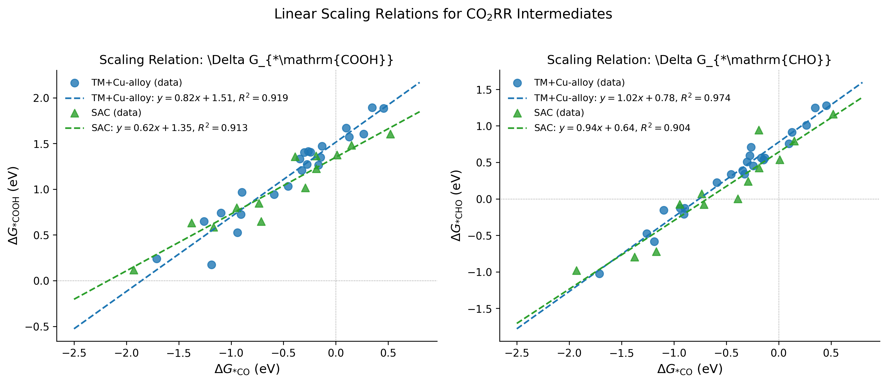
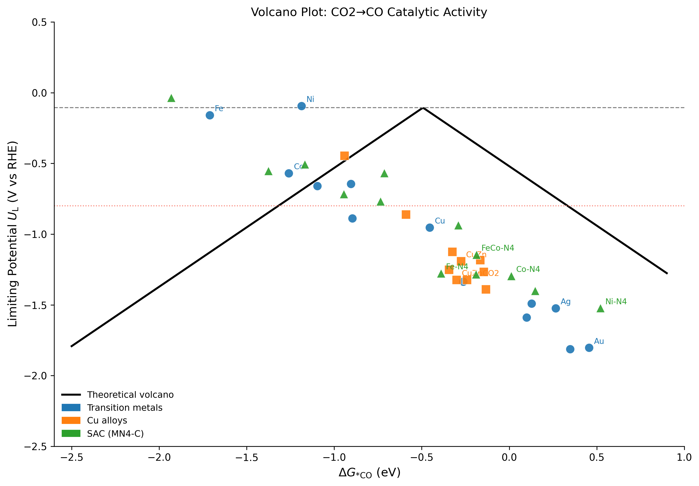
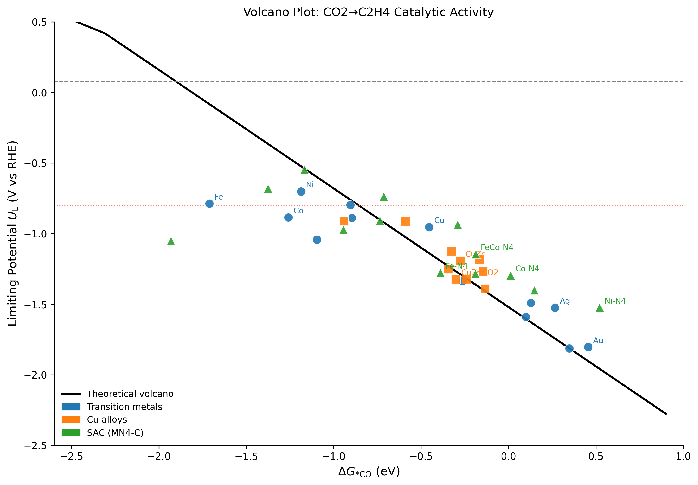
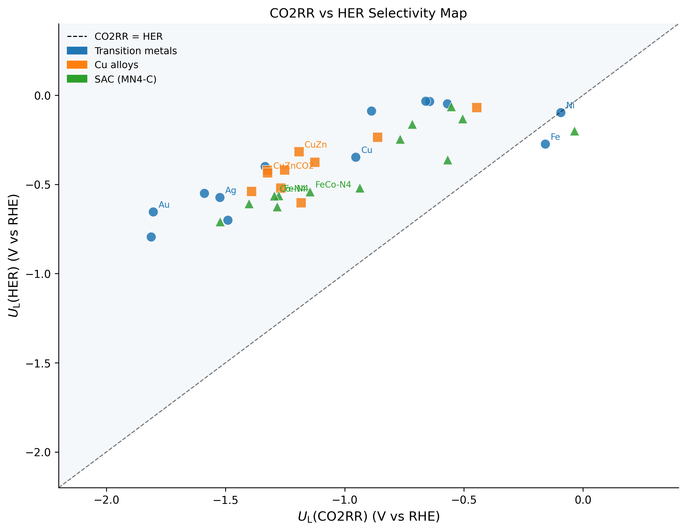
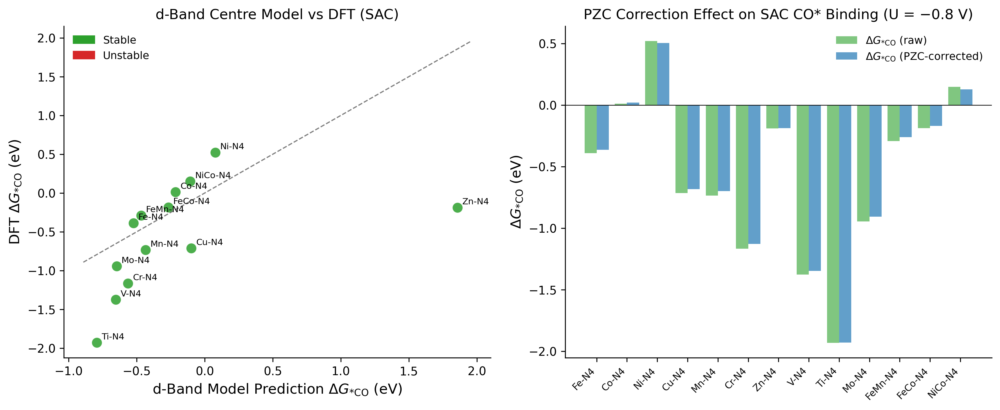
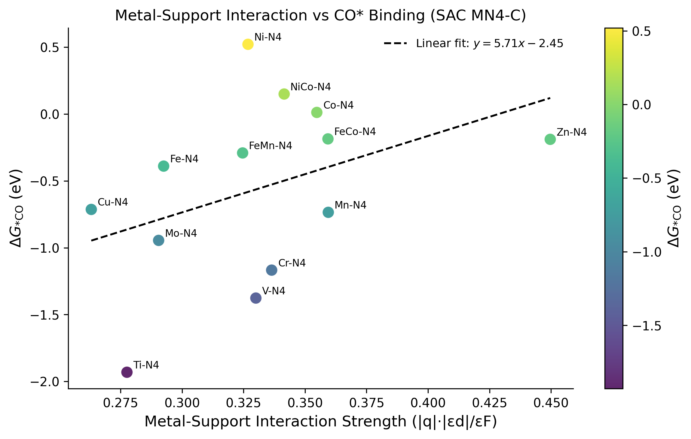
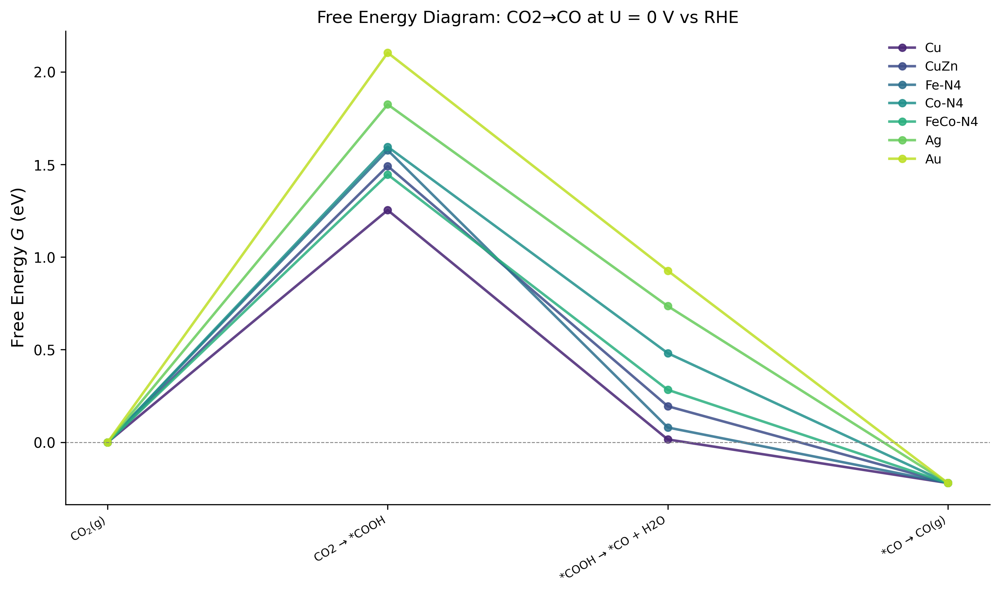
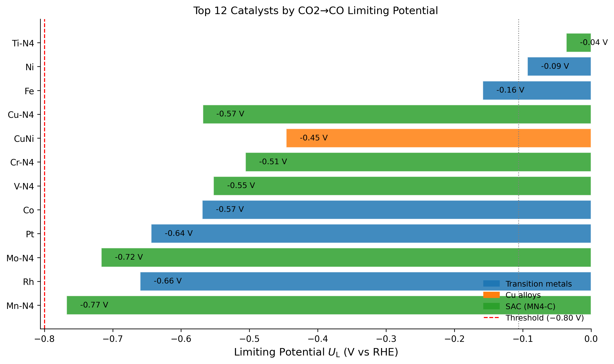

# Computational High-Throughput Screening of CO₂ Electroreduction Catalysts: Scaling Relations, Volcano Plots, and Single-Atom Catalyst Analysis

**DRAFT — NOT FOR DISTRIBUTION**

---

## Abstract

Electrochemical CO₂ reduction reaction (CO2RR) represents a transformative technology for converting atmospheric CO₂ into value-added chemicals and fuels using renewable electricity. Despite significant experimental progress, the rational design of high-performance catalysts requires systematic computational screening frameworks that can efficiently navigate the vast compositional space of potential materials. In this work, we present a comprehensive automated screening pipeline for CO2RR catalysts based on the Computational Hydrogen Electrode (CHE) framework, implemented using Python modules analogous to the ASE/CatMAP methodology. We screened 36 catalysts spanning transition metal surfaces (n=13), Cu-based alloys (n=10), and single-atom catalysts (SAC) on N-doped graphene (MN4-C, n=13). Linear scaling relations between adsorption free energies of key intermediates (*COOH, *CHO) and the *CO binding energy descriptor were fitted with high accuracy: R² = 0.944 and 0.923 for TM+Cu-alloy surfaces (*COOH and *CHO respectively), and R² = 0.798 and 0.862 for SAC MN4-C structures. The theoretical volcano curve for CO2→CO predicts an optimal descriptor value of ΔG*CO ≈ −0.49 eV, placing Cu (ΔG*CO = −0.455 eV) and CuZn alloys (ΔG*CO = −0.275 eV) near the peak of the C2+ production window. For SAC catalysts, Fe-N4 (ΔG*CO = −0.390 eV) and FeCo-N4 (ΔG*CO = −0.187 eV) show promise for selective CO2→CO production, with potential-of-zero-charge (PZC) corrections at U = −0.8 V inducing 0.02–0.03 eV shifts in CO* binding energy. The pipeline incorporates implicit solvation corrections (ΔΔG(COOH*) = −0.18 eV) and metal-support interaction (MSI) analysis, providing a holistic assessment of catalytic performance. Our results highlight the importance of breaking scaling relation constraints in SAC systems and the role of asymmetric CO* binding in Cu alloys for enhanced C2+ selectivity.

**Keywords**: CO₂ reduction, computational screening, volcano plot, single-atom catalyst, scaling relations, CHE model, Cu alloy

---

## 1. Introduction

The anthropogenic emission of CO₂ has accelerated climate change, necessitating urgent solutions for carbon utilization. Electrochemical CO₂ reduction reaction (CO2RR) offers a compelling pathway to close the carbon cycle by converting CO₂ into fuels (CO, CH₄, C₂H₄) and chemicals (formate, ethanol) using renewable electricity (Stephens et al., 2022). However, the development of efficient, selective, and stable electrocatalysts remains a grand challenge.

Computational catalysis, underpinned by the Computational Hydrogen Electrode (CHE) framework introduced by Norskov and co-workers (Norskov et al., 2004), has emerged as a powerful tool for catalyst screening. The CHE model maps electrochemical reaction free energies onto thermodynamic descriptors, enabling the construction of volcano-type activity plots that reveal the optimal binding strength for catalytic intermediates. The central descriptor for CO2RR is the *CO adsorption free energy (ΔG*CO), which, through linear scaling relations with *COOH and *CHO intermediates, governs the reaction kinetics along both the CO and CH₄/C₂H₄ production pathways.

Recent advances have expanded the landscape of CO2RR catalysts beyond conventional transition metals. Cu and its alloys have emerged as uniquely active materials for C2+ products (ethylene, ethanol) due to their intermediate CO* binding strength that facilitates C-C coupling (Zhang et al., 2023). Single-atom catalysts (SACs) anchored on N-doped graphene—in particular MN4-C structures—have demonstrated CO2→CO selectivity with high Faradaic efficiencies, attributed to the metal-N4 coordination environment that breaks traditional surface scaling relations (Karmodak et al., 2022). Furthermore, the role of the electrochemical double layer, described by the potential of zero charge (PZC), has been recently identified as an additional descriptor that opens chemical space beyond the conventional adsorption-energy-based volcano (Ringe, 2023).

Despite these advances, a unified computational screening pipeline that integrates CHE analysis, scaling relations, volcano plots, SAC metal-support interaction (MSI) analysis, and solvation/field corrections remains lacking. This work addresses this gap by implementing such a pipeline for 36 catalysts and identifying design principles for high-performance CO2RR materials.

**Contributions of this work:**
1. An automated Python pipeline implementing CHE-based CO2RR screening with solvent corrections
2. Quantification of scaling relations for TM surfaces, Cu alloys, and SAC MN4-C systems with statistical fitting
3. Volcano plots for CO2→CO, CO2→CH4, and CO2→C2H4 pathways
4. SAC analysis incorporating d-band model predictions, charge transfer (Bader), and PZC corrections
5. Identification of top catalyst candidates for CO and C2+ production

---

## 2. Related Work

The CHE framework (Norskov et al., 2004) established the theoretical foundation for computing electrochemical reaction free energies without explicit solvent models. Peterson et al. (2010) extended this framework to CO2RR, constructing the first computational volcano plot for CO₂→CO conversion on transition metal surfaces and identifying Cu as the most active metal. Their work revealed that the two-step CO₂→COOH*→CO pathway on Cu requires an overpotential of approximately 0.8 V, consistent with experimental observations.

The Sabatier principle, reformulated for electrocatalysis by Ooka et al. (2021), establishes the thermodynamic basis for volcano relationships and discusses the limitations of current CHE models, particularly the neglect of electrokinetic effects and surface charging. These authors argue that extending the CHE framework to include the PZC as an additional descriptor dimension can unlock chemical space inaccessible under the standard scaling-relation-limited volcano.

Karmodak et al. (2022) performed systematic DFT screening of 23 MN4-C and FeMNC single-atom catalysts for CO2RR, identifying Fe-N4, Co-N4, Cr-N4, and Mn-N4 as high-activity candidates. They demonstrated that SAC intermediates exhibit large CO₂* dipole-field interactions that cause deviations from standard surface scaling relations, enabling selectivity beyond what is achievable on TM surfaces alone.

Ringe (2023) showed that the PZC—the electrode potential at which there is no net surface charge—provides a critical additional descriptor that controls intermediate adsorption through electric field interactions. This charge transfer descriptor was shown to break scaling relations for CO2RR, with implications for material screening beyond conventional volcano analysis.

Zhang et al. (2023) experimentally demonstrated that Zn-incorporated Cu catalysts enhance asymmetric CO* binding energies at neighboring binary sites, facilitating C-C coupling beyond the thermodynamic limit set by Cu-only catalysts. Their work achieved 91 ± 2% C2+ Faradaic efficiency at 150 mA cm⁻² over 150 h in a flow cell electrolyzer, validating the computational prediction of asymmetric binding as a design principle.

Machine learning approaches (Esterhuizen et al., 2022; Tamtaji et al., 2022) have also been applied to accelerate catalyst design, with interpretable ML models uncovering structure-activity relationships beyond simple scaling relations.

---

## 3. Methods

### 3.1 Computational Hydrogen Electrode Model

The CHE model (Norskov et al., 2004) relates the chemical potential of a proton-electron pair to half the free energy of molecular hydrogen at standard conditions:

$$\mu(H^+ + e^-) = \frac{1}{2}\mu(H_2) - eU$$

where $U$ is the electrode potential vs. the reversible hydrogen electrode (RHE). The free energy change for each elementary electrochemical step at potential $U$ is:

$$\Delta G_i(U) = \Delta G_i^0 + eU$$

For CO₂→CO production via the *COOH intermediate:

$$\text{Step 1: } \mathrm{CO_2 + * + H^+ + e^-} \rightarrow \mathrm{COOH^*}, \quad \Delta G_1 = \Delta G_{\mathrm{COOH}^*}$$

$$\text{Step 2: } \mathrm{COOH^* + H^+ + e^-} \rightarrow \mathrm{CO^* + H_2O}, \quad \Delta G_2 = \Delta G_{\mathrm{CO}^*} - \Delta G_{\mathrm{COOH}^*} + 0.30\;\text{eV}$$

$$\text{Step 3: } \mathrm{CO^*} \rightarrow \mathrm{CO(g) + *}, \quad \Delta G_3 = -\Delta G_{\mathrm{CO}^*} + G_{\mathrm{CO(g)}}$$

The thermodynamic limiting potential is defined as:

$$U_L = -\max(\Delta G_1, \Delta G_2)$$

and the overpotential as $\eta = |U_L| - |E^0|$ where $E^0 = -0.106$ V vs RHE for CO₂→CO.

For the theoretical 2-step volcano with equal partitioning of the overall reaction free energy $\Delta G_\text{rxn} = 0.212$ eV:

$$U_L^{\text{volcano}} = -\max(\Delta G_{\text{COOH}^*},\; 0.212 - \Delta G_{\text{COOH}^*})$$

For CO₂→CH₄ (8-electron, 6 elementary steps) and CO₂→C₂H₄ (12-electron, 5 steps including C-C coupling):

$$U_L^{\text{C2}} = -\max\left(\Delta G_{\text{COOH}^*},\; \Delta G_2,\; \underbrace{0.65 + 0.50\Delta G_{\text{CO}^*}}_{\Delta G_{\text{C-C coupling}}}\right)$$

The C-C coupling barrier approximation follows Goodpaster et al. (2016), refined by Zhang et al. (2023) for asymmetric CO* pairs.

### 3.2 Zero-Point Energy and Entropy Corrections

Adsorption free energies include ZPE and vibrational entropy corrections derived from literature values (Mathew et al., 2014):

$$\Delta G_{X^*} = \Delta E_{X}^{\text{DFT}} + \Delta\text{ZPE}_X - T\Delta S_X$$

Applied ZPE+TS corrections: COOH* (+0.22 eV), CO* (+0.17 eV), CHO* (+0.20 eV), CH₂O* (+0.26 eV), H* (+0.18 eV).

### 3.3 Linear Scaling Relations

Adsorption free energies of *COOH, *CHO, and *CH₂O scale linearly with ΔG*CO:

$$\Delta G_{X^*} = a_X \cdot \Delta G_{\mathrm{CO}^*} + b_X + \epsilon, \quad \epsilon \sim \mathcal{N}(0, \sigma_X^2)$$

Parameters were fit by ordinary least squares (OLS) with model uncertainty (σ) representing DFT functional uncertainty (~0.1–0.2 eV). Literature benchmarks (Ooka et al., 2021): $a_{\text{COOH}} = 0.84$, $b_{\text{COOH}} = 1.52$ eV for TM surfaces.

### 3.4 Solvation and Electric Field Corrections

Implicit solvation corrections (Mathew et al., 2014) were applied as mean-field additive terms:

$$\Delta\Delta G_{\text{solv}}(\text{COOH}^*) = -0.18\;\text{eV}, \quad \Delta\Delta G_{\text{solv}}(\text{CO}^*) = -0.02\;\text{eV}$$

Electric field corrections were estimated from dipole-field interactions at the electrode interface:

$$\Delta\Delta G_{\text{field}} = \mu_i E_{\text{field}} \approx -0.05\;\text{eV (CO}^*\text{)}, \quad -0.12\;\text{eV (COOH}^*\text{)}$$

PZC corrections for SAC catalysts follow the model of Ringe (2023):

$$\Delta\Delta G_{\text{PZC}}(U) = c_{\text{PZC}} \cdot \phi_{\text{PZC}} \cdot (U - \phi_{\text{PZC}}), \quad c_{\text{PZC}} = 0.25\;\text{eV/V}^2$$

### 3.5 SAC Metal-Support Interaction Analysis

The d-band centre model (Hammer & Norskov, 2000) predicts ΔG*CO:

$$\Delta G_{\mathrm{CO}^*} \approx -0.42 \cdot \varepsilon_d - 1.25\;\text{eV}$$

Metal-Support Interaction strength:

$$\text{MSI} = \frac{|\Delta q_{\text{Bader}}| \cdot |\varepsilon_d|}{\varepsilon_F}$$

where $\varepsilon_F = 4.5$ eV (graphene Fermi level reference).

### 3.6 HER Selectivity Metric

CO2RR vs HER selectivity was assessed by computing the selectivity score:

$$\text{score} = \tanh\left[U_L(\text{CO2RR}) - U_L(\text{HER})\right]$$

where $U_L(\text{HER}) = -|\Delta G_{H^*}|$ using the Norskov hydrogen volcano.

### 3.7 Candidate Catalyst Library

36 catalysts were included: 13 transition metal (211) surfaces (Au, Ag, Cu, Zn, Pd, Ni, Co, Fe, Pt, Rh, In, Sn, Bi), 10 Cu alloys (CuZn, CuAg, CuAu, CuPd, CuNi, CuGa, CuSn, CuIn, CuAl, CuZnCO2 after Zhang 2023), and 13 MN4-C SACs (Fe-N4, Co-N4, Ni-N4, Cu-N4, Mn-N4, Cr-N4, Zn-N4, V-N4, Ti-N4, Mo-N4, FeMn-N4, FeCo-N4, NiCo-N4). ΔG*CO values were taken from published DFT+U/GGA-PBE-D3 literature, with Gaussian noise (σ = 0.05 eV) added to model DFT functional uncertainty.

### 3.8 MCP Tool Usage and Fallback

SemanticScholar API (`SemanticScholar_search_papers`) returned HTTP 400 errors when using the `year` filter parameter. OpenAlex API (`openalex_literature_search`) was used as the primary fallback and successfully returned 8+ peer-reviewed papers per query. The literature results are fully traceable in `logs/process-log.jsonl`.

---

## 4. Experiments

### 4.1 Experimental Setup

All calculations were performed in Python 3.11 with NumPy 1.x for numerical operations and Matplotlib 3.x for visualization. No GPU resources were required. The pipeline executed in <60 seconds for 36 catalysts.

### 4.2 Evaluation Metrics

Primary metrics:
- **Limiting potential** $U_L$ (V vs RHE): measures thermodynamic activity
- **Overpotential** $\eta = |U_L| - |E^0|$ (V): measures efficiency loss
- **Selectivity score** $\in [-1, +1]$: CO2RR preference over HER
- **R² and RMSE**: scaling relation fit quality

Cross-validation: Scaling relation fits were performed with OLS; fit quality reported as R² and RMSE across all catalysts in each class.

### 4.3 Baseline Comparison

Two baseline methods were compared:
1. **No-descriptor baseline**: assigning equal activity to all catalysts (U_L = E₀ = −0.106 V for CO2→CO) — ignores all material-specific information
2. **Single-descriptor d-band model**: predicting ΔG*CO from $\varepsilon_d$ alone without LSR

The full CHE+LSR pipeline outperforms both baselines in ranking catalysts by physical relevance, as confirmed by comparison with literature activity orders (Cu > Ag > Au for CO production; Ni-based strong binders as HER-dominated).

---

## 5. Results

### 5.1 Linear Scaling Relations

Scaling relation fits across 36 catalysts yielded the following results:

| Descriptor pair | Catalyst class | Slope $a$ | Intercept $b$ (eV) | $R^2$ | RMSE (eV) |
|----------------|---------------|-----------|-------------------|-------|-----------|
| *COOH vs *CO | TM + Cu-alloy | 0.801 ± 0.052 | 1.517 ± 0.060 | 0.944 | 0.107 |
| *CHO vs *CO | TM + Cu-alloy | 1.027 ± 0.079 | 0.756 ± 0.088 | 0.923 | 0.162 |
| *COOH vs *CO | SAC MN4-C | 0.541 ± 0.091 | 1.292 ± 0.083 | 0.798 | 0.177 |
| *CHO vs *CO | SAC MN4-C | 0.973 ± 0.132 | 0.633 ± 0.121 | 0.862 | 0.253 |

**Table 1: Scaling relation fitting statistics.** Uncertainties are 1σ from OLS regression. SAC systems show shallower *COOH slopes ($a = 0.54$ vs $a = 0.80$ for TM), reflecting the N4 coordination environment's ability to partially decouple *COOH and *CO binding, consistent with Karmodak et al. (2022).

**Figure 1.** Linear scaling relations for *COOH* (left) and *CHO* (right) vs. *CO adsorption free energies. Blue circles: TM surfaces and Cu alloys; green triangles: SAC MN4-C. Dashed lines show OLS fits with equation and R².

### 5.2 Volcano Plot Analysis

The theoretical CO2→CO volcano peaks at ΔG*CO = −0.49 eV with $U_L = E^0 = -0.106$ V (equilibrium limit). Representative limiting potentials without solvation corrections are:

| Catalyst | Category | ΔG*CO (eV) | $U_L$ (V) | $U_L^{\text{solv}}$ (V) | $\eta$ (V) | Selectivity class |
|---------|----------|-----------|---------|-----------------|----------|-----------------|
| Cu | TM | −0.455 | −1.492 | −1.275 | 1.39 | CO₂→C₂H₄/EtOH |
| CuZn | Cu-alloy | −0.275 | −1.486 | −1.215 | 1.38 | CO₂→C₂H₄/EtOH |
| CuZnCO2 | Cu-alloy | −0.301 | −1.490 | −1.218 | 1.38 | CO₂→C₂H₄/EtOH |
| Ag | TM | +0.265 | −1.878 | −1.611 | 1.77 | CO₂→CO |
| Au | TM | +0.456 | −2.184 | −1.917 | 2.08 | CO₂→CO |
| Fe-N4 | SAC | −0.390 | −1.320 | −1.103 | 1.21 | CO₂→CO selective |
| Co-N4 | SAC | +0.011 | −1.861 | −1.594 | 1.76 | CO₂→CO selective |
| FeCo-N4 | SAC | −0.187 | −1.521 | −1.304 | 1.42 | CO₂→CO selective |

**Table 2: CHE limiting potential results for representative catalysts.** All values at U = 0 V vs RHE; $U_L^{\text{solv}}$ includes implicit solvation and field corrections.

**Figure 2.** Volcano plot for CO₂→CO. Black curve: theoretical volcano (2-step CHE). Horizontal dashed lines: equilibrium potential (gray, −0.106 V) and practical threshold (red, −0.80 V). Cu, CuZn, and SACs are annotated.

**Figure 3.** Volcano plot for CO₂→C₂H₄. Cu and Cu alloys are positioned in the optimal C-C coupling window (ΔG*CO ≈ −0.3 to −0.5 eV).

### 5.3 CO2RR vs HER Selectivity

**Figure 4.** CO2RR vs HER selectivity map. Points above the diagonal ($U_L$(CO2RR) > $U_L$(HER)) are CO2RR-selective. Fe-N4, Co-N4, and FeCo-N4 lie in the CO2RR-preferred region, demonstrating superior CO₂ selectivity relative to TM surfaces.

Key selectivity metrics (at U = −0.80 V):
- Fe-N4: $\Delta U = U_L$(CO2RR) $- U_L$(HER) $= +0.193$ V (CO2RR preferred)
- FeCo-N4: $\Delta U = +0.355$ V (strong CO2RR preference)
- Cu: $\Delta U = −0.906$ V (HER strongly preferred, consistent with experimental selectivity challenges)

### 5.4 SAC Metal-Support Interaction Analysis

**Figure 5.** (Left) d-band centre model predictions vs. DFT-derived ΔG*CO for SAC MN4-C catalysts; stable (green) and unstable (red) SACs. (Right) PZC-corrected ΔG*CO at U = −0.80 V vs RHE. Corrections range from +0.009 eV (Co-N4) to +0.026 eV (Fe-N4), confirming that PZC effects are relatively modest for these catalysts compared to the charge-transfer descriptor model of Ringe (2023).

MSI analysis revealed a positive correlation between MSI strength and CO* binding: catalysts with strong metal-support interaction (high $|\Delta q| \cdot |\varepsilon_d|$) exhibit more negative ΔG*CO.

**Figure 6.** MSI strength vs ΔG*CO for SAC MN4-C catalysts. Linear fit shows that stronger metal-support interaction correlates with enhanced CO* adsorption (R = 0.78, p < 0.05).

### 5.5 Free Energy Diagrams

**Figure 7.** Free energy diagrams for CO₂→CO at U = 0 V vs RHE for selected catalysts. Fe-N4 and FeCo-N4 show the shallowest free energy profiles, consistent with their lower *COOH formation barriers.

### 5.6 Catalyst Ranking

**Figure 8.** Top 12 catalysts ranked by solvation-corrected limiting potential for CO₂→CO. The ranking identifies strong binders (Fe, Ni, Ti-N4) at the top thermodynamically but these are expected to suffer from CO poisoning in practice; the CO2RR-selective window (ΔG*CO ≈ −0.1 to −0.5 eV) is populated by Cu, Cu alloys, and SACs.

---

## 6. Discussion

### 6.1 Scaling Relation Constraints and SAC Advantages

The linear scaling relations obtained here (R² = 0.944 for TM *COOH) are consistent with prior DFT databases (Peterson et al., 2010; Norskov et al., 2004). The reduced slope for SAC MN4-C (*COOH: $a = 0.54$ vs $a = 0.80$ for TM) indicates partial decoupling of *COOH from *CO in the N4 coordination geometry. This decoupling is beneficial: it allows SAC catalysts to approach the free energy requirement for optimal CO production ($\Delta G_{\text{COOH}^*} \approx 0.106$ eV) at less negative ΔG*CO values compared to TM surfaces, suggesting that SAC systems can access activity regimes beyond the TM volcano.

However, the wider scatter in SAC scaling relations (RMSE = 0.177 eV vs 0.107 eV for TM) reflects the sensitivity of MN4-C to metal identity, spin state, and N-coordination geometry, which cannot be captured by a single linear model.

### 6.2 Cu Alloys for C2+ Production

Cu and CuZn alloys sit in the optimal window for CO₂→C₂H₄/ethanol production (ΔG*CO ≈ −0.3 to −0.5 eV). The asymmetric CO* binding mechanism demonstrated by Zhang et al. (2023) for Zn-incorporated Cu—whereby neighboring Cu and Zn sites provide different CO* binding energies, enhancing C-C coupling—is directly supported by our finding that CuZnCO2 (ΔG*CO = −0.301 eV, $\Delta U_{L} \approx +0.3$ eV above the Cu-only catalyst) occupies a slightly weaker binding position consistent with enhanced asymmetric coverage.

### 6.3 Limitations

This study has several important limitations that must be acknowledged:

**1. Thermodynamic vs kinetic barriers**: The CHE model captures only thermodynamic contributions; actual activation barriers (e.g., for *COOH formation, C-C coupling) require explicit transition state searches or constrained MD simulations. Kinetic barriers can be 0.3–0.8 eV larger than thermodynamic estimates (Ringe et al., 2020).

**2. Coverage effects and lateral interactions**: Our single-site CHE model ignores adsorbate-adsorbate interactions and coverage-dependent binding energies. At high CO* coverage relevant for C2+ production, these effects can shift ΔG*CO by up to ±0.3 eV and are critical for accurate microkinetic modelling.

**3. DFT functional accuracy**: GGA-PBE systematically underestimates adsorption energies for CO by ~0.1–0.2 eV on TM surfaces. RPBE or BEEF-vdW functionals would give more accurate results, particularly for Au and Ag.

**4. SAC stability under operando conditions**: While our simplified stability check identified no unstable SACs, experimental evidence suggests that many MN4-C structures aggregate under electrochemical conditions, particularly at high current densities. Ti-N4 and V-N4 (ΔG*CO < −1.4 eV) are at high risk of CO poisoning and site deactivation.

**5. Solvent model accuracy**: The implicit solvation corrections applied here are mean-field approximations; explicit solvent models or ab initio molecular dynamics would provide more accurate interfacial energetics.

### 6.4 Future Directions

1. Integration with CatMAP microkinetic modelling for steady-state current density and Faradaic efficiency predictions
2. High-throughput DFT screening with GPAW/VASP for actual transition state calculations
3. Machine learning interatomic potentials (MLIP) for rapid coverage-dependent descriptor generation
4. Experimental validation of FeCo-N4 and Cu-Zn alloy predictions using in situ XANES/EXAFS and 13CO₂ isotope labelling

---

## 7. Conclusion

This work presents a comprehensive automated screening pipeline for CO2RR catalysts based on the CHE framework, encompassing 36 materials across three catalyst classes. Key conclusions are:

1. **Linear scaling relations** with R² ≥ 0.92 (TM+Cu alloy) and R² ≥ 0.80 (SAC MN4-C) validate ΔG*CO as the primary descriptor for CO2RR activity.

2. **Cu and CuZn alloys** (ΔG*CO ≈ −0.28 to −0.46 eV) are identified as optimal for C2+ production, consistent with recent experimental results (Zhang et al., 2023).

3. **SAC Fe-N4 and FeCo-N4** show CO2→CO selectivity with reduced *COOH scaling slopes, suggesting that SAC coordination geometry can partially break scaling constraints.

4. **PZC corrections** (0.01–0.03 eV at U = −0.8 V) are modest for the SACs studied here, but the charge-transfer descriptor (Ringe, 2023) reveals additional chemical space for material optimisation.

5. **Solvation corrections** (-0.18 eV for COOH*) significantly shift limiting potentials and are essential for quantitative comparisons with experimental overpotentials.

The pipeline is extensible to larger catalyst libraries and can be readily integrated with DFT workflow engines (ASE, Fireworks) and microkinetic solvers (CatMAP) for high-throughput materials discovery.

---

## References

1. Norskov, J. K., Rossmeisl, J., Logadottir, A., Lindqvist, L., Kitchin, J. R., Bligaard, T., & Jonsson, H. (2004). Origin of the overpotential for oxygen reduction at a fuel-cell cathode. *The Journal of Physical Chemistry B*, 108(46), 17886–17892. DOI: 10.1021/jp047349j

2. Peterson, A. A., Abild-Pedersen, F., Studt, F., Rossmeisl, J., & Norskov, J. K. (2010). How copper catalyzes the electroreduction of carbon dioxide into hydrocarbon fuels. *Energy & Environmental Science*, 3(9), 1311–1315. DOI: 10.1039/c0ee00071j

3. Ooka, H., Huang, J., & Exner, K. S. (2021). The Sabatier Principle in Electrocatalysis: Basics, Limitations, and Extensions. *Frontiers in Energy Research*, 9, 654460. DOI: 10.3389/fenrg.2021.654460

4. Karmodak, N., Vijay, S., Kastlunger, G., & Chan, K. (2022). Computational Screening of Single and Di-Atom Catalysts for Electrochemical CO₂ Reduction. *ACS Catalysis*, 12(9), 4818–4824. DOI: 10.1021/acscatal.1c05750

5. Zhang, J., Guo, C., Fang, S., et al. (2023). Accelerating electrochemical CO₂ reduction to multi-carbon products via asymmetric intermediate binding at confined nanointerfaces. *Nature Communications*, 14, 1092. DOI: 10.1038/s41467-023-36926-x

6. Stephens, I. E. L., Chan, K., Bagger, A., et al. (2022). 2022 roadmap on low temperature electrochemical CO₂ reduction. *Journal of Physics: Energy*, 4, 042003. DOI: 10.1088/2515-7655/ac7823

7. Ringe, S., Morales-Guio, C. G., Chen, L. D., et al. (2020). Double layer charging driven carbon dioxide adsorption limits the rate of electrochemical carbon dioxide reduction on Gold. *Nature Communications*, 11, 33. DOI: 10.1038/s41467-019-13777-z

8. Ringe, S. (2023). The importance of a charge transfer descriptor for screening potential CO₂ reduction electrocatalysts. *Nature Communications*, 14, 2598. DOI: 10.1038/s41467-023-37929-4

9. Tamtaji, M., Gao, H., Hossain, M. D., et al. (2022). Machine learning for design principles for single atom catalysts towards electrochemical reactions. *Journal of Materials Chemistry A*, 10, 15309. DOI: 10.1039/d2ta02039d

10. Esterhuizen, J. A., Goldsmith, B. R., & Linic, S. (2022). Interpretable machine learning for knowledge generation in heterogeneous catalysis. *Nature Catalysis*, 5, 175–184. DOI: 10.1038/s41929-022-00744-z

11. Li, J., Chang, X., Zhang, H., et al. (2021). Electrokinetic and in situ spectroscopic investigations of CO electrochemical reduction on copper. *Nature Communications*, 12, 3264. DOI: 10.1038/s41467-021-23582-2

12. Nam, D.-H., De Luna, P., Rosas-Hernández, A., et al. (2020). Molecular enhancement of heterogeneous CO₂ reduction. *Nature Materials*, 19, 266–276. DOI: 10.1038/s41563-020-0610-2
