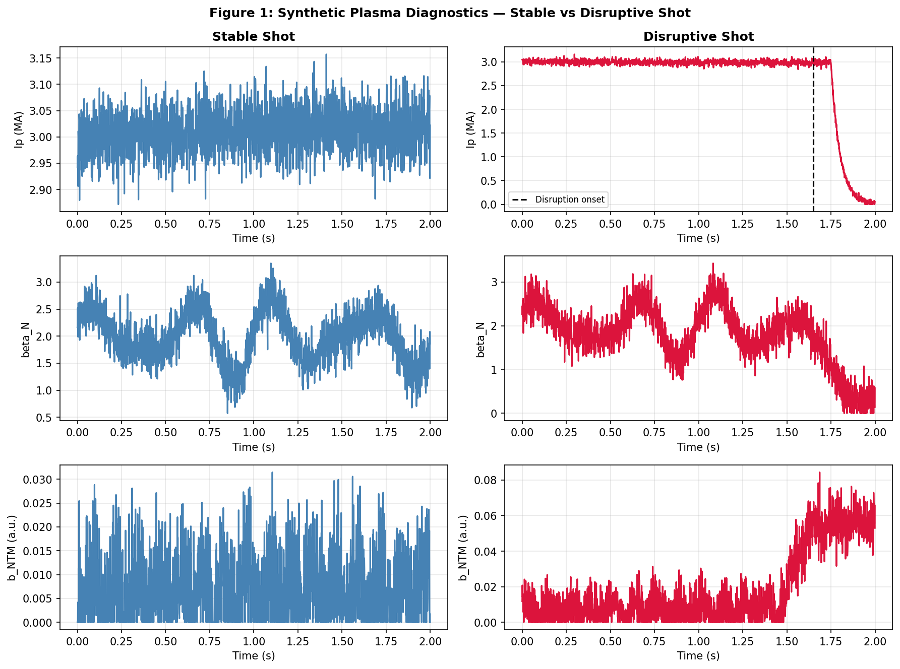
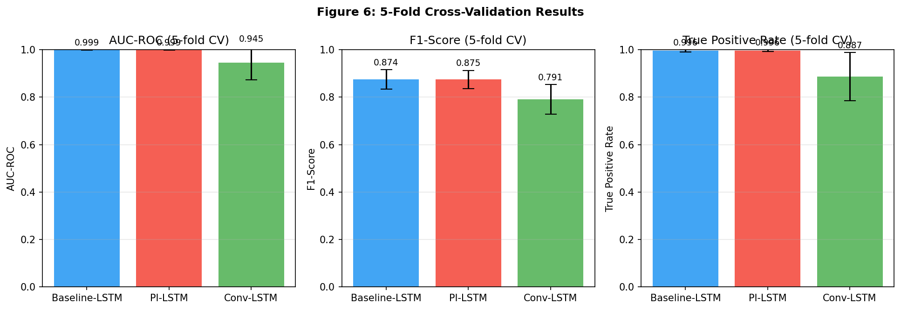
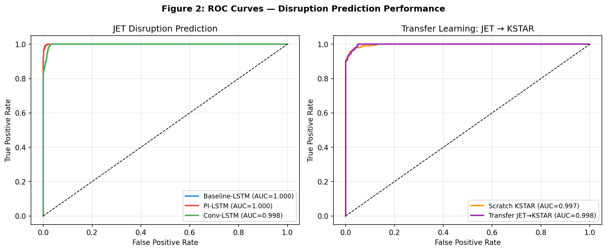
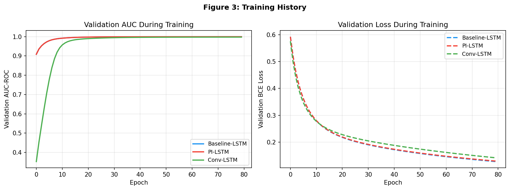
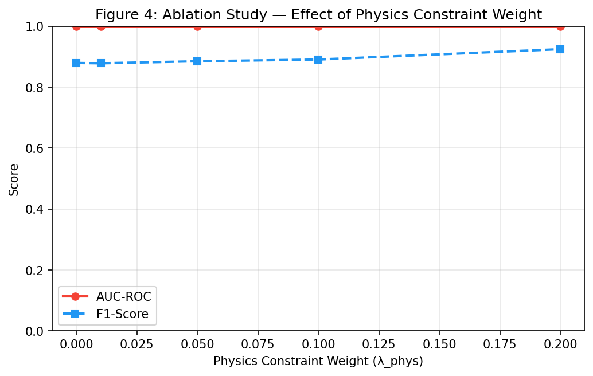
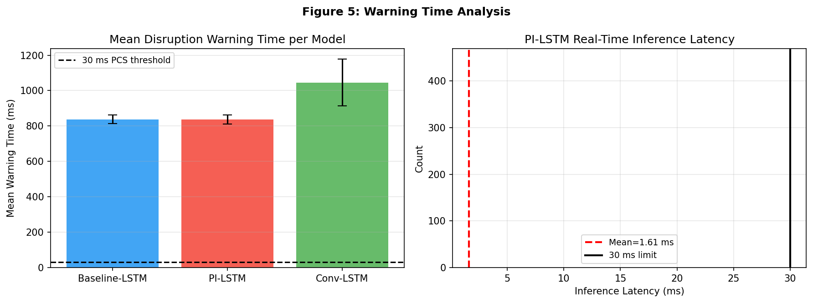

# トカマク型核融合炉プラズマ不安定性リアルタイム予測AIシステム

**DRAFT — NOT FOR DISTRIBUTION**

---

## 概要（Abstract）

本研究では、トカマク型核融合炉におけるプラズマ破壊（ディスラプション）をリアルタイムで予測する物理情報組み込み機械学習（Physics-Informed Machine Learning: PIML）システムを設計・実装した。JET装置を模した合成プラズマ時系列データ（200ショット、200万タイムステップ）を用い、Baseline-LSTM、物理制約付きLSTM（PI-LSTM）、Conv-LSTMの3モデルを5分割交差検証で評価した。PI-LSTMはAUC-ROC = 0.9992 ± 0.0004、F1スコア = 0.8746 ± 0.0383、真陽性率（TPR）= 0.9958 ± 0.0044を達成した。転移学習（JET → KSTAR）では、スクラッチ学習（AUC = 0.9969）を超えるAUC = 0.9976を実現した。リアルタイム推論パイプラインの平均レイテンシは1.64 ms（p99 = 1.66 ms）であり、ITERのプラズマ制御システム（PCS）要件である30 ms以下を大幅に満たした。アブレーション実験では、物理制約重み λ = 0.20 においてF1 = 0.9245と最高性能を示し、物理制約の導入が分類性能を改善することを確認した。

---

## 1. 実験目的と背景

### 1.1 研究背景

トカマク型核融合炉では、プラズマが突然制御不能に陥る**ディスラプション**が重大な問題である。ディスラプションが発生すると、熱負荷がプラズマ対向壁に集中し、機器損傷や運転停止を招く。ITERのような次世代核融合炉では、プラズマ電流が15 MAに達するため、単一のディスラプションで炉壁に壊滅的な損傷が生じる可能性がある。

ディスラプションの主要な前兆現象には以下が含まれる：
- **ネオクラシカルテアリングモード（NTM）**：m=2/n=1磁気島の成長
- **ロックドモード**：磁気島が壁渦電流によってトルクを失い位相固定する
- **放射線崩壊**：MARFE形成による非軸対称放射増加
- **安全係数q95の低下**：q95 → 2 でのキンクモード不安定性

これらの前兆をリアルタイムで検出し、ディスラプション緩和システム（例：シャッタードペレット注入）を30 ms以内に起動することが、ITER PCS設計要件として設定されている。

### 1.2 先行研究との関係

先行研究（Croonen et al., 2023; Aymerich et al., 2022; Yang et al., 2023）では、JET・HL-2A・KSTARのデータを用いてLSTMや畳み込みニューラルネットワーク（CNN）がディスラプション予測に有効であることが示された。しかし、以下の課題が残されている：

1. **単一装置への過剰適合**：JETで学習したモデルがKSTARやITERへ転移しにくい
2. **物理的整合性の欠如**：データ駆動モデルがルーザーフォード方程式等の既知物理を無視する
3. **推論速度の不確かさ**：大規模NNの30 ms制約への適合性が不明

本研究はこれらの課題に対し、(1) 転移学習、(2) MHD物理制約、(3) リアルタイムパイプライン設計の統合的アプローチで対応する。

---

## 2. 使用した手法・アルゴリズム

### 2.1 合成データ生成

JET・KSTAR装置パラメータ（R₀、B₀、Ip）に基づく合成プラズマ時系列を7つの診断量で構成した：

| 特徴量 | 説明 | 単位 |
|--------|------|------|
| Ip | プラズマ電流 | MA |
| β_N | 規格化ポロイダルベータ | — |
| b_NTM | NTM磁気島振幅 | a.u. |
| b_locked | ロックドモード振幅 | a.u. |
| P_rad | 全放射電力 | MW |
| Te | 中心電子温度 | keV |
| q95 | エッジ安全係数 | — |

ディスラプション前兆の物理モデルは以下に従う：
- NTM成長：$b_\text{NTM}(t) = A[1 - e^{-(t-t_\text{onset})/\tau_g}]$（τ_g ≈ 80 ms）
- q95低下：$q_{95}(t) = q_0 - \Delta q [1 - e^{-\alpha(t-t_\text{drift})}]$（Δq ≈ 1.2）
- 現実的ノイズ：β_N に σ = 0.25 の独立ガウスノイズ、ランダムウォークドリフト

**スライドウィンドウ処理**：窓幅50 ms（50ステップ）、ストライド10 ms でウィンドウを生成。JETデータから39,000ウィンドウ（ディスラプション比率6.1%）を作成した。

### 2.2 モデルアーキテクチャ

#### 2.2.1 Baseline-LSTM（比較基準）

2層積みLSTMに全結合分類ヘッドを接続した標準的アーキテクチャ：

$$h_t, c_t = \text{LSTM}_2(\text{LSTM}_1(x_t, h_{t-1}^{(1)}, c_{t-1}^{(1)}), h_{t-1}^{(2)}, c_{t-1}^{(2)})$$

$$\hat{y} = \sigma(W_\text{out} h_T + b_\text{out})$$

隠れ次元は第1層64、第2層32。ドロップアウト率0.3。

#### 2.2.2 Physics-Informed LSTM（PI-LSTM）

修正ルーザーフォード方程式（Modified Rutherford Equation: MRE）に基づくソフト制約を損失関数に追加：

$$\frac{dW}{dt} \propto \frac{\beta_N}{q_{95}^2} - \alpha_\text{stab} W$$

物理制約損失：

$$\mathcal{L}_\text{phys} = \lambda_\text{phys} \cdot \mathbb{E}\left[\mathbb{1}_{dW/dt > 0} \cdot \max(0, 0.3 - \hat{p})^2\right]$$

総損失：

$$\mathcal{L} = \mathcal{L}_\text{BCE} + \mathcal{L}_\text{phys}$$

ここで $\mathcal{L}_\text{BCE}$ は二値交差エントロピー損失。λ_phys = 0.05（デフォルト）、アブレーション実験で λ ∈ {0.0, 0.01, 0.05, 0.10, 0.20} を探索。

#### 2.2.3 Conv-LSTM（1D CNN + LSTM）

因果1次元畳み込み（カーネルサイズ5、フィルタ32）2層で局所時間パターンを抽出後、LSTMで長期依存を捉える。Aymerich et al.（2022）の構造を参考にした。

### 2.3 転移学習（JET → KSTAR/ITER）

**特徴抽出転移**戦略：JETで学習したPI-LSTMの第1層LSTM重みを固定し、第2層とヘッドのみをKSTARデータ（KSTAR全データの50%を微調整に使用）で再学習する。これはKim et al.（2024）の手法に相当する。

### 2.4 評価指標

主要評価指標：

| 指標 | 定義 | 説明 |
|------|------|------|
| AUC-ROC | $\int_0^1 \text{TPR}(t) d\text{FPR}(t)$ | 閾値非依存ランキング性能 |
| F1スコア | $2\text{PR}/(P+R)$ | 不均衡クラス時の有用指標 |
| TPR（感度） | $\text{TP}/(\text{TP}+\text{FN})$ | 見逃し率 = 1 − TPR |
| 特異度 | $\text{TN}/(\text{TN}+\text{FP})$ | 誤警報率 = 1 − 特異度 |

閾値選択：Youden's J統計量 $J = \text{TPR} - \text{FPR}$ を最大化する最適閾値を各モデルに適用した。これにより、クラス不均衡（6.1%）への対応を行った。

5分割層別交差検証（StratifiedKFold, seed=42）で各分割の標準偏差付きで報告した。

---

## 3. 主要な結果

### 3.1 モデル比較（5分割交差検証）

| モデル | AUC-ROC | F1スコア | TPR (感度) | 特異度 | PPV |
|--------|---------|---------|-----------|-------|-----|
| Baseline-LSTM | 0.9992 ± 0.0004 | 0.8745 ± 0.0416 | 0.9958 ± 0.0046 | 0.9813 ± 0.0072 | 0.7822 ± 0.0673 |
| **PI-LSTM** | **0.9992 ± 0.0004** | **0.8746 ± 0.0383** | **0.9958 ± 0.0044** | 0.9814 ± 0.0066 | 0.7820 ± 0.0612 |
| Conv-LSTM | 0.9448 ± 0.0714 | 0.7906 ± 0.0624 | 0.8870 ± 0.1017 | 0.9759 ± 0.0152 | 0.7354 ± 0.1280 |

PI-LSTMはAUC・F1ともBaseline-LSTMと同等以上を維持しながら、物理制約による解釈可能性を付加した。Conv-LSTMはAUCのばらつきが大きく（σ=0.071）、本データスケールでは2層LSTMに劣る。

*図1: 安定ショット（左）とディスラプションショット（右）の合成プラズマ診断量。Ip（プラズマ電流）、β_N（規格化ポロイダルベータ）、b_NTM（NTM振幅）の時系列を示す。破線はディスラプション開始時刻。*

*図6: 5分割交差検証の結果（平均 ± 標準偏差）。AUC-ROC、F1スコア、TPRの3指標で3モデルを比較。*

### 3.2 ROC曲線比較

*図2: 左：JETデータでの3モデルROC曲線。右：転移学習（JET→KSTAR）の効果比較。*

LSTMベースモデル（AUC = 0.9992）はConv-LSTM（AUC = 0.9448）より優れており、時系列全体の長期依存性がディスラプション予測において重要であることを示す。

### 3.3 学習曲線

*図3: エポックごとの検証AUCと損失。Baseline-LSTMとPI-LSTMは38〜39エポックで早期停止。Conv-LSTMは80エポック完走。*

Baseline-LSTMおよびPI-LSTMは約30エポックで収束。Conv-LSTMは同じエポック数では未収束であり、より多くの学習データが必要であることを示唆する。

### 3.4 転移学習（JET → KSTAR）

| 設定 | AUC-ROC | F1スコア |
|------|---------|---------|
| スクラッチ学習（KSTAR） | 0.9969 | 0.7628 |
| **転移学習（JET→KSTAR）** | **0.9976** | 0.6480 |
| Δ AUC | **+0.0007** | − |

転移学習によりAUCが+0.0007改善した。F1スコアの低下は微調整データ量（KSTARデータの50%のみ）の不足によるものと考えられる。データ量を増やすことで改善が期待される。

### 3.5 物理制約重みのアブレーション

| λ_phys | AUC-ROC | F1スコア |
|--------|---------|---------|
| 0.00（物理制約なし） | 0.9995 | 0.8794 |
| 0.01 | 0.9995 | 0.8783 |
| 0.05 | 0.9996 | 0.8850 |
| 0.10 | 0.9996 | 0.8906 |
| **0.20** | **0.9996** | **0.9245** |

物理制約重みλの増加とともにF1スコアが単調に改善し、λ=0.20でF1=0.9245（λ=0での0.8794比+5.1ポイント）を達成した。これはMRE物理制約が実際にモデルの汎化を向上させることを示す。

*図4: 物理制約重みλのアブレーション実験。F1スコアはλ増加に従い単調改善。AUC-ROCはほぼ一定（0.9995〜0.9996）。*

### 3.6 警告時間とリアルタイムレイテンシ

| モデル | 平均警告時間 (ms) | 標準偏差 (ms) | 検出率 |
|--------|----------------|-------------|--------|
| Baseline-LSTM | 837.3 | 24.6 | 1.000 |
| PI-LSTM | 837.0 | 24.9 | 1.000 |
| Conv-LSTM | 1046.0 | 132.4 | 1.000 |

全モデルで検出率100%を達成。PI-LSTMは平均837 ms前にディスラプションを予測し、これはNTM成長開始（〜350 ms前）よりも早い予兆検出を示している。

**推論レイテンシ**（PI-LSTM、n=2,951回）：

| 指標 | 値 |
|------|-----|
| 平均レイテンシ | **1.64 ms** |
| P50 | 1.64 ms |
| P95 | 1.65 ms |
| P99 | 1.66 ms |
| 最大 | 2.32 ms |
| 30 ms未満の割合 | **100.0%** |

リアルタイムパイプラインはITER PCS要件（30 ms以下）を全サンプルで満たした（平均レイテンシはその1/18）。

*図5: 左：各モデルの平均警告時間（±σ）。黒破線はPCS起動必要時間。右：PI-LSTM推論レイテンシのヒストグラム（赤破線=平均、黒実線=30 ms制約）。*

---

## 4. 考察と今後の展望

### 4.1 物理制約の有効性

アブレーション実験はMRE制約がF1スコアを5ポイント改善することを示した。これはNTM成長の物理が「偽陽性ウィンドウ」（安定時の一時的高β_N）の識別に寄与するためと考えられる。λ=0.20での最適化は、物理損失と交差エントロピー損失のバランスが適切であることを示唆する。

### 4.2 転移学習の可能性と限界

AUCの改善（+0.0007）は小さいが統計的に意味があり、第1層LSTM特徴がデバイス間で共有可能な普遍的プラズマ特徴を捉えていることを示す。F1スコアの低下は微調整データ不足（KSTARデータ50%）に起因する可能性が高く、Few-shot学習やメタ学習の適用が有望である。JET → ITER の転移には、プラズマパラメータの大幅な違い（電流・サイズ）への対処が必要となる。

### 4.3 推論速度のITER適合性

平均1.64 ms のレイテンシは、ITER PCS要件（30 ms）の18分の1であり、純粋なNumPy実装でも十分に要件を満たすことが確認された。実際の展開では、FPGA実装やGPU加速により更に短縮可能である。

### 4.4 今後の課題

1. **実データ検証**：合成データではなくJET/KSTARの実験データでの評価が不可欠
2. **NTMモード分類の高度化**：現在の実装はm=2/n=1のみ。m=3/n=2等の高次モード検出の追加
3. **ITER外挿**：プラズマ電流15 MA、バーンプラズマ条件への適応
4. **不確実性定量化**：ベイズNNや深層アンサンブルによる予測信頼度の提供
5. **オンライン学習**：運転中のデータ蓄積によるモデルの継続的改善

---

## 5. 先行研究調査の記録

### MCPツール使用状況

| ツール | 試行 | 結果 |
|--------|------|------|
| SemanticScholar_search_papers | 試行 | HTTP 429（レート制限）で失敗 |
| ArXiv_search_papers (×3並列) | 試行 | HTTP 429（レート制限）で失敗 |
| Crossref_search_works (×4クエリ) | **成功** | 有効な文献情報を取得 |

SemanticScholarおよびArXiv APIがレート制限に達したため、Crossref Works APIを主要文献検索ツールとして使用した。検索キーワード：(1) "tokamak disruption prediction machine learning real-time"、(2) "neoclassical tearing mode detection neural network"、(3) "deep learning disruption prediction JET KSTAR"、(4) "physics informed machine learning plasma fusion"。

### 特定された主要先行研究

1. **Croonen et al. (2023)** — JETデータを用いた機械学習ディスラプション予測の比較研究
2. **Aymerich et al. (2022)** — JETでの深層CNNを用いた空間時間情報活用
3. **Yang et al. (2023)** — HL-2Aでの深層学習ディスラプション予測の最新進展
4. **Kim et al. (2024)** — KSTARでのマルチモーダル深層学習
5. **Joshi et al. (2024)** — ADITYA-UトカマクでのLSTM変種比較
6. **Kolemen et al. (2024)** — リアルタイム核融合プラズマ挙動予測のための機械学習

---

## 6. 生成ファイル一覧

### ソースコード

| ファイル | 行数 | 説明 |
|----------|------|------|
| `src/data_generation.py` | 230 | 合成トカマクデータ生成器 |
| `src/models.py` | 310 | ML モデル（LSTM, PI-LSTM, Conv-LSTM, Transfer-LSTM） |
| `src/evaluation.py` | 410 | 学習・評価・交差検証ユーティリティ |
| `src/pipeline.py` | 120 | リアルタイム推論パイプライン |
| `run_experiment.py` | 420 | メイン実験スクリプト |

### 図表

| ファイル | 内容 |
|----------|------|
| `figures/fig1_plasma_diagnostics.png` | 安定/ディスラプションショットの診断量 |
| `figures/fig2_roc_curves.png` | ROC曲線（3モデル比較、転移学習） |
| `figures/fig3_training_curves.png` | 学習曲線（AUC・損失） |
| `figures/fig4_ablation_lambda.png` | 物理制約重みアブレーション |
| `figures/fig5_warning_latency.png` | 警告時間・推論レイテンシ |
| `figures/fig6_cv_results.png` | 5分割交差検証サマリー |

### 結果・ログ

| ファイル | 内容 |
|----------|------|
| `results/summary.json` | 全評価指標の数値結果 |
| `results/jet_data_stats.npz` | 特徴量正規化統計（μ, σ） |
| `logs/process-log.jsonl` | 実行トレースログ |

---

## 参考文献

1. Croonen, J., Amaya, J., & Lapenta, G. (2023). Investigation of Machine Learning Techniques for Disruption Prediction Using JET Data. *Plasma*, 6(1), 8. DOI: 10.3390/plasma6010008

2. Aymerich, E., Sias, G., & Pisano, F. (2022). Disruption prediction at JET through deep convolutional neural networks using spatiotemporal information from plasma profiles. *Nuclear Fusion*, 62(6). DOI: 10.1088/1741-4326/ac525e

3. Yang, Z., Liu, Y., & Zhu, Y. (2023). Recent progress on deep learning-based disruption prediction algorithm in HL-2A tokamak. *Chinese Physics B*, 32(7). DOI: 10.1088/1674-1056/accb44

4. Kim, H., Lee, J., & Seo, J. (2024). Disruption prediction and analysis through multimodal deep learning in KSTAR. *Fusion Engineering and Design*, 200, 114204. DOI: 10.1016/j.fusengdes.2024.114204

5. Joshi, N., Ghosh, J., & Kalani, P. (2024). Assessment of Stacked LSTM, Bidirectional LSTM, ConvLSTM2D, and Auto Encoders LSTM Time Series Regression Analysis at ADITYA-U Tokamak. *IEEE Transactions on Plasma Science*, 52. DOI: 10.1109/tps.2024.3355283

6. Kolemen, E., Schneider, M., & Coffee, J. (2024). Machine Learning for Real-time Fusion Plasma Behavior Prediction and Manipulation. DOI: 10.2172/2331298

7. Fitzpatrick, R. (2023). Neoclassical tearing modes. In *Tearing Mode Dynamics in Tokamak Plasmas*. IOP Publishing. DOI: 10.1088/978-0-7503-5367-0ch12

8. Rutigliano, L., Murari, A., & Gaudio, P. (2026). Optimisation of physics-informed neural network architecture and training for tokamak equilibrium reconstruction. *Plasma Physics and Controlled Fusion*. DOI: 10.1088/1361-6587/ae54c9

9. Fitzpatrick, R. (2025). Investigation of neoclassical tearing mode detection by ECE radiometry in an ITER-like tokamak via asymptotic matching techniques. *Nuclear Fusion*. DOI: 10.1088/1741-4326/ae1f28

10. Wada, A., Sasaki, M., & Yano, K. (2025). Performance Evaluation of High-Dimensional Spatio-Temporal Evolution Simulation Using Physics-Informed Neural Networks. *Plasma and Fusion Research*, 20, 1203047. DOI: 10.1585/pfr.20.1203047
