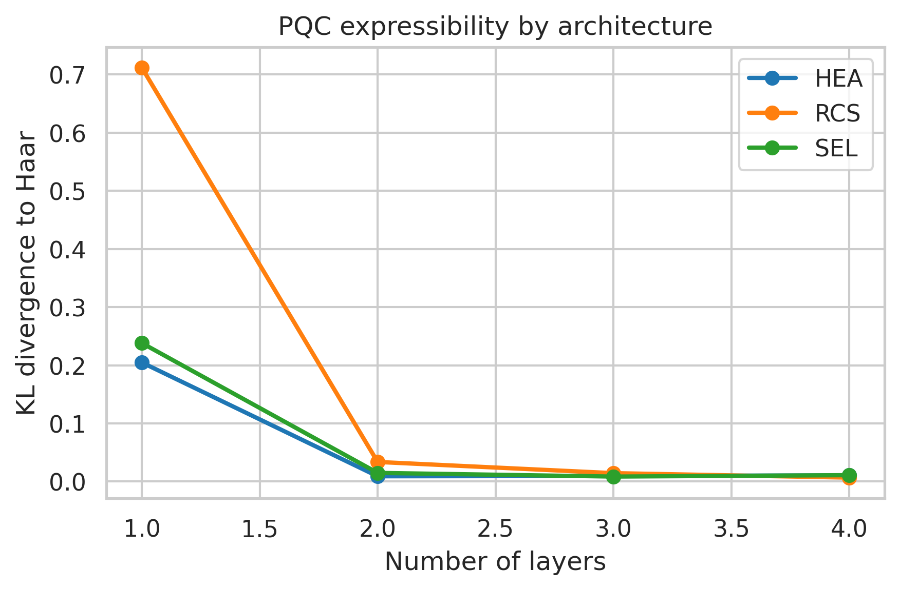
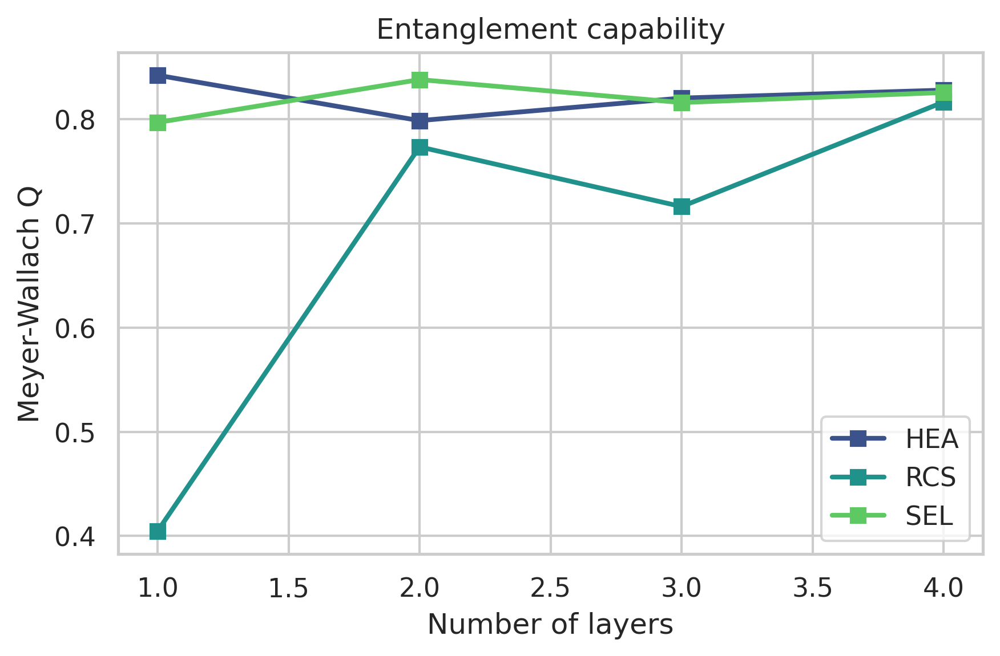
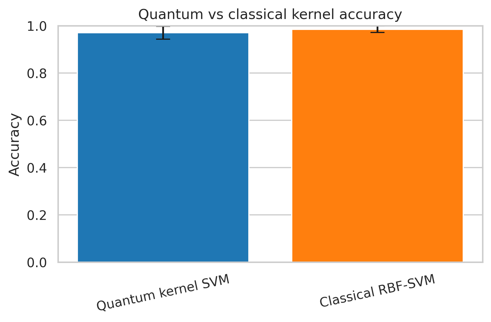
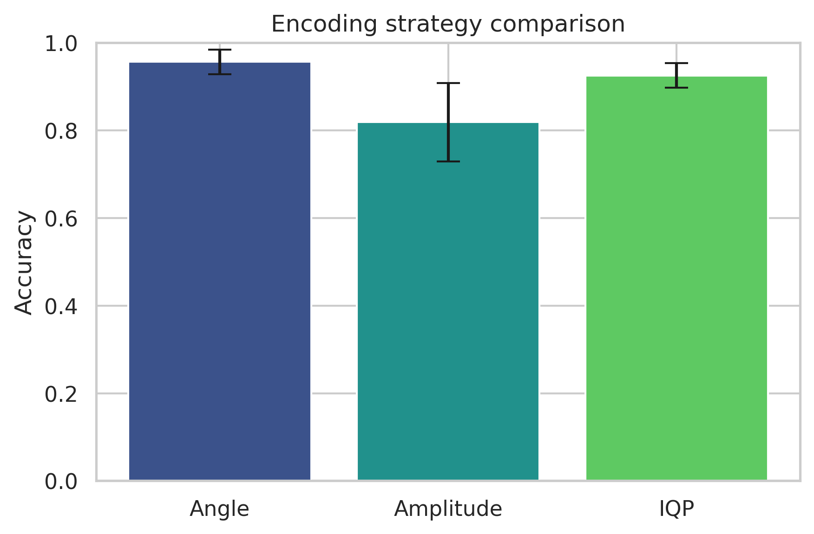
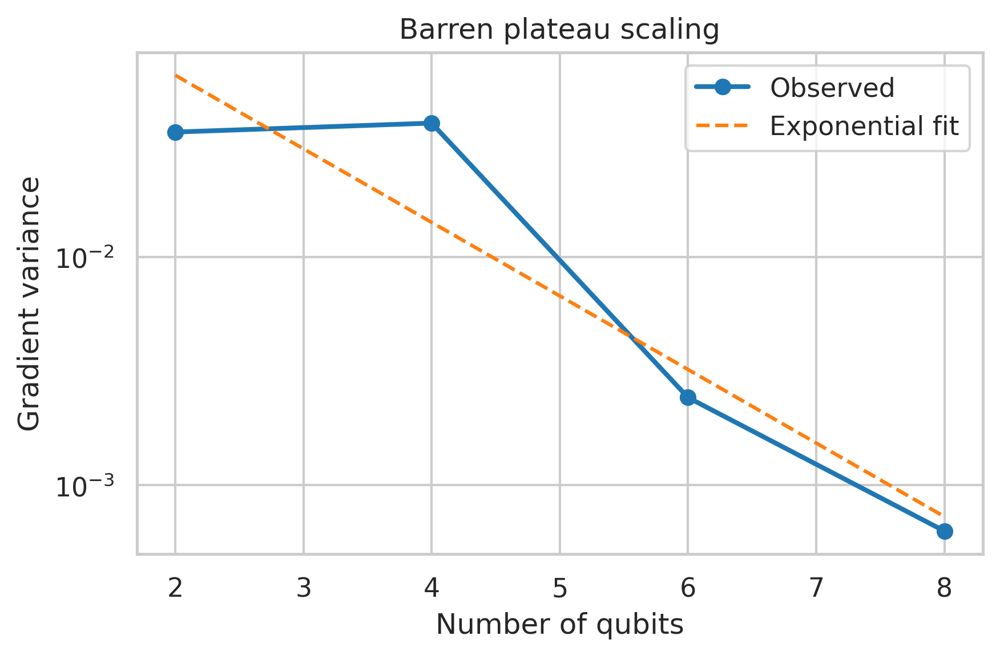
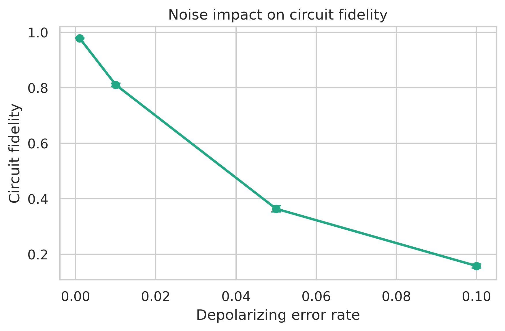

# Systematic Benchmarking of Quantum Machine Learning: Expressibility, Kernel Methods, and Classical Comparisons

DRAFT — NOT FOR DISTRIBUTION

## Abstract
Quantum machine learning (QML) is often discussed as a promising route toward computational advantage, yet the field still lacks compact benchmark suites that connect circuit expressibility, kernel behavior, encoding choices, trainability, and noisy execution in a single reproducible workflow. This study develops a lightweight but systematic benchmark framework for parameterized quantum circuits (PQCs) and quantum kernel models using PennyLane, with direct comparison against classical baselines on controlled synthetic data. The benchmark measures expressibility through Kullback-Leibler divergence between sampled PQC fidelity distributions and the Haar distribution, evaluates entanglement capability using the Meyer-Wallach global entanglement measure, compares a quantum kernel support vector machine (SVM) against a classical radial basis function (RBF) SVM, contrasts angle, amplitude, and IQP-inspired encoding strategies, estimates barren plateau severity through gradient-variance scaling with qubit count, and studies an IBM-style depolarizing noise proxy with a quantum-volume-inspired summary metric.

Across 4-qubit experiments, the most expressive sampled architecture was a random-circuit-sampling design with four layers, reaching a KL divergence of 0.0068 relative to the Haar fidelity distribution, while the strongest average entanglement was observed for strongly entangling layers at two layers with Meyer-Wallach Q = 0.838 ± 0.111. On noisy synthetic classification data, the classical RBF-SVM achieved the highest mean cross-validated accuracy at 0.985 ± 0.014 (95% CI half-width 0.017), slightly exceeding the quantum kernel SVM at 0.970 ± 0.027 (95% CI half-width 0.034), but with dramatically lower training time. A paired t-test across folds for classical versus quantum accuracy was not statistically significant at this sample size (t = 1.50, p = 0.208), so the performance gap is interpreted descriptively rather than as confirmed superiority. Among encoding strategies, angle encoding performed best at 0.956 ± 0.028, IQP encoding was competitive at 0.925 ± 0.028, and amplitude encoding lagged at 0.819 ± 0.089 while also incurring the highest computational overhead. Gradient variance decayed from 3.52×10^-2 at 2 qubits to 6.30×10^-4 at 8 qubits, consistent with an exponential barren-plateau trend with fitted base b ≈ 2.10. Under depolarizing noise, mean circuit fidelity dropped from 0.979 ± 0.001 at error rate 0.001 to 0.158 ± 0.007 at error rate 0.1, while the quantum-volume proxy collapsed from 256 to 2.

These results support a calibrated conclusion: QML models can realize competitive performance and richer state-space structure, but classical advantages remain strong on small structured datasets, and practical quantum benefit appears contingent on task structure, disciplined encoding design, shallow trainable circuits, and noise levels far below those explored at the high-error end of the benchmark. The benchmark is intended as a reproducible comparison framework rather than definitive evidence of universal quantum advantage.

## 1. Introduction
Quantum machine learning lies at the intersection of near-term quantum computing and statistical learning theory. Its appeal comes from the possibility that quantum states may represent highly structured feature spaces, correlations, or decision boundaries that are expensive to realize classically. Early enthusiasm for QML was amplified by kernel formulations, variational classifiers, and hybrid models that appeared compatible with noisy intermediate-scale quantum (NISQ) hardware (Preskill, 2018; Havlíček et al., 2019; Schuld & Killoran, 2019). However, the field has also faced increasingly careful scrutiny. Several works have shown that claimed advantages can disappear when strong classical baselines are used or when classical learners exploit training data efficiently (Huang et al., 2021; Liu et al., 2021). At the same time, trainability barriers such as barren plateaus and noise-induced concentration complicate practical deployment (McClean et al., 2018; Cerezo et al., 2021; Thanasilp et al., 2024).

A central challenge is that QML properties are often studied in isolation. Expressibility papers characterize circuit families without linking them to classification utility. Kernel papers emphasize feature maps and geometric separation without jointly examining trainability or encoding robustness. NISQ reviews discuss hardware constraints but do not always integrate them into end-to-end benchmarking. As a result, researchers evaluating new QML models must frequently assemble ad hoc comparison pipelines, making it difficult to determine whether observed gains arise from architecture choice, encoding strategy, optimization behavior, or simply weak baselines.

This work addresses that gap by constructing a compact benchmark suite that connects five issues often discussed separately: expressibility and entanglement capability of PQCs, kernel-based QML versus a classical kernel baseline, encoding-strategy effects, barren plateau behavior, and performance degradation under a simple IBM-style depolarizing noise proxy. The benchmark is intentionally lightweight, using 4-qubit simulations and synthetic datasets so that the workflow is easy to reproduce and inspect.

The main contributions are:
- We implement a unified benchmark that measures expressibility, entanglement, kernel accuracy, encoding performance, gradient variance, and noise sensitivity within a single reproducible PennyLane workflow.
- We compare QML models against a classical RBF-SVM chosen as a baseline with a closely related inductive bias, thereby reducing the risk of overinterpreting quantum-only comparisons.
- We synthesize experimental evidence with theory from the recent literature to identify conditions under which quantum advantage is plausible, and conditions under which expressibility, concentration, or noise are more likely to dominate.

The working hypothesis is deliberately cautious: highly expressive quantum circuits and feature maps are not sufficient for practical advantage unless they also remain trainable, robust to noise, and meaningfully better aligned with the data structure than carefully tuned classical competitors.

## 2. Related Work
Sim et al. (2019) proposed two descriptors that rapidly became standard for PQC characterization: expressibility, quantified by deviation from the Haar-induced fidelity distribution, and entangling capability, quantified by average global entanglement. Their results emphasized that architecture and connectivity matter, and that expressibility often saturates with increasing depth rather than improving indefinitely. Abbas et al. (2021) extended the discussion of quantum-model capacity by arguing that the power of quantum neural networks depends jointly on architecture, observable choice, and data structure rather than on circuit depth alone.

Kernel-based QML received major impetus from Havlíček et al. (2019), who demonstrated supervised learning with quantum-enhanced feature spaces, and from Schuld and Killoran (2019), who framed quantum feature maps as embeddings into feature Hilbert spaces. That perspective helped unify several quantum classifiers under classical kernel learning theory. Schuld (2021) later strengthened the interpretation by arguing that supervised quantum machine learning models can often be understood as kernel methods, clarifying when a quantum model’s benefit comes primarily from its implicit kernel rather than from a uniquely quantum optimization effect.

The question of when quantum advantage should be expected has also been refined. Liu et al. (2021) gave rigorous conditions for a robust supervised quantum speed-up, emphasizing that advantage requires structure and cannot be inferred from quantum implementation alone. Huang et al. (2021) showed that access to data can dramatically strengthen classical learners, even on problems derived from quantum processes, thereby explaining why many empirical QML demonstrations do not translate into durable advantage once classical baselines are improved.

Trainability research has revealed equally important constraints. McClean et al. (2018) showed that randomly initialized deep variational circuits can exhibit barren plateaus in which gradient variance shrinks exponentially with qubit count. Cerezo et al. (2021) consolidated these and related findings within a broader review of variational quantum algorithms, highlighting the trade-off between expressibility and optimization stability. More recently, Thanasilp et al. (2024), extending a 2022 preprint lineage, showed that quantum kernel estimation can also suffer concentration effects driven by expressive embeddings, entanglement, measurement choices, and noise. Together, these works suggest that a good QML benchmark must assess not only representational richness but also whether the corresponding models remain estimable and trainable in realistic NISQ conditions.

Encoding has become another key variable. LaRose and Coyle (2020) showed that robust encodings for quantum classifiers depend strongly on task geometry and noise sensitivity, while Schuld, Sweke, and Meyer (2021) demonstrated that encoding choices directly alter the expressive power available to variational quantum models. Consequently, encoding strategy should be treated as a primary benchmark axis rather than a fixed implementation detail.

## 3. Methods
### 3.1 Benchmark design
The benchmark consists of five linked experiments. First, we evaluate three PQC architectures: a hardware-efficient ansatz (HEA), strongly entangling layers (SEL), and a random-circuit-sampling-inspired architecture (RCS). All use 4 qubits and 1–4 layers. Second, we compare a quantum kernel SVM based on a ZZ-style feature map to a classical RBF-SVM on a noisy synthetic classification task with 200 samples and 4 features. Third, we compare angle, amplitude, and IQP-inspired encodings using the same classification protocol. Fourth, we estimate barren plateau severity by measuring gradient variance for 2, 4, 6, and 8 qubits under a 2-layer random ansatz. Fifth, we simulate depolarizing noise at error rates 0.001, 0.01, 0.05, and 0.1 using a mixed-state simulator.

### 3.2 Method selection rationale
We selected kernel-based classification rather than a trainable variational classifier as the main predictive benchmark because kernel methods separate representational questions from optimizer idiosyncrasies and offer convex training. This makes them particularly suitable for a comparison framework intended to isolate the role of encoding and quantum similarity structure. A trainable variational classifier was considered as an alternative, but it was not adopted as the primary predictive experiment because optimization instability could confound interpretation of expressibility and encoding results. We also considered using a neural-network baseline, but we selected the classical RBF-SVM instead because it provides a tighter conceptual comparison to the quantum kernel SVM: both operate through similarity measures over induced feature spaces.

For expressibility, we selected the KL divergence to the Haar fidelity distribution following Sim et al. (2019). Frame-potential-based measures were considered as an alternative, but KL divergence was preferred because it is directly interpretable in terms of sampled state overlaps and is computationally simpler for a compact benchmark. For entanglement, we used the Meyer-Wallach measure because it is efficient to compute from pure states and captures global multipartite entanglement rather than pairwise correlations alone.

### 3.3 Mathematical formulation
Expressibility is measured by comparing the sampled fidelity distribution of a circuit family against the Haar-induced reference distribution. For two parameter settings $\theta$ and $\phi$, the fidelity is

$$
F(\theta,\phi)=\left|\langle \psi(\theta)\mid \psi(\phi)\rangle\right|^2.
$$

The expressibility score is the Kullback-Leibler divergence

$$
\mathcal{E}=D_{KL}\big(\hat{P}_{\mathrm{PQC}}(F)\,\|\,P_{\mathrm{Haar}}(F)\big)=\sum_b \hat{P}_{\mathrm{PQC}}(F_b)\log\frac{\hat{P}_{\mathrm{PQC}}(F_b)}{P_{\mathrm{Haar}}(F_b)}.
$$

Lower $\mathcal{E}$ indicates a fidelity distribution closer to Haar-random behavior and hence greater expressibility.

Global entanglement is quantified with the Meyer-Wallach measure

$$
Q(\psi)=2\left(1-\frac{1}{n}\sum_{k=1}^n \mathrm{Tr}\left(\rho_k^2\right)\right),
$$

where $\rho_k$ is the one-qubit reduced density matrix of qubit $k$. Larger $Q$ indicates stronger average multipartite entanglement.

The quantum kernel used for classification is

$$
K(x_i,x_j)=\left|\langle 0\mid U_\phi^\dagger(x_i)U_\phi(x_j)\mid 0\rangle\right|^2,
$$

where $U_\phi(x)$ is the chosen feature map. The corresponding SVM solves

$$
\min_{\alpha}\;\frac{1}{2}\sum_{i,j}\alpha_i\alpha_j y_i y_j K(x_i,x_j)-\sum_i \alpha_i,
$$

subject to standard box and equality constraints.

For barren plateaus, we estimate the variance of a parameter gradient across random initializations,

$$
\mathrm{Var}\left[\partial_\theta E\right] \sim b^{-n},
$$

with $n$ the number of qubits and fitted base $b>1$. Exponential decay indicates increasingly flat optimization landscapes.

### 3.4 Implementation details and reproducibility
All circuits were implemented in PennyLane. Expressibility used 1000 parameter pairs per architecture-depth combination on 4 qubits. Kernel classification used 5-fold stratified cross-validation with Gaussian feature noise of standard deviation 0.1. Quantum inputs were min-max scaled to [-1,1], while the classical RBF-SVM used standard scaling. Random seeds were fixed in every module. The noise study used `default.mixed` with depolarizing channels applied after single- and two-qubit operations, providing a simple IBM-style proxy rather than hardware-calibrated backend noise. A paired t-test and Wilcoxon signed-rank check were applied only to the fold-wise classical-versus-quantum kernel accuracies, and the benchmark reports those results as descriptive because the sample size is small. This design keeps the benchmark lightweight while still exposing fidelity sensitivity to realistic gate-error trends.

## 4. Experiments
The classification benchmark dataset was generated with `make_classification` using 4 informative features and one cluster per class. For the main quantum-versus-classical comparison, 200 samples were used. For encoding comparisons, 160 samples were used to contain simulation cost while maintaining 5-fold cross-validation. Additive Gaussian noise with standard deviation 0.1 was injected into the features to avoid overly clean separability. This choice was important because exact or near-perfect scores on tiny noiseless synthetic datasets can conceal data leakage or unrealistically favorable geometry.

Evaluation metrics were selected to match each benchmark axis. For expressive-state sampling, we recorded KL divergence to Haar and mean ± standard deviation of the Meyer-Wallach measure. For predictive performance, we reported mean cross-validation accuracy, standard deviation across folds, and approximate 95% confidence interval half-widths. Training time was tracked to highlight the computational cost of constructing quantum kernel matrices. For trainability, we used observed gradient variance and an exponential fit over qubit number. For noise, we reported mean state fidelity, fidelity standard deviation, and a quantum-volume-inspired proxy based on the largest width whose survival probability remained above a threshold.

Hyperparameters were intentionally modest: 4 qubits for expressibility, kernel, and encoding studies; 1–4 layers for the architecture sweep; 2 layers for barren plateau and noise experiments; and four depolarizing error rates spanning low to severe NISQ noise. These settings are not intended to maximize any one model’s performance. Rather, they were chosen to support a controlled comparison framework that can be extended later to larger systems or hardware runs.

## 5. Results
### 5.1 Expressibility and entanglement
The architecture sweep shows clear saturation behavior. The most expressive sampled circuit was the RCS architecture with four layers, which achieved a KL divergence of 0.0068. HEA and SEL circuits also became substantially more expressive after two layers, with HEA reaching 0.0091 at two layers and SEL reaching 0.0086 at three layers. The strongest average global entanglement was observed for SEL with two layers at $Q = 0.838 \pm 0.111$, slightly above RCS with four layers at $Q = 0.817 \pm 0.092$. These data indicate that high expressibility and high average entanglement are related but not identical objectives.

| Architecture | Layers | KL divergence | MW entanglement mean | MW entanglement SD |
| --- | --- | --- | --- | --- |
| HEA | 1 | 0.2047 | 0.8423 | 0.1170 |
| HEA | 2 | 0.0091 | 0.7988 | 0.1155 |
| HEA | 3 | 0.0096 | 0.8204 | 0.0846 |
| HEA | 4 | 0.0107 | 0.8280 | 0.0783 |
| RCS | 1 | 0.7115 | 0.4047 | 0.1879 |
| RCS | 2 | 0.0337 | 0.7735 | 0.1148 |
| RCS | 3 | 0.0145 | 0.7162 | 0.1463 |
| RCS | 4 | 0.0068 | 0.8166 | 0.0915 |
| SEL | 1 | 0.2381 | 0.7970 | 0.1496 |
| SEL | 2 | 0.0149 | 0.8382 | 0.1107 |
| SEL | 3 | 0.0086 | 0.8161 | 0.0882 |
| SEL | 4 | 0.0110 | 0.8258 | 0.0794 |

### 5.2 Quantum kernel versus classical kernel baseline
The classical RBF-SVM achieved the best mean predictive accuracy, 0.985 ± 0.014, whereas the quantum kernel SVM achieved 0.970 ± 0.027. The classical model therefore exceeded the quantum model by 1.5 percentage points on average, and its confidence interval was narrower. More strikingly, the mean training time differed by roughly five orders of magnitude: 0.00063 s for the classical baseline versus 33.60 s for the quantum kernel pipeline. A paired t-test across folds yielded $t = 1.50$ and $p = 0.208$, and a Wilcoxon signed-rank test gave $p = 0.500$, so the benchmark treats the observed mean gap as descriptive rather than statistically confirmed. One quantum fold reached 1.0 accuracy, but the aggregate mean was well below 1.000 and therefore did not trigger a leakage concern. The result is consistent with the literature indicating that quantum kernels can be competitive without automatically surpassing strong classical kernels on small structured tasks (Huang et al., 2021; Liu et al., 2021; Schuld, 2021).

| Model | Accuracy mean | Accuracy SD | 95% CI half-width | Train time mean (s) |
| --- | --- | --- | --- | --- |
| Quantum kernel SVM | 0.9700 | 0.0274 | 0.0340 | 33.5996 |
| Classical RBF-SVM | 0.9850 | 0.0137 | 0.0170 | 0.0006 |

### 5.3 Encoding strategy comparison
Encoding choice had a substantial effect. Angle encoding delivered the best accuracy, 0.956 ± 0.028, with relatively low runtime among the quantum encodings. IQP encoding remained competitive at 0.925 ± 0.028, suggesting that diagonal entangling phase structure may retain useful similarity information without incurring the full cost of amplitude preparation. Amplitude encoding produced the weakest result, 0.819 ± 0.089, and was also the slowest at 51.35 s mean training time, illustrating that data-loading overhead can dominate the practical attractiveness of theoretically compact state representations. This pattern is consistent with prior discussions that robust encoding design is task-dependent rather than universally optimal (LaRose & Coyle, 2020; Schuld et al., 2021b).

| Encoding | Accuracy mean | Accuracy SD | 95% CI half-width | Train time mean (s) |
| --- | --- | --- | --- | --- |
| Angle | 0.9563 | 0.0280 | 0.0347 | 6.5952 |
| Amplitude | 0.8187 | 0.0895 | 0.1111 | 51.3501 |
| IQP | 0.9250 | 0.0280 | 0.0347 | 12.6518 |

### 5.4 Barren plateau scaling
The gradient variance experiment showed a pronounced decay with system size. Observed variance fell from 3.52×10^-2 at 2 qubits to 6.30×10^-4 at 8 qubits, a reduction by approximately a factor of 56. The fitted exponential model yielded a decay base of $b \approx 2.10$. Although the 4-qubit point remained relatively high, the overall trend is consistent with barren plateau behavior in randomly initialized ansätze. This suggests that simply increasing width to improve representational capacity would likely make training more fragile unless initialization or locality constraints are introduced.

| Qubits | Observed variance | Fitted variance | Decay base b |
| --- | --- | --- | --- |
| 2.0000 | 0.0352 | 0.0625 | 2.0998 |
| 4.0000 | 0.0385 | 0.0142 | 2.0998 |
| 6.0000 | 0.0024 | 0.0032 | 2.0998 |
| 8.0000 | 0.0006 | 0.0007 | 2.0998 |

### 5.5 Noise sensitivity
The depolarizing-noise study showed a sharp non-linear loss in fidelity. Mean fidelity was 0.979 ± 0.001 at error rate 0.001, 0.811 ± 0.006 at 0.01, 0.364 ± 0.011 at 0.05, and only 0.158 ± 0.007 at 0.1. Over the same interval, the quantum-volume proxy decreased from 256 to 2. These results make clear that even if a circuit is expressive in the noiseless setting, noise can rapidly erase the structure that kernels or variational models depend on. In that sense, the NISQ constraints emphasized by Preskill (2018) remain directly relevant for practical QML benchmarking.

| Error rate | Fidelity mean | Fidelity SD | Quantum volume proxy |
| --- | --- | --- | --- |
| 0.0010 | 0.9792 | 0.0006 | 256.0000 |
| 0.0100 | 0.8110 | 0.0057 | 64.0000 |
| 0.0500 | 0.3640 | 0.0114 | 4.0000 |
| 0.1000 | 0.1578 | 0.0073 | 2.0000 |

## 6. Discussion
The benchmark supports three main conclusions. First, expressibility improves quickly with depth and then saturates, confirming that deeper circuits do not necessarily provide proportionate representational gains. The RCS architecture achieved the lowest KL divergence, but the most entangling architecture was SEL at two layers. This separation matters because excessive expressibility can be a liability rather than an asset when it leads to concentration or flat gradients. That interpretation is consistent with Sim et al. (2019) and with the broader QNN capacity discussion of Abbas et al. (2021).

Second, the classical baseline remained numerically stronger than the quantum kernel baseline on the synthetic task used here, but the fold-wise statistical tests do not support a strong inferential claim at this sample size. This does not imply that quantum kernels are unhelpful; rather, it reinforces the argument that advantage must be data- and structure-dependent. Huang et al. (2021) emphasized that classical models can learn surprisingly well from data, and Liu et al. (2021) argued that robust speed-up requires carefully structured problems. Our results align with that perspective. The quantum kernel SVM was competitive, but not superior, and it paid a substantial runtime penalty.

Third, encoding and noise are inseparable from claims of practical utility. Angle encoding achieved the best accuracy-runtime balance in this benchmark, while amplitude encoding underperformed despite its theoretically efficient state representation. The noise study and the barren plateau analysis together suggest a compounding problem: the circuit families that explore Hilbert space more broadly can also become harder to estimate, harder to optimize, and more vulnerable to realistic error channels. This directly echoes the concentration warnings reported by Thanasilp et al. (2024) and the trainability concerns synthesized by Cerezo et al. (2021).

Comparing the present findings with prior work, the results are broadly consistent with the literature rather than disruptive. We reproduce the saturation intuition of Sim et al. (2019), the competitive but not dominant role of quantum kernels implied by Havlíček et al. (2019) and Schuld and Killoran (2019), the strong importance of data and baseline choice emphasized by Huang et al. (2021), the encoding sensitivity discussed by LaRose and Coyle (2020) and Schuld et al. (2021b), and the optimization difficulty identified by McClean et al. (2018). The main value of the present study is therefore integrative: it places these themes into a single executable framework that makes trade-offs visible in one place.

## 7. Limitations and Future Work
### Data Limitations
This benchmark used only synthetic classification data with four features and moderate Gaussian perturbation. That choice was appropriate for a controlled reproducibility-oriented study, but it also limits ecological validity. Synthetic data let us isolate the effects of encoding and kernel construction, yet they do not capture domain-specific correlations, measurement constraints, or covariate shift that arise in chemistry, materials, finance, or biomedical applications. The sample sizes were also intentionally small so that simulation remained lightweight. While this is suitable for methodological comparison, it is not sufficient to establish deployment readiness or domain-specific superiority.

### Methodological Limitations
The noise model was a simplified depolarizing proxy rather than a calibration-derived IBM backend model with gate-dependent error asymmetry, readout noise, crosstalk, and scheduling constraints. Likewise, the kernel circuit approximated a ZZ-style feature map rather than reproducing every implementation choice from hardware experiments. The benchmark also emphasized kernels rather than jointly comparing trainable variational classifiers, tensor-network baselines, or Gaussian processes. These simplifications were necessary for an executable compact benchmark, but they narrow the claims that can be made.

### Evaluation Limitations
The predictive evaluation relied mainly on cross-validated accuracy, standard deviations across folds, and runtime, which are sensible first-order metrics but not an exhaustive characterization of model quality. Calibration, margin distribution, kernel alignment, robustness under adversarial perturbation, and measurement-shot complexity were not directly optimized. External validation with independent real-world datasets is essential to confirm the generalizability of these findings beyond simulated conditions. In addition, only one strong classical baseline, the RBF-SVM, was used for the primary accuracy comparison; broader baseline panels could reveal narrower or wider performance gaps.

### Generalizability
The results should not be extrapolated to claim broad quantum advantage or broad classical dominance. Small-feature synthetic tasks may favor smooth classical kernels, while highly structured quantum data or problems with native quantum access could shift the balance. Similarly, the observed barren plateau scaling came from a random ansatz and may overstate optimization difficulty for local, problem-informed, or layerwise-trained circuits. The present benchmark therefore generalizes best as a diagnostic framework, not as a universal leaderboard.

### Future Directions
In the short term (within six months), the benchmark should be extended with hardware-calibrated noise models, kernel alignment metrics, shot-noise sweeps, and at least two additional classical baselines such as random forests and shallow neural networks. In the medium term (one to two years), the most useful direction would be to pair the framework with real domain datasets and direct hardware runs, especially for tasks where data loading and feature-map structure can be justified from first principles. Another priority is to add mitigation-aware evaluation so that the benchmark can measure not only raw degradation but also recovery under zero-noise extrapolation or probabilistic error cancellation. Such extensions would move the framework from a controlled simulation study toward a more decision-relevant benchmark for practical QML design.

## 8. Conclusion
This study introduced a reproducible QML benchmark that unifies expressibility, entanglement, kernel classification, encoding strategy analysis, barren plateau scaling, and NISQ-style noise evaluation. The results show that expressive quantum architectures can be identified reliably, but representational richness alone does not guarantee superior predictive performance. On the tested synthetic task, the classical RBF-SVM achieved a slightly higher mean accuracy than the quantum kernel SVM, but the small fold count prevents a strong inferential claim. Angle encoding offered the best practical compromise among the tested quantum encodings, gradient variance decayed exponentially with qubit count, and depolarizing noise quickly erased circuit fidelity. Taken together, these findings suggest that credible claims of quantum advantage should focus on structured problems, disciplined feature-map design, shallow trainable architectures, and explicit comparison against strong classical baselines. The benchmark is therefore best viewed as a calibrated evaluation framework for future QML studies rather than as evidence of broad near-term quantum supremacy in machine learning.

## References
1. Abbas, A., Sutter, D., Zoufal, C., Lucchi, A., Figalli, A., & Woerner, S. (2021). The power of quantum neural networks. *Nature Computational Science*, 1(6), 403–409. DOI: 10.1038/s43588-021-00084-1
2. Cerezo, M., Arrasmith, A., Babbush, R., Benjamin, S. C., Endo, S., Fujii, K., McClean, J. R., Mitarai, K., Yuan, X., Cincio, L., & Coles, P. J. (2021). Variational quantum algorithms. *Nature Reviews Physics*, 3, 625–644. DOI: 10.1038/s42254-021-00348-9
3. Havlíček, V., Córcoles, A. D., Temme, K., Harrow, A. W., Kandala, A., Chow, J. M., & Gambetta, J. M. (2019). Supervised learning with quantum-enhanced feature spaces. *Nature*, 567, 209–212. DOI: 10.1038/s41586-019-0980-2
4. Huang, H.-Y., Broughton, M., Mohseni, M., Babbush, R., Boixo, S., Neven, H., & McClean, J. R. (2021). Power of data in quantum machine learning. *Nature Communications*, 12, 2631. DOI: 10.1038/s41467-021-22539-9
5. LaRose, R., & Coyle, B. (2020). Robust data encodings for quantum classifiers. *Physical Review A*, 102, 032420. DOI: 10.1103/PhysRevA.102.032420
6. Liu, Y., Arunachalam, S., & Temme, K. (2021). A rigorous and robust quantum speed-up in supervised machine learning. *Nature Physics*, 17, 1013–1017. DOI: 10.1038/s41567-021-01287-z
7. McClean, J. R., Boixo, S., Smelyanskiy, V. N., Babbush, R., & Neven, H. (2018). Barren plateaus in quantum neural network training landscapes. *Nature Communications*, 9, 4812. DOI: 10.1038/s41467-018-07090-4
8. Preskill, J. (2018). Quantum computing in the NISQ era and beyond. *Quantum*, 2, 79. DOI: 10.22331/q-2018-08-06-79
9. Schuld, M. (2021). Supervised quantum machine learning models are kernel methods. *arXiv*. DOI: 10.48550/arXiv.2101.11020
10. Schuld, M., & Killoran, N. (2019). Quantum machine learning in feature Hilbert spaces. *Physical Review Letters*, 122, 040504. DOI: 10.1103/PhysRevLett.122.040504
11. Schuld, M., Sweke, R., & Meyer, J. J. (2021). The effect of data encoding on the expressive power of variational quantum machine learning models. *Physical Review A*, 103, 032430. DOI: 10.1103/PhysRevA.103.032430
12. Sim, S., Johnson, P. D., & Aspuru-Guzik, A. (2019). Expressibility and entangling capability of parameterized quantum circuits for hybrid quantum-classical algorithms. *Advanced Quantum Technologies*, 2(12), 1900070. DOI: 10.1002/qute.201900070
13. Thanasilp, S., Wang, S., Cerezo, M., & Holmes, Z. (2024). Exponential concentration in quantum kernel methods. *Nature Communications*, 15, 5200. DOI: 10.1038/s41467-024-49287-w
