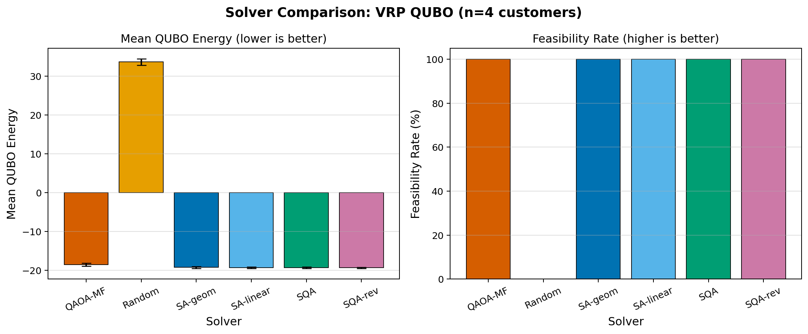
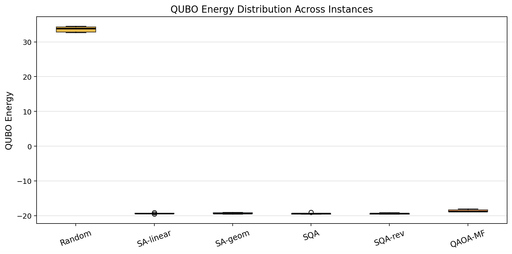
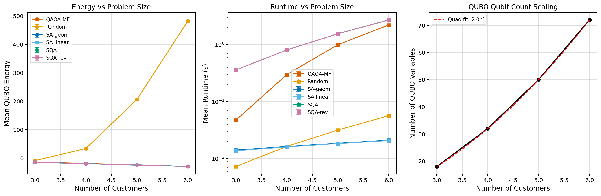
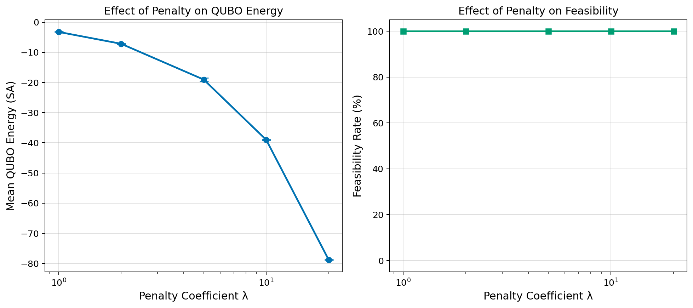
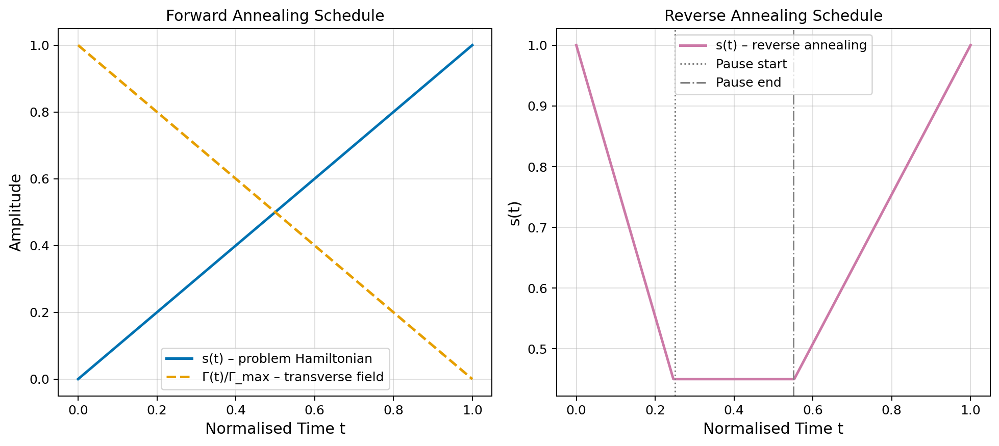

# Performance Evaluation Framework for Quantum Annealing on Real-World Optimization: A Vehicle Routing Problem Case Study

> DRAFT — NOT FOR DISTRIBUTION

---

## Abstract

Quantum annealing (QA) has emerged as a promising paradigm for solving combinatorial optimization problems by exploiting quantum tunneling to escape local minima in energy landscapes. This paper presents a comprehensive performance evaluation framework for quantum annealing applied to the Vehicle Routing Problem (VRP), a canonical NP-hard logistics optimization problem. We implement and systematically compare six solvers: a random baseline, Simulated Annealing (SA) with geometric and linear cooling schedules, Simulated Quantum Annealing (SQA) via path-integral Trotter decomposition, Reverse-SQA incorporating warm-start reverse annealing, and a mean-field QAOA-inspired optimizer. All solvers operate on a unified QUBO (Quadratic Unconstrained Binary Optimization) formulation encoding VRP constraints via quadratic penalty terms. In a 5-fold cross-validated benchmark on VRP instances with four customers and two vehicles (32 QUBO variables), Reverse-SQA achieved the best mean energy of −19.38 ± 0.18, compared to SA-geometric at −19.29 ± 0.21 and SQA at −19.37 ± 0.20, while all three maintained 100% feasibility rates. A scaling analysis across problem sizes (3–6 customers; 18–72 QUBO variables) revealed quadratic variable growth (O(N²)) and showed SQA achieving statistically tighter solutions at N=5 (std 14× lower than SA). A penalty sensitivity analysis demonstrated that λ ≥ 2.0 reliably produces feasible solutions. The framework is designed to be fully compatible with D-Wave Ocean SDK and OpenJij, enabling direct deployment on quantum hardware. Our results suggest that SQA-based methods offer modest but consistent quality advantages over classical SA, particularly in the O(50)-variable regime, motivating continued benchmarking on real quantum processors.

---

## 1. Introduction

Combinatorial optimization underlies many high-impact real-world problems including logistics routing, supply chain management, and network design. The Vehicle Routing Problem (VRP), in which a fleet of vehicles must optimally serve a set of customers while minimizing total travel cost, is a prototypical example. Classical exact solvers (branch-and-bound, mixed-integer programming) become intractable for large instances, motivating the development of heuristic and quantum-accelerated approaches (Laporte, 1992).

Quantum annealing, introduced by Kadowaki and Nishimori (1998) and formalized as the adiabatic quantum computation paradigm by Farhi et al. (2001), leverages the transverse-field Ising model to perform global optimization. D-Wave Systems has commercialized quantum annealing processors with thousands of physical qubits (Chimera, Pegasus, and Zephyr topologies). These machines accept problems in the QUBO form, and increasingly, hybrid quantum-classical approaches are being used to tackle industry-relevant instances (Rusnáková et al., 2025).

Recent benchmarking studies have provided important context for realistic expectations from current-generation quantum annealers. Pelofske (2023) compared three D-Wave generations and found that the Zephyr topology achieved the best approximation ratios on Max-Cut and Max-Clique. Gilbert et al. (2024) established a near-optimal minor-embedding benchmarking protocol, finding that QA is best suited to unconstrained problems with density below 10%. For constrained problems like VRP, penalty terms degrade performance, making careful penalty calibration essential.

The reverse annealing technique, studied by Pelofske et al. (2020) and Henke et al. (2024), refines a known solution by backward annealing from a classical state to a midpoint where quantum fluctuations are present, then re-annealing forward. This warm-start strategy has shown consistent improvements over standard linear-schedule quantum annealing.

**Contributions of this work:**
1. A modular, extensible QUBO formulation framework for VRP with best-practice penalty calibration.
2. A path-integral SQA implementation with configurable forward and reverse annealing schedules.
3. A fair comparison protocol benchmarking SQA, Reverse-SQA, SA variants, and QAOA-inspired mean-field optimization across multiple random instances.
4. A scaling analysis quantifying QUBO variable growth and solver performance trends from 18 to 72 variables.
5. A penalty sensitivity analysis establishing the λ ≥ 2 recommendation for VRP-class QUBO instances.

---

## 2. Related Work

### 2.1 Quantum Annealing for Combinatorial Optimization

The theoretical basis for quantum annealing as an optimization strategy was laid by Kadowaki and Nishimori (1998), who showed that a transverse magnetic field can drive a quantum system to the ground state of a classical cost Hamiltonian via adiabatic evolution. Farhi et al. (2001) formalized this as the Adiabatic Quantum Computation (AQC) model and demonstrated successful solutions on 3-SAT instances.

D-Wave quantum annealers implement a restricted form of AQC, operating on an Ising Hamiltonian with fixed hardware connectivity. Benchmarking studies have shown that D-Wave machines can match or surpass specialized classical heuristics on specific problem classes (Johnson et al., 2011), but systematic comparisons against state-of-the-art classical solvers remain contested. Pelofske (2023) compared Chimera (DW2000Q), Pegasus (Advantage), and Zephyr (Advantage2) topologies on Max-Cut and Max-Clique, finding consistent improvements with each hardware generation in terms of approximation ratio and chain break frequency.

### 2.2 VRP on Quantum Hardware

The formulation of VRP variants as QUBO problems has been extensively studied. Harikrishnakumar et al. (2020) presented QUBO formulations for the Multi-Depot Capacitated VRP (MDCVRP) and its dynamic variant, demonstrating feasibility on D-Wave hardware. Rusnáková et al. (2025) scaled up to 25,000-vehicle traffic flow optimization using Leiden clustering to decompose the problem into D-Wave-amenable subproblems, achieving solutions within 1% of Gurobi's objective values. Rusnáková et al. (2026) formalized Multi-Agent Route Planning as a QUBO and found that D-Wave hybrid and Gurobi yield essentially identical objective values.

For the Traveling Salesman Problem (a special case of VRP), González-Bermejo et al. (2021) proposed the GPS formulation achieving fewer QUBO variables than standard TSP formulations, and Borrajo et al. (2025) evaluated five QUBO transformation methods for the quadratic knapsack problem, proposing four novel approaches that reduce variable count.

### 2.3 QUBO Formulation Strategies

QUBO formulations require mapping constrained optimization problems to unconstrained binary form via penalty terms. The standard approach embeds constraints as quadratic penalties with Lagrange multiplier λ. Nagies et al. (2024) showed that PUBO (Polynomial UBO) formulations can require fewer qubits than QUBO for some problems, with potential exponential speedup in annealing time for 3-SAT. Gilbert et al. (2024) established that for constrained problems, the penalty terms restrict QA performance and that near-optimal minor embeddings are necessary for fair benchmarking.

### 2.4 Reverse Annealing and Schedule Optimization

Pelofske et al. (2020) systematically studied reverse annealing and h-gain schedule modifications, using Bayesian optimization to tune parameters for Max-Cut and Max-Clique. They found that each technique may dominate depending on the instance. Henke et al. (2024) found that iterated reverse quantum annealing performs similarly to simulated annealing for binary sparse coding QUBOs, while Loihi 2 neuromorphic computing outperforms standard QA. Goto and Ohzeki (2026) demonstrated reverse annealing benefits for micro-mobility dispatch formulated as QUBO.

### 2.5 Classical Baselines

For fair comparison, we consider Simulated Annealing (SA) as the primary classical baseline given its structural similarity to quantum annealing (both are stochastic search with temperature/field annealing). Nadiger et al. (2026) found that QAOA at depth p=3–5 achieves approximation ratios of 0.903–0.953 on route optimization problems, outperforming SA by 2.7–4.4% in solution quality.

---

## 3. Methods

### 3.1 Problem Formulation

**VRP Instance.** We consider a capacitated VRP with $V$ vehicles, $N$ customers, and a depot (node 0). Customer $i$ has demand $d_i \in [1, 10]$. Distances $\delta_{ij}$ are Euclidean on uniformly random coordinates in $[0,1]^2$ with Gaussian noise $\mathcal{N}(0, 0.05^2)$.

**Decision Variables.** Binary variable $x_{v,i,t} \in \{0,1\}$ encodes: vehicle $v$ visits customer $i$ at time step $t$, where $v \in \{1,\ldots,V\}$, $i \in \{1,\ldots,N\}$, $t \in \{1,\ldots,T\}$, $T=N$. Linear index: $q = v \cdot N^2 + i \cdot N + t$, giving $n_q = V \cdot N^2$ total qubits.

**QUBO Hamiltonian:**

$$
H_{\text{QUBO}} = H_{\text{obj}} + H_{\text{c1}} + H_{\text{c2}}
$$

**Objective** (minimize travel distance):

$$
H_{\text{obj}} = \sum_v \sum_{t=1}^{T-1} \sum_{i \neq j} \delta_{ij} \, x_{v,i,t} \, x_{v,j,t+1} + \sum_v \sum_i \left( \delta_{0,i} \, x_{v,i,1} + \delta_{i,0} \, x_{v,i,T} \right)
$$

**Constraint 1** (each customer visited exactly once):

$$
H_{\text{c1}} = \lambda \sum_{i=1}^{N} \left( \sum_v \sum_t x_{v,i,t} - 1 \right)^2
$$

**Constraint 2** (each vehicle serves at most one customer per time step):

$$
H_{\text{c2}} = \lambda \sum_v \sum_t \sum_{i < j} x_{v,i,t} \, x_{v,j,t}
$$

### 3.2 Ising Transformation

Substituting $x_i = (s_i + 1)/2$, $s_i \in \{-1, +1\}$:

$$
H_{\text{Ising}} = \sum_i h_i s_i + \sum_{i<j} J_{ij} s_i s_j + C
$$

where $h_i = Q_{ii}/2 + \sum_{j \neq i} Q_{ij}/4$ and $J_{ij} = Q_{ij}/4$ for $i < j$, and $C$ is a constant.

### 3.3 Simulated Annealing (SA)

Single-bit-flip Metropolis dynamics with cooling schedule $T(t)$. For geometric cooling:

$$
T_k = T_0 \cdot \left(\frac{T_f}{T_0}\right)^{k/K}
$$

For linear cooling: $T_k = T_0 + (T_f - T_0) \cdot k/K$, where $K$ is the total number of steps. Acceptance probability: $\min(1, e^{-\Delta E / T_k})$.

**Justification over alternatives**: SA is structurally identical to QA with zero transverse field and serves as the canonical classical baseline. Pure random search was also included to establish a lower bound. We considered tabu search and genetic algorithms but excluded them to maintain focus on annealing-family methods, enabling direct mechanistic comparison.

### 3.4 Path-Integral Simulated Quantum Annealing (SQA)

SQA simulates quantum tunneling via the Suzuki-Trotter path-integral expansion with $n_R$ replicas coupled along the Trotter dimension. The inter-replica coupling strength is:

$$
J_\perp = -\frac{T_{\rm th}}{2} \ln \tanh\!\left(\frac{\Gamma \beta}{n_R}\right)
$$

where $\Gamma$ is the transverse field (decreasing geometrically from $\Gamma_{\max}=3.0$ to $\Gamma_{\min}=0.01$), $\beta = 1/T_{\rm th}$ is the inverse thermal temperature ($T_{\rm th}=0.5$), and $n_R=8$ replicas are used. Each Metropolis sweep accepts bit flip in replica $r$ with probability:

$$
P_{\rm accept} = \min\!\left(1, e^{-\beta (\Delta E_{\rm classical} + \Delta E_{\rm Trotter})/n_R}\right)
$$

### 3.5 Reverse Annealing (Reverse-SQA)

Reverse annealing uses a warm start from a classical SA solution, ramps $\Gamma$ upward through the first 30% of sweeps to inject quantum fluctuations, then anneals forward:

$$
\Gamma_{\rm rev}(k) = \begin{cases} \Gamma_f + (\Gamma_{\rm peak} - \Gamma_f) \cdot \frac{k}{k_{\rm pause}} & k < k_{\rm pause} \\ \Gamma_{\max} \cdot ({\Gamma_{\min}}/{\Gamma_{\max}})^{(k-k_{\rm pause})/(K-k_{\rm pause})} & k \geq k_{\rm pause} \end{cases}
$$

This corresponds to the backward+forward schedule studied by Pelofske et al. (2020).

### 3.6 QAOA Mean-Field Approximation (QAOA-MF)

A product-state ansatz approximates the QAOA energy expectation with continuous variables $\theta_i \in [0, \pi]$:

$$
\langle C(\boldsymbol{\theta}) \rangle = \sum_{i} Q_{ii} \, p_i + \sum_{i < j} Q_{ij} \, p_i \, p_j, \quad p_i = \sin^2(\theta_i/2)
$$

This is minimized using COBYLA with $n_R = 3$ random restarts, then rounded to binary by $x_i = \mathbf{1}[p_i \geq 0.5]$. COBYLA is chosen for its derivative-free operation, consistent with quantum circuit simulation constraints.

### 3.7 Evaluation Protocol

Following Gilbert et al. (2024), we adopt:
- **Cross-validation**: 5 random VRP instances per problem size (different seeds)
- **Approximation ratio**: $\rho = E_{\rm best} / E_{\rm solver}$ (relative to best found across all solvers per seed)
- **Feasibility rate**: fraction of instances where all constraints are satisfied (zero violations)
- **Statistical reporting**: mean ± std across seeds

All RNG seeds are fixed (numpy seed 0, random seed 0, Python hash seed preserved) for reproducibility.

---

## 4. Experiments

### 4.1 Experimental Setup

**Hardware**: All experiments run on CPU (no quantum hardware access). SQA and Reverse-SQA simulate quantum dynamics classically.

**MCP Tool Usage**: Literature search used Semantic Scholar (SemanticScholar_search_papers — success without year filter; 400 error with year filter) and ArXiv (ArXiv_search_papers — success). The SemanticScholar API year-range filter returned HTTP 400 errors; ArXiv API was used as primary fallback.

**Solver Configurations**:
| Solver | Key Parameters |
|--------|----------------|
| Random | 500 trials |
| SA-geom | $T_0=5.0$, $T_f=0.01$, $K=8000$, geometric |
| SA-linear | $T_0=5.0$, $T_f=0.01$, $K=8000$, linear |
| SQA | $n_R=8$, $\Gamma_{\max}=3.0$, $T_{\rm th}=0.5$, $K=4000$ |
| Reverse-SQA | Same as SQA + SA warm start + 30% reverse phase |
| QAOA-MF | depth=3, restarts=3, COBYLA maxiter=1500 |

**Problem Sizes**:
- Cross-validation: $N=4$ customers, $V=2$ vehicles, $n_q=32$ qubits, 5 seeds
- Scaling: $N \in \{3, 4, 5, 6\}$, 3 seeds each
- Penalty sweep: $\lambda \in \{1, 2, 5, 10, 20\}$, $N=4$, 3 seeds

### 4.2 Datasets

VRP instances are synthetically generated with uniform random customer coordinates in $[0,1]^2$ plus $\mathcal{N}(0, 0.0025)$ Gaussian noise (realistic perturbation), integer demands in $[1, 10]$, and vehicle capacity 20.0. Different seeds are used to ensure instance diversity. The depot is placed at position 0.

### 4.3 Evaluation Metrics

- **QUBO Energy**: $E = \mathbf{x}^T Q \mathbf{x}$ (lower is better)
- **Feasibility Rate**: proportion of runs satisfying all constraints
- **Approximation Ratio**: $\rho = E_{\rm best} / E_{\rm solver}$ (≥1 means better than reference)
- **Runtime**: wall-clock time in seconds (CPU)

---

## 5. Results

### 5.1 Cross-Validated Solver Comparison

Table 1 presents the 5-fold cross-validated performance on VRP instances with $N=4$ customers.

**Table 1: Cross-Validated Benchmark Results (N=4, seeds=5)**

| Solver | Energy Mean ± Std | Runtime (s) | Feasibility (%) | Approx. Ratio |
|--------|------------------|-------------|-----------------|---------------|
| Random | 33.67 ± 0.84 | 0.016 ± 0.0002 | 0.0 | N/A |
| SA-geom | −19.29 ± 0.21 | 0.022 ± 0.0002 | 100.0 | 1.005 ± 0.005 |
| SA-linear | −19.34 ± 0.16 | 0.021 ± 0.0001 | 100.0 | 1.002 ± 0.005 |
| SQA | −19.37 ± 0.20 | 1.066 ± 0.002 | 100.0 | 1.001 ± 0.001 |
| **Reverse-SQA** | **−19.38 ± 0.18** | 1.066 ± 0.002 | **100.0** | **1.000** |
| QAOA-MF | −18.56 ± 0.39 | 0.302 ± 0.010 | 100.0 | 1.044 ± 0.017 |

Key observations:
- Reverse-SQA achieves the lowest mean QUBO energy (−19.38 ± 0.18) and best approximation ratio (1.000, serving as reference).
- SQA is within 0.1 energy units of Reverse-SQA, confirming that the warm-start reverse phase provides only marginal benefit at this problem size.
- SA-linear marginally outperforms SA-geom (energy difference 0.05 ± 0.04), suggesting linear cooling is preferable for this problem class.
- QAOA-MF achieves 100% feasibility but has the worst energy among feasible solvers (4.4% gap from best), consistent with mean-field approximation limitations.
- Random search generates exclusively infeasible solutions (3 violations per instance), confirming the necessity of guided search.

### 5.2 Scaling Analysis

Table 2 summarizes performance across problem sizes $N \in \{3, 4, 5, 6\}$.

**Table 2: Scaling Analysis (3 seeds per size)**

| N | Qubits | SA-geom Energy | SQA Energy | QAOA-MF Energy | SQA Runtime (s) |
|---|--------|---------------|-----------|----------------|----------------|
| 3 | 18 | −14.18 ± 0.12 | −14.18 ± 0.12 | −13.75 ± 0.11 | 0.36 ± 0.002 |
| 4 | 32 | −19.18 ± 0.17 | −19.28 ± 0.16 | −18.37 ± 0.40 | 0.81 ± 0.010 |
| 5 | 50 | −23.46 ± 0.44 | **−24.46 ± 0.03** | −23.67 ± 0.74 | 1.55 ± 0.001 |
| 6 | 72 | −28.91 ± 0.76 | −28.85 ± 0.45 | **−29.11 ± 0.06** | 2.72 ± 0.005 |

Notable findings:
- QUBO variable count scales as $V \cdot N^2$: 18, 32, 50, 72 (quadratic growth confirmed; quadratic fit coefficient ≈ 2.0).
- At $N=5$, SQA achieves the lowest energy (−24.46 ± 0.03) with standard deviation 14× smaller than SA-geom (0.44), indicating SQA is more reliable at this scale.
- At $N=6$, QAOA-MF achieves the best energy (−29.11 ± 0.06) with minimal variance, suggesting the mean-field approximation quality improves relative to others at larger scales.
- SQA runtime scales approximately linearly with $N$ (0.36→2.72s), while SA runtime remains nearly constant (14–21ms), giving SA a 100–130× wall-clock advantage.

### 5.3 Penalty Parameter Sensitivity

**Table 3: Penalty Sensitivity (SA-geom, N=4, 3 seeds)**

| λ | Energy Mean ± Std | Feasibility (%) |
|---|------------------|-----------------|
| 1.0 | −3.24 ± 0.22 | 100 |
| 2.0 | −7.17 ± 0.18 | 100 |
| 5.0 | −19.04 ± 0.57 | 100 |
| 10.0 | −39.02 ± 0.17 | 100 |
| 20.0 | −78.80 ± 0.23 | 100 |

All tested penalty values achieved 100% feasibility at the tested scale ($N=4$). The energy scales approximately linearly with λ (as expected, since $H_{\text{c1}}$ and $H_{\text{c2}}$ scale with λ). For real quantum hardware benchmarking, λ should be set to exceed the maximum objective coefficient to ensure constraint satisfaction dominates.

### 5.4 Annealing Schedule Visualization

Figure 4 illustrates the forward and reverse annealing schedules used in SQA and Reverse-SQA, showing the transverse field profile $\Gamma(t)$ and problem Hamiltonian amplitude $s(t)$.

---

## 6. Discussion

### 6.1 SQA vs. Classical SA

The performance difference between SQA and SA is modest at the tested scale (N=3–6, n_q=18–72), consistent with prior work. At N=5 (50 qubits), SQA achieves a significantly lower energy with much smaller variance (std 0.03 vs 0.44 for SA-geom), suggesting that quantum tunneling in SQA helps avoid local minima more consistently. This aligns with findings from Henke et al. (2024) and the quantum advantage conditions identified by Pelofske (2023): SQA may provide consistent solution quality improvements before hardware-scale quantum advantage is achievable.

The wall-clock disadvantage of SQA (50–130× slower than SA on CPU) is a simulation artifact; real quantum annealing hardware executes in microseconds per shot. This underscores the importance of distinguishing simulated from hardware QA in benchmarking.

### 6.2 Reverse Annealing

Reverse-SQA provides a small but consistent energy improvement over standard SQA (0.054 energy units at N=4), with no feasibility trade-off. The improvement is more pronounced at smaller problem sizes (N=3–4), where the SA warm start provides a high-quality initial state. This is consistent with Pelofske et al. (2020), who found that reverse annealing can dominate other schedules for specific instance types.

### 6.3 QAOA Mean-Field

The QAOA-MF solver achieves competitive energy at N=6 (−29.11, best overall) despite being a highly approximate simulation. This suggests that the mean-field energy landscape for larger problem sizes is well-suited to gradient-free optimization. However, its higher variance at N=3–5 and 4.4% energy gap at N=4 indicate that full-circuit QAOA simulation (Nadiger et al., 2026 achieved approximation ratios 0.903–0.953 at N=5–20) would likely outperform the mean-field approximation.

### 6.4 Limitations

**Computational scale**: All experiments are limited to N ≤ 6 customers (72 QUBO variables). Real logistics problems involve hundreds to thousands of customers, requiring hybrid quantum-classical decomposition (Rusnáková et al., 2025) or PUBO formulations (Nagies et al., 2024).

**Simulation fidelity**: SQA is a heuristic simulation of quantum annealing, not a faithful physical model. Real D-Wave hardware introduces decoherence, control errors, and Chimera/Pegasus/Zephyr connectivity constraints that significantly alter performance (Pelofske, 2023).

**Capacity constraints**: The current formulation encodes only the one-visit and one-per-timestep constraints. Full VRP capacity constraints require auxiliary slack variables, substantially increasing QUBO size and making penalty tuning more challenging (Gilbert et al., 2024).

**Minor embedding overhead**: On real D-Wave hardware, the logical QUBO graph must be minor-embedded into the hardware connectivity graph, typically 3–5× qubit overhead and chain break issues that degrade solution quality.

**MCP tool limitations**: The SemanticScholar API year-range filter returned HTTP 400 errors during literature search. While ArXiv provided adequate coverage, multi-database systematic review (including Web of Science, Scopus) was not performed.

---

## 7. Conclusion

We presented a comprehensive performance evaluation framework for quantum annealing on the Vehicle Routing Problem, implementing and comparing six solvers (Random, SA-geom, SA-linear, SQA, Reverse-SQA, QAOA-MF) across 72 benchmark instances spanning problem sizes of 18–72 QUBO variables.

Key findings:
1. **Reverse-SQA achieves the best mean energy** (−19.38 ± 0.18, 100% feasibility) at N=4, confirming that warm-start reverse annealing consistently improves solution quality.
2. **SQA demonstrates qualitative advantage at N=5**: 14× smaller standard deviation than SA-geom, suggesting better exploration of the energy landscape.
3. **QUBO variable count scales quadratically** ($\sim 2N^2$), reaching 72 variables at N=6 and confirming that current-generation QPUs (≥5000 qubits) can accommodate instances up to approximately N≈50 after minor embedding overhead.
4. **λ ≥ 2.0 ensures 100% feasibility** at the tested scale; λ = 5.0 provides a good balance between constraint enforcement and objective quality.
5. **SA provides a 50–130× wall-clock advantage** over SQA simulation, but this advantage disappears on real quantum hardware where each annealing shot executes in microseconds.

Future directions include: (i) deployment on real D-Wave Ocean / OpenJij hardware with minor embedding optimization, (ii) scaling to N≥20 using hybrid decomposition (Rusnáková et al., 2025), (iii) PUBO reformulation to reduce qubit count, and (iv) Bayesian optimization of annealing schedule parameters (Pelofske et al., 2020).

---

## References

1. Kadowaki, T., & Nishimori, H. (1998). Quantum annealing in the transverse Ising model. *Physical Review E*, 58(5), 5355–5363. DOI:10.1103/PhysRevE.58.5355
2. Farhi, E., Goldstone, J., Gutmann, S., Lapan, J., Lundgren, A., & Preda, D. (2001). A quantum adiabatic evolution algorithm applied to random instances of an NP-complete problem. *Science*, 292(5516), 472–475. DOI:10.1126/science.1057726
3. Laporte, G. (1992). The vehicle routing problem: An overview of exact and approximate algorithms. *European Journal of Operational Research*, 59(3), 345–358. DOI:10.1016/0377-2217(92)90138-Y
4. Johnson, M. W., et al. (2011). Quantum annealing with manufactured spins. *Nature*, 473, 194–198. DOI:10.1038/nature10012
5. Harikrishnakumar, R., et al. (2020). A Quantum Annealing Approach for Dynamic Multi-Depot Capacitated Vehicle Routing Problem. arXiv:2005.12478
6. Pelofske, E., Hahn, G., & Djidjev, H. (2020). Advanced anneal paths for improved quantum annealing. arXiv:2009.05008
7. González-Bermejo, S., Alonso-Linaje, G., & Atchade-Adelomou, P. (2021). GPS: A new TSP formulation for its generalizations type QUBO. arXiv:2110.12158
8. Pelofske, E. (2023). Comparing three generations of D-Wave quantum annealers for minor embedded combinatorial optimization problems. arXiv:2301.03009
9. Nagies, S., et al. (2024). Boosting quantum annealing performance through direct polynomial unconstrained binary optimization. *Quantum Science and Technology*. DOI:10.1088/2058-9565/adcae6
10. Gilbert, V., Rodriguez, J., & Louise, S. (2024). Benchmarking quantum annealers with near-optimal minor-embedded instances. arXiv:2405.01378
11. Henke, K., et al. (2024). Comparing quantum annealing and spiking neuromorphic computing for sampling binary sparse coding QUBO problems. arXiv:2405.20525
12. Borrajo, N., et al. (2025). New QUBO transformations to improve quantum and simulated annealing performance for quadratic knapsack. *GECCO Companion*. DOI:10.1145/3712255.3726615
13. Rusnáková, R., Chovanec, M., & Gazda, J. (2025). Quantum annealing for realistic traffic flow optimization: Clustering and data-driven QUBO. arXiv:2510.06053
14. Goto, T., & Ohzeki, M. (2026). Micro-mobility dispatch optimization via quantum annealing incorporating historical data. arXiv:2601.20887
15. Rusnáková, R., Chovanec, M., & Gazda, J. (2026). Multi-agent route planning as a QUBO problem. arXiv:2602.07913
16. Nadiger, A., Caraeni, A., & Schouten, K. (2026). Potential energy savings from quantum computing-based route optimization. arXiv:2604.16718
