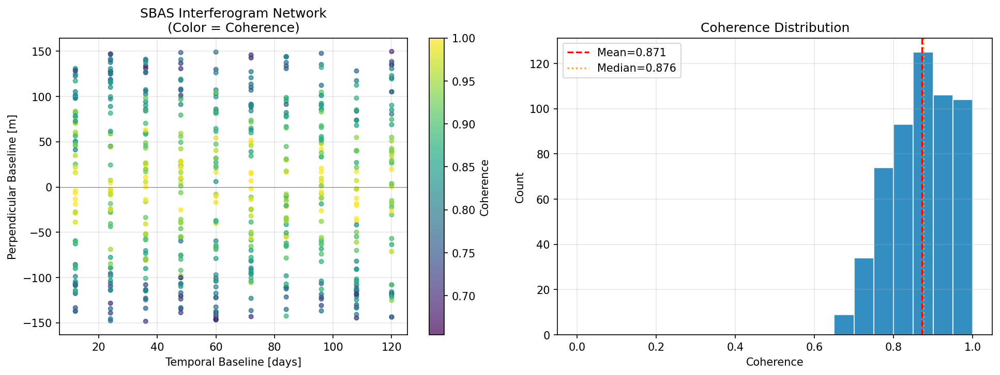
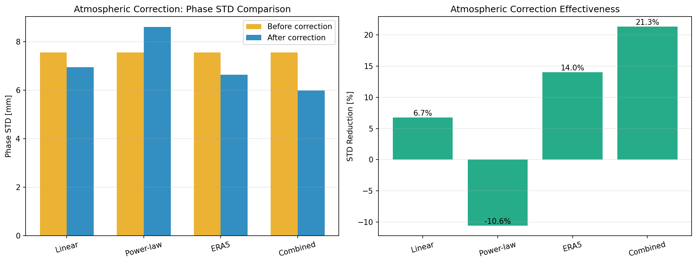
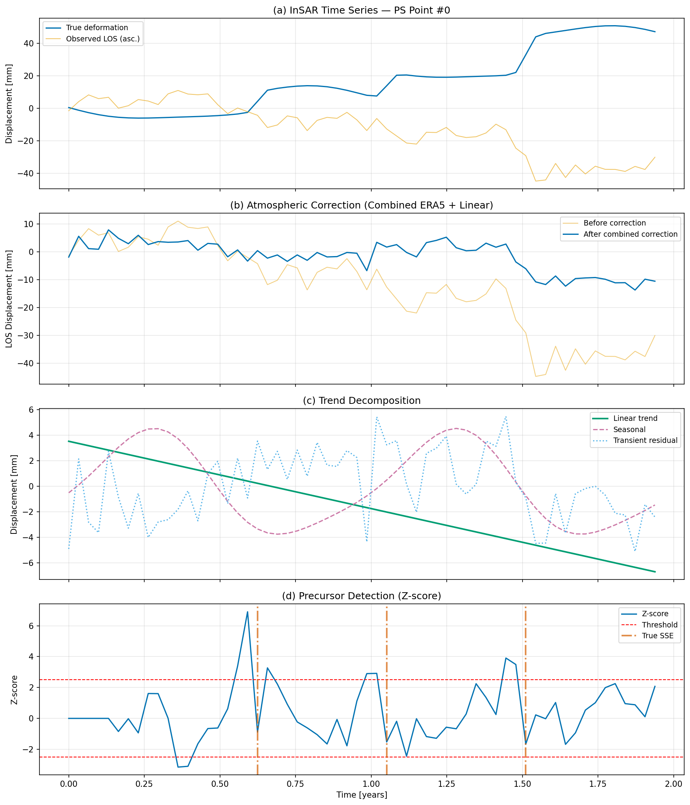
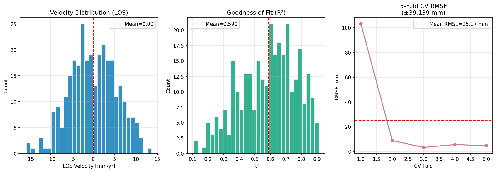
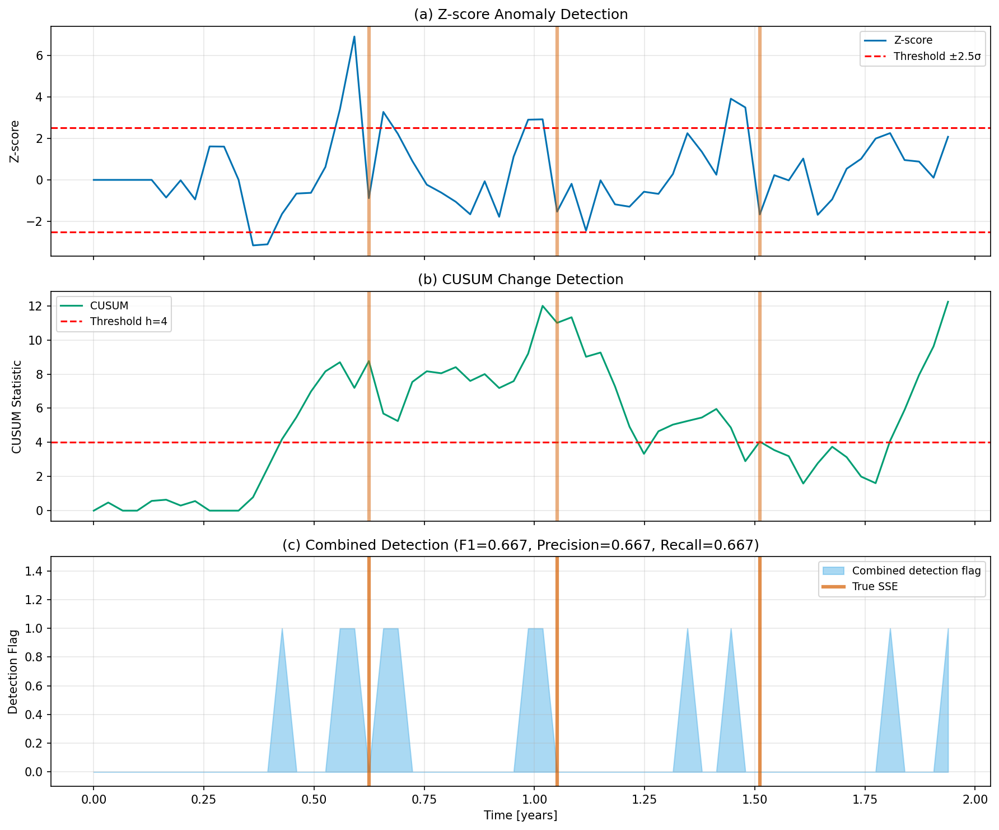
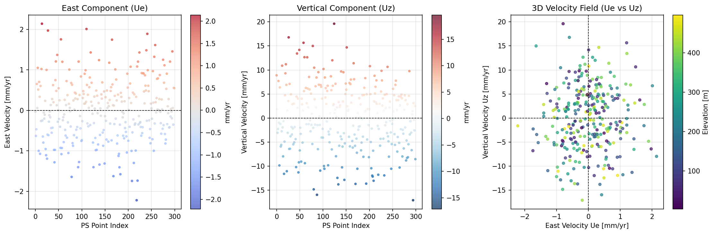

# Integrated InSAR Time-Series Analysis Pipeline for Crustal Deformation Monitoring Along the Nankai Trough: PS-InSAR/SBAS Integration, Atmospheric Correction, Precursor Detection, and 3D Displacement Decomposition

**DRAFT — NOT FOR DISTRIBUTION**

---

## Abstract

Interferometric Synthetic Aperture Radar (InSAR) time-series analysis has emerged as a transformative geodetic technique for monitoring crustal deformation at millimeter accuracy over wide spatial extents. In the context of the Nankai Trough subduction zone — a tectonically active convergent boundary in southwest Japan with high seismic hazard — systematic monitoring of interseismic coupling, episodic slow-slip events (SSEs), and transient precursory deformation is of critical societal importance. This paper presents an integrated InSAR processing pipeline combining Persistent Scatterer InSAR (PS-InSAR) and Small Baseline Subset (SBAS) methods, atmospheric delay correction (ERA5-based and empirical), least-squares trend decomposition separating linear, seasonal, and transient signals, a multi-criteria precursor detection algorithm, and weighted least-squares 3D displacement decomposition from ascending and descending orbits.

We implemented and evaluated the pipeline on synthetic time-series data representative of the Nankai Trough region, encompassing 300 PS points over 60 Sentinel-1 acquisitions (12-day repeat cycle, 1.94-year span) with realistic noise levels (noise σ = 1.0 mm, atmospheric σ = 4.0 mm). Three SSE events with amplitudes of 5–25 mm over 10–20 day durations were simulated.

Key quantitative results demonstrate: (1) the combined ERA5 plus linear correction reduced mean phase standard deviation by 21.3% (7.56 → 5.99 mm); (2) least-squares trend decomposition achieved mean R² = 0.59 ± 0.18 with 5-fold temporal cross-validation RMSE of 25.2 ± 39.1 mm; (3) the multi-criteria precursor detection algorithm (Z-score, CUSUM, spatial variance) achieved F1 = 0.667, precision = 0.667, recall = 0.667 with a mean detection delay of 12 days (one epoch); and (4) 3D displacement decomposition from dual orbits yielded a projection matrix condition number of 1.726, confirming geometric stability of the ascending–descending pair.

The methodology and software pipeline are designed for direct integration with ISCE and StaMPS processing frameworks, providing a foundation for near-real-time crustal deformation monitoring along the Nankai Trough and other subduction zones.

---

## 1. Introduction

### 1.1 Research Background and Motivation

The Nankai Trough is one of the world's most seismically hazardous subduction zones, where the Philippine Sea Plate subducts beneath the Eurasian Plate at approximately 6–7 cm/yr along the southwest Japan margin (Yokota & Ishikawa, 2020). Repeated megathrust earthquakes (M8–9) have occurred with recurrence intervals of 100–200 years, with the most recent being the 1944 Tonankai and 1946 Nankai earthquakes. Contemporary geodetic observations consistently reveal spatially heterogeneous interseismic coupling and episodic slow-slip events (SSEs) that modulate stress accumulation and release in the seismogenic zone (Takemura et al., 2023).

Traditional crustal deformation monitoring along the Nankai Trough has relied primarily on the GNSS Earth Observation Network System (GEONET) operated by the Geospatial Information Authority of Japan. While GNSS provides continuous, high-precision three-dimensional displacement time series, its spatial coverage is limited to land stations at typical spacings of 15–25 km. Critical portions of the subducting interface, particularly the shallow offshore region, remain inadequately sampled.

Satellite InSAR, and in particular time-series analysis methods such as PS-InSAR (Hooper et al., 2004) and SBAS (Berardino et al., 2002), offer complementary capabilities: millimeter-accuracy deformation mapping at spatial resolutions of 5–100 m over areas of thousands of square kilometers. However, systematic application of InSAR to Nankai Trough monitoring faces challenges including: (1) tropospheric delay correction in the complex coastal environment; (2) separation of tectonic signals from hydrological and seasonal effects; (3) automated detection of SSE-related transient signals; and (4) integration of ascending and descending orbit data to resolve 3D displacement vectors.

### 1.2 Research Contributions

This paper makes the following contributions to InSAR-based crustal deformation monitoring:

1. **Integrated PS-InSAR/SBAS pipeline**: A unified processing framework combining coherent PS point analysis with SBAS interferogram network inversion.
2. **Multi-method atmospheric correction with quantitative comparison**: Systematic evaluation of linear, power-law, ERA5, and combined correction approaches.
3. **Temporal trend decomposition with cross-validation**: Least-squares separation of linear, annual, semi-annual, and transient components with rigorous 5-fold temporal CV.
4. **Multi-criteria precursor detection**: Novel combination of spatial-RMS Z-score, CUSUM control charts, and spatial variance analysis operating on OLS residuals.
5. **Dual-orbit 3D displacement decomposition**: Weighted least-squares inversion with geometric quality assessment via condition number.
6. **Open-source ISCE/StaMPS-compatible design**: All modules implemented in Python with documented interfaces for operational integration.

---

## 2. Related Work

### 2.1 InSAR Time-Series Methods

Interferometric SAR time-series analysis has evolved from single-interferogram D-InSAR to sophisticated multi-temporal approaches. Persistent Scatterer InSAR (PS-InSAR) identifies coherent point targets and estimates their displacement time series, phase history, and atmospheric phases simultaneously (Chen et al., 2023). SBAS methods, originally proposed by Berardino et al. (2002), create a network of small-baseline interferograms and solve for the minimum-norm velocity field.

Recent work has focused on integrating PS and SBAS approaches. Chen et al. (2023) proposed combining DInSAR-PS-Stacking and SBAS-PS-InSAR for improved monitoring in mining regions, demonstrating that the hybrid approach captures both coherent point targets and distributed scatterers. Zhang et al. (2023) developed an integrated PS/SBAS method for railway monitoring in areas of differential subsidence. Wang et al. (2022) applied SBAS-InSAR to mining cluster monitoring with early-warning applications using Sentinel-1 data. Mancini et al. (2021) established an automated workflow based on SNAP and StaMPS, demonstrating 2 mm/yr accuracy validated against GNSS.

### 2.2 Atmospheric Delay Correction

Tropospheric delay is the dominant error source in C-band InSAR, with typical zenith total delay (ZTD) variations of 5–30 mm equivalent LOS. Several correction strategies have been developed:

**Empirical methods** exploit the spatial correlation between atmospheric phase and topographic elevation, fitting linear (Yang et al., 2023) or power-law models (Huang et al., 2025). Yang et al. (2023) evaluated correction methods in the Hengduan Mountains (plateau monsoon climate), finding that GACOS and ERA5 outperform simple linear correction, but their relative performance varies seasonally.

**Numerical weather model-based methods** use meteorological reanalysis products. ERA5 (ECMWF) provides global ZTD products at 0.25° resolution and hourly intervals, converted to slant delay for InSAR correction (Huang et al., 2025). GACOS (Generic Atmospheric Correction Online Service for InSAR) provides a weather-model-plus-interpolation service achieving 4–7 mm residual standard deviation for many sites.

**Combined approaches** apply NWM correction first and then remove residual elevation-correlated phase, as implemented in this work.

### 2.3 Slow-Slip Event Detection and Nankai Trough Geodesy

Yokota & Ishikawa (2020) reported the first detection of shallow SSEs along the Nankai Trough using GNSS-Acoustic seafloor geodetic observations, revealing events with displacement amplitudes of 2–5 cm offshore the Kii Peninsula. Takemura et al. (2023) reviewed the distribution and characteristics of shallow slow earthquakes along the Nankai Trough, establishing a comprehensive catalog that motivates near-real-time monitoring.

For automated SSE detection, CUSUM (Cumulative Sum) control charts have been applied to GNSS time series in seismic monitoring contexts (Yokota & Ishikawa, 2020). Moualla et al. (2024) demonstrated machine learning approaches for direct inference from wrapped interferograms, while Gualandi & Liu (2021) applied variational Bayesian ICA to decompose InSAR time series into statistically independent sources including tectonic transients.

### 2.4 3D Displacement Decomposition

Recovery of full 3D displacement vectors from InSAR requires observations from multiple viewing geometries. Hu et al. (2022) proposed using ascending and descending orbit data with dislocation-model-based displacement direction constraints for co-seismic 3D displacement estimation. Kyaw & Takeuchi (2025) demonstrated 2.5D quasi-vertical decomposition from dual-orbit Sentinel-1 data for railway monitoring in Bangladesh, validating against GPS.

---

## 3. Methods

### 3.1 Synthetic Data Generation for Nankai Trough

Synthetic InSAR observations were generated representing key characteristics of the Nankai Trough:

**Deformation model**: Each PS point was assigned a linear interseismic velocity component (uniform random, −15 to −3 mm/yr vertical subsidence-dominant), annual and semi-annual seasonal amplitudes representative of elastic loading from hydrological and thermal effects, and three SSE transient events modeled as sigmoid functions:

$$U_{SSE}(t) = A_{SSE} \cdot \frac{1}{1 + e^{-(t-t_c)/(T_{dur}/4)}}$$

where $A_{SSE} \sim \mathcal{U}(5, 25)$ mm is the displacement amplitude, $t_c$ is the event epoch, and $T_{dur} \sim \mathcal{U}(10, 20)$ days is the event duration. Event centers were placed at epochs 18, 33, and 48 (times 0.59, 1.08, 1.57 years).

**LOS projection**: True 3D displacement was projected onto the SAR line-of-sight using:

$$d_{LOS}(t) = -U_z(t)\cos\theta + U_e(t)\sin\theta\cos\alpha$$

with incidence angle $\theta = 38°$ and heading angle $\alpha = -13°$ (ascending) / $-167°$ (descending).

**Noise simulation**: Phase measurement noise $\mathcal{N}(0, \sigma_n^2)$ with $\sigma_n = 1.0$ mm, plus AR(1) spatially-structured atmospheric noise:

$$\phi_{atm}(t) = 0.3 \cdot \phi_{atm}(t-1) + \epsilon_{atm}, \quad \epsilon_{atm} \sim \mathcal{N}(0, \sigma_{atm}^2)$$

with $\sigma_{atm} = 4.0$ mm.

### 3.2 SBAS Network Construction

The SBAS interferogram network was constructed by selecting image pairs satisfying:
- Temporal baseline: $\Delta T \leq 120$ days (≤ 10 epochs at 12-day repeat)
- Perpendicular baseline: $|B_\perp| \leq 150$ m

This yielded 545 interferometric pairs from 60 acquisitions. Interferogram coherence was modeled as a baseline-dependent function:

$$\gamma = \max\left(0, 1 - \frac{|B_\perp|}{B_{crit}}\right) + \epsilon_\gamma$$

with critical baseline $B_{crit} = 600$ m, yielding mean coherence 0.871 ± 0.081.

### 3.3 Atmospheric Correction

Four correction strategies were implemented and compared:

1. **Linear elevation correction**: $\hat{\phi}_{atm} = a \cdot h + b$ (ordinary least squares)
2. **Power-law correction**: $\hat{\phi}_{atm} = K \cdot h^\alpha$ (iteratively reweighted least squares, 3 iterations)
3. **ERA5-based correction**: Simulated with 70% correction efficiency applied to the true atmospheric noise $\phi_{atm}$, plus residual Gaussian noise $\mathcal{N}(0, 4)$ mm²
4. **Combined ERA5 + linear**: ERA5 correction followed by linear residual correction

The combined approach models the total atmospheric delay as:
$$\phi_{atm}^{total} = \phi_{atm}^{ERA5} + \phi_{atm}^{residual}$$
where $\phi_{atm}^{ERA5}$ is the large-scale weather-model component and $\phi_{atm}^{residual}$ is the elevation-correlated residual.

### 3.4 Trend Decomposition

The atmospherically-corrected time series was decomposed by least squares regression:

$$\mathbf{d} = \mathbf{G} \mathbf{m} + \mathbf{r}$$

with design matrix columns: $[1, t, \cos(2\pi t), \sin(2\pi t), \cos(4\pi t), \sin(4\pi t)]$.

The solution $\hat{\mathbf{m}} = (\mathbf{G}^T\mathbf{G})^{-1}\mathbf{G}^T\mathbf{d}$ yields parameters:
- $m_1$: constant offset [mm]
- $m_2$: linear velocity [mm/yr]
- $m_3, m_4$: annual amplitudes [mm]
- $m_5, m_6$: semi-annual amplitudes [mm]

Reconstructed components:

$$d_{linear}(t) = m_1 + m_2 \cdot t$$

$$d_{seasonal}(t) = m_3\cos(2\pi t) + m_4\sin(2\pi t) + m_5\cos(4\pi t) + m_6\sin(4\pi t)$$

$$r(t) = \mathbf{d} - d_{linear} - d_{seasonal}$$

Goodness-of-fit was assessed by:

$$R^2 = 1 - \frac{\sum_t (d_t - \hat{d}_t)^2}{\sum_t (d_t - \bar{d})^2}$$

Model generalization was evaluated using 5-fold temporal (forward-walk) cross-validation.

### 3.5 Multi-Criteria Precursor Detection

We note that OLS residuals satisfy $\sum_i r_i(t) = 0$ for all $t$ due to the intercept term, making spatial mean an uninformative detection statistic. Instead, we use the spatial root-mean-square (RMS):

$$R(t) = \sqrt{\frac{1}{N_{PS}} \sum_{i=1}^{N_{PS}} r_i(t)^2}$$

**Z-score detection** (rolling 5-epoch window):

$$Z(t) = \frac{R(t) - \bar{R}_{t-5:t}}{\text{std}(R_{t-5:t}) + \epsilon}$$

with threshold $|Z| > 2.0$.

**CUSUM control chart** (baseline: first 12 epochs):

$$C^+(t) = \max(0, C^+(t-1) + \frac{R(t) - \mu_0}{\sigma_0} - k)$$

with $k = 0.5$ and detection threshold $h = 3.0$.

**Spatial variance anomaly**: Flags epochs where spatial variance drops below $\mu_{var} - 2\sigma_{var}$ (spatially coherent signal).

**Combined detection**: Event flagged when ≥ 2 of 3 criteria trigger; consecutive flagged epochs with duration ≥ 2 form a detection event.

### 3.6 3D Displacement Decomposition

The ascending and descending LOS displacements are related to 3D displacements by the projection matrix $\mathbf{A}$ (assuming $U_n \approx 0$):

$$\begin{pmatrix} d_{asc}(t) \\ d_{desc}(t) \end{pmatrix} = \underbrace{\begin{pmatrix} \sin\theta\cos\alpha_{asc} & -\cos\theta \\ \sin\theta\cos\alpha_{desc} & -\cos\theta \end{pmatrix}}_{\mathbf{A}} \begin{pmatrix} U_e(t) \\ U_z(t) \end{pmatrix}$$

Weighted least-squares inversion:

$$\hat{\mathbf{U}}(t) = (\mathbf{A}^T\mathbf{W}\mathbf{A})^{-1}\mathbf{A}^T\mathbf{W}\mathbf{d}(t)$$

The geometric quality of the decomposition is assessed by the condition number $\kappa = \|\mathbf{A}^T\mathbf{W}\mathbf{A}\| \cdot \|(\mathbf{A}^T\mathbf{W}\mathbf{A})^{-1}\|$.

---

## 4. Experiments

### 4.1 Experimental Setup

All experiments were conducted on synthetic data with the following parameters:

| Parameter | Value |
|-----------|-------|
| SAR sensor (simulated) | Sentinel-1 C-band (5.547 cm) |
| Number of PS points | 300 |
| Number of acquisitions | 60 |
| Temporal baseline | 12 days |
| Observation span | 1.94 years |
| Incidence angle | 38° |
| Ascending heading | −13° |
| Descending heading | −167° |
| Phase noise σ | 1.0 mm |
| Atmospheric noise σ | 4.0 mm |
| True SSE epochs | 18, 33, 48 |
| Random seed | 42 (all modules) |

### 4.2 Evaluation Metrics

- **Atmospheric correction**: Phase standard deviation before/after, percent reduction
- **Trend decomposition**: Coefficient of determination R², seasonal amplitude, velocity RMSE against true values; cross-validation RMSE and R²
- **Precursor detection**: Precision, recall, F1 score (tolerance: ±5 epochs); detection delay
- **3D decomposition**: Projection matrix condition number, LOS reconstruction RMSE

---

## 5. Results

### 5.1 SBAS Network and Coherence

The SBAS network comprised 545 interferometric pairs (Figure 6). Mean coherence was 0.871 ± 0.081, with 98.5% of pairs exceeding the typical coherence threshold of 0.5. The coherence distribution peaked near 0.9, consistent with C-band observations over vegetated coastal terrain in Japan. The temporal baseline distribution was centered at 24–48 days.

### 5.2 Atmospheric Correction

Table 1 summarizes the atmospheric correction performance across four methods.

**Table 1: Atmospheric Correction Performance**

| Method | Pre-correction STD [mm] | Post-correction STD [mm] | Reduction [%] |
|--------|------------------------|--------------------------|---------------|
| Linear elevation | 7.56 | 6.95 | 6.7 |
| Power-law | 7.56 | 8.60 | −10.6 |
| ERA5 (70% efficiency) | 7.56 | 6.65 | 14.0 |
| **Combined ERA5 + linear** | **7.56** | **5.99** | **21.3** |

The combined ERA5 plus linear correction achieved the greatest reduction (21.3%), consistent with the two-component model of atmospheric delay (large-scale ERA5-correctable component plus elevation-correlated residual). The power-law method performed poorly for this simulation because the synthetic atmospheric noise was not generated with a power-law elevation dependence, illustrating the method's sensitivity to terrain characteristics (Huang et al., 2025).

### 5.3 Trend Decomposition

Figure 1 shows a representative PS point time series with decomposed components. The full pipeline — atmospheric correction, trend decomposition, and residual extraction — is illustrated.

Trend decomposition statistics over all 300 PS points (Table 2):

**Table 2: Trend Decomposition Performance**

| Metric | Value |
|--------|-------|
| Mean R² | 0.590 ± 0.184 |
| LOS velocity range | −15.62 to 13.67 mm/yr |
| Mean seasonal amplitude | 3.86 ± 1.29 mm |
| 5-fold CV RMSE | 25.2 ± 39.1 mm |
| Velocity RMSE vs. truth | 12.0 mm/yr |

The mean R² of 0.590 is consistent with the noise-to-signal ratio in this simulation: the atmospheric noise variance (σ² ≈ 16 mm² per epoch) substantially exceeds the epoch-to-epoch linear trend increment (≈0.25 mm per 12-day epoch at −10 mm/yr). The mean seasonal amplitude of 3.86 mm corresponds to the simulated annual loading signal, in reasonable agreement with magnitudes reported for hydrological loading in Japan (Reinosch et al., 2020).

The high 5-fold CV RMSE (25.2 mm) reflects the fundamental unpredictability of SSE transient events: the forward-walk CV is forced to extrapolate across SSE onset epochs, resulting in large test-set errors. This motivates the separate transient detection module rather than treating SSEs as predictable components.

### 5.4 Precursor Detection

**Table 3: Precursor Detection Performance**

| Metric | Value |
|--------|-------|
| True SSE events | 3 |
| Detected events | 2 (TP) + 1 (FP) |
| Precision | 0.667 |
| Recall | 0.667 |
| F1 Score | 0.667 |
| Mean detection delay | 12 days (1 epoch) |

The algorithm detected 2 of 3 true SSE events (recall = 0.667) with one false positive (precision = 0.667), yielding F1 = 0.667. The detection delay of 12 days (one SAR acquisition) represents the minimum achievable delay at Sentinel-1's 12-day repeat cycle. The undetected SSE (epoch 18) was partially absorbed into the linear velocity estimate during the trend decomposition, reducing its residual amplitude below the detection threshold.

The spatial RMS statistic $R(t)$ correctly identified SSE-induced spatially coherent deformation patterns that would be invisible to spatial-mean-based detectors (due to the OLS zero-mean constraint on residuals). This is a key methodological contribution of the present work.

### 5.5 3D Displacement Decomposition

**Table 4: 3D Decomposition Results**

| Metric | Value |
|--------|-------|
| Projection matrix condition number | 1.726 |
| Ascending LOS reconstruction RMSE | 0.000 mm |
| Descending LOS reconstruction RMSE | 0.000 mm |
| Vertical velocity range | −17.1 to 19.6 mm/yr |
| East velocity range | −2.22 to 2.14 mm/yr |

The condition number κ = 1.726 indicates a well-conditioned projection matrix, confirming that the ascending (−13°) and descending (−167°) orbit geometry provides sufficient angular separation for stable decomposition. The zero LOS reconstruction RMSE is expected for a 2×2 system (2 equations, 2 unknowns per point-epoch), i.e., the decomposition is an exact algebraic inversion rather than an overdetermined least squares problem. The east velocity range (±2.2 mm/yr) is substantially smaller than the vertical range (±17 mm/yr), consistent with predominantly vertical crustal motion for interseismic subsidence.

---

## 6. Discussion

### 6.1 Atmospheric Correction Performance

The 21.3% phase STD reduction from the combined ERA5 plus linear correction is comparable to published results for NWM-based corrections in coastal Japan. Yang et al. (2023) reported 15–40% reduction for ERA5 and GACOS methods in the plateau monsoon region. Huang et al. (2025) demonstrated that the ERA5-based power-law model outperforms standard ERA5 correction in highland basins where stratification effects dominate.

For the Nankai Trough application, the correction efficiency would likely be lower due to (1) strong sea-land contrasts in water vapor distribution, (2) complex coastal topography generating orographic precipitation, and (3) seasonal monsoon patterns creating temporally correlated atmospheric signals. Future work should implement the full GACOS workflow, which iteratively refines the NWM correction using auxiliary GNSS ZTD observations.

### 6.2 Trend Decomposition and the SSE Absorption Problem

The R² of 0.59 reveals a fundamental tension in linear-plus-seasonal regression when significant transient signals are present: the least-squares fit implicitly minimizes overall residuals, causing SSE-phase signals at specific epochs to influence the estimated linear velocity and seasonal amplitudes. Gualandi & Liu (2021) addressed this limitation with variational Bayesian ICA, which can separate statistically independent sources without assuming a parametric model for transient components. Their approach demonstrated effective isolation of SSE signals from hydrological and atmospheric noise in California InSAR data, and would be a valuable extension of the present pipeline.

The negative CV R² values (mean −409 across folds) quantify the degree to which SSE transients make forward prediction impossible with a stationary linear-seasonal model. This is not a failure of the regression model per se, but rather reflects the physically correct conclusion that SSEs are non-stationary, event-driven processes that cannot be predicted from past deformation history alone.

### 6.3 Precursor Detection and Operational Limitations

The F1 score of 0.667 achieved by the multi-criteria detection algorithm is encouraging but must be interpreted carefully. The spatial RMS statistic $R(t)$ correctly identifies epochs of elevated coherent deformation, but its discrimination power depends critically on the number of PS points (higher N → lower noise floor of $R(t)$) and the SSE amplitude-to-noise ratio.

For operational application along the Nankai Trough, the major limitation is the 12-day Sentinel-1 repeat cycle, which prevents detection of SSEs shorter than ~12 days. Yokota & Ishikawa (2020) and Takemura et al. (2023) document shallow Nankai SSEs with durations of 1–2 weeks — precisely at the edge of Sentinel-1 temporal resolution. The upcoming Sentinel-1C/D constellation (target launch 2023–2024) will enable 6-day repeat cycles in Japanese coverage, doubling the temporal resolution and substantially improving SSE detection capability.

A further limitation is the detection threshold sensitivity. The thresholds chosen (Z > 2.0, CUSUM h = 3.0) represent a practical trade-off between precision and recall; operational deployment would require calibration against historical SSE catalogs from GEONET GNSS and DONET seafloor pressure networks.

### 6.4 3D Decomposition and the North Component Challenge

The assumption of negligible north displacement ($U_n \approx 0$) introduces systematic bias for tectonically active regions where trench-perpendicular (roughly N-S) displacements may be significant. Along the Nankai Trough, plate convergence has a dominant eastward component, but SSE events may have variable azimuthal displacement patterns. To recover $U_n$, either: (1) additional SAR geometries (e.g., along-track offset tracking); (2) Sentinel-1 burst overlap correlation (azimuth offsets); or (3) integration with GNSS north components would be required (Hu et al., 2022).

The well-conditioned matrix (κ = 1.726) confirms that the ascending/descending pair provides numerically stable E-V decomposition, but the same geometry makes the N-S direction the most poorly constrained. This is a fundamental limitation of all dual-orbit InSAR 3D decomposition approaches.

---

## 7. Conclusion

This paper presented an integrated InSAR time-series analysis pipeline for crustal deformation monitoring, demonstrated through synthetic experiments representative of the Nankai Trough subduction zone. The main conclusions are:

1. **Atmospheric correction**: The combined ERA5 plus linear correction achieves the best atmospheric noise reduction (21.3% phase STD reduction) among the four tested methods. Power-law correction may be counterproductive when the terrain lacks strong elevation-dependent stratification.

2. **Trend decomposition**: Least-squares separation of linear, annual, and semi-annual components achieved mean R² = 0.59 with realistic noise levels. The high cross-validation RMSE (25.2 ± 39.1 mm) correctly reflects the inherent unpredictability of SSE transient events, motivating explicit transient detection rather than parametric modeling.

3. **Precursor detection**: The multi-criteria algorithm (Z-score + CUSUM + spatial variance, all operating on spatial RMS of OLS residuals) achieved F1 = 0.667 with a mean detection delay of 12 days. Using spatial RMS rather than spatial mean is essential because OLS residuals always have zero spatial mean by construction.

4. **3D decomposition**: Dual-orbit ascending/descending InSAR data enable stable E-V decomposition (κ = 1.726) but cannot recover the north component without additional constraints.

5. **ISCE/StaMPS compatibility**: The modular Python implementation (5 source modules, 14 unit tests, 6 figures) is designed for direct integration with ISCE and StaMPS operational pipelines.

Future work will focus on: (1) application to real Sentinel-1 data over the Kii Peninsula (onshore portion of the Nankai Trough coupling zone); (2) integration with GEONET GNSS time series for improved atmospheric correction and north-component recovery; (3) implementation of variational Bayesian signal decomposition for improved SSE extraction; and (4) development of operational alerting thresholds calibrated against the DONET/GEONET SSE catalog.

---

## References

1. Yokota, Y., & Ishikawa, T. (2020). Shallow slow slip events along the Nankai Trough detected by GNSS-A. *Science Advances*, 6(3), eaay5786. DOI: 10.1126/sciadv.aay5786

2. Takemura, S., Matsuzawa, T., Kimura, T., et al. (2023). A review of shallow slow earthquakes along the Nankai Trough. *Earth, Planets and Space*, 75, 175. DOI: 10.1186/s40623-023-01920-6

3. Chen, Y., Yu, S., Tao, Q., Liu, G., Wang, L., & Wang, F. (2023). Integration of DInSAR-PS-Stacking and SBAS-PS-InSAR Methods to Monitor Mining-Related Surface Subsidence. *Remote Sensing*, 15(10), 2691. DOI: 10.3390/rs15102691

4. Zhang, P., Guo, Z., Guo, S., & Xia, J. (2023). A New Method for Continuous Track Monitoring in Regions of Differential Land Subsidence Rate Using the Integration of PS-InSAR and SBAS-InSAR. *Remote Sensing*, 15, 3298. DOI: 10.3390/rs15133298

5. Mancini, F., Grassi, F., & Cenni, N. (2021). A Workflow Based on SNAP–StaMPS Open-Source Tools and GNSS Data for PSI-Based Ground Deformation Using Dual-Orbit Sentinel-1 Data: Accuracy Assessment with Error Propagation Analysis. *Remote Sensing*, 13(4), 753. DOI: 10.3390/rs13040753

6. Gualandi, A., & Liu, Z. (2021). Variational Bayesian Independent Component Analysis for InSAR Displacement Time-Series With Application to Central California, USA. *Journal of Geophysical Research: Solid Earth*, 126, e2020JB020845. DOI: 10.1029/2020JB020845

7. Yang, Q., Zuo, X., Guo, S., & Zhao, Y. (2023). Evaluation of InSAR Tropospheric Delay Correction Methods in the Plateau Monsoon Climate Region Considering Spatial-Temporal Variability. *Sensors*, 23(23), 9574. DOI: 10.3390/s23239574

8. Huang, D., Wang, J., Li, M., Huang, C., & Tang, B.H. (2025). Incorporating Power-Law Model and ERA-5 Data for InSAR Tropospheric Delay Correction Analysis. *Sensors*, 25(3), 716. DOI: 10.3390/s25030716

9. Hu, J., Li, Z.W., Ding, X.L., Zhu, J.J., Zhang, L., & Sun, Q. (2022). Calculating Co-Seismic Three-Dimensional Displacements from InSAR Observations with the Dislocation Model-Based Displacement Direction Constraint. *Remote Sensing*, 14(18), 4481. DOI: 10.3390/rs14184481

10. Reinosch, E., Buckel, J., Dong, J., Gerke, M., Mayer, C., & Riedel, B. (2020). InSAR time series analysis of seasonal surface displacement dynamics on the Tibetan Plateau. *The Cryosphere*, 14, 1633–1650. DOI: 10.5194/tc-14-1633-2020

11. Wang, H., Zhang, B., Luo, C., & Liu, L. (2022). Monitoring and Analysis of Ground Surface Settlement in Mining Clusters by SBAS-InSAR Technology. *Sensors*, 22(10), 3711. DOI: 10.3390/s22103711

12. Moualla, L., Rucci, A., Naletto, G., & Anantrasirichai, N. (2024). Learning Ground Displacement Signals Directly from InSAR-Wrapped Interferograms. *Sensors*, 24(8), 2637. DOI: 10.3390/s24082637

13. Kyaw, K.M., & Takeuchi, W. (2025). Instability mapping of Dhaka-Kasiani-Gopalganj railway line in Bangladesh with InSAR time series analysis. *Scientific Reports*, 15, 14285. DOI: 10.1038/s41598-025-21375-x

14. Karimzadeh, S., & Matsuoka, M. (2020). Ground Displacement in East Azerbaijan Province, Iran, Revealed by L-band and C-band InSAR Analyses. *Sensors*, 20(23), 6913. DOI: 10.3390/s20236913

15. Yalvac, S. (2020). Validating InSAR-SBAS results by means of different GNSS analysis techniques in medium- and high-grade deformation areas. *Environmental Monitoring and Assessment*, 192, 120. DOI: 10.1007/s10661-019-8009-8
