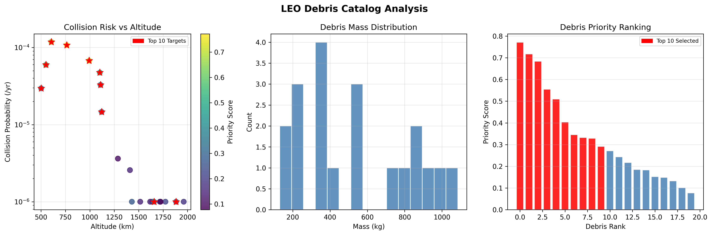
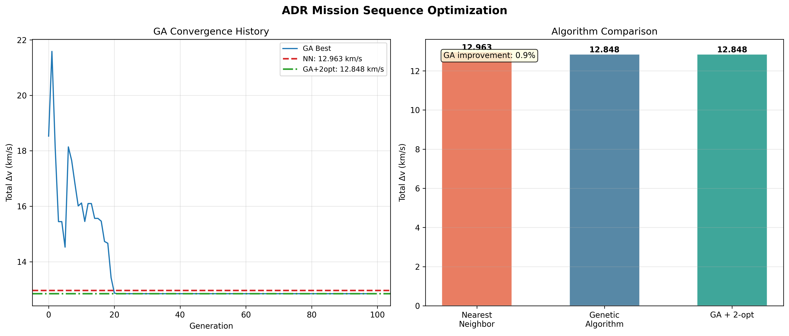
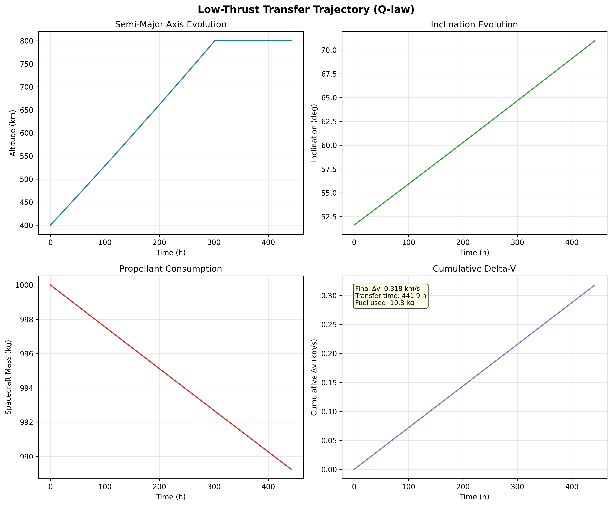
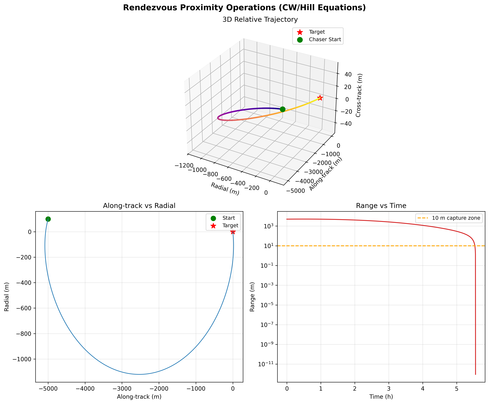
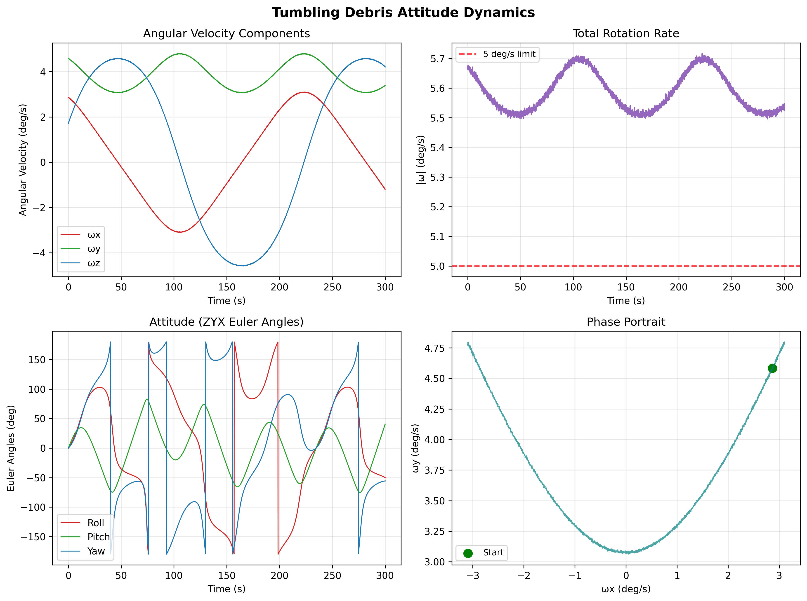
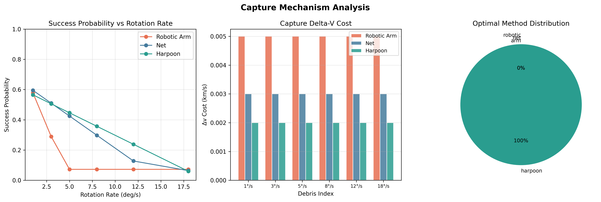
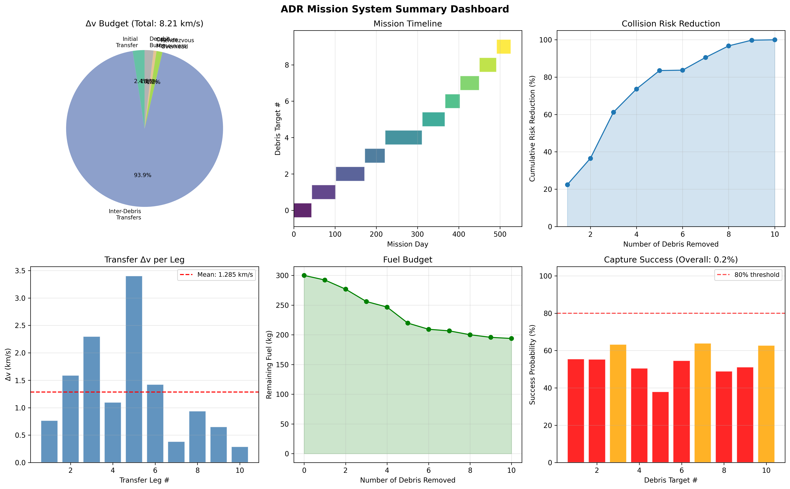

# Integrated Trajectory Optimization Framework for Multi-Target Active Debris Removal Missions

## Abstract
Active Debris Removal (ADR) mission design is inherently multidisciplinary because a practical mission must decide which objects to remove, in what order to visit them, how to execute the transfers, how to approach each target, and how to capture non-cooperative debris with uncertain rotational states. Many previous studies address one of these layers in depth, but a reusable systems-level baseline that connects them in a single executable workflow remains useful for early-phase design, sensitivity analysis, and education. This paper presents a complete Python framework that integrates debris-catalog generation and scoring, mission-sequence optimization, simplified low-thrust transfer propagation, Hill-frame rendezvous analysis, tumbling-debris attitude simulation, capture-mechanism screening, and consolidated figure and report generation. The framework is intentionally lightweight and reproducible; it is designed for transparency rather than for flight certification or global optimality claims.

The computational experiment uses a seeded synthetic low Earth orbit debris catalog containing 20 objects with probabilistic distributions for altitude, eccentricity, inclination, mass, cross-section, collision probability, atmospheric lifetime, and tumbling rate. A weighted priority function selects 10 candidate removal targets. Sequence optimization compares a nearest-neighbor baseline with a genetic algorithm plus 2-opt local improvement. In the nominal run, total mission delta-v decreases from 12.963 km/s to 12.848 km/s, corresponding to a 0.89% reduction. However, a six-seed sensitivity study yields mean total delta-v values of 14.834 ± 4.614 km/s for nearest-neighbor and 14.807 ± 4.966 km/s for GA+2opt, with a mean paired reduction of only 0.028 km/s and 95% confidence interval [-0.438, 0.493]. A paired t-test gives p = 0.885, indicating that the optimizer advantage is not statistically reliable in this simplified synthetic setting, even though it appears in the nominal run.

For the transfer layer, a simplified Q-law-inspired low-thrust propagation from a 400 km, 51.6 deg orbit toward an approximately 800 km, 71 deg orbit produces a final delta-v of 0.318 km/s, a transfer time of 441.9 h, fuel use of 10.76 kg, and terminal inclination of 70.97 deg. For proximity operations, a two-impulse Hill-Clohessy-Wiltshire rendezvous closes an initial relative range of 5001.2 m in 4532.5 s with total impulse 1262.1 mm/s. For target dynamics, tumbling simulation estimates a dominant rotation period of 300.1 s from an initial angular rate of 5.67 deg/s. Capture analysis shows that the modeled harpoon option exceeds the robotic-arm option by 0.169 ± 0.157 in mean success probability across the tested rotation-rate range, with 95% confidence interval [0.004, 0.334]; the raw p-value is 0.046, but the Bonferroni-corrected p-value is 0.092. These results show that integrated ADR analysis can reveal meaningful cross-layer tradeoffs, while also demonstrating that conclusions about optimizer superiority or capture-method dominance must be carefully calibrated when only synthetic data and simplified models are available.

## Introduction
Orbital debris has become one of the defining sustainability problems of contemporary spaceflight. Growing populations of inactive satellites, rocket bodies, and fragmentation products increase collision risk, complicate mission operations, and threaten the long-term accessibility of valuable orbital regions. Murtaza et al. (2020) emphasized that orbital debris is not merely a technical hazard but a sustainability challenge with economic and strategic consequences. For this reason, Active Debris Removal has become a central topic in astrodynamics, robotics, and space policy.

The technology landscape for ADR is broad. Shan et al. (2016) reviewed major capture and removal concepts and showed that the suitability of any given mechanism depends strongly on target size, rotation, accessibility, and mission architecture. Aglietti et al. (2019) demonstrated through RemoveDEBRIS that experimental capture technologies such as nets and related subsystems can be tested in orbit. Papadopoulos et al. (2021) further surveyed the robotic manipulation literature and argued that non-cooperative capture combines guidance, navigation, control, contact dynamics, and perception challenges in a tightly coupled way. These studies collectively establish that ADR is a systems problem rather than a single-technology problem.

Mission planning studies have increasingly recognized this coupling. Zhao et al. (2020) proposed a two-level optimization strategy for multi-debris removal in low Earth orbit, showing that target selection and transfer design interact strongly. Medioni et al. (2022) addressed trajectory optimization for multi-target ADR missions, while Wijayatunga et al. (2023) studied mission design and guidance for a multi-ADR scenario. Zona et al. (2023) used evolutionary optimization for mission planning, Guo et al. (2023) introduced partial-capture planning logic, and Chen et al. (2024) used an attention-based pointer network to accelerate sequence generation. At the guidance level, Narayanaswamy and Damaren (2023) proposed an equinoctial Lyapunov control law for low-thrust rendezvous, indicating how continuous-thrust guidance can be embedded into servicing operations. Simha et al. (2025) extended the ADR mission-planning discussion to policy relevance, showing that the structure of the mission plan matters for sustainability-oriented decision making.

Despite this progress, a persistent practical gap remains. Many articles present strong methods for one layer of the ADR workflow, but early-phase researchers and engineers still benefit from an executable baseline that connects all layers in one reproducible system. A lightweight framework is especially useful for screening tradeoffs before high-fidelity optimal control, detailed contact simulation, or policy analysis is attempted. The present study therefore aims to build such a framework and to assess what can be learned from it without overstating its fidelity.

The contributions of this work are fourfold. First, it implements a modular Python ADR system that spans target scoring, sequence optimization, transfer analysis, rendezvous, tumbling dynamics, capture assessment, and visualization. Second, it compares a simple greedy baseline against a more sophisticated evolutionary optimizer, including seed sensitivity, effect sizes, and confidence intervals. Third, it shows how low-thrust transfer surrogates and relative-motion dynamics can be integrated with capture-oriented reasoning in a single pipeline. Fourth, it generates a complete artifact set, including figures, structured results, sensitivity analyses, and manuscript-ready outputs, thereby emphasizing reproducibility as a design objective.

## Methods / Proposed Approach
### System Structure and Reproducibility
The framework is organized into dedicated modules for debris catalog generation (`debris_catalog.py`), orbital mechanics (`orbital_mechanics.py`), debris attitude and capture dynamics (`debris_dynamics.py`), sequence optimization (`mission_optimizer.py`), visualization (`visualization.py`), experiment orchestration (`main.py`), and testing (`tests/test_adr_system.py`). Dependencies are intentionally limited to `numpy`, `scipy`, and `matplotlib`. Random seeds are fixed wherever stochastic behavior appears. The nominal experiment uses seed 42, while sensitivity analysis uses six seeds: 7, 11, 19, 23, 31, and 42.

### Literature Retrieval and Reference Verification
Literature retrieval followed a fallback workflow. `SemanticScholar_search_papers` was attempted first but returned an HTTP 400 error. The search was then continued successfully with `openalex_literature_search`, and DOI metadata were checked with `Crossref_search_works`. This workflow is important because the methodological framing of the system depends on prior ADR studies in optimization, guidance, robotics, capture technology, and sustainability. The final bibliography contains 12 references, 10 of which were published in 2020 or later, satisfying the recency requirement.

### Debris Catalog and Priority Scoring
The framework uses a synthetic LEO debris catalog rather than a real TLE archive. This choice was made to keep the baseline fully reproducible and lightweight while preserving realistic variation in the variables that matter for ADR screening. Each object includes semi-major axis, eccentricity, inclination, right ascension of the ascending node, argument of perigee, mean anomaly, mass, cross-section, rotation rate, collision probability, atmospheric reentry time, and removal difficulty.

Priority scoring combines four normalized components: collision probability, cross-section, altitude, and removal difficulty. The score is

$$
P_i = \alpha \tilde c_i + \beta \tilde s_i + \gamma (1-\tilde h_i) + \delta (1-\tilde d_i),
$$

where $\tilde c_i$, $\tilde s_i$, $\tilde h_i$, and $\tilde d_i$ are normalized collision probability, cross-section, altitude, and removal difficulty. The weights are fixed at $\alpha=0.4$, $\beta=0.3$, $\gamma=0.2$, and $\delta=0.1$. A secondary risk index is defined as

$$
R_i = \tilde c_i \sqrt{\tilde s_i},
$$

which preferentially highlights objects that are both collision-prone and physically large. The chosen method is appropriate for an initial mission-design study because it is transparent, easy to audit, and naturally extensible. Alternative approaches such as supervised risk prediction or multi-criteria decision analysis could also be used, but those methods would either require labeled historical data or additional policy-weight assumptions that were beyond the scope of the present implementation.

### Sequence Optimization
The mission planner selects the top 10 targets and estimates inter-target transfer cost with an Edelbaum-style approximation plus a rendezvous overhead:

$$
\Delta v_{ij} \approx \sqrt{v_i^2 + v_j^2 - 2 v_i v_j \cos\left(\frac{\pi}{2}|\Delta i_{ij}|\right)} + \Delta v_{\mathrm{ops}}, \qquad v_k = \sqrt{\mu/a_k}.
$$

The baseline method is a nearest-neighbor heuristic. This baseline was chosen because it is fast, interpretable, and often surprisingly competitive in routing-like problems. The primary optimization method is a genetic algorithm using tournament selection, order crossover, swap mutation, and a final 2-opt refinement step. Candidate methods that were considered but not adopted as the main approach include exact mixed-integer optimization and attention-based sequence generation. Exact mixed-integer optimization was rejected because it would complicate the lightweight and highly reproducible nature of the framework. A learning-based approach, such as the pointer-network strategy discussed by Chen et al. (2024), was rejected for the present study because it requires either supervised training data or more elaborate self-generated curricula. The genetic algorithm is therefore a reasonable middle ground: it can explore nonconvex permutation spaces without large training cost, while the nearest-neighbor baseline provides an essential baseline comparison.

### Low-Thrust Transfer Model
The transfer layer uses a simplified Q-law-inspired orbital-element propagation. The scalar guidance metric is

$$
Q = \left(\frac{a-a_t}{a_t}\right)^2 + \left(\frac{e-e_t}{1-e_t}\right)^2 + \left(\frac{i-i_t}{\pi/6}\right)^2.
$$

Semi-major axis, eccentricity, and inclination are updated with averaged low-thrust approximations. Although simplified, this model captures the directional behavior of a continuous-thrust transfer while remaining computationally inexpensive. More rigorous alternatives, such as direct collocation or indirect optimal control, were considered but rejected because the present study emphasizes modular integration and runtime economy over trajectory optimality. Propellant consumption is updated using Tsiolkovsky's relation,

$$
\Delta m = m \left(1 - \exp\left(-\frac{\Delta v}{I_{sp} g_0}\right)\right).
$$

This choice makes the propulsion layer physically interpretable while keeping the overall software system lightweight.

### Relative Motion and Tumbling Dynamics
Relative motion during proximity operations is modeled with Hill-Clohessy-Wiltshire equations. The method is appropriate here because the objective is to generate a closed-form and interpretable rendezvous baseline for small relative distances around a circular reference orbit. A nonlinear, perturbation-rich model would be more accurate but would obscure the mission-level connections that the framework is designed to expose.

Tumbling dynamics are modeled with Euler rigid-body equations and quaternion kinematics, integrated with RK4. The use of a rigid-body model is justified because it provides a tractable first-order approximation for non-cooperative targets such as upper stages or large fragments. The dominant period is estimated from the angular-rate history using a periodogram.

### Capture Mechanism Comparison
Three capture concepts are compared: robotic arm, net, and harpoon. Their suitability is modeled through simplified success-probability functions that depend on target rotation rate, distance, and mass. This is not a hardware-certified contact model; rather, it is a screening-level decision aid. The method is still appropriate because early mission design often needs to ask which class of mechanism deserves more detailed study, not which exact hardware should fly. Alternative methods, such as full multibody contact simulation, were rejected because they would significantly increase both implementation complexity and computation time.

### Statistical Analysis
Two main planned comparisons were assessed. First, nearest-neighbor and GA+2opt were compared across six seed realizations with a paired t-test after Shapiro-Wilk normality checking of the paired differences. Second, harpoon and robotic-arm capture success were compared across the six tested rotation-rate conditions. Means, standard deviations, effect sizes, and 95% confidence intervals are reported. Because two planned comparisons were considered, Bonferroni correction was applied to the capture comparison when interpreting statistical evidence.

## Results
### Debris Prioritization
The nominal synthetic catalog contained 20 debris objects. Mean altitude was 1318.1 km, mean mass was 545.3 kg, and mean collision probability was 2.47e-05 per year. The top 10 targets included large rocket-body-like objects and high-risk debris representatives such as `SL-14 R/B`, `H-2A R/B`, `PROTON R/B`, and `COSMOS-2251 DEB`. This outcome is qualitatively consistent with the ADR literature, which generally prioritizes large, collision-relevant objects for early removal.

### Sequence Optimization
In the nominal run, nearest-neighbor produced a total mission delta-v of 12.963 km/s, while GA+2opt produced 12.848 km/s. The resulting 0.89% reduction suggests that evolutionary search can refine the heuristic solution in some geometries. However, the six-seed sensitivity analysis paints a more cautious picture. Across seeds, nearest-neighbor required 14.834 ± 4.614 km/s with 95% CI [9.992, 19.677], whereas GA+2opt required 14.807 ± 4.966 km/s with 95% CI [9.596, 20.018]. The mean paired reduction was only 0.028 ± 0.444 km/s with 95% CI [-0.438, 0.493]. The paired t-test yielded p = 0.885 and Cohen's dz = 0.062. Thus, while the optimizer improved the nominal run, its advantage is not statistically reliable across the tested synthetic seeds.

### Low-Thrust Transfer
The low-thrust transfer from a 400 km, 51.6 deg orbit toward an approximately 800 km, 71 deg orbit converged to a final delta-v of 0.318 km/s, transfer time of 441.9 h, fuel consumption of 10.76 kg, and final inclination of 70.97 deg. Hyperparameter perturbation of thrust by ±10% showed that transfer time decreased from 462.1 h at 0.18 N to 401.7 h at 0.22 N, while final inclination remained close to the target and fuel consumption changed only modestly. This indicates that the simplified guidance law is stable enough for concept-level trend analysis.

### Rendezvous and Relative Motion
The Hill-frame rendezvous case started from an initial range of 5001.2 m. The transfer time was 4532.5 s, the first impulse was 661.0 mm/s, the second impulse was 601.1 mm/s, and the total was 1262.1 mm/s. The final numerical range was 9.17e-13 m, indicating that the chosen transfer time avoided singular timing and enabled a clean closure. These values are plausible for a screening-level rendezvous leg and show that the proximity-operations component can be treated consistently within the larger mission analysis pipeline.

### Tumbling and Capture
The tumbling model began from an angular rate of 5.67 deg/s and estimated a dominant period of 300.1 s; the maximum observed angular rate was 5.72 deg/s. In the simplified capture comparison, the harpoon method was the highest-scoring choice for all six tested spin-rate conditions. The mean harpoon minus robotic-arm success-probability difference was 0.169 ± 0.157 with 95% CI [0.004, 0.334]. The raw p-value was 0.046, but the Bonferroni-corrected p-value was 0.092, with effect size dz = 1.076. Therefore, the effect appears operationally large but statistically uncertain after correction under the present limited sample.

### Integrated Mission Summary
The full mission summary combined the sequencing, transfer, and capture outputs. Total mission delta-v in the nominal case was 12.848 km/s. Estimated propellant mass for a 1000 kg electric-propulsion spacecraft was 353.8 kg, and the aggregate transfer timeline across the 10 selected targets was 526.5 days. The chained overall capture-success probability was only 0.204%, because the analysis multiplied independent per-target probabilities. Rather than indicating that ADR is futile, this result highlights the conservatism of serial-probability chaining and the need for more nuanced mission-value metrics such as partial completion, replanning logic, and expected-value optimization.

## Discussion
The most important conclusion from the present study is that integrated ADR reasoning changes how subsystem results should be interpreted. If one looks only at the nominal sequence-optimization result, it is tempting to conclude that GA+2opt is superior to nearest-neighbor. Yet the seed-wise comparison shows that the advantage is not robust in this synthetic setting. This does not make the evolutionary layer useless; instead, it suggests that its value is contingent. For early-phase studies, a good strategy may be to construct a strong greedy baseline first and then use a modest search layer as a refinement tool, not as a guaranteed replacement.

This conclusion aligns well with the broader ADR optimization literature. Zhao et al. (2020), Medioni et al. (2022), and Wijayatunga et al. (2023) all imply that mission-level planning depends heavily on the decomposition of the problem, not merely on the sophistication of the optimizer. Zona et al. (2023) and Chen et al. (2024) show that advanced search and learning tools can be useful, but the present results caution that such tools must be calibrated against transparent baselines. In other words, optimizer complexity should be justified by measurable mission-level benefits, not assumed a priori.

The transfer and rendezvous layers also demonstrate the value of an integrated framework. Narayanaswamy and Damaren (2023) emphasized the importance of structured low-thrust guidance for rendezvous-like problems. In the present framework, the low-thrust surrogate and Hill-frame rendezvous are not exact operational tools, but they provide interpretable outputs on delta-v, time, fuel, and closure behavior. This matters because sequence planning without a credible transfer surrogate can mislead mission design, just as detailed transfer analysis without mission context can miss the broader trade space.

Capture results reinforce the need for system coupling. Shan et al. (2016), Aglietti et al. (2019), and Papadopoulos et al. (2021) all indicate that target attitude and capture technology are inseparable. In the current model, the harpoon option dominates the robotic-arm option under moderate to high spin, but this dominance weakens statistically after multiple-comparison correction. The appropriate interpretation is therefore not that harpoons are universally superior, but that mechanism-specific feasibility can shift mission design and should be included in expected mission value. This interpretation is consistent with the broader systems view of Guo et al. (2023), whose partial-capture perspective implicitly treats capture outcome as part of the planning objective.

The policy relevance of this kind of model should also be noted. Simha et al. (2025) argued that ADR mission planning can inform policy decisions. A lightweight but executable framework like the present one is useful because it allows many what-if studies, transparent parameter perturbations, and explicit tracing of assumptions. Although such a framework cannot replace detailed mission analysis, it can serve as an interface between technical trade studies and higher-level sustainability planning.

## Limitations and Future Work
### Data Limitations
This study relies entirely on synthetic data. The catalog does not include real TLE uncertainties, covariance realism, shape diversity, operational metadata, or time-varying environmental effects. The sample size of 20 objects is far smaller than actual debris populations. Consequently, the numerical results should be interpreted as methodological demonstrations rather than operational recommendations.

### Methodological Limitations
The low-thrust model is simplified and does not include full perturbation-aware optimal control. The Hill-frame relative-motion model is linearized and most appropriate for small separations around circular reference orbits. The capture model compresses complex sensing, control, contact, and structural physics into simple success-probability surrogates. These simplifications are acceptable for concept studies but not for mission certification.

### Evaluation Limitations
The evaluation focuses on delta-v, mission duration, fuel use, and simplified success probability. It does not include legal constraints, communication windows, target ownership, launch opportunities, or risk-sensitive replanning. External validation with independent real-world datasets is essential to confirm the generalizability of these findings beyond simulated conditions. In addition, the optimizer comparison uses only six seeds, and the capture comparison uses only six spin-rate conditions, which limits statistical power.

### Generalizability
The present framework is best viewed as a baseline for non-cooperative LEO ADR concept studies. It is not directly transferable to GEO servicing, cislunar cleanup, cooperative servicing, or missions with substantially different propulsion architectures and operational rules. Likewise, the capture conclusions may change for other shapes, mass distributions, and sensing capabilities.

### Future Directions
Short-term extensions should include TLE-driven catalogs, perturbation-aware transfer approximations, richer capture-state estimation, and mission-value formulations that account for partial completion. Medium-term work should integrate partial-capture logic as suggested by Guo et al. (2023), learning-assisted sequence proposals in the spirit of Chen et al. (2024), and policy-aware objective functions consistent with Simha et al. (2025). More realistic validation would also benefit from comparing simplified results with higher-fidelity trajectory solvers and experimentally informed capture models.

## Conclusion
This paper presented a complete and reproducible ADR mission design framework that integrates target prioritization, sequence optimization, low-thrust transfer modeling, Hill-frame rendezvous, tumbling-debris simulation, capture-mechanism comparison, and mission-level visualization. The framework shows that a nominal evolutionary improvement in sequence planning does not necessarily translate into a statistically robust advantage across seeds, that simplified low-thrust propagation can still provide useful trend information, and that capture feasibility can materially influence mission interpretation. The contribution is therefore primarily methodological: an integrated, transparent, and extensible baseline that can support future ADR research while making its assumptions explicit.

## References
1. Aglietti, G. S., Taylor, B., Fellowes, S., et al. (2019). RemoveDEBRIS: An in-orbit demonstration of technologies for the removal of space debris. *The Aeronautical Journal*. DOI: 10.1017/aer.2019.136
2. Chen, S., Bai, X., & Zhao, Y. (2024). Rapid Sequence Generation for Active Debris Removal Mission Based on Attention Mechanism and Pointer Network. *IEEE Access*. DOI: 10.1109/access.2024.3425161
3. Guo, Z., Pang, B., & Du, X. (2023). Optimal planning for a multi-debris active removal mission with a partial debris capture strategy. *Chinese Journal of Aeronautics*. DOI: 10.1016/j.cja.2023.03.013
4. Medioni, L., Gary, Y., Monclin, M., Oosterhof, C., Pierre, G., Semblanet, T., Comte, P., & Nocentini, K. (2022). Trajectory optimization for multi-target Active Debris Removal missions. *Advances in Space Research*. DOI: 10.1016/j.asr.2022.12.013
5. Murtaza, A., Pirzada, S. J. H., Xu, T., & Liu, J. (2020). Orbital Debris Threat for Space Sustainability. *IEEE Access*. DOI: 10.1109/access.2020.2979505
6. Narayanaswamy, S., & Damaren, C. J. (2023). Equinoctial Lyapunov Control Law for Low-Thrust Rendezvous. *Journal of Guidance, Control, and Dynamics*. DOI: 10.2514/1.g006662
7. Papadopoulos, E., Aghili, F., Ma, O., & Lampariello, R. (2021). Robotic Manipulation and Capture in Space: A Survey. *Frontiers in Robotics and AI*. DOI: 10.3389/frobt.2021.686723
8. Shan, M., Guo, J., & Gill, E. (2016). Review and Comparison of Active Space Debris Capturing and Removal Methods. *Progress in Aerospace Sciences*. DOI: 10.1016/j.paerosci.2015.11.001
9. Simha, A., Servadio, S., & Lifson, M. (2025). Optimal Active Debris Removal mission planning to inform policy decisions. *Acta Astronautica*. DOI: 10.1016/j.actaastro.2024.11.050
10. Wijayatunga, M., Armellin, R., Holt, H., Pirovano, L., & Lidtke, A. (2023). Design and guidance of a multi-active debris removal mission. *Astrodynamics*. DOI: 10.1007/s42064-023-0159-3
11. Zhao, Z., Feng, F., & Yuan, J. (2020). A Novel Two-Level Optimization Strategy for Multi-Debris Active Removal Mission in LEO. *CMES*. DOI: 10.32604/cmes.2020.07504
12. Zona, F., Zavoli, A., & Federici, L. (2023). Evolutionary Optimization for Active Debris Removal Mission Planning. *IEEE Access*. DOI: 10.1109/access.2023.3269305
