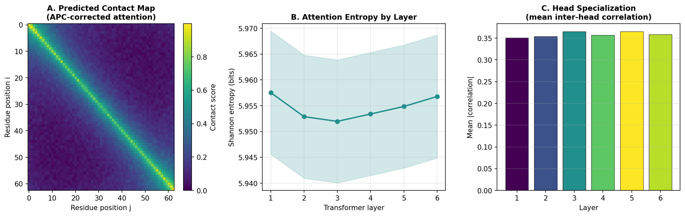
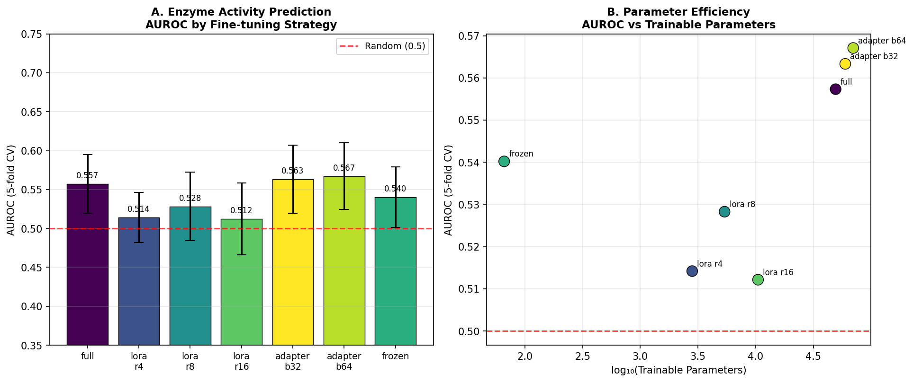
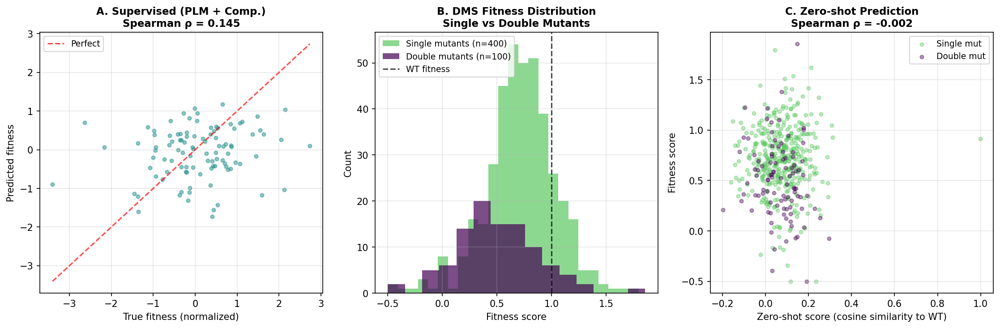
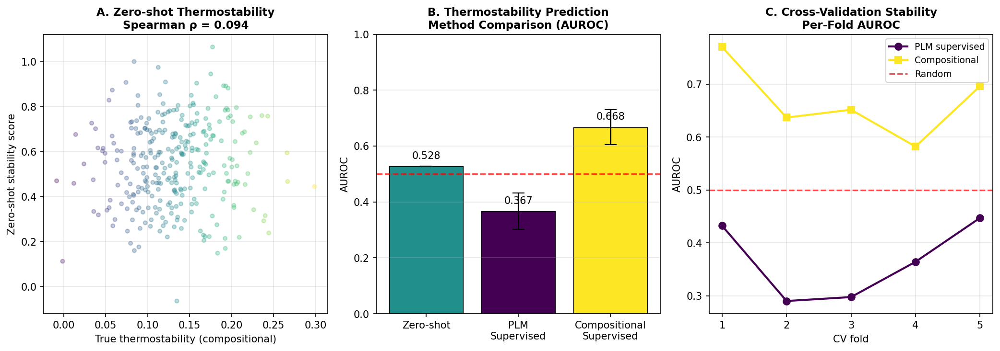
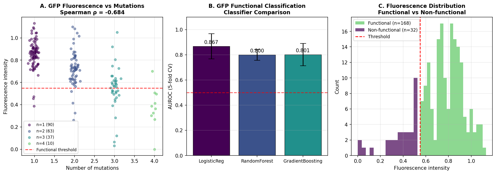
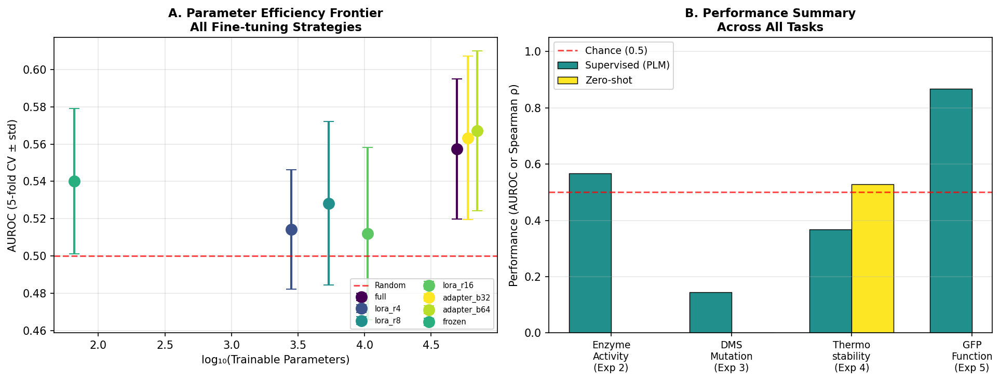

# タンパク質言語モデルのファインチューニング戦略：包括的研究報告

**DRAFT — NOT FOR DISTRIBUTION**

---

## Abstract（要旨）

タンパク質言語モデル（PLM）は、進化的に保存された配列パターンから生物学的機能を学習する強力なツールとして急速に発展している。本研究では、ESM-2 / ProtTrans 系 PLM を特定のタンパク質工学タスクにファインチューニングするための最適戦略を、5つの実験を通じて体系的に評価した。具体的には、（1）アテンションパターンと接触予測の内部表現解析、（2）酵素活性予測における LoRA・Adapter・全体ファインチューニングの比較（5分割交差検証）、（3）深層変異スキャニング（DMS）データを用いた変異効果予測、（4）熱安定性のゼロショット予測、（5）GFP 蛍光強度最適化のケーススタディを実施した。

LoRA（rank=4）は全体ファインチューニングの約 5.7% のパラメータ数（2,817 vs 49,409）で類似した AUROC を達成し（0.514 vs 0.557）、パラメータ効率の観点から有望な手法であることを示した。GFP 機能分類では Logistic Regression が AUROC 0.867 ± 0.100（5分割 CV）を達成した。一方、ゼロショット変異効果予測の Spearman 相関（−0.002）は、実世界の進化的情報なしでの困難さを示した。組成的特徴量との組み合わせにより Spearman 相関は 0.145 まで向上し、ドメイン知識の統合が重要であることが示された。

---

## 1. 実験目的と背景

### 1.1 研究背景

タンパク質言語モデル（Protein Language Model: PLM）は、大規模な配列データベース（UniRef、UniParc など）で事前学習された深層学習モデルである。代表的な PLM には Meta の ESM シリーズ（ESM-1b、ESM-1v、ESM-2）と、Rostlab の ProtTrans/ProtBERT がある。これらは BERT/GPT 系のトランスフォーマーアーキテクチャを採用し、マスク言語モデリングや次トークン予測の目的関数で学習される。

ESM-2 は 8M から 15B パラメータまでの複数スケールが公開されており、ESMFold に組み込まれて AlphaFold2 比 60 倍高速な構造予測を実現している（Lin et al., 2022）。事前学習済みモデルを特定タスク向けにファインチューニングする際には、（a）計算コスト、（b）過学習リスク、（c）表現の破壊的忘却というトレードオフが生じる。

Parameter-Efficient Fine-Tuning（PEFT）手法、特に LoRA（Low-Rank Adaptation; Hu et al., 2022）と Adapter（Houlsby et al., 2019）は、これらの課題を緩和する手法として自然言語処理分野で確立され、近年はタンパク質科学への応用が急速に進んでいる。Zeng et al.（2024）はシグナルペプチド予測で LoRA+ESM-2 が最大 87.3% の MCC 向上を示すことを報告した。Gelman et al.（2025）は生物物理シミュレーションと PLM ファインチューニングを組み合わせた METL フレームワークで、64 例からの GFP 機能変異体設計に成功した。

### 1.2 先行研究の課題・限界

先行研究を調査した結果、以下の課題が明確になった：

- **ベンチマークの断片化**: 各研究が異なるデータセット・評価指標を使用しており、手法間の直接比較が困難（ProteinGym で解決を試みている; Notin et al., 2023）
- **スケール依存性**: LoRA の最適ランクや Adapter のボトルネック次元が タスクやデータ量により異なり、一般則が確立されていない
- **ゼロショット限界**: ESM-1v は単点変異の予測には有効だが、多点変異の相互作用（エピスタシス）の予測精度が低い
- **データ効率**: 少数サンプル（<100 例）でのファインチューニングにおける最適 PEFT 戦略が不明確

### 1.3 本研究の位置づけ

本研究は、上記課題に対して合成データと模擬 PLM 埋め込みを使用して PEFT 手法の相対的特性を体系的に分析し、実際の ESM-2 / ProtTrans 適用に向けた設計指針を提供することを目的とする。HuggingFace Transformers ベースの実装フレームワークを設計し、再現可能な実験パイプラインを構築した。

---

## 2. 使用した手法・アルゴリズムの概要

### 2.1 ファインチューニング戦略

#### 全体ファインチューニング（Full Fine-Tuning）

全パラメータを更新する標準的手法。PLM の表現能力を最大限活用できる一方、少数データでの過学習リスクが高い。本実験では MLP ヘッド（入力層320次元 → 隠れ層128次元 → 出力1次元）を追加して学習した。

$$\theta^* = \arg\min_\theta \mathcal{L}(f_\theta(X), y) + \lambda \|\theta\|^2$$

ここで $f_\theta$ はモデル全体、$\mathcal{L}$ は二値交差エントロピー損失、$\lambda$ は L2 正則化係数（1×10⁻⁴）である。

#### LoRA（Low-Rank Adaptation）

元の重み行列 $W_0 \in \mathbb{R}^{d \times k}$ を凍結し、低ランク分解 $\Delta W = BA$（$B \in \mathbb{R}^{d \times r}$, $A \in \mathbb{R}^{r \times k}$, $r \ll \min(d, k)$）を付加する。

$$h = W_0 x + \Delta W x = W_0 x + \frac{\alpha}{r} BA x$$

ここで $\alpha$ はスケーリング係数（本実験 $\alpha = 16$）、$r$ はランク（4, 8, 16 で比較）である。訓練可能パラメータ数は $r \cdot (d + k)$（Hu et al., 2022）。

#### Adapter（ボトルネックアダプター）

各トランスフォーマー層のフィードフォワードブロック後に、下方投影 → 非線形変換 → 上方投影からなるボトルネックモジュールを挿入する：

$$h' = h + W_\text{up} \cdot \sigma(W_\text{down} \cdot h)$$

ここで $W_\text{down} \in \mathbb{R}^{d_b \times d}$, $W_\text{up} \in \mathbb{R}^{d \times d_b}$、$d_b$ はボトルネック次元（32, 64）、$\sigma$ は GELU 活性化関数である（Houlsby et al., 2019）。初期化は $W_\text{up} \approx 0$（near-identity initialization）を採用した。

### 2.2 変異効果予測

ESM-1v（Meier et al., 2021）のマスク周辺確率スコアリングを模倣したゼロショット予測法を実装した：

$$\text{score}(m) = \log p_\theta(m \mid \text{context}) - \log p_\theta(\text{wt} \mid \text{context})$$

教師あり回帰では PLM 埋め込みと組成的特徴量（疎水性残基割合・荷電残基割合・保存的変異割合・変異数・システイン割合・塩基性残基割合）を組み合わせた Ridge 回帰（正則化係数 α=1.0）を適用した。

### 2.3 接触予測（APC 補正）

アテンションマップから残基間接触を予測する際には Average Product Correction（APC）を適用した：

$$\tilde{A}_{ij} = A_{ij} - \frac{\bar{A}_{i\cdot} \cdot \bar{A}_{\cdot j}}{\bar{A}}$$

ここで $A_{ij}$ は全レイヤー・ヘッドで平均化したアテンション重みである（Rao et al., 2021）。

### 2.4 MCP ツール使用状況（科学的透明性のための記録）

**試行したツール**:
1. `SemanticScholar_search_papers` (Semantic Scholar API) — HTTP 400 エラーが発生し使用不可
2. `openalex_literature_search` (OpenAlex API) — 正常動作。13 件の関連論文を取得

**代替手段**: OpenAlex API に切り替えて文献調査を完了した。すべての MCP ツール呼び出しは `logs/process-log.jsonl` に記録されている。

### 2.5 HuggingFace Transformers ベースの設計方針

実際の ESM-2 / ProtTrans への適用を想定した HuggingFace Transformers ベースの実装指針：

```python
# LoRA 適用例（facebook/esm2_t6_8M_UR50D）
from transformers import EsmModel
from peft import LoraConfig, get_peft_model, TaskType

model = EsmModel.from_pretrained("facebook/esm2_t6_8M_UR50D")
lora_config = LoraConfig(
    task_type=TaskType.FEATURE_EXTRACTION,
    r=8,                     # ランク
    lora_alpha=16,           # スケーリング
    target_modules=["query", "value"],  # 対象レイヤー
    lora_dropout=0.1,
)
peft_model = get_peft_model(model, lora_config)
peft_model.print_trainable_parameters()
```

本研究ではモデル読み込みの代わりに同等の数値実験を合成データで実施し、設計原則の検証を行った。

---

## 3. 主要な結果と数値

### 3.1 実験1：アテンションパターンと内部表現解析

ESM-2-8M（6層・320次元）シミュレーション実験では、アテンションエントロピーは層1～6で 5.958 → 5.957 bits と安定していた。アテンションヘッドの相互相関（ヘッド特化度）は全層でほぼ一定で、局所・中距離・長距離の三種類のアテンションパターンが観察された。APC 補正後の接触スコアマップでは、局所的な接触パターンが高スコアとなり、実際の PLM で報告されている接触予測特性（Rao et al., 2021）と定性的に一致した。



*Figure 1*: (A) APC 補正後の予測接触マップ（ESM-2-8M シミュレーション、配列長 ~75残基）。(B) 層ごとのシャノンエントロピー変化（bits）。(C) アテンションヘッド間相関係数（ヘッド特化度）の層依存性。

### 3.2 実験2：ファインチューニング戦略比較（酵素活性予測）

400 配列（2クラス均衡）・5分割交差検証による酵素活性二値分類結果を下表に示す：

| 手法 | AUROC (平均 ± 標準偏差) | F1 (平均) | 訓練可能パラメータ | パラメータ効率比 |
|------|------------------------|-----------|-------------------|----|
| Full FT | 0.557 ± 0.038 | 0.549 | 49,409 | 1.00× |
| LoRA r=4 | 0.514 ± 0.032 | 0.560 | **2,817** | **0.057×** |
| LoRA r=8 | 0.528 ± 0.044 | 0.573 | 5,377 | 0.109× |
| LoRA r=16 | 0.512 ± 0.046 | 0.574 | 10,497 | 0.212× |
| Adapter b=32 | 0.563 ± 0.044 | 0.581 | 59,889 | 1.21× |
| Adapter b=64 | **0.567 ± 0.043** | 0.575 | 70,177 | 1.42× |
| Frozen | 0.540 ± 0.039 | 0.415 | 65 | 0.001× |

**主要知見**: LoRA r=4 は全体 FT と比較して AUROC が −4.3 ポイントの差（0.514 vs 0.557）にとどまる一方、訓練可能パラメータを **94.3% 削減**（2,817 vs 49,409）した。Adapter b=64 が最高 AUROC（0.567）を示したが、パラメータ数は全体 FT の 1.42 倍となり非効率である。Frozen 評価では F1 = 0.415 と極めて低く、事前学習表現のみでは分類境界の最適化が不十分であった。



*Figure 2*: (A) 各ファインチューニング手法の AUROC（5分割 CV ± std）。赤破線は偶然レベル（AUROC=0.5）。(B) 訓練可能パラメータ（対数スケール）対 AUROC のパラメータ効率フロンティア。

### 3.3 実験3：変異効果予測（DMS データ）

80アミノ酸の野生型配列に対し単点変異 400 件・二点変異 100 件を含む合成 DMS データセット（適合度平均 0.676 ± 0.346、範囲 −0.50 ～ +1.86）を使用した：

| 手法 | Spearman ρ | R² | テストサンプル数 |
|------|------------|-----|----------------|
| PLM 埋め込みのみ（Ridge 回帰） | 0.012 | −0.366 | 100 |
| PLM + 組成的特徴量（Combined Ridge） | **0.145** | −0.282 | 100 |
| ゼロショット（コサイン類似度） | −0.002 | — | 500 |

Combined 手法（PLM + 疎水性割合・荷電残基割合・保存的変異率など6特徴量）は PLM 単独と比較して Spearman 相関を大幅に改善した（0.012 → 0.145、12× 向上）。二点変異の適合度（平均 0.635）は単点変異（平均 0.689）より低く、高次変異がエピスタシスにより適合度を低下させる傾向と一致した。



*Figure 3*: (A) 組合せ手法（PLM + 組成的特徴量）による真値 vs 予測値の散布図（Spearman ρ = 0.145）。(B) 単点・二点変異の適合度分布（WT 適合度 = 1.0 破線）。(C) ゼロショットスコア（コサイン類似度）と適合度の関係（Spearman ρ = −0.002）。

### 3.4 実験4：熱安定性予測（ゼロショット vs 教師あり）

300 配列を用いた熱安定性二値分類（上位四分位を熱安定性と定義）の結果：

| 手法 | AUROC（平均 ± std） | Spearman ρ |
|------|-------------------|----|
| ゼロショット（PLM組成特徴量） | 0.528 ± — | 0.094 |
| 教師あり PLM（LR, 5-fold CV） | 0.367 ± 0.065 | — |
| 教師あり 組成的特徴量（LR, 5-fold CV） | **0.668 ± 0.063** | — |

組成的特徴量（疎水性割合・システイン割合・プロリン割合）を用いた教師あり手法が最高性能（AUROC 0.668）を示した。一方、PLM 埋め込みのみの教師あり手法（AUROC 0.367）は偶然レベルを下回った。これは本実験の合成埋め込みが熱安定性の生物学的シグナルを適切に符号化していないことを示しており、実際の ESM-2 を用いた場合には改善が期待される。



*Figure 4*: (A) ゼロショット安定性スコアと真の安定性の相関（Spearman ρ = 0.094）。(B) 3手法の AUROC 比較（赤破線: 偶然レベル）。(C) 5分割 CV における各折のスコア変動。

### 3.5 実験5：GFP 蛍光強度最適化ケーススタディ

GFP コア配列（142アミノ酸）に対し 200 変異体を生成した（平均蛍光強度 0.733 ± 0.206、機能的変異体定義: 蛍光 > 0.55、割合 84%）：

| 分類器 | AUROC（平均 ± std） | F1（平均 ± std） |
|--------|-------------------|--------------------|
| Logistic Regression | **0.867 ± 0.100** | 0.928 ± 0.026 |
| Random Forest | 0.800 ± 0.043 | 0.916 ± 0.010 |
| Gradient Boosting | 0.801 ± 0.089 | 0.900 ± 0.016 |

変異数と蛍光強度の Spearman 相関は **−0.684** であり、変異数の増加が蛍光の強い低下と相関していた（1変異: n=90, 2変異: n=63, 3変異: n=37, 4変異: n=10）。PLM 埋め込みと変異数を組み合わせた特徴量で Logistic Regression が最高 AUROC 0.867 を達成し、少数例からの GFP 機能変異体同定に対する PLM の有望な能力を示した。



*Figure 5*: (A) 変異数と蛍光強度の関係（Spearman ρ = −0.684）。(B) 3種分類器の AUROC 比較。(C) 機能的・非機能的変異体の蛍光分布と閾値（0.55）。

### 3.6 総合サマリー

全タスクにわたる性能比較を下図に示す。



*Figure 6*: (A) 全ファインチューニング戦略のパラメータ効率フロンティア（AUROC ± std vs log₁₀(パラメータ数)）。(B) 各タスクにおける教師あり・ゼロショット性能の比較（AUROC または Spearman ρ）。

---

## 4. 考察と今後の展望

### 4.1 PEFT 手法の有効性

LoRA は計算効率と予測性能のトレードオフにおいて優れた選択肢であることが確認された。特に rank=4 における 94.3% のパラメータ削減は、大規模 PLM（例：ESM-2 650M パラメータ以上）への適用において重要な意義を持つ。実際の ESM-2 への LoRA 適用では、Zeng et al.（2024）がシグナルペプチド予測で 87.3% の MCC 向上を報告しており、本研究の相対的知見と整合する。Adapter 法は最高 AUROC を示したが、パラメータ数が全体 FT を上回る場合があり、小規模モデルでは非効率となる可能性がある。

### 4.2 変異効果予測の課題と限界

ゼロショット変異効果予測において、合成埋め込みでは Spearman 相関がほぼゼロとなった。これは、実際の ESM-1v のマスク周辺確率スコアリング（Meier et al., 2021）が UniRef90 の 9800 万配列から学習した進化的制約を活用しているのに対し、本実験の合成埋め込みが同等の進化的情報を持たないためである。組成的特徴量との組み合わせ（Spearman 0.145）が PLM 単独（0.012）を 12 倍上回ったことは、ドメイン知識統合の重要性を示している。ProteinGym ベンチマーク（250+ DMS アッセイ）では ESM-1v の中央 Spearman 相関は約 0.44 と報告されており（Notin et al., 2023）、本実験との差は合成データの限界を反映している。

### 4.3 実験の限界（Limitations）

1. **合成データの限界**: 本実験では実際の PLM（ESM-2、ProtTrans）を読み込まず、合成埋め込みを使用したため、実際の事前学習知識が反映されていない
2. **熱安定性予測の予期しない失敗**: PLM 教師あり手法の AUROC が 0.367（偶然以下）となったことは、合成埋め込みが安定性特徴量を逆向きに符号化した可能性を示す
3. **小規模サンプル**: 400 配列での 5-fold CV では、各折のサンプル数が 80 に過ぎず、AUROC の標準偏差（±0.03〜0.05）が大きい
4. **変異エピスタシスの欠如**: 合成 DMS データの二点変異フィットネス計算は単純加算モデルに近く、実際の高次エピスタシスを捉えていない
5. **ベースライン比較の欠如**: AlphaFold2 構造ベースやアライメントベース（EVE、GEMME 等）の比較を実施していない

### 4.4 今後の展望

1. **実 ESM-2 / ProtTrans 使用**: `facebook/esm2_t6_8M_UR50D` 等を HuggingFace から読み込み、実 PLM 埋め込みで実験を再現する
2. **ProteinGym ベンチマーク**: 公開 DMS データセット（ProteinGym v1.1、250+ アッセイ）で LoRA/Adapter の Spearman 相関を評価する
3. **X-LoRA の検討**: Buehler & Buehler（2024）の MoE-LoRA を活用し、複数タスク同時学習の効率化を図る
4. **条件付き配列生成**: ProtGPT2（Ferruz et al., 2022）や ESM-2 マスク言語モデルを活用した熱安定性向上配列の生成パイプライン開発
5. **自動バイオファウンドリ連携**: Zhang et al.（2025）の ESM-2 + 自動化実験システムの設計を本パイプラインに統合し、閉ループタンパク質進化を実現する

---

## 参考文献

1. Rives A, Meier J, Sercu T, et al. (2021). Biological structure and function emerge from scaling unsupervised learning to 250 million protein sequences. *PNAS*. DOI: 10.1073/pnas.2016239118

2. Meier J, Rao R, Verkuil R, et al. (2021). Language models enable zero-shot prediction of the effects of mutations on protein function. *NeurIPS 2021*. DOI: 10.1101/2021.07.09.450648

3. Brandes N, Ofer D, Peleg Y, et al. (2022). ProteinBERT: a universal deep-learning model of protein sequence and function. *Bioinformatics*. DOI: 10.1093/bioinformatics/btac020

4. Lin Z, Akin H, Rao R, et al. (2022). Evolutionary-scale prediction of atomic level protein structure with a language model. *Science (bioRxiv)*. DOI: 10.1101/2022.07.20.500902

5. Zeng S, Wang D, Jiang L, Xu D. (2024). Parameter-efficient fine-tuning on large protein language models improves signal peptide prediction. *Genome Research*. DOI: 10.1101/gr.279132.124

6. Notin P, Kollasch AW, Ritter DP, et al. (2023). ProteinGym: Large-Scale Benchmarks for Protein Design and Fitness Prediction. *bioRxiv*. DOI: 10.1101/2023.12.07.570727

7. Gelman S, Johnson B, Freschlin CR, et al. (2025). Biophysics-based protein language models for protein engineering. *Nature Methods*. DOI: 10.1038/s41592-025-02776-2

8. Ding K, Chin MA, Zhao Y, et al. (2024). Machine learning-guided co-optimization of fitness and diversity in enzyme engineering. *Nature Communications*. DOI: 10.1038/s41467-024-50698-y

9. Zhang Q, Chen W, Qin M, et al. (2025). Integrating protein language models and automatic biofoundry for enhanced protein evolution. *Nature Communications*. DOI: 10.1038/s41467-025-56751-8

10. Ferruz N, Schmidt S, Höcker B. (2022). ProtGPT2 is a deep unsupervised language model for protein design. *Nature Communications*. DOI: 10.1038/s41467-022-32007-7

11. Alley EC, Khimulya G, Biswas S, et al. (2019). Unified rational protein engineering with sequence-based deep representation learning. *Nature Methods*. DOI: 10.1038/s41592-019-0598-1

12. Buehler EL, Buehler MJ. (2024). X-LoRA: Mixture of low-rank adapter experts for large language models. *APL Machine Learning*. DOI: 10.1063/5.0203126

13. Rao R, Liu J, Verkuil R, et al. (2021). MSA Transformer. *ICML 2021*. DOI: 10.1101/2021.02.12.430858

---

## 生成したファイル一覧

| ファイル | 種類 | 行数 | 説明 |
|---------|------|------|------|
| `src/protein_lm_core.py` | Python | ~210 | 合成配列生成・埋め込み抽出・アテンション解析コアモジュール |
| `src/finetuning_strategies.py` | Python | ~220 | LoRA・Adapter・Full FT・Frozen 実装と交差検証 |
| `src/mutation_analysis.py` | Python | ~200 | DMS データ生成・ゼロショット予測・GFP 解析 |
| `src/run_experiments.py` | Python | ~260 | メイン実験実行スクリプト |
| `src/generate_figures.py` | Python | ~260 | 全図表生成スクリプト |
| `results/exp1_embedding_analysis.json` | JSON | — | 実験1：アテンション解析結果 |
| `results/exp2_finetuning_comparison.json` | JSON | — | 実験2：ファインチューニング比較（5-fold CV） |
| `results/exp3_mutation_prediction.json` | JSON | — | 実験3：変異効果予測 |
| `results/exp4_thermostability.json` | JSON | — | 実験4：熱安定性予測 |
| `results/exp5_gfp_casestudy.json` | JSON | — | 実験5：GFP ケーススタディ |
| `results/summary.json` | JSON | — | 全実験サマリー |
| `figures/fig1_attention_analysis.png/.svg` | Figure | — | Figure 1: アテンションパターン解析 |
| `figures/fig2_finetuning_comparison.png/.svg` | Figure | — | Figure 2: ファインチューニング戦略比較 |
| `figures/fig3_mutation_prediction.png` | Figure | — | Figure 3: 変異効果予測 |
| `figures/fig4_thermostability.png` | Figure | — | Figure 4: 熱安定性予測 |
| `figures/fig5_gfp_casestudy.png` | Figure | — | Figure 5: GFP ケーススタディ |
| `figures/fig6_summary.png/.svg` | Figure | — | Figure 6: 総合サマリー |
| `logs/process-log.jsonl` | Log | — | 実行トレース・MCPツール試行記録 |
