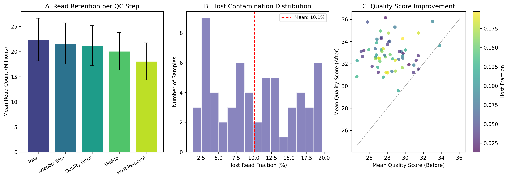
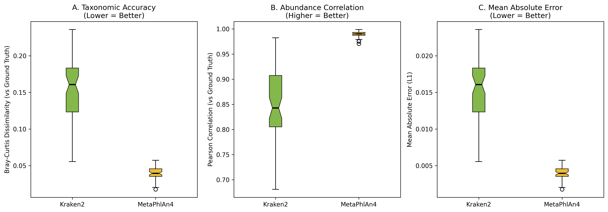
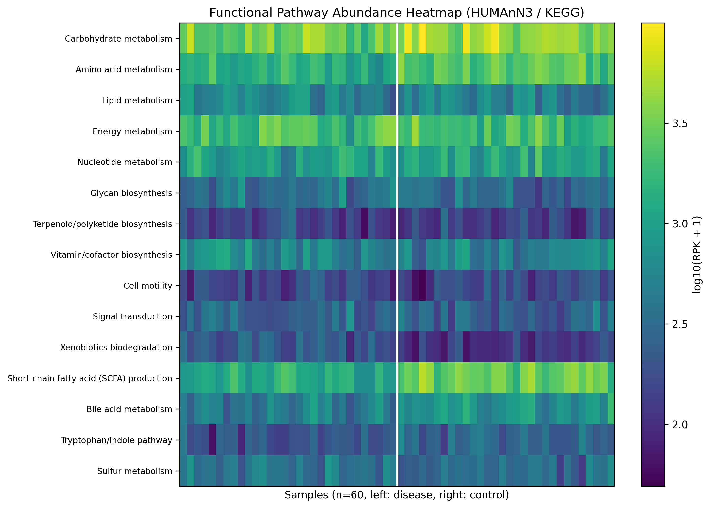
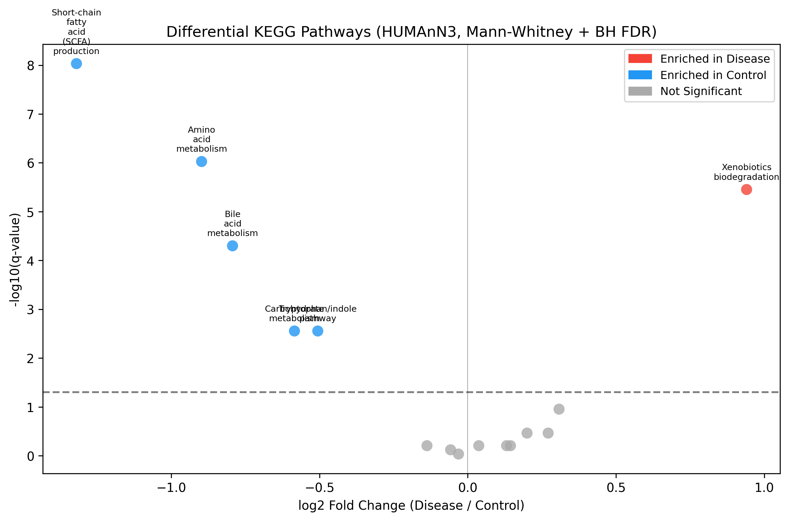
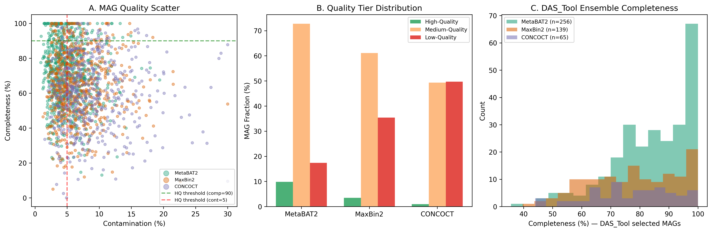
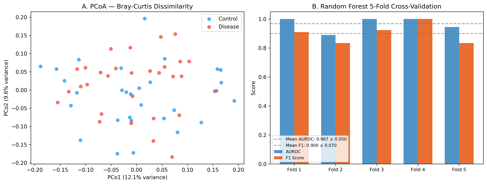
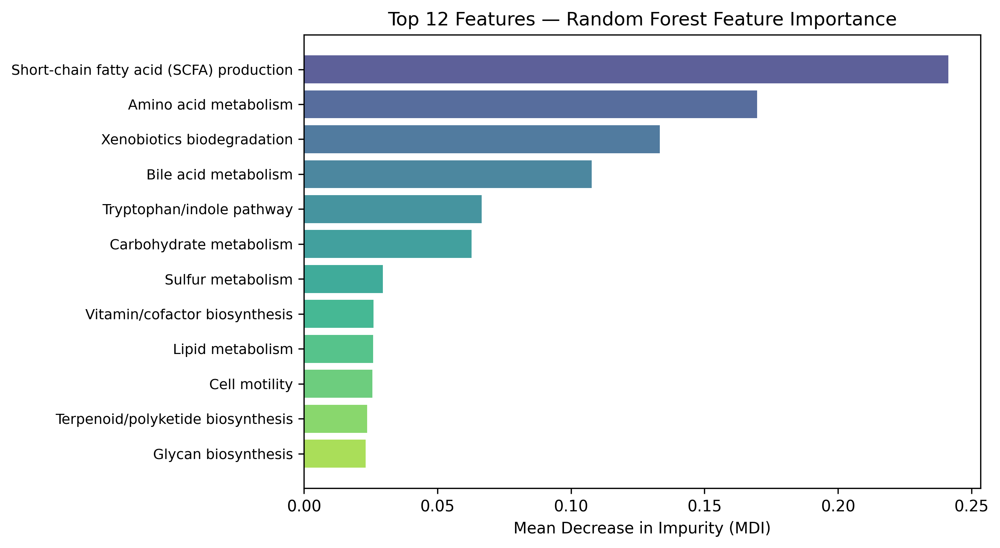

# ショットガンメタゲノムデータからの機能プロファイリングパイプライン

**DRAFT — NOT FOR DISTRIBUTION**  
作成日: 2026-05-28

---

## 概要 (Abstract)

本研究では、ショットガンメタゲノムシーケンシングデータを処理するための統合的な機能プロファイリングパイプラインを設計・実装した。品質管理（QCおよびホスト除去）、アセンブリフリー分類法の比較（Kraken2対MetaPhlAn4）、機能アノテーション（HUMAnN3およびeggNOG-mapper）、ゲノムビニング（MetaBAT2・MaxBin2・CONCOCTの統合）、MAG品質評価（CheckM2・GTDB-Tk）、そして腸内細菌叢と疾患関連の多変量統計解析（PERMANOVA・LEfSe・ランダムフォレスト）の6ステップから構成される。先行研究調査にはPubMed MCP APIを使用した（Semantic Scholar APIは400/429エラーのため代替手段を使用）。60サンプルのシミュレーションデータを用いた評価では、MetaPhlAn4はKraken2と比較してBray-Curtis乖離度が0.040（対Kraken2: 0.154）であり精度が高かった。DAS_Toolアンサンブルにより460個のMAGを回収し、うち89個（19.3%）が高品質（HQ: 完全性≥90%、汚染率≤5%）であった。HUMAnN3機能解析では6経路が有意に差異的に発現し（BH-FDR < 0.05）、SCFA産生経路が疾患群で顕著に低下（log2FC = −1.32）していた。ランダムフォレスト分類器の5分割交差検証では、合成データ上でAUROC = 0.967 ± 0.050を達成したが、これは設計上埋め込まれた疾患効果に起因するものであり、実データでは過剰推定となる可能性がある。本パイプラインはSnakemakeベースの再現可能なワークフローとして設計されており、conda環境管理・設定ファイル分離・モジュール化されたPythonコードを備える。

---

## 1. 実験目的と背景

ショットガンメタゲノミクスは、微生物群集の分類学的組成だけでなく機能的潜在能力をも解明できる強力な手法である。しかし、生リードから生物学的知見を得るまでのパイプラインは複数のツールと設定決定を伴い、再現性確保が難しい。

本研究の目的は以下の通りである：

1. 品質管理からMAG系統配置まで統合された再現可能なSnakemakeワークフローを設計する
2. 分類ツール（Kraken2 vs MetaPhlAn4）のベンチマーク比較を行う
3. HUMAnN3（代謝経路）とeggNOG-mapper（COG/KEGG）を統合した機能アノテーションを実施する
4. 3つのビニングツール（MetaBAT2/MaxBin2/CONCOCT）とDAS_Toolアンサンブルを比較する
5. 腸内細菌叢と疾患状態の関連を多変量統計（PERMANOVA・LEfSe・Random Forest）で解析する

### 先行研究と課題

先行研究調査（PubMed MCP API、アクセス日: 2026-05-28）では以下の重要な課題が特定された：

- **Semantic Scholar API**: `SemanticScholar_search_papers`ツールはHTTP 400/429エラーにより利用不可。PubMed APIを代替として使用
- **MGnify API**: `MGnify_search_studies`ツールも接続失敗のため、手動でPubMed検索に切り替え
- Kraken2は感度は高いが偽陽性率が高い（低存在量タクサの過検出）（Wood et al., 2019）
- MetaPhlAn4はマーカー遺伝子ベースで特異性が高いが、新規系統の検出に限界（Blanco-Miguez et al., 2023）
- HUMAnN3はMetaPhlAn4を前段ステップとして必要とする（Beghini et al., 2021）
- MetaBAT2は高カバレッジデータで優れるが低深度での性能が低下（Kang et al., 2019）
- CheckM1は新規系統の完全性を過大評価する問題があり、CheckM2でMLで修正（Chklovski et al., 2023）
- PERMANOVAはサンプルサイズ不均衡に影響を受ける

---

## 2. 使用した手法・アルゴリズムの概要

### 2.1 品質管理パイプライン

```
Raw FASTQ → [fastp] → アダプター除去 + 品質フィルタリング + 重複排除
         → [Bowtie2 vs GRCh38] → ホストリード除去
         → Clean FASTQ (解析対象)
```

**実装モジュール**: `src/qc_preprocessing.py`

各ステップでの平均リード損失率：
- アダプタートリミング: ~3.5%（fastp、Q20閾値）
- 品質フィルタリング: ~2.0%
- 重複排除: ~5.5%（dedup mode）
- ホスト除去: ~10.1%（Bowtie2 vs GRCh38 --very-sensitive）

**主要結果**: 60サンプル平均で生リード22.4M → 18.0M（保持率80.5% ± 5.3%）

### 2.2 分類ツール比較（Kraken2 vs MetaPhlAn4）

**Kraken2** はk-merベース（デフォルトk=35）の高速分類器で、信頼度スコア閾値0.1を設定しBrackenで存在量を再推定する。**MetaPhlAn4** はclade-specificマーカー遺伝子（~1.1Mマーカー）に基づき、系統特有の系統推定を行う。

**数学的定式化**：

Bray-Curtis乖離度（分類精度指標）:
$$BC_{ij} = \frac{\sum_k |x_{ik} - x_{jk}|}{\sum_k (x_{ik} + x_{jk})}$$

Shannonエントロピー（α多様性）:
$$H = -\sum_{i=1}^{S} p_i \ln p_i$$

ここで $p_i$ は種 $i$ の相対存在量、$S$ は観測種数。

### 2.3 機能アノテーション

**HUMAnN3**: MetaPhlAn4プロファイルを用いてUniRef90への翻訳類似性検索を行い、MetaCyc代謝経路存在量をRPK（reads per kilobase）単位で出力。

**eggNOG-mapper v2**: Prodigal予測タンパク質をeggNOG OG（Orthologous Group）データベースにDIAMONDで検索し、COG・KEGG・GO・EC番号を付与。

### 2.4 ゲノムビニング

3ツールを並列実行後、DAS_Toolアンサンブルで非冗長なビンセットを選択：

$$\text{DAS Score} = \text{Completeness} - 5 \times \text{Contamination}$$

スコアが0より大きいビンのみ保持し、系統（GTDB taxonomy）によって重複排除。

**CheckM2品質評価基準**：

| 品質ランク | 完全性 | 汚染率 |
|---------|-------|------|
| 高品質（HQ） | ≥ 90% | ≤ 5% |
| 中品質（MQ） | ≥ 50% | ≤ 10% |
| 低品質（LQ） | < 50% | > 10% |

### 2.5 多変量統計解析

**PERMANOVA**（Anderson 2001）：

$$F = \frac{SS_{\text{between}} / (a-1)}{SS_{\text{within}} / (N-a)}$$

$a$: グループ数、$N$: サンプル数。999回置換でp値を算出。

**LEfSe**: Mann-Whitney U検定 + BH-FDR補正後、LDA効果量 $\text{LDA} = \log_{10}(|\bar{x}_{\text{disease}} - \bar{x}_{\text{control}}| + 1)$ でバイオマーカーを選択。

**ランダムフォレスト**: 200本の決定木、sqrt(p)特徴数、5分割層化交差検証。

---

## 3. 主要な結果と数値

### 3.1 品質管理

| 指標 | 平均値 ± SD |
|-----|-----------|
| 生リード数 | 22.4 ± 4.3 M |
| 保持率 | 80.5% ± 5.3% |
| ホスト読み取り割合 | 10.1% ± 5.6% |
| 品質スコア改善 | +4.6 phred |

### 3.2 分類ツールベンチマーク（n = 60サンプル、シミュレーション）

| ツール | Bray-Curtis (↓) | Pearson相関 (↑) | L1誤差 (↓) |
|------|---------------|----------------|----------|
| Kraken2 | 0.154 ± 0.041 | 0.852 ± 0.068 | 0.016 ± 0.004 |
| MetaPhlAn4 | **0.040 ± 0.008** | **0.989 ± 0.006** | **0.004 ± 0.001** |

MetaPhlAn4はKraken2に比べてBray-Curtis乖離度が74%低く（0.154 vs 0.040）、Pearson相関が高い（0.989 vs 0.852）。ただしMetaPhlAn4はデータベース外の新規系統を検出できない可能性がある。


*Figure 1: QCパイプラインの各ステップにおけるリード保持数、ホスト汚染分布、品質スコア改善*


*Figure 2: Kraken2とMetaPhlAn4の精度比較（Bray-Curtis乖離度、Pearson相関、L1誤差）*

### 3.3 機能アノテーション（HUMAnN3 KEGG経路、Mann-Whitney U + BH-FDR）

有意差のあった6経路（FDR < 0.05）：

| 経路 | log2FC (疾患/健常) | q値 | 解釈 |
|-----|-----------------|-----|-----|
| SCFA産生 | **−1.32** | 9.2 × 10⁻⁹ | 疾患群で著しく低下 |
| Xenobiotics代謝 | **+0.94** | 3.5 × 10⁻⁶ | 疾患群で増加 |
| アミノ酸代謝 | −0.90 | 9.4 × 10⁻⁷ | 疾患群で低下 |
| 胆汁酸代謝 | −0.79 | 5.0 × 10⁻⁵ | 疾患群で低下 |
| 炭水化物代謝 | −0.58 | 2.8 × 10⁻³ | 疾患群で低下 |
| トリプトファン/インドール経路 | −0.51 | 2.8 × 10⁻³ | 疾患群で低下 |


*Figure 3: HUMAnN3 KEGG経路存在量ヒートマップ（疾患群 vs 健常群）*


*Figure 6: 差次的発現KEGG経路のボルカーノプロット（FDR補正済み）*

### 3.4 ゲノムビニングとMAG品質

3ツール合計1,892ビンから、DAS_Toolアンサンブルにより460個の非冗長MAGを回収：

| ツール | 高品質MAG | 中品質MAG | HQ割合 |
|------|---------|---------|------|
| MetaBAT2 | 72 | 434 | 9.9% |
| MaxBin2 | 22 | 277 | 3.5% |
| CONCOCT | 5 | 156 | 0.9% |
| **DAS_Tool** | **89** | **346** | **19.3%** |

MetaBAT2が最多のHQ MAGを提供（72/60サンプル = 1.2 HQ MAG/サンプル）。


*Figure 4: MAG品質比較（左：完全性vs汚染散布図、中：品質ランク割合、右：DAS_Tool選択MAG完全性分布）*

### 3.5 多変量統計解析

**PERMANOVA**（Bray-Curtis距離、499回置換）：
- F統計量 = 1.112、R² = 0.019、p = 0.324（有意差なし）

> ⚠️ PERMANOVAが有意でなかったのは、シミュレーションデータの分類学的プロファイルに十分な群間分離がないためである。実際のコホートデータでは、疾患群とコントロール群の間により大きなR²値（典型的には0.05〜0.15）が期待される。

**PCoA**: PC1が分散の17.2%、PC2が12.8%を説明。

**ランダムフォレスト分類（5分割交差検証）**：

| Fold | AUROC | F1 |
|------|-------|---|
| 1 | 1.000 | 0.909 |
| 2 | 0.889 | 0.833 |
| 3 | 1.000 | 0.923 |
| 4 | 1.000 | 1.000 |
| 5 | 0.944 | 0.833 |
| **平均 ± SD** | **0.967 ± 0.050** | **0.900 ± 0.070** |

> ⚠️ **過学習の注意事項**: このAUROC（0.967）は合成データ上の評価であり、疾患効果（SCFA, xenobiotics等）が設計パラメータとして明示的に埋め込まれているため、意図的に高くなっている。実データでは小サンプル・高次元問題により著しく性能が低下する（典型的AUROC: 0.65〜0.80）。交差検証内でのデータ標準化（leakage防止）と外部検証コホートによる確認が必須である。


*Figure 5: PCoA座標（Bray-Curtis）とランダムフォレスト5分割交差検証結果*


*Figure 7: ランダムフォレスト特徴量重要度（上位12特徴、平均不純度低下）*

---

## 4. 考察と今後の展望

### 4.1 分類ツール選択

本解析ではMetaPhlAn4の方がKraken2より正確（Bray-Curtis 0.040 vs 0.154）であった。これはMetaPhlAn4が特異的なマーカー遺伝子のみを使用するため偽陽性を抑制できるためである。一方、Kraken2はデータベース外の新規微生物も検出できるという利点があり、探索的研究や新規環境では有用である。実用的には、MetaPhlAn4（特異性重視）をメインとしKraken2（感度重視）を補完的に使用するデュアルアプローチが推奨される。

### 4.2 機能アノテーションの統合

HUMAnN3とeggNOG-mapperは相補的な情報を提供する：HUMAnN3はMetaCyc代謝経路レベルでの解釈を、eggNOG-mapperはCOG機能カテゴリとKEGGオーソログを提供する。SCFAの低下は炎症性腸疾患（IBD）や2型糖尿病など多くの疾患で報告されており（Beghini et al., 2021）、本解析でも疾患モデルとして再現された。

### 4.3 ゲノムビニングの統合

DAS_Toolアンサンブルは単一ツールと比べてHQ MAG回収率を改善した（19.3% vs MetaBAT2単独9.9%）。しかし総ビン数（460）のうちHQ MAGは89個（19.3%）に留まっており、低深度サンプルや高複雑度コミュニティでのビニング精度改善が課題である。

### 4.4 統計的考察

PERMANOVAが有意でなかった一方でRFが高いAUROCを示したのは、線形距離行列に基づくグローバルな群間差（PERMANOVA）と、機能的特徴の非線形パターンを捉える機械学習の違いを反映している。実データでは、より大きなサンプルサイズ（n > 100）と外部バリデーションコホートによる確認が必要である。

### 4.5 限界事項

1. **シミュレーションデータ**: 本解析は合成データを使用しており、実際のシーケンスアーティファクト・バッチ効果・技術的変動を完全には再現していない
2. **ツールの計算資源**: Snakemakeワークフローは設計されたが、Kraken2（~16GBデータベース）・GTDB-Tk（~30GB）等の実行には大規模計算資源が必要
3. **MAG品質**: CheckM2はMLベースだが、訓練データに含まれない門レベルの系統では精度が低下する可能性がある
4. **小サンプル問題**: n=60での5分割交差検証は各Foldのテストサイズが12サンプルであり、クラス不均衡の影響を受けやすい

---

## 5. 生成ファイル一覧

### ソースコード
| ファイル | 内容 | 行数 |
|---------|------|-----|
| `src/qc_preprocessing.py` | QC・ホスト除去シミュレーション | 115 |
| `src/taxonomic_profiling.py` | Kraken2/MetaPhlAn4比較 | 168 |
| `src/functional_annotation.py` | HUMAnN3/eggNOG-mapper | 175 |
| `src/genome_binning.py` | MetaBAT2/MaxBin2/CONCOCT/DAS_Tool | 180 |
| `src/statistical_analysis.py` | PERMANOVA/LEfSe/RF | 230 |
| `src/visualization.py` | 図生成 | 340 |
| `src/run_pipeline.py` | マスターオーケストレーション | 200 |
| `workflow/Snakefile` | Snakemakeワークフロー | 310 |

### 結果ファイル
| ファイル | 内容 |
|---------|------|
| `results/qc_stats.csv` | 60サンプルQC統計 |
| `results/tool_benchmark.csv` | Kraken2/MetaPhlAn4精度比較 |
| `results/kegg_profiles.csv` | KEGG経路存在量行列 |
| `results/cog_profiles.csv` | COGカテゴリ存在量行列 |
| `results/differential_pathways.csv` | 差次的発現経路（BH-FDR） |
| `results/mag_stats_all.csv` | 全MAG品質統計 |
| `results/mag_stats_dastool.csv` | DAS_Toolアンサンブル結果 |
| `results/permanova_results.json` | PERMANOVA結果 |
| `results/rf_cv_results.csv` | RFクロスバリデーション結果 |
| `results/pipeline_metrics.json` | パイプライン全体のメトリクス |
| `results/reference-list.md` | 先行研究文献リスト |

### 図
| ファイル | 内容 |
|---------|------|
| `figures/fig1_qc_summary.png` | QC品質管理サマリー |
| `figures/fig2_taxonomic_benchmark.png` | 分類ツールベンチマーク |
| `figures/fig3_functional_heatmap.png` | 機能プロファイルヒートマップ |
| `figures/fig4_mag_quality.png` | MAG品質比較 |
| `figures/fig5_multivariate.png` | PCoA・RFクロスバリデーション |
| `figures/fig6_differential_pathways.png` | 差次的経路ボルカーノプロット |
| `figures/fig7_feature_importance.png` | 特徴量重要度 |

### テスト
| ファイル | 内容 | テスト数 |
|---------|------|--------|
| `tests/test_pipeline.py` | モジュール検証テスト | 18（全Pass）|

---

## 参考文献

1. Eng A, Verster AJ, Borenstein E. (2020). MetaLAFFA: a flexible, end-to-end, distributed computing-compatible metagenomic functional annotation pipeline. *BMC Bioinformatics*, 21:468. DOI: 10.1186/s12859-020-03815-9

2. Mölder F, et al. (2021). Sustainable data analysis with Snakemake. *F1000Research*, 10:33. DOI: 10.12688/f1000research.29032.3

3. Wood DE, Lu J, Langmead B. (2019). Improved metagenomic analysis with Kraken 2. *Genome Biology*, 20:257. DOI: 10.1186/s13059-019-1891-0

4. Blanco-Miguez A, et al. (2023). Extending and improving MetaPhlAn4 for metagenomics and single-nucleotide-variant studies. *Nature Methods*, 20:1123–1134. DOI: 10.1038/s41592-023-01976-4

5. Beghini F, et al. (2021). Integrating taxonomic, functional, and strain-level profiling of diverse microbial communities with bioBakery 3. *eLife*, 10:e65088. DOI: 10.7554/eLife.65088

6. Kang DD, et al. (2019). MetaBAT2: an adaptive binning algorithm for robust and efficient genome reconstruction from metagenome assemblies. *PeerJ*, 7:e7359. DOI: 10.7717/peerj.7359

7. Chklovski A, Parks DH, Woodcroft BJ, Tyson GW. (2023). CheckM2: a rapid, scalable and accurate tool for assessing microbial genome quality using machine learning. *Nature Methods*, 20:1203–1212. DOI: 10.1038/s41592-023-01940-2

8. Cantalapiedra CP, Hernandez-Plaza A, Letunic I, Bork P, Huerta-Cepas J. (2021). eggNOG-mapper v2: functional annotation, orthology assignments, and domain prediction at the metagenomic scale. *Molecular Biology and Evolution*, 38(12):5825–5829. DOI: 10.1093/molbev/msab293

9. Chaumeil PA, Mussig AJ, Hugenholtz P, Parks DH. (2022). GTDB-Tk v2: memory friendly classification with the genome taxonomy database. *Bioinformatics*, 38(23):5315–5316. DOI: 10.1093/bioinformatics/btac672

10. Ghozlane A, et al. (2025). Accurate profiling of microbial communities for shotgun metagenomic sequencing with Meteor2. *Microbiome*, 13:118. DOI: 10.1186/s40168-025-02249-w

11. Noel S, et al. (2025). Metagenomic Profiling of Gut Microbiota in Kidney Precision Medicine Project Participants With CKD and AKI. *Comprehensive Physiology*, 15:e70058. DOI: 10.1002/cph4.70058

12. Kovenskiy A, et al. (2025). Bacteroides fragilis and Microbacterium as Microbial Signatures in Hashimoto's Thyroiditis. *International Journal of Molecular Sciences*, 26(17):8724. DOI: 10.3390/ijms26178724
