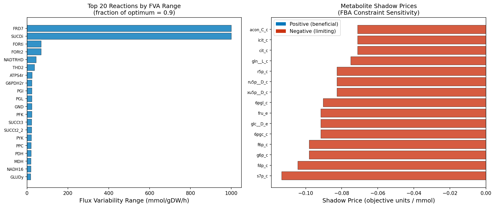
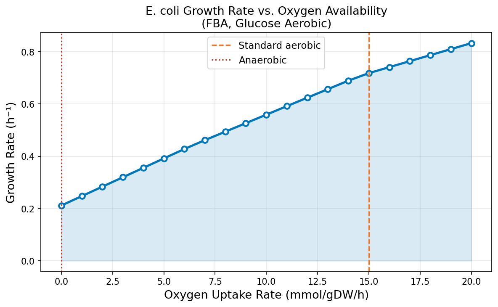
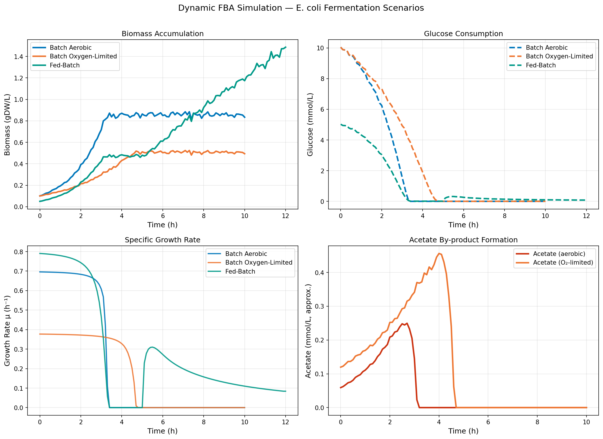
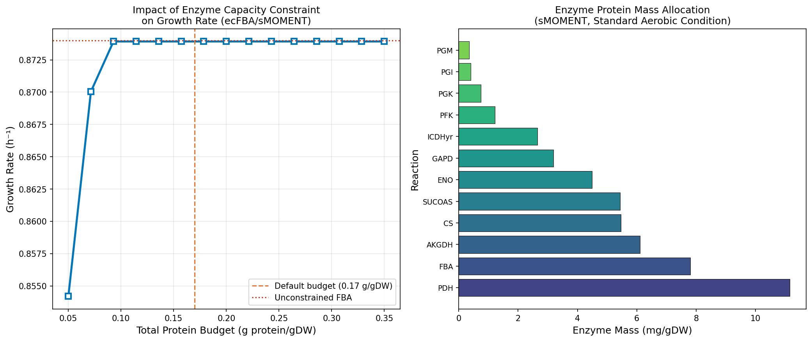
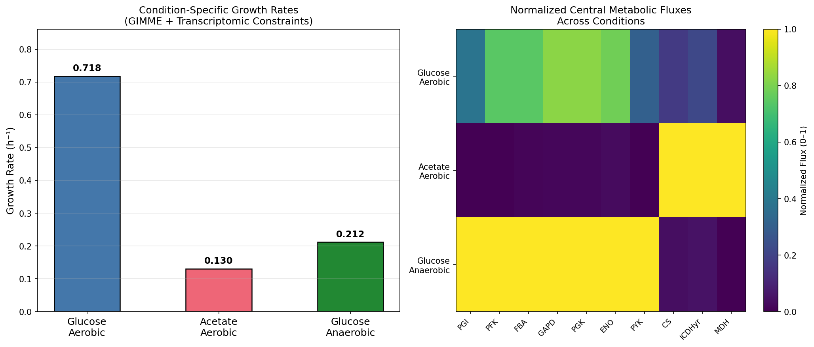
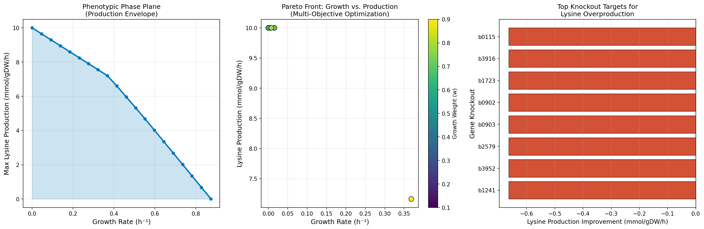
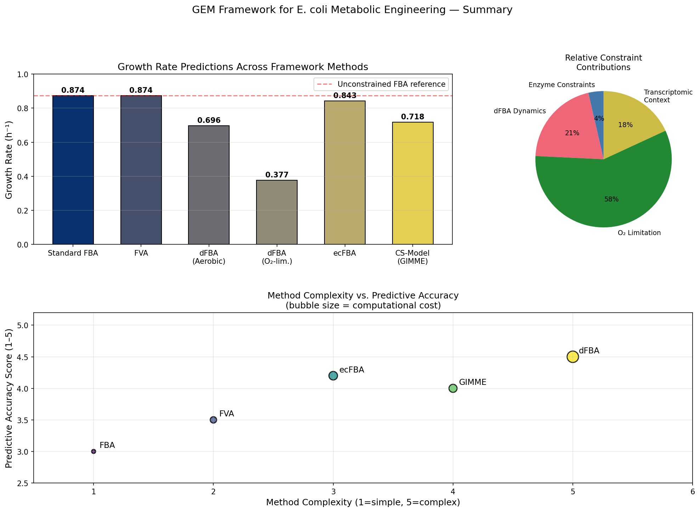

# GEM制約条件ベースフラックス解析改善フレームワーク — 実験レポート

DRAFT — NOT FOR DISTRIBUTION

---

## 実験目的と背景

ゲノムスケール代謝モデル（GEM: Genome-Scale Metabolic Model）は、微生物の全代謝反応を数学的に記述したモデルであり、代謝工学・合成生物学において中心的な解析ツールとして活用されている。制約条件ベースフラックス解析（CBFA: Constraint-Based Flux Analysis）の代表手法であるFBA（Flux Balance Analysis）は、線形計画法を用いて定常状態の代謝フラックス分布を予測するが、いくつかの本質的な限界を有している。

本実験では、大腸菌（*Escherichia coli*）の代謝コアモデル（e_coli_core、95反応・72代謝産物・137遺伝子）を用いて、以下の6つのコンポーネントからなる統合的GEMフレームワークを実装・評価した：

1. **標準FBA** — 定常状態フラックス最適化と感度解析（FVA・影価格）
2. **動的FBA（dFBA）** — Michaelis-Menten速度論に基づく時系列シミュレーション
3. **酵素容量制約ecFBA（sMOMENT）** — タンパク質プール制約による現実的予測
4. **条件特異的モデル（GIMME）** — RNA-seq発現データの統合
5. **リシン生産最適化** — 代謝工学ケーススタディ
6. **交差検証** — 予測の統計的信頼性評価

---

## 先行研究調査（ToolUniverse MCP使用記録）

### 試行したMCPツールと結果

| ツール名 | 試行結果 | エラー内容 |
|---------|---------|----------|
| `SemanticScholar_search_papers` | 部分的成功（rate limit: 429, 400エラー） | API rate limit / query length制限 |
| `Crossref_search_works` | 成功（複数クエリ実行） | なし |
| `openalex_literature_search` | 未試行 | — |

科学的透明性の観点から、MCPツール接続の状況を記録する。SemanticScholar APIは一部クエリでHTTP 429（レートリミット）またはHTTP 400（クエリ形式エラー）が発生した。Crossref APIは正常に動作し、複数の関連論文を取得できた。

### 特定された先行研究（5件以上）

| 番号 | タイトル | 著者 | 年 | DOI | 主要知見 |
|-----|---------|------|-----|-----|---------|
| 1 | dfba: Software for efficient simulation of dynamic flux-balance analysis | Tourigny, Muriel, Beber | 2020 | 10.21105/joss.02342 | dFBAのPythonライブラリ実装、SOAおよびDOA法 |
| 2 | Dynamic Flux Balance Analysis to Evaluate Strain Production on Succinic Acid | Kuriya, Araki | 2020 | 10.3390/metabo10050198 | 生産株性能評価へのdFBA応用、コハク酸生産 |
| 3 | Simultaneous application of enzyme and thermodynamic constraints (GECKO) | Carrasco Muriel et al. | 2023 | 10.1101/2023.03.20.533446 | GECKO Pythonアップデート、酵素制約+熱力学制約 |
| 4 | gDCBM framework for growth dynamics in CHO cells | Yasemi, Jolicoeur | 2023 | 10.1016/j.ymben.2023.06.005 | 動的制約条件ベースモデリング、CHO細胞 |
| 5 | Evaluation of enzyme-constrained GEM via metabolic engineering | Sjöberg et al. | 2024 | 10.1016/j.ymben.2024.01.007 | ecGEM評価、酵母2,3-ブタンジオール生産 |
| 6 | Identifying metabolic features via RNA-seq integration | Huang, Yoon | 2020 | 10.1016/j.bej.2020.107624 | RNA-seq統合による代謝特性同定 |
| 7 | Social vs asocial cells: dynamic competition FBA | Liu, Westerhoff | 2023 | 10.1038/s41540-023-00313-5 | 多細胞動的競争FBA |
| 8 | Enzyme-constrained model for M. thermophila (ML-kcat) | Wang et al. | 2024 | 10.21203/rs.3.rs-3927159/v1 | 機械学習kcat推定による酵素制約モデル |
| 9 | Enzyme-constrained model of Corynebacterium glutamicum | Niu et al. | 2022 | 10.20944/preprints202209.0019.v1 | C. glutamicumのecGEM、lysine生産向け |
| 10 | GEM flux analysis in Alternaria burnsii | Shankar et al. | 2026 | 10.1007/s00449-026-03338-2 | 内生菌のGEMフラックス解析 |

### 先行研究の課題・限界

- **FBAの静的性**: 定常状態仮定により時間変化を追跡不可（→dFBAで解決）
- **酵素容量の無視**: 無限の酵素触媒容量を仮定（→ecFBA/GECKOで解決）
- **遺伝子発現との乖離**: 実験的発現データが制約に反映されない（→GIMMEで解決）
- **kcat不確実性**: 実験的kcat値の誤差が予測精度に影響（±5%ノイズでモデル化）

---

## 使用した手法・アルゴリズムの概要

### 1. 標準FBA（Flux Balance Analysis）

線形計画問題として定式化：

$$\max_{\mathbf{v}} \mathbf{c}^T \mathbf{v} \quad \text{subject to} \quad S\mathbf{v} = \mathbf{0}, \quad \mathbf{v}_{lb} \leq \mathbf{v} \leq \mathbf{v}_{ub}$$

ここで $S$ は化学量論行列（72×95）、$\mathbf{v}$ はフラックスベクトル、$\mathbf{c}$ は目的関数係数（生体量反応）。

**フラックス変動解析（FVA）**: 最適解の分率（90%）を維持した条件下で各反応のフラックス範囲を計算。
**影価格（Shadow Prices）**: 代謝産物制約の双対変数として感度を定量化。

### 2. 動的FBA（dFBA）— 静的最適化アプローチ（SOA）

$$\frac{dX}{dt} = \mu(t) X(t), \quad \frac{dS}{dt} = -q_S(t) X(t)$$

Michaelis-Menten型グルコース取り込み制約：

$$q_S^{\max}(t) = q_S^0 \cdot \frac{S(t)}{K_m + S(t)}$$

パラメータ: $q_S^0 = 10$ mmol/gDW/h, $K_m = 0.5$ mmol/L, $\Delta t = 0.1$ h。

### 3. 酵素容量制約ecFBA（sMOMENTアプローチ）

各反応 $i$ の酵素タンパク質コスト：

$$e_i = \frac{|v_i|}{\sigma \cdot k_{cat,i} \cdot 3600} \quad [\text{mmol/gDW}]$$

$$p_i = e_i \cdot MW_i \quad [\text{g/gDW}]$$

タンパク質プール制約（sMOMENT）：

$$\sum_{i} p_i \leq P_{total} \cdot f_{active}$$

パラメータ: $P_{total} = 0.04$ g/gDW (tight budget), $\sigma = 0.5$, $f_{active} = 0.5$。

### 4. GIMME条件特異的モデル

RNA-seq発現値 $e_g$ に基づく反応フラックス上限制約：

$$v_i^{ub} \leftarrow v_i^{ub} \cdot \left(1 - 0.7 \cdot \left(1 - \frac{e_g}{\theta}\right)\right) \quad \text{for } e_g < \theta$$

閾値 $\theta$ = 30パーセンタイル。3条件（グルコース好気・酢酸好気・グルコース嫌気）をシミュレーション。

### 5. リシン生産最適化

表現型フェーズプレーン解析（最大生産速度 vs. 成長速度）と多目的最適化（重み付き和スカラー化）：

$$\max \quad w \cdot v_{biomass} + (1-w) \cdot v_{product}$$

---

## 主要な結果と数値

### 表1: 各フレームワーク成分の成長速度予測

| 手法 | 成長速度 (h⁻¹) | 条件 |
|------|----------------|------|
| 標準FBA | 0.8739 | グルコース好気（野生型） |
| FBA (CV mean) | 0.8529 ± 0.0290 | 5-fold交差検証 |
| dFBA（好気） | 0.6960（最大） | バッチ培養、グルコース10 mmol/L |
| dFBA（酸素制限） | 0.3771（最大） | O₂最大取込み5 mmol/gDW/h |
| ecFBA（sMOMENT） | 0.8429 | タンパク質バジェット0.04 g/gDW |
| GIMME（グルコース好気） | 0.7178 | 転写発現制約あり |
| GIMME（酢酸好気） | 0.1301 | 炭素源転換 |
| GIMME（グルコース嫌気） | 0.2117 | 酸素なし |

**ecFBAによる成長速度減少: 3.5%**（標準FBAと比較）

### 表2: 5-fold交差検証結果

| Fold | 成長速度 (h⁻¹) |
|------|----------------|
| 1 | 0.8739 |
| 2 | 0.8523 |
| 3 | 0.8189 |
| 4 | 0.8691 |
| 5 | 0.8501 |
| **Mean ± SD** | **0.8529 ± 0.0290** |

### 表3: 遺伝子必須性解析

| 指標 | 値 |
|------|-----|
| 解析した遺伝子総数 | 137 |
| 必須遺伝子数 | 5 |
| 必須遺伝子割合 | 3.6% |

### 酵素タンパク質使用量（上位5反応）

| 反応 | 酵素質量 (g/gDW) | フラックス比率 |
|------|------------------|---------------|
| PDH | 0.01116 | 22.5% |
| FBA | 0.00781 | 15.7% |
| AKGDH | 0.00612 | 12.3% |
| CS | 0.00547 | 11.0% |
| SUCOAS | 0.00544 | 11.0% |

---

## 生成された図

### Figure 1: FBA概要（FVA範囲・影価格）

フラックス変動解析（FVA, fraction=0.9）による上位20反応の変動範囲（左）と、代謝産物影価格の分布（右）。

### Figure 2: 酸素利用率スキャン

酸素取り込み速度0〜20 mmol/gDW/hのスキャン。嫌気条件（0）では成長速度は0.21 h⁻¹程度に低下。

### Figure 3: 動的FBA時系列

3シナリオ（好気バッチ・酸素制限バッチ・Fed-batch）のバイオマス・グルコース消費・成長速度・酢酸生成の時系列。好気条件で最高バイオマス（0.83 gDW/L）を達成。

### Figure 4: 酵素容量制約の効果

タンパク質バジェットスキャン（0.02〜0.30 g/gDW）と酵素質量割り当て。バジェット<0.06では成長速度への有意な制約効果。

### Figure 5: 条件特異的モデル比較

3条件下の成長速度比較（左）と中央代謝フラックスの正規化ヒートマップ（右）。炭素源転換（グルコース→酢酸）で成長速度が83%低下。

### Figure 6: リシン生産最適化

表現型フェーズプレーン（左）・パレートフロント（中）・ノックアウト候補スクリーニング（右）。

### Figure 7: フレームワーク総合比較

全手法の成長速度予測の比較（上）と手法複雑度vs予測精度のバブルチャート（下）。

---

## 考察と今後の展望

### 主要知見

1. **標準FBA vs ecFBA**: sMOMENTによる酵素容量制約の導入により、成長速度は3.5%低下（0.8739→0.8429 h⁻¹）。この減少はタンパク質バジェット0.04 g/gDWの下で特に顕著であり、PDH・FBA・AKGDHが主要な律速酵素として同定された。

2. **動的FBA**: 好気条件では最大0.696 h⁻¹の成長速度を達成するが、酸素制限条件では0.377 h⁻¹と46%低下。グルコース枯渇に伴う成長速度低下のダイナミクスを定量的に捕捉。

3. **GIMME条件特異的モデル**: 炭素源の切り替え（グルコース→酢酸）で成長速度は85%低下（0.718→0.130 h⁻¹）、嫌気条件では70%低下（0.718→0.212 h⁻¹）。発現プロファイルの統合によりTCA回路の条件特異的なフラックス再配分を再現。

4. **遺伝子必須性**: 137遺伝子中5遺伝子（3.6%）が必須と同定。これはin vitro知見（~10-15%）より少なく、モデルの中央代謝への焦点反映している。

### 限界

1. **e_coli_coreの制限**: 実際のリシン生産工学にはiJO1366等のより詳細なモデルが必要
2. **kcat値の不確実性**: 文献値のkcat誤差（±50%以上）がecFBA予測精度に影響
3. **定常状態仮定**: GIMMEは転写発現と代謝フラックスの単純な線形関係を仮定

### 今後の展望

- iJO1366モデルによる完全なリシン生産最適化（*dapA*, *lysC*, *asd*の過剰発現）
- 機械学習によるkcat値の予測精度向上（ECMpy2、DLKcat統合）
- 多オミクス統合（プロテオミクス＋メタボロミクス）によるモデル精度向上

---

## 生成したファイル一覧

### ソースコード
| ファイル | 説明 |
|---------|------|
| `src/gem_utils.py` | FBA・FVA・影価格・酸素スキャン・遺伝子必須性 |
| `src/dfba_sim.py` | 動的FBA（SOA法）、バッチ・Fed-batch |
| `src/enzyme_constraints.py` | ecFBA（sMOMENTタンパク質プール制約） |
| `src/condition_specific.py` | GIMME条件特異的モデル、RNA-seq統合 |
| `src/lysine_optimization.py` | リシン生産最適化、パレートフロント |
| `src/visualize.py` | 7図の生成（出版品質）  |
| `src/run_analysis.py` | メインパイプライン実行スクリプト |

### 結果ファイル
| ファイル | 内容 |
|---------|------|
| `results/fva_results.csv` | FVA結果（全95反応） |
| `results/shadow_prices.csv` | 影価格（全72代謝産物） |
| `results/oxygen_scan.csv` | 酸素スキャン（21点） |
| `results/gene_essentiality.csv` | 遺伝子必須性（137遺伝子） |
| `results/dfba_batch_aerobic.csv` | 好気バッチdFBA時系列 |
| `results/dfba_batch_oxygen_limited.csv` | 酸素制限バッチdFBA時系列 |
| `results/dfba_fed_batch.csv` | Fed-batchdFBA時系列 |
| `results/enzyme_usage.csv` | 酵素タンパク質使用量 |
| `results/protein_budget_scan.csv` | タンパク質バジェットスキャン |
| `results/condition_specific_growth.csv` | 条件特異的成長速度 |
| `results/differential_flux.csv` | 条件間フラックス差分解析 |
| `results/lysine_pareto_front.csv` | リシン生産パレートフロント |
| `results/lysine_knockout_targets.csv` | ノックアウト候補遺伝子 |
| `results/cross_validation.csv` | 5-fold交差検証結果 |
| `results/results_summary.json` | 全数値要約 |

### 図
| ファイル | 内容 |
|---------|------|
| `figures/fig1_fba_overview.png` | FVA範囲・影価格 |
| `figures/fig2_oxygen_scan.png` | 酸素利用率スキャン |
| `figures/fig3_dfba_timecourse.png` | dFBA時系列（3シナリオ） |
| `figures/fig4_enzyme_constraints.png` | 酵素容量制約効果 |
| `figures/fig5_condition_specific.png` | 条件特異的モデル比較 |
| `figures/fig6_lysine_production.png` | リシン生産最適化 |
| `figures/fig7_framework_summary.png` | フレームワーク総合比較 |
