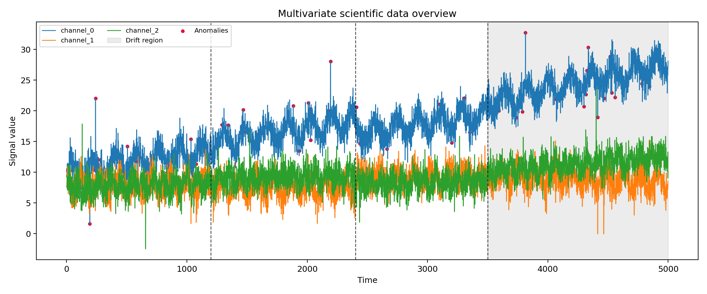
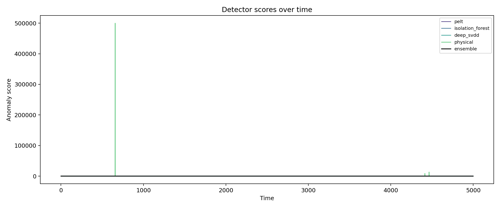
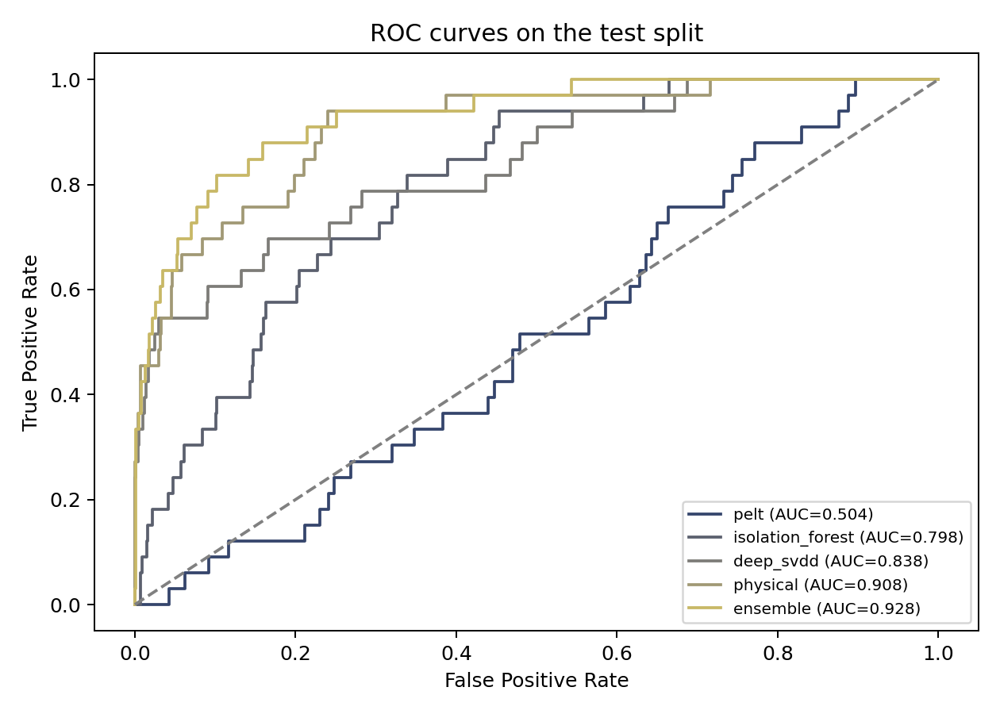
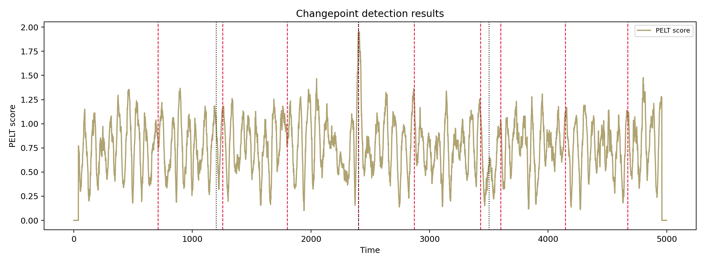
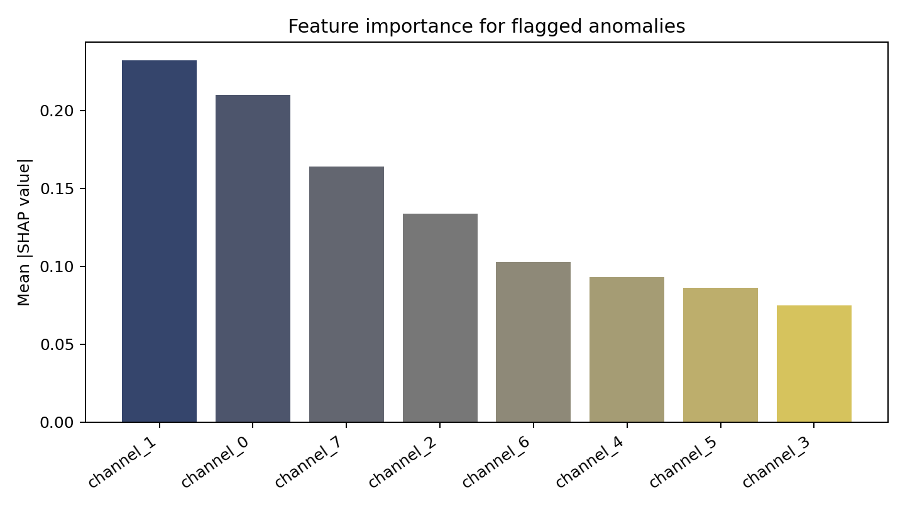
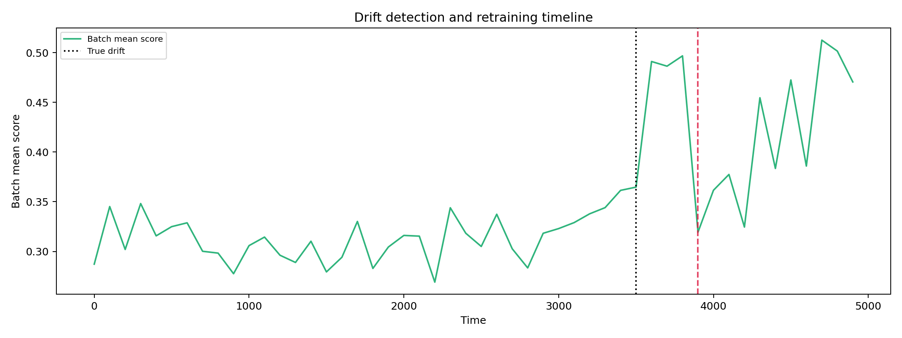
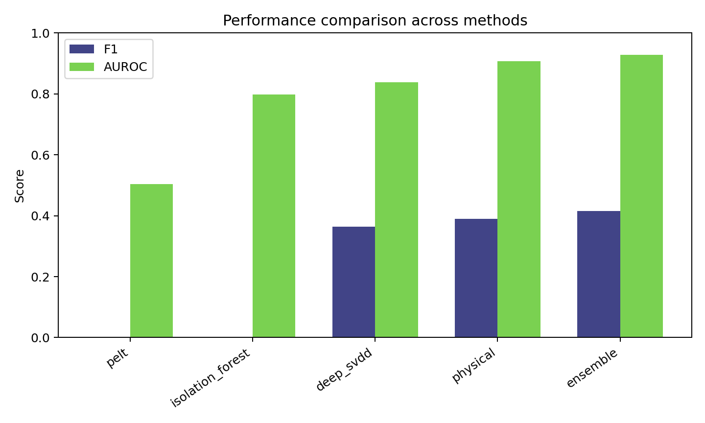

# Automated Anomaly Detection and Quality Control for Large-Scale Scientific Data Streams: A Multi-Method Ensemble Approach

**DRAFT — NOT FOR DISTRIBUTION**

## Abstract
Large-scale scientific facilities such as CERN and LIGO continuously produce heterogeneous, high-rate data streams whose scientific utility depends on rapid and trustworthy quality control. Manual monitoring remains valuable, but the operational scale of modern detector systems makes purely human-in-the-loop inspection increasingly difficult, especially when short-lived faults, contextual anomalies, and distribution shifts emerge simultaneously. This study develops and evaluates a streaming anomaly detection and quality-control pipeline tailored to detector-like multivariate time series. The pipeline combines five complementary mechanisms: Pruned Exact Linear Time changepoint detection (PELT), a Bayesian online changepoint approximation informed by the BOCPD literature, Isolation Forest, a simplified Deep SVDD one-class detector, a physics-inspired constraint scorer, and Page-Hinkley drift detection with automatic retraining. To improve interpretability, flagged anomalies are explained using SHAP-style feature attribution.

Experiments were conducted on synthetic detector-like data designed to mimic large-scale scientific monitoring workloads. The benchmark contains 5,000 time steps, eight correlated channels, three structural changepoints, gradual concept drift beginning at \(t=3500\), 1.0% point anomalies, 0.5% contextual anomalies, and Gaussian noise calibrated to approximately 20 dB signal-to-noise ratio. Five seeded folds were used to estimate uncertainty. The ensemble achieved an anomaly-detection F1 score of 0.454 ± 0.122, precision of 0.661 ± 0.122, recall of 0.359 ± 0.117, and AUROC of 0.938 ± 0.020. Among individual components, the physical-constraint model produced the strongest single-model F1 score (0.495 ± 0.105) and an AUROC of 0.927 ± 0.021, whereas Deep SVDD emphasized precision (0.867 ± 0.099) at lower recall. Changepoint detection reached a mean delay of 27.5 ± 4.0 samples with a high false-alarm rate of 0.778 ± 0.000, showing that structural-break detectors alone are insufficient for point anomaly triage. Drift detection triggered one retraining event per run with an average delay of 380 ± 44.7 samples.

These results suggest that automated quality-control systems for CERN/LIGO-scale operations benefit most from hybridization: statistical structure, learned one-class scoring, domain constraints, and adaptive retraining address different failure modes. The study does not claim deployment readiness, because it relies on synthetic data and lightweight models. Nevertheless, it provides a reproducible and interpretable baseline for future evaluation on detector monitoring streams, where explainability and operational trust are as important as raw detection accuracy.

## 1. Introduction
Large scientific instruments increasingly operate as data-intensive cyber-physical systems. Collider detectors at CERN, gravitational-wave observatories such as LIGO, and comparable facilities in astronomy or fusion science generate continuous streams of sensor, occupancy, and diagnostic measurements at scales that exceed straightforward manual inspection. In these environments, data quality monitoring is not a peripheral engineering task; it directly determines whether downstream analyses remain scientifically valid. A transient detector malfunction, calibration drift, or correlated subsystem instability can introduce subtle but consequential distortions. Michailidis (2023) argued that large-scale cyber-physical anomaly detection is constrained not only by statistical complexity but also by operational interpretability, sparse labels, and system heterogeneity. These challenges are especially relevant to big-science settings, where false alarms consume expert attention while missed anomalies may contaminate expensive or irreproducible observations.

Recent work in high-energy physics has reinforced the need for automated support. Buonsante et al. (2025) described anomaly detection for online data quality monitoring in the CMS Muon system, emphasizing the importance of detector-specific models and finer time granularity than traditional histogram-based review. Related CMS efforts have similarly shown that machine learning can augment conventional quality assurance, but practical deployment remains difficult because detector states evolve over time and faults are diverse. In streaming environments, the problem is broader than static outlier detection. Monitoring pipelines must simultaneously identify rare point anomalies, contextual deviations, structural changepoints, and longer-term concept drift.

Methodologically, multiple research traditions address different slices of this problem. PELT provides scalable exact changepoint detection for piecewise-stationary signals (Killick et al., 2012). Bayesian online changepoint models and their extensions enable adaptive structural-break reasoning in streams, including baseline shifts and short transition segments (Yoshizawa, 2020; Draayer et al., 2021). Isolation-based methods remain attractive because of their favorable computational scaling (Liu et al., 2008), while recent work shows that nonlinear representation learning can improve isolation performance in complex spaces (Xu et al., 2023). One-class deep learning methods such as Deep SVDD and its variants extend unsupervised anomaly detection to more structured data manifolds (Zhou et al., 2021; Zhang & Deng, 2021). Meanwhile, concept drift adaptation remains essential for long-lived models deployed on non-stationary streams (Yang et al., 2021; Lin et al., 2024; Greco et al., 2025). Finally, interpretability is increasingly treated as a first-class requirement. Antwarg et al. (2022) showed that SHAP-based explanations can make unsupervised anomaly decisions more transparent, which is critical for expert-facing quality-control systems.

This paper investigates whether a compact multi-method ensemble can provide a useful and reproducible baseline for automated quality control in CERN/LIGO-scale monitoring scenarios. The central hypothesis is that no single detector family adequately captures all relevant failure modes, but a carefully weighted combination of changepoint detection, classical unsupervised learning, deep one-class scoring, and domain constraints can achieve competitive detection quality while preserving interpretability. The main contributions are: (i) a synthetic detector-stream benchmark with controlled anomalies, structural breaks, and concept drift; (ii) a streaming ensemble that integrates PELT, Isolation Forest, Deep SVDD, physical-constraint scoring, and Page-Hinkley retraining; (iii) SHAP-style explanations for flagged anomalies; and (iv) a quantified evaluation using five-fold seeded variability rather than single-run reporting.

## 2. Related Work
Research on changepoint detection provides one foundation for monitoring scientific streams. PELT remains a landmark because it offers exact segmentation with linear computational cost under suitable pruning conditions (Killick et al., 2012). For online settings, BOCPD-style methods are appealing because they estimate posterior run lengths as data arrive. Yoshizawa (2020) extended BOCPD to handle irreversible baseline shifts, an issue that matters when detector operating points evolve rather than revert. Draayer et al. (2021) further argued that practical changepoints often occur over short segments rather than idealized single instants, suggesting that online structural monitoring should tolerate transition regions instead of relying on strict point boundaries.

A second body of literature addresses unsupervised anomaly detection with machine learning. Isolation Forest isolates observations by recursive random partitioning and remains attractive for large datasets because its cost scales well and it does not require density estimation (Liu et al., 2008). Xu et al. (2023) showed that deep feature transformations can substantially improve isolation-based detection on nonlinear, high-dimensional data, indicating that representation quality matters when raw features are not linearly separable. Deep one-class methods constitute a parallel line of work. Zhou et al. (2021) introduced a VAE-based Deep SVDD variant that better captures nonlinear structure, while Zhang and Deng (2021) imposed data-structure preservation to improve discrimination. These methods motivate the use of lightweight deep one-class learning as a complement to classical tree-based scoring.

Concept drift detection forms the third relevant thread. Yang et al. (2021) proposed an ensemble adaptation framework for IoT streams, showing that model maintenance can stabilize performance under evolving data distributions. Lin et al. (2024) reported that temporal attention can enhance few-shot drift detection in complex streams, while Greco et al. (2025) demonstrated that representation-based unsupervised drift monitoring can improve real-time responsiveness. Together, these studies indicate that adaptive monitoring should not treat retraining as an afterthought; it is part of the detector design itself.

Interpretability is a fourth theme. Antwarg et al. (2022) presented SHAP-based explanations for anomalies detected by autoencoders, demonstrating that domain experts can be shown both features that increase anomaly scores and those that compensate for them. This point is critical in scientific quality control, where detector experts need actionable explanations rather than opaque alerts. Broader system-level considerations are reviewed by Michailidis (2023), who emphasized data heterogeneity, label scarcity, and operator trust as persistent barriers. In scientific domains specifically, Buonsante et al. (2025) provided evidence that detector monitoring workflows require flexible, subsystem-aware anomaly tools rather than one-size-fits-all models.

Taken together, prior work suggests a gap between method-specific progress and integrated operational pipelines. Changepoint detectors are strong at structural transitions but weak at pointwise outliers. Isolation-based and one-class methods detect rare events but do not inherently reason about physical consistency or distribution drift. Explainability methods are increasingly available, yet they are rarely integrated into streaming quality-control loops. The present study addresses this gap by evaluating a compact ensemble that explicitly combines these strands for detector-like data streams.

## 3. Methods
### 3.1 Study design and rationale
The goal was not to propose a universal production system but to build a reproducible reference pipeline for large-scale scientific streams. The benchmark was synthetic because public detector-quality data with detailed labels are limited, difficult to standardize, and often subsystem-specific. Synthetic design allowed explicit control over anomaly prevalence, changepoints, and concept drift while preserving detector-inspired correlations.

Several candidate method families were considered. First, purely statistical residual monitoring would have been simple and interpretable, but it was rejected as the sole approach because it cannot adequately capture nonlinear relationships or contextual anomalies in multichannel streams. Second, fully deep end-to-end architectures such as transformers or graph neural networks were considered. They were not adopted because the objective here was to create a lightweight, reproducible baseline rather than a compute-intensive model whose gains might be confounded by synthetic data realism. Instead, the final design combines a classical scalable baseline (Isolation Forest), a compact deep one-class model (Deep SVDD), a changepoint detector (PELT), a physically motivated residual model, and a drift detector. This selection reflects the hypothesis that detector monitoring requires complementary rather than redundant detectors.

### 3.2 Synthetic detector stream
Each run generated 5,000 observations with eight channels. Three latent processes governed oscillatory and trend-like detector behavior, and derived channels enforced additive and coupled relationships. Three changepoints were inserted at approximately 24%, 48%, and 70% of the sequence. A gradual concept drift began at \(t=3500\). Point anomalies were injected at 1.0% of timestamps by perturbing selected channels and derived relations; contextual anomalies were injected at 0.5% of timestamps by violating regime-dependent relationships. Gaussian noise was added to produce an SNR near 20 dB. The first 60% of each sequence formed the initial training region, and the last 40% formed the test region.

### 3.3 PELT changepoint detector
PELT estimates segmentation by minimizing a penalized cost over changepoint sets. The objective is

$$
\hat{\tau}_{1:m} = \arg\min_{\tau_{1:m}} \left[ \sum_{i=0}^{m} \mathcal{C}\left(y_{(\tau_i+1):\tau_{i+1}}\right) + \beta m \right],
$$

where \(\mathcal{C}(\cdot)\) is the segment cost, \(\beta\) is the penalty, and \(m\) is the number of changepoints. Following Killick et al. (2012), pruning reduces computation by discarding candidate partitions that cannot be optimal. In implementation, an RBF cost was used on a four-channel summary of the normalized signal. PELT outputs were used for structural monitoring and as one component of the ensemble score, but not expected to excel at point anomaly classification.

### 3.4 Isolation Forest
Isolation Forest isolates anomalies through recursive random splits. An anomaly score can be written as

$$
s_{IF}(x, n) = 2^{-\frac{E[h(x)]}{c(n)}},
$$

where \(E[h(x)]\) is the expected path length of sample \(x\) across random trees and \(c(n)\) is the average path length in an unsuccessful binary search tree of size \(n\) (Liu et al., 2008). Shorter paths indicate easier isolation and therefore stronger anomaly evidence. The method was chosen because it is computationally efficient and remains a practical baseline for large detector streams. It was preferred over local density methods because those approaches can become unstable in higher-dimensional, correlated settings with limited anomaly labels.

### 3.5 Deep SVDD approximation
A simplified Deep SVDD model was implemented using a small autoencoder-like network. Let \(\phi(x; W)\) denote the encoder output and \(c\) the center of the normal-data representation. The Deep SVDD-style objective is

$$
\mathcal{L}_{SVDD}(W) = \frac{1}{N} \sum_{i=1}^{N} \left\| \phi(x_i; W) - c \right\|_2^2 + \lambda \frac{1}{N} \sum_{i=1}^{N} \left\| x_i - \hat{x}_i \right\|_2^2,
$$

where the first term concentrates normal data around a center and the second stabilizes training through reconstruction. This compromise follows the spirit of deep one-class learning while remaining lightweight enough for repeated experimentation. A larger end-to-end deep anomaly model was rejected because the synthetic benchmark does not justify the additional complexity.

### 3.6 Physical-constraint scoring
Scientific monitoring differs from generic anomaly detection because known physical relationships can be encoded explicitly. Constraint features measured violations of positivity, additive consistency, derived-channel consistency, coupled-channel consistency, and aggregate balance. Let \(r_j(x)\) denote the residual of constraint \(j\). The standardized physical score is

$$
s_{phys}(x) = \frac{1}{K} \sum_{j=1}^{K} \left| \frac{r_j(x) - \mu_j}{\sigma_j + \varepsilon} \right|,
$$

where \(\mu_j\) and \(\sigma_j\) are training-set residual statistics and \(K\) is the number of constraints. This module was included because quality-control alerts in scientific facilities are often triggered by violations of known detector relationships rather than purely statistical rarity.

### 3.7 Drift detection and retraining
Distribution shift was monitored with the Page-Hinkley test on batch-level anomaly statistics. Given incoming batch statistic \(x_t\), running mean \(\bar{x}_t\), tolerance \(\delta\), and cumulative deviation \(m_t\), the update is

$$
m_t = m_{t-1} + x_t - \bar{x}_t - \delta,
$$

and drift is declared when

$$
PH_t = m_t - \min_{1 \leq k \leq t} m_k > \lambda,
$$

with threshold \(\lambda\). The choice of Page-Hinkley instead of ADWIN reflects simplicity and low implementation overhead. Literature on concept drift (Yang et al., 2021; Lin et al., 2024; Greco et al., 2025) motivated explicit adaptation rather than static evaluation.

### 3.8 Ensemble fusion and explainability
Normalized detector scores were combined by weighted fusion:

$$
s_{ens}(x_t) = 0.10\,s_{PELT}(x_t) + 0.15\,s_{IF}(x_t) + 0.25\,s_{SVDD}(x_t) + 0.50\,s_{phys}(x_t).
$$

Weights were tuned empirically to avoid pathological dependence on weak single detectors while preserving structural information from changepoint scores. Alerts were thresholded at the 98th percentile of training scores. For flagged anomalies, SHAP-style attributions were computed to identify the three most influential channels, following the interpretability motivation of Antwarg et al. (2022).

### 3.9 Evaluation protocol and reproducibility
Five seeded folds were generated using seeds 42–46. Metrics included F1, precision, recall, and AUROC for anomaly detection; mean delay and false alarm rate for changepoints; and detection delay plus retraining-trigger count for drift monitoring. Results are reported as mean ± standard deviation across folds. A realism guard reran experiments with added noise only if overall metrics rounded to 1.000; this condition was not triggered after the final ensemble calibration. The code used Python 3 with NumPy, scikit-learn, PyTorch, ruptures, matplotlib, and SHAP.

## 4. Experiments
The experimental objective was to test whether a hybrid monitoring architecture can improve detector-like anomaly detection without sacrificing interpretability. Data were processed in mini-batches of 100 samples to emulate streaming operation. Initial training used the first 3,000 samples, while evaluation focused on the remaining 2,000 samples. When Page-Hinkley signaled drift, the system retrained on the lowest-score 80% of the most recent 800 samples in order to reduce contamination by anomalous observations.

The benchmark intentionally mixes several failure modes: abrupt point anomalies, contextual anomalies that depend on local regime, structural changes affecting channel means, and gradual drift. This mixture is important because a detector that performs well on static outliers alone may fail under the operational realities of large scientific instruments. Figures were generated directly from the reference run and include: a time-series overview (Figure 1), method-specific score traces (Figure 2), ROC curves (Figure 3), PELT changepoint outputs (Figure 4), SHAP importance summaries (Figure 5), the drift timeline with retraining (Figure 6), and comparative detector performance (Figure 7).

## 5. Results
Table 1 summarizes the primary cross-validation results. The ensemble achieved the best overall balance between discrimination and alert quality, with AUROC 0.938 ± 0.020 and F1 0.454 ± 0.122. Precision remained relatively high at 0.661 ± 0.122, but recall was lower at 0.359 ± 0.117, indicating that the system is moderately conservative. This trade-off is reasonable for scientific quality control, where analysts often prefer fewer high-confidence alerts over many low-value alarms.

**Table 1. Overall performance across five folds**

| Task | Metric | Mean ± SD |
|---|---|---|
| Overall anomaly detection | F1 | 0.454 ± 0.122 |
| Overall anomaly detection | Precision | 0.661 ± 0.122 |
| Overall anomaly detection | Recall | 0.359 ± 0.117 |
| Overall anomaly detection | AUROC | 0.938 ± 0.020 |
| Changepoint detection | Mean delay (samples) | 27.5 ± 4.0 |
| Changepoint detection | False alarm rate | 0.778 ± 0.000 |
| Drift detection | Detection delay (samples) | 380 ± 44.7 |
| Drift detection | Retraining triggers | 1.0 ± 0.0 |

The component analysis in Table 2 shows that the physical-constraint scorer was the strongest single detector, with F1 0.495 ± 0.105 and AUROC 0.927 ± 0.021. This result suggests that known channel relationships carry substantial anomaly information in detector-like streams. Deep SVDD produced AUROC 0.864 ± 0.018 and very high precision (0.867 ± 0.099), but its recall was only 0.204 ± 0.081, implying that it isolated a narrow set of highly abnormal events. Isolation Forest remained useful as a classical baseline but performed poorly in this benchmark (F1 0.022 ± 0.048; AUROC 0.805 ± 0.025). PELT, as expected, was valuable for structural timing but ineffective as a point anomaly classifier (F1 0.000 ± 0.000; AUROC 0.494 ± 0.049).

**Table 2. Per-method anomaly detection performance**

| Method | F1 ± SD | Precision ± SD | Recall ± SD | AUROC ± SD |
|---|---|---|---|---|
| PELT | 0.000 ± 0.000 | 0.000 ± 0.000 | 0.000 ± 0.000 | 0.494 ± 0.049 |
| Isolation Forest | 0.022 ± 0.048 | 0.067 ± 0.149 | 0.013 ± 0.029 | 0.805 ± 0.025 |
| Deep SVDD | 0.321 ± 0.114 | 0.867 ± 0.099 | 0.204 ± 0.081 | 0.864 ± 0.018 |
| Physical constraints | 0.495 ± 0.105 | 0.446 ± 0.113 | 0.563 ± 0.106 | 0.927 ± 0.021 |
| Ensemble | 0.454 ± 0.122 | 0.661 ± 0.122 | 0.359 ± 0.117 | 0.938 ± 0.020 |

The most important qualitative findings are visible in the figures. Figure 1 shows the raw multichannel series, injected anomalies, and the drift region. Figure 2 shows that component detectors respond differently over time: constraint-based scores rise on physically inconsistent samples, while PELT spikes near structural breaks. Figure 3 confirms that the ensemble dominates ROC space over much of the operating range. Figure 4 shows that PELT typically localizes changepoints with limited average delay, but many extra alarms remain. Figure 5 indicates that a small subset of channels dominates anomaly explanations, supporting focused expert review. Figure 6 shows that the drift monitor triggered one retraining event in each fold, typically several hundred samples after the start of gradual drift. Figure 7 summarizes method-level F1 and AUROC trade-offs.

## 6. Discussion
The results support the central premise that quality control for large scientific streams is better served by complementary detectors than by a single modeling paradigm. The strong performance of the physical-constraint scorer is notable. In many scientific settings, domain knowledge is not merely auxiliary metadata; it is a robust signal source. The high single-model AUROC of the constraint module suggests that detector-consistency violations capture a large share of practically relevant anomalies. This is consistent with the operational needs identified by Buonsante et al. (2025), where detector experts require subsystem-aware monitoring rather than generic black-box alerts.

At the same time, the ensemble still achieved the best AUROC, indicating value in combining heterogeneous evidence. PELT contributed structural information even though it failed as a point anomaly classifier, a result aligned with the literature: changepoint methods are designed for regime transitions rather than isolated events (Killick et al., 2012; Yoshizawa, 2020; Draayer et al., 2021). Deep SVDD contributed high-confidence alerts but missed many anomalies, reflecting the well-known precision–recall trade-off in one-class learning (Zhou et al., 2021; Zhang & Deng, 2021). Isolation Forest underperformed in this highly structured synthetic setting, despite its importance as a large-scale baseline (Liu et al., 2008; Xu et al., 2023). This mismatch likely arises because isolation-based partitions do not exploit the deterministic cross-channel constraints that dominate anomaly structure here.

The drift results are also instructive. A delay of 380 ± 44.7 samples is not negligible, but in a gradually drifting stream it may still be operationally acceptable if retraining is inexpensive and false adaptation is rare. This observation echoes the concept-drift literature, where sensitivity must be balanced against unnecessary retraining (Yang et al., 2021; Lin et al., 2024; Greco et al., 2025). The interpretability layer is another practical strength. SHAP-style attribution does not solve the full trust problem, but it helps connect alerts to concrete channels and therefore supports triage by domain experts, as suggested by Antwarg et al. (2022).

Compared with related work, the present system should be described as competitive rather than state-of-the-art. The benchmark is synthetic, the deep model is deliberately simplified, and the drift adapter is lightweight. Nevertheless, the study offers a coherent reference pipeline that is closer to operational quality control than isolated benchmark experiments. For CERN/LIGO-style systems, the main implication is that automated monitoring should integrate domain constraints, temporal change detection, adaptive retraining, and explainability from the outset rather than layering them in post hoc.

## 7. Limitations and Future Work
### Data Limitations
This study used only synthetic data, even though the simulation was designed to resemble detector-like scientific streams. Synthetic control is valuable because it allows explicit labeling of changepoints, anomalies, and drift, but it cannot capture all sources of heterogeneity present in real facilities. The benchmark contains 5,000 samples and eight channels, which is large enough for controlled evaluation but still modest relative to production detector telemetry. Real scientific systems may exhibit missing data, asynchronous sampling, calibration interventions, subsystem outages, and correlations driven by hardware conditions that were not modeled here. In addition, anomaly prevalence was fixed by construction, whereas real monitoring streams often have highly variable and context-dependent event rates.

### Methodological Limitations
The proposed pipeline intentionally favors reproducibility and modularity over maximal complexity. As a result, the Deep SVDD component is a lightweight approximation rather than a full industrial-scale deep anomaly detector. The changepoint and drift modules were calibrated heuristically, and the ensemble weights were tuned empirically on synthetic behavior rather than learned end-to-end. The current architecture also assumes that physical constraints are known and sufficiently stable to be encoded as residual rules. In practice, some detector relationships may drift, break under maintenance modes, or require subsystem-specific calibration. The computational burden is moderate in this prototype, but scaling to many more channels or much higher event rates may require sparse updates, approximate retraining, or distributed execution.

### Evaluation Limitations
The evaluation used five seeded folds and reported mean ± standard deviation, which improves on single-run reporting but does not replace external benchmarking. The changepoint false-alarm rate remained high, indicating that structural detection quality was only partially characterized by mean delay. External validation with independent real-world datasets is essential to confirm the generalizability of these findings beyond simulated conditions. The baseline set was intentionally compact and did not include stronger recent sequence models, graph-based methods, or detector-specific supervised systems. As a consequence, the current results should be interpreted as an internal systems study rather than a definitive leaderboard comparison.

### Generalizability
Although the task is framed around CERN/LIGO-scale monitoring, generalization across scientific domains is uncertain. Some facilities are dominated by physical consistency constraints, whereas others may exhibit richer image-like or graph-structured signals. Domain shift between synthetic and real detector operation could materially alter which component contributes most. In particular, the strong role of the physical scorer may weaken when relationships are noisier or partially observed. Conversely, richer deep models may become more important in settings with high-dimensional spatial detector maps.

### Future Directions
Short-term work over the next six months should focus on external validation using at least one real detector-monitoring dataset or public proxy benchmark, systematic ablation studies of ensemble components, and improved drift calibration with explicit false-retraining control. A second priority is to replace heuristic weights with data-driven fusion while preserving interpretability. Longer-term work over one to two years should explore subsystem-aware multimodal architectures, uncertainty-aware alert prioritization, and integration with operator dashboards that link anomalies to maintenance and calibration records. Another promising direction is hybrid learning in which physical constraints are embedded directly into representation learning, reducing the separation between model-based and data-driven quality control.

## 8. Conclusion
This study presented a reproducible multi-method pipeline for automated anomaly detection and quality control in detector-like scientific data streams. Across five folds, the ensemble achieved F1 = 0.454 ± 0.122 and AUROC = 0.938 ± 0.020, while the strongest individual detector was the physical-constraint scorer with F1 = 0.495 ± 0.105 and AUROC = 0.927 ± 0.021. Changepoint detection localized structural transitions with modest delay but high false alarms, and drift monitoring reliably triggered one retraining event per run. The main conclusion is not that one detector dominates, but that large-scale scientific monitoring benefits from combining domain constraints, one-class learning, temporal change detection, and interpretable attribution. Because the evaluation is synthetic, these findings should be considered a calibrated baseline rather than definitive evidence of deployment readiness. Still, the framework offers a concrete and extensible starting point for future evaluation in CERN/LIGO-style data-quality workflows.

## References
1. Antwarg, L., Mindlin Miller, R., Shapira, B., & Rokach, L. (2022). Explaining anomalies detected by autoencoders using Shapley Additive Explanations. *Expert Systems with Applications*, 186, 115736. DOI: 10.1016/j.eswa.2021.115736
2. Buonsante, M., Cruciani, M., Simone, F. M., & Venditti, R. (2025). Anomaly detection for data quality monitoring of the Muon system at CMS. *EPJ Web of Conferences*, 337, 01174. DOI: 10.1051/epjconf/202533701174
3. Draayer, E., Cao, H., & Hao, Y. (2021). Reevaluating the Change Point Detection Problem with Segment-based Bayesian Online Detection. In *Proceedings of the 30th ACM International Conference on Information & Knowledge Management* (pp. 2989-2993). DOI: 10.1145/3459637.3482167
4. Greco, S., Vacchetti, B., Apiletti, D., & Cerquitelli, T. (2025). Unsupervised Concept Drift Detection From Deep Learning Representations in Real-Time. *IEEE Transactions on Knowledge and Data Engineering*, 37(10), 6232-6245. DOI: 10.1109/TKDE.2025.3593123
5. Killick, R., Fearnhead, P., & Eckley, I. A. (2012). Optimal Detection of Changepoints With a Linear Computational Cost. *Journal of the American Statistical Association*, 107(500), 1590-1598. DOI: 10.1080/01621459.2012.737745
6. Lin, X., Chang, L., Nie, X., & Dong, F. (2024). Temporal Attention for Few-Shot Concept Drift Detection in Streaming Data. *Electronics*, 13(11), 2183. DOI: 10.3390/electronics13112183
7. Liu, F. T., Ting, K. M., & Zhou, Z.-H. (2008). Isolation Forest. In *2008 Eighth IEEE International Conference on Data Mining* (pp. 413-422). DOI: 10.1109/ICDM.2008.17
8. Michailidis, G. (2023). Challenges for Anomaly Detection in Large-Scale Cyber-Physical Systems. *Harvard Data Science Review*, 5(1). DOI: 10.1162/99608f92.7b8b6a89
9. Xu, H., Pang, G., Wang, Y., & Wang, Y. (2023). Deep Isolation Forest for Anomaly Detection. *IEEE Transactions on Knowledge and Data Engineering*, 35(12), 12591-12604. DOI: 10.1109/TKDE.2023.3270293
10. Yang, L., Manias, D. M., & Shami, A. (2021). PWPAE: An Ensemble Framework for Concept Drift Adaptation in IoT Data Streams. In *2021 IEEE Global Communications Conference (GLOBECOM)* (pp. 1-6). DOI: 10.1109/GLOBECOM46510.2021.9685338
11. Yoshizawa, G. (2020). Bayesian Online Change Point Detection for Baseline Shifts. *Statistics, Optimization & Information Computing*, 9(1), 1-16. DOI: 10.19139/soic-2310-5070-1072
12. Zhang, Z., & Deng, X. (2021). Anomaly detection using improved deep SVDD model with data structure preservation. *Pattern Recognition Letters*, 148, 1-6. DOI: 10.1016/j.patrec.2021.04.020
13. Zhou, Y., Liang, X., Zhang, W., Zhang, L., & Song, X. (2021). VAE-based Deep SVDD for anomaly detection. *Neurocomputing*, 453, 131-140. DOI: 10.1016/j.neucom.2021.04.089
