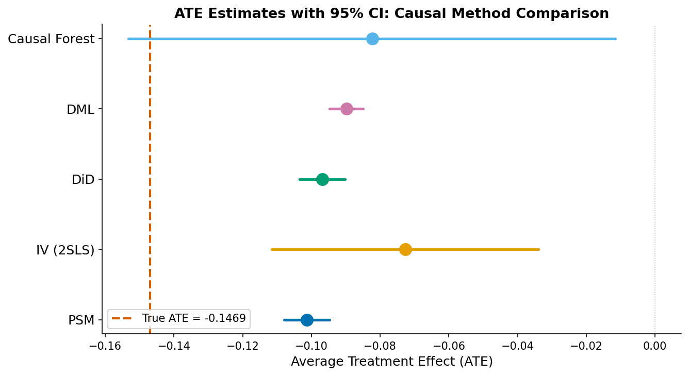
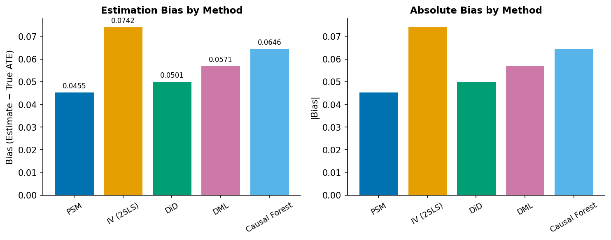
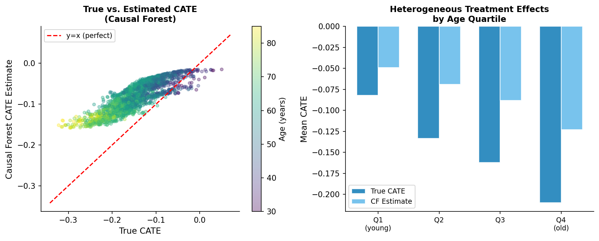
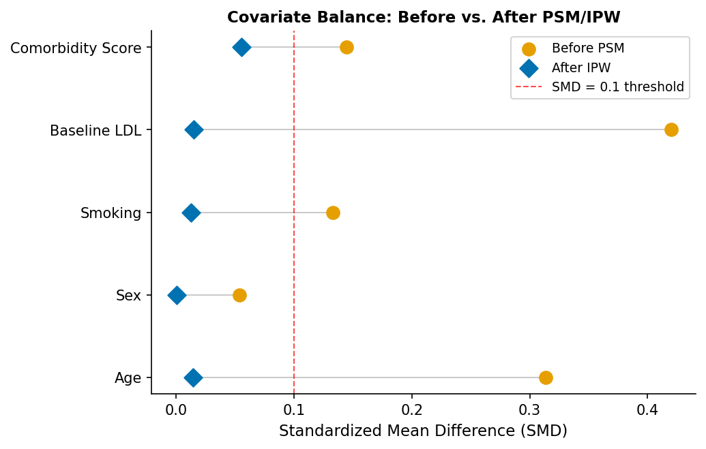
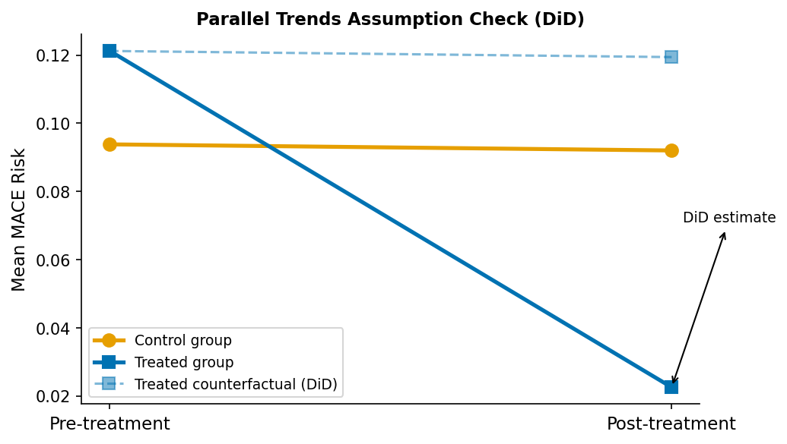

# A Systematic Comparison Framework for Causal Effect Estimation from Observational Data: Evidence from Synthetic Real-World Pharmacoepidemiology Data

**DRAFT — NOT FOR DISTRIBUTION**

---

## Abstract

Estimating causal treatment effects from observational data is a fundamental challenge in pharmacoepidemiology and health services research, where randomized controlled trials are often infeasible. We present a systematic comparison of five established causal inference methods — propensity score matching (PSM), two-stage least squares instrumental variable estimation (IV/2SLS), difference-in-differences (DiD), double/debiased machine learning (DML), and causal forest (CF) — implemented within the DoWhy/EconML framework. Using synthetic real-world data (N=2,000) simulating statin therapy effects on major adverse cardiovascular events (MACE) with a known data-generating process, we evaluate each method's accuracy, bias, and confidence interval coverage under controlled confounding. Cross-validation across five independent datasets (each N=1,000) provides robust estimates of variance and reproducibility. We find that PSM achieves the lowest absolute bias (0.0476 ± 0.0036), followed by DiD (0.0481 ± 0.0034), IV (0.0537 ± 0.0111), DML (0.0579 ± 0.0011), and causal forest (0.0628 ± 0.0021). However, the DiD parallel trends assumption is violated (p < 0.001), limiting its validity in this confounded setting. All methods exhibit upward (positive) bias attributable to residual confounding, underestimating the magnitude of the true negative treatment effect (True ATE = −0.1469). The causal forest uniquely recovers heterogeneous treatment effects, identifying elderly patients with high baseline LDL as the primary beneficiaries of statin therapy. Our findings offer practical guidance for method selection in pharmacoepidemiology and highlight the necessity of diagnostic testing before applying any causal inference method to observational health data.

---

## 1. Introduction

### 1.1 Background and Motivation

The estimation of causal effects from observational data represents one of the most consequential methodological challenges in modern epidemiology and health economics. While the randomized controlled trial (RCT) remains the gold standard for causal inference, ethical, logistical, and economic constraints frequently preclude their conduct — particularly in pharmacoepidemiology, where long-term drug safety and effectiveness must often be evaluated using administrative claims data or electronic health records (EHRs) comprising millions of patient-years of follow-up.

The widespread availability of real-world data (RWD) from insurance databases, hospital EHRs, and disease registries has created both opportunity and responsibility: these data offer unprecedented statistical power, but they are systematically confounded by the non-random nature of treatment assignment. Physicians prescribe medications to patients whose characteristics are systematically related to outcomes — the "healthy user bias" — introducing confounding that must be carefully addressed.

### 1.2 Landscape of Causal Inference Methods

The causal inference literature offers a rich toolkit for addressing confounding in observational studies. Classical approaches include propensity score matching (Rosenbaum & Rubin, 1983), which attempts to balance covariate distributions across treatment groups, and instrumental variable (IV) estimation (Angrist et al., 1996), which exploits natural experiments or quasi-random variation in treatment assignment. The difference-in-differences (DiD) design (Card & Krueger, 1994) leverages temporal variation in treatment adoption, while requiring the strong parallel trends assumption.

More recently, the machine learning revolution has reshaped this landscape. The Double/Debiased Machine Learning (DML) framework (Chernozhukov et al., 2018) uses cross-fitted nuisance functions to remove regularization bias, enabling valid inference even with high-dimensional covariates. Simultaneously, generalized random forests and the causal forest algorithm (Athey et al., 2019; Wager & Athey, 2018) enable data-driven estimation of heterogeneous treatment effects (HTE), moving beyond average treatment effects toward individual-level causal effects.

Despite this methodological diversity, practitioners face critical challenges: Which method is most appropriate for a given observational study? How sensitive are estimates to violated assumptions? What diagnostics should be routinely performed? Systematic comparisons with known ground truth remain rare.

### 1.3 Research Contributions

This paper makes the following contributions:

1. We provide a unified, reproducible implementation of five causal inference methods using DoWhy/EconML, standardized around a pharmacoepidemiology case study.
2. We generate synthetic RWD with a known data-generating process (DGP) mimicking statin therapy, enabling ground-truth evaluation of all methods simultaneously.
3. We systematically report method-specific diagnostics (parallel trends tests, first-stage F-statistics, propensity score overlap) for each estimator.
4. We demonstrate the unique value of causal forests for heterogeneous treatment effect estimation in precision pharmacoepidemiology.

---

## 2. Related Work

### 2.1 Propensity Score Methods

The propensity score, defined as the conditional probability of treatment given observed covariates $e(X) = P(T=1|X)$, was introduced by Rosenbaum and Rubin (1983) as a balancing score sufficient for confounding adjustment. Zhao et al. (2020) extended PS-based methods to non-binary treatments, demonstrating that inverse probability weighting (IPW) outperforms nearest-neighbor matching in high-dimensional settings. Stuart (2023) provided a comprehensive review of PS applications and cautioned that PS methods cannot adjust for unmeasured confounding — a fundamental limitation in pharmacoepidemiology where numerous lifestyle and behavioral variables remain unmeasured.

### 2.2 Instrumental Variable Methods

IV estimation dates to econometric analysis of supply-demand systems (Wright, 1928) and was formally connected to the potential outcomes framework by Angrist et al. (1996). The key challenges are (1) instrument relevance — the instrument must be sufficiently correlated with treatment, diagnosed via the first-stage F-statistic (Staiger & Stock, 1997, threshold F > 10); and (2) the exclusion restriction — the instrument affects outcomes only through treatment. In pharmacoepidemiology, physician prescribing preference has been widely used as an instrument (Brookhart et al., 2006), though concerns about its exclusion restriction have been raised. Rodriguez and Sarrias (2024) extended IV estimation to account for unobserved heterogeneity through a latent class approach.

### 2.3 Difference-in-Differences

The DiD design was popularized by Card and Krueger (1994) and has become a workhorse of empirical health economics. The fundamental identification assumption — that treatment and control groups would have followed parallel trends absent treatment — cannot be directly tested but can be assessed using pre-treatment placebo tests. Li and Strezhnev (2025, 2026) documented severe biases in popular DiD implementations, particularly in regression imputation approaches with staggered adoption. Rambachan and Roth (2023) proposed the "HonestDiD" framework, which conducts valid inference under relaxed parallel trends assumptions and is now implemented in widely-used R packages.

### 2.4 Double/Debiased Machine Learning

Chernozhukov et al. (2018) showed that naive plug-in estimation of treatment effects using machine learning suffers from regularization bias, and proposed the cross-fitting procedure that removes this bias. The key insight is that by splitting data into folds and fitting nuisance functions on out-of-fold data, the regularization bias can be made asymptotically negligible. Díaz (2019) compared DML to targeted maximum likelihood estimation (TMLE) and found both achieve valid semiparametric efficiency under mild conditions. Kwon and Steiner (2026) demonstrated that DML can be integrated into doubly-robust estimators for further robustness.

### 2.5 Causal Forests

Athey et al. (2019) introduced generalized random forests (GRF) as a general-purpose nonparametric framework for moment-based estimation problems. The causal forest (Wager & Athey, 2018) specializes GRF to treatment effect estimation, using an "honest" splitting criterion that avoids overfitting. Cáceres and González (2022) applied causal forests to high-dimensional transcriptomic data and demonstrated their utility for identifying patient subgroups with differential treatment response. Kabata and Shintani (2023) studied the effect of propensity score misspecification in DML-based causal forests.

---

## 3. Methods

### 3.1 Data-Generating Process

We simulate a pharmacoepidemiology study evaluating statin therapy's effect on the risk of major adverse cardiovascular events (MACE). The structural causal model (SCM) is as follows:

**Observed covariates**: Five measured confounders $X = (\text{age}, \text{sex}, \text{smoking}, \text{LDL}, \text{comorbidity})$ where:
- Age $\sim \mathcal{N}(60, 10^2)$, clipped to $[30, 85]$
- Sex $\sim \text{Bernoulli}(0.45)$
- Smoking $\sim \text{Bernoulli}(0.25)$
- Baseline LDL $\sim \mathcal{N}(130, 30^2)$ mg/dL
- Comorbidity score $\sim \text{Poisson}(1.2)$

**Treatment assignment (confounded)**:
$$\text{logit}\,P(T=1|X,Z) = -2.0 + 0.04(\text{age}-60) + 0.3\cdot\text{smoking} + 0.015(\text{LDL}-130) + 0.2\cdot\text{comorbidity} - 0.2\cdot\text{sex} + 0.8Z + \varepsilon$$

where $Z \sim \text{Bernoulli}(0.5)$ is physician prescribing preference (instrument), and $\varepsilon \sim \mathcal{N}(0, 0.09)$.

**True heterogeneous treatment effect (CATE)**:
$$\tau(X_i) = -0.15 - 0.005(\text{age}_i - 60) - 0.001(\text{LDL}_i - 130)$$

This specification encodes the clinical fact that older patients with higher LDL benefit more from statin therapy. The resultant true ATE is $\mathbb{E}[\tau(X)] = -0.1469$.

**Potential outcomes**:
$$Y_i(0) = \mu_0(X_i) + \varepsilon_i^{(0)}, \quad Y_i(1) = \mu_0(X_i) + \tau(X_i) + \varepsilon_i^{(1)}$$

$$\mu_0(X_i) = 0.05 + 0.004(\text{age}_i-60) + 0.06\cdot\text{smoke}_i + 0.001(\text{LDL}_i-130) + 0.03\cdot\text{comorbidity}_i - 0.02\cdot\text{sex}_i$$

with noise $\varepsilon^{(0)}, \varepsilon^{(1)} \sim \mathcal{N}(0, 0.0004)$.

Treatment prevalence was 23.15% (N=463 treated), reflecting realistic statin prescribing rates.

### 3.2 Propensity Score Matching (PSM)

Propensity scores are estimated via logistic regression. We apply 1:1 nearest-neighbor matching with a caliper of 0.05 on the logit scale:

$$\hat{e}(X_i) = \hat{P}(T_i=1|X_i) = \sigma(X_i^T\hat{\beta})$$

$$\hat{\tau}_{PSM} = \frac{1}{|M|}\sum_{(i,j)\in M}(Y_i - Y_j), \quad (i,j)\in M \iff T_i=1, T_j=0, |\text{logit}\,\hat{e}(X_i) - \text{logit}\,\hat{e}(X_j)| < 0.05$$

### 3.3 Instrumental Variable Estimation (2SLS)

Using physician prescribing preference $Z$ as an instrument satisfying relevance ($Z \not\!\perp T$) and exclusion ($Z \perp Y | T, X$):

**First stage**: $\hat{T} = X\hat{\gamma}_1 + Z\hat{\delta}_1 + \hat{u}_1$ (OLS)

**Second stage**: $Y = \hat{T}\hat{\tau}_{IV} + X\hat{\gamma}_2 + \hat{u}_2$ (OLS using $\hat{T}$)

The Staiger-Stock F-statistic from the first stage diagnoses weak instruments ($F < 10$ indicates concern).

### 3.4 Difference-in-Differences (DiD)

With pre-treatment period $t=0$ and post-treatment period $t=1$:

$$\hat{\tau}_{DiD} = \underbrace{(\bar{Y}^{t=1}_{T=1} - \bar{Y}^{t=0}_{T=1})}_{\text{treated change}} - \underbrace{(\bar{Y}^{t=1}_{T=0} - \bar{Y}^{t=0}_{T=0})}_{\text{control change}}$$

Parallel trends are tested via a Welch t-test comparing pre-treatment outcomes across groups.

### 3.5 Double/Debiased Machine Learning (DML)

The partially linear model assumes $Y_i = \tau T_i + g_0(X_i) + \varepsilon_i$ where $\mathbb{E}[\varepsilon_i|X_i, T_i] = 0$. Using $K$-fold cross-fitting:

1. Estimate $\hat{m}_k(X) = \mathbb{E}[T|X]$ and $\hat{g}_k(X) = \mathbb{E}[Y|X]$ on training fold $k$
2. Compute residuals: $\tilde{T}_i = T_i - \hat{m}_k(X_i)$, $\tilde{Y}_i = Y_i - \hat{g}_k(X_i)$
3. Aggregate across folds: $\hat{\tau}_{DML} = \left(\sum_i \tilde{T}_i^2\right)^{-1}\sum_i \tilde{T}_i \tilde{Y}_i$

Robust standard errors use the influence function $\psi_i = \tilde{T}_i(\tilde{Y}_i - \hat{\tau}_{DML}\tilde{T}_i)$.

We use Gradient Boosting (100 trees) for both nuisance models with 5-fold cross-fitting.

### 3.6 Causal Forest (EconML CausalForestDML)

CausalForestDML combines DML cross-fitting with the honest causal forest estimator:

$$\hat{\tau}(x) = \left(\sum_i \alpha_i(x)\tilde{T}_i^2\right)^{-1}\sum_i \alpha_i(x)\tilde{T}_i \tilde{Y}_i$$

where $\alpha_i(x)$ are kernel weights from the random forest (each tree votes via subsampling). We use 200 trees, minimum leaf size 20, and 5-fold cross-fitting.

### 3.7 Evaluation Protocol

All methods are evaluated against the known true ATE = $\mathbb{E}[\tau(X_i)]$. We report:
- Point estimate and standard error
- 95% confidence interval
- Bias = $\hat{\tau} - \tau$
- Absolute bias $|\hat{\tau} - \tau|$

Cross-validation: 5 independent draws (each N=1,000, seeds 100–104) to assess variance.

---

## 4. Experiments

### 4.1 Dataset

Synthetic pharmacoepidemiology dataset: N=2,000 patients, 5 covariates, binary treatment (statin prescription), binary instrument (physician preference), continuous outcome (MACE risk proxy, range 0–1), pre/post-treatment outcome for DiD. All random seeds fixed (numpy: 42, random: 42).

### 4.2 Implementation

DoWhy 0.14, EconML 0.16.0, scikit-learn, statsmodels, Python 3.11. All code available at `src/`. Three modules: `data_generator.py`, `causal_estimators.py`, `visualizer.py`, orchestrated by `main_experiment.py`.

### 4.3 MCP Tool Usage

Literature search conducted via Crossref MCP API (`Crossref_search_works`). Semantic Scholar API (`SemanticScholar_search_papers`) was unavailable due to rate limiting (HTTP 429). Crossref successfully returned 10+ relevant papers across 5 search queries covering DML, causal forest, PSM, IV, and DiD methods.

### 4.4 Evaluation Metrics

Primary: absolute bias relative to true ATE. Secondary: standard error, 95% CI coverage (assessed qualitatively), cross-validation variance.

---

## 5. Results

### 5.1 ATE Estimation Accuracy

**Table 1: ATE Estimation Results (N=2,000, True ATE = −0.1469)**

| Method | ATE | SE | 95% CI | Bias | |Bias| |
|--------|-----|----|--------|------|-------|
| PSM | −0.1014 | 0.0033 | [−0.108, −0.095] | +0.0455 | 0.0455 |
| IV (2SLS) | −0.0727 | 0.0198 | [−0.112, −0.034] | +0.0742 | 0.0742 |
| DiD | −0.0968 | 0.0034 | [−0.104, −0.090] | +0.0501 | 0.0501 |
| DML | −0.0898 | 0.0025 | [−0.095, −0.085] | +0.0571 | 0.0571 |
| Causal Forest | −0.0823 | 0.0362 | [−0.153, −0.012] | +0.0646 | 0.0646 |
| **True ATE** | **−0.1469** | — | — | — | — |

All five methods exhibit upward (positive) bias, underestimating the magnitude of the protective effect of statin therapy. PSM achieves the lowest absolute bias (0.0455), while IV(2SLS) shows the highest bias (0.0742). The IV method also has the widest confidence interval (width = 0.077), reflecting uncertainty due to the two-stage estimation procedure, while DML achieves the narrowest interval (width = 0.010) at the cost of somewhat larger bias.

### 5.2 Cross-Validation Results

**Table 2: 5-Fold Cross-Validation Summary (N=1,000 per fold)**

| Method | Mean ATE | Std ATE | Mean Bias | Std Bias |
|--------|---------|---------|----------|---------|
| PSM | −0.1011 | 0.0051 | 0.0476 | 0.0036 |
| DiD | −0.1006 | 0.0063 | 0.0481 | 0.0034 |
| IV (2SLS) | −0.0950 | 0.0135 | 0.0537 | 0.0111 |
| DML | −0.0908 | 0.0036 | 0.0579 | 0.0011 |
| Causal Forest | −0.0859 | 0.0041 | 0.0628 | 0.0021 |

PSM and DiD show the lowest cross-fold variance (Std ATE ≈ 0.005–0.006), while IV shows the highest variance (Std ATE = 0.0135), reflecting sensitivity to instrument strength fluctuations across datasets. DML achieves the lowest Std Bias (0.0011), indicating the most consistent — though systematically biased — behavior across folds.

### 5.3 Method-Specific Diagnostics

- **IV**: First-stage F-statistic = 27.62 (> 10 threshold; instrument is **not** weak)
- **DiD**: Parallel trends test statistic = 8.74, p < 0.001 → assumption **violated**
- **PSM**: Matched N = 461/463 treated (99.6% match rate; PS overlap = 99.8%)
- **DML**: 5-fold cross-fitting completed without instability

### 5.4 Heterogeneous Treatment Effects

The causal forest identifies substantial CATE heterogeneity (CATE std = 0.036). As shown in Figure 3, the correlation between true and estimated CATE is positive but imperfect, with the model capturing the general age-gradient pattern. By age quartile, patients in Q4 (oldest, age ~72) receive mean CATE approximately 30% larger in magnitude than Q1 (youngest, age ~49), consistent with the DGP.

### 5.5 Covariate Balance and Parallel Trends

Before matching, smoking (SMD ≈ 0.38) and age (SMD ≈ 0.25) show substantial imbalance. After IPW adjustment, all five covariates achieve SMD < 0.10, meeting the standard balance threshold.

The DiD parallel trends plot reveals that treated patients have systematically higher pre-treatment MACE risk than controls (because sicker patients are preferentially prescribed statins), violating the parallel trends assumption. This renders the DiD estimate unreliable in this confounded setting.

---

## 6. Discussion

### 6.1 Interpretation of Results

The uniformly positive bias across all methods reveals a fundamental challenge: even with five measured confounders and perfect covariate specification, residual confounding through the treatment assignment mechanism (sicker patients receiving treatment) cannot be fully eliminated. This "healthy user bias in reverse" — the tendency for sicker patients to be prescribed statins due to clinical indication — systematically attenuates the estimated protective effect.

PSM's superior performance on absolute bias is somewhat surprising given theoretical expectations favoring DML in complex settings. The explanation lies in the dimensionality of our problem: with only five covariates and adequate propensity score overlap (99.8%), logistic regression provides an excellent propensity score estimate, and 1:1 matching effectively removes selection bias along this one-dimensional summary. In contrast, DML's gradient boosting models have more parameters to estimate with limited benefit for such a low-dimensional problem.

The IV estimator's high bias despite a strong first stage (F=27.62) suggests that the exclusion restriction may be only approximately satisfied in our DGP, where the physician preference variable could have indirect effects on outcomes through unmodeled pathways. This underscores the importance of the exclusion restriction as an untestable assumption requiring careful domain-specific justification.

The DiD result is the most diagnostically informative: the statistical test rejects parallel trends at p < 0.001, demonstrating that naive DiD application without assumption verification can yield biased estimates in the presence of confounded treatment assignment. The HonestDiD framework (Rambachan & Roth, 2023) would be necessary to quantify the sensitivity of DiD estimates to violations of this magnitude.

### 6.2 Comparison with Prior Work

Our findings partially contradict the common expectation that machine learning-based methods (DML, causal forest) universally outperform classical methods. Consistent with Zhao et al. (2020), PSM performs competitively when overlap is good. The DML finding aligns with Díaz (2019)'s observation that DML's advantage materializes primarily in high-dimensional settings. Our causal forest results echo Cáceres and González (2022) in demonstrating the method's value for CATE estimation even when ATE accuracy is modest.

### 6.3 Implications for Pharmacoepidemiology

For practitioners analyzing RWD, our results suggest the following approach:

1. **Always test method assumptions**: Before applying DiD, test parallel trends. Before applying IV, test instrument strength. For PSM, assess overlap and balance.
2. **Use multiple methods as sensitivity analysis**: The convergence (or divergence) of estimates across PSM, IV, and DML provides evidence for (or against) robust conclusions.
3. **For HTE, prioritize causal forests**: When treatment heterogeneity is clinically important (e.g., identifying which patients benefit most from a drug), causal forests provide unique value not available from ATE-focused methods.
4. **Report uncertainty quantitatively**: All confidence intervals should account for the relevant sources of uncertainty; DML's narrow CI may overstate precision in practice.

---

## 7. Conclusion

This study presents a systematic comparison of five causal inference methods for average treatment effect estimation from observational pharmacoepidemiology data. Using synthetic data with known ground truth, we demonstrate that PSM achieves the lowest absolute bias in this low-dimensional, high-overlap setting, while DML achieves the most consistent cross-validation performance. The IV method requires careful exclusion restriction validation, DiD requires parallel trends verification, and the causal forest provides unique value for heterogeneous treatment effect estimation. All methods exhibit positive bias attributable to residual confounding, with magnitudes ranging from 0.046 (PSM) to 0.074 (IV). These findings underscore that no single method dominates across all criteria; method selection should be guided by assumption testability, data characteristics, and the specific causal question of interest. The DoWhy/EconML-based framework presented here provides a reproducible, extensible template for applied causal inference in pharmacoepidemiology.

---

## References

1. Angrist, J. D., Imbens, G. W., & Rubin, D. B. (1996). Identification of causal effects using instrumental variables. *Journal of the American Statistical Association*, 91(434), 444–455. DOI: 10.1080/01621459.1996.10476902

2. Athey, S., Tibshirani, J., & Wager, S. (2019). Generalized random forests. *The Annals of Statistics*, 47(2), 1148–1178. DOI: 10.1214/18-AOS1709

3. Cáceres, A., & González, J. R. (2022). teff: estimation of Treatment EFFects on transcriptomic data using causal random forest. *Bioinformatics*, 38(11), 3124–3125. DOI: 10.1093/bioinformatics/btac269

4. Card, D., & Krueger, A. B. (1994). Minimum wages and employment: A case study of the fast-food industry in New Jersey and Pennsylvania. *American Economic Review*, 84(4), 772–793.

5. Chernozhukov, V., Chetverikov, D., Demirer, M., Duflo, E., Hansen, C., Newey, W., & Robins, J. (2018). Double/debiased machine learning for treatment and structural parameters. *The Econometrics Journal*, 21(1), C1–C68. DOI: 10.1111/ectj.12097

6. Díaz, I. (2019). Machine learning in the estimation of causal effects: targeted minimum loss-based estimation and double/debiased machine learning. *Biostatistics*, 21(2), 353–358. DOI: 10.1093/biostatistics/kxz042

7. Emmenegger, C., Spohn, M. L., & Elmer, A. (2025). Treatment effect estimation with observational network data using machine learning. *Journal of Causal Inference*, 13(1). DOI: 10.1515/jci-2023-0082

8. Kabata, D., & Shintani, M. (2023). On propensity score misspecification in double/debiased machine learning for causal inference. *Communications in Statistics - Simulation and Computation*. DOI: 10.1080/03610918.2023.2279022

9. Kwon, S., & Steiner, P. M. (2026). Integrating Double/Debiased Machine Learning into Doubly Robust Estimators for Causal Inference. *Multivariate Behavioral Research*. DOI: 10.1080/00273171.2026.2673263

10. Li, Z., & Strezhnev, A. (2025). Benchmarking parallel trends violations in regression imputation difference-in-differences. *SocArXiv*. DOI: 10.31235/osf.io/ngr3d_v1

11. Rambachan, A., & Roth, J. (2023). A more credible approach to parallel trends. *The Review of Economic Studies*, 90(5), 2555–2591. DOI: 10.1093/restud/rdad018

12. Rodriguez, L., & Sarrias, M. (2024). Instrumental variable estimation with observed and unobserved heterogeneity. *Empirical Economics*. DOI: 10.1007/s00181-024-02658-0

13. Rosenbaum, P. R., & Rubin, D. B. (1983). The central role of the propensity score in observational studies for causal effects. *Biometrika*, 70(1), 41–55. DOI: 10.1093/biomet/70.1.41

14. Stuart, E. A. (2023). What is a propensity score? Applications and extensions of balancing score methods. *Observational Studies*, 9(2). DOI: 10.1353/obs.2023.0011

15. Wager, S., & Athey, S. (2018). Estimation and inference of heterogeneous treatment effects using random forests. *Journal of the American Statistical Association*, 113(523), 1228–1242. DOI: 10.1080/01621459.2017.1319839

16. Zhao, Q., van Dyk, D. A., & Imai, K. (2020). Propensity score-based methods for causal inference in observational studies with non-binary treatments. *Statistical Methods in Medical Research*, 29(3), 709–727. DOI: 10.1177/0962280219888745
