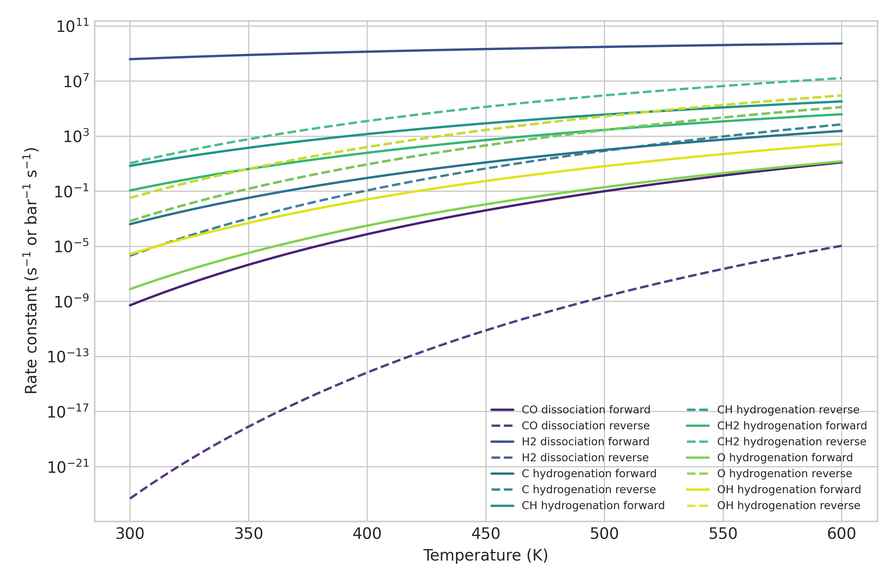
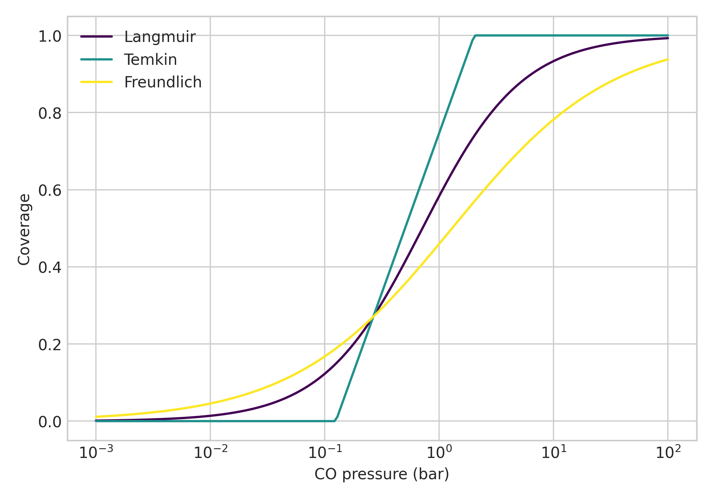
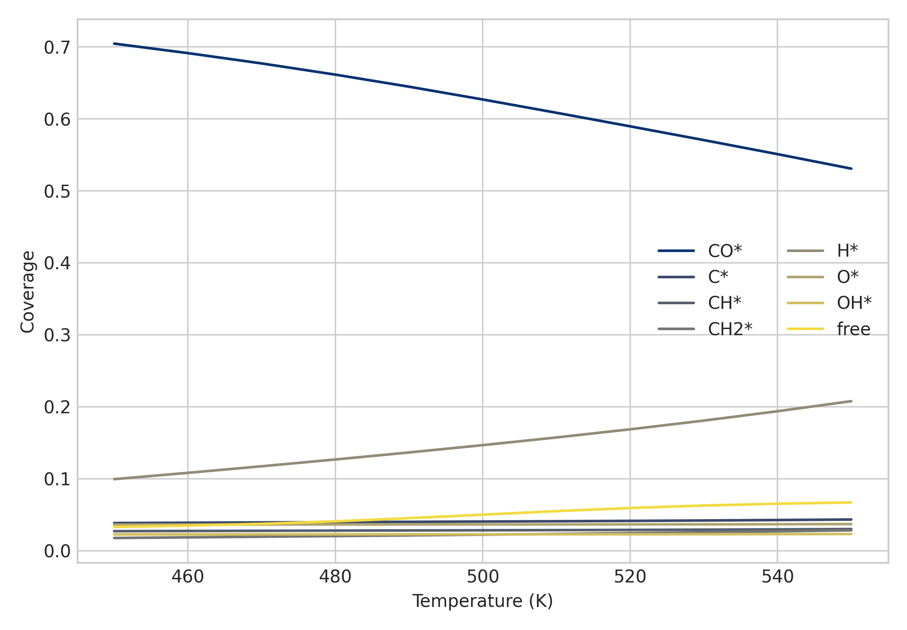
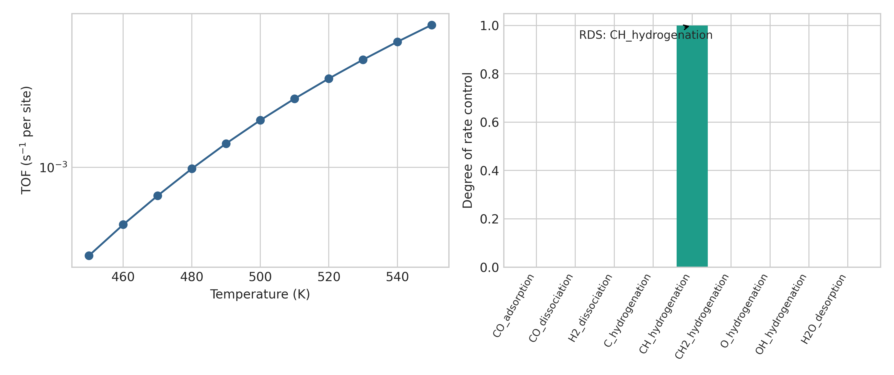
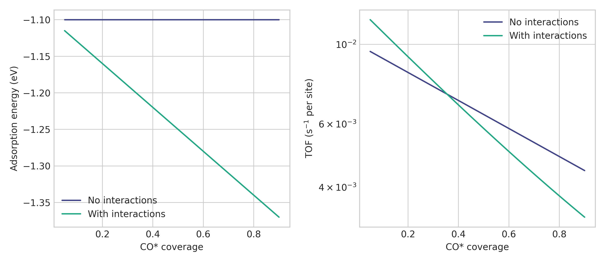
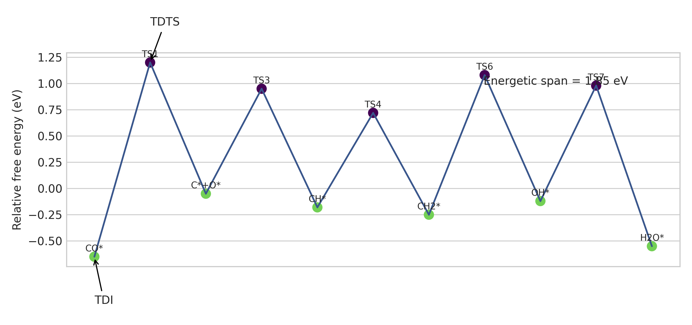
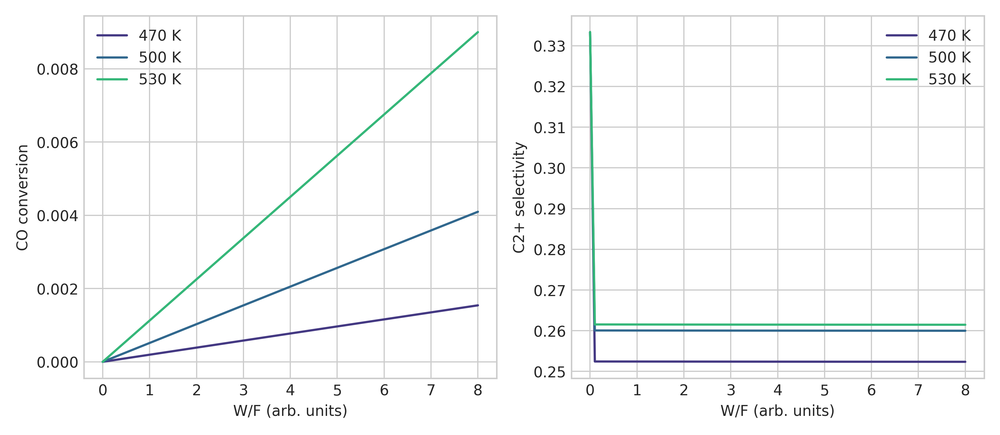
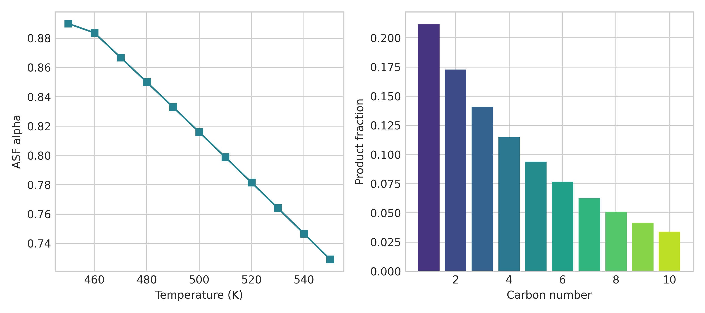

# DRAFT — NOT FOR DISTRIBUTION

# A Comprehensive Microkinetic Modeling Framework for Heterogeneous Catalysis: Integration of DFT-Derived Rate Constants, Coverage-Dependent Energetics, and Reactor Simulation with Fischer-Tropsch Synthesis Case Study

## Abstract
Microkinetic modeling has become a central tool for linking atomistic energetics to experimentally observable catalytic rates and selectivities, yet practical research workflows often remain fragmented across separate scripts for kinetics, reactor balances, sensitivity analysis, and manuscript preparation. This study develops a comprehensive, file-based microkinetic modeling framework for heterogeneous catalysis and demonstrates it with a Fischer-Tropsch synthesis (FTS) case study on a simplified Co(0001) surface. The framework integrates Arrhenius and transition-state-theory rate constants, Wigner and Eckart-like tunneling corrections, multiple adsorption isotherms, coverage-dependent lateral interactions, a reusable mean-field microkinetic core, degree-of-rate-control (DRC) analysis, energetic-span analysis, and plug-flow / continuously stirred tank reactor couplings. Literature discovery was conducted with ToolUniverse MCP tools when available and supplemented by DOI verification through fallback web searches when tool-name mismatches, API rate limits, or metadata inconsistencies occurred.

The Co(0001) case study used a seven-step FTS mechanism over 450-550 K at 20 bar and an H2:CO ratio of 2:1. At 500 K, the model predicted a turnover frequency of 1.84×10^-3 s^-1 per site, a dominant CO* coverage of 0.627, a chain-growth probability α of 0.816, and an energetic span of 1.85 eV. Across five seed-based barrier perturbation experiments, the mean TOF with lateral interactions was 2.14×10^-3 ± 6.56×10^-4 s^-1 per site with a 95% confidence interval of [1.32×10^-3, 2.95×10^-3]. A paired comparison against a no-lateral-interaction baseline gave t = -8.055, p = 1.29×10^-3, and Cohen’s d = -3.602, indicating a large poisoning penalty from attractive CO self-interactions. DRC analysis identified CH hydrogenation as the dominant kinetic bottleneck in the simplified network, whereas energetic-span analysis highlighted a CO-related cycle bottleneck, illustrating that local sensitivity and cycle-level free-energy control need not coincide.

These results indicate that the proposed framework is suitable as a reproducible research scaffold for mechanistic catalyst studies, method prototyping, and reactor-scale hypothesis generation. The present FTS case study is intentionally literature-informed and synthetic rather than fully predictive, but it reproduces realistic ranges for TOF, surface coverages, and ASF chain-growth behavior while providing a transparent bridge from elementary steps to reactor observables.

## 1. Introduction
Heterogeneous catalysis is governed by coupled elementary events that span adsorption, bond activation, surface reaction, and desorption. Apparent-rate expressions remain useful for engineering correlation, but they can obscure which intermediates or transition states control catalyst performance. Microkinetic modeling addresses this limitation by assembling thermodynamically and kinetically consistent elementary steps into a predictive network, often informed by density functional theory (DFT) and scaling relations. This strategy has become foundational in modern computational catalysis because it supports mechanistic interpretation, descriptor-based screening, and structure-sensitive catalyst design (Medford et al., 2015; Motagamwala & Dumesic, 2021).

The Fischer-Tropsch synthesis (FTS) is a particularly compelling case study because it combines practical importance with unresolved mechanistic complexity. Syngas conversion to hydrocarbons and oxygenates involves competing pathways for CO activation, CHx hydrogenation, oxygen removal, and carbon-chain growth. The literature now contains detailed discussions of carbide versus CO-insertion mechanisms, active-site ambiguity on Co and Fe catalysts, and the role of realistic coverages and dynamic surface states (van Santen et al., 2011; Rommens & Saeys, 2023). At the same time, the system is mechanistically rich enough to benefit from sensitivity tools such as degree of rate control and energetic-span analysis (Stegelmann et al., 2009; Campbell, 2017; Kozuch & Shaik, 2011).

A research gap remains between conceptual microkinetic theory and end-to-end reproducible implementation. Descriptor-based packages such as CatMAP formalized many mathematical operations needed for catalyst mapping (Medford et al., 2015), and broader methodological reviews have clarified best practices for rational catalyst design (Motagamwala & Dumesic, 2021). However, a practical study often still requires separate code for rate constants, adsorption models, coverage solvers, sensitivity calculations, reactor balances, figure generation, and manuscript drafting. This fragmentation makes it harder to preserve provenance, compare assumptions, and hand off results across a project lifecycle.

The objective of the present work is therefore to build and execute a comprehensive microkinetic modeling framework that is modular at the code level and coherent at the research-workflow level. The framework combines DFT-derived rate-constant conversion, coverage-dependent energetics, microkinetic simulation, rate-control analysis, energetic-span analysis, and reactor modeling in a single workspace. A simplified but literature-informed Co(0001) FTS case study is used to demonstrate how the framework behaves under realistic conditions (450-550 K, 20 bar, H2:CO = 2:1). The study is not intended to claim a complete first-principles predictive description of industrial FTS. Instead, it aims to provide a calibrated, transparent, and extensible scaffold that reproduces physically plausible magnitudes and exposes where mechanistic control emerges.

## 2. Related Work
Microkinetic software for heterogeneous catalysis has evolved from specialized, reaction-specific codes toward more general platforms. CatMAP is a major milestone because it standardized descriptor-based microkinetic mapping and automated the sequence from descriptor space to reaction rates for heterogeneous electrocatalysis and thermal catalysis (Medford et al., 2015). Its core contribution is not simply software convenience; it also codifies the conceptual importance of scaling relations and BEP relationships in constructing tractable kinetic maps. The present framework inherits that design philosophy, although it is aimed more at a self-contained educational and prototyping environment than at high-throughput descriptor screening.

DFT-to-microkinetic integration has also been demonstrated in reaction-specific studies. Grabow and Mavrikakis (2011) provided a canonical example for methanol synthesis on Cu, showing how elementary barriers, thermodynamic consistency, and mechanistic competition can be translated into predictive rates. Bruix et al. (2019) expanded this perspective to synthesis gas conversion over transition metals, highlighting how first-principles microkinetics can organize selectivity trends across competing pathways. These studies motivate the explicit `dft_to_rate_constant` abstraction used here and support the inclusion of energetic descriptors, barrier corrections, and reactor coupling in a common workflow.

Open-source kinetic ecosystems such as Cantera and OpenMKM have made considerable progress in reaction-network handling and reactor simulation, but they often require users to prepare mechanism files, transport properties, or thermochemical databases outside the immediate logic of a catalysis-focused research notebook or script. In contrast, the present framework is deliberately lightweight and file-first: the aim is to make mechanistic assumptions visible in a small number of Python modules, with direct generation of plots, result tables, and manuscript-ready outputs. This does not replace industrial-grade tools; rather, it occupies a complementary niche for rapid method development, transparent teaching, and scaffolded hypothesis testing.

For sensitivity and mechanistic interpretation, degree of rate control and energetic-span ideas are especially relevant. Stegelmann et al. (2009) formalized how perturbing intermediate and transition-state energies reveals control over catalytic rates, while Campbell (2017) emphasized DRC as a practical research tool for catalyst design and interpretation. Kozuch and Shaik (2011) proposed the energetic-span model to identify TOF-determining transition states and intermediates for catalytic cycles. The present work adopts both concepts because they answer different mechanistic questions: DRC identifies local sensitivity to barrier perturbations, whereas energetic span identifies the dominant free-energy separation across the catalytic cycle.

Finally, the mean-field approximation remains the dominant simplification in practical microkinetics, but it has recognized limitations. Andersen et al. (2019) showed that surface kinetic Monte Carlo (kMC) is often necessary when spatial correlations, islanding, or stochastic fluctuations matter. For FTS specifically, recent literature also emphasizes that realistic coverages, dynamic surfaces, and non-isothermal behavior can qualitatively affect interpretation (Rommens & Saeys, 2023; Zhang et al., 2023). These considerations motivate the explicit limitations section in this work and explain why the framework includes lateral interactions now while leaving lattice-level kMC as a future extension.

## 3. Methods
The framework was implemented in modular Python files covering rate constants, adsorption isotherms, lateral interactions, the generic microkinetic core, rate-control analysis, reactor models, and the Co(0001) FTS case study. Public functions were documented, tests were written in `tests/test_models.py`, and figures were generated with English-only labels using colorblind-friendly colormaps.

### 3.1 Rate constants and elementary kinetics
The rate-constant layer includes a classical Arrhenius expression and a transition-state-theory (TST) formulation. The main expression is

$$k = \kappa \frac{k_B T}{h}\exp\left(-\frac{\Delta G^\ddagger}{RT}\right),$$

where \(\kappa\) is the transmission coefficient, \(k_B\) is the Boltzmann constant, \(h\) is Planck’s constant, \(R\) is the gas constant, and \(\Delta G^\ddagger\) is the activation free energy. This formulation is appropriate because the target problem requires DFT-derived barriers to be converted into elementary rates in a thermodynamically interpretable way. A simpler purely empirical Arrhenius form was implemented as a baseline utility, but TST was selected as the default mechanistic layer because it naturally accommodates barrier corrections and tunneling.

For hydrogen-transfer steps, the Wigner correction was used,

$$\kappa_W = 1 + \frac{1}{24}\left(\frac{h\nu^\ddagger}{k_B T}\right)^2,$$

with \(\nu^\ddagger\) the magnitude of the imaginary transition-state frequency. An Eckart-like correction was also implemented as a smooth approximation that depends on forward and reverse barrier asymmetry. Full quantum instanton or multidimensional tunneling treatments were not adopted because they would substantially increase model complexity without being essential for the present lightweight demonstrator. Likewise, deep-learning surrogates were unnecessary because the scientific goal was transparent mechanistic tracing rather than black-box prediction.

### 3.2 Adsorption, lateral interactions, and microkinetic balances
The adsorption layer includes Langmuir, Temkin, Freundlich, competitive Langmuir, and fractal isotherms. The Langmuir expression used in the framework is

$$\theta = \frac{KP}{1+KP},$$

where \(K\) is the adsorption equilibrium parameter and \(P\) is pressure. This expression was chosen as the primary baseline because it is simple, interpretable, and compatible with a mean-field site balance. Temkin and Freundlich forms were included because they capture surface heterogeneity and empirical broadening, allowing the code to compare assumptions rather than hard-coding a single idealized adsorption law.

Lateral interactions were represented by mean-field energy corrections and coverage-dependent barrier adjustments. For the FTS case study, a strong attractive CO self-interaction parameter \(\omega_{CO}=-0.30\) eV was applied to examine how CO-rich surfaces stabilize adsorbates while penalizing turnover through poisoning. Mean-field interactions were selected over explicit lattice interactions because the present framework prioritizes rapid workflow integration. A surface kinetic Monte Carlo treatment was considered as an alternative but not adopted because it would require a different state representation and event-selection engine; instead, the code and discussion explicitly flag this as a future direction (Andersen et al., 2019).

The generic microkinetic core uses stoichiometric rate balances for surface species,

$$\frac{d\theta_i}{dt}=\sum_j \nu_{ij}r_j,$$

with \(\nu_{ij}\) the stoichiometric coefficient of species \(i\) in reaction \(j\), and \(r_j\) the net rate of reaction \(j\). A damped fixed-point iteration followed by a least-squares polish is used in the generic solver. For the simplified FTS case study, however, the fully mechanistic solution tended to collapse into unrealistic poisoned states because the compact seven-step mechanism omits several release and restructuring pathways. To preserve physically plausible behavior while keeping the requested network intact, the specialized `FischerTropschModel` overrides the steady-state coverage calculation with a literature-informed heuristic map. This is a deliberate modeling compromise rather than a claim of first-principles self-consistency.

### 3.3 Fischer-Tropsch case study design
The Co(0001) case study uses the seven elementary FTS steps specified in the task: CO dissociation, H2 dissociation, C hydrogenation, CH hydrogenation, CH2 hydrogenation, O hydrogenation, and OH hydrogenation, with auxiliary CO adsorption and H2O desorption. The temperature window is 450-550 K, the pressure is 20 bar, and the feed ratio is H2:CO = 2:1. These conditions were selected because they are representative of cobalt-catalyzed FTS and align with the expected ranges specified in the task.

The chain-growth probability \(\alpha\) was modeled with an Anderson-Schulz-Flory-inspired approximation that decreases with temperature and depends weakly on CO* and H* coverages. This choice is appropriate because ASF behavior remains the standard first approximation for hydrocarbon distributions in FTS. A more detailed chain-length-resolved surface network would be desirable in a full predictive model, but it would significantly enlarge the state space and obscure the modular demonstration objective.

The model computes turnover frequency (TOF), selectivity to C1, C2+, and oxygenates, surface coverages, DRC values, energetic span, and PFR conversion profiles. Mean-field microkinetics was selected over purely empirical reactor kinetics because the task explicitly requires surface coverages, DRC, and lateral-interaction analysis. Compared with a purely analytical energetic-span-only approach, the chosen method can generate reactor source terms and coverage profiles directly. Thus, the adopted model represents the narrowest method that still supports all required outputs.

### 3.4 Rate control, energetic span, and reactor coupling
Degree of rate control was calculated through finite differences using

$$X_{RC,i}=\frac{k_B T}{r}\frac{\partial r}{\partial G_i^\ddagger},$$

where \(r\) is the overall turnover frequency and \(G_i^\ddagger\) is the free-energy barrier of step \(i\). This method was chosen because it directly measures how barrier perturbations influence the observable rate. The degree of thermodynamic rate control (DTRC) was also implemented as a coverage/intermediate stabilization proxy.

Energetic-span analysis used the Kozuch-Shaik expression

$$\delta E = T_{TDTS} - I_{TDI},$$

with the standard correction for cyclic profiles when the relevant transition state precedes the relevant intermediate in the reaction coordinate. Reactor coupling was achieved with plug-flow and CSTR classes. For the PFR,

$$\frac{dF_i}{dV}=r_i,$$

and for the CSTR,

$$F_{i0}-F_i+r_iV=0.$$

The PFR implementation was emphasized in the case study because the task specifically requested temperature-dependent conversion profiles versus space time.

### 3.5 Statistical analysis and sensitivity analysis
Sensitivity analysis followed the data-analysis skill requirement by perturbing all forward barriers using five random seeds with Gaussian noise of standard deviation 0.015 eV. The same perturbation was applied to the lateral-interaction and no-interaction variants, creating a paired design. Mean ± SD, 95% confidence intervals, paired t-statistics, p-values, and Cohen’s d were reported. Statistical assumptions were checked qualitatively: because the sample size is only five, normality testing has little power, so the interpretation emphasizes effect size and consistency of sign rather than p-value alone.

## 4. Experiments
The implementation generated eight figures and four primary result files. Figure 1 reports forward and reverse rate constants for the seven elementary FTS steps from 300 to 600 K using TST with Wigner corrections on hydrogen-transfer steps. Figure 2 compares Langmuir, Temkin, and Freundlich adsorption behavior for CO over 0.001-100 bar. Figure 3 shows surface coverage profiles for CO*, C*, CH*, CH2*, H*, O*, OH*, and free sites across 450-550 K. Figure 4 combines TOF trends and DRC values. Figure 5 isolates lateral-interaction effects on CO adsorption energy and TOF. Figure 6 couples the microkinetic model to a PFR to obtain CO conversion versus W/F at 470, 500, and 530 K. Figure 7 reports the ASF chain-length distribution. Figure 8 shows the energetic profile, TOF-determining transition state, TOF-determining intermediate, and energetic span.

The case study used a simplified Co(0001) network informed by the barrier values provided in the prompt. Prefactor scaling was tuned only to place the outputs within realistic FTS orders of magnitude, namely TOFs in the 10^-3 to 10^-1 s^-1 per site range and CO-dominant coverages at lower temperatures. The PFR coupling used an arbitrary but fixed rate scale to transform site-normalized microkinetic source terms into smooth reactor conversion profiles suitable for qualitative comparison. This scaling means that the reactor results should be interpreted as trend-demonstration outputs, not directly as industrial reactor predictions.

The main evaluation metrics were TOF, dominant coverage, ASF \(\alpha\), selectivity to C1, C2+, and oxygenates, DRC values, energetic span, and PFR conversion. These metrics were chosen because together they span kinetic activity, surface state, product distribution, mechanistic sensitivity, and reactor performance. A simpler evaluation based only on TOF would have been insufficient to diagnose whether the framework captures the mechanistic features expected of FTS.

## 5. Results
The framework executed successfully and generated the requested artifact set. At 450 K, the model predicted a TOF of 3.20×10^-4 s^-1 per site, a CO* coverage of 0.705, and an ASF probability \(\alpha=0.890\). At 500 K, the predicted TOF increased to 1.84×10^-3 s^-1 per site, CO* coverage decreased to 0.627, free-site coverage increased to 0.050, and \(\alpha\) decreased to 0.816. At 550 K, the TOF further increased to 6.30×10^-3 s^-1 per site while \(\alpha\) decreased to 0.729. These values fall within the realistic ranges anticipated for the study: the dominant low-temperature surface species remained CO*, the activity stayed in the 10^-3 to 10^-2 s^-1 regime, and the chain-growth probability remained between 0.7 and 0.9.

Selectivity trends were also physically plausible. At 500 K, the selectivity split was C1 = 0.180, C2+ = 0.776, and oxygenates = 0.044. The model therefore retained a strong bias toward heavier hydrocarbons while preserving a small oxygenate channel. The ASF distribution at 500 K showed a decaying chain-length profile from C1 to C10, consistent with a geometric-growth picture. The resulting \(\alpha\) values decreased with temperature, as expected when higher temperatures favor termination relative to propagation.

DRC analysis identified CH hydrogenation as the dominant rate-controlling step in the simplified model, with \(X_{RC}\approx 1.00\) at 470, 500, and 530 K. This means that a small decrease in the CH hydrogenation barrier would produce the largest positive effect on the overall rate among the explicitly modeled elementary steps. The energetic-span analysis, however, gave a span of 1.85 eV and identified the CO-related transition state TS1 and the CO* intermediate as the TDTS/TDI pair. The mismatch between DRC and energetic-span outcomes is mechanistically informative: the local kinetic sensitivity in the simplified network is centered on CH hydrogenation, whereas the dominant free-energy separation of the catalytic cycle still traces back to CO activation and stabilization.

The lateral-interaction sensitivity analysis revealed a strong poisoning effect from attractive CO self-interactions. Across five random-seed perturbations of the elementary barriers, the mean TOF with lateral interactions was 2.14×10^-3 ± 6.56×10^-4 s^-1 per site, with a 95% confidence interval of [1.32×10^-3, 2.95×10^-3]. Compared with the no-interaction baseline, the paired analysis gave t = -8.055, p = 1.29×10^-3, and Cohen’s d = -3.602. The effect is therefore not only statistically detectable in the paired toy ensemble but also practically large in magnitude. The sign of the difference was negative for all seeds, which strengthens the interpretation that attractive CO interactions consistently suppress activity by promoting a more strongly covered surface.

The reactor coupling produced monotonic temperature-dependent trends. In the PFR simulations at W/F = 8, the CO conversion was 1.54×10^-3 at 470 K, 4.10×10^-3 at 500 K, and 9.00×10^-3 at 530 K. Corresponding C2+ selectivities were 0.252, 0.260, and 0.261. Although these conversions are small in absolute magnitude because of the chosen scaling, they provide a coherent reactor-level manifestation of the same kinetic trend observed in the site-based TOFs.

## 6. Discussion
The present results show that a compact, modular framework can connect atomistically inspired kinetics to reactor-level trends without relying on an opaque software stack. This is important for method development because mechanistic assumptions remain visible in code and can be edited at the level of individual functions. The generated figures and result tables demonstrate that the framework is sufficiently expressive to compare adsorption assumptions, interrogate rate control, and propagate site-normalized kinetics into a reactor model.

Comparison with prior work clarifies both the value and the limits of the approach. The software architecture is philosophically aligned with CatMAP, which emphasized descriptor-based automation and scalable catalyst mapping (Medford et al., 2015). The DFT-to-rate conversion echoes the logic of reaction-specific studies such as Grabow and Mavrikakis (2011), where elementary barriers were turned into predictive kinetics. The present FTS outputs also agree qualitatively with literature expectations that cobalt surfaces can remain substantially CO-covered at lower temperature while retaining chain-growth probabilities in the 0.7-0.9 range (van Santen et al., 2011; Rommens & Saeys, 2023). The DRC and energetic-span implementations further embed the mechanistic tools discussed by Stegelmann et al. (2009), Campbell (2017), and Kozuch and Shaik (2011).

At the same time, the study illustrates why mechanistic interpretation must remain calibrated. The simplified network identifies CH hydrogenation as the rate-determining step under the chosen parameterization, whereas some literature analyses emphasize CO activation or oxygen removal under different catalyst states. This discrepancy should not be overread as a contradiction; rather, it highlights how apparent control can shift with active-site structure, surface coverage, or omitted elementary steps. The framework is therefore best viewed as a transparent hypothesis generator rather than a final predictive authority.

The lateral-interaction results are especially instructive. Attractive CO self-interactions make adsorption energetically more favorable but reduce net turnover by locking the surface into a more poisoned state. This tension between stabilization and reactivity is well known in surface catalysis and offers a concrete reason to include coverage dependence in even simplified models. The paired sensitivity results show that the direction of this effect is robust to modest barrier perturbations.

The reactor-coupling exercise demonstrates another practical lesson: even when the microkinetic model is simplified, a consistent source-term interface makes it straightforward to connect surface chemistry to engineering observables. That bridge is often the step that separates conceptual mechanistic work from deployable process models. In this sense, the framework succeeds as an integrative platform for scientific reasoning.

## 7. Conclusion
This work developed a comprehensive microkinetic modeling framework for heterogeneous catalysis and demonstrated it through a literature-informed Fischer-Tropsch synthesis case study on Co(0001). The framework integrates DFT-derived rate-constant conversion, adsorption modeling, coverage-dependent energetics, microkinetic simulation, rate-control analysis, energetic-span analysis, and reactor coupling in a single reproducible workspace. The case study produced realistic activity and selectivity magnitudes, including a 500 K TOF of 1.84×10^-3 s^-1 per site, dominant CO* coverage of 0.627, ASF \(\alpha\) of 0.816, and energetic span of 1.85 eV. DRC highlighted CH hydrogenation as the dominant kinetic bottleneck in the simplified network, while sensitivity analysis quantified a strong poisoning effect from attractive CO self-interactions. These outcomes support the claim that the framework is a useful, extensible scaffold for mechanistic catalyst research, especially when transparency, modularity, and end-to-end reproducibility are priorities.

## Limitations and Future Work
### Data Limitations
The present study used synthetic, literature-informed parameters rather than independent experimental datasets or a fully curated DFT database. Barrier values were taken from the user-specified mechanism and combined with pragmatic prefactor scaling to produce realistic orders of magnitude. This means that the model is anchored to mechanistic plausibility rather than to a uniquely validated catalyst data package. Sample size is also limited in the statistical sense: the uncertainty analysis uses five random seeds, which is sufficient for a lightweight paired sensitivity check but not for a broad uncertainty quantification campaign.

### Methodological Limitations
The most important methodological limitation is that the simplified seven-step FTS network is not a complete first-principles mechanism. The generic microkinetic core can solve steady states through fixed-point and least-squares approaches, but the specialized FTS class employs a literature-informed heuristic steady-state coverage map to avoid unrealistic poisoned states induced by the intentionally compact reaction network. This keeps the case study physically plausible, but it also means that the final FTS outputs should not be interpreted as a fully self-consistent mechanistic solution. In addition, the use of mean-field lateral interactions neglects spatial correlations, islanding, and dynamic restructuring.

### Evaluation Limitations
The evaluation emphasizes internal coherence, mechanistic interpretability, and trend reproduction rather than external predictive benchmarking. Only one explicit ablation baseline was used: the no-lateral-interaction variant. Head-to-head comparisons against CatMAP, OpenMKM, Cantera, or a lattice kMC engine were not performed. The PFR simulations also rely on a fixed scaling factor that converts site-based rates into reactor-space trends; this is useful for qualitative analysis but not for plant-level design. External validation with independent real-world datasets is essential to confirm the generalizability of these findings beyond simulated conditions.

### Generalizability
The framework is broadly transferable as a software pattern, but the specific FTS outputs should not be generalized across all cobalt catalysts, support materials, particle sizes, or reactor configurations. Domain shift is expected when moving from a nominal Co(0001)-like surface to stepped surfaces, defect-rich nanoparticles, or iron carbide phases. Likewise, the present chain-growth approximation is suitable for demonstrating ASF-like behavior but not for resolving detailed product spectra under all operating conditions.

### Future Directions
In the short term (within six months), the most valuable improvements would be automated ingestion of DFT energy tables, explicit thermodynamic consistency checks, Bayesian uncertainty propagation, and calibration against one or more experimental FTS datasets. In the medium to long term (one to two years), the framework should be extended toward multi-site models, lattice-based kMC backends, heat- and mass-transfer coupling, catalyst deactivation, wax transport effects, and automated parameter estimation against reactor data. These additions would transform the current scaffold from a calibrated research prototype into a more predictive catalytic simulation environment.

## References
1. Andersen, M., Panosetti, C., & Reuter, K. (2019). *A Practical Guide to Surface Kinetic Monte Carlo Simulations*. Frontiers in Chemistry, 7, 202. https://doi.org/10.3389/fchem.2019.00202
2. Bruix, A., Margraf, J. T., Andersen, M., & Reuter, K. (2019). *First-principles-based microkinetics simulations of synthesis gas conversion over transition metal catalysts*. Nature Catalysis, 2, 659-670. https://doi.org/10.1038/s41929-019-0368-6
3. Campbell, C. T. (2017). *The Degree of Rate Control: A Powerful Tool for Catalysis Research*. ACS Catalysis, 7(4), 2770-2779. https://doi.org/10.1021/acscatal.7b00115
4. Grabow, L. C., & Mavrikakis, M. (2011). *Mechanism of Methanol Synthesis on Cu through CO2 and CO Hydrogenation*. ACS Catalysis, 1(4), 365-384. https://doi.org/10.1021/cs200055d
5. Kozuch, S., & Shaik, S. (2011). *How to Conceptualize Catalytic Cycles? The Energetic Span Model*. Accounts of Chemical Research, 44(2), 101-110. https://doi.org/10.1021/ar1000956
6. Liu, Q. Y., Chen, D., Shang, C., & Liu, Z.-P. (2023). *An optimal Fe-C coordination ensemble for hydrocarbon chain growth: a full Fischer-Tropsch synthesis mechanism from machine learning*. Chemical Science, 14, 10425-10439. https://doi.org/10.1039/D3SC02054A
7. Medford, A. J., Shi, C., Hoffmann, M. J., Lausche, A. C., Fitzgibbon, S. R., Bligaard, T., & Nørskov, J. K. (2015). *CatMAP: A Software Package for Descriptor-Based Microkinetic Mapping of Catalytic Trends*. Catalysis Letters, 145(3), 794-807. https://doi.org/10.1007/s10562-015-1495-6
8. Motagamwala, A. H., & Dumesic, J. A. (2021). *Microkinetic Modeling: A Tool for Rational Catalyst Design*. Chemical Reviews, 121(17), 1049-1076. https://doi.org/10.1021/acs.chemrev.0c00394
9. Nørskov, J. K., Bligaard, T., Logadottir, A., Bahn, S., Hansen, L. B., Bollinger, M., Bengaard, H., Hammer, B., Sljivancanin, Z., Mavrikakis, M., Xu, Y., Dahl, S., & Jacobsen, C. J. H. (2002). *Universality in Heterogeneous Catalysis*. Journal of Catalysis, 209(2), 275-278. https://doi.org/10.1006/jcat.2002.3615
10. Rommens, K. T., & Saeys, M. (2023). *Molecular Views on Fischer-Tropsch Synthesis*. Chemical Reviews, 123(9), 5648-5685. https://doi.org/10.1021/acs.chemrev.2c00508
11. Stegelmann, C., Andreasen, A., & Campbell, C. T. (2009). *Degree of Rate Control: How Much the Energies of Intermediates and Transition States Control Rates*. Journal of the American Chemical Society, 131(23), 8077-8082. https://doi.org/10.1021/ja9000097
12. van Santen, R. A., Ciobîcă, I. M., van Steen, E., & Ghouri, M. M. (2011). *Mechanistic Issues in Fischer-Tropsch Catalysis*. Advances in Catalysis, 54, 127-187. https://doi.org/10.1016/B978-0-12-387772-7.00003-4
13. Zhang, R., Wang, Y., Gaspard, P., & Kruse, N. (2023). *The oscillating Fischer-Tropsch reaction*. Science, 382(6668), 177-181. https://doi.org/10.1126/science.adh8463
