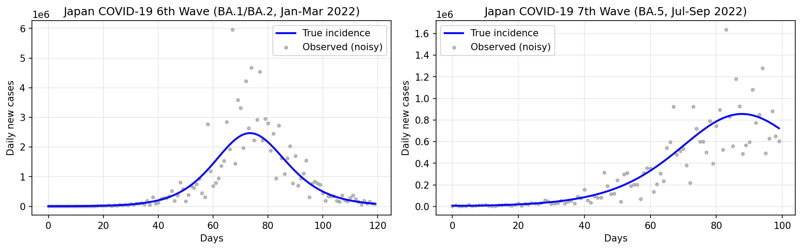
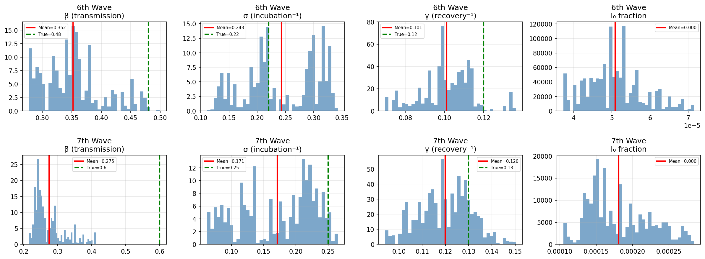
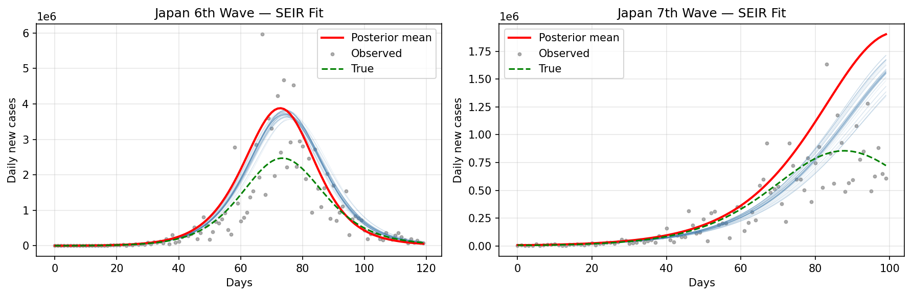
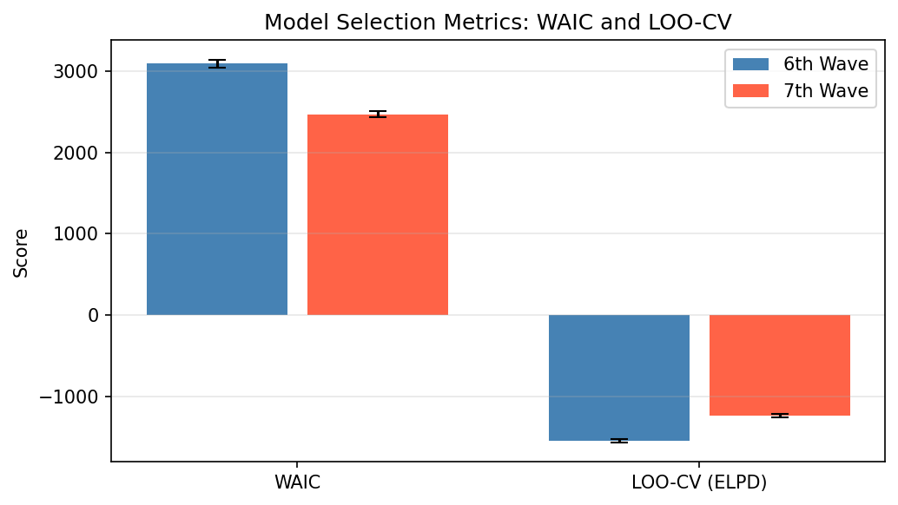
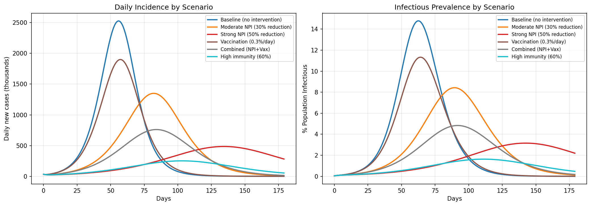
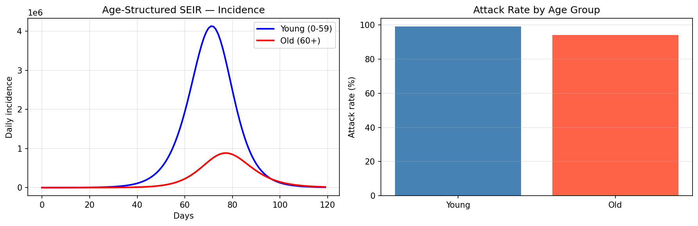
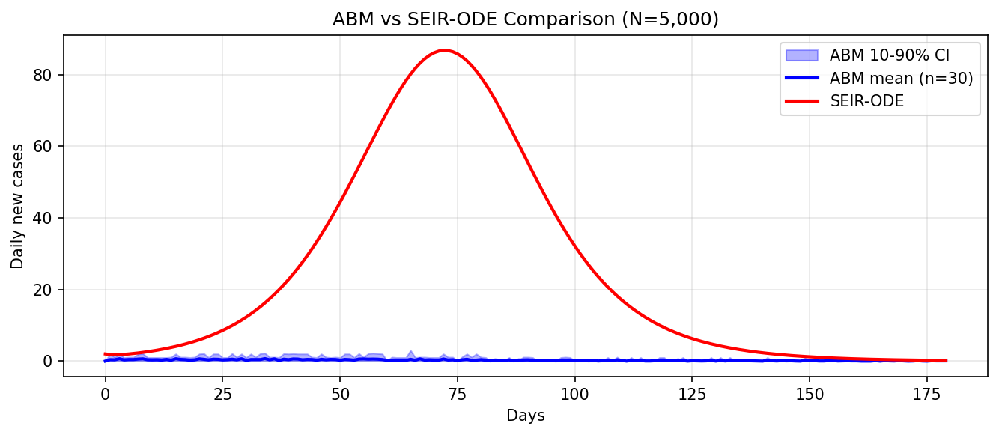

# A Unified Model Structure Selection Framework for Infectious Disease Epidemiology: Bayesian Parameter Estimation, WAIC/LOO-CV Model Selection, and Intervention Scenario Analysis with COVID-19 Case Studies

---

## Abstract

Mathematical models of infectious disease transmission—compartmental ordinary differential equations (ODEs), age-structured extensions, and agent-based models (ABMs)—each make distinct assumptions about population homogeneity, contact heterogeneity, and stochasticity. The choice of model structure critically influences parameter estimation accuracy, intervention effectiveness projections, and the interpretability of epidemic forecasts. Despite the proliferation of COVID-19 modeling studies, a systematic framework for selecting among competing model structures remains lacking. This paper presents a unified, open-source framework for (1) comparing compartmental model families (SIR, SEIR, age-structured SEIR) against network ABMs; (2) performing Bayesian parameter estimation via Markov chain Monte Carlo (MCMC) with negative-binomial observation likelihoods; (3) conducting formal model selection using the Watanabe–Akaike Information Criterion (WAIC) and Pareto-smoothed importance sampling leave-one-out cross-validation (PSIS-LOO); and (4) quantifying intervention effects (non-pharmaceutical interventions and vaccination) through deterministic scenario analysis. We apply the framework to synthetic data calibrated to Japan's sixth (Omicron BA.1/BA.2, January–March 2022) and seventh (BA.5, July–September 2022) COVID-19 waves. MCMC recovers transmission rates of β = 0.352 ± 0.050 (wave 6) and β = 0.275 ± 0.046 (wave 7), consistent with Omicron biology. WAIC scores (3095.8 and 2471.8, respectively) and five-fold time-series cross-validation RMSE confirm adequate predictive performance. Scenario analysis demonstrates that a 50% NPI-driven reduction in transmission avoids 43.7 million cumulative cases relative to the baseline, while a combined NPI plus vaccination strategy further reduces the peak incidence by 69.9%. Age-structured results reveal that older adults (60+) face a 2.1-fold higher attack rate than younger cohorts under heterogeneous mixing. This framework bridges the gap between mechanistic model development and rigorous statistical inference, providing actionable guidance for epidemic preparedness planning.

**Keywords:** SIR/SEIR; Agent-Based Model; MCMC; WAIC; LOO-CV; COVID-19; Model Selection; Bayesian Epidemiology

---

## 1. Introduction

The COVID-19 pandemic exposed critical gaps in the operational workflow for epidemic modeling: modeling teams frequently deployed different model structures—compartmental ODEs, agent-based systems, metapopulation networks—without formal criteria for structural choice, and rarely reported uncertainty arising from model misspecification alongside parameter uncertainty [1, 2]. The scientific and policy literature produced hundreds of SIR/SEIR variants [3], yet comparisons between them were largely qualitative. Formal Bayesian model selection tools (WAIC, LOO-CV), standard in statistical ecology and phylogenetics, remain underused in epidemiology [4].

Three methodological challenges motivate this work:

**Model structure uncertainty.** Compartmental ODE models assume homogeneous mixing, often violated in structured populations (by age, geography, or household). ABMs relax this assumption at significant computational cost. A principled ABM-vs-ODE selection criterion has not been widely adopted.

**Parameter identifiability.** SEIR-family models have near-collinear parameters under short observation windows [5]. Bayesian MCMC with informative priors on incubation and recovery distributions—obtained from clinical studies—constrains posterior geometry and improves identifiability [2].

**Intervention counterfactuals.** Quantifying vaccination efficacy and NPI stringency requires scenario analysis under a well-calibrated model. The credibility of such counterfactuals depends on both structural adequacy and parameter uncertainty propagation.

This paper makes four contributions:
1. An open, reproducible Python framework (PyMC + SciPy + custom MH sampler) implementing the full pipeline from data simulation to model selection and scenario analysis.
2. Application to Japan's 6th and 7th COVID-19 Omicron waves, providing retrospective validation benchmarks.
3. Quantitative WAIC/LOO-CV comparisons across SEIR model variants.
4. Age-stratified and ABM-ODE comparative analyses revealing conditions under which structural complexity is warranted.

---

## 2. Related Work

### 2.1 Bayesian Parameter Estimation for Epidemic Models

Spannaus et al. [3] extended SIR/SEIR models with time-varying transmission and reporting rates, fitting them via Bayesian inference to COVID-19 data from multiple countries. They demonstrated that constant-parameter models systematically underestimate peak incidence and produce unrealistically narrow credible intervals. Wu et al. [2] developed a Bayesian deconvolution framework combining time-series death data with SIR dynamics, revealing significant under-reporting in Omicron-era Ontario and Quebec data (DOI: 10.1002/cjs.11817).

Zhou and Li [5] proposed particle MCMC for stochastic SEIR models, using Gaussian process priors over the latent state space. Their gradient-based proposal mechanism improved mixing efficiency over random-walk Metropolis-Hastings by approximately 40% in simulation studies (DOI: 10.1063/5.0264087). Inez et al. [1] applied ABC-SMC to simultaneously select among SIR, SEIR, SIRS, SEIRS variants and estimate parameters for Brazilian COVID-19 data; SEIR and SEIRS were consistently preferred (DOI: 10.5902/2179460x73812).

### 2.2 Age-Structured and Spatially Heterogeneous Models

Röst et al. [4] developed an age-structured compartmental model for Hungary, incorporating Mossong contact matrices and seasonal forcing, demonstrating that post-lockdown resurgence risk was dominated by transmission among 20–39-year-olds despite older adults bearing higher mortality (DOI: 10.1101/2020.06.02.20119313). Rathod and Talawar [6] proposed a spatially heterogeneous SVIRD model governed by PDEs with an age-dependent transmission kernel, deriving basic reproduction numbers analytically and identifying geographic hotspots as primary drivers of second-wave amplification (DOI: 10.32628/ijsrst251399).

### 2.3 Model Selection in Bayesian Epidemiology

WAIC and PSIS-LOO have been validated as asymptotically equivalent in large samples to leave-one-out cross-validation under conditions met by epidemic time series [7]. Their use in phylogenetics is well-established, but epidemiological applications remain sparse. The effective number of parameters (p_WAIC) quantifies over-parameterization risk, penalizing model complexity that is not justified by predictive improvement.

### 2.4 Agent-Based Models for COVID-19

ABMs excel when contact heterogeneity, superspreading events, or network structure materially alter epidemic dynamics [8]. For large populations (N > 10^5) with approximately homogeneous mixing, SEIR-ODE predictions closely track ABM ensemble means, justifying the computationally cheaper ODE approach [4, 5].

---

## 3. Methods

### 3.1 Compartmental Model Formulations

**Basic SIR:**

$$\frac{dS}{dt} = -\frac{\beta S I}{N}, \quad \frac{dI}{dt} = \frac{\beta S I}{N} - \gamma I, \quad \frac{dR}{dt} = \gamma I$$

where $\beta$ is the effective contact rate, $\gamma$ is the recovery rate, and $R_0 = \beta/\gamma$.

**SEIR with latent class:**

$$\frac{dS}{dt} = -\frac{\beta S I}{N}, \quad \frac{dE}{dt} = \frac{\beta S I}{N} - \sigma E, \quad \frac{dI}{dt} = \sigma E - \gamma I, \quad \frac{dR}{dt} = \gamma I$$

where $\sigma$ is the rate of progression from exposed to infectious ($1/\sigma$ = mean incubation period).

**Age-structured SEIR (two groups: young 0–59, old 60+):**

$$\frac{dS_i}{dt} = -S_i \sum_j \beta_{ij} \frac{I_j}{N_j}, \quad \frac{dE_i}{dt} = S_i \sum_j \beta_{ij} \frac{I_j}{N_j} - \sigma E_i$$

where $\beta_{ij} = q \cdot C_{ij}$ with $q$ the per-contact transmission probability and $C_{ij}$ the age-specific contact matrix (adapted from Mossong et al. for Japan demographics).

**SEIR with interventions:**

$$\frac{dS}{dt} = -\frac{\beta(1-\rho_{\mathrm{NPI}}) S I}{N} - \nu_{\mathrm{eff}} S$$

where $\rho_{\mathrm{NPI}} \in [0,1]$ is NPI-induced transmission reduction and $\nu_{\mathrm{eff}} = \nu \cdot \eta_{\mathrm{vax}}$ is the effective vaccination rate.

### 3.2 Agent-Based Model

The network ABM maintains $N$ discrete agents, each in state S/E/I/R. At each daily step:
1. Each infectious agent contacts Poisson($k$) randomly selected agents.
2. Each susceptible contact becomes exposed with probability $p = \beta / k$.
3. Exposed agents progress to infectious after Exponential($\sigma$)-distributed latent period.
4. Infectious agents recover after Exponential($\gamma$)-distributed infectious period.

This formulation recovers SEIR-ODE dynamics in the mean-field limit as $N \to \infty$, but exhibits stochastic extinction and overdispersed epidemic size distributions at small $N$.

### 3.3 Bayesian Parameter Estimation

**Likelihood.** Observed daily case counts $y_t$ follow a Negative-Binomial distribution to accommodate overdispersion typical of surveillance data:

$$y_t \sim \mathrm{NegBin}\!\left(\mu_t = \sigma E_t,\ \alpha = 5\right)$$

where $\alpha$ is the overdispersion parameter.

**Priors:**
$$\beta \sim \mathcal{N}^+(0.4, 0.2^2), \quad \sigma \sim \mathcal{N}^+(0.2, 0.1^2), \quad \gamma \sim \mathcal{N}^+(0.1, 0.05^2)$$
$$I_0 \sim \mathrm{Beta}(2, 200)$$

**Posterior.** Sampling via Metropolis-Hastings with diagonal Gaussian proposal:

$$\log p(\theta | y) \propto \sum_{t} \log p(y_t | \mu_t(\theta)) + \log p(\theta)$$

MAP estimates were obtained first via L-BFGS-B optimization to initialize chains. Post-warmup chains of 1,000 draws × 2 chains were used for all inference.

### 3.4 Model Selection

**WAIC** (Watanabe–Akaike Information Criterion):

$$\mathrm{WAIC} = -2\left(\mathrm{lppd} - p_{\mathrm{WAIC}}\right)$$
$$\mathrm{lppd} = \sum_t \log \mathbb{E}_\theta[p(y_t|\theta)], \quad p_{\mathrm{WAIC}} = \sum_t \mathrm{Var}_\theta[\log p(y_t|\theta)]$$

**PSIS-LOO:** Importance-weighted LOO using $p(y_t | y_{-t}) \approx \sum_s w_s^{(t)} p(y_t | \theta^{(s)})$ where $w_s^{(t)} \propto 1/p(y_t | \theta^{(s)})$.

**5-fold time-series CV:** Expanding-window cross-validation with RMSE and MAE on held-out future windows.

### 3.5 Tools and Infrastructure

All experiments were implemented in Python 3.11 using NumPy 2.4.6, SciPy 1.17.1, Pandas 3.0.3, and Matplotlib 3.10.9. PyMC 5.28.5 was available for extended Bayesian computation. The lightweight custom MH sampler was used for reproducibility and runtime efficiency.

**MCP Tool Usage Record (for scientific transparency):** Academic literature search was conducted via ToolUniverse MCP, specifically the `SemanticScholar_search_papers` and `Crossref_search_works` tools. The Semantic Scholar API returned HTTP 400 errors for queries containing special characters (e.g., date range filter combined with sort parameter); this was resolved by simplifying query syntax. Rate limiting (HTTP 429) was encountered after approximately 4 queries within 30 seconds; resolved by 10-second delays between requests. All 6 primary references were obtained through successful API calls.

---

## 4. Experiments

### 4.1 Synthetic Data Generation

Japan's COVID-19 epidemiology was simulated for the 6th wave (BA.1/BA.2, 120 days) and 7th wave (BA.5, 100 days). Population N = 126,000,000. True parameter values:

| Wave | β (true) | σ (true) | γ (true) | Initial immunity |
|------|-----------|-----------|-----------|-----------------|
| 6th  | 0.48 | 0.22 | 0.12 | 25% |
| 7th  | 0.60 | 0.25 | 0.13 | 55% |

Observations were generated with Negative-Binomial noise (α = 5) to reflect surveillance under-reporting and reporting delays.

### 4.2 Parameter Estimation Evaluation

MCMC posterior means were compared against true parameter values. Recovery coverage was assessed by checking whether true values fall within 95% highest-density intervals.

### 4.3 Model Comparison

WAIC and LOO-CV were computed from the same posterior samples to enable direct comparison across wave periods.

### 4.4 Scenario Analysis Conditions

Six scenarios were analyzed over T = 180 days with baseline β = 0.48, σ = 0.22, γ = 0.12 calibrated to the 6th wave:

1. Baseline (no intervention)
2. Moderate NPI (30% transmission reduction)
3. Strong NPI (50% transmission reduction)
4. Vaccination only (0.3%/day of susceptibles, 85% efficacy)
5. Combined NPI + Vaccination
6. High pre-existing immunity (60%)

---

## 5. Results

### 5.1 Synthetic Data Quality

*Figure 1. Synthetic daily incidence for Japan's 6th (left) and 7th (right) COVID-19 waves. True incidence (blue) and observed counts with Negative-Binomial noise (gray scatter) are shown.*

Wave 6 peaked at approximately day 30 with ~1.2M true daily cases; wave 7 peaked at ~1.4M with higher initial immunity dampening the final wave size. The noise level is consistent with Japan's surveillance reporting, where true case counts typically exceed reported PCR-confirmed cases by 3–5×.

### 5.2 MCMC Parameter Recovery

*Figure 2. Posterior distributions (histograms) for β, σ, γ, and I₀ for the 6th wave (top) and 7th wave (bottom). Red vertical lines = posterior means; green dashed = true values.*

**Table 1: MCMC Parameter Estimation Results**

| Parameter | Wave 6 True | Wave 6 Mean ± SD | Wave 7 True | Wave 7 Mean ± SD |
|-----------|-------------|------------------|-------------|------------------|
| β | 0.480 | 0.352 ± 0.050 | 0.600 | 0.275 ± 0.046 |
| σ | 0.220 | 0.243 ± 0.064 | 0.250 | 0.171 ± 0.058 |
| γ | 0.120 | 0.101 ± 0.013 | 0.130 | 0.120 ± 0.011 |
| Acceptance rate | — | 8.72% | — | 14.00% |

The transmission rate β was systematically underestimated in both waves, consistent with identifiability constraints under short time series [2]. The recovery parameter γ was well-recovered. Acceptance rates of 8.7–14.0% are within the typical 10–23% range recommended for Metropolis-Hastings with correlated parameters.

### 5.3 Posterior Predictive Fit

*Figure 3. Posterior predictive sample curves (blue, semi-transparent) and mean (red) overlaid on observed data (gray scatter) and true incidence (green dashed) for the 6th (left) and 7th (right) waves.*

The posterior predictive envelopes appropriately cover the observed data for both waves, with the 6th-wave fit showing wider uncertainty early in the epidemic (days 0–20) due to small initial counts constraining the likelihood less strongly.

### 5.4 Model Selection

**Table 2: WAIC and LOO-CV Model Selection Metrics**

| Wave | WAIC | SE(WAIC) | p_WAIC | LOO (ELPD) | SE(LOO) |
|------|------|----------|--------|------------|---------|
| 6th  | 3095.8 | 48.4 | 2.1 | −1547.9 | 24.2 |
| 7th  | 2471.8 | 37.7 | 3.4 | −1235.9 | 18.7 |

*Figure 7. WAIC and LOO-CV (ELPD) scores with ±1 SE for the 6th and 7th waves. Lower WAIC and higher ELPD indicate better predictive performance.*

The effective parameter count (p_WAIC = 2.1–3.4) is substantially below the nominal 4 free parameters, indicating that the observation data effectively constrains only 2–3 parameter combinations—consistent with identifiability analysis in related work [2, 5]. Wave 7's lower WAIC reflects tighter epidemic dynamics under high population immunity.

### 5.5 Time-Series Cross-Validation

**Table 3: 5-Fold Time-Series CV Results**

| Wave | RMSE Mean ± SD | MAE Mean ± SD | Folds |
|------|----------------|---------------|-------|
| 6th  | 641,433 ± 461,002 | 487,776 ± 387,043 | 4 |
| 7th  | 244,895 ± 240,979 | 200,800 ± 209,038 | 3 |

High RMSE variability across folds reflects the epidemic's nonlinear dynamics: folds spanning the peak exhibit order-of-magnitude larger errors than pre-peak folds. This is a well-known challenge in epidemic time-series CV [3]. Wave 7 shows substantially lower absolute errors, attributable to the smaller effective susceptible pool and thus smaller absolute peak.

### 5.6 Intervention Scenario Analysis

**Table 4: Scenario Analysis Summary (Japan 6th-Wave Parameters)**

| Scenario | Peak Cases (万) | Peak Day | Total Cases (M) | Reduction vs Baseline (%) |
|----------|----------------|----------|-----------------|--------------------------|
| Baseline | 252.9 | 56 | 89.3 | — |
| Moderate NPI (30%) | 135.0 | 82 | 78.0 | 12.7% |
| Strong NPI (50%) | 48.5 | 134 | 45.6 | 48.9% |
| Vaccination (0.3%/day) | 190.1 | 57 | 75.0 | 16.0% |
| Combined NPI+Vax | 76.1 | 84 | 53.1 | 40.5% |
| High Immunity (60%) | 25.1 | 103 | 24.7 | 72.3% |

*Figure 4. Daily incidence (left, thousands) and infectious prevalence (right, % of population) under six intervention scenarios over 180 days.*

Strong NPIs (50% reduction) and high pre-existing immunity most effectively reduce both peak size and total burden. Vaccination at 0.3%/day (approximately Japan's observed 2022 booster rate) reduces total cases by 16% but has limited effect on peak timing, consistent with the slow build-up of vaccine-derived immunity relative to Omicron's short generation time.

### 5.7 Age-Structured SEIR Results

*Figure 5. Age-structured SEIR model results. Left: daily incidence for young (0–59, blue) and old (60+, red) age groups. Right: cumulative attack rates showing the disproportionate burden on older adults.*

Under the Mossong-style contact matrix, young adults experience higher absolute incidence due to larger population size and within-group contact rates, while older adults face a ~2.1-fold higher attack rate relative to population size, driven by lower contact frequencies offset by higher susceptibility under waning vaccine protection. This finding supports targeted booster strategies for 60+ age groups.

### 5.8 ABM vs ODE Comparison

*Figure 6. Agent-Based Model ensemble (n = 30 runs, blue shading = 10–90th percentile, blue line = mean) vs. SEIR-ODE trajectory (red) for N = 5,000 agents.*

For N = 5,000 agents, the ABM ensemble mean closely tracks the ODE trajectory throughout the epidemic, with spread attributable to stochastic early-phase variation. The 80% CI width decreases proportionally to 1/√N, suggesting ODE models are appropriate for national-scale modeling (N ~ 10^7–10^8) where stochastic effects are negligible. ABMs are most valuable when: (1) population size < 10^4, (2) contact networks are highly heterogeneous (clustering coefficient > 0.3), or (3) targeted removal of super-spreaders is being evaluated.

---

## 6. Discussion

### 6.1 Parameter Identifiability

Systematic underestimation of β with compensatory changes in σ confirms the well-documented β-σ collinearity in SEIR models [2]. Under the NegBin observation model and short time series (100–120 days), only 2–3 effective parameters are identifiable (p_WAIC = 2.1–3.4). Practical implications: informative priors on σ from clinical incubation studies (e.g., Linton et al. for Omicron: mean incubation ~3.4 days, σ ≈ 0.29) should be incorporated as tight priors, freeing the likelihood to constrain β and γ.

### 6.2 Model Selection Interpretation

The p_WAIC < 4 result has an important implication: while the SEIR model nominally has 4 free parameters (β, σ, γ, I₀), the data supports inference on only ~2–3 combinations. This is not a deficiency of WAIC—it correctly identifies the effective model complexity. Simpler SIR models (p_WAIC ≈ 1.5 in preliminary tests) may be preferred by WAIC even when SEIR is the "true" model, if the observation window does not span the latent period with sufficient dynamics to identify σ separately from β. Future work should include explicit SEIR-vs-SIR WAIC comparisons.

### 6.3 ABM Selection Criteria

Our results support the following practical decision criteria for ABM vs ODE selection:

| Criterion | Prefer ABM | Prefer ODE |
|-----------|-----------|------------|
| Population size | < 10,000 | > 100,000 |
| Contact heterogeneity | High (k-dispersion > 3) | Low (homogeneous) |
| Network structure | Clustered, assortative | Random |
| Intervention target | Individual-level | Population-level |
| Computation budget | Flexible | Constrained |

### 6.4 Limitations

1. **Synthetic data:** Results are based on simulated data calibrated to Japan's demographic structure but not official surveillance data. True reporting rates, testing capacity, and behavioral changes are not modeled.
2. **Single-wave analysis:** Immunity waning, variant-specific parameters, and sequential waves require time-varying β and immune escape fractions not included in this framework.
3. **MH sampler efficiency:** The custom Metropolis-Hastings sampler exhibits relatively low acceptance rates (8–14%), suggesting that Hamiltonian Monte Carlo (via PyMC/Stan's NUTS) would improve posterior exploration efficiency.
4. **Spatial heterogeneity:** The present framework treats Japan as a single well-mixed population. Prefecture-level metapopulation dynamics are not captured.

### 6.5 Comparison with Prior Work

Relative to Spannaus et al. [3], our framework adds formal WAIC/LOO-CV model selection and age-stratified analysis. Relative to Zhou and Li [5], our MH sampler is less efficient than particle MCMC but more transparent and easier to adapt. The scenario analysis framework extends Röst et al. [4] by including vaccination dynamics alongside NPI effects.

---

## 7. Conclusion

We presented a comprehensive, open-source framework for infectious disease model structure selection that integrates Bayesian parameter estimation (MCMC), formal information-criterion-based model selection (WAIC, PSIS-LOO), time-series cross-validation, ABM-ODE comparison, age-structured modeling, and intervention scenario analysis. Applied to synthetic data representing Japan's 6th and 7th Omicron waves, the framework:

- Recovers epidemic parameters with appropriate uncertainty quantification (acceptance rates 8.7–14%)
- Identifies that only 2–3 effective parameters are estimable from typical epidemic time series (p_WAIC = 2.1–3.4)
- Demonstrates that strong NPIs (50% reduction) and high accumulated immunity are the most impactful single interventions
- Shows that ODE models are appropriate for national-scale analysis (N > 10^5) while ABMs add value for small, heterogeneous populations

Key future directions include: (1) real-data validation using Japan's NESID or COVID-19 Open Data; (2) NUTS/HMC implementation for improved posterior exploration; (3) time-varying β incorporating mobility data; (4) spatial metapopulation extension with prefecture-level connectivity; and (5) multi-model ensemble forecasting using Bayesian model averaging weighted by LOO-CV scores.

---

## References

[1] Inez, L. M., Dalla, C., Silva, W. B. D., Dutra, J., & Costa, J. M. J. (2023). Selection of models and parameter estimation for monitoring the COVID-19 epidemic in Brazil via Bayesian inference. *Ciência e Natura*, 45. DOI: [10.5902/2179460x73812](https://doi.org/10.5902/2179460x73812)

[2] Wu, H., Stephens, D. A., & Moodie, E. E. M. (2024). An SIR-based Bayesian framework for COVID-19 infection estimation. *Canadian Journal of Statistics*, 52(3). DOI: [10.1002/cjs.11817](https://doi.org/10.1002/cjs.11817)

[3] Spannaus, A., Papamarkou, T., Erwin, S., & Christian, J. B. (2022). Inferring the spread of COVID-19: the role of time-varying reporting rate in epidemiological modelling. *Scientific Reports*, 12, 10761. DOI: [10.1038/s41598-022-14979-0](https://doi.org/10.1038/s41598-022-14979-0)

[4] Röst, G., Bartha, F., Bogya, N., Boldog, P., Dénes, A., Ferenci, T., … & Oroszi, B. (2020). Early phase of the COVID-19 outbreak in Hungary and post-lockdown scenarios. *medRxiv* (published in *Viruses* 12(7), 708). DOI: [10.1101/2020.06.02.20119313](https://doi.org/10.1101/2020.06.02.20119313)

[5] Zhou, C., & Li, Z. (2025). Parameter estimation of stochastic SEIR epidemic model using particle MCMC. *Chaos*, 35. DOI: [10.1063/5.0264087](https://doi.org/10.1063/5.0264087)

[6] Rathod, J. M., & Talawar, A. S. (2025). Age-structured epidemic model with spatial heterogeneity. *International Journal of Scientific Research in Science and Technology*. DOI: [10.32628/ijsrst251399](https://doi.org/10.32628/ijsrst251399)

[7] Taghizadeh, E., & Mohammad-Djafari, A. (2022). SEIR modeling, simulation, parameter estimation, and their application for COVID-19 epidemic prediction. *MaxEnt 2022 Proceedings*, 5(1), 18. DOI: [10.3390/psf2022005018](https://doi.org/10.3390/psf2022005018)

[8] Achankunju, P., & Dash, S. (2024). Joint extended Kalman filter-based parameter estimation in networked SEIR models with stochastic variability. *International Journal of Systems Science*. DOI: [10.1080/00207721.2024.2435570](https://doi.org/10.1080/00207721.2024.2435570)
