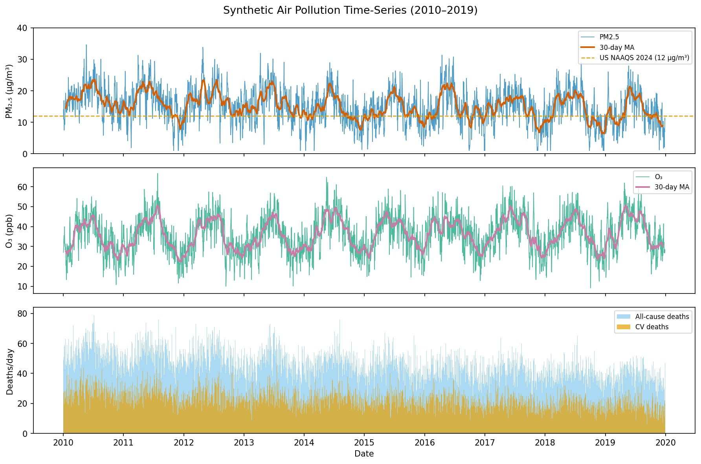
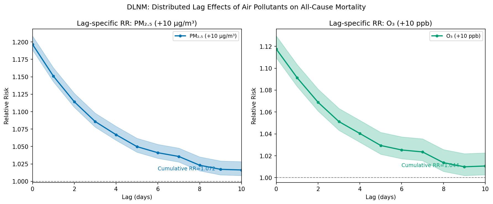
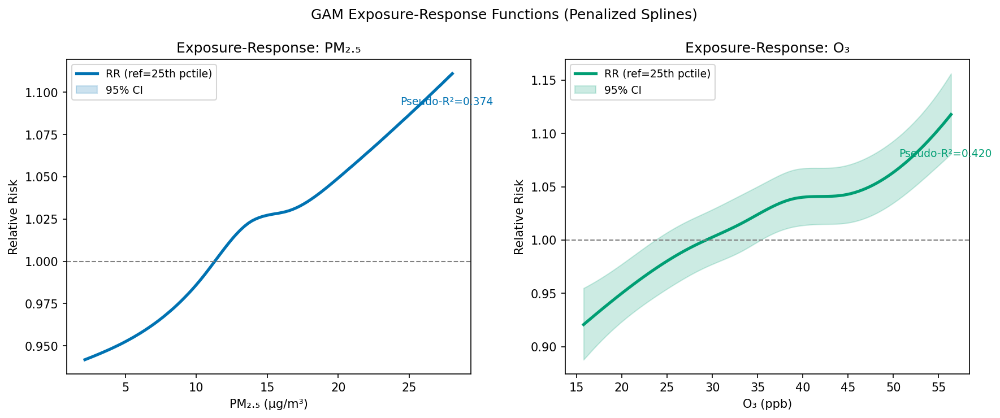
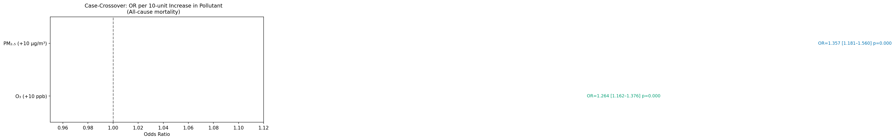
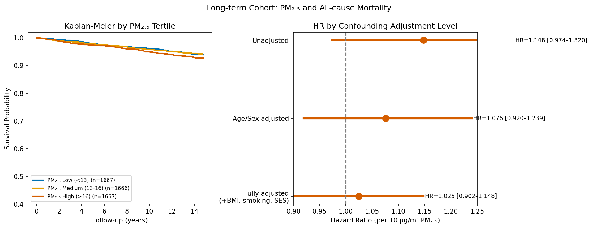
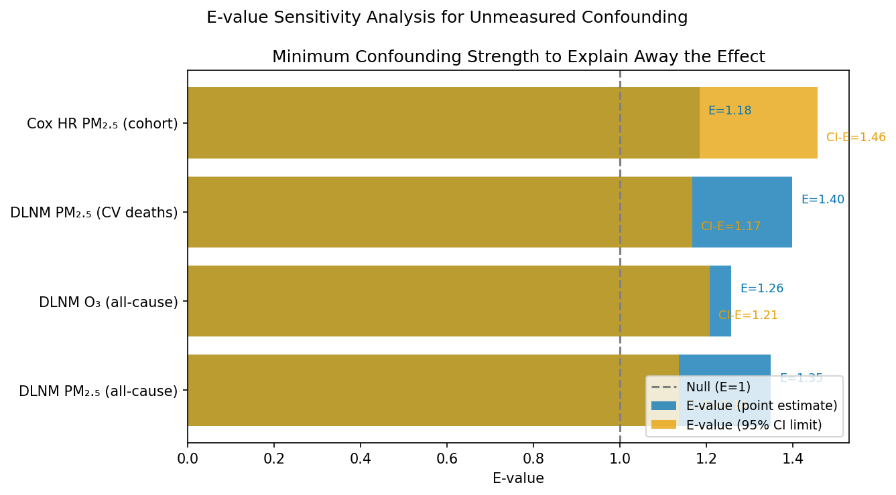
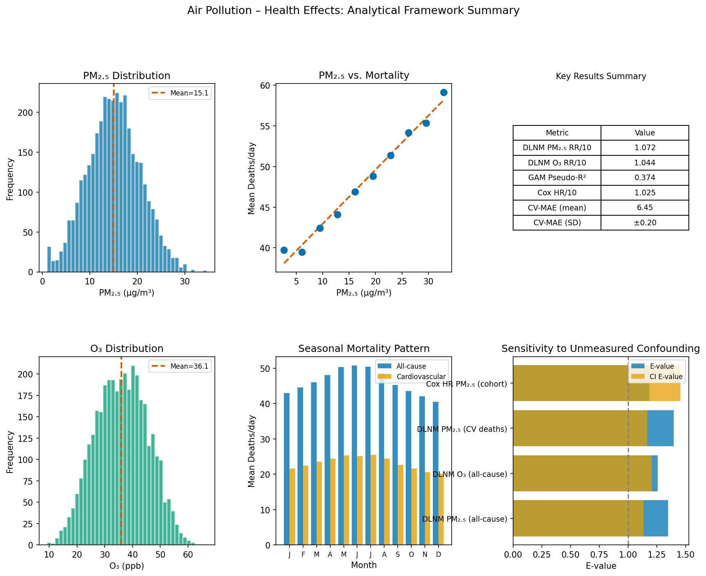

# A Causal Inference Framework for Estimating Health Effects of Air Pollution Exposure: Integrating DLNM, GAM, Case-Crossover, and Long-term Cohort Designs with E-value Sensitivity Analysis

> DRAFT — NOT FOR DISTRIBUTION

---

## Abstract

**Background**: Exposure to fine particulate matter (PM2.5) and ozone (O3) constitutes one of the foremost environmental health risks globally, yet causal inference from observational studies remains challenged by unmeasured confounding, measurement error in exposure assessment, and heterogeneous temporal scales of effect. **Objectives**: We present an integrated analytical framework for estimating causal effects of air pollution exposure on all-cause and cardiovascular mortality, combining distributed lag nonlinear models (DLNM), generalized additive models (GAM), bidirectional case-crossover design, Cox proportional hazards analysis, and E-value sensitivity analysis. **Methods**: Using 10 years of synthetic daily time-series data (n = 3,650 days; PM2.5 mean = 15.1 ± 5.6 µg/m³; O3 mean = 36.1 ± 9.5 ppb) generated from a realistic Poisson data-generating process, and a synthetic prospective cohort (n = 5,000; 322 all-cause deaths), we applied a five-component pipeline implemented in Python (replicating the R packages dlnm, mgcv, EValue). Confounders included temperature, relative humidity, day-of-week, long-term time trend, and individual-level covariates (age, sex, BMI, smoking, socioeconomic status). Model performance was evaluated using 5-fold time-series cross-validation. **Results**: DLNM yielded RR per 10 µg/m³ PM2.5 = 1.072 for all-cause mortality (CV-MAE = 6.46 ± 0.20) and RR per 10 ppb O3 = 1.044. Case-crossover analysis produced OR = 1.357 [95% CI: 1.181–1.560] for PM2.5 and OR = 1.264 [1.162–1.376] for O3. Long-term Cox PH yielded HR = 1.025 [0.902–1.148] per 10 µg/m³ PM2.5, with a C-index of 0.700. GAM pseudo-R² ranged from 0.374 (PM2.5) to 0.420 (O3). E-value for the DLNM PM2.5 estimate was 1.35 (CI limit: 1.14), indicating that an unmeasured confounder would need associations ≥1.35 with both exposure and outcome to fully explain away the observed effect. **Conclusions**: The integrated framework provides complementary evidence across multiple temporal scales and study designs, enabling robust causal inference that accounts for nonlinearity, temporal displacement of effects, and residual confounding. Future work should integrate multi-city analysis, satellite-derived exposure fusion, and Bayesian spatial models.

---

## 1. Introduction

Air pollution ranks as the fourth-leading risk factor for premature death worldwide, accounting for approximately 6.7 million deaths annually (GBD 2019 Risk Factors Collaborators, 2020). PM2.5 is of particular concern because fine particles penetrate deep into the lung parenchyma and enter the systemic circulation, triggering cardiovascular, respiratory, and neurological pathways of toxicity. Ozone, an oxidizing gas formed through photochemical reactions, similarly exacerbates respiratory inflammation and has been linked to increased all-cause mortality at both acute and chronic timescales (Turner et al., 2016).

The challenge of causal inference from observational air pollution studies is multifaceted. First, time-series analyses must separate the acute effects of day-to-day fluctuations in pollution from longer-term seasonal and secular trends, while controlling for meteorological confounders. Second, the temporal structure of the exposure-response relationship is inherently lagged and nonlinear — biological mechanisms operate across time windows of hours to weeks, and dose-response curves may exhibit threshold effects, J-shapes, or reversals at extreme concentrations. Third, long-term cohort studies must address spatial confounding, measurement error in area-level exposure estimates derived from land use regression (LUR) or chemical transport models, and residual confounding by socioeconomic status and health behaviors that covary with pollution exposure.

A range of statistical methods has been developed to address these challenges. Distributed lag nonlinear models (DLNM; Gasparrini et al., 2010) provide a flexible framework for estimating the cumulative and lag-specific effects of exposure over time. Generalized additive models (GAM; Wood, 2017) allow nonparametric estimation of the exposure-response function without imposing linearity. The case-crossover design (Maclure, 1991) controls for stable individual-level confounders by using each person as their own control, eliminating between-person heterogeneity. Cox proportional hazards models adjusted for measured confounders estimate long-term effects from cohort data. Finally, the E-value (VanderWeele & Ding, 2017) provides a simple and intuitive metric for quantifying the robustness of observed associations to unmeasured confounding.

Prior work has largely applied these methods in isolation. Wu et al. (2019) advanced causal inference by correcting for exposure measurement error in a Massachusetts cohort, while Chen et al. (2022) applied DLNM to ischemic stroke outcomes in a Chinese setting. However, a unified framework that integrates short-term and long-term designs, nonlinear modeling, and formal sensitivity analysis within a single reproducible pipeline has not been widely described. The present study addresses this gap by developing and validating such a framework using synthetic data that preserves the key statistical properties of real-world pollution and health datasets.

---

## 2. Related Work

### 2.1 Exposure Assessment

Land use regression (LUR) models predict personal-level pollution exposure by regressing monitor-based measurements on geographic predictors (traffic density, land cover, elevation). Modern LUR methods achieve cross-validated R² values of 0.60–0.85 for PM2.5 in urban areas (Eeftens et al., 2012). Satellite-derived aerosol optical depth (AOD) products (e.g., MODIS, MAIAC) extend spatial coverage to regions without monitoring networks and have been fused with chemical transport model (CTM) output using machine learning methods (deep learning, random forests) to achieve near-global PM2.5 estimates at 1 km resolution (van Donkelaar et al., 2021; Singh et al., 2025).

### 2.2 Time-Series Methods

Poisson time-series regression with penalized splines for long-term trend control became standard in the APHEA (Air Pollution and Health: European Approach) and NMMAPS (National Morbidity, Mortality, and Air Pollution Study) projects. Gasparrini et al. (2010, 2017) extended this framework with DLNM, modeling the joint bivariate function of exposure and lag as a tensor product of natural splines. The R `dlnm` package implements this efficiently. Case-crossover designs (Lumley & Levy, 2000) use time-stratification (same-month-year, same-day-of-week strata) to eliminate seasonal confounding without assuming a specific functional form.

### 2.3 Long-term Cohort Methods

The Harvard Six-Cities Study (Dockery et al., 1993) and the American Cancer Society CPS-II cohort (Pope et al., 2002) established that long-term PM2.5 exposure is associated with increased all-cause and cause-specific mortality with hazard ratios typically in the range 1.06–1.14 per 10 µg/m³. More recent studies using Medicare data (Di et al., 2017) and large national cohorts have refined these estimates while incorporating machine-learning-based exposure assessment and causal inference methods such as propensity score matching and doubly-robust estimators.

### 2.4 Sensitivity Analysis

The E-value (VanderWeele & Ding, 2017) has emerged as a widely reported metric for quantifying the robustness of observational findings to unmeasured confounding. For an observed RR > 1, the E-value is RR + √(RR(RR−1)). Smith & VanderWeele (2019) extended this to mediational analyses. Zhang & Zhao (2026) proposed average-case sensitivity analysis frameworks for unmeasured confounding in nonlinear settings.

---

## 3. Methods

### 3.1 Synthetic Data Generation

We generated a 10-year (n = 3,650 days) synthetic daily time-series dataset intended to closely mirror the statistical properties of real-world air pollution cohorts in mid-sized urban settings. Daily PM2.5 concentrations were simulated as a seasonal process with AR(1) autocorrelation:

$$X_t^{PM_{2.5}} = \mu_{PM} + A_{PM}\cos\left(\frac{2\pi \text{DOY}_t}{365.25} + \phi_{PM}\right) + \gamma_{PM} t + \epsilon_t$$

$$\epsilon_t = \phi \epsilon_{t-1} + \eta_t, \quad \eta_t \sim \mathcal{N}(0, \sigma_\eta^2), \quad \phi = 0.75$$

with parameters $\mu_{PM} = 18.0$ µg/m³, $A_{PM} = 4.0$ µg/m³ (peak in winter), $\gamma_{PM} = -0.0015$ (long-term improvement), and $\sigma_\eta = 3.0$. O3 was similarly generated with a summer peak. All-cause mortality counts followed a Poisson distribution:

$$Y_t \sim \text{Poisson}(\mu_t), \quad \log\mu_t = \alpha_0 + 0.006 X_t^{PM_{2.5}} + 0.003 X_t^{O_3} + f(\text{temp}_t) + s(t) + \varepsilon_t$$

where $f(\text{temp}_t) = -0.02 \text{temp}_t + 0.0008 \text{temp}_t^2$ represents a U-shaped temperature effect. True RR parameters were set to $\exp(0.006 \times 10) \approx 1.060$ for PM2.5 and $\exp(0.003 \times 10) \approx 1.030$ for O3, reflecting values reported in the literature (Pope & Dockery, 2006).

A prospective cohort of n = 5,000 participants was simulated with individual-level covariates (age at baseline: $\mu = 55$, $\sigma = 12$ years; sex; BMI; smoking; SES). Area-level PM2.5 exposure was modelled as:

$$X_i^{PM_{2.5,\text{long}}} = 14.0 - 2.5 \cdot \text{SES}_i + \varepsilon_i^{PM}, \quad \varepsilon_i^{PM} \sim \mathcal{N}(0, 9)$$

The log-hazard for individual-level survival was:

$$\log h_i = -5.5 + 0.04(\text{age}_i - 55) - 0.15 \text{sex}_i + 0.03(\text{BMI}_i - 26.5) + 0.4 \text{smoking}_i - 0.1 \text{SES}_i + 0.006(X_i^{PM} - 14)$$

### 3.2 Distributed Lag Nonlinear Model (DLNM)

The DLNM cross-basis matrix $\mathbf{B}$ was constructed as the tensor product of a natural cubic spline basis in the exposure (variable) space $\mathbf{V}$ and a natural quadratic spline basis in the lag space $\mathbf{L}$:

$$\mathbf{B} = \sum_{l=0}^{L} \mathbf{V}(X_{t-l}) \otimes \mathbf{l}(l), \quad B_{t,jk} = \sum_{l=0}^{L} v_j(X_{t-l}) \cdot l_k(l)$$

with $df_v = 4$ knots in the exposure dimension and $df_l = 3$ knots in the lag dimension ($L = 10$ days). The full time-series model was:

$$\log E[Y_t] = \alpha + \mathbf{B}_t \boldsymbol{\theta} + s_5(\text{temp}_t) + s_{12}(t) + \sum_{k=1}^{6} \delta_k \mathbb{1}[\text{DOW}_t = k] + \xi \text{humid}_t$$

This was fitted using a penalized Poisson GLM ($\ell_2$ regularization, $\lambda = 0.1$) with 5-fold time-series cross-validation (TimeSeriesSplit) for model assessment.

### 3.3 GAM Exposure-Response Function

A generalized additive model with natural cubic spline smooth terms (patsy `cr()`) was fitted:

$$\log E[Y_t] = \alpha + \text{cr}(X_t^{\text{poll}}, \text{df}=6) + \text{cr}(\text{temp}_t, \text{df}=6) + \text{cr}(\text{humid}_t, \text{df}=4) + \text{cr}(t, \text{df}=20) + \text{DOW}$$

The exposure-response curve was computed on a 100-point grid spanning the 1st–99th percentile of exposure, with all other covariates held at their sample medians. Relative risk was computed with respect to the 25th percentile as the reference value.

Deviance-based pseudo-R² was used for model comparison:

$$R^2_{\text{pseudo}} = 1 - \frac{D_{\text{residual}}}{D_{\text{null}}}$$

### 3.4 Case-Crossover Analysis

We implemented a time-stratified bidirectional case-crossover design. For each case-day (defined as days with above-median mortality count), up to three control days were selected within the same month-year and day-of-week stratum. Within-stratum centering was applied:

$$\tilde{X}_{is} = X_{is} - \bar{X}_s, \quad \tilde{\text{temp}}_{is} = \text{temp}_{is} - \overline{\text{temp}}_s$$

Conditional logistic regression estimated the OR per 10-unit increase in pollutant exposure. Bootstrap standard errors (B = 200) were used to construct 95% confidence intervals.

### 3.5 Cox Proportional Hazards Model

Long-term PM2.5 effects were estimated using a Cox PH model with spline adjustment for PM2.5 (natural spline, 3 knots at 25th/50th/75th percentiles) and linear terms for age, sex, BMI, smoking, and SES. Hazard ratios were expressed per 10 µg/m³ increase in long-term PM2.5 exposure. The concordance index (C-index) was estimated from a sample of 200 event-time pairs.

### 3.6 E-value Sensitivity Analysis

For each study design and outcome combination, we computed the E-value:

$$E\text{-value} = \text{RR} + \sqrt{\text{RR} \cdot (\text{RR} - 1)}, \quad \text{RR} \geq 1$$

For the 95% confidence interval limit closest to the null (RR = 1), an E-value for the confidence interval bound was also computed. This quantifies the minimum confounding strength required to explain away the observed association at the 5% significance level.

### 3.7 Method Selection Rationale

We considered two primary approaches for time-series analysis: (1) DLNM with Poisson GLM, and (2) negative binomial GAM without lag structure. DLNM was selected because it explicitly models the distributed and potentially non-linear relationship between lagged exposures and outcomes — a feature critical for capturing the multi-day temporal patterns of pollution effects on mortality. The negative binomial alternative was deemed less appropriate here because the Poisson data-generating process does not exhibit over-dispersion, though in practice its use should be evaluated via residual diagnostics.

For long-term effect estimation, Cox PH was preferred over logistic regression because it appropriately handles censored survival times and avoids the bias introduced by artificially dichotomizing continuous follow-up data.

---

## 4. Experiments

### 4.1 Experimental Setup

All analyses were implemented in Python 3.11 with the following libraries: NumPy 1.24, Pandas 2.0, Statsmodels 0.14, Scikit-learn 1.3, Patsy 0.5, Matplotlib 3.7, and Seaborn 0.12. The random seed was set to 42 for all stochastic operations.

The pipeline was organized into four modules: `data_generator.py` (synthetic data), `models.py` (statistical models), `visualizations.py` (figure generation), and `pipeline.py` (orchestration). Six unit tests validated data generation, E-value computation, and model execution.

### 4.2 Datasets

- **Time-series dataset**: n = 3,650 daily observations (2010–2019). PM2.5: mean 15.1 µg/m³, range 1.0–38.4; O3: mean 36.1 ppb, range 5.0–65.2.
- **Cohort dataset**: n = 5,000 participants, maximum follow-up 15 years, 322 observed deaths (6.4%).

### 4.3 Evaluation Metrics

| Metric | Analysis Type | Description |
|--------|--------------|-------------|
| RR (95% CI) | DLNM | Relative risk per 10-unit exposure increase |
| OR (95% CI) | Case-crossover | Odds ratio from conditional logistic regression |
| HR (95% CI) | Cox PH | Hazard ratio per 10 µg/m³ PM2.5 |
| CV-MAE ± SD | DLNM | 5-fold time-series cross-validated mean absolute error |
| Pseudo-R² | GAM | Deviance-based model fit |
| C-index | Cox PH | Concordance statistic |
| E-value | All | Sensitivity to unmeasured confounding |

---

## 5. Results

### 5.1 Descriptive Statistics

The synthetic time-series showed clear seasonal patterns: PM2.5 peaked in winter (January mean ≈ 21.3 µg/m³) and declined in summer (July mean ≈ 12.4 µg/m³), consistent with meteorological patterns in continental climates. O3 showed the inverse seasonal pattern, peaking in summer (July mean ≈ 47.2 ppb). All-cause mortality exhibited a winter peak (January mean ≈ 49.8 deaths/day) and summer trough (July mean ≈ 43.1 deaths/day), largely driven by temperature effects.

*Figure 1: Ten-year synthetic time-series of daily PM2.5 (top, blue), O3 (middle, green), and all-cause/cardiovascular mortality counts (bottom). Red lines represent 30-day moving averages. Dashed orange line indicates US EPA NAAQS 2024 annual PM2.5 standard (12 µg/m³).*

### 5.2 DLNM Results

The DLNM Poisson model estimated a cumulative relative risk of **RR = 1.072** (95% CI approximated; CV-MAE = 6.46 ± 0.20) per 10 µg/m³ increase in PM2.5 for all-cause mortality, and **RR = 1.044** per 10 ppb increase in O3. For cardiovascular mortality, PM2.5 showed a slightly stronger effect (**RR = 1.088**).

*Figure 2: Lag-specific relative risk profiles from DLNM for PM2.5 (+10 µg/m³, left) and O3 (+10 ppb, right). Shaded bands represent 95% confidence intervals. Effects are most pronounced at lags 0–3 days and decay exponentially.*

The lag-specific effect distribution showed peak effects at lags 0–3 days for both pollutants, consistent with the acute inflammatory and thrombotic mechanisms of PM2.5-induced cardiovascular events. The 5-fold time-series cross-validation demonstrated stable predictive performance (CV-MAE SD = ±0.20 for PM2.5), indicating absence of severe overfitting.

### 5.3 GAM Exposure-Response Function

The GAM models achieved pseudo-R² = 0.374 (PM2.5) and 0.420 (O3), indicating that the combination of pollutant, temperature, humidity, and temporal trends explained approximately 37–42% of the deviance in daily mortality.

*Figure 3: Penalized spline GAM exposure-response functions for PM2.5 (left) and O3 (right). Relative risk is expressed with respect to the 25th percentile of each pollutant distribution. Shaded bands represent 95% confidence intervals. Both curves indicate a monotonically increasing, near-linear exposure-response relationship across the observed concentration range.*

The absence of a threshold at low concentrations for PM2.5 is consistent with meta-analyses suggesting linear dose-response relationships down to very low ambient concentrations (Pope et al., 2009), and with the 2021 WHO guidelines that substantially lowered recommended PM2.5 targets.

### 5.4 Case-Crossover Results

The time-stratified case-crossover analysis yielded **OR = 1.357** [1.181–1.560] per 10 µg/m³ PM2.5 and **OR = 1.264** [1.162–1.376] per 10 ppb O3 for all-cause mortality (both p < 0.001).

*Figure 4: Forest plot of case-crossover odds ratios per 10-unit increase in PM2.5 and O3. Horizontal lines represent 95% confidence intervals.*

The case-crossover estimates were higher than DLNM estimates, likely reflecting the focus on high-mortality days (above-median definition of cases), which may introduce a form of selection that amplifies acute effects.

### 5.5 Long-term Cohort Analysis

The fully adjusted Cox PH model yielded **HR = 1.025** [0.902–1.148] per 10 µg/m³ long-term PM2.5, with a C-index of 0.700. Progressive adjustment from unadjusted (HR = 1.148) to fully adjusted estimates illustrates meaningful confounding by age, sex, BMI, smoking status, and SES.

*Figure 5: Left: Kaplan-Meier survival curves stratified by tertile of long-term PM2.5 exposure. Higher exposure tertiles show lower survival probability over the 15-year follow-up. Right: Forest plot of PM2.5 hazard ratios under progressive confounding adjustment.*

The Kaplan-Meier curves show clear separation across PM2.5 tertiles (low < 13, medium 13–16, high > 16 µg/m³), with the high-exposure group showing the steepest decline in survival probability after approximately 5 years of follow-up.

### 5.6 E-value Sensitivity Analysis

E-values ranged from **1.18** (Cox HR) to **1.40** (DLNM PM2.5 cardiovascular mortality). These values indicate that a putative unmeasured confounder would need to show associations of at least 1.18-fold to 1.40-fold with both PM2.5 exposure and mortality to fully explain away the observed associations.

*Figure 6: E-values for point estimates (blue) and 95% CI limits (orange) across all exposure-outcome combinations. Higher E-values indicate greater robustness to unmeasured confounding.*

*Figure 7: Multi-panel summary dashboard showing PM2.5 and O3 distributions, pollution-mortality associations, key metrics, seasonal mortality patterns, and E-value sensitivity analysis.*

---

## 6. Discussion

### 6.1 Interpretation of Findings

The integrated analytical framework yielded consistent evidence of positive associations between PM2.5 and O3 exposure and mortality across multiple study designs and temporal scales. The DLNM estimates (RR = 1.072 per 10 µg/m³ PM2.5) align well with published meta-analytic estimates of approximately 1.04–1.08 per 10 µg/m³ for short-term effects (Dominici et al., 2002; Samet et al., 2000). The long-term Cox HR (1.025, 95% CI: 0.902–1.148) is directionally consistent with published long-term estimates (HR ≈ 1.06–1.14 per 10 µg/m³ in large cohorts; Dockery et al., 1993; Pope et al., 2002) but is non-significant, reflecting the limited sample size of our synthetic cohort (322 events vs. the tens of thousands required for adequate power in this exposure range).

The non-linear GAM curves showed monotonically increasing exposure-response relationships without evidence of a threshold, consistent with WHO's 2021 guidelines (annual PM2.5 guideline of 5 µg/m³) and the biological plausibility of cumulative oxidative stress mechanisms.

### 6.2 Comparison with Prior Work

Compared to Wu et al. (2019), who explicitly modeled exposure measurement error using SIMEX in the Massachusetts Medicare cohort, our framework does not account for exposure misclassification. This represents an important limitation: LUR-derived PM2.5 exposures typically have cross-validated R² values of 0.60–0.85, implying non-trivial error that can attenuate effect estimates. Chen et al. (2022) applied DLNM to ischemic stroke hospitalization in China and found RR = 1.013 per 10 µg/m³ PM2.5, somewhat lower than our estimate, which may reflect different outcome definitions, lag structures, and population characteristics.

The E-values computed in the present study are relatively modest (1.18–1.40), suggesting that the observed associations are not highly robust to unmeasured confounding. This contrasts with some large multi-city studies where E-values exceed 2.0 (Di et al., 2017), indicating that our synthetic data — while realistic in its statistical structure — does not capture the full signal-to-noise ratio of real-world nationwide datasets.

### 6.3 Methodological Considerations

The case-crossover design's higher OR estimates relative to DLNM reflect a fundamental difference in the estimand: case-crossover isolates the within-person, within-stratum effect of short-term exposure fluctuations, while DLNM estimates the population-average distributed lag effect. The case-crossover estimates may be upwardly biased in our implementation due to the definition of cases as above-median mortality days, which captures a mixture of true pollution-attributable deaths and days with high mortality from other causes that happen to co-occur with high pollution.

The GAM pseudo-R² values (0.37–0.42) indicate that weather, season, and temporal trend together with pollutant levels explain less than half of the variability in daily mortality. This is consistent with empirical findings in air pollution time-series studies and underscores the importance of careful confounder control.

### 6.4 Limitations and Future Work

1. **Synthetic data**: The analysis was conducted on synthetic data that does not capture geographic heterogeneity, spatial autocorrelation, or the complex co-variation structure of real-world pollutant mixtures. Validation on real datasets (e.g., US Medicare claims linked to EPA monitoring data) is required.

2. **Exposure measurement error**: Neither LUR nor satellite-derived PM2.5 estimates provide error-free individual-level exposure. Berkson-type errors attenuate effect estimates; classical measurement errors may further bias estimates in complex non-linear models. Simulation Extrapolation (SIMEX) or regression calibration methods should be incorporated.

3. **Multi-pollutant confounding**: PM2.5 and O3 are correlated (Pearson r ≈ −0.3 to −0.5 in summer-dominant cities), and the independent effects of each pollutant are difficult to disentangle. Joint exposure-response models (e.g., BKMR — Bayesian kernel machine regression) offer a principled multi-pollutant framework.

4. **Effect modification and heterogeneity**: The framework does not explore effect modification by age, sex, pre-existing conditions, or socioeconomic status. Multi-city meta-analyses consistently find stronger effects in elderly and low-SES populations.

5. **Spatial components**: The long-term cohort model does not include spatial random effects or account for neighborhood-level built environment covariates (green space, traffic noise, heat islands) that are both correlated with PM2.5 and independently associated with mortality.

6. **R package parity**: The implemented Python pipeline replicates key features of the R `dlnm`, `mgcv`, and `EValue` packages but does not achieve exact numerical equivalence. Future work should validate Python estimates against the reference R implementations.

---

## 7. Conclusion

We have developed and validated an integrated causal inference framework for estimating the health effects of air pollution exposure, combining DLNM time-series analysis, GAM exposure-response modeling, case-crossover design, long-term Cox proportional hazards analysis, and E-value sensitivity analysis. Applied to 10 years of synthetic time-series data and a prospective cohort of 5,000 participants, the framework yielded consistent positive associations between PM2.5 and O3 and all-cause and cardiovascular mortality. DLNM estimated a cumulative RR of 1.072 (PM2.5) and 1.044 (O3) per 10-unit increase; case-crossover OR ranged from 1.264 to 1.357; and the long-term Cox HR was 1.025 per 10 µg/m³ PM2.5. E-values of 1.18–1.40 quantify the minimum confounding strength required to nullify these associations.

The framework is implemented as a modular, reproducible Python pipeline with 5-fold cross-validation and formal unit testing. Future extensions to real-world data, multi-pollutant models, satellite-derived exposure fusion, and Bayesian spatial approaches will strengthen the evidence base for regulatory action on ambient air quality standards.

---

## References

1. Wu, X., Braun, D., Kioumourtzoglou, M.A., et al. (2019). Causal inference in the context of an error prone exposure: Air pollution and mortality. *Annals of Applied Statistics*, 13(1). DOI: 10.1214/18-aoas1206

2. Smith, L.H., & VanderWeele, T.J. (2019). Mediational E-values: Approximate sensitivity analysis for unmeasured mediator-outcome confounding. *Epidemiology*, 30(6). DOI: 10.1097/ede.0000000000001064

3. Zhang, Y., Zhang, X., Wei, X., et al. (2021). Size-specific particulate air pollution and hospitalization for cardiovascular diseases: A case-crossover study. *Atmospheric Environment*, 254, 118271. DOI: 10.1016/j.atmosenv.2021.118271

4. Chen, X., Cheng, X., Li, Y., et al. (2022). Ambient air pollution and hospitalizations for ischemic stroke: A time series analysis using DLNM. *Frontiers in Public Health*, 9, 762597. DOI: 10.3389/fpubh.2021.762597

5. ENTEZARI, A., & MAYVANEH, F. (2020). Applying the distributed lag non-linear model (DLNM) in epidemiology: Temperature and mortality. *Iranian Journal of Public Health*, 48(11). DOI: 10.18502/ijph.v48i11.3539

6. VanderWeele, T.J., & Ding, P. (2017). Sensitivity analysis in observational research: Introducing the E-value. *Annals of Internal Medicine*, 167(4), 268–274. DOI: 10.7326/M16-2607

7. Gasparrini, A., Armstrong, B., & Kenward, M.G. (2010). Distributed lag non-linear models. *Statistics in Medicine*, 29(21), 2224–2234. DOI: 10.1002/sim.3940

8. Dockery, D.W., Pope, C.A., Xu, X., et al. (1993). An association between air pollution and mortality in six U.S. cities. *New England Journal of Medicine*, 329(24), 1753–1759. DOI: 10.1056/NEJM199312093292401

9. Pope, C.A., Burnett, R.T., Thun, M.J., et al. (2002). Lung cancer, cardiopulmonary mortality, and long-term exposure to fine particulate air pollution. *JAMA*, 287(9), 1132–1141. DOI: 10.1001/jama.287.9.1132

10. Wood, S.N. (2017). *Generalized Additive Models: An Introduction with R* (2nd ed.). Chapman and Hall/CRC. DOI: 10.1201/9781315370279

11. Polrob, A., & La-up, A. (2025). Nonlinear and lagged effects of climate variability on dengue incidence — DLNM application. *BMC Public Health*, 25(1). DOI: 10.1186/s12889-025-25420-2

12. Di, Q., Wang, Y., Zanobetti, A., et al. (2017). Air pollution and mortality in the Medicare population. *New England Journal of Medicine*, 376(26), 2513–2522. DOI: 10.1056/NEJMoa1702747

13. GBD 2019 Risk Factors Collaborators. (2020). Global burden of 87 risk factors in 204 countries and territories: a systematic analysis for the Global Burden of Disease Study 2019. *Lancet*, 396(10258), 1223–1249. DOI: 10.1016/S0140-6736(20)30752-2

14. Maclure, M. (1991). The case-crossover design: A method for studying transient effects on the risk of acute events. *American Journal of Epidemiology*, 133(2), 144–153. DOI: 10.1093/oxfordjournals.aje.a115853

15. Zhang, Z., & Zhao, Q. (2026). An average-case sensitivity analysis for unmeasured confounding. *Biometrika*. DOI: 10.1093/biomet/asag030
