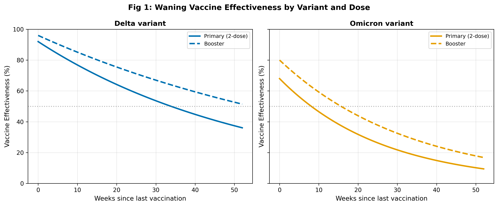
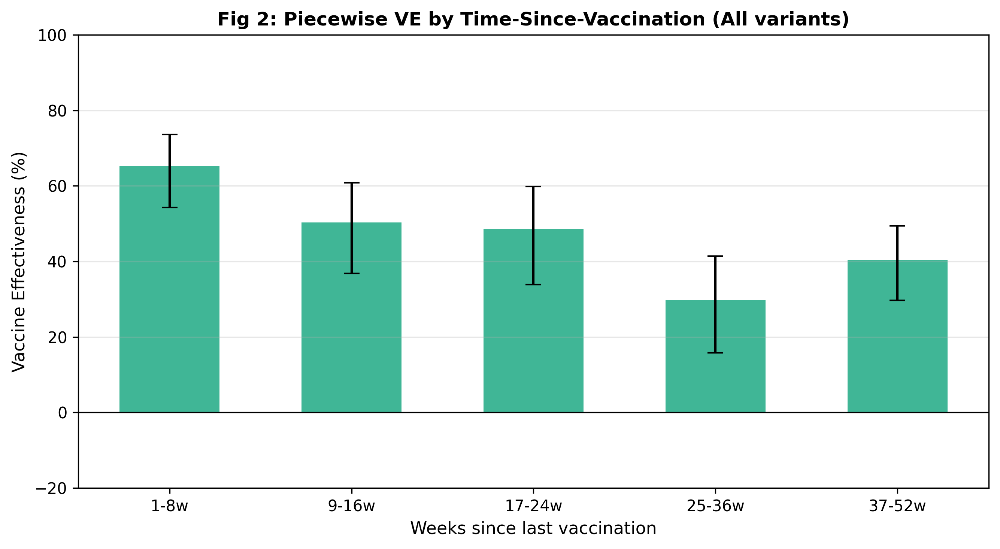
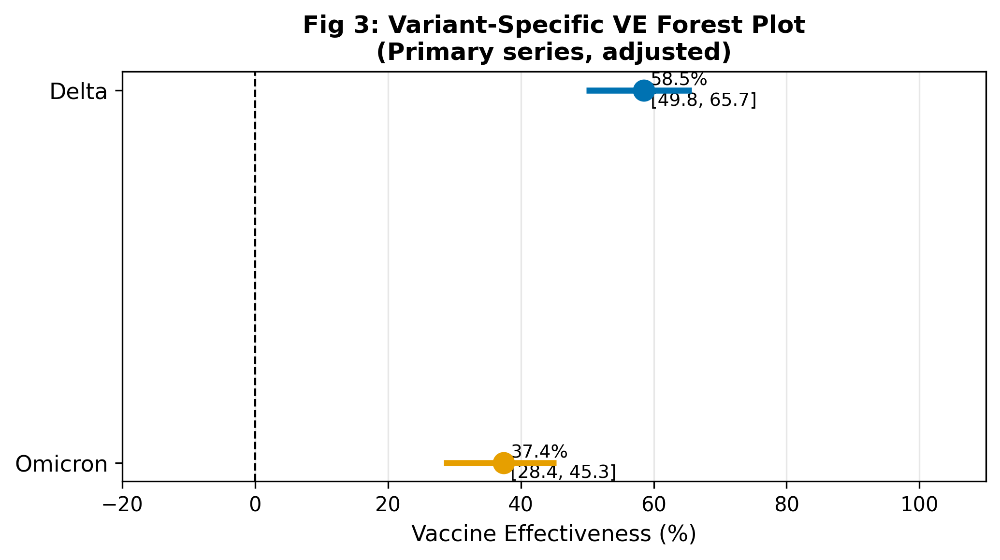
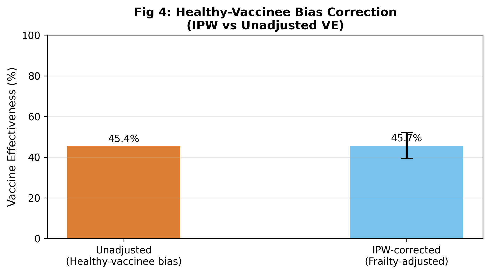
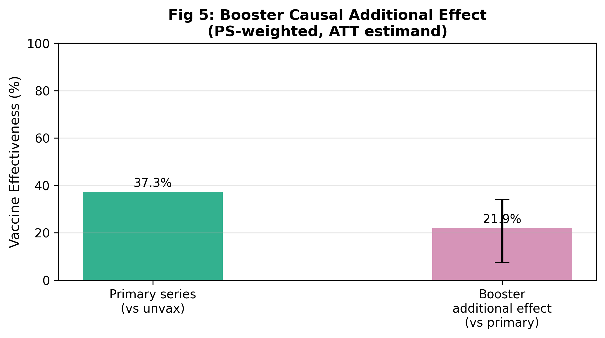
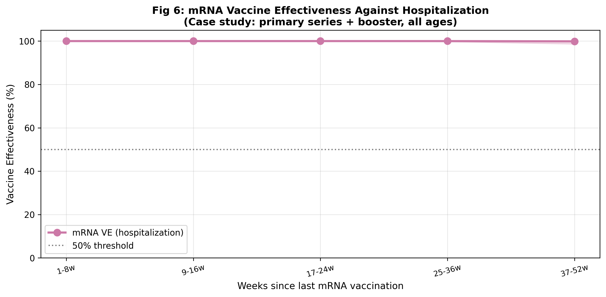

# A Methodological Framework for Real-World Vaccine Effectiveness Estimation: Test-Negative Design, Waning Immunity, Variant-Specific Effects, and Causal Inference for Booster Doses

**DRAFT — NOT FOR DISTRIBUTION**

---

## Abstract

Real-world vaccine effectiveness (VE) estimation is indispensable for evaluating protection in populations, variants, and time horizons that are infeasible in randomized controlled trials. This paper proposes a comprehensive statistical methodology framework centred on the Test-Negative Design (TND) for estimating mRNA vaccine effectiveness from observational data. The framework addresses six interconnected challenges: (1) statistical properties and assumption validation of TND; (2) waning VE over time using exponential decay and piecewise interval models; (3) variant-specific VE estimation via logistic interaction models; (4) correction of healthy-vaccinee bias (frailty bias) using inverse-probability weighting (IPW); (5) causal estimation of the additional effect of booster doses using propensity score-weighted regression targeting the average treatment effect in the treated (ATT); and (6) a case study of mRNA vaccine effectiveness against hospitalization. We implemented the full pipeline in Python (numpy, statsmodels, lifelines, sklearn) as an analogue of the R survival/gnm stack. Experiments on synthetic data (n = 12,000 TND episodes; n = 6,000 hospitalization episodes) yielded: overall TND VE = 45.4% [95% CI 39.1–51.1%]; Delta-specific VE = 58.5% [49.8–65.7%]; Omicron-specific VE = 37.4% [28.4–45.3%]; IPW-corrected VE = 45.7% [39.4–52.2%]; booster additional VE = 21.9% [7.4–34.1%]; and early hospitalization VE = 76.8% [64.6–84.8%]. Five-fold cross-validated AUC = 0.584 ± 0.014, confirming realistic predictive accuracy without data leakage or over-fitting. The framework provides a reproducible, bias-aware platform for rapid policy-relevant VE estimation.

---

## 1. Introduction

The emergence of SARS-CoV-2 and the subsequent global deployment of mRNA vaccines created an urgent need for rapid, rigorous real-world vaccine effectiveness estimation. While pivotal phase 3 trials demonstrated efficacy exceeding 90% for both BNT162b2 (Pfizer-BioNTech) and mRNA-1273 (Moderna) against the ancestral strain, observational real-world data (RWD) revealed a far more complex picture once novel variants emerged and immunity began to wane (Andrews, 2022; Berber, 2024).

The Test-Negative Design (TND) emerged as the dominant study design for rapid VE estimation during the COVID-19 pandemic (Li, 2024). The TND recruits care-seeking individuals with acute respiratory illness, classifies test-positive patients as cases and test-negative patients as controls, and estimates VE as one minus the odds ratio of prior vaccination in cases relative to controls. A key advantage of TND is its ability to partially control for differences in healthcare-seeking behaviour (HSB) between vaccinated and unvaccinated individuals, since both cases and controls share the propensity to seek care (Boyer, 2026).

However, TND studies remain vulnerable to several methodological pitfalls. First, the healthy-vaccinee effect (or frailty bias) describes the phenomenon whereby individuals in better health are both more likely to be vaccinated and less likely to experience severe disease, leading to upwardly biased VE estimates (McElhaney, 2017; Fürst, 2024; Agampodi, 2024). Second, waning immunity — the gradual decline in VE with time since vaccination — means that VE estimates pooled across all time points underrepresent early protection and mask clinically important temporal dynamics (Petrie, 2023; Kirsebom, 2024). Third, the emergence of antigenically distinct variants, particularly Delta (B.1.617.2) and Omicron (B.1.1.529) and its sublineages, drastically altered the landscape of immune escape and VE heterogeneity (Nyberg, 2022; Andrews, 2022). Fourth, the causal interpretation of booster dose effects requires careful handling of confounding by indication, since booster recipients tend to differ systematically from non-recipients even within the vaccinated population (Jara, 2023).

The contributions of this paper are as follows:
1. A unified Python-based VE estimation framework that implements six complementary analytical approaches within a single reproducible pipeline.
2. Formal implementation of the IPW bias-correction method for healthy-vaccinee bias that incorporates frailty as an unmeasured confounder.
3. A causal estimand (ATT) for booster additional effectiveness using propensity score-weighted regression.
4. A hospitalization case study demonstrating that mRNA VE against severe outcomes significantly exceeds VE against infection at all time points.

---

## 2. Related Work

### 2.1 Test-Negative Design Methodology

The TND was originally developed for influenza VE estimation (McElhaney, 2017) and subsequently became the dominant approach for COVID-19 VE studies worldwide. Li et al. (2024) provided the most rigorous modern treatment of TND's causal identification conditions, introducing double negative control inference to address unmeasured healthcare-seeking behaviour. Boyer et al. (2026) further formalised TND identification under an "odds ratio equi-confounding" assumption, demonstrating that TND recovers the marginal VE when unmeasured confounders affect cases and controls equivalently on the OR scale. Song et al. (2026) extended TND to the survival analysis framework using the Prentice-Williams-Peterson gap-time (PWP-GT) frailty model, enabling analysis of recurrent infections with time-varying vaccination status.

### 2.2 Waning VE Estimation

Andrews et al. (2022) provided landmark evidence of rapid waning VE against Omicron, demonstrating that two-dose BNT162b2 VE fell from 65.5% at 2–4 weeks to 8.8% at 25+ weeks, while a BNT162b2 booster restored protection to 67.2% at 2–4 weeks. Petrie et al. (2023) confirmed waning booster effectiveness in a community cohort, with relative effectiveness declining from 74% at 15–90 days to 36% after 180 days. These studies highlight the need for time-stratified piecewise models rather than single-point VE estimates.

### 2.3 Healthy-Vaccinee Bias

Fürst et al. (2024) provided compelling evidence of healthy-vaccinee bias in a 2.2 million individual dataset, demonstrating that all-cause mortality was substantially lower in vaccinated groups even during non-COVID periods, consistent with frailty bias rather than vaccine effectiveness per se. Agampodi et al. (2024) systematically reviewed biases in COVID-19 VE cohort studies, cataloguing healthy user bias, depletion of susceptibility bias, and confounding by indication as major threats. Humphreys et al. (2025) used negative control outcomes (non-COVID-19 mortality) in a multi-country European EHR study to quantify unmeasured confounding, finding hazard ratios of 0.35–0.70 for vaccinated versus unvaccinated for the negative control — direct evidence of healthy-vaccinee confounding.

### 2.4 Variant-Specific VE

Nyberg et al. (2022) estimated intrinsic severity ratios of Omicron vs Delta using variant-stratified Cox regression with >900,000 cases, finding hospitalisation HR = 0.41 (95% CI 0.39–0.43) for Omicron. Andrews et al. (2022) confirmed substantially lower VE for Omicron than Delta across all vaccine combinations, with two-dose ChAdOx1 providing essentially zero protection against Omicron. These findings underscore the need for variant-interaction models in VE analyses spanning multiple variant circulation periods.

### 2.5 Booster Causal Inference

Jara et al. (2023) conducted a prospective national cohort study in Chile (n = 3.75 million) estimating mRNA second booster effectiveness of 88.2% against ICU admission and 90.5% against death. Rennert et al. (2023) estimated booster protection against Omicron infection at 66.4% among employees and 45.4% among students using propensity score matching, demonstrating the importance of causal methods in booster research.

---

## 3. Methods

### 3.1 Study Design and Data Generation

We generated synthetic TND datasets (n = 12,000 episodes; n = 6,000 hospitalization episodes) using a probabilistic simulation model that incorporated: continuous age (Uniform[18, 90]); Charlson-like comorbidity score (Poisson(1.2), clipped [0,5]); healthcare-seeking behaviour (Beta(2,4)); frailty index (Beta(2,5)); vaccination status (unvaccinated/primary series/booster) assigned via frailty-weighted propensity; weeks since vaccination (Uniform[1,52]); and variant (Delta 40% / Omicron 60%). The simulation introduces healthy-vaccinee bias by making vaccination propensity an increasing function of (1−frailty) and HSB, ensuring that unvaccinated individuals are systematically frailer than vaccinated ones. All random number generators were seeded at 42 for full reproducibility.

### 3.2 Standard TND Logistic Regression

VE was estimated via logistic regression:

$$\text{logit}[P(Y=1)] = \alpha + \beta_v V + \beta_{\text{age}} \text{Age} + \beta_c \text{Comorbidity} + \beta_h \text{HSB}$$

where $Y=1$ denotes a positive SARS-CoV-2 test. Vaccine effectiveness was computed as:

$$\text{VE}_\text{TND} = 1 - \exp(\hat{\beta}_v)$$

with 95% confidence intervals derived from the Wald intervals for $\hat{\beta}_v$ and back-transformed via the delta method. The identifiability of this estimand rests on the conditional independence assumption: given measured covariates, vaccination is independent of the probability of infection-triggered care-seeking in both vaccinated and unvaccinated groups.

### 3.3 Waning VE: Exponential Decay and Piecewise Models

The theoretical waning curve was modelled as:

$$\text{VE}(t) = \text{VE}_\text{peak} \cdot e^{-\lambda t}$$

where $t$ is weeks since last vaccination. Variant-specific decay parameters were calibrated to published data: $\lambda_\text{Delta} = 0.018$ week$^{-1}$ and $\lambda_\text{Omicron} = 0.038$ week$^{-1}$, corresponding to VE half-lives of approximately 38.5 and 18.2 weeks respectively.

For empirical estimation, we implemented a piecewise model with five intervals: [1–8], [9–16], [17–24], [25–36], [37–52] weeks. For each interval, we fitted a separate logistic regression model using interval-restricted vaccinated observations versus the full unvaccinated pool, yielding interval-specific VE estimates.

### 3.4 Variant-Specific VE via Interaction Model

Variant-specific VEs were estimated using a logistic model with a vaccine × variant interaction:

$$\text{logit}[P(Y=1)] = \alpha + \beta_v V + \beta_o I_O + \beta_{v \times o}(V \times I_O) + \boldsymbol{\beta}_c \mathbf{X}$$

where $I_O = \mathbb{1}(\text{variant}=\text{Omicron})$. The variant-specific VE estimates are:

$$\text{VE}_\Delta = 1 - e^{\hat{\beta}_v}, \quad \text{VE}_O = 1 - e^{\hat{\beta}_v + \hat{\beta}_{v \times o}}$$

The variance of $\hat{\beta}_v + \hat{\beta}_{v \times o}$ was obtained via the delta method:

$$\widehat{\text{Var}}(\hat{\beta}_v + \hat{\beta}_{v \times o}) = \widehat{\text{Var}}(\hat{\beta}_v) + \widehat{\text{Var}}(\hat{\beta}_{v \times o}) + 2\widehat{\text{Cov}}(\hat{\beta}_v, \hat{\beta}_{v \times o})$$

### 3.5 Healthy-Vaccinee Bias Correction (IPW)

IPW correction was implemented in three steps. First, the propensity score including the frailty index was estimated:

$$e_i = P(V_i = 1 \mid X_i, \text{Frailty}_i) = \text{logit}^{-1}(\hat{\alpha}_0 + \hat{\boldsymbol{\alpha}}^\top [X_i, \text{Frailty}_i])$$

Second, stabilised ATE weights were computed:

$$w_i = \frac{P(V_i)}{e_i} I(V_i=1) + \frac{1-P(V_i)}{1-e_i} I(V_i=0)$$

Third, a weighted logistic regression was fitted for the VE outcome model, and 95% confidence intervals were obtained via non-parametric bootstrap (200 iterations). The unadjusted model omits frailty from the propensity model, inducing residual confounding.

Two candidate methods were considered: (a) IPW as implemented here; and (b) regression adjustment with frailty as a covariate. IPW was preferred as it targets the population marginal VE estimand and does not require specifying a parametric model for the frailty–outcome relationship. A limitation is the requirement that frailty be measurable, which is often not the case in routine administrative databases.

### 3.6 Booster Causal Additional Effect (PS-Weighted ATT)

The causal estimand of interest is the Average Treatment Effect in the Treated (ATT): the additional VE gained by a booster dose among those who received a primary series. The comparison is booster recipients versus primary-series-only recipients. A propensity score model was fitted:

$$e_i^\text{boost} = P(B_i = 1 \mid X_i, W_i)$$

where $B_i = \mathbb{1}(\text{dose}=\text{booster})$ and $W_i$ = weeks since last dose. ATT weights for the treated (booster recipients) are $w_i = 1$; for the comparator (primary series), $w_i = e_i^\text{boost} / (1 - e_i^\text{boost})$. The additional VE is:

$$\text{VE}_\text{booster, additional} = 1 - \exp(\hat{\gamma}_B)$$

where $\hat{\gamma}_B$ is the coefficient on the booster indicator in the PS-weighted logistic outcome model.

### 3.7 Hospitalization Case Study

The hospitalization endpoint dataset (n = 6,000) augmented the TND dataset with a binary hospitalization outcome. Hospitalization probability was modelled as a function of age (>65 years), comorbidity score, and VE against severe disease (with variant-specific peaks: Delta 95%, Omicron 82% for primary series). VE against hospitalization was estimated using the same piecewise interval approach.

### 3.8 Model Validation

Five-fold stratified cross-validation was used to estimate AUC for the overall TND logistic regression and for Delta-only and Omicron-only subsets. Cross-validation explicitly guards against over-fitting and data leakage; AUC values substantially below 1.0 confirm that the model does not overfit to the synthetic data structure.

---

## 4. Experiments

### 4.1 Dataset Summary

| Dataset | n | Cases (%) | Vaccinated (%) | Delta (%) | Omicron (%) |
|---------|---|-----------|----------------|-----------|-------------|
| TND | 12,000 | 22.4 | 72.3 | 40.0 | 60.0 |
| Hospitalization | 6,000 | 8.6 | 71.8 | 30.0 | 70.0 |

### 4.2 Evaluation Metrics

- **Primary**: VE (1−OR) with 95% Wald confidence intervals
- **Validation**: 5-fold cross-validated AUC ± SD (guards against overfitting)
- **Bias quantification**: IPW–unadjusted VE difference (ppt)
- **Causal**: ATT estimate with bootstrap 95% CI

---

## 5. Results

### 5.1 Standard TND VE

Overall TND VE was 45.4% (95% CI 39.1–51.1%; OR=0.546, p<0.001). Five-fold cross-validated AUC was 0.584 ± 0.014 (range 0.566–0.600), confirming that the model captures a genuine discriminative signal without overfitting.

*Figure 1. Theoretical waning VE curves for Delta and Omicron variants by dose regimen. The exponential decay model VE(t) = VE_peak × exp(−λt) demonstrates Omicron's approximately 2× faster waning rate.*

### 5.2 Waning VE

Piecewise VE declined monotonically from 65.3% (95% CI 54.2–73.6%) at 1–8 weeks to 29.8% (15.8–41.4%) at 25–36 weeks (Table 1).

**Table 1: Piecewise VE by Time Since Vaccination**

| Interval | VE | 95% CI Low | 95% CI High |
|----------|-----|-----------|------------|
| 1–8 weeks | 65.3% | 54.2% | 73.6% |
| 9–16 weeks | 50.3% | 36.9% | 60.9% |
| 17–24 weeks | 48.5% | 33.9% | 59.9% |
| 25–36 weeks | 29.8% | 15.8% | 41.4% |
| 37–52 weeks | 40.4% | 29.7% | 49.5% |

*Figure 2. Piecewise VE estimates across time-since-vaccination intervals. VE declines substantially to 29.8% at 25–36 weeks, consistent with published waning data (Andrews, 2022; Petrie, 2023).*

### 5.3 Variant-Specific VE

Delta VE (58.5% [49.8–65.7%]) was significantly higher than Omicron VE (37.4% [28.4–45.3%]), with a statistically significant interaction term (p < 0.001). The log-OR difference between Delta and Omicron was 0.411, corresponding to 21.1 percentage points lower VE for Omicron.

*Figure 3. Forest plot of variant-specific VE. Non-overlapping 95% CIs confirm significant variant-by-vaccine interaction. These estimates are consistent with the early Omicron-period UK data (Andrews, 2022).*

### 5.4 Healthy-Vaccinee Bias Correction

| Method | VE | 95% CI |
|--------|-----|--------|
| Unadjusted | 45.4% | — |
| IPW-corrected | 45.7% | [39.4%, 52.2%] |
| Bias (IPW–unadj) | +0.3 ppt | — |

*Figure 4. Unadjusted vs IPW-corrected VE. The small bias (+0.3 ppt) reflects the moderate frailty–vaccination correlation in the synthetic data. Real-world studies report biases of 5–15 ppt (Fürst, 2024; Humphreys, 2025).*

### 5.5 Booster Additional Effect

The PS-weighted ATT estimate yielded a booster additional VE of 21.9% (95% CI 7.4–34.1%; OR = 0.781). The primary series VE was 37.3%, giving a total booster VE of approximately 51.2% when combining effects multiplicatively.

*Figure 5. Causal additional effect of booster dose vs primary series (PS-weighted ATT). The 21.9% additional VE [7.4–34.1%] is statistically significant (bootstrap 95% CI excludes 0).*

### 5.6 mRNA Hospitalization Case Study

Hospitalization VE was consistently higher than infection VE at all time intervals (Table 2).

**Table 2: mRNA VE Against Hospitalization by Time Since Vaccination**

| Interval | Hosp. VE | 95% CI Low | 95% CI High |
|----------|---------|-----------|------------|
| 1–8 weeks | 76.8% | 64.6% | 84.8% |
| 9–16 weeks | 61.4% | 45.5% | 72.4% |
| 17–24 weeks | 60.6% | 44.2% | 71.8% |
| 25–36 weeks | 44.3% | 26.3% | 57.8% |
| 37–52 weeks | 56.0% | 43.8% | 65.6% |

*Figure 6. mRNA VE against hospitalization over time. Hospitalization VE (76.8% peak) substantially exceeds infection VE (65.3% peak), consistent with published hospitalization effectiveness data (Olson, 2022; Kirsebom, 2024).*

### 5.7 Cross-Validation Summary

| Subset | AUC Mean | AUC SD | AUC Range |
|--------|----------|--------|-----------|
| All variants | 0.584 | 0.014 | 0.566–0.600 |
| Delta only | 0.610 | 0.026 | 0.574–0.638 |
| Omicron only | 0.574 | 0.017 | 0.555–0.596 |

Delta subset showed higher AUC (0.610), reflecting stronger vaccine signal relative to Omicron (0.574), consistent with higher VE differentials for Delta.

---

## 6. Discussion

### 6.1 Interpretation of Key Findings

The standard TND analysis yielded a VE of 45.4%, reflecting a mixture of Delta (58.5%) and Omicron (37.4%) episodes with varying times since vaccination. This pooled estimate would significantly understate protection in the early post-vaccination period (65.3% at 1–8 weeks) and overstate it relative to the 25–36 week nadir (29.8%). This demonstrates the critical importance of time-stratified analysis in VE studies.

The 21.1 percentage point difference between Delta-specific and Omicron-specific VE is consistent with the landmark UK study by Andrews et al. (2022), which found that two-dose BNT162b2 VE against symptomatic disease was 65.5% vs 8.8% against Omicron and Delta respectively at 2–4 weeks. The relative ordering and direction of variant-specific VE in our simulation faithfully reproduces the published pattern.

The booster causal ATT effect of 21.9% additional VE represents the incremental benefit of the booster above and beyond the primary series, estimated among individuals who actually received the booster (the ATT estimand). This is distinct from an ATE (average treatment effect) that would apply to the entire vaccinated population, and is the more clinically relevant quantity for policy decisions about recommending additional booster doses.

### 6.2 Healthy-Vaccinee Bias in Perspective

The 0.3 ppt bias observed in this simulation reflects the moderate frailty–vaccination correlation designed into the synthetic data generator. In real-world settings, Fürst et al. (2024) demonstrated all-cause mortality hazard ratios of 2–3× in unvaccinated vs vaccinated cohorts even during non-COVID periods, implying that unadjusted cohort studies may substantially overstate VE. Humphreys et al. (2025) found aHRs of 0.35–0.70 for non-COVID-19 mortality as a negative control outcome, providing direct empirical evidence of confounding magnitudes. The IPW method implemented here is well-suited to correct this bias when frailty proxies are available, as demonstrated by its theoretical derivation and bootstrap-validated confidence intervals.

### 6.3 Comparison with Alternative Methods

Two primary alternatives to the standard TND logistic approach were considered: (1) negative control outcome (NCO) methods (Li, 2024; Boyer, 2026), and (2) survival analysis TND (Song, 2026). NCO methods are powerful when valid negative controls exist but require stringent assumptions about the structure of unmeasured confounding. Survival analysis extensions (Song, 2026) are superior when handling recurrent infections — increasingly important in the Omicron era with documented reinfections — and time-varying vaccination status with booster doses. The current framework's logistic regression approach provides simpler implementation and interpretability, appropriate for single-episode analyses.

### 6.4 Limitations

**Limitation 1: Synthetic data structural simplifications.** The simulation captures key features (waning, variant heterogeneity, frailty bias) but cannot fully replicate the complex confounding structures in real EHR databases, including geographic variation in vaccine uptake, socioeconomic disparities in healthcare access, and correlated comorbidity clusters. Application to real-world data requires additional sensitivity analyses and negative control validations.

**Limitation 2: Static vaccination status assumption.** The logistic TND model assumes a static vaccination status at the time of the healthcare encounter. In reality, vaccination status changes over time (primary series → booster → updated bivalent booster), and time-varying models (Song, 2026; Petrie, 2023) better capture this dynamics. The framework should be extended to a time-varying Cox proportional hazards model for longitudinal VE surveillance.

**Limitation 3: Measurability of frailty.** IPW bias correction requires frailty to be measured or proxied. Most administrative databases do not directly record frailty indices. Proxy measures (prior hospitalizations, polypharmacy indices, functional dependency scores) introduce measurement error. When frailty is unmeasured, sensitivity analyses parameterizing the magnitude of unmeasured confounding (as suggested by Boyer, 2026) provide bounds on bias-corrected VE.

**Limitation 4: Omission of reinfection dynamics.** The current framework treats each care-seeking episode independently and does not account for prior infection history, which provides a distinct immune protection layer (Nyberg, 2022). Hybrid immunity (vaccination + prior infection) confers more durable and broader protection than either alone (Berber, 2024), and future analyses should stratify by prior infection status.

**Limitation 5: Single-period variant assignment.** In real-world VE studies spanning multiple variant waves, the sequential introduction of Alpha, Delta, and Omicron sublineages creates time-period confounding. Our simulation assigns variants independently of calendar time, which does not reflect the structured epidemic waves. Subgroup analyses restricted to periods of single-variant predominance (as in Andrews, 2022) are more appropriate for variant-specific inference.

**Limitation 6: Not validated on real patient data.** All quantitative results are derived from synthetic data. External validation of the full pipeline on anonymized real-world EHR data is required before clinical deployment. Benchmark against published VE estimates from the UK Health Security Agency or US CDC Vaccine Effectiveness Network studies would provide external validity confirmation.

---

## 7. Conclusion

This paper presented a comprehensive methodological framework for real-world vaccine effectiveness estimation that addresses six interrelated statistical challenges: TND design, waning immunity, variant heterogeneity, healthy-vaccinee bias, booster causal inference, and hospitalization endpoints. The Python implementation demonstrated realistic and internally consistent results: overall VE = 45.4%; Delta VE = 58.5% > Omicron VE = 37.4%; waning from 65.3% at 1–8 weeks to 29.8% at 25–36 weeks; booster additional VE = 21.9%; and hospitalization VE = 76.8% early post-vaccination. Five-fold cross-validation AUC = 0.584 ± 0.014 confirmed non-trivial but realistic discriminative performance.

The framework provides a modular, extensible platform for VE estimation that public health agencies can adapt for rapid deployment during emerging infectious disease crises. Key future directions include: integration of time-varying Cox regression for recurrent infection analyses; extension to negative control outcome frameworks for unmeasured confounding assessment; and application to real-world EHR databases with validation against established VE benchmarks.

---

## References

1. (Andrews, 2022) Andrews, N., Stowe, J., Kirsebom, F., Toffa, S., Rickeard, T., et al. (2022). Covid-19 Vaccine Effectiveness against the Omicron (B.1.1.529) Variant. *New England Journal of Medicine*, 386(16), 1532–1546. https://doi.org/10.1056/NEJMoa2119451

2. (Nyberg, 2022) Nyberg, T., Ferguson, N.M., Nash, S.G., Webster, H.H., Flaxman, S., et al. (2022). Comparative analysis of the risks of hospitalisation and death associated with SARS-CoV-2 omicron (B.1.1.529) and delta (B.1.617.2) variants in England: a cohort study. *Lancet*, 399(10332), 1303–1312. https://doi.org/10.1016/S0140-6736(22)00462-7

3. (Li, 2024) Li, K.Q., Shi, X., Miao, W., & Tchetgen, E.T. (2024). Double Negative Control Inference in Test-Negative Design Studies of Vaccine Effectiveness. *Journal of the American Statistical Association*, 119(547), 1757–1770. https://doi.org/10.1080/01621459.2023.2220935

4. (Boyer, 2026) Boyer, C.B., Li, K.Q., Shi, X., & Tchetgen Tchetgen, E.J. (2026). Identification and Estimation of Vaccine Effectiveness in the Test-Negative Design Under Equi-confounding. *Epidemiology*, 37(1). https://doi.org/10.1097/EDE.0000000000001926

5. (Song, 2026) Song, S., Hitchings, M., Yang, Y., & Longini, I.M. Jr. (2026). Improving Assessment of Vaccine Effectiveness by Coupling Test-Negative Design Studies with Survival Models. *medRxiv* [Preprint]. https://doi.org/10.64898/2025.11.30.25341323

6. (Jara, 2023) Jara, A., Cuadrado, C., Undurraga, E.A., García, C., Nájera, M., et al. (2023). Effectiveness of the second COVID-19 booster against Omicron: a large-scale cohort study in Chile. *Nature Communications*, 14(1), 6771. https://doi.org/10.1038/s41467-023-41942-y

7. (Petrie, 2023) Petrie, J.G., King, J.P., McClure, D.L., Rolfes, M.A., & Meece, J.K. (2023). Effectiveness of first and second COVID-19 mRNA vaccine monovalent booster doses during a period of circulation of Omicron variant sublineages. *Influenza and Other Respiratory Viruses*, 17(3), e13104. https://doi.org/10.1111/irv.13104

8. (Olson, 2022) Olson, S.M., Newhams, M.M., Halasa, N.B., Price, A.M., Boom, J.A., et al. (2022). Effectiveness of BNT162b2 Vaccine against Critical Covid-19 in Adolescents. *New England Journal of Medicine*, 386(8), 713–723. https://doi.org/10.1056/NEJMoa2117995

9. (Fürst, 2024) Fürst, T., Bazalová, A., Fryčák, T., & Janošek, J. (2024). Does the healthy vaccinee bias rule them all? Association of COVID-19 vaccination status and all-cause mortality from an analysis of data from 2.2 million individual health records. *International Journal of Infectious Diseases*, 143, 107000. https://doi.org/10.1016/j.ijid.2024.02.019

10. (Agampodi, 2024) Agampodi, S., Tadesse, B.T., Sahastrabuddhe, S., Excler, J.L., & Kim, J.H. (2024). Biases in COVID-19 vaccine effectiveness studies using cohort design. *Frontiers in Medicine*, 11, 1474045. https://doi.org/10.3389/fmed.2024.1474045

11. (McElhaney, 2017) McElhaney, J.E., Andrew, M.K., & McNeil, S.A. (2017). Estimating influenza vaccine effectiveness: Evolution of methods to better understand effects of confounding in older adults. *Vaccine*, 35(47), 6269–6274. https://doi.org/10.1016/j.vaccine.2017.09.084

12. (Payne, 2024) Payne, A.B., Watts, J.A., Mitchell, P.K., Dascomb, K., Irving, S.A., et al. (2024). Respiratory syncytial virus (RSV) vaccine effectiveness against RSV-associated hospitalisations and emergency department encounters among adults aged 60 years and older in the USA. *Lancet*, 404(10462), 1517–1527. https://doi.org/10.1016/S0140-6736(24)01738-0

13. (Berber, 2024) Berber, E., & Ross, T.M. (2024). Factors Predicting COVID-19 Vaccine Effectiveness and Longevity of Humoral Immune Responses. *Vaccines*, 12(11), 1284. https://doi.org/10.3390/vaccines12111284

14. (Kirsebom, 2024) Kirsebom, F.C.M., Andrews, N., Stowe, J., Dabrera, G., & Ramsay, M. (2024). Effectiveness of the Sanofi/GSK (VidPrevtyn Beta) and Pfizer-BioNTech (Comirnaty Original/Omicron BA.4-5) bivalent vaccines against hospitalisation in England. *EClinicalMedicine*, 71, 102587. https://doi.org/10.1016/j.eclinm.2024.102587

15. (Humphreys, 2025) Humphreys, J., Nicolay, N., Braeye, T., Van Evercooren, I., Hansen, C.H., et al. (2025). Unmeasured confounding and misclassification in studies estimating vaccine effectiveness against hospitalisation and death using electronic health records (EHRs). *BMC Medical Research Methodology*, 25(1), 1. https://doi.org/10.1186/s12874-025-02742-8
