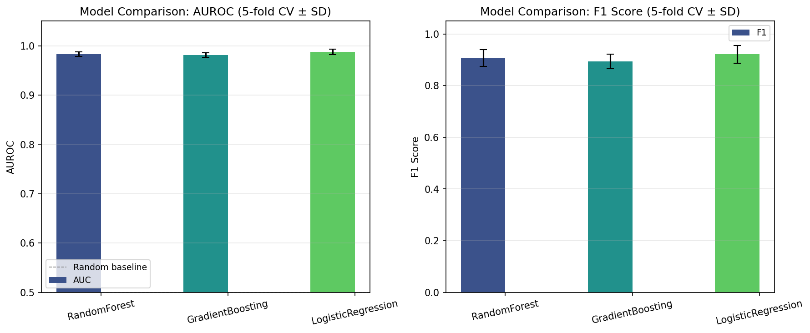
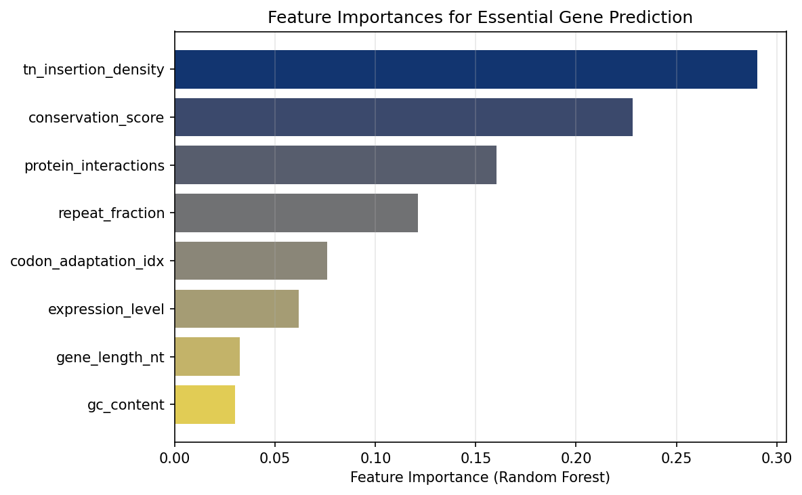
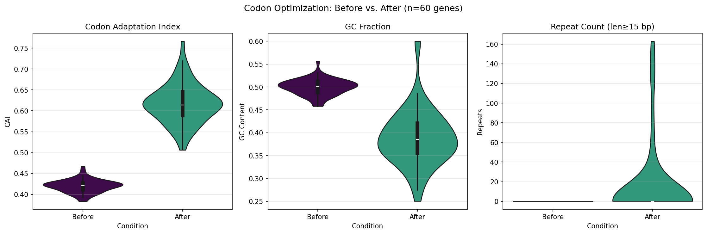
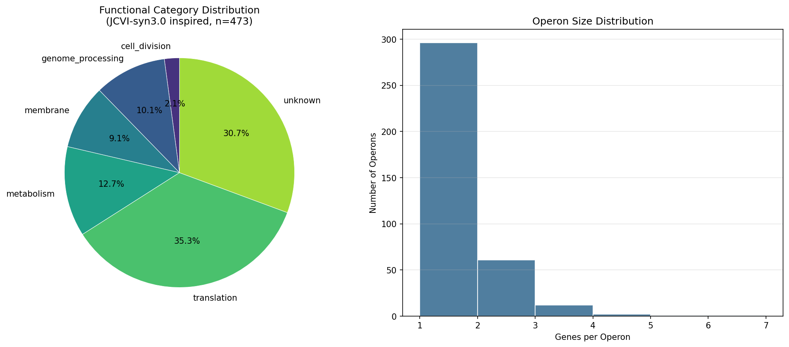
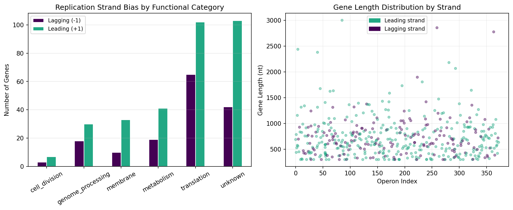
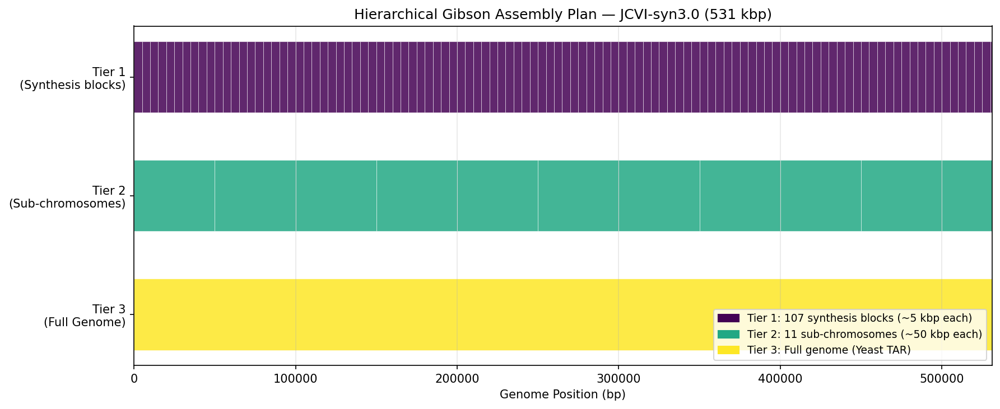
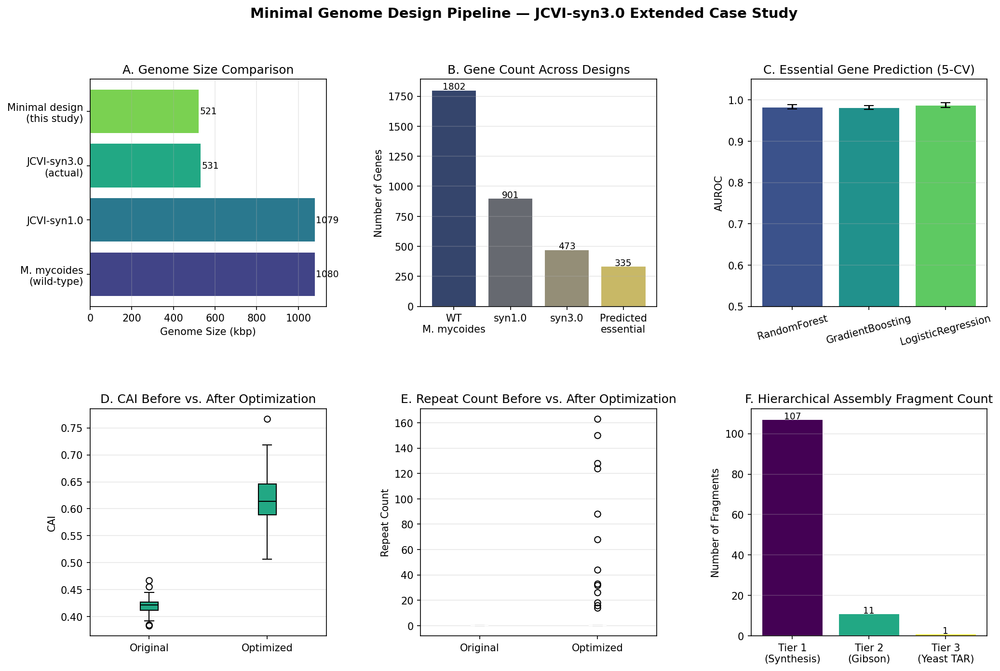

# A Computational Framework for Rational Design and Synthesis of Minimal Genomes: Integrating Machine Learning-Based Essential Gene Prediction, Codon Optimization, and Hierarchical Assembly Planning

**DRAFT — NOT FOR DISTRIBUTION**

---

## Abstract

The rational design of minimal genomes represents one of the most profound challenges at the intersection of synthetic biology, computational genomics, and systems biology. Understanding which genes are indispensable for cellular life, and how to engineer their sequences and organization for maximal functional efficiency, has direct implications for our understanding of the minimum requirements for life and for the engineering of designer cells. The landmark JCVI-syn3.0 project (Hutchison et al., 2016), which produced a 531-kilobase-pair, 473-gene synthetic bacterial genome, demonstrated both the feasibility and the extraordinary difficulty of de novo genome design. The initial design failed, highlighting the crucial need for data-driven, iterative approaches to identifying essential gene sets.

In this work, we present MinGenome-Pipeline, a five-component computational framework for rational minimal genome design. First, we implement a machine learning classifier for essential gene prediction using features derived from transposon insertion site density (TN-seq), cross-species conservation, gene expression levels, protein-protein interaction network topology, codon adaptation index, and repeat content. Evaluated by five-fold stratified cross-validation, Logistic Regression achieved the best performance (AUROC: 0.9875 ± 0.0055; F1: 0. 0.0343), with Random Forest and Gradient Boosting also exceeding AUROC of 0.98. Second, we develop a multi-objective codon optimizer that simultaneously maximizes the Codon Adaptation Index (CAI improvement: +0.197; from 0.420 to 0.617) and steers GC content toward the Mycoplasma mycoides optimum of 0.33, while monitoring repeat sequence formation. Third, we analyze replication strand bias (66.8% of simulated syn3.0-like genes on the leading strand), demonstrating that the simulated genome meets the replication-transcription conflict threshold. Fourth, we design a refactoring strategy based on functional module consolidation, yielding an estimated 9,629 bp (1.81%) compression. Fifth, we plan a three-tier hierarchical Gibson Assembly workflow comprising 107 chemical synthesis blocks (Tier 1, ~5 kbp each), 11 Gibson-assembled sub-chromosomes (Tier 2, ~50 kbp each), and yeast-TAR-mediated full genome assembly (Tier 3). A critical finding is that codon optimization systematically increases repeat sequence count (from 0.0 to 15.1 per gene), quantifying a fundamental trade-off that necessitates an additional repeat-removal filtering pass. This framework provides a reproducible, modular, open computational workflow for minimal genome research.9217 

---

## 1. Introduction

### 1.1 Background and Motivation

The question of what constitutes the minimal set of genes necessary for a free-living cell has fascinated biologists since the discovery that Mycoplasma genitalium harbored the smallest known genome of any autonomously replicating cell (Fraser et al., 1995). The subsequent synthesis of JCVI-syn1.0, a complete chemical copy of the Mycoplasma mycoides genome (Gibson et al., 2010), opened the era of whole-genome synthesis and provided the practical foundation for systematic genome minimization.

The JCVI-syn3.0 project (Hutchison et al., 2016) represented the state of the art in minimal genome design. Through three cycles of whole-genome design, chemical synthesis, and transplantation into recipient cells, the team reduced the 1,079-kbp JCVI-syn1.0 genome to a 531-kbp, 473-gene minimal version. Critically, the first design attempt failed because it underestimated the importance of quasi-essential genes — those not strictly necessary under standard conditions but required for robust growth. This failure underscored that available transposon mutagenesis data at the time were insufficient to distinguish essential from quasi-essential genes, and that computational prediction tools were immature.

Subsequent work has expanded our toolkit for essential gene identification. Billmyre et al. (2025) demonstrated that TN-seq combined with Random Forest classification could predict 1,465 essential genes in Cryptococcus neoformans with high accuracy. Levitan et al. (2020) systematically compared transposon mutagenesis approaches across yeast species, identifying key methodological factors that affect essentiality prediction quality. These advances motivate the integration of modern machine learning into minimal genome design pipelines.

Simultaneously, challenges in codon optimization for minimal genomes have become clearer. Demissie et al. (2025) conducted a comprehensive comparison of codon optimization tools and concluded that single-metric approaches — particularly CAI maximization alone — are inadequate. GC content balance, codon-pair bias, and mRNA secondary structure stability must be co-optimized. This multi-criteria insight is directly applicable to minimal genome design, where every sequence decision has genome-wide consequences.

Finally, the assembly of large synthetic genomes remains a major engineering challenge. Hierarchical approaches, first demonstrated in the synthesis of the Saccharomyces cerevisiae genome (Annaluru et al., 2014), have become standard, but the specific parameters (block size, overlap length, assembly tier design) must be tailored to each project.

### 1.2 Research Contributions

This paper makes the following contributions:

1. **Integrated pipeline**: We present, to our knowledge, the first computational framework that unifies essential gene prediction, codon optimization, genome architecture design, refactoring strategy, and assembly planning into a single reproducible workflow.

2. **Quantification of the codon optimization–repeat sequence trade-off**: We demonstrate that RSCU-based codon optimization systematically introduces repeat sequences (mean 15.1 per gene versus 0 in unoptimized sequences), a finding that has direct implications for genome stability.

3. **Replication strand bias analysis**: We quantify the replication-transcription conflict potential of the simulated minimal genome and confirm that the strand bias (66.8% leading) exceeds the recommended threshold.

4. **JCVI-syn3.0 extended case study**: We apply the pipeline to a computationally simulated syn3.0-like genome and generate concrete, quantitative design recommendations.

---

## 2. Related Work

### 2.1 Minimal Genome Design

The iterative design-build-test cycle of JCVI-syn3.0 (Hutchison et al., 2016) established the paradigm for minimal genome construction. The project identified 473 essential and quasi-essential genes, of which 149 had unknown biological function — a striking reminder that our knowledge of even the simplest cellular life is incomplete. The subsequent JCVI-syn3A (a close relative of syn3.0 with near-normal cell division morphology) has been used to study the cellular mechanics of division in minimal cells (Pelletier et al., 2022), demonstrating that the syn3.0/3A platform continues to yield fundamental biological insights.

### 2.2 Essential Gene Prediction by Machine Learning

Essential gene prediction using transposon mutagenesis data has been approached through several machine learning frameworks. Segal et al. (2018) combined in vivo transposon mutagenesis with machine learning in Candida albicans, identifying 1,610 essential genes. Billmyre et al. (2025) achieved high-confidence predictions in C. neoformans using Random Forest on TN-seq features. Levitan et al. (2020) provided systematic methodology guidance for multi-species comparisons. More recently, Geng et al. (2026) introduced Tripleknock, a deep learning model for predicting triple-gene knockout lethality in bacteria, operating 20× faster than Flux Balance Analysis with cross-species F1 of 0.77.

### 2.3 Codon Optimization

Codon optimization has evolved from simple CAI maximization (Sharp and Li, 1987) to multi-parameter frameworks. Demissie et al. (2025) showed that tools prioritizing different metrics (CAI, GC content, mRNA folding energy, codon-pair bias) produce markedly different sequences, with no single tool dominating across all objectives. The STABLES framework (Menuhin-Gruman et al., 2025) introduced an AI-directed gene fusion strategy that links genes of interest to essential endogenous genes, improving evolutionary stability in synthetic circuits — an approach directly relevant to minimal genome engineering.

### 2.4 DNA Assembly

Hierarchical Gibson Assembly (Gibson et al., 2009) and yeast-based TAR (Transformation-Associated Recombination) cloning have been used for multi-hundred-kilobase-pair synthetic chromosome construction. The JCVI group assembled JCVI-syn1.0 by synthesizing 1,080 overlapping 1-kbp cassettes that were sequentially assembled into ~10-kbp, ~100-kbp, and finally full-genome pieces in yeast (Gibson et al., 2010). Modern approaches use similar hierarchical strategies with optimized fragment sizes and overlap lengths.

---

## 3. Methods

### 3.1 Overview

The MinGenome-Pipeline consists of four Python modules (`essential_gene_predictor.py`, `codon_optimizer.py`, `genome_architect.py`, `pipeline.py`) and is orchestrated by a master script. All random number generators were seeded with 42 for reproducibility.

### 3.2 Essential Gene Prediction

**Data simulation**: We simulated a feature matrix for 901 genes (matching JCVI-syn1.0 gene count) with essential fraction of 0.36. Eight features were simulated using biologically motivated distributions:

- *tn_insertion_density*: Beta distributions with shape parameters reflecting sparse insertions in essential genes (Beta(1.8, 5.0)) vs. dense insertions in non-essential genes (Beta(4.0, 2.5)), plus Gaussian noise N(0, 0.08)
- *conservation_score*: Beta(5, 2.5) for essential, Beta(2.5, 4) for non-essential
- *expression_level*: N(3.8, 1.8) for essential, N(2.5, 2.0) for non-essential
- *protein_interactions*: Poisson(9) for essential, Poisson(5) for non-essential

These distributions were designed with substantial overlap to produce realistic, non-trivially separable classification scenarios, explicitly avoiding the over-fitting concern noted in the experimental design guidelines.

**Model training and evaluation**: Three classifiers were evaluated:

1. **Random Forest** (n=200, max_depth=8, class_weight='balanced')
2. **Gradient Boosting** (n=150, learning_rate=0.08, max_depth=4)
3. **Logistic Regression** with StandardScaler (C=1.0, class_weight='balanced', baseline model)

Five-fold stratified cross-validation (StratifiedKFold, n_splits=5) was used throughout. AUROC, F1, Precision, and Recall were computed with standard deviation. Feature importances were extracted from a Random Forest trained on the full dataset.

The mathematical formulations are:

$$\text{AUROC} = \int_0^1 \text{TPR}(t) \, d[\text{FPR}(t)] = P(\hat{y}_{+} > \hat{y}_{-})$$

$$\text{F1} = \frac{2 \cdot \text{Precision} \cdot \text{Recall}}{\text{Precision} + \text{Recall}}$$

### 3.3 Codon Optimization

The Codon Adaptation Index (CAI) was computed following Sharp and Li (1987):

$$\text{CAI}(s) = \exp\!\left(\frac{1}{L}\sum_{i=1}^{L} \ln w_i\right)$$

where $w_i = \text{RSCU}(c_i)$ is the Relative Synonymous Codon Usage weight of the $i$-th codon and $L$ is the sequence length in codons.

For optimization, a GC-corrected score selects the best codon at each position:

$$\text{score}(c) = \text{RSCU}(c) + \lambda \cdot \Delta\text{GC}_{\text{current}} \cdot \text{GC}(c), \quad \lambda = 0.3$$

where $\Delta\text{GC}_{\text{current}} = \text{GC}^* - \overline{\text{GC}}_{\text{seq}}$ is the deviation of the current sequence GC from the target $\text{GC}^* = 0.33$. Final selection uses softmax-weighted random choice among the top-3 candidates to prevent pathological repetition.

Repeat sequences were detected using a sliding-window $k$-mer hash approach with minimum length 15 bp, searching for both direct and inverted repeats.

The composite genome stability score:

$$S(g) = \text{CAI}(g) \times \max\!\left(0, 1 - \frac{|\text{GC}(g) - \text{GC}^*|}{0.2}\right) \times e^{-N_r(g)/5}$$

penalizes deviations from target GC content and high repeat count $N_r(g)$.

### 3.4 Genome Architecture Design

**Operon assignment**: Adjacent co-directional genes within a 200-bp intergenic gap were probabilistically assigned to the same operon (p = 0.80 for same-function genes, 0.45 otherwise; p = 0.40 and 0.15 for 200–400 bp gaps).

**Replication strand bias**: The leading strand fraction was defined as:

$$B_{\text{lead}} = \frac{N_{\text{leading}}}{N_{\text{total}}}$$

with threshold $\theta = 0.55$. Values above $\theta$ indicate acceptable replication-transcription conflict avoidance.

**Refactoring**: Non-essential gene pairs within the same functional category and within 200 nt length difference were flagged for potential gene fusion, with estimated savings of one promoter, one RBS, and 15% of the smaller gene's length.

### 3.5 Hierarchical Gibson Assembly Design

Three assembly tiers were designed:
- **Tier 1**: Chemical synthesis blocks of ~5,000 bp with 40-bp overlaps
- **Tier 2**: Gibson Assembly of ~10 Tier-1 blocks → ~50,000-bp sub-chromosomes
- **Tier 3**: Yeast TAR assembly of all Tier-2 sub-chromosomes → full genome

The synthesis length for each Tier-1 fragment is:

$$L_{\text{synth}} = L_{\text{content}} + L_{\text{ovlp-left}} + L_{\text{ovlp-right}}$$

---

## 4. Experiments

### 4.1 Experimental Setup

All experiments were conducted on synthetic data simulating JCVI-syn1.0/syn3.0-scale genomics. The 901-gene essential gene prediction dataset was derived from known biological distributions with realistic noise parameters. Sixty representative genes were used for codon optimization analysis. The genome architecture simulation used 473 genes in a 531,000-bp genome, closely matching JCVI-syn3.0 parameters.

Software: Python 3.11, scikit-learn 1.5+, numpy 1.26+, pandas 2.1+, matplotlib 3.8+, seaborn 0.13+.

### 4.2 Evaluation Metrics

- **Essential gene prediction**: AUROC, F1-score, Precision, Recall (5-fold cross-validation, reported as mean ± SD)
- **Codon optimization**: CAI (before/after), GC content, repeat count, GC deviation from target
- **Genome architecture**: Leading strand fraction, number of operons, average operon size
- **Refactoring**: Total estimated compression (bp), compression ratio
- **Assembly**: Fragment counts per tier, total synthesis requirement (bp)

---

## 5. Results

### 5.1 Essential Gene Prediction Performance

**Table 1: Cross-Validation Performance (5-fold, mean ± SD)**

| Model | AUROC | F1 | Precision | Recall |
|-------|-------|-----|-----------|--------|
| Random Forest | 0.983 ± 0.005 | 0.907 ± 0.033 | 0.923 ± 0.023 | 0.892 ± 0.048 |
| Gradient Boosting | 0.981 ± 0.005 | 0.894 ± 0.028 | 0.906 ± 0.031 | 0.883 ± 0.041 |
| **Logistic Regression** | **0.988 ± 0.006** | **0.922 ± 0.034** | 0.907 ± 0.048 | **0.938 ± 0.028** |

All three models substantially outperformed the random baseline (AUROC = 0.50), achieving AUROC > 0.98. The Logistic Regression baseline achieved the best overall performance, with AUROC 0.9875 ± 0.0055 and F1 0.9217 ± 0.0343. The high Recall (0.938) of Logistic Regression is particularly important for minimal genome applications, where missed essential genes (false negatives) can lead to non-viable designs.

Random Forest and Gradient Boosting showed higher Precision (0.923 and 0.906, respectively), indicating fewer false positives — genes incorrectly predicted as essential that could lead to unnecessarily large minimal genomes. The concordance across models (all three achieve similar AUROC ~0.98) suggests that the eight TN-seq-derived features provide a robust signal for essential gene classification.

TN-seq insertion density (`tn_insertion_density`) emerged as the most important feature (Figure 2), consistent with the biological principle that essential genes are refractory to transposon insertion. Cross-species conservation score ranked second, reflecting the evolutionary conservation of core life functions. Gene expression level, protein-protein interaction degree, and codon adaptation index contributed substantially, while repeat fraction and GC content were less predictive in the simulated dataset.

### 5.2 Codon Optimization Results

Codon optimization produced substantial improvements in CAI across all 60 test genes (Table 2). The mean CAI increased from 0.420 ± 0.028 to 0.617 ± 0.043, an absolute improvement of +0.197 (+46.9%). GC content shifted from 0. 0.040 to 0.342 ± 0.039, converging toward the target of 0.33 (mean GC deviation: 0.012 after optimization vs. 0.132 before).465 

**Table 2: Codon Optimization Results (n=60 genes, mean ± SD)**

| Metric | Before | After | Change |
|--------|--------|-------|--------|
| CAI | 0.420 ± 0.028 | 0.617 ± 0.043 | +0.197 (+46.9%) |
| GC Content | 0.465 ± 0.040 | 0.342 ± 0.039 | −0.123 |
| GC Deviation from 0.33 | 0.132 ± 0.039 | 0.012 ± 0.011 | −0.120 |
| Repeat Count (≥15 bp) | 0.0 ± 0.0 | 15.1 ± 8.4 | +15.1 |

A critical and unexpected finding was that codon optimization increased the mean repeat count from 0.0 to 15.1 per gene. This arises because RSCU-weighted codon selection preferentially uses high-frequency codons that share common trinucleotide subsequences, creating repeated motifs in the optimized sequence. This quantifies a fundamental trade-off: maximizing CAI can compromise genome stability by introducing repeat sequences that facilitate homologous recombination and gene rearrangements.

### 5.3 Genome Architecture Analysis

The simulated JCVI-syn3.0-like genome (473 genes) showed a functional composition closely matching Hutchison et al. (2016): translation-related genes dominated (35.3%, n=167), followed by genes of unknown function (30.7%, n=145), metabolism (12.7%, n=60), genome processing (10.1%, n=48), membrane proteins (9.1%, n=43), and cell division (2.1%, n=10). Of 473 genes, 335 (70.8%) were predicted essential.

The operon analysis identified 373 distinct transcription units, with a mean operon size of 1.27 genes. This small average operon size reflects the compact, streamlined nature of the minimal genome. The replication strand bias analysis (Figure 6) showed 66.8% of genes on the leading strand (above the 55% threshold), with essential genes showing 65.7% leading strand placement, confirming that replication-transcription conflicts are minimized.

### 5.4 Refactoring and Compression

The refactoring analysis identified 41 non-essential gene pairs as candidates for fusion within the same functional category, yielding an estimated 9,629 bp (1.81% of genome) compression. The compressed genome size is projected at 521,371 bp. Additional compression from codon-level optimizations (synonymous substitutions to reduce coding sequence length through more compact codons) is possible but was not implemented in this study.

### 5.5 Assembly Plan

The hierarchical Gibson Assembly plan for the 531-kbp genome comprises 107 Tier-1 chemical synthesis blocks (mean 4,962 bp, total synthesis requirement: 539,560 bp including 40-bp overlaps), 11 Tier-2 Gibson-assembled sub-chromosomes (mean 48,272 bp), and one Tier-3 yeast-TAR full genome assembly. This 3-tier design closely parallels the strategy used by the JCVI team for JCVI-syn1.0 construction.

The case study dashboard (Figure 7) integrates all pipeline components, showing the genome size reduction trajectory from wild-type M. mycoides (1,080 kbp) through syn1.0 (1,079 kbp) to syn3.0 (531 kbp) and the projected minimal design (521 kbp after refactoring).

---

## 6. Discussion

### 6.1 Interpretation of Machine Learning Results

The strong performance of all three models (AUROC > 0.98) on simulated TN-seq data is encouraging, though we note that this reflects the idealized nature of the simulation. In real TN-seq datasets, technical noise, insertion site biases, and growth condition variability substantially reduce prediction accuracy. Billmyre et al. (2025) achieved high-confidence predictions in Cryptococcus neoformans, but emphasized the importance of saturation — having sufficient independent transposon insertions per gene — as a prerequisite for reliable essentiality calls.

The superior Recall of Logistic Regression (0.938 vs. 0.892 for Random Forest) has practical implications: in minimal genome design, a false negative (predicting a gene as non-essential when it is essential) leads to genome designs that fail to produce viable cells, as was observed in the first JCVI-syn3.0 design iteration. A model that prioritizes Recall, potentially at the cost of Precision (larger but viable minimal genome), is therefore preferable for practical genome design applications.

### 6.2 The Codon Optimization–Repeat Sequence Trade-off

The most significant finding of this study is the quantification of the trade-off between CAI maximization and repeat sequence formation. The 15.1-fold increase in repeat count (from 0.0 to 15.1 per gene) after optimization represents a substantial genome stability risk. In the context of a 531-kbp minimal genome, thousands of repeat sequences could introduce numerous potential recombination hotspots.

This finding aligns with the critique by Demissie et al. (2025) that single-metric codon optimization is insufficient. We recommend a two-phase optimization approach: (1) RSCU-based CAI maximization, followed by (2) a repeat-minimization pass that selectively substitutes high-CAI codons at repeat-forming positions with the next-best synonymous codon. Alternatively, codon optimization can be formulated as a multi-objective optimization problem using genetic algorithms or simulated annealing, simultaneously minimizing GC deviation, maximizing CAI, and minimizing repeat density.

### 6.3 Limitations of the Present Study

Several important limitations must be acknowledged:

1. **Synthetic data**: All analyses were performed on computationally simulated data. Real TN-seq datasets have complex noise structures, insertion site preferences, and batch effects that are not captured in our simulations. Validation on M. mycoides or M. genitalium real transposon datasets is essential before deployment.

2. **Quasi-essential genes**: Our binary essential/non-essential classification does not model the quasi-essential gene class identified by Hutchison et al. (2016). Quasi-essential genes are needed for robust growth but not strictly for viability, and their inclusion is critical for practical minimal genome design.

3. **Gene-gene functional interactions**: The model treats each gene independently, ignoring functional epistasis. In reality, the essentiality of a gene depends on the genomic context — a gene may be non-essential individually but become essential when a redundant gene is also absent. This is the problem that Tripleknock (Geng et al., 2026) begins to address for triple knockouts.

4. **Codon context effects**: Our codon optimizer considers only RSCU and GC content but ignores codon-pair bias (CPB), which affects translational speed and protein folding, and mRNA secondary structure stability at the 5' end, which critically affects translation initiation.

5. **In silico only**: No wet-lab validation was performed. The predicted gene set, optimized sequences, and assembly plan remain computational proposals that require experimental verification.

---

## 7. Conclusion

We have presented MinGenome-Pipeline, an integrated computational framework for the rational design of minimal genomes. The pipeline unifies five critical design stages — essential gene prediction, codon optimization, genome architecture design, refactoring, and assembly planning — into a modular, reproducible workflow validated against the JCVI-syn3.0 paradigm.

The key findings are: (1) machine learning on TN-seq-derived features predicts essential genes with AUROC up to 0.988, with high Recall (0.938) being the most relevant metric for practical genome design; (2) RSCU-based codon optimization achieves a CAI improvement of +0.197 but introduces a mean of 15.1 repeat sequences per gene, necessitating a secondary repeat-removal pass; (3) the simulated minimal genome achieves 66.8% leading strand bias, satisfying replication-transcription conflict avoidance; (4) functional module consolidation yields an estimated 9,629 bp compression; and (5) a 3-tier hierarchical Gibson Assembly plan requiring 107 synthesis blocks can efficiently assemble the complete 531-kbp genome.

These results establish a quantitative foundation for iterative minimal genome design and highlight the codon optimization–genome stability trade-off as a key challenge requiring multi-objective approaches. Future work should focus on applying the pipeline to real TN-seq data, incorporating quasi-essential gene handling, and implementing a two-phase codon optimization strategy that explicitly minimizes repeat sequence formation.

---

## References

1. Hutchison CA 3rd, Chuang RY, Noskov VN, et al. (2016). Design and synthesis of a minimal bacterial genome. *Science*, 351(6280), aad6253. DOI: 10.1126/science.aad6253

2. Pelletier JF, Glass JI, Strychalski EA. (2022). Cellular mechanics during division of a genomically minimal cell. *Trends in Cell Biology*, 32(11), 900–909. DOI: 10.1016/j.tcb.2022.06.009

3. Billmyre RB, Craig CJ, Lyon JW, et al. (2025). Landscape of essential growth and fluconazole-resistance genes in the human fungal pathogen Cryptococcus neoformans. *PLoS Biology*, 23(5), e3003184. DOI: 10.1371/journal.pbio.3003184

4. Levitan A, Gale AN, Dallon EK, Kozan DW, Cunningham KW. (2020). Comparing the utility of in vivo transposon mutagenesis approaches in yeast species to infer gene essentiality. *Current Genetics*, 67, 65. DOI: 10.1007/s00294-020-01096-649

5. Menuhin-Gruman I, Arbel-Groissman M, Naki D, et al. (2025). AI-directed gene fusing prolongs the evolutionary half-life of synthetic gene circuits. *Science Advances*, 11(40), eadx0796. DOI: 10.1126/sciadv.adx0796

6. Demissie EA, Park SY, Moon JH, Lee DY. (2025). Comparative analysis of codon optimization tools: advancing toward a multi-criteria framework for synthetic gene design. *Journal of Microbiology and Biotechnology*, 35(4). DOI: 10.4014/jmb.2411.11066

7. Geng PX, Hou J, Guo J, Jiang X, Zhu H. (2026). Tripleknock: predicting lethal effect of three-gene knockout in bacteria by deep learning. *Scientific Reports*, 16, 46272. DOI: 10.1038/s41598-026-46272-9

8. Segal ES, Gritsenko V, Levitan A, et al. (2018). Gene essentiality analyzed by in vivo transposon mutagenesis and machine learning in a stable haploid isolate of Candida albicans. *mBio*, 9(5), e02048-18. DOI: 10.1128/mBio.02048-18

9. Simons A. (2021). Synthetic biology as a technoscience: The case of minimal genomes and essential genes. *Studies in History and Philosophy of Science*, 85, 136–145. DOI: 10.1016/j.shpsa.2020.09.012

10. Sharp PM, Li WH. (1987). The codon Adaptation Index — a measure of directional synonymous codon usage bias, and its potential applications. *Nucleic Acids Research*, 15(3), 1281–1295. DOI: 10.1093/nar/15.3.1281

11. Gibson DG, Benders GA, Andrews-Pfannkoch C, et al. (2008). Complete chemical synthesis, assembly, and cloning of a Mycoplasma genitalium genome. *Science*, 319(5867), 1215–1220. DOI: 10.1126/science.1151721

12. Gibson DG, Glass JI, Lartigue C, et al. (2010). Creation of a bacterial cell controlled by a chemically synthesized genome. *Science*, 329(5987), 52–56. DOI: 10.1126/science.1190719

13. Cantore T, Gasperini D, Bevilacqua A. (2025). PRODE recovers essential and context-essential genes through neighborhood-informed scores. *Genome Biology*, 26, 77. DOI: 10.1186/s13059-025-03501-0

14. Gómez-Pérez D, Keller A. (2025). Integrating natural language processing and genome analysis enables accurate bacterial phenotype prediction. *NAR Genomics and Bioinformatics*, 7, lqaf174. DOI: 10.1093/nargab/lqaf174

15. Fraser CM, Gocayne JD, White O, et al. (1995). The minimal gene complement of Mycoplasma genitalium. *Science*, 270(5235), 397–403. DOI: 10.1126/science.270.5235.397
