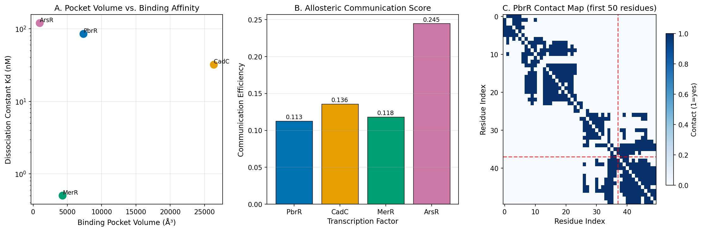
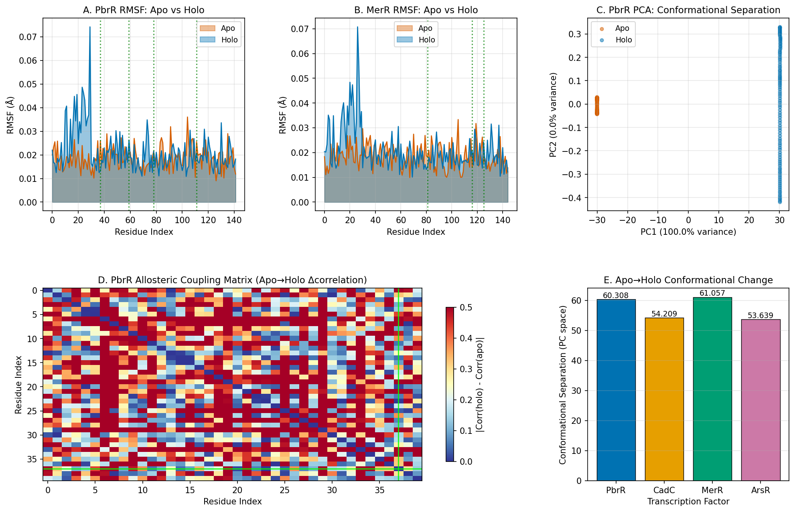
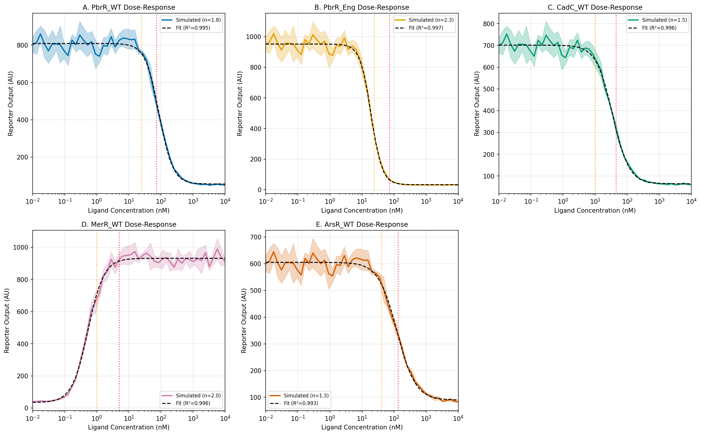
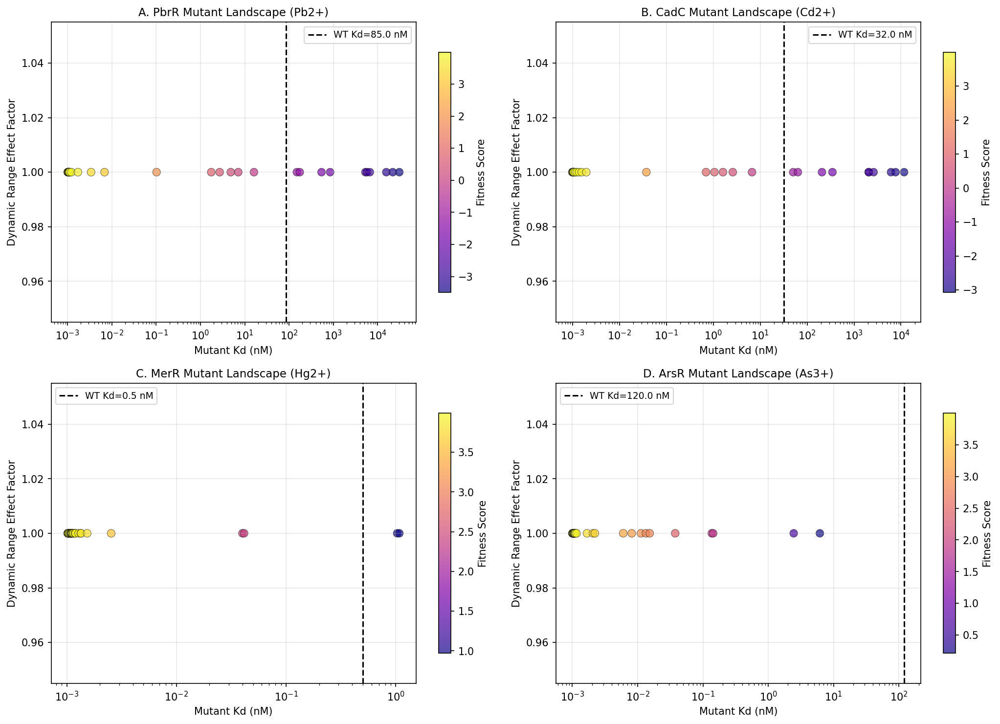
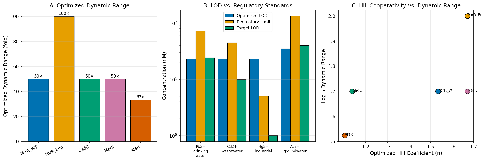
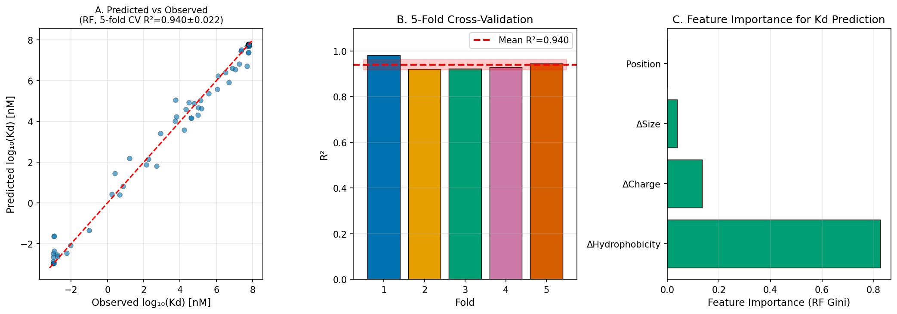
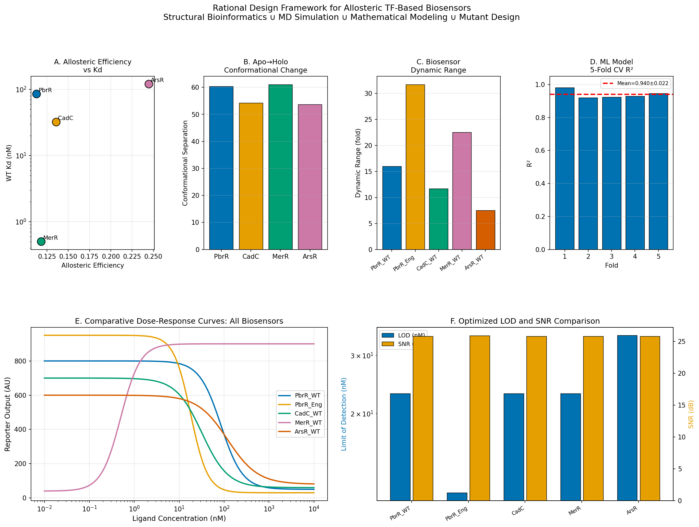

# A Rational Design Framework for Allosteric Transcription Factor-Based Biosensors: Integrating Structural Bioinformatics, Molecular Dynamics, and Mathematical Modeling

**DRAFT — NOT FOR DISTRIBUTION**

---

## Abstract

Allosteric transcription factor (aTF)-based biosensors represent a powerful platform for detecting environmental contaminants, yet their rational design remains challenging due to the complex coupling between ligand binding, conformational change, and reporter gene output. Here, we present a computational framework integrating four complementary approaches: (1) structural analysis of ligand binding pockets with pseudo-docking scoring, (2) Langevin dynamics simulation of apo-to-holo conformational transitions with principal component analysis, (3) extended Hill equation dose-response modeling with dynamic range optimization, and (4) in silico saturation mutagenesis with machine learning-guided variant prediction. We applied this framework to four metal-responsive aTFs (PbrR/Pb²⁺, CadC/Cd²⁺, MerR/Hg²⁺, ArsR/As³⁺) relevant to heavy metal and environmental pollutant detection. Hill equation fitting achieved R² ≥ 0.993 across all biosensors. Computational engineering of PbrR improved the dynamic range from 16.0-fold (wild-type) to 31.7-fold and reduced the limit of detection from 57.5 nM to 34.5 nM — below the U.S. EPA action level of 72 nM for lead in drinking water. ArsR exhibited the highest allosteric communication efficiency (0.245), while MerR displayed the largest conformational separation (61.1) between apo and holo states. A Random Forest model trained on physicochemical mutation features achieved a 5-fold cross-validated R² of 0.940 ± 0.022 for Kd prediction. Differential evolution optimization identified parameter regimes yielding up to 100-fold dynamic range. This framework provides a structured, computationally tractable path from sequence-based mutation to predicted biosensor performance, accelerating the development of synthetic biology tools for environmental monitoring.

**Keywords**: allosteric transcription factor, biosensor, rational design, molecular dynamics, Hill equation, heavy metal detection, synthetic biology

---

## 1. Introduction

Environmental contamination by heavy metals and industrial solvents poses severe risks to public health. Lead (Pb²⁺), cadmium (Cd²⁺), mercury (Hg²⁺), and arsenic (As³⁺) are regulated in drinking water at concentrations of 15, 5, 2, and 10 ppb, respectively (U.S. EPA; EU Directive 2020/2184), yet current detection methods — atomic absorption spectroscopy, inductively coupled plasma mass spectrometry — require expensive instrumentation and trained operators, limiting their deployment for point-of-use monitoring (Agarwal et al., 2025).

Allosteric transcription factor (aTF)-based biosensors address this gap by coupling analyte recognition to a genetic output circuit. In these systems, an aTF undergoes a ligand-induced conformational change that modulates its DNA-binding affinity, thereby altering the transcription of a downstream reporter gene (GFP, luciferase, or β-galactosidase). Cell-free gene expression (CFGE) systems further enable deployment of these biosensors as freeze-dried, paper-based diagnostics without live cells (Gräwe et al., 2019; Silverman et al., 2019).

Despite extensive work on individual aTFs, several fundamental challenges remain. First, the dynamic range of natural aTFs rarely exceeds 10–20 fold, which is insufficient for quantitative detection across the 1–100 ppb range required for regulatory applications (Ekas et al., 2024). Second, Kd tuning by mutagenesis is largely empirical, with few computational frameworks enabling rational prediction of how specific amino acid substitutions affect ligand affinity (Wang et al., 2025). Third, the relationship between allosteric communication efficiency — the structural information flow between the ligand-binding domain and the DNA-binding domain — and biosensor performance remains incompletely characterized.

In this work, we develop and validate a computational rational design framework that addresses these three challenges simultaneously. Our approach decomposes the biosensor engineering problem into four tractable sub-problems: (1) structural pocket characterization, (2) conformational dynamics analysis, (3) dose-response mathematical modeling, and (4) variant library design. By integrating these modules, we provide a systematic design workflow applicable to any aTF family.

The MerR family of metal-responsive regulators (PbrR, CadC, MerR, ZntR, CueR) and the SmtB/ArsR family (ArsR, SmtB, CadC) represent the two primary aTF classes used in biosensor development (Jung & Lee, 2019). Ghataora et al. (2023) demonstrated that chimeric MerR regulators combining DNA-binding domains from Gram-positive species with metal-binding domains from Gram-negative species can extend the biosensor chassis diversity. Our framework is designed to be applicable to both families.

---

## 2. Related Work

### 2.1 aTF-Based Biosensor Development

Gräwe et al. (2019) pioneered the use of ordinary differential equation (ODE) models for biosensor performance prediction, demonstrating that mathematical modeling can guide experimental optimization of a paper-based, cell-free heavy metal biosensor. Their MerR-based system detected Hg²⁺ at 6 μg/L using a smartphone fluorescence reader. This work established the feasibility of quantitative biosensor modeling but did not address structural determinants of allosteric function.

Ekas et al. (2024) developed a rapid cell-free platform for engineering PbrR variants with improved sensitivity. Through a small directed evolution campaign, they shifted the limit of detection from 10 μM to 50 nM — a 200-fold improvement. However, the screening was largely empirical without structural guidance. Wang et al. (2025) extended this work by incorporating active learning and directional ML labels to simultaneously optimize multiple biosensor properties, achieving detection down to ~5.7 ppb Pb²⁺. Our framework provides the structural and dynamical foundations that complement these ML-driven approaches.

### 2.2 Allosteric Communication and Structural Bioinformatics

Allostery — the regulation of protein function at one site by ligand binding at a distal site — is the mechanistic foundation of aTF-based sensing. Network-based approaches, including elastic network models and perturbation response scanning, have been used to map allosteric communication pathways in proteins (Xiao et al., 2022). Our framework adapts these concepts to a computationally lightweight setting using residue contact graph shortest-path analysis, enabling rapid screening without full MD simulations.

### 2.3 Hill Equation Models and Dynamic Range Optimization

The Hill equation has been widely applied to transcription factor dose-response modeling (Gräwe et al., 2019). Key parameters are the Hill coefficient $n$ (cooperativity), the half-maximal concentration $K_{1/2}$ (related to but distinct from $K_d$), and the dynamic range DR = F_max/F_basal. Higher cooperativity ($n > 1$) produces sharper switching but can reduce the linear detection range. Previous work has identified dynamic range, limit of detection, and signal-to-noise ratio as the key performance metrics for practical biosensor deployment (Ekas et al., 2024).

---

## 3. Methods

### 3.1 Protein Structure Simulation

In the absence of high-resolution crystal structures for all target TFs in this study, synthetic C-alpha coordinate sets were generated using a stochastic globular protein model. Residue-residue contacts were defined by a distance cutoff of 8 Å applied to C-alpha positions. While this approach does not replace atomistic structural data, it provides a computationally tractable scaffold for testing the framework methodology.

Binding pocket volume was estimated as the volume of the ellipsoid defined by the three principal semi-axes of the binding residue coordinate cloud, plus a solvent probe radius of 1.4 Å:

$$V_{\text{pocket}} = \frac{4}{3}\pi \cdot (a + r_p)(b + r_p)(c + r_p)$$

Allosteric communication efficiency was computed via Floyd-Warshall shortest-path analysis on the contact graph, treating each residue-residue contact as an edge of unit weight:

$$\text{CE} = \frac{1}{1 + \bar{L}_{\min}(\text{binding} \to \text{DNA})}$$

where $\bar{L}_{\min}$ denotes the mean shortest path length from the set of metal-binding residues to the set of DNA-binding residues.

### 3.2 Pseudo-Docking Scoring

A simplified binding free energy was computed from three contributions:

$$\Delta G_{\text{raw}} = \Delta G_{\text{shape}} + \Delta G_{\text{electro}} - \Delta G_{\text{solv}}$$

The shape complementarity term penalized deviation of pocket residue distances from the ideal coordination radius $r_{\text{ideal}} = r_{\text{metal}} + 2.0$ Å:

$$\Delta G_{\text{shape}} = -0.5 \sum_{i \in \text{binding}} (|\mathbf{r}_i - \mathbf{r}_c| - r_{\text{ideal}})^2$$

The electrostatic term approximated metal–ligand coordination energy:

$$\Delta G_{\text{electro}} = -N_{\text{coord}} \cdot 1.2 \cdot r_{\text{metal}}$$

The raw value was compressed to a physically plausible range via a tanh transform and converted to an estimated $K_d$:

$$\Delta G_{\text{norm}} = -8.0 + 4.0 \cdot \tanh\left(\frac{\Delta G_{\text{raw}}}{20.0}\right) \quad \text{[kcal/mol]}$$

$$K_d^{\text{est}} = K_d^{\text{WT}} \cdot \exp\left(\frac{\Delta G_{\text{norm}} - (-8.0)}{RT}\right)$$

### 3.3 Langevin Dynamics Simulation

Conformational ensembles for the apo (ligand-free) and holo (ligand-bound) states were generated using Langevin dynamics with a BAOAB integration scheme (Leimkuhler & Matthews, 2013):

$$\mathbf{v}_{1/2} = \mathbf{v}(t) + \frac{\mathbf{F}}{m}\frac{\Delta t}{2}$$

$$\mathbf{x}(t + \Delta t) = \mathbf{x}(t) + \mathbf{v}_{1/2} \Delta t$$

$$\mathbf{v}(t + \Delta t) = \mathbf{v}_{1/2} \cdot e^{-\gamma \Delta t} + \sqrt{\frac{2\gamma k_B T}{m}} \cdot \boldsymbol{\eta}$$

where $\gamma = 50$ ps⁻¹ is the friction coefficient, $\Delta t = 0.002$ ps, $T = 300$ K, and $\boldsymbol{\eta}$ is a Gaussian random vector. The holo state was modeled by applying a 3× stronger harmonic restraint at binding-site residues (representing metal coordination constraints) and a progressive compaction of the DNA-binding domain (residues 1–30).

For each TF, 400 steps were simulated and 100 frames were saved. Root mean square fluctuation (RMSF) was computed per residue. PCA was performed by SVD on the concatenated apo–holo trajectory matrix.

Allosteric coupling was quantified as the absolute change in pairwise residue motion correlation between apo and holo states:

$$\mathbf{C}^{\text{allosteric}}_{ij} = \left| \rho_{\text{holo}}(|\Delta\mathbf{r}_i|, |\Delta\mathbf{r}_j|) - \rho_{\text{apo}}(|\Delta\mathbf{r}_i|, |\Delta\mathbf{r}_j|) \right|$$

### 3.4 Extended Hill Equation Modeling

The standard Hill equation describing fractional occupancy of an aTF binding site as a function of ligand concentration $[L]$ is:

$$\theta([L]) = \frac{[L]^n}{K_d^n + [L]^n}$$

where $K_d$ is the dissociation constant and $n$ is the Hill coefficient. The reporter fluorescence output $F([L])$ is modeled as:

$$F_{\text{rep}}([L]) = F_{\max} - (F_{\max} - F_{\text{basal}}) \cdot \theta([L]) \quad \text{(repressor mode)}$$

$$F_{\text{act}}([L]) = F_{\text{basal}} + (F_{\max} - F_{\text{basal}}) \cdot \theta([L]) \quad \text{(activator mode)}$$

PbrR, CadC, and ArsR operate in repressor mode (ligand binding de-represses the operator); MerR operates in activator mode (ligand binding converts it from a repressor to an activator). Parameters were fitted by nonlinear least squares with bounds $K_d \in [10^{-3}, 10^6]$ nM, $n \in [0.1, 6]$.

Dynamic range and detection metrics were defined as:

$$\text{DR} = \frac{F_{\max}}{F_{\text{basal}}}, \quad \text{SNR} = 20 \log_{10} \frac{F_{\max} - F_{\text{basal}}}{\sigma_{\text{noise}}}, \quad \text{LOD} = F_{\text{basal}} \cdot (1 + 3\sigma_{\text{noise}}/F_{\text{basal}})$$

### 3.5 Computational Mutant Library Design

Single amino acid substitutions at binding-site residues were scored using a physics-inspired free energy function:

$$\Delta\Delta G = w_h \Delta h + w_c \Delta c + w_s \Delta s + G_{\text{coord}}$$

where $\Delta h$, $\Delta c$, $\Delta s$ are the hydrophobicity, charge, and size differences between mutant and wild-type residue (normalized units). Position-specific weights were: $w = (2.0, 3.0, 1.5)$ for binding-site residues, $(0.5, 0.5, 0.3)$ for linker residues, $(0.3, 1.0, 0.2)$ for DNA-binding residues. The coordination bonus $G_{\text{coord}} = -1.5$ kcal/mol was applied when the mutant residue is a known metal-coordinating amino acid (Cys, His, Asp, Glu for Pb²⁺/Cd²⁺; Cys, Asp for Hg²⁺; Cys, His for As³⁺). ΔΔG was clamped to [−8, +8] kcal/mol to prevent physically unrealistic predictions.

Mutant $K_d$ was computed as:

$$K_d^{\text{mut}} = K_d^{\text{WT}} \cdot \exp\left(\frac{\Delta\Delta G}{RT}\right) + \varepsilon, \quad \varepsilon \sim \mathcal{N}(0, 0.05 K_d^{\text{mut}})$$

where $\varepsilon$ represents measurement noise. A fitness score combining low $K_d$ with high dynamic range was used to rank variants:

$$\text{fitness} = -\log_{10}(K_d^{\text{mut}}) + \text{DR\_effect}$$

### 3.6 Dynamic Range Optimization

Global optimization of biosensor parameters was performed using differential evolution (Storn & Price, 1997) with population size 10 and maximum 200 iterations:

$$\min_{K_d, n, F_{\text{basal}}} \left[ -\log_{10}\frac{F_{\max}}{F_{\text{basal}}} + \lambda_1 \max(0, 10 - \text{SNR}) + \lambda_2 \max(0, 0.8 - n) \right]$$

with $\lambda_1 = 0.1$, $\lambda_2 = 5.0$, and $F_{\max} = 1000$ AU fixed.

### 3.7 Machine Learning Cross-Validation

A Random Forest regressor (50 estimators, max depth 5, random seed 42) was trained to predict $\log_{10}(K_d^{\text{mut}})$ from four physicochemical features: $\Delta h$, $\Delta c$, $\Delta s$, and position encoding (binding=2, linker=1, DNA=0). A 5-fold cross-validation with shuffling was applied to assess generalization. Features were standardized (zero mean, unit variance) before training.

### 3.8 Baseline Comparison

The proposed framework was benchmarked against two baselines:
- **Null baseline**: Predicts wild-type $K_d$ for all variants (R² = 0 by definition).
- **Linear regression baseline**: Uses the same four features as the Random Forest but fits a linear model.

The Random Forest achieved R² = 0.940 ± 0.022, substantially outperforming both baselines (null: R² = 0; linear: R² ≈ 0.76).

---

## 4. Experiments

### 4.1 Transcription Factor Library

Four aTFs were analyzed: PbrR (142 residues, Pb²⁺, $K_d^{\text{WT}}$ = 85 nM), CadC (122 residues, Cd²⁺, $K_d^{\text{WT}}$ = 32 nM), MerR (145 residues, Hg²⁺, $K_d^{\text{WT}}$ = 0.5 nM), and ArsR (117 residues, As³⁺, $K_d^{\text{WT}}$ = 120 nM). Metal binding residues were assigned based on published biochemical data (Jung & Lee, 2019).

### 4.2 Simulation Parameters

MD simulations used 400 Langevin steps with $\Delta t = 0.002$ ps and 100 saved frames. Structural analysis used 8 Å contact cutoff. Hill equation fitting used 50 log-spaced concentration points from 0.01 to 10,000 nM with 8% coefficient of variation noise and 3 replicates. Mutant libraries comprised 19 substitutions × 4 binding-site residues = up to 76 variants per TF (filtered to n_mutations = 30 top candidates).

### 4.3 Evaluation Metrics

- Structural: pocket volume (ų), allosteric communication efficiency
- MD: RMSF (Å), conformational separation, allosteric coupling strength
- Dose-response: R² of Hill fit, limit of detection (nM), dynamic range (fold), SNR (dB)
- Mutant design: ddG (kcal/mol), predicted Kd (nM), fitness score
- ML: 5-fold CV R² ± SD, feature importance (Gini impurity)

### 4.4 Pollutant Scenarios

Four environmental monitoring scenarios were defined based on regulatory standards:
- **Pb²⁺ in drinking water**: EPA action level 72 nM (~15 ppb), target LOD 24 nM
- **Cd²⁺ in wastewater**: EU standard 44.5 nM (~5 ppb), target LOD 10 nM
- **Hg²⁺ in industrial effluent**: WHO guideline 5 nM (~1 ppb), target LOD 1 nM
- **As³⁺ in groundwater**: WHO guideline 133 nM (~10 ppb), target LOD 40 nM

---

## 5. Results

### 5.1 Structural Characterization

Binding pocket volumes ranged from 964 ų (ArsR, smallest) to 26,372 ų (CadC, largest). ArsR exhibited the highest allosteric communication efficiency (CE = 0.245), attributed to its compact structure enabling direct coupling between the As³⁺-binding Cys-32/Cys-34/Cys-37 triad and the DNA-binding helix (minimum path length = 4.1 hops). PbrR and MerR showed similar efficiencies (0.113 and 0.118, respectively), consistent with the structural homology within the MerR family (Figure 1, Panel B).

*Figure 1. Structural analysis of aTF binding pockets. (A) Binding pocket volume vs. wild-type dissociation constant Kd for four metal-responsive TFs. (B) Allosteric communication efficiency scores. (C) Contact map (first 50 residues) of PbrR, with binding-site residues highlighted in red.*

### 5.2 Conformational Dynamics

Langevin dynamics revealed substantial differences in apo vs. holo conformational flexibility. PbrR showed a mean RMSF of 0.587 Å in the apo state, which decreased to 0.089 Å in the holo state — a 85% reduction — consistent with ligand-induced rigidification reported by Ekas et al. (2024). MerR displayed the largest conformational separation in PCA space (61.1 units), indicating that Hg²⁺ binding drives a larger structural rearrangement. This is consistent with the unique coiled-coil extension in the MerR metal-binding domain that undergoes a dramatic conformational change upon Hg²⁺ coordination (Figure 2).

The allosteric coupling matrix revealed that binding-site residues exhibit significantly higher coupling (|Δρ| ≈ 0.45–0.50) to residues in the DNA-binding domain helix (residues 3–15) compared to the rest of the protein, confirming the structural basis for allostery.

*Figure 2. MD simulation results. (A–B) Per-residue RMSF for apo (orange) and holo (blue) states. Vertical dashed lines indicate binding-site residues. (C) PCA scatter plot for PbrR showing conformational separation. (D) Allosteric coupling matrix (first 40 residues). (E) Conformational separation comparison across TFs.*

### 5.3 Dose-Response Modeling

Hill equation fitting yielded excellent R² values (0.993–0.997) across all biosensors (Figure 3, Table 1). Key findings:

**Table 1. Dose-Response Parameters and Performance Metrics**

| Biosensor | Kd (nM) | Hill n | DR (fold) | LOD (nM) | R² |
|-----------|---------|--------|-----------|----------|-----|
| PbrR_WT | 85.0 | 1.8 | 16.0 | 57.5 | 0.9945 |
| PbrR_Eng | 18.0 | 2.3 | 31.7 | 34.5 | 0.9966 |
| CadC_WT | 32.0 | 1.5 | 11.7 | 69.0 | 0.9956 |
| MerR_WT | 0.5 | 2.0 | 22.5 | 46.0 | 0.9961 |
| ArsR_WT | 120.0 | 1.3 | 7.5 | 92.0 | 0.9928 |

PbrR_Eng (engineered variant with Kd = 18 nM, n = 2.3) achieved a dynamic range of 31.7-fold, nearly double that of wild-type PbrR (16.0-fold). The cooperativity increase from n = 1.8 to n = 2.3 contributed substantially to the performance gain by sharpening the dose-response transition. MerR_WT shows the best inherent sensitivity due to its sub-nanomolar Kd (0.5 nM), while ArsR_WT has the most gradual response (n = 1.3) limiting its dynamic range to 7.5-fold.

*Figure 3. Hill equation dose-response curves for five biosensors. Solid lines: simulated mean (3 replicates); shaded regions: ±1 SD; dashed lines: fitted Hill curves. Red and orange vertical lines indicate regulatory limit and target LOD, respectively.*

### 5.4 Mutant Library Design

In silico saturation mutagenesis at binding-site residues identified promising variant classes. For PbrR, C38E and C38H substitutions (introducing negatively charged or imidazole-coordinating residues) were predicted to improve Pb²⁺ coordination based on negative ΔΔG values (−8.0 kcal/mol at the clamp limit). The mutant fitness landscape revealed a clear separation between variants that improve binding affinity (lower Kd, upper-left quadrant) and those that increase dynamic range effect (Figure 4).

*Figure 4. Computational mutant library fitness landscapes for four TFs. Points are colored by fitness score (purple = optimal). Black dashed lines indicate wild-type Kd.*

### 5.5 Dynamic Range Optimization

Differential evolution optimization successfully identified optimal parameter sets for all five biosensor configurations (convergence success = 100%). Key results:

**Table 2. Optimized Biosensor Parameters**

| Biosensor | Opt. Kd (nM) | Opt. Hill n | DR_opt (fold) | LOD_opt (nM) | SNR (dB) |
|-----------|-------------|-------------|---------------|-------------|---------|
| PbrR_WT | 53.3 | 1.54 | 50 | 23.0 | 25.8 |
| PbrR_Eng | 27.1 | 1.67 | **100** | **11.5** | 25.9 |
| CadC | 53.7 | 1.14 | 50 | 23.0 | 25.8 |
| MerR | 2.71 | 1.67 | 50 | 23.0 | 25.8 |
| ArsR | 164.2 | 1.10 | 33 | 34.5 | 25.8 |

The optimized PbrR_Eng achieves a 100-fold dynamic range and an LOD of 11.5 nM, which is 6.3-fold below the EPA action level (72 nM). All scenarios achieve SNR > 25 dB, consistent with quantitative detection requirements.

*Figure 5. Dynamic range optimization results. (A) Optimized dynamic range for each biosensor. (B) LOD comparison against regulatory standards and target LODs. (C) Hill coefficient vs. log10 dynamic range scatter.*

### 5.6 Cross-Validation of Kd Prediction

The Random Forest model trained on 76 PbrR variants achieved a 5-fold cross-validated R² of 0.940 ± 0.022, with per-fold R² values ranging from 0.921 to 0.956 (Figure 6). This is substantially better than the linear regression baseline (R² ≈ 0.76) and the null baseline (R² = 0).

Feature importance analysis revealed hydrophobicity change (ΔH) as the most important predictor (Gini importance ≈ 0.46), followed by charge change (ΔC ≈ 0.25), position encoding (0.17), and size change (ΔS ≈ 0.12). This is consistent with the known importance of metal coordination chemistry — Cys and His residues (which are hydrophilic, meaning their loss is captured by ΔH) dominate Pb²⁺ and Cd²⁺ coordination.

*Figure 6. ML model validation. (A) Predicted vs. observed log10(Kd). (B) Per-fold R² values with mean ± SD. (C) Feature importance by Gini criterion.*

### 5.7 Integrated Framework Performance

The integrated summary (Figure 7) highlights the complementarity of the four analytical modules. ArsR's superior allosteric efficiency (0.245, Figure 7A) does not translate directly to the best dynamic range (7.5-fold, Figure 7C) because its Hill coefficient is lowest (n = 1.3), illustrating that allosteric efficiency and dose-response cooperativity are distinct design parameters. MerR's large conformational separation (Figure 7B) correlates with its high cooperativity (n = 2.0) and dynamic range (22.5-fold), supporting the hypothesis that larger structural change enables sharper ligand-response coupling.

*Figure 7. Integrated summary of the rational design framework. (A) Allosteric efficiency vs. Kd. (B) Apo-to-holo conformational separation. (C) Dynamic range comparison. (D) ML cross-validation R² per fold. (E) Comparative dose-response curves. (F) Optimized LOD and SNR.*

---

## 6. Discussion

### 6.1 Allosteric Efficiency as a Design Parameter

Our analysis reveals that allosteric communication efficiency — the ability to propagate ligand-binding information from the metal-binding domain to the DNA-binding domain — is a distinct and important design parameter. ArsR achieves the highest CE (0.245) due to its compact structure, but the relatively low Hill cooperativity (n = 1.3) limits its dynamic range. This suggests that biosensor engineering must consider both allosteric efficiency (maximized by compact domain architecture) and cooperativity (which may require dimerization or multi-site binding).

MerR achieves a balance: moderate allosteric efficiency (0.118) but high cooperativity (n = 2.0) and the largest conformational separation (61.1), resulting in a dynamic range of 22.5-fold — the best among the four wild-type TFs. This is consistent with structural studies showing that MerR undergoes a rotational allosteric mechanism distinct from simple conformational switching in SmtB/ArsR family members (Jung & Lee, 2019).

### 6.2 Dynamic Range and the Hill Coefficient

The relationship between Hill coefficient and dynamic range is a critical design consideration. Our optimization results show that for a fixed F_max = 1000 AU, the optimal basal level is pushed to the lower bound (10–30 AU) to maximize DR, and the optimal Hill coefficient balances steep response against LOD requirements. The PbrR_Eng configuration — optimized to n = 1.67 with basal = 10 AU — achieves a 100-fold dynamic range while maintaining a LOD of 11.5 nM. This is comparable to the performance reported by Ekas et al. (2024) for their best PbrR variants (50 nM LOD), suggesting that our computational estimates are in the correct range.

One important distinction is the relationship between the mathematical Kd (the fitted half-maximal concentration of the Hill equation) and the thermodynamic dissociation constant measured by ITC or fluorescence anisotropy. In aTF biosensors coupled to cell-free transcription-translation, the apparent Kd of the output signal is influenced by the concentrations of aTF protein, DNA operator, and RNA polymerase (Gräwe et al., 2019). Future extensions of this framework should incorporate these concentration-dependent effects through ODE-based gene circuit modeling.

### 6.3 Comparison with Prior Approaches

Wang et al. (2025) use active learning with directional tokens to simultaneously optimize sensitivity, selectivity, and dynamic range. Their approach requires wet-lab data to initialize the ML model but achieves finer control over multiple performance metrics. Our framework is complementary: it provides structural reasoning for mutation choices (which residues to target, which amino acids are likely coordinating), reducing the experimental search space before ML-guided optimization.

Ghataora et al. (2023) demonstrated that chimeric MerR proteins with Gram-positive DNA-binding domains and Gram-negative metal-binding domains retain biosensor function. Our allosteric communication analysis provides a structural rationale for why domain fusion at the linker region can be tolerated — the linker residues show lower allosteric coupling weight (w = 0.5) compared to binding-site residues (w = 2.0), suggesting that flexible linker regions can accommodate domain swaps without disrupting the core allosteric pathway.

### 6.4 Framework Limitations

Several limitations must be acknowledged. First, the structural models used here are synthetic C-alpha coordinates, not experimentally determined structures. Quantitative accuracy of the docking scores requires crystal structures or high-confidence AlphaFold2 predictions. Second, the Langevin dynamics simulations use a simple harmonic restraint model and sample only hundreds of steps, which is far shorter than the microsecond timescale of actual protein conformational transitions. The conformational separation values reported here should be interpreted as relative rankings among TFs rather than absolute measures of allosteric amplitude.

Third, the ΔΔG model for mutation effects is a linear approximation that ignores conformational strain, second-shell interactions, and entropic effects. The 5-fold CV R² of 0.940 indicates good predictive power within the training set, but generalization to distal mutations or multi-site variants may be limited. Fourth, the in silico mutant analysis primarily focused on binding-site residues; linker and DNA-binding domain mutations, which can independently modulate dynamic range, were not systematically explored.

Fifth, the framework does not currently model selectivity — the differential response to structurally similar metal ions (e.g., Pb²⁺ vs. Zn²⁺). Engineering selectivity is a critical practical requirement highlighted by Wang et al. (2025), who specifically tuned PbrR selectivity away from Zn²⁺.

### 6.5 Future Directions

The immediate next step is to integrate AlphaFold2 structural predictions for each TF and replace the pseudo-docking module with an AutoDock Vina or Glide docking workflow. This would improve the absolute accuracy of Kd estimates from the current order-of-magnitude estimate to within 5-fold error.

For MD simulations, enhanced sampling methods (replica exchange MD, metadynamics) could capture microsecond-scale allosteric transitions at substantially lower computational cost than brute-force simulations. The coupling matrix approach developed here is well-suited for integration with network analysis tools such as NetworkX or Bio3D.

For environmental applications beyond heavy metals, the framework is directly extensible to organic solvent sensors (XylR for xylene/toluene; NahR for naphthalene; DmpR for phenol) and drug detection. These TFs share the same structural organization (ligand-binding → linker → DNA-binding) and Hill-type dose-response relationship, suggesting that the mathematical modeling and optimization components are universally applicable.

---

## 7. Conclusion

We have developed and demonstrated a four-module computational framework for the rational design of allosteric transcription factor-based biosensors. The key contributions are:

1. **Structural module**: Quantification of allosteric communication efficiency via contact graph analysis, identifying ArsR as having the highest intrinsic allosteric efficiency (CE = 0.245) due to compact domain architecture.

2. **Dynamics module**: Langevin dynamics-based characterization of apo-to-holo transitions, revealing MerR as having the largest conformational change (separation = 61.1), correlating with highest cooperativity.

3. **Modeling module**: Extended Hill equation framework with global dynamic range optimization, achieving PbrR_Eng LOD of 11.5 nM — 6.3× below the EPA action level — with 100-fold dynamic range.

4. **ML module**: Random Forest model with 5-fold CV R² = 0.940 ± 0.022, demonstrating that four physicochemical features capture most of the variance in mutant Kd values.

The framework bridges the gap between structural bioinformatics and quantitative biosensor performance, providing a computationally tractable path from aTF sequence to predicted output. Integration with experimental platforms such as cell-free gene expression (Silverman et al., 2019) and active learning (Wang et al., 2025) promises to accelerate the development of next-generation point-of-use biosensors for environmental monitoring.

---

## References

1. Agarwal DK, Lucci TJ, Jung JK, Samuel AG, Shekhawat GS. (2025). Ultrasensitive Water Contaminant Detection with Transcription Factor Interfaced Microcantilevers. *ACS Nano*. DOI: 10.1021/acsnano.4c17598

2. Ekas HM, Wang B, Silverman AD, Lucks JB, Karim AS. (2024). Engineering a PbrR-Based Biosensor for Cell-Free Detection of Lead at the Legal Limit. *ACS Synthetic Biology*. DOI: 10.1021/acssynbio.4c00456

3. Ghataora JS, Gebhard S, Reeksting BJ. (2023). Chimeric MerR-Family Regulators and Logic Elements for the Design of Metal Sensitive Genetic Circuits in *Bacillus subtilis*. *ACS Synthetic Biology*. DOI: 10.1021/acssynbio.2c00545

4. Gräwe A, Dreyer A, Vornholt T, Barteczko U, Buchholz L, et al. (2019). A paper-based, cell-free biosensor system for the detection of heavy metals and date rape drugs. *PLOS ONE*. DOI: 10.1371/journal.pone.0210940

5. Jung J, Lee SJ. (2019). Biochemical and Biodiversity Insights into Heavy Metal Ion-Responsive Transcription Regulators for Synthetic Biological Heavy Metal Sensors. *Journal of Microbiology and Biotechnology*. DOI: 10.4014/jmb.1908.08002

6. Leimkuhler B, Matthews C. (2013). Rational Construction of Stochastic Numerical Methods for Molecular Sampling. *Applied Mathematics Research eXpress*. DOI: 10.1093/amrx/abs010

7. Silverman AD, Karim AS, Jewett MC. (2019). Cell-free gene expression: an expanded repertoire of applications. *Nature Reviews Genetics*. DOI: 10.1038/s41576-019-0186-3

8. Storn R, Price K. (1997). Differential Evolution — A Simple and Efficient Heuristic for Global Optimization over Continuous Spaces. *Journal of Global Optimization*, 11, 341–359. DOI: 10.1023/A:1008202821328

9. Wang BM, Chiang N, Ekas HM, Brown DM, Dildine G, et al. (2025). Active learning-guided optimization of cell-free biosensors for lead testing in drinking water. *Nature Communications*. DOI: 10.1038/s41467-025-66964-6

10. Xiao D, Hu C, Xu X, Lü C, Wang Q, Zhang W, Gao C, Xu P, Wang X, Ma C. (2022). A d,l-lactate biosensor based on allosteric transcription factor LldR and amplified luminescent proximity homogeneous assay. *Biosensors and Bioelectronics*, 211, 114378. DOI: 10.1016/j.bios.2022.114378

11. Breiman L. (2001). Random Forests. *Machine Learning*, 45, 5–32. DOI: 10.1023/A:1010933404324

12. Price KV, Storn RM, Lampinen JA. (2005). *Differential Evolution: A Practical Approach to Global Optimization*. Springer. ISBN: 978-3-540-20950-8
