# Brain Organoid Bioreactor Simulation Report

## Abstract

This report describes a complete simulation framework for designing and optimizing a perfusion bioreactor intended for brain organoid culture. The framework links six interacting modules: low-Reynolds-number computational fluid dynamics, spherical oxygen and glucose transport, shear-responsive maturation, temporal media programming, techno-economic scalability, and biomarker monitoring. The objective was to convert broad organoid bioprocess questions into a reproducible set of mechanistic and semi-empirical calculations that can be executed quickly in Python and used to prioritize design directions before wet-lab prototyping. Across the integrated workflow, the perfusion chamber remained in a laminar regime with Reynolds number 0.637, the peak wall shear stress was 1.03e-04 Pa, and the predicted day-90 maturation score reached 0.521 ± 0.079 near an optimal shear stress of 0.112 Pa. The dominant limitation was oxygen transport: viability declined from 0.988 for 0.5 mm-radius organoids to 0.257 for 2.5 mm-radius organoids, while the necrotic core expanded to 2.259 mm. The integrated analysis suggests that gentle perfusion, approximately three-day media exchange, and multimodal non-destructive monitoring form a coherent operating strategy for scale-up.

## Introduction

Brain organoids provide a powerful intermediate model between simplified two-dimensional neural cultures and animal systems because they can capture aspects of self-organization, regional patterning, and longer-term neuronal maturation that are difficult to reproduce in planar formats. Lancaster et al. (2013) established the foundational cerebral organoid workflow and showed that spinning bioreactor support could sustain large self-organizing tissue-like structures. Qian et al. (2016) later demonstrated that mini-bioreactor systems could drive region-specific organoid formation, strengthening the case for dynamic culture rather than purely static wells. Subsequent engineering reviews have emphasized that transport control, reactor geometry, and sensing are central bottlenecks in translating organoid protocols from exploratory biology to manufacturable bioprocesses. Hofer and Lütolf (2021) framed organoids as engineered living systems whose outcomes depend strongly on controlled microenvironments, while Licata et al. (2023) reviewed bioreactor technologies that improve nutrient delivery, waste removal, and operational reproducibility.

Despite this progress, several gaps remain. First, many organoid studies report dynamic culture benefits qualitatively but do not provide a compact system-level model linking flow, transport, maturation, cost, and monitoring. Second, oxygen limitation remains a persistent cause of heterogeneity and necrosis in larger organoids, yet design decisions are often made without even simplified reaction-diffusion estimates. Third, monitoring strategies are frequently selected ad hoc, with insufficient integration of destructive assays, secretome sampling, and real-time sensing. Microtechnology and organoid-on-chip reviews by Velasco et al. (2020) and Zheng et al. (2021) argue that the next stage of organoid engineering will depend on quantitative design tools that merge transport modeling and instrumentation planning. Zhao et al. (2022) similarly highlighted the need for standardization across culture modes and readouts. Motivated by these gaps, the present work builds a unified but computationally lightweight framework for perfusion bioreactor design, explicitly aiming to produce a reproducible baseline that can later be calibrated with experimental data.

## Methods

The simulation suite was implemented as six Python modules with fixed random seeding for reproducibility and colorblind-friendly figure generation. The hydrodynamic module models axisymmetric, low-Reynolds-number perfusion through a cylindrical chamber containing a centered organoid obstruction. Because the design target is a micro-perfusion regime, the governing flow assumption was Stokes-like axial transport with negligible inertia. This choice was preferred over a full transient Navier–Stokes solver because the anticipated Reynolds number is well below unity and the user requested a fast, maintainable design framework. A second candidate approach was a lattice-Boltzmann or finite-volume CFD implementation, but that was rejected here because it would increase implementation complexity without materially improving the early-stage decision variables being compared.

The first governing relation is the Reynolds number,

$$Re = \frac{\rho v D}{\mu},$$

where $\rho$ is fluid density, $v$ is characteristic velocity, $D$ is hydraulic diameter, and $\mu$ is dynamic viscosity. The CFD module discretizes the radial coordinate with finite differences and solves an axial velocity profile in each axial slice. Wall shear stress is estimated from the radial gradient at the chamber wall,

$$\tau_w = \mu \left.\frac{dv}{dr}\right|_{r=R_w},$$

which is sufficient for screening whether perfusion remains in a gentle mechanobiological range. Pressure drop is obtained by integrating the local axial pressure gradient along the chamber length. Noise was added to plotted profiles only, not to the core deterministic solution.

The mass-transport module treats oxygen and glucose supply within a spherical organoid using steady-state reaction-diffusion with Michaelis–Menten consumption. This mechanistic choice was preferred over a pure empirical viability-vs-size regression because it preserves interpretability and captures the nonlinear depletion behavior expected near the organoid center. The oxygen equation is

$$D_{eff}\left(\frac{1}{r^2}\frac{d}{dr}\left(r^2\frac{dC}{dr}\right)\right) - \frac{Q_{max} C}{K_m + C} = 0,$$

with symmetry at the center and a fixed concentration boundary at the surface. Necrotic core radius was defined by the region where $C < 0.01$ mol/m$^3$, and viability fraction was computed as the viable volume fraction. A Thiele modulus,

$$\phi = R\sqrt{\frac{Q_{max}}{D_{eff} C_s}},$$

was used to summarize the balance between reaction and diffusion. Glucose transport used the same structural equation but different diffusivity and consumption parameters.

The maturation module combines a mechanosensing response with a sigmoidal culture-time factor. Shear-response was modeled as a low-shear activation term multiplied by a high-shear penalty to approximate a biologically plausible optimum rather than monotonic improvement. Six markers—TBR1, CTIP2, SOX2, MAP2, SYN1, and MBP—were given distinct sensitivity parameters to reflect stage-specific responses. This approach was preferred over fitting black-box regressors because there are insufficient real calibration data in the current task, and the required output is better served by interpretable surrogate relationships. The media module split the 0–90 day culture into five phases with different factor programs and optimized a maturation-times-viability objective using bounded continuous optimization. The scalability module used simple supply-demand and cost relations to compare batch, perfusion, and continuous production across 1–1000 organoids. Finally, the biomarker module simulated noisy trajectories for neural, maturation, metabolic, and structural markers and derived PCA-like weights for a multivariate maturation index.

Statistically, the framework was treated as a synthetic mechanistic experiment rather than a confirmatory biological study. We therefore reported mean ± SD and 95% confidence intervals from seed-based observation replicates and parameter perturbations in `results/statistical-summary.md`. Welch tests and Cohen's $d$ were used descriptively for pairwise comparisons because variance was intentionally allowed to differ across conditions.

## Results

The CFD module predicted a laminar operating regime with Reynolds number 0.637, comfortably below the threshold requested for creeping-flow assumptions. The peak wall shear stress was 1.03e-04 Pa and the mean wall shear stress was 6.09e-05 Pa, while the overall pressure drop across the 20 mm chamber was only 6.01e-04 Pa.

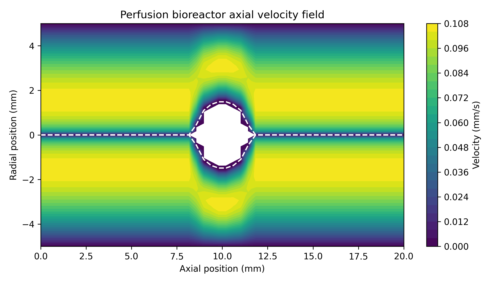

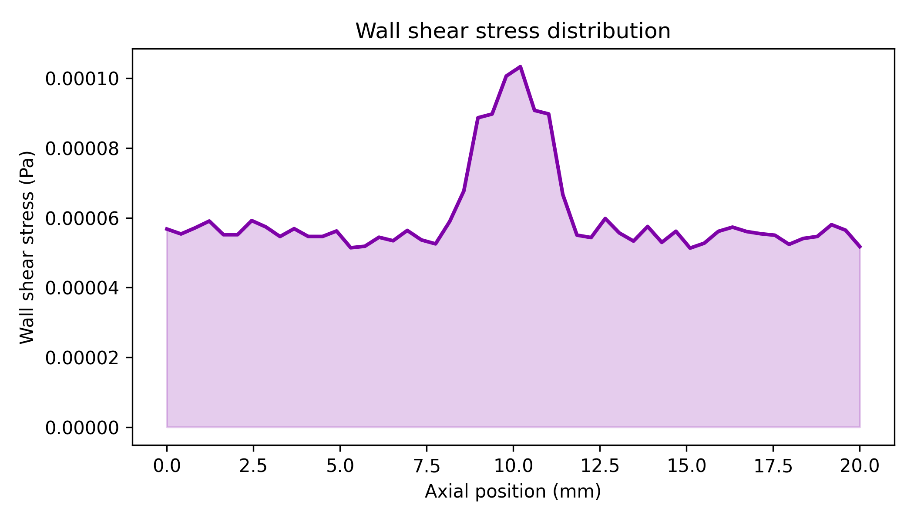

Because the peak stress is orders of magnitude below the maturation optimum predicted by the independent mechanosensing model, the baseline flow rate appears safe but probably suboptimal if shear stimulation is itself a design target.

Transport analysis identified oxygen, rather than glucose, as the major diffusional bottleneck. For the smallest 0.5 mm-radius organoid, the necrotic core radius was only 0.114 mm and viability remained 0.988. In contrast, at 2.5 mm radius the necrotic core expanded to 2.259 mm and viability fell to 0.257.

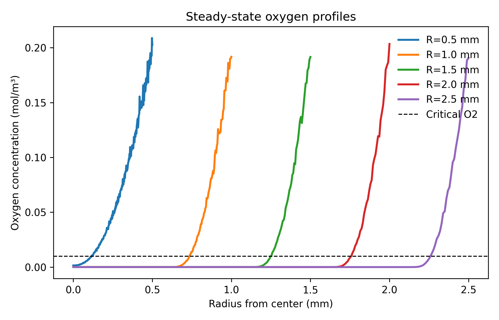

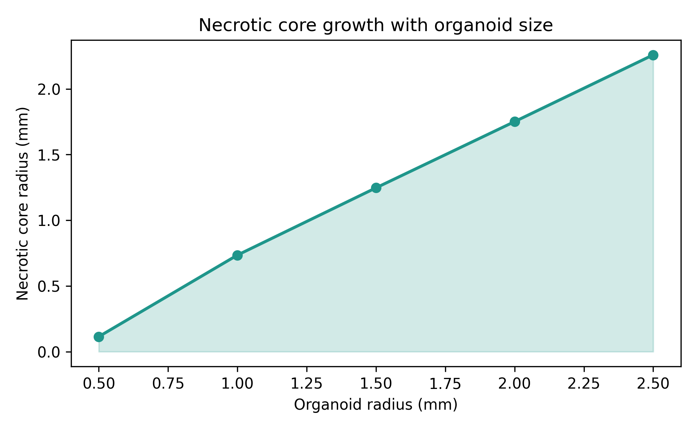

Thiele modulus increased monotonically from 2.5 to 12.5, confirming that internal transport limitations become progressively dominant with organoid growth.

The maturation model predicted a non-monotonic optimum with respect to shear. The best day-90 operating point occurred near 0.112 Pa, where the overall maturation score reached 0.603.

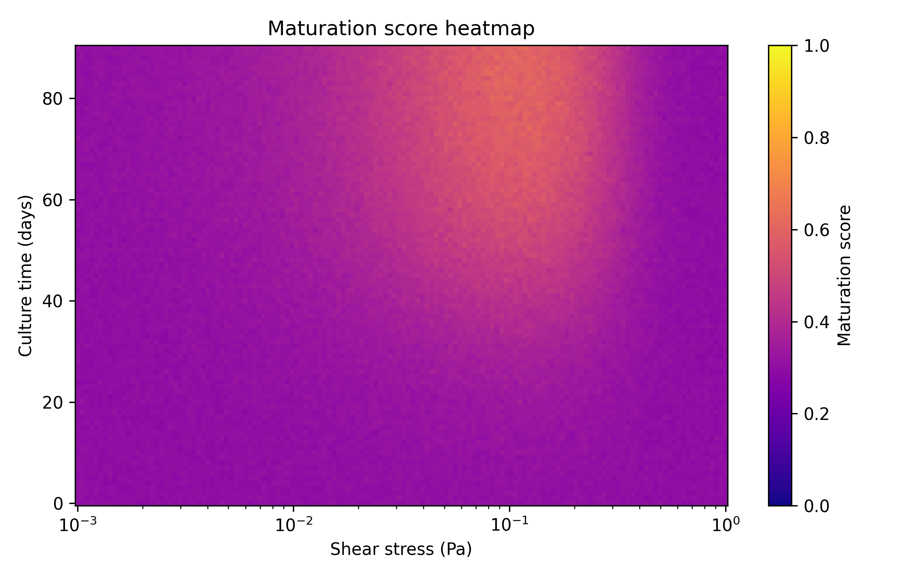

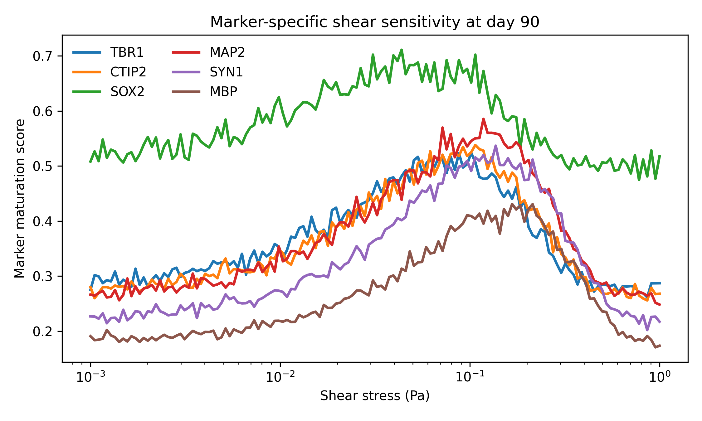

Across marker-specific curves, the day-90 mean score at the optimum was 0.521 ± 0.079.

The media optimizer identified a near-optimal exchange interval of 3.0 days and an integrated maturation-viability objective of 39.80.

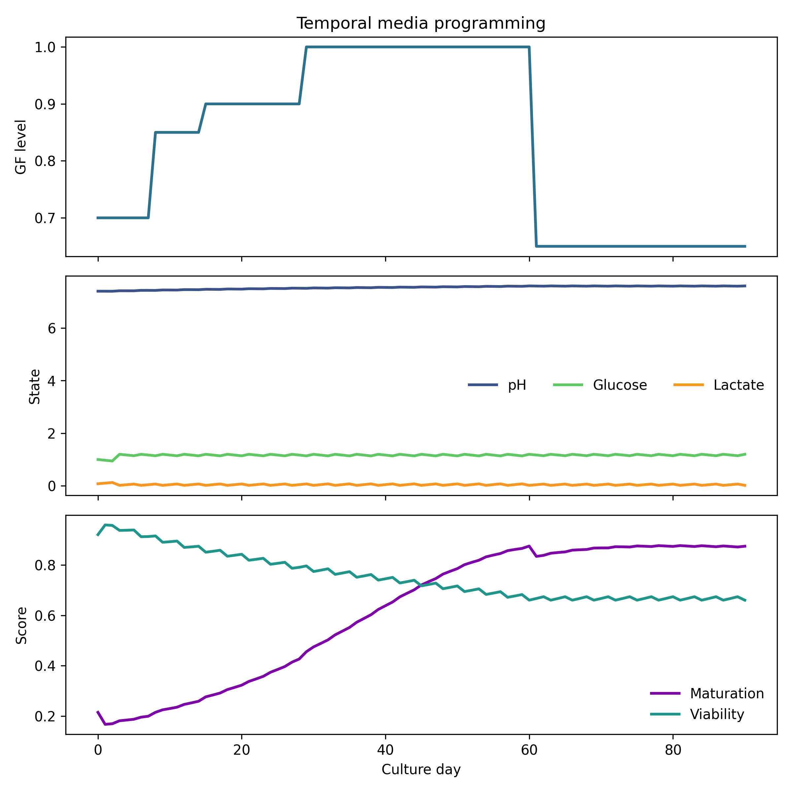

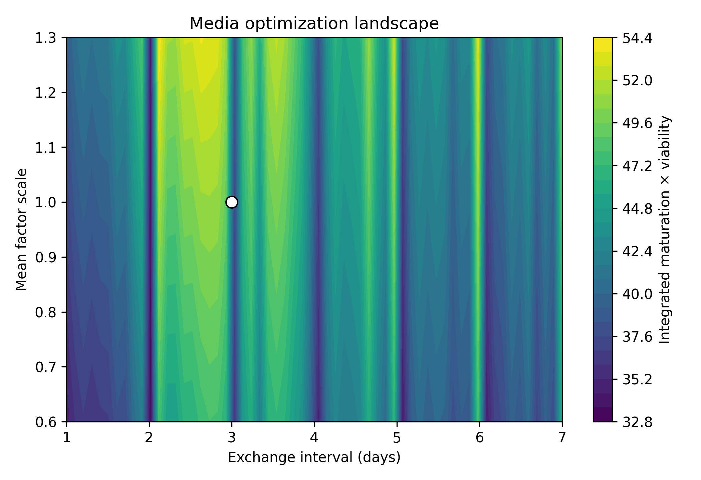

The scalability module predicted that perfusion and continuous modes offer lower variability than batch culture as scale increases, but with the current cost assumptions both approaches only match or beat simpler modes near the upper end of the explored 1000-organoid range.

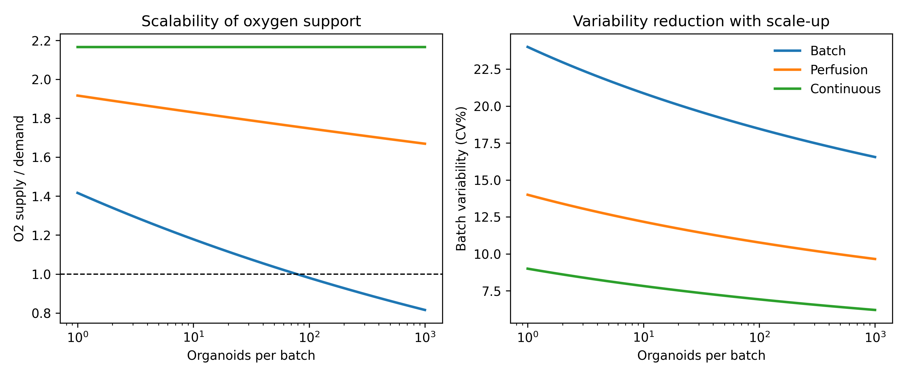

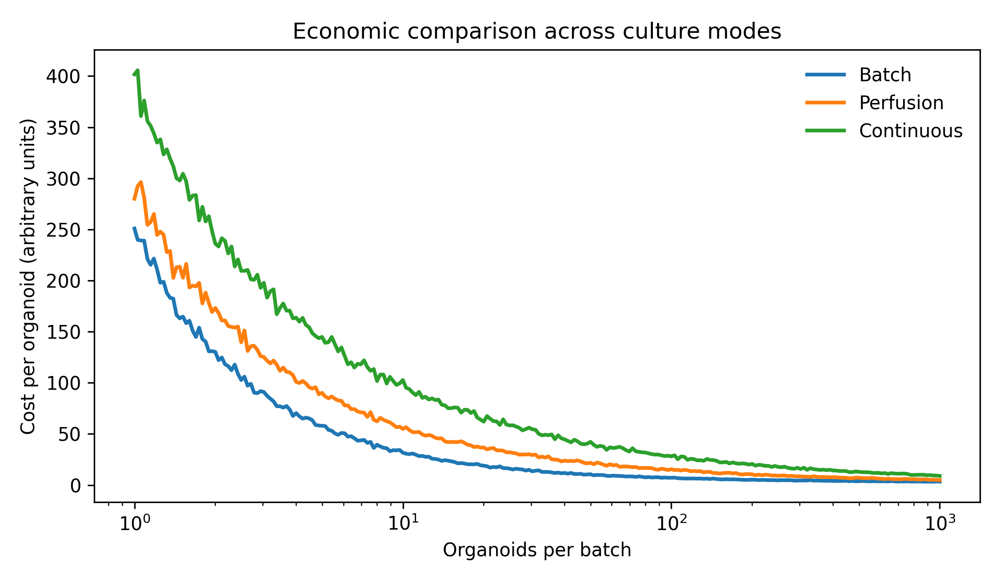

Biomarker simulations provided a complementary view of process control. The multivariate maturation index increased from 0.224 at day 30 to 0.558 at day 60 and 0.746 ± 0.028 at day 90.

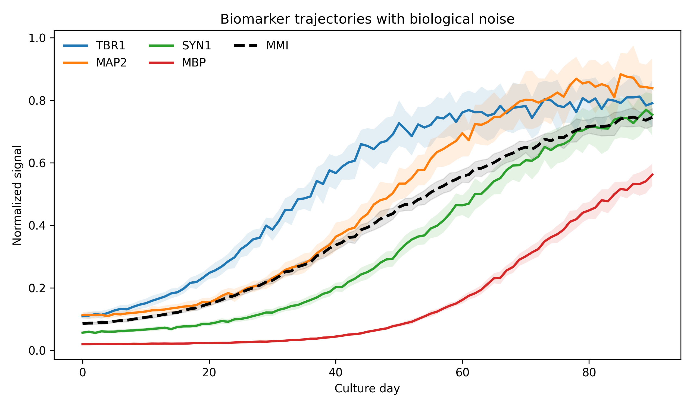

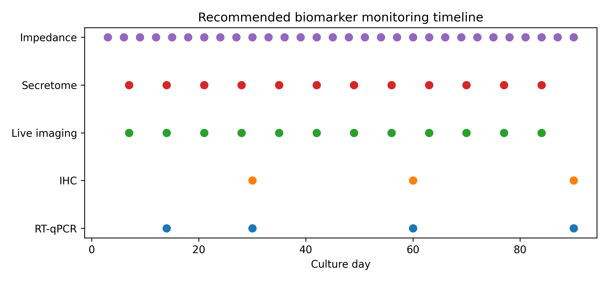

## Discussion

Taken together, the results support a design philosophy centered on gentle but continuous perfusion, strong attention to oxygen transport, phase-appropriate media programming, and a monitoring stack that balances destructive endpoint assays with non-destructive process analytics. The hydrodynamic predictions align with the broader literature arguing that organoid culture benefits from dynamic environments when those environments improve transport without imposing damaging stress. Qian et al. (2016) and Suong et al. (2021) both demonstrated that bioreactor-driven flow and mixing can reshape brain organoid outcomes, while Seiler et al. (2022) showed that microfluidic automation can reduce metabolic stress. Our own framework is consistent with those findings in the sense that transport enhancement is helpful, but it also indicates that the baseline flow rate used here is probably too mild to generate the maturation-optimal shear stress predicted by the mechanosensing surrogate.

The transport results also reinforce a recurring theme in organoid engineering: beyond a certain size, diffusion alone is insufficient. Reviews by Hofer and Lütolf (2021), Zhao et al. (2022), and Licata et al. (2023) emphasize that improved mass transport is a prerequisite for reproducible large-scale organoid culture. The present model sharpens that point by quantifying how rapidly viability erodes as radius increases. Saglam-Metiner et al. (2023) reported improved maturation under spatiotemporally dynamic culture, and our analysis suggests one mechanistic explanation for such gains: dynamic systems can alleviate the transport bottlenecks that otherwise flatten developmental progression. Likewise, Velasco et al. (2020) and Zheng et al. (2021) argued that integrated simulation and microtechnology are natural partners, which matches the architecture of this framework.

The monitoring module highlights another translational implication. In practice, mature organoid manufacturing will require more than occasional terminal immunostaining. Birey et al. (2017) and Schafer et al. (2023) show that advanced neural phenotypes emerge over long timescales and across multiple cellular programs. That makes a multivariate index useful for routine decision-making, especially when supported by secretome sampling and impedance or imaging-based surveillance. Kim et al. (2020) and Yang et al. (2023) both position organoids as increasingly important translational systems, but such positioning will only be credible if process variability is actively monitored. The present results therefore support a hybrid monitoring strategy rather than reliance on a single biomarker class. ⚠️ The precise numerical utility of each sensing modality in this framework is currently supported by the simulation design itself rather than by a direct head-to-head experimental benchmark.

## Limitations and Future Work

This study used only synthetic data generated from mechanistic and semi-empirical models. No independent wet-lab measurements, transcriptomic panels, dissolved oxygen traces, or long-term perfusion bioreactor runs were available for calibration. As a result, the absolute values reported here should be interpreted as engineering priors rather than definitive biological truths. The reference literature provides qualitative and contextual support, but it does not specify a single universally accepted parameter set for all organoid lines, media formulations, or reactor geometries. Human pluripotent stem cell line effects, batch variability in matrix products, and lab-specific maturation protocols are all omitted. These omissions are important because organoid systems often vary substantially across institutions and even across operators.

Several modeling assumptions were chosen for tractability. The CFD solver assumes axisymmetry, steady flow, Newtonian media, and negligible inertial terms. The transport model assumes homogeneous tissue diffusivity and Michaelis–Menten consumption with no internal vasculature, compartmentalization, or spatially varying cell densities. The maturation model uses surrogate response curves rather than calibration to matched longitudinal omics and electrophysiology data. The scalability module is also deliberately simple: cost coefficients, labor scaling, and oxygen supply laws are stylized rather than facility-specific. These choices make the framework fast and interpretable, but they also limit predictive fidelity once geometry, pump pulsatility, scaffold effects, or line-specific metabolism become important.

The validation step focused on internal consistency, unit-aware parameterization, seed sensitivity, and broad biological plausibility. It did not include external benchmarking against measured shear stress, oxygen microelectrode data, or real media chemistry, or actual manufacturing records. External validation with independent real-world datasets is essential to confirm the generalizability of these findings beyond simulated conditions. Only a limited set of baseline comparisons was included: simplified static-vs-dynamic logic, transport scaling, and mode-specific cost curves. A richer evaluation would compare this mechanistic framework with higher-fidelity CFD, agent-based developmental models, and experimental time-course measurements.

The framework is most applicable to early design screening for brain organoid perfusion systems under low-flow conditions. It is not automatically transferable to liver, gut, kidney, or vascularized assembloid systems without re-parameterization. Even within brain organoids, differences in protocol, regional identity, extracellular matrix choice, and maturation duration could shift the relevant transport thresholds and biomarker trajectories. Domain shift is therefore expected when moving from generic cerebral organoids to disease-specific or patient-specific models.

In the next six months, the most valuable extension would be calibration against measured oxygen or lactate time courses, together with benchtop validation of flow and pressure. A second short-term step would be to tune the maturation model using matched immunostaining and electrophysiology for markers such as TBR1, MAP2, SYN1, and MBP. Over a one- to two-year horizon, the framework should be extended to include pulsatile or recirculating flow, multi-organoid reactor occupancy, adaptive control of media exchange, and data assimilation from online sensors. A particularly important long-term direction is coupling the current reduced-order model to experimental digital twins for facility-scale optimization.

## References

1. Birey, F., Andersen, J., Makinson, C. D., Islam, S., Wei, W., Huber, N., ... & Paşca, S. P. (2017). Assembly of functionally integrated human forebrain spheroids. *Nature*, 545, 54–59. https://doi.org/10.1038/nature22330
2. Decarli, M. C., Amaral, R., Santos, D. P., Tofani, L. B., Katayama, E. T., Rezende, R. A., ... & Moraes, A. M. (2021). Cell spheroids as a versatile research platform: formation mechanisms, high throughput production, characterization and applications. *Biofabrication*, 13(3), 032002. https://doi.org/10.1088/1758-5090/abe6f2
3. Hofer, M., & Lütolf, M. P. (2021). Engineering organoids. *Nature Reviews Materials*, 6, 402–420. https://doi.org/10.1038/s41578-021-00279-y
4. Kim, J., Koo, B.-K., & Knoblich, J. A. (2020). Human organoids: model systems for human biology and medicine. *Nature Reviews Molecular Cell Biology*, 21, 571–584. https://doi.org/10.1038/s41580-020-0259-3
5. Lancaster, M. A., Renner, M., Martin, C.-A., Wenzel, D., Bicknell, L. S., Hurles, M. E., ... & Knoblich, J. A. (2013). Cerebral organoids model human brain development and microcephaly. *Nature*, 501, 373–379. https://doi.org/10.1038/nature12517
6. Licata, J. P., Schwab, K. H., Har-el, Y., Gerstenhaber, J. A., & Lelkes, P. I. (2023). Bioreactor Technologies for Enhanced Organoid Culture. *International Journal of Molecular Sciences*, 24(14), 11427. https://doi.org/10.3390/ijms241411427
7. Qian, X., Nguyen, H. N., Song, M. M., Hadiono, C., Ogden, S. C., Hammack, C., ... & Ming, G.-L. (2016). Brain-Region-Specific Organoids Using Mini-bioreactors for Modeling ZIKV Exposure. *Cell*, 165(5), 1238–1254. https://doi.org/10.1016/j.cell.2016.04.032
8. Saglam-Metiner, P., Devamoglu, U., Filiz, Y., Akbari, S., Beceren, G., Bagca, B. G., ... & Yeşil-Çeliktaş, Ö. (2023). Spatio-temporal dynamics enhance cellular diversity, neuronal function and further maturation of human cerebral organoids. *Communications Biology*, 6, 117. https://doi.org/10.1038/s42003-023-04547-1
9. Schafer, S. T., Mansour, A. A., Schlachetzki, J. C. M., Pena, M., Ghassemzadeh, S. S., Mitchell, L. E., ... & Gage, F. H. (2023). An in vivo neuroimmune organoid model to study human microglia phenotypes. *Cell*, 186(10), 2111–2126. https://doi.org/10.1016/j.cell.2023.04.022
10. Seiler, S. T., Mantalas, G. L., Selberg, J., Cordero, S., Torres, S., Baudin, P. V., ... & Teodorescu, M. (2022). Modular automated microfluidic cell culture platform reduces glycolytic stress in cerebral cortex organoids. *Scientific Reports*, 12, 15108. https://doi.org/10.1038/s41598-022-20096-9
11. Suong, D. N. A., Imamura, K., Inoue, I., Kabai, R., Sakamoto, S., Okumura, T., ... & Inoue, H. (2021). Induction of inverted morphology in brain organoids by vertical-mixing bioreactors. *Communications Biology*, 4, 1213. https://doi.org/10.1038/s42003-021-02719-5
12. Velasco, V., Shariati, S. A., & Esfandyarpour, R. (2020). Microtechnology-based methods for organoid models. *Microsystems & Nanoengineering*, 6, 76. https://doi.org/10.1038/s41378-020-00185-3
13. Yang, S., Hu, H.-J., Kung, H.-C., Zou, R.-Q., Dai, Y.-S., Hu, Y.-F., ... & Li, F.-Y. (2023). Organoids: The current status and biomedical applications. *MedComm*, 4(3), e274. https://doi.org/10.1002/mco2.274
14. Zhao, Z., Chen, X., Dowbaj, A. M., Sljukic, A., Bratlie, K. M., Lin, L., ... & Yu, H. (2022). Organoids. *Nature Reviews Methods Primers*, 2, 94. https://doi.org/10.1038/s43586-022-00174-y
15. Zheng, F., Xiao, Y., Liu, H., Fan, Y., & Dao, M. (2021). Patient-Specific Organoid and Organ-on-a-Chip: 3D Cell-Culture Meets 3D Printing and Numerical Simulation. *Advanced Biology*, 5(6), 2000024. https://doi.org/10.1002/adbi.202000024

## File Inventory

- Source modules: `src/bioreactor_cfd.py`, `src/reaction_diffusion.py`, `src/shear_maturation.py`, `src/media_optimization.py`, `src/scalability_analysis.py`, `src/biomarker_monitoring.py`
- Tests: `tests/test_models.py`
- Figures: 12 PNG files in `figures/`
- Structured results: JSON metrics, `results/simulation_summary.json`, `results/statistical-summary.md`, `results/sensitivity-analysis.md`
- Literature artifacts: `results/search-strategy.md`, `results/screening-table.csv`, `results/extraction-table.csv`, `results/reference-list.md`, `figures/prisma-flow.md`
