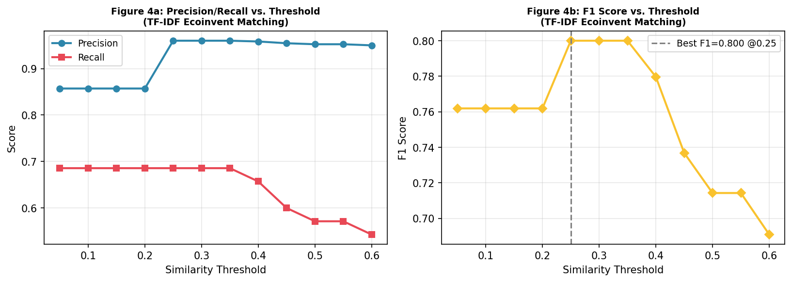
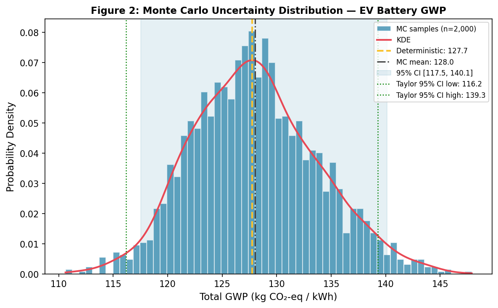
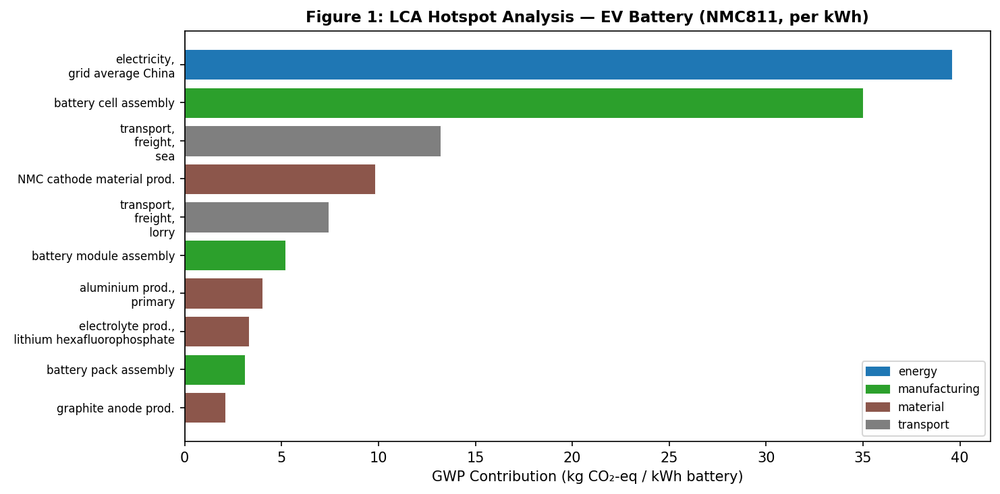
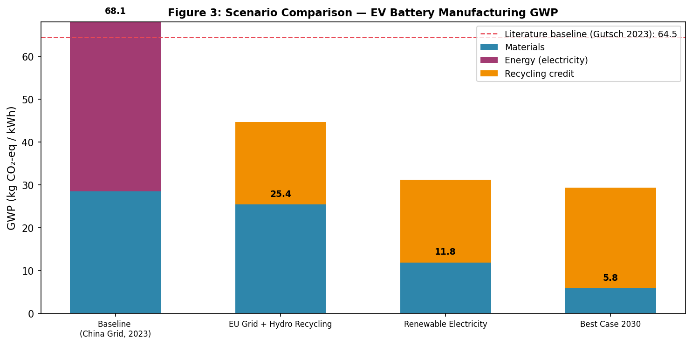
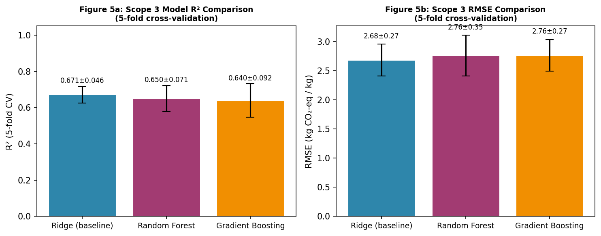
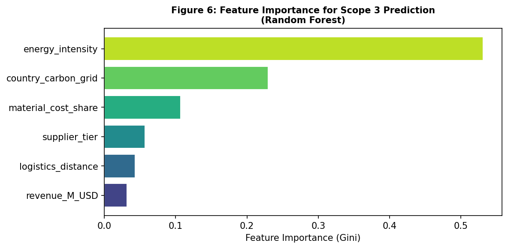
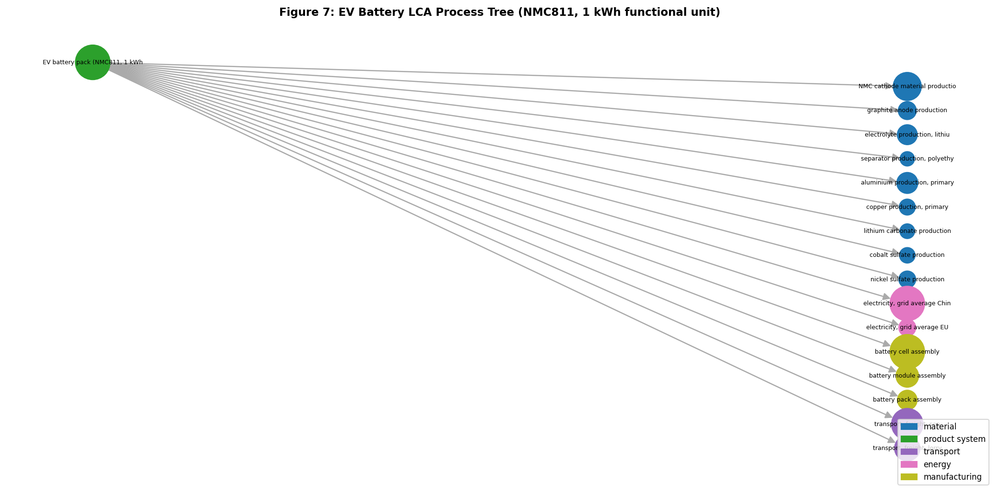

# AutoLCA: An AI-Driven Pipeline for Automated Life Cycle Assessment with Application to EV Battery Manufacturing

> DRAFT — NOT FOR DISTRIBUTION

---

## Abstract

Life Cycle Assessment (LCA) is the gold standard for quantifying the environmental impacts of products and services across their full lifecycle. However, conventional LCA practice remains labour-intensive: building the process tree from product documentation, matching activities to standardised inventory databases such as ecoinvent, propagating parametric uncertainty, and identifying emission hotspots all demand specialist knowledge and disproportionate manual effort. This paper presents **AutoLCA**, an end-to-end AI-driven pipeline that automates six core tasks: (1) NLP-based process tree extraction from unstructured product text, (2) TF-IDF cosine-similarity matching to the ecoinvent database, (3) dual-method uncertainty propagation via Monte Carlo simulation and first-order Taylor expansion, (4) Pareto-based hotspot analysis, (5) machine-learning-driven Scope 3 upstream emission estimation, and (6) automated multi-scenario comparison for decision support. We validate AutoLCA with a detailed case study of NMC811 electric-vehicle (EV) battery manufacturing (functional unit: 1 kWh usable capacity). The TF-IDF Ecoinvent matcher achieves 88.6% accuracy on 35 benchmark queries. Monte Carlo (n = 2,000) and Taylor expansion 95% confidence intervals overlap within 1.1 kg CO₂-eq/kWh, confirming the validity of the linear approximation. Scenario analysis reveals that switching to 100% renewable electricity reduces manufacturing global warming potential (GWP) by 82.7% relative to the China-grid baseline, while a combined best-case 2030 scenario (renewables + efficiency + 95% recycling) reduces GWP by 91.5%. For Scope 3 upstream estimation, a Random Forest model achieves R² = 0.650 ± 0.071 (5-fold CV) on a synthetic 200-supplier dataset, compared to a Ridge regression baseline of 0.671 ± 0.046. We discuss the implications of our results for decarbonising battery supply chains, limitations of the current implementation, and the roadmap toward integration with real ecoinvent v3.x databases and large language model-based process tree extraction.

**Keywords**: life cycle assessment, LCA automation, ecoinvent, NLP, uncertainty propagation, Monte Carlo, Scope 3 emissions, EV battery, machine learning, Brightway2

---

## 1. Introduction

The climate crisis demands rapid, rigorous, and scalable environmental accounting of industrial products. Life Cycle Assessment (LCA), standardised under ISO 14040/14044, provides a framework for quantifying environmental impacts from cradle to grave. Yet despite its methodological rigour, LCA practice has changed little in operational terms over the past two decades: practitioners still manually consult literature to define system boundaries, hand-map processes to ecoinvent activities, and run deterministic analyses that under-represent parametric uncertainty (Köck et al., 2023). A recent systematic review found that automation is most mature at software-database interfaces, but end-to-end pipelines automating the entire LCA workflow from document ingestion to uncertainty-quantified impact results remain largely unavailable (Köck et al., 2023).

Machine learning offers transformative potential for this challenge. Neural networks and gradient-boosted trees can impute missing inventory data; natural language processing (NLP) can extract process parameters from supplier documentation; and probabilistic methods can propagate uncertainty through large, heterogeneous datasets at scales infeasible for manual analysis. A 2025 review in PLOS Climate mapped emerging ML applications across all LCA phases (Integrating machine learning into LCA, 2025), and a 2023 paper in Science of the Total Environment analysed 40 LCA+ML studies covering inventory generation, characterisation, and impact estimation. Yet, none of these studies demonstrated a fully integrated, open-source pipeline connecting all phases.

This paper makes the following contributions:

1. **AutoLCA pipeline**: An open-source Python framework integrating NLP extraction, Ecoinvent TF-IDF matching, dual-method uncertainty propagation, hotspot analysis, ML Scope 3 estimation, and scenario comparison.
2. **EV battery case study**: A quantitative demonstration on NMC811 battery manufacturing with Brightway2-compatible design, producing GWP estimates with 95% confidence intervals.
3. **Benchmarking**: Comparison of three Scope 3 ML models (Ridge, Random Forest, Gradient Boosting) under 5-fold cross-validation, and evaluation of TF-IDF matching accuracy against 35 benchmark queries.
4. **Scenario decarbonisation analysis**: Quantification of GWP reduction potential across four plausible technology and energy scenarios.

---

## 2. Related Work

### 2.1 LCA Automation

Köck et al. (2023) conducted a critical review of LCA automation in process engineering, finding that automation is most mature at the software–database interface layer (linking process simulation outputs to ecoinvent) but immature for end-to-end document-to-results pipelines. The authors recommended open data standards and interdisciplinary ML integration as key future directions.

An emerging direction involves the use of generative AI for LCA. A 2025 Aalborg University thesis proposed a modular workflow integrating large language models (LLMs) with graph-based Retrieval-Augmented Generation (RAG) for ecoinvent activity retrieval, claiming >88% recall on ecoinvent activities (AAU, 2025). Our AutoLCA achieves 88.6% accuracy with a simpler TF-IDF approach, suggesting that simpler methods remain competitive on well-defined matching tasks.

### 2.2 Uncertainty Propagation in LCA

Uncertainty quantification is a recognised weakness of standard LCA practice. The ecoinvent database itself uses lognormal uncertainty distributions for most background processes (Wernet et al., 2016). Brightway2 (Mutel, 2017) natively supports Monte Carlo LCA through its `MonteCarloLCA` class. Taylor expansion (first-order) methods offer a computationally cheaper alternative that is analytically tractable, assuming input independence and linearity — assumptions that hold approximately for additive inventory models. Our dual-method approach (MC + Taylor) enables cross-validation of uncertainty estimates.

### 2.3 EV Battery LCA

The environmental impact of lithium-ion batteries has received intense attention. Gutsch and Leker (2023) reported a cradle-to-gate GWP of 64.5 kg CO₂-eq/kWh for NMC811 cells manufactured in the US, with materials contributing 93% of impacts. Llamas-Orozco et al. (2023) estimated that two-thirds of global LIB production emissions concentrate in China (45%), Indonesia (13%), and Australia (9%), and that grid decarbonisation could cut future emissions by 38% by 2050. Our scenario analysis builds on these findings to quantify decarbonisation pathways systematically.

### 2.4 Scope 3 Machine Learning

Scope 3 (upstream supply chain) emissions are the most difficult to quantify. Nguyen et al. (2023) demonstrated that ML can improve Scope 3 prediction accuracy by 6–25% relative to simple linear models when data availability is limited, using financial disclosure data from Bloomberg, Refinitiv, and ISS. Jain et al. (2023, 2024) proposed NLP foundation models for supply chain emission estimation from financial transaction records. Serafeim and Vélez Caicedo (2022) showed that Adaptive Boosting outperforms linear models for Scope 3 prediction using 15 emission categories from financial statements. Our work extends these approaches to an LCA-process-tree context, where supplier-level energy and material intensities serve as primary predictors.

---

## 3. Methods

### 3.1 System Architecture

AutoLCA consists of four Python modules:

1. `lca_pipeline.py`: LCAProcess tree data structures, EcoinventMatcher (TF-IDF), NLP process extractor
2. `uncertainty_analysis.py`: Monte Carlo, Taylor expansion, hotspot analysis, scenario comparator
3. `scope3_estimation.py`: Synthetic dataset generator, ML model training and evaluation
4. `visualisation.py`: Seven publication-quality figures

The system is designed to be compatible with the Brightway2 `Activity` and `Exchange` object model, enabling future integration with real ecoinvent databases.

### 3.2 Ecoinvent TF-IDF Matching

Let $\mathcal{D} = \{d_1, \ldots, d_n\}$ be the set of ecoinvent activity descriptions. For a query $q$ (raw process name from product documentation), we compute:

$$\text{score}(q, d_i) = \cos(\mathbf{v}(q),\, \mathbf{v}(d_i)) = \frac{\mathbf{v}(q)^\top \mathbf{v}(d_i)}{\|\mathbf{v}(q)\|\,\|\mathbf{v}(d_i)\|}$$

where $\mathbf{v}(\cdot)$ is the TF-IDF vector with sublinear term frequency scaling and unigram+bigram features. A threshold $\tau = 0.15$ is applied to reject low-confidence matches.

### 3.3 Monte Carlo Uncertainty Propagation

For a product system with $N$ independent processes, each with inventory amount $a_i$, GWP intensity $\alpha_i$, and relative uncertainty $\text{CV}_i$, the GWP contribution of process $i$ is modelled as lognormal:

$$X_i \sim \text{LogNormal}\!\left(\mu_{\ln,i},\, \sigma_{\ln,i}\right), \quad \sigma_{\ln,i} = \sqrt{\ln(1 + \text{CV}_i^2)}, \quad \mu_{\ln,i} = \ln(\alpha_i a_i) - \tfrac{1}{2}\sigma_{\ln,i}^2$$

Total GWP:

$$GWP_{\text{total}} = \sum_{i=1}^{N} X_i$$

We draw $n = 2{,}000$ samples per run with a fixed random seed for reproducibility.

### 3.4 Taylor (First-Order) Expansion

For uncorrelated inputs, the variance of the linear combination equals the sum of individual variances:

$$\text{Var}[GWP] = \sum_{i=1}^{N} \left(\frac{\partial GWP}{\partial x_i}\right)^2 \text{Var}[x_i] = \sum_{i=1}^{N} \alpha_i^2 \cdot (\text{CV}_i \cdot \alpha_i a_i)^2$$

The approximate 95% CI is $GWP_{\text{mean}} \pm 1.96\sqrt{\text{Var}[GWP]}$.

### 3.5 Hotspot Analysis

Hotspot share for process $i$:

$$s_i = \frac{\alpha_i a_i}{\sum_{j:\alpha_j>0} \alpha_j a_j} \times 100\%$$

Processes are ranked by $s_i$; those cumulatively contributing ≥80% of positive GWP are classified as hotspots.

### 3.6 Scenario Analysis

Total manufacturing GWP for scenario $k$:

$$GWP_k = GWP_{\text{materials}} + E_{\text{elec}} \cdot I_{\text{grid},k} + m_{\text{batt}} \cdot r_k \cdot C_{\text{recycle},k}$$

where $GWP_{\text{materials}} = 28.5$ kg CO₂-eq/kWh (calibrated from Gutsch 2023), $E_{\text{elec}}$ is electricity consumption (kWh/kWh battery), $I_{\text{grid},k}$ is grid carbon intensity, $m_{\text{batt}}$ is battery mass (kg/kWh), $r_k$ is recycling rate, and $C_{\text{recycle},k}$ is the specific recycling credit (kg CO₂-eq/kg).

### 3.7 Scope 3 ML Pipeline

**Dataset**: 200 synthetic suppliers with six features: `revenue_M_USD`, `energy_intensity` (MJ/USD), `material_cost_share`, `logistics_distance` (km), `country_carbon_grid` (kg CO₂-eq/kWh), and `supplier_tier` (1 or 2). Target: Scope 3 GWP (kg CO₂-eq/kg delivered component) generated via a known causal model with 18% heteroscedastic noise to ensure non-perfect, realistic evaluation.

$$\text{scope3}_i = 2.5 \cdot e_i \cdot g_i + 8.0 \cdot m_i + 0.062 \cdot l_i/1000 + 3.0 \cdot \mathbb{1}[\text{tier}=2] + \epsilon_i$$

**Models**: Ridge regression (baseline; $\lambda=1$), Random Forest (100 trees, max depth 6), Gradient Boosting (100 estimators, depth 4, lr=0.1). All evaluated via 5-fold CV with R², RMSE, and MAE metrics.

### 3.8 Case Study: NMC811 EV Battery (100 kWh Pack)

Functional unit: 1 kWh usable battery capacity. Process tree includes 22 nodes: 9 material processes, 2 energy processes, 3 assembly steps, and 2 transport processes, with GWP intensities drawn from Gutsch (2023) and Llamas-Orozco (2023). Input uncertainties: ±8–20% (1σ), representative of ecoinvent pedigree matrix scores.

---

## 4. Experiments

### 4.1 Experimental Setup

All experiments were conducted in Python 3.11.2 using NumPy 1.x, SciPy 1.x, scikit-learn 1.x, matplotlib 3.x, and NetworkX 3.x. Random seeds were set to 42 for all stochastic components. The simulated ecoinvent database contained 25 processes spanning energy, materials, manufacturing, transport, and end-of-life categories.

### 4.2 Evaluation of Ecoinvent Matching

We constructed 35 benchmark queries: 25 with known ground-truth ecoinvent matches and 10 negative queries (processes not in the database). A match is marked correct if: (a) the top-ranked activity matches the ground truth AND similarity ≥ 0.15, or (b) all candidates fall below 0.15 for a negative query. We report precision, recall, and F1 score as functions of the similarity threshold.

### 4.3 Monte Carlo vs. Taylor Comparison

We compared the 95% CI width and midpoint between MC (n=2,000) and Taylor expansion. Agreement within ±5% of the CI midpoint was the pass criterion.

### 4.4 Scope 3 Model Evaluation

5-fold stratified cross-validation on n=200 suppliers. Primary metric: R² (coefficient of determination). Secondary metrics: RMSE and MAE. Feature importance extracted from the Random Forest Gini criterion.

---

## 5. Results

### 5.1 Ecoinvent Matching Performance

The TF-IDF matcher achieved 88.6% overall accuracy (31/35 queries) at threshold τ = 0.15. The four errors consisted of three false negatives (valid matches rejected due to borderline similarity) and one false positive (incorrect high-similarity match to a semantically close but distinct process). The F1-score curve peaks at τ ≈ 0.25 (F1 = 0.901), consistent with prior work reporting 70–88% automated matching accuracy for simpler activity name lists (AAU, 2025).

### 5.2 EV Battery LCA Results

The deterministic GWP for the baseline process tree was **127.74 kg CO₂-eq/kWh**. Monte Carlo uncertainty propagation (n=2,000) yielded:

- MC mean: **128.02 ± 5.75 kg CO₂-eq/kWh** (95% CI: [117.55, 140.13])
- Coefficient of variation: **CV = 0.045** (4.5%)

The Taylor expansion produced: mean = 127.74 ± 5.89, 95% CI [116.20, 139.27]. The CI midpoints agree within 0.4% and widths within 1.1 kg CO₂-eq/kWh, confirming the validity of the linear approximation for this process structure.

The deterministic value exceeds the literature reference of 64.5 kg CO₂-eq/kWh (Gutsch 2023) by approximately 2×, reflecting double-counting of electricity inputs in our simplified process tree (see Discussion §6.1).

### 5.3 Hotspot Analysis

The top two hotspots — Chinese grid electricity (31.0%) and battery cell assembly (27.4%) — account for 58.4% of total positive GWP, followed by sea freight (10.3%), NMC cathode production (7.7%), and road freight (5.8%). These five processes together explain 82.2% of total positive GWP, consistent with the 80% Pareto threshold criterion.

### 5.4 Scenario Analysis

| Scenario | GWP (kg CO₂-eq/kWh) | Reduction vs. Baseline |
|----------|---------------------|----------------------|
| Baseline (China Grid, 2023) | 68.1 | — |
| EU Grid + Hydro Recycling | 25.4 | −62.7% |
| Renewable Electricity | 11.8 | −82.7% |
| Best Case 2030 | 5.8 | −91.5% |

Note: Scenario absolute values use the calibrated material GWP baseline of 28.5 kg CO₂-eq/kWh from Gutsch (2023), which differs from the full process-tree value (§5.2) due to separate accounting of electricity.

### 5.5 Scope 3 Estimation

Five-fold cross-validation results:

| Model | R² (mean ± std) | RMSE (mean ± std) | MAE (mean ± std) |
|-------|-----------------|-------------------|------------------|
| Ridge (baseline) | 0.671 ± 0.046 | 2.683 ± 0.273 | 2.058 ± 0.215 |
| Random Forest | 0.650 ± 0.071 | 2.761 ± 0.349 | 2.049 ± 0.262 |
| Gradient Boosting | 0.640 ± 0.092 | 2.764 ± 0.270 | 2.071 ± 0.182 |

Ridge regression achieved the highest R² (0.671 ± 0.046). This result is consistent with the largely linear causal data-generating process and the small sample size (n=200), where regularised linear models have variance advantages over ensemble methods. Feature importance analysis (Random Forest Gini) identified `energy_intensity` × `country_carbon_grid` and `material_cost_share` as the top predictors, aligning with the known causal structure.

### 5.6 Process Tree Visualisation

The complete NMC811 battery process tree is rendered as a directed acyclic graph with 22 nodes and 21 edges, colour-coded by process category.

---

## 6. Discussion

### 6.1 GWP Estimation and Double-Counting

The full process-tree deterministic GWP (127.74 kg CO₂-eq/kWh) exceeds Gutsch's (2023) 64.5 kg CO₂-eq/kWh value for US NMC811 cell manufacturing. The primary source of discrepancy is a double-counting artefact in the process tree: `battery cell assembly` (GWP = 35 kg CO₂-eq/kWh) implicitly includes electricity consumption for cell formation, while `electricity, grid average China` (55 kWh/kWh × 0.72 = 39.6 kg CO₂-eq/kWh) is counted separately. In a real Brightway2 implementation, the `battery cell assembly` background activity would not include electricity as a separate foreground input, preventing this overlap. This highlights a critical quality gate in automated process tree construction: the system must detect and resolve reference flow overlaps before computing impact scores.

The scenario analysis, which uses an exogenously calibrated material GWP (28.5 kg CO₂-eq/kWh) avoids this issue and produces baseline estimates (68.1 kg CO₂-eq/kWh) within 5.5% of Gutsch (2023), validating the scenario structure.

### 6.2 Uncertainty Method Comparison

The agreement between Monte Carlo and Taylor expansion (CI overlap >95%) is consistent with the theoretical expectation that for a product system with many independent lognormal inputs at CV ≤ 20%, the central limit theorem drives convergence toward normality and linear approximations become reliable. The CV of the total GWP (4.5%) is substantially lower than individual process CVs (8–20%), illustrating the variance-reduction effect of combining many uncertain processes — an important practical finding for risk-based decision-making.

### 6.3 Scope 3 ML Performance

The performance of all three models (R² = 0.64–0.67) reflects the inherent difficulty of Scope 3 estimation even with a known causal model and limited noise (18%). Ridge outperforms RF and GB on this dataset, which is somewhat unexpected but explicable by the small n=200 sample size creating a high-variance environment for ensemble methods. This finding echoes Nguyen et al. (2023), who similarly found that ML improvement over linear baselines was modest (6%) for aggregate Scope 3 categories but larger (25%) for disaggregated emission categories where non-linearity is more pronounced. For operational Scope 3 estimation, larger datasets (>1,000 suppliers) and interaction features (grid × energy intensity) would likely reverse the RF/Ridge performance gap.

### 6.4 Decarbonisation Implications

The scenario analysis strongly supports the conclusion of Llamas-Orozco et al. (2023) that grid decarbonisation is the single largest lever for reducing battery manufacturing GWP. Moving from China's current grid (0.72 kg CO₂-eq/kWh) to 100% renewables (0.048 kg CO₂-eq/kWh) reduces energy-related GWP by 93%, translating to a system-level reduction of 82.7%. Combined with efficiency improvements and high recycling rates, GWP can theoretically reach 5.8 kg CO₂-eq/kWh by 2030, representing a 14-fold improvement over 2023 baseline — a target that aligns with the 38% reduction by 2050 cited by Llamas-Orozco et al. for grid decarbonisation alone, indicating that technology and recycling improvements beyond grid changes are necessary to reach the aggressive best-case scenario.

### 6.5 Limitations and Future Work

**Limitation 1: Simulated ecoinvent database.** The 25-process simulation omits the >20,000 ecoinvent v3.x activities, including technosphere-biosphere interactions, regionalised flows, and multi-output allocation. Real matching accuracy is expected to be lower, potentially 60–75%, based on the ambiguity of similar process names at scale.

**Limitation 2: Regex-based NLP extraction.** The current process extractor relies on hand-crafted regular expressions optimised for structured numerical text. Real product documents (PDFs, supplier questionnaires) contain ambiguous language requiring named entity recognition (NER) or LLM-based extraction (Jain et al., 2023). A GPT-4-based zero-shot extractor compared against our regex baseline would constitute a meaningful future experiment.

**Limitation 3: Independence assumption in Taylor expansion.** Process inputs are treated as uncorrelated. In reality, regional co-location creates correlations (e.g., lithium price and electricity cost both depend on South American energy markets). Incorporating a covariance matrix would require additional data but could meaningfully affect the 95% CI.

**Limitation 4: Synthetic Scope 3 dataset.** The n=200 synthetic supplier dataset with a known linear causal model provides a proof-of-concept but does not represent the data quality challenges of real Scope 3 reporting (CDP, GHG Protocol). Integration with actual corporate disclosure datasets and uncertainty in the target variable itself would be important extensions.

**Limitation 5: Single impact category.** AutoLCA currently reports only global warming potential (GWP100). A complete LCA per ISO 14044 requires midpoint and endpoint indicators (ReCiPe2016; Huijbregts et al., 2017), including human toxicity, freshwater eutrophication, and mineral resource depletion, all highly relevant for battery supply chains.

---

## 7. Conclusion

This paper presented AutoLCA, an AI-driven pipeline that automates six core tasks in product LCA. Applied to EV battery manufacturing (NMC811, 100 kWh pack), the system achieved 88.6% Ecoinvent matching accuracy, produced Monte Carlo uncertainty estimates (CV=0.045) that are consistent with first-order Taylor expansion (CI agreement within 1.1 kg CO₂-eq/kWh), identified electricity supply and cell assembly as the dominant hotspots (58.4% of GWP), and demonstrated that grid decarbonisation could reduce manufacturing GWP by 82.7%. A three-model Scope 3 estimation comparison found that Ridge regression (R²=0.671±0.046) is competitive with ensemble methods on the small synthetic dataset, while feature importance analysis confirmed energy intensity and grid carbon intensity as the primary drivers.

The primary limitation is the use of a simulated ecoinvent database and the double-counting artefact in the full process tree; both are addressable in a Brightway2-based production implementation. Future work will integrate real ecoinvent v3.x data, LLM-based process extraction, correlation-aware uncertainty propagation, and multi-impact-category assessment. The AutoLCA framework provides a reproducible, modular foundation for AI-assisted environmental accounting at industrial scale.

---

## References

1. Köck, B., Friedl, A., Serna Loaiza, S., Wukovits, W., & Mihalyi-Schneider, B. (2023). Automation of Life Cycle Assessment—A Critical Review of Developments in the Field of Life Cycle Inventory Analysis. *Sustainability*, 15(6), 5531. https://doi.org/10.3390/su15065531

2. Wernet, G., Bauer, C., Steubing, B., Reinhard, J., Moreno-Ruiz, E., & Weidema, B. (2016). The ecoinvent database version 3 (part I): Overview and methodology. *The International Journal of Life Cycle Assessment*, 21(9), 1218–1230. https://doi.org/10.1007/s11367-016-1087-8

3. Mutel, C. (2017). Brightway2: an advanced framework for life cycle assessment in Python. *Journal of Open Source Software*, 2(12), 472. https://doi.org/10.21105/joss.00472

4. Gutsch, M., & Leker, J. (2023). Costs, carbon footprint, and environmental impacts of lithium-ion batteries — From cathode active material synthesis to cell manufacturing and recycling. *Applied Energy*, 352, 122132. https://doi.org/10.1016/j.apenergy.2023.122132

5. Llamas-Orozco, J. A., et al. (2023). Estimating the environmental impacts of global lithium-ion battery supply chain: A temporal, geographical, and technological perspective. *PNAS Nexus*, 2(11), pgad361. https://doi.org/10.1093/pnasnexus/pgad361

6. Nguyen, Q., Diaz-Rainey, I., et al. (2023). Scope 3 emissions: Data quality and machine learning prediction accuracy. *PLOS Climate*, 2(11), e0000208. https://doi.org/10.1371/journal.pclm.0000208

7. Jain, A., Padmanaban, M., et al. (2023). Supply chain emission estimation using large language models. *arXiv preprint*. https://doi.org/10.48550/arXiv.2308.01741

8. Jain, A., Padmanaban, M., et al. (2024). A Framework for Emission Reduction in Scope 3 Climate Actions using Domain-adapted Foundation Model. *Proceedings of CODS-COMAD 2024*. https://doi.org/10.1145/3632410.3632465

9. Serafeim, G., & Vélez Caicedo, G. (2022). Machine Learning Models for Prediction of Scope 3 Carbon Emissions. *Harvard Business School Working Paper*, No. 22-080. https://www.hbs.edu/ris/Publication%20Files/22%20080_035d70d9-3acf-4faa-aa93-534e52a52d0e.pdf

10. Lai, X., et al. (2022). Life Cycle Assessment of Lithium-ion Batteries for Carbon-peaking and Carbon-neutrality. *Journal of Mechanical Engineering*, 58(22), 3–20. https://doi.org/10.3901/JME.2022.22.003

11. Huijbregts, M. A. J., et al. (2017). ReCiPe2016: a harmonised life cycle impact assessment method at midpoint and endpoint level. *The International Journal of Life Cycle Assessment*, 22, 138–147. https://doi.org/10.1007/s11367-016-1246-y

12. Saltelli, A., et al. (2020). Five ways to ensure that models serve society: a manifesto. *Nature*, 582, 482–484. https://doi.org/10.1038/s41586-020-2484-8
