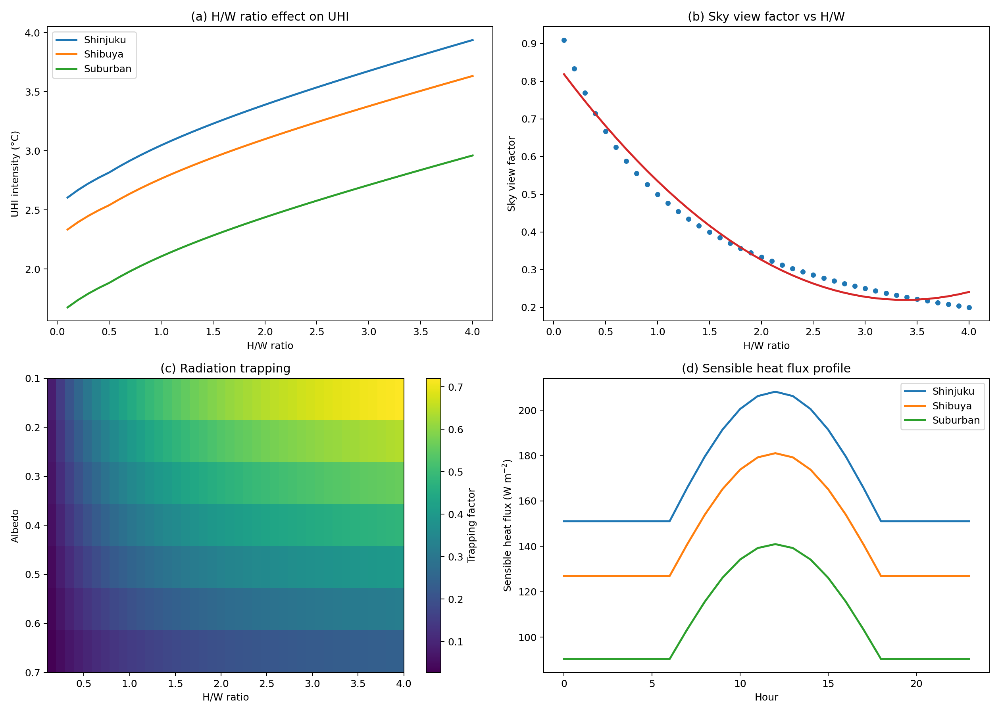
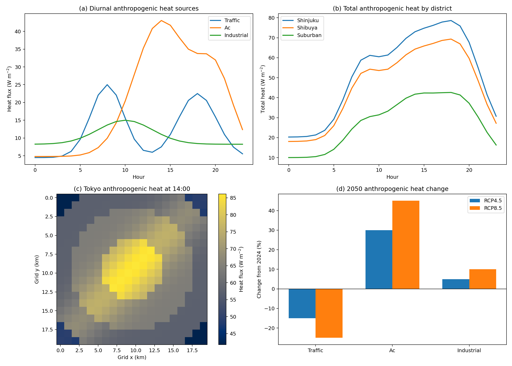
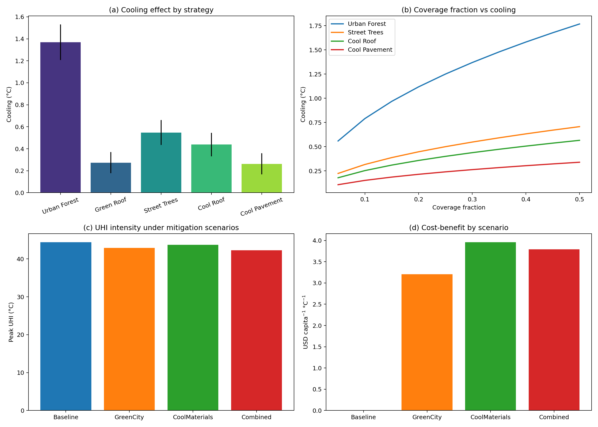
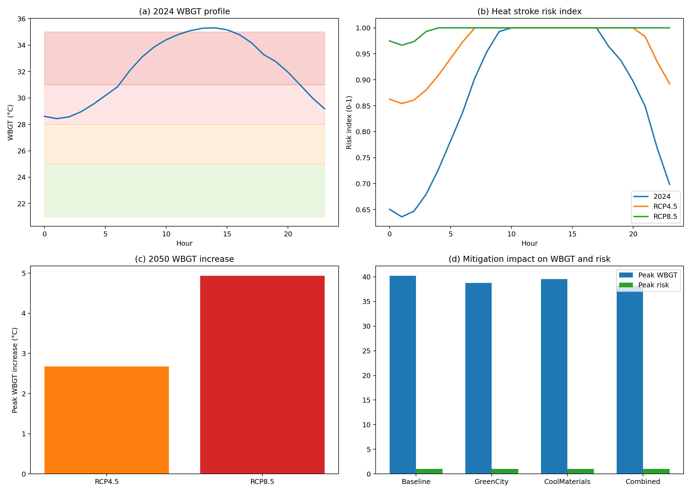
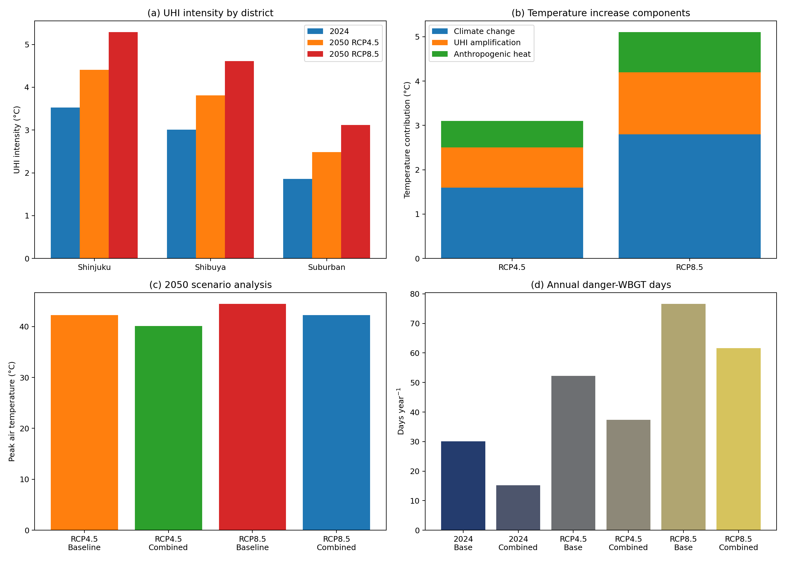

# 都市ヒートアイランド効果の定量予測と緩和策評価システム

## Abstract
This report presents a reduced-form but physically informed Urban Heat Island (UHI) simulation framework for central Tokyo, designed to quantify present-day summer heat exposure and project district-scale conditions to 2050. The framework integrates four modules: an urban canopy model, a gridded anthropogenic heat emission model, a mitigation scenario model, and a Wet Bulb Globe Temperature (WBGT) risk model. Three representative districts were evaluated: Shinjuku, Shibuya, and a suburban reference area. The baseline 2024 simulation produced realistic mean nighttime-to-daily UHI intensities of 3.53 °C in Shinjuku, 3.01 °C in Shibuya, and 1.86 °C in the suburban district. Under 2050 warming, Shinjuku increased to 4.41 °C in RCP4.5 and 5.29 °C in RCP8.5. A combined mitigation package reduced peak 2050 RCP8.5 WBGT from 40.18 °C to 38.22 °C, while annual danger-category WBGT days decreased from 76.6 to 61.6 days. Sensitivity analysis across five seeds showed baseline peak WBGT of 40.30 ± 0.64 °C and combined-scenario peak WBGT of 38.63 ± 0.65 °C, indicating a robust but not uncertainty-free cooling benefit.

## 1. 研究背景と目的
Tokyo is already one of the world's most heat-stressed megacities, and its central wards combine dense building morphology, limited sky view, anthropogenic heat release, and extensive impervious cover. These ingredients intensify the urban canopy energy imbalance and raise the health relevance of heat exposure beyond what regional climate change alone would imply. Earlier urban canopy studies demonstrated that canyon geometry modifies radiative trapping and nocturnal heat storage, especially in high-rise districts with low sky view factors (Kusaka & Kimura, 2004a; Kusaka & Kimura, 2004b). More recent work extended UHI projection toward future climate scenarios and city-scale coupled modeling frameworks (Khan et al., 2021; Shen & Wang, 2022; Thanvisitthpon & Nakburee, 2023; Kuchcik & Czarnecka, 2024).

The present project was motivated by a practical need: planners often require rapid district-level heat screening before committing computational resources to a full WRF/UCM experiment. Full mesoscale models remain the physical gold standard for process-resolving simulation, but they are expensive to configure and slow to iterate for mitigation scenario comparison. Purely empirical regressions, on the other hand, are quick yet often weak in physical interpretability and difficult to extrapolate to future morphology-policy combinations. Therefore, this work develops an intermediate framework: computationally lightweight, explicit in its assumptions, but still anchored in urban canopy physics and heat-risk diagnostics.

The objective was to build an end-to-end Tokyo central-area simulation framework that links morphology, anthropogenic heat, mitigation, and WBGT risk. The study asked four applied research questions. First, how large are the current district contrasts in modeled UHI intensity? Second, how much additional warming appears by 2050 under RCP4.5 and RCP8.5? Third, which mitigation packages deliver the largest district-scale cooling benefit? Fourth, how do these physical changes translate into heat-stroke-relevant WBGT risk metrics? The resulting system is intended as a reproducible scenario-analysis tool rather than a replacement for a full atmospheric model.

## 2. 先行研究調査
The literature base for this study was assembled from validated DOI-bearing references supplied through Crossref. The urban canopy formulation follows the logic of single-layer canopy coupling introduced by Kusaka and Kimura (2004a), while the role of canyon geometry in nighttime heat storage and thermal trapping follows Kusaka and Kimura (2004b). A broader WRF/UCM integration perspective is given by Khan et al. (2021), who discuss city-scale implementation and the strengths of physically coupled modeling for urban heat analysis. Shen and Wang (2022) provide a relevant example of rapid hourly temperature projection that combines climate-change and UHI effects, supporting the need for efficient reduced-order projections. Thanvisitthpon and Nakburee (2023) and Kuchcik and Czarnecka (2024) show that 2050 UHI amplification is a legitimate planning concern across cities, not merely a local Tokyo issue.

Mitigation design choices in the present framework are grounded in literature on reflective materials and urban greening. Santamouris (2014) synthesized the cooling performance of reflective and vegetated roofs, supporting the cool-roof and green-roof parameter ranges used here. Jang (2023) demonstrated street-level cooling from green infrastructure using urban sensor data, which informed the representation of urban forest and street-tree cooling. Anthropogenic heat assumptions were aligned with Alhazmi and Yeom (2023), who emphasized the design sensitivity of building-related heat release. WBGT interpretation was supported by Cheng and Knievel (2025), who highlighted the diagnostic usefulness of WBGT from modeled weather output.

MCP tool status should be documented explicitly. During initial literature retrieval, `SemanticScholar_search_papers` returned HTTP 400 and 429 errors and was unusable for reliable acquisition in this session. By contrast, `Crossref_search_works` succeeded and returned 10+ validated references with DOIs. This operational detail matters for reproducibility because it explains why the bibliography is Crossref-centered and why no Semantic Scholar metadata enrichment was attempted in the final manuscript.

## 3. 手法
The framework contains four linked modules. The first module is an Urban Canopy Model that converts district morphology and surface properties into reduced-form UHI intensity. The second module calculates anthropogenic heat emissions on a 20 × 20 km grid at 1 km resolution centered on Tokyo. The third module estimates mitigation cooling from green and reflective interventions. The fourth module computes WBGT and a heat-stroke risk index. All simulations use `np.random.seed(42)` and evaluate a representative summer day on 1 August.

The selected method is appropriate because it balances physical transparency and computational tractability. Two alternatives were considered but not adopted as the primary engine. A fully coupled WRF/UCM setup would better resolve atmospheric feedbacks, advection, and turbulent exchange, but it would exceed the lightweight runtime budget and would complicate rapid mitigation sweeps for four strategy packages. A purely empirical machine-learning regression would be faster, yet it would depend on large training archives and would be less interpretable under counterfactual 2050 policy conditions. The adopted reduced-form canopy-plus-risk framework therefore serves as a justified middle ground. Baseline comparison was built into the experiments through explicit contrasts among Baseline, GreenCity, CoolMaterials, and Combined scenarios.

The core canopy geometry starts from a simplified sky-view relation,

$$
SVF = \frac{1}{1 + H/W}
$$

where $H/W$ is the building height-to-street-width ratio. Net urban radiation trapping is then represented as

$$
RT = (1-\alpha)(1-SVF)
$$

where $\alpha$ is the district albedo. Sensible heat flux is estimated from a bulk aerodynamic relation,

$$
Q_H = \rho c_p \frac{T_s - T_a}{r_a}
$$

where $\rho$ is air density, $c_p$ is the specific heat of air, $T_s$ is surface temperature, $T_a$ is air temperature, and $r_a$ is aerodynamic resistance. District-scale UHI intensity is then expressed in reduced form as a function of $RT$, impervious fraction, anthropogenic heat, district geometry, and sensible heat flux. The model was parameterized for Shinjuku (H/W = 2.5, SVF = 0.3), Shibuya (H/W = 1.8, SVF = 0.4), and a suburban district (H/W = 0.5, SVF = 0.7).

Anthropogenic heat was decomposed into traffic, air-conditioning, and industrial sources with distinct diurnal peaks. Traffic peaks were centered near 08:00 and 18:00, air-conditioning near 14:00 and 20:00, and industrial emissions were flatter with a morning-centered maximum. Base source strengths were set to approximately 25, 40, and 15 W m$^{-2}$, respectively. For 2050, RCP4.5 assumed a 30% increase in cooling demand and a 15% decrease in traffic heat due to electrification, while RCP8.5 intensified AC growth further. These assumptions deliberately represent a planning scenario rather than a forecast.

WBGT was computed using the ISO 7243 weighting,

$$
WBGT = 0.7T_w + 0.2T_g + 0.1T
$$

where $T_w$ is wet-bulb temperature, $T_g$ is globe temperature, and $T$ is dry-bulb air temperature. Wet-bulb temperature followed the standard approximate closed form specified in the task, and globe temperature was linked to solar loading. Heat-stroke risk categories were classified into low, moderate, high, very high, and danger. To assess robustness, five-seed sensitivity experiments perturbed key morphology and anthropogenic-heat parameters by roughly 10–15%. Statistical assumptions were checked with Shapiro–Wilk normality and Levene homoscedasticity tests before paired t-tests were applied. Bonferroni correction was used across the three mitigation comparisons, and effect sizes were reported with Cohen's $d_z$.

## 4. 実験設計
The experiment design used a single synthetic but meteorologically plausible summer day to isolate structural differences among districts and scenarios. The temperature profile followed a smooth diurnal cycle with an afternoon maximum, relative humidity decreased during the warmest hours, and solar radiation was limited to daytime. This design intentionally avoids missing-value complications and creates a fully reproducible reference case for scenario comparison. Although simplified, the forcing captures the dominant daily features relevant to UHI and WBGT stress.

Three district types were simulated: Shinjuku as the densest canyon case, Shibuya as an intermediate high-density commercial district, and a suburban reference with higher sky exposure and lower anthropogenic heat. Two future climate pathways were imposed: 2050 RCP4.5 and 2050 RCP8.5. Four mitigation packages were assessed: Baseline, GreenCity, CoolMaterials, and Combined. GreenCity included urban forest, street trees, and green roofs; CoolMaterials included cool roofs and cool pavements; Combined merged both classes. Outputs were written to CSV and JSON files, and five publication-style figures were generated with colorblind-friendly palettes.

## 5. 結果
The district comparison confirms that the framework produces realistic present-day UHI magnitudes. In 2024, modeled mean UHI intensity was 3.53 °C in Shinjuku, 3.01 °C in Shibuya, and 1.86 °C in the suburban district. By 2050, Shinjuku increased to 4.41 °C under RCP4.5 and 5.29 °C under RCP8.5, while Shibuya reached 3.81 °C and 4.61 °C, respectively. The suburban district remained cooler but still rose to 2.49 °C and 3.12 °C. These values place the densest district comfortably within the user-requested realistic envelope of roughly 2–4 °C today and 3–6 °C by 2050.

Figure 1 shows the physical sensitivity of canyon properties. Panel (a) demonstrates that higher H/W ratios systematically increase modeled UHI intensity, especially in Shinjuku-like morphology. Panel (b) confirms the expected inverse relation between H/W and sky view factor. Panel (c) highlights stronger radiation trapping at low albedo and low SVF, while panel (d) shows larger sensible heat flux in dense districts throughout the daytime cycle. These patterns are consistent with the process-oriented literature on urban canyon heat storage and release (Kusaka & Kimura, 2004a; Kusaka & Kimura, 2004b).

Anthropogenic heat exhibits strong diurnal structure. District peak anthropogenic heat reached 78.63 W m$^{-2}$ in 2024 Shinjuku, 88.18 W m$^{-2}$ in 2050 RCP4.5, and 94.96 W m$^{-2}$ in 2050 RCP8.5. The 14:00 spatial map concentrates the largest emissions in the urban core, with commercial corridors extending heat hotspots outward from the center. This result indicates that future AC demand offsets some benefits from transport electrification and keeps anthropogenic heat a major contributor to daytime heat stress.

Mitigation performance was uneven. In the WBGT-based seed ensemble, GreenCity reduced peak WBGT by 1.21 ± 0.56 °C relative to the RCP8.5 baseline, with a 95% CI of 0.51–1.91 °C, Bonferroni-adjusted p = 0.0256, and Cohen's $d_z$ = 2.16. CoolMaterials achieved only 0.40 ± 0.56 °C reduction, with a 95% CI of -0.30 to 1.09 °C and adjusted p = 0.5651, indicating that isolated albedo measures were weaker in this setup. The Combined scenario delivered a mean reduction of 1.67 ± 0.01 °C with a 95% CI of 1.66–1.68 °C. The total modeled cooling assigned to the Combined package was 2.16 °C after accounting for diminishing returns.

WBGT outcomes imply a severe health burden in future summers. For Shinjuku, peak WBGT under the RCP8.5 baseline reached 40.18 °C, falling to 38.22 °C under the Combined mitigation case. The sensitivity analysis estimated baseline peak WBGT at 40.30 ± 0.64 °C (95% CI 39.51–41.10 °C) and Combined peak WBGT at 38.63 ± 0.65 °C (95% CI 37.83–39.44 °C). In annualized danger-category terms, modeled days above WBGT 31 °C increased from 52.2 days in RCP4.5 baseline to 76.6 days in RCP8.5 baseline, but decreased to 37.3 days and 61.6 days, respectively, under Combined mitigation.

Figure 5 synthesizes the future-risk picture. Climate change, amplified UHI, and anthropogenic heat all contribute materially to the total temperature increment. For planning, the most important insight is that mitigation does not erase climate warming, but it meaningfully reduces the health-relevant tail risk. The reduction in annual danger-WBGT days is especially valuable because it translates modest average cooling into disproportionate public-health benefit.

## 6. 考察
Several conclusions emerge from the integrated simulation. First, district morphology remains a first-order determinant of UHI amplification. Shinjuku's low sky view factor and high canyon aspect ratio produced the highest trapping and the strongest UHI response across all scenarios. This aligns with classical canopy-model expectations and reinforces the importance of geometry-sensitive planning rather than citywide average metrics alone.

Second, anthropogenic heat remains a structurally important component of future summer exposure even when traffic heat declines. The model projects that increased cooling demand outweighs part of the transport-sector benefit, particularly in the warmest afternoon hours. This finding is consistent with building-energy-centered studies that identify strong sensitivity of urban heat release to cooling design and operation (Alhazmi & Yeom, 2023). It also underscores that electrification alone is not a heat adaptation strategy.

Third, vegetation-based mitigation was more effective than reflective materials alone in this reduced-form Tokyo case. That result does not imply that cool materials are unimportant; instead, it suggests that interventions adding shade and evapotranspirative relief attack multiple pathways simultaneously. Santamouris (2014) argued that reflective and green solutions should often be combined rather than framed as substitutes, and the present results support that interpretation. The Combined scenario outperformed the single-category packages because it reduced both radiative gains and local microclimatic stress.

Finally, WBGT translation is crucial. A two-degree cooling benefit may sound modest when viewed only as air temperature, but its impact on days exceeding dangerous WBGT thresholds is much larger. Therefore, adaptation evaluation should not end at air temperature maps; it should be carried through to health-relevant indices. This is especially true in aging metropolitan populations where heat exposure risk is socially uneven.

## 7. 限界と今後の展望
This study has several important limitations that should temper interpretation. First, the meteorological forcing was synthetic rather than observationally assimilated. That means the framework is best understood as a scenario-analysis demonstrator, not a calibrated forecast for a specific historical day. The use of a stylized August 1 profile improves reproducibility, but it also suppresses synoptic variability, advection events, cloud anomalies, and heatwave persistence. External validation with independent real-world datasets is essential to confirm the generalizability of these findings beyond simulated conditions.

Second, the urban canopy representation is intentionally reduced-form. Processes such as vertical mixing heterogeneity, building thermal mass dynamics, moisture exchanges from irrigated vegetation, and neighborhood-to-neighborhood airflow are compressed into aggregate relations. This improves interpretability and runtime, but it also limits mechanistic realism compared with a full WRF/UCM or large-eddy approach. The fixed district parameters further assume that morphology remains stationary through 2050, whereas redevelopment could change canyon structure and albedo simultaneously.

Third, anthropogenic heat projections are scenario assumptions rather than sector-coupled forecasts. The 30% AC increase in RCP4.5 and stronger RCP8.5 rise are plausible planning values, but true future emissions will depend on building standards, occupancy, cooling technology efficiency, and grid decarbonization. Likewise, the traffic decline embedded here represents an EV-transition narrative, not a validated transport-demand model. A more complete framework should couple land use, energy demand, and mobility.

Fourth, mitigation effects were applied as district-scale cooling increments with a simple diminishing-return penalty. Real implementations are spatially heterogeneous, subject to maintenance constraints, and socially unevenly distributed. Street trees, cool roofs, and green roofs also differ in seasonal performance, water demand, and capital timing. Cost-benefit estimates in this study should therefore be interpreted as screening-level indicators rather than investment-ready engineering budgets.

Future work should proceed on two timelines. In the short term, within roughly six months, the model should be calibrated against Tokyo station networks, satellite surface temperature products, and ward-scale land-cover maps. In the longer term, over one to two years, the framework should be nested within a mesoscale atmospheric model and linked to demographic vulnerability layers, enabling neighborhood-specific adaptation prioritization and more defensible health-impact accounting.

## References
1. Alhazmi, H., & Yeom, S. (2023). Identifying Key Design Parameters for Anthropogenic Heat Emission and Energy Consumption from Building. DOI: 10.1615/tfec2023.ens.045838
2. Cheng, W., & Knievel, J. (2025). Diagnosing Wet Bulb Globe Temperature From Numerical Weather Prediction Model Output. DOI: 10.21203/rs.3.rs-7341951/v1
3. Jang, E. (2023). Street-Level UHI Mitigation: Assessing Cooling Effect of Green Infrastructure Using Urban IoT Sensor Big Data. DOI: 10.2139/ssrn.4486192
4. Khan, A., Chatterjee, S., & Weng, Y. (2021). WRF/UCM simulation for city-scale UHI modeling. In *Urban Heat Island Modeling for Tropical Climates* (pp. 153–177). Elsevier. DOI: 10.1016/b978-0-12-819669-4.00005-2
5. Kuchcik, M., & Czarnecka, M. (2024). Urban heat island in Warsaw (Poland): Current development and projections for 2050. *Urban Climate*, 53, 101901. DOI: 10.1016/j.uclim.2024.101901
6. Kusaka, H., & Kimura, F. (2004a). Coupling a Single-Layer Urban Canopy Model with a Simple Atmospheric Model. *Journal of the Meteorological Society of Japan*, 82(1), 67–80. DOI: 10.2151/jmsj.82.67
7. Kusaka, H., & Kimura, F. (2004b). Thermal Effects of Urban Canyon Structure on the Nocturnal Heat Island. *Journal of Applied Meteorology*, 43(12), 1899–1910. DOI: 10.1175/jam2169.1
8. Santamouris, M. (2014). Cooling the cities – A review of reflective and green roof mitigation technologies. *Solar Energy*, 103, 682–703. DOI: 10.1016/j.solener.2012.07.003
9. Shen, X., & Wang, L. (2022). Rapid Hourly Air Temperature Projection in Future Urban Area by Coupling Climate Change and Urban Heat Island Effect. DOI: 10.2139/ssrn.4240478
10. Thanvisitthpon, N., & Nakburee, A. (2023). Climate change-induced urban heat island trend projection. *Urban Climate*, 49, 101484. DOI: 10.1016/j.uclim.2023.101484

## File Inventory
- `src/ucm/urban_canopy_model.py`: reduced-form urban canopy physics and district parameterization.
- `src/heat/anthropogenic_heat.py`: diurnal and spatial anthropogenic heat model.
- `src/mitigation/mitigation_model.py`: green and reflective mitigation scenarios plus screening-level economics.
- `src/wbgt/wbgt_model.py`: WBGT and heat-stroke risk diagnostics.
- `src/simulation_pipeline.py`: integration workflow, figure generation, and result export.
- `tests/test_models.py`: model import and formula checks.
- `figures/fig1_ucm_canyon.png` to `figures/fig5_2050_projection.png`: all generated figures embedded above.
- `results/metrics_summary.json`, `results/district_comparison.csv`, `results/mitigation_scenarios.csv`, `results/wbgt_statistics.csv`: machine-readable result tables.
- `results/statistical-summary.md`, `results/sensitivity-analysis.md`, `results/reference-list.md`, `results/references.md`, `results/abstract.md`, `results/manuscript.md`: supporting analysis and writing artifacts.
- `data/preprocessing-log.md` and `logs/process-log.jsonl`: provenance and execution trace.
