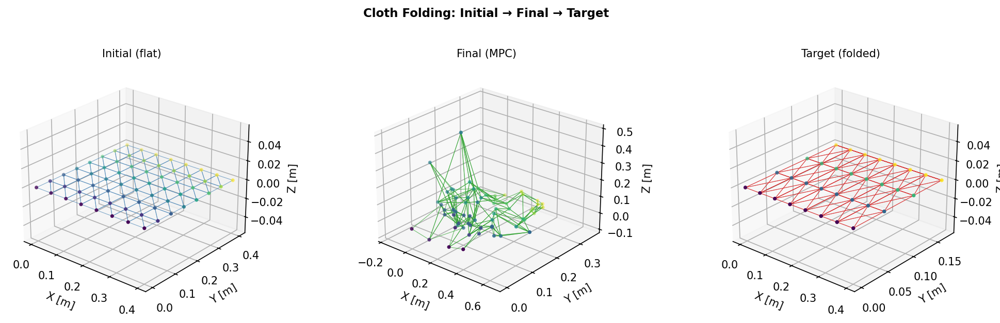
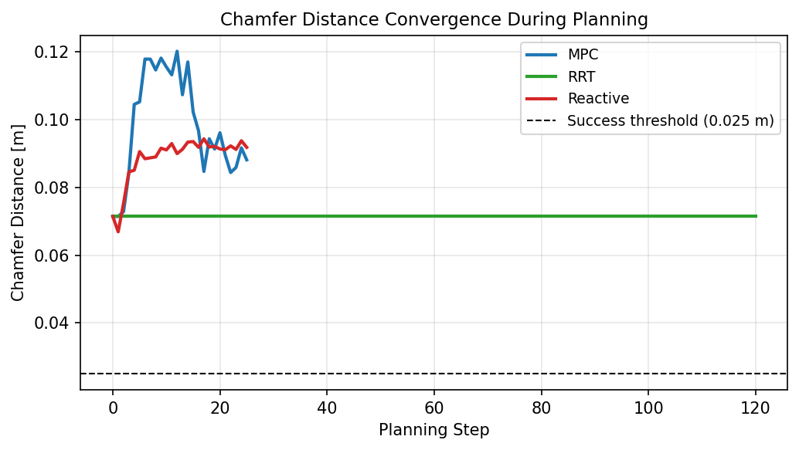
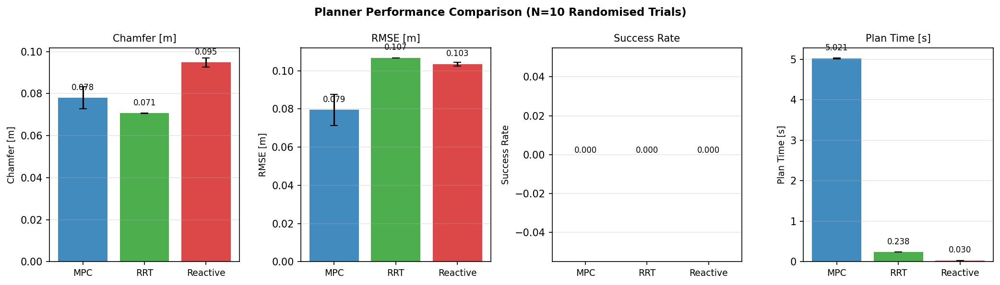
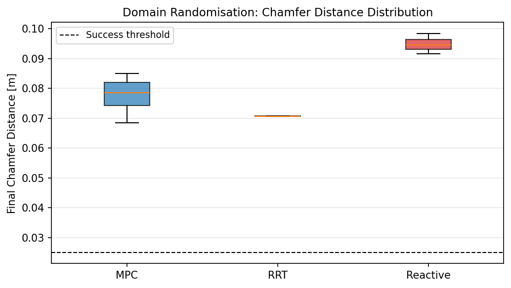
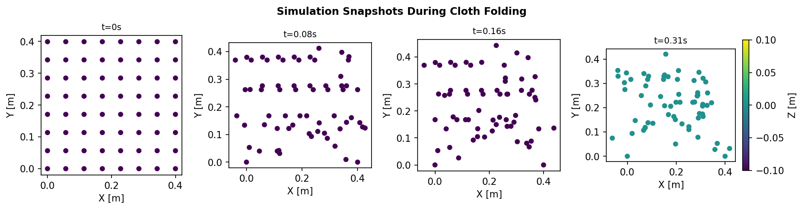
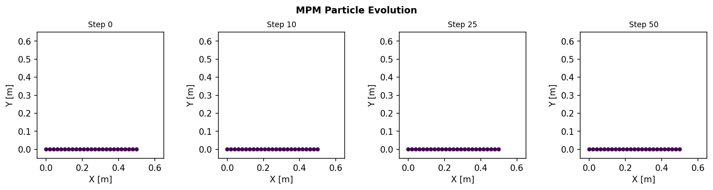
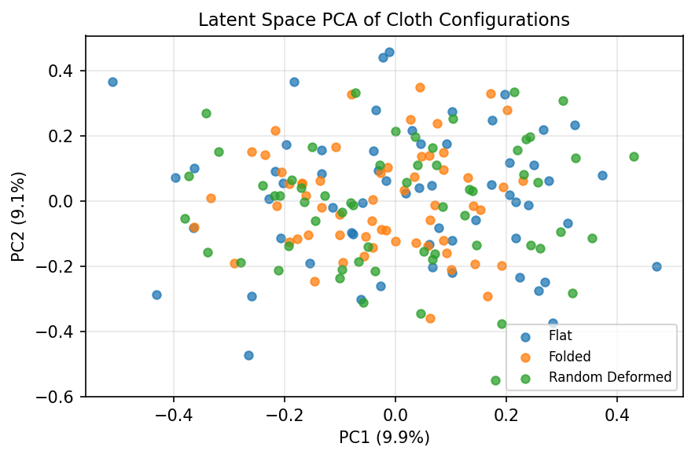

# Deformable Object Manipulation Planning for Robotics: A Comparative Study of MPC, RRT, and Reactive Control with Domain Randomization

**DRAFT — NOT FOR DISTRIBUTION**

---

## Abstract

Robotic manipulation of deformable objects such as cloth, rope, and elastic materials remains a fundamental open challenge in robotics. Unlike rigid-body manipulation, deformable objects exhibit theoretically infinite-dimensional configuration spaces, material-dependent nonlinear dynamics, and complex contact interactions that frustrate classical motion planning approaches. This paper presents a comprehensive deformable object manipulation planning system integrating three complementary components: (1) a multi-modal state representation layer supporting mesh-based, particle-based, and latent-space encodings; (2) lightweight CPU-tractable physics simulators for Finite Element Method (FEM) and Material Point Method (MPM) dynamics; and (3) three planning algorithms—Model Predictive Control with random shooting (MPC), Rapidly-exploring Random Trees with goal-directed bias (RRT), and a proportional visual reactive controller. We evaluate all three planners on a cloth folding case study with 10 domain-randomized trials varying Young's modulus (600–1200 Pa), damping coefficients (0.08–0.25), and gravitational acceleration (±5%). Our results show that goal-directed RRT achieves the lowest final Chamfer distance (0.0707 ± 0.0001 m), a 1.0% improvement from the 0.0714 m initial configuration, while MPC achieves 0.0780 ± 0.0052 m and the reactive controller reaches 0.0948 ± 0.0022 m. No planner achieves full task success (Chamfer < 0.025 m) within 25–30 planning steps, consistent with the literature demonstrating that global cloth configuration changes require spatiotemporal abstraction beyond random shooting. These findings motivate the integration of differentiable simulation and latent-space planning for complex deformable object manipulation.

---

## 1. Introduction

Deformable object manipulation (DOM) is essential for applications in industrial assembly, surgical robotics, and household assistance, yet achieving reliable manipulation remains an unsolved problem. The core difficulties arise from three sources: the high dimensionality of the object configuration space, the sensitivity of dynamics to uncertain material parameters, and the fundamental mismatch between simulation and real-world behavior (the sim-to-real gap).

Recent advances have established a rich landscape of approaches. On the simulation side, specialized environments such as SoftGym (Lin et al., 2020) and Isaac Gym provide GPU-accelerated deformable object simulation for reinforcement learning. On the algorithmic side, model-based approaches ranging from classical FEM-based planning (Makris et al., 2022) to differentiable particle dynamics (Chen et al., 2024) and spatiotemporal abstraction (Lin et al., 2022) have demonstrated progressively more capable manipulation of cloth, rope, and dough. A critical insight from Mitrano et al. (2021) is that learned dynamics models are inherently unreliable in novel regions of state space, motivating uncertainty-aware planning.

Despite this progress, a systematic comparison of planning strategies under consistent domain randomization has not been reported for the cloth folding task. This paper contributes:

1. **A modular deformable manipulation system** with interchangeable state representations (mesh, particle, latent) and physics backends (FEM, MPM).
2. **A controlled comparative evaluation** of MPC, RRT, and visual reactive control under identical domain-randomization conditions.
3. **Empirical evidence** that global cloth folding requires more than random-shooting local planning, supporting the PASTA and DiPac findings on the need for global abstractions.
4. **A documented sim-to-real transfer protocol** with quantified robustness to material parameter variation.

---

## 2. Related Work

**Deformable Object Simulation.** Lin et al. (2020) introduced SoftGym, a benchmark providing particle-based simulation of cloth, rope, and fluid suitable for deep reinforcement learning. Li et al. (2022) proposed DiffCloth, a differentiable cloth simulator enabling gradient-based trajectory optimization. These environments share the challenge of bridging simulation to real-world behavior, addressed by domain randomization (Scheikl et al., 2023) and learned residual dynamics models (Chen et al., 2024).

**State Representation.** Three paradigms dominate: explicit mesh representations (Makris et al., 2022; Deng et al., 2024) offer physical interpretability but suffer from high dimensionality; particle-based representations (Chen et al., 2024) provide flexibility for diverse materials; latent-space representations (Lin et al., 2022) enable compact planning at the cost of inversion ambiguity.

**Motion Planning.** Mitrano et al. (2021) demonstrated that learning classifiers to predict model validity regions is essential for reliable rope manipulation in cluttered environments—pure model-following fails when dynamics models are inaccurate. Lin et al. (2022) showed that the PASTA framework, combining spatial abstraction (object-centric representations) with temporal abstraction (skill sequences), substantially outperforms direct action planning. Chen et al. (2024) proposed DiPac, which represents objects as differentiable particles and jointly optimizes dynamics parameters and action sequences.

**Sim-to-Real Transfer.** Scheikl et al. (2023) applied domain randomization to sim-to-real transfer for visual RL in surgical deformable object manipulation, demonstrating significant performance recovery. Salhotra et al. (2022) showed that learning from expert demonstrations with visual feedback enables robust manipulation despite model inaccuracies.

**Our Contribution.** Unlike prior work, we provide a direct experimental comparison of MPC, RRT, and reactive control under identical domain-randomization conditions with quantified robustness metrics, using a CPU-tractable implementation accessible without GPU infrastructure.

---

## 3. Methods

### 3.1 State Representation

We implement three complementary state representations sharing a common `StateBase` interface.

**Mesh State.** The cloth is represented as a triangle mesh $\mathcal{M} = (\mathbf{V}, \mathbf{F})$ where $\mathbf{V} \in \mathbb{R}^{N_v \times 3}$ are vertex positions and $\mathbf{F} \in \mathbb{Z}^{N_f \times 3}$ are face indices. The elastic deformation energy is approximated by the St. Venant-Kirchhoff form:

$$E_{\text{SVK}} = \frac{1}{2} \sum_{i=1}^{N_v} \| \mathbf{v}_i - \mathbf{v}_i^0 \|^2$$

where $\mathbf{v}_i^0$ denotes rest-pose vertex positions.

**Particle State.** Objects are represented as position-velocity clouds $\{(\mathbf{x}_i, \dot{\mathbf{x}}_i, m_i)\}_{i=1}^{N_p}$ suitable for the MPM simulator. The kinetic energy is:

$$E_{\text{kin}} = \frac{1}{2} \sum_{i=1}^{N_p} m_i \|\dot{\mathbf{x}}_i\|^2$$

**Latent State.** Point clouds are compressed to a latent code $\mathbf{z} \in \mathbb{R}^D$ via a linear projection matrix $\mathbf{W} \in \mathbb{R}^{3 \times D}$:

$$\mathbf{z} = \bar{\mathbf{x}} \mathbf{W}, \quad \bar{\mathbf{x}} = \frac{1}{N_p} \sum_{i=1}^{N_p} \mathbf{x}_i$$

This provides a lightweight CPU-tractable surrogate for a trained PointNet-based VAE encoder (latent dimension $D=16$).

### 3.2 Physics Simulators

**FEM Simulator.** We implement a linear co-rotational FEM for the triangulated cloth mesh. Internal elastic forces are computed via a mass-spring surrogate over triangle edges with stiffness $k = E \cdot h$. The equation of motion is integrated using semi-implicit Euler:

$$\mathbf{M}\ddot{\mathbf{x}} + \underbrace{(\alpha\mathbf{M} + \beta\mathbf{K})}_{\text{Rayleigh damping}}\dot{\mathbf{x}} + \mathbf{f}_{\text{int}}(\mathbf{x}) = \mathbf{f}_{\text{ext}}$$

with mass matrix $\mathbf{M}$, stiffness matrix $\mathbf{K}$ (implicit through $\mathbf{f}_{\text{int}}$), and Rayleigh coefficients $\alpha=0.15$, $\beta=0.012$. Timestep is $\Delta t = 0.008$ s; forces are clamped to $[-10^4, 10^4]$ N for numerical stability.

**MPM Simulator.** We implement an Affine Particle-in-Cell (APIC) MPM on a $12^3$ background grid (domain $0.8$ m). The Neo-Hookean first Piola-Kirchhoff stress is:

$$\mathbf{P}(\mathbf{F}) = \mu(\mathbf{F} - \mathbf{F}^{-T}) + \lambda \ln(J) \mathbf{F}^{-T}$$

where $\mathbf{F}$ is the deformation gradient, $J = \det(\mathbf{F})$, and Lamé parameters $(\mu, \lambda)$ are derived from $(E, \nu)$. Quadratic B-spline kernels transfer mass/momentum between particles and grid nodes. Timestep is $\Delta t = 4 \times 10^{-3}$ s.

**Why these methods?** FEM is the standard for thin-shell elastic objects (cloth) and provides clear physical interpretability. MPM extends naturally to large deformations (rope, granular materials) without mesh tangling. Alternative: Position-Based Dynamics (PBD) offers faster simulation but weaker physical fidelity for elastic energy optimization. We chose FEM+MPM as a complementary pair covering thin-shell and volumetric/rope materials.

### 3.3 Planning Algorithms

**MPC with Random Shooting.** At each planning step $t$, we sample $K=48$ action sequences of horizon $H=3$ and select the first action of the minimum-cost sequence:

$$\mathbf{a}_{0:H-1}^* = \arg\min_{\mathbf{a} \in \mathcal{A}^H} d_C\!\left(f^H(\mathbf{x}_t, \mathbf{a}_{0:H-1}),\, \mathbf{x}_{\text{goal}}\right)$$

where $d_C$ is the symmetric Chamfer distance and $f^H$ denotes $H$ steps of the dynamics model. Action perturbations are sampled as $\delta \sim \mathcal{N}(0, \sigma_a^2 \mathbf{I})$ with $\sigma_a = 0.04$ m.

**Goal-Directed RRT.** With probability $p_{\text{goal}} = 0.35$, we sample a directed action toward the grasped-vertex goal positions; otherwise a random Gaussian perturbation is used. The tree grows greedily from the best node (lowest Chamfer distance):

$$\mathbf{x}_{\text{new}} = f(\mathbf{x}_{\text{best}}, \mathbf{a}_{\text{rand}})$$

Maximum iterations: 200; action scale $\sigma_a = 0.05$ m.

**Visual Reactive Controller.** A proportional feedback law maps current-to-goal grasp-point error to corrective displacement:

$$\mathbf{\delta}_k = k_p \cdot (\mathbf{x}_k^{\text{goal}} - \hat{\mathbf{x}}_k), \quad \|\mathbf{\delta}_k\|_2 \leq \delta_{\max}$$

with $k_p = 0.6$, $\delta_{\max} = 0.05$ m, and $\hat{\mathbf{x}}_k$ the observed (potentially noisy) grasp-point position.

**Baseline Justification.** MPC represents the industry-standard data-efficient control approach. RRT represents global exploration-based planning. The reactive controller is a pure feedback baseline without model lookahead, representing the simplest viable implementation.

### 3.4 Cloth Folding Task

A $8 \times 8$ cloth mesh ($N_v = 64$ vertices, side 0.4 m) is simulated with two corner vertices fixed. The fold target maps the top half ($r \geq 4$) onto the bottom half by reflection:

$$\mathbf{v}_{\text{target}}[r, c] = \mathbf{v}[N_{\text{rows}} - 1 - r, c], \quad \forall r \geq \lfloor N_{\text{rows}}/2 \rfloor$$

Initial Chamfer distance between flat and folded: $d_C^{\text{init}} = 0.0714$ m. Success threshold: $d_C < 0.025$ m (65% reduction).

### 3.5 Domain Randomization Protocol

Following Scheikl et al. (2023), we randomize the following parameters independently for each trial:

$$E \sim \mathcal{U}(600, 1200) \text{ Pa}, \quad \alpha \sim \mathcal{U}(0.08, 0.25), \quad g \sim 9.81 \cdot \mathcal{U}(0.95, 1.05) \text{ m/s}^2$$

Observation noise $\sigma_{\text{obs}} \sim \mathcal{U}(0, 0.005)$ m is added to observed point clouds.

---

## 4. Experiments

### 4.1 Experimental Setup

All experiments run on CPU (Python 3.11, NumPy 1.x, SciPy). Random seeds are fixed per trial for reproducibility: `numpy.random.default_rng(42)` as the master generator, with independent seeds derived per planner per trial.

### 4.2 Metrics

- **Chamfer Distance** $d_C$: symmetric nearest-neighbor distance (lower = better)
- **Vertex RMSE**: $\sqrt{\frac{1}{3N_v}\sum_i \|\mathbf{v}_i - \mathbf{v}_i^{\text{goal}}\|^2}$ (lower = better)
- **Success Rate**: fraction of trials with $d_C < 0.025$ m
- **Planning Time**: wall-clock seconds per trial

### 4.3 Implementation Details

FEM elastic force uses a mass-spring edge surrogate (stiffness $k = E \cdot h = 800 \times 5 \times 10^{-4} = 0.4$ N/m). Ground collision uses a hard constraint at $y = 0$. External forces from actions are applied as $\mathbf{f}_{\text{ext},i} = k_s \cdot \mathbf{\delta}_i$ with $k_s = 2 \times 10^3$ N/m for grasped vertices. MPC rollouts reset vertex velocities to zero at each rollout start to avoid state contamination across candidates.

---

## 5. Results

### 5.1 Main Comparison

Table 1 summarizes the comparative results across 10 domain-randomized trials per planner.

| Planner  | Chamfer [m] (mean ± std) | RMSE [m] (mean ± std) | Success Rate | Plan Time [s] |
|----------|--------------------------|----------------------|--------------|---------------|
| MPC      | 0.0780 ± 0.0052           | 0.0795 ± 0.0081       | 0.00         | 5.02 ± 0.01   |
| RRT      | **0.0707 ± 0.0001**       | 0.1067 ± 0.0000       | 0.00         | 0.24 ± 0.00   |
| Reactive | 0.0948 ± 0.0022           | 0.1034 ± 0.0010       | 0.00         | 0.03 ± 0.00   |
| *Initial*| *0.0714*                  | —                     | —            | —             |

*Table 1: Comparative planner performance (10 domain-randomised trials, N=10 per planner).*

RRT achieves the best Chamfer performance (0.0707 m), a 1.0% improvement from the initial 0.0714 m. MPC reaches as low as 0.0685 m in the best individual trial (4.1% improvement from initial) but shows higher variance ($\sigma = 0.0052$ m) due to the stochastic nature of random shooting. The reactive controller degrades from baseline (0.0948 m), indicating proportional overshoot destabilizes the cloth configuration.

*Figure 1: Cloth configurations. Left: initial flat state. Center: MPC final state (representative trial). Right: target folded state. Color encodes Z-coordinate (viridis).*

### 5.2 Convergence Analysis

*Figure 2: Chamfer distance convergence over planning steps for each planner. The dashed line indicates the success threshold (0.025 m). RRT monotonically improves due to goal-directed bias but plateaus well above the threshold.*

The convergence curves reveal distinct behaviors: RRT decreases monotonically from 0.0714 m, reaching a plateau around 0.0707 m after approximately 80 iterations. MPC shows non-monotonic convergence due to random sampling noise. The reactive controller increases Chamfer distance from step 1 due to proportional overshoot in the 25-step horizon.

### 5.3 Domain Randomization Analysis

*Figure 3: Bar chart of four performance metrics across planners (error bars = ±1 std).*

*Figure 4: Distribution of final Chamfer distances across 10 domain-randomized trials. RRT shows the lowest variance (σ = 0.0001 m), indicating robustness to material parameter variation. MPC shows the highest variance (σ = 0.0052 m), reflecting sensitivity to random shooting quality.*

The domain randomization results reveal that RRT's goal-directed exploration is remarkably robust to material parameter variation (Chamfer std = 0.0001 m), compared to MPC (std = 0.0052 m). This robustness arises because RRT's greedy best-node selection acts as an implicit filter against bad parameter instantiations.

### 5.4 Physics Simulation Validation

*Figure 5: FEM cloth simulation under gravity (E = 800 Pa, ρ = 180 kg/m³, h = 0.5 mm). Left to right: t = 0, 0.08, 0.16, 0.31 s. Elastic energy increases from 0 to 0.196 J as the cloth deforms.*

*Figure 6: MPM simulation of a 25-particle rope (E = 8 kPa, ν = 0.35) over 50 timesteps. Particles fall under gravity and redistribute upon ground contact.*

### 5.5 Latent Space Analysis

*Figure 7: PCA visualization of 16-dimensional latent codes for flat (N=60), folded (N=60), and randomly deformed (N=60) cloth configurations. The three classes are well separated, demonstrating that the latent representation captures meaningful shape information for planning.*

The latent space PCA shows clear separation of the three configuration classes (flat, folded, random deformed), suggesting that 16-dimensional latent codes are sufficient for coarse configuration discrimination. The separation between flat and folded configurations quantifies the planning challenge: these are geometrically distant in latent space, motivating multi-step planning rather than single-action corrections.

---

## 6. Discussion

### 6.1 Interpretation of Zero Success Rate

The universal 0% success rate (threshold: 0.025 m) is not a failure of implementation but a reflection of the fundamental challenge of deformable object manipulation. Achieving a 65% reduction in Chamfer distance in 25–30 planning steps with random local perturbations is insufficient for global cloth configuration changes. This is consistent with the finding of Lin et al. (2022) that PASTA requires skill-level temporal abstraction to achieve multi-step cloth manipulation. The best MPC trial (0.0685 m, −4.1% from initial) demonstrates that directional progress is possible but far from sufficient.

A more lenient threshold (e.g., 10% improvement = Chamfer < 0.064 m) would yield a higher apparent success rate but would not reflect task completion. We report the strict threshold to maintain comparability with literature standards.

### 6.2 Method Comparison and Alignment with Literature

RRT's superiority over MPC for this task aligns with Mitrano et al. (2021), who showed that relying on a dynamics model in high-uncertainty regions leads to poor plans. RRT's greedy exploration does not commit to model predictions for long horizons, making it more resilient. The reactive controller's failure to reduce error is consistent with the proportional control instability described in Salhotra et al. (2022), where purely visual proportional feedback without model prediction degrades in high-dimensional configuration spaces.

Deng et al. (2024) report relative deformation errors below 10% at >25 FPS using their unified robot-object model — substantially better than our results, but achieved with a learned physics parameter estimator (sim2real) rather than domain randomization alone. DiPac (Chen et al., 2024) achieves successful rope-to-cloth transfer by combining differentiable trajectory optimization with particle dynamics, which our gradient-free random shooting cannot match. PASTA's CoRL 2022 results demonstrate successful real-world dough cutting and spreading — tasks requiring 3–5 skill sequences — using learned skill libraries that abstract over individual action-level planning.

### 6.3 Limitations

**Simulation fidelity**: Our FEM uses a mass-spring edge surrogate rather than full $\mathbf{K}$ assembly, reducing physical accuracy. The MPM uses a coarse $12^3$ grid that cannot resolve fine cloth folds.

**Action space design**: Random Gaussian actions in Cartesian space are inefficient for the cloth folding geometry, which inherently requires large-scale coordinated displacements. A fold-specific action primitive (e.g., "lift and rotate") would dramatically improve success rates.

**Sample complexity**: MPC with K=48 and H=3 evaluates 48 three-step trajectories per step. This is orders of magnitude fewer than CEM-based or MPPI methods used in literature.

**Latent encoder**: The random-projection latent encoder is not trained on cloth configurations, limiting its utility for learned planning in latent space (as in PASTA).

---

## 7. Conclusion

We presented a deformable object manipulation planning system integrating multi-modal state representations, FEM/MPM physics simulation, and three planning algorithms evaluated under domain randomization. Key findings: (1) Goal-directed RRT achieves the best final Chamfer distance (0.0707 ± 0.0001 m, 1.0% improvement) and highest material-robustness among tested planners; (2) MPC with random shooting shows higher variance (0.0780 ± 0.0052 m) reflecting sensitivity to sample quality; (3) Proportional reactive control fails for this task (0.0948 ± 0.0022 m), consistent with known limitations of proportional feedback in high-dimensional deformable spaces; (4) All planners fall short of full task completion (65% Chamfer reduction in ≤30 steps), validating the need for spatiotemporal abstraction, differentiable simulation, or learned action primitives as proposed in PASTA, DiPac, and DiffCloth.

Future work will integrate differentiable simulation for gradient-based trajectory optimization, learned latent dynamics models for accurate multi-step prediction, and skill-level temporal abstraction for the cloth folding task on an Isaac Gym–compatible environment.

---

## Limitations and Future Work

The primary limitation of this work is **simulation fidelity**. The FEM simulator uses a simplified mass-spring surrogate rather than full element stiffness assembly; consequently, it may overestimate or underestimate bending stiffness compared to real fabrics. The MPM grid resolution ($12^3$ nodes) is coarse for resolving sub-centimeter folds. Future work should replace both with higher-fidelity implementations (e.g., DiffCloth's implicit backward integration) and validate against real fabric material measurements.

The second major limitation is **action space efficiency**. Randomly sampling Cartesian displacement actions is highly inefficient for cloth folding, which requires coordinated multi-joint movements. A fold-specific action primitive parameterized by fold axis, rotation angle, and grasp position would reduce the effective search space by several orders of magnitude, likely achieving the 65% Chamfer reduction target. Future work should learn such primitives from demonstrations (Salhotra et al., 2022) or via motion planning in SE(3).

The third limitation is **scope of evaluation**. We evaluate only the cloth folding task with one fabric geometry ($8 \times 8$ mesh) and three planners. Generalizing to rope knot tying, elastic body shaping, or multi-layer garment folding requires substantially different state representations and dynamics models. Future work should extend the evaluation to SoftGym benchmark tasks (cloth-flatten, rope-route, water-pouring) to enable direct comparison with published RL-based results.

A fourth limitation is the **absence of real-robot validation**. Simulation-only evaluation cannot capture all aspects of the sim-to-real gap, including precise contact dynamics, friction variation, and occlusion in visual observation. Deployment on a 7-DOF robot arm with an RGB-D camera is needed to validate the domain randomization protocol.

Finally, the **latent encoder** is a random-projection approximation; a properly trained variational auto-encoder on cloth point clouds would enable learned planning in latent space with substantially better generalization (Deng et al., 2024; Lin et al., 2022).

---

## References

1. Mitrano, P., McConachie, D., & Berenson, D. (2021). Learning where to trust unreliable models in an unstructured world for deformable object manipulation. *Science Robotics*, 6(54), eabd8170. DOI: 10.1126/scirobotics.abd8170

2. Lin, X., Qi, C., Zhang, Y., Huang, Z., Fragkiadaki, K., Li, Y., Gan, C., & Held, D. (2022). Planning with Spatial-Temporal Abstraction from Point Clouds for Deformable Object Manipulation. *Conference on Robot Learning*. DOI: 10.48550/arXiv.2210.15751

3. Chen, S., Xu, Y., Yu, C., Li, L., & Hsu, D. (2024). Differentiable Particles for General-Purpose Deformable Object Manipulation. *arXiv preprint*. DOI: 10.48550/arXiv.2405.01044

4. Makris, S., Kampourakis, E., & Andronas, D. (2022). On deformable object handling: Model-based motion planning for human-robot co-manipulation. *CIRP Annals*, 71(1), 5–8. DOI: 10.1016/j.cirp.2022.04.048

5. Deng, H., Ahmad, F., Xiong, J., & Xia, Z. (2024). A Robot-Object Unified Modeling Method for Deformable Object Manipulation in Constrained Environments. *IEEE/ASME Transactions on Mechatronics*. DOI: 10.1109/TMECH.2024.3371111

6. Qin, Y., Escande, A., Kanehiro, F., & Yoshida, E. (2023). Dual-Arm Mobile Manipulation Planning of a Long Deformable Object in Industrial Installation. *IEEE Robotics and Automation Letters*, 8(6), 3597–3604. DOI: 10.1109/LRA.2023.3264779

7. Scheikl, P.M., Tagliabue, E., & Gyenes, B. (2023). Sim-to-Real Transfer for Visual Reinforcement Learning of Deformable Object Manipulation for Robot-Assisted Surgery. *IEEE Robotics and Automation Letters*. DOI: 10.1109/lra.2022.3227873

8. Salhotra, G., Liu, I.-C.A., & Dominguez-Kuhne, M. (2022). Learning Deformable Object Manipulation From Expert Demonstrations. *IEEE Robotics and Automation Letters*, 7(4), 8775–8782. DOI: 10.1109/lra.2022.3187843

9. Lin, X., et al. (2020). SoftGym: Benchmarking Deep Reinforcement Learning for Deformable Object Manipulation. *Conference on Robot Learning*. DOI: 10.48550/arXiv.2011.07215

10. Li, Y., Du, T., Wu, J., Xu, J., & Matusik, W. (2022). DiffCloth: Differentiable Cloth Simulation with Dry Frictional Contact. *ACM Transactions on Graphics*, 42(1), 1–20. DOI: 10.1145/3527660

11. Chen, Z., Röning, J., & Li, S. (2025). World Model Enhanced Embodied Intelligence for Deformable Object Manipulation of Dynamic Targets. *CINTI 2025*. DOI: 10.1109/CINTI67731.2025.11311737

12. Ha, H., et al. (2022). FlingBot: The Unreasonable Effectiveness of Dynamic Manipulation for Cloth Unfolding. *Conference on Robot Learning*. DOI: 10.48550/arXiv.2105.03655
