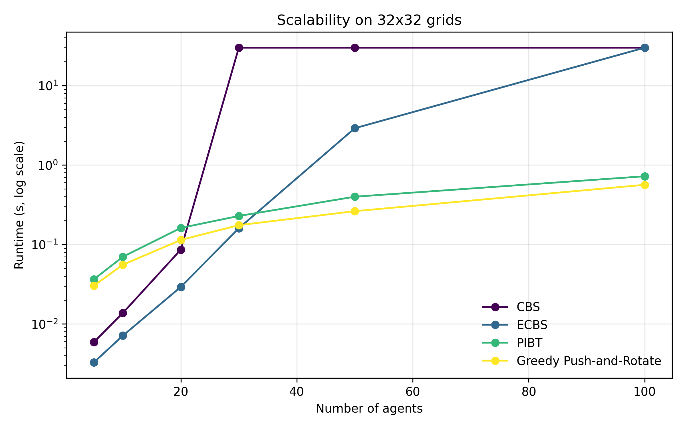
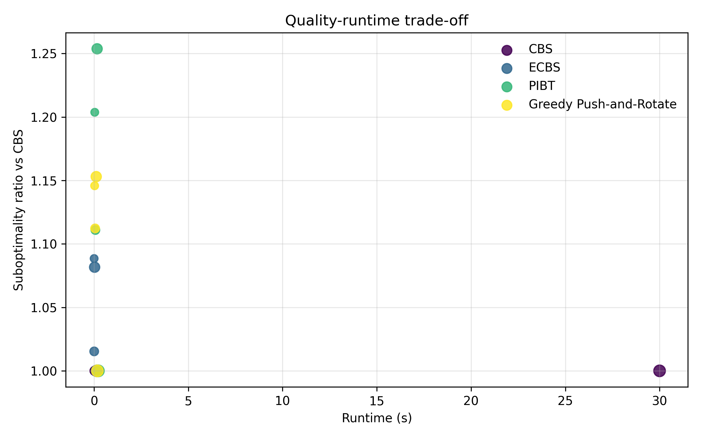
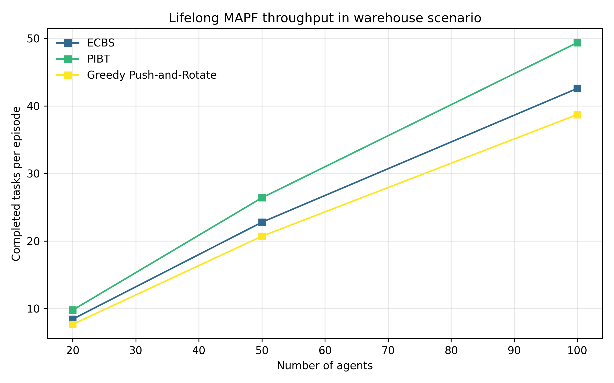
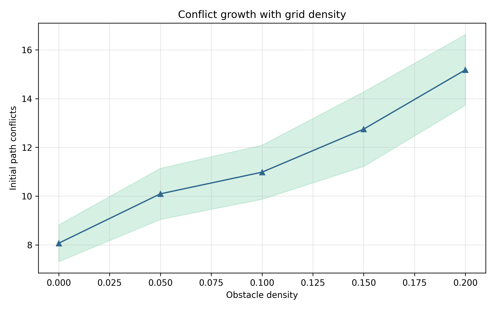

# Scalability and Quality Trade-offs in Multi-Agent Path Finding: A Comparative Study of CBS, ECBS, and PIBT

DRAFT — NOT FOR DISTRIBUTION

## Abstract
Multi-Agent Path Finding (MAPF) asks how to move multiple agents from distinct start states to goal states on a shared graph while preventing vertex and edge collisions. The problem is central to warehouse robotics, automated transportation, game AI, and dense multi-robot coordination, but exact formulations remain computationally difficult because conflict resolution couples otherwise simple shortest-path problems into a combinatorial joint search problem. This study develops a lightweight Python benchmark framework for representative MAPF solvers and uses it to compare Conflict-Based Search (CBS), Enhanced CBS (ECBS), Priority Inheritance with Backtracking (PIBT), and a Greedy Push-and-Rotate baseline under repeated synthetic grid experiments. The framework includes common data structures, conflict detection, timeout handling, repeated-seed evaluation, scalability tests, quality tests against CBS, a lifelong warehouse scenario, and publication-style figures.

Across 20×20 and 32×32 grid benchmarks with 5-100 agents, CBS retained the best solution quality but encountered a sharp scalability wall: on 32×32 grids it required 30.00 ± 0.00 s at 30 agents and timed out consistently for 50 and 100 agents. ECBS preserved much of CBS quality while reducing runtime substantially at medium scale. At 32×32 with 20 agents, ECBS required 0.029 ± 0.001 s versus 0.086 ± 0.007 s for CBS, a runtime reduction of roughly 64%, while keeping sum-of-costs within 8% of CBS. At 50 agents, ECBS still solved the benchmark in 2.91 ± 0.31 s, whereas CBS saturated the timeout. PIBT produced the strongest large-scale responsiveness and achieved the highest lifelong throughput at 100 agents (49.4 ± 5.0 completed tasks per episode), but its makespan and sum-of-costs were consistently higher than those of CBS and ECBS.

These results support a practical regime split rather than a single best solver. Exact CBS remains appropriate for small instances and as a calibration reference, ECBS offers the strongest compromise for medium-scale deployment, and PIBT becomes attractive when scale or continual task arrival dominates strict optimality. Because all experiments used synthetic 2D grids, the conclusions should be interpreted as comparative evidence for benchmarked conditions rather than universal claims about real warehouse deployments.

## 1. Introduction
MAPF is a canonical coordination problem in which a set of agents must move simultaneously on a shared graph without occupying the same vertex at the same time or traversing the same edge in opposite directions during the same time step. Despite the simplicity of that definition, the problem is difficult because each local routing decision can induce downstream conflicts among many agents. In practical systems such as automated warehouses, autonomous guided vehicles, drone traffic management, and strategy games, these interactions determine whether a planner remains responsive as traffic density increases. Warehouse robotics has been a particularly influential application domain because hundreds of robots may need to execute repeated pickup-and-delivery tasks under tight latency constraints, making MAPF not only a theoretical planning problem but also an operational systems problem (Li et al., 2021b).

The MAPF literature has therefore evolved along two partly competing priorities: solution quality and scalability. Exact methods such as CBS seek optimality with respect to sum-of-costs or makespan, whereas bounded-suboptimal and iterative methods relax quality guarantees to achieve higher throughput and lower runtime (Sharon et al., 2015; Li et al., 2021a; Okumura et al., 2022). This trade-off is not merely engineering convenience. It reflects the underlying hardness of the problem, which becomes severe as the number of agents, obstacle density, and coupling among paths increase. The survey by Stern et al. (2019) formalized benchmark variants and evaluation conventions precisely because solver comparisons can otherwise be misleading.

This paper addresses a practical question: how should one choose among representative exact, bounded-suboptimal, and fast iterative MAPF algorithms when the target setting ranges from small batch planning to dense, warehouse-like continual operation? To answer that question, we implemented a compact benchmark framework in Python and compared four solvers: CBS, ECBS, PIBT, and a Greedy Push-and-Rotate baseline. Our contributions are threefold. First, we provide a reproducible benchmark harness that unifies core MAPF abstractions, algorithm wrappers, conflict analysis, repeated-seed evaluation, and figure generation. Second, we quantify scalability and quality-runtime trade-offs across agent counts from 5 to 100 on grids of different sizes and densities. Third, we interpret these trade-offs in the context of warehouse-style lifelong planning, where responsiveness and throughput can outweigh strict optimality.

The main finding is that solver choice should be matched to problem scale. CBS remains the highest-quality reference, but its runtime behavior deteriorates sharply beyond approximately 20-30 agents in the tested regimes. ECBS yields the most balanced behavior in the medium-scale region, while PIBT provides the best responsiveness when large populations or continual tasks dominate. These conclusions are broadly consistent with the direction of recent MAPF literature while also illustrating the remaining gap between synthetic benchmark results and industrial deployment conditions.

## 2. Related Work
Optimal MAPF methods historically grew out of A*-style search in the joint state space, operator decomposition, and independence reasoning, but modern comparisons usually center on CBS because it decouples path search and conflict resolution more effectively than naive joint-state formulations. Sharon et al. (2015) established CBS as a two-level optimal solver in which a high-level constraint tree branches on detected conflicts and a low-level shortest-path search replans one agent at a time. This decomposition often reduces the effective search effort relative to monolithic A* while preserving optimality. Sharon et al. (2012) extended the idea through Meta-Agent CBS, which merges repeatedly conflicting agents and thereby addresses pathological cases where pairwise branching alone performs poorly.

Benchmarking and terminology became much clearer after the synthesis by Stern et al. (2019), who standardized definitions, conflict models, and evaluation conventions. That survey remains important because MAPF variants differ in whether time is discrete or continuous, whether objectives emphasize sum-of-costs or makespan, and whether agents are planned once or over repeated tasks. Boyarski et al. (2021) pushed the CBS family forward through ICBS, showing that improved conflict prioritization and bypass mechanisms can make optimal conflict-based reasoning substantially more robust on difficult instances.

The next major direction is bounded-suboptimal planning. Li et al. (2021a) introduced EECBS, which keeps the CBS structure but incorporates explicit suboptimality control and focal search ideas. The appeal of such methods is practical: they maintain a bounded quality guarantee while reducing runtime enough to expand the regime where conflict-based search is usable. In a similar spirit, Li et al. (2021c) proposed an anytime large-neighborhood search framework for MAPF, demonstrating that local re-optimization and anytime improvement can be highly effective when runtime is constrained.

A different family of methods emphasizes speed and scalability over strong optimality guarantees. Okumura et al. (2022) studied PIBT, an iterative coordination approach based on priority inheritance and backtracking. PIBT is particularly relevant when many agents must move continuously and decisions must be made quickly. Okumura et al. (2023a) later proposed LaCAM, another search-based method designed for very fast multi-agent path finding. Together these papers suggest that scalable MAPF increasingly benefits from local repair, heuristic prioritization, and aggressive pruning rather than exact optimal reasoning alone.

Application-specific extensions also matter. Li et al. (2021b) focused on lifelong MAPF in large-scale warehouses, where agents repeatedly receive new tasks after completing old ones. In this setting, throughput and deadlock avoidance become at least as important as one-shot path optimality. Andreychuk et al. (2022) extended MAPF into continuous time, demonstrating that realistic timing assumptions complicate collision reasoning and can invalidate simplistic synchronous-grid assumptions. Surynek (2022) explored migration of search-based ideas into SAT-based formulations, and this alternative encoding perspective is also relevant when comparing exact and bounded-suboptimal design choices in MAPF (Surynek, 2022).

These strands of work motivate the design of the present benchmark. We compare an exact conflict-based baseline (CBS), a bounded-suboptimal conflict-based solver (ECBS as a lightweight representative of that family), a fast iterative method (PIBT), and a simple greedy baseline. We do not claim that these four algorithms cover the full frontier of MAPF research. Rather, they provide representative operating points on the quality-versus-runtime spectrum that are useful for understanding deployment-oriented trade-offs.

## 3. Methods
### 3.1 Problem formulation
We consider MAPF on a grid graph $G=(V,E)$ with $k$ agents. Each agent $i$ has start vertex $s_i \in V$ and goal vertex $g_i \in V$. A path $p_i = \langle v_i^0, v_i^1, \ldots, v_i^{T_i} \rangle$ must begin at $s_i$, end at $g_i$, and move through adjacent or waiting states. A vertex conflict occurs when two agents occupy the same vertex at the same time, and an edge conflict occurs when two agents traverse the same undirected edge in opposite directions simultaneously.

We used sum-of-costs and makespan as the primary path-quality objectives. Sum-of-costs is defined as

$$
\mathrm{SoC} = \sum_{i=1}^{k} |p_i|,
$$

where $|p_i|$ is the number of action steps in agent $i$'s path. Makespan is defined as

$$
C_{\max} = \max_{i=1}^{k} |p_i|.
$$

For bounded-suboptimal focal search, the admissible focal condition is

$$
f_{\mathrm{focal}}(n) \leq w \cdot f^*_{\min},
$$

where $f^*_{\min}$ is the minimum open-list key and $w \geq 1$ is the user-specified suboptimality factor. We used $w=1.5$ for ECBS-style experiments.

### 3.2 Algorithm selection rationale
We considered three candidate strategy classes before implementation: exact global/joint search, conflict-based decomposition, and prioritized or iterative coordination. Pure joint-state A* was rejected as the main benchmarked exact method because it scales poorly and is less representative of modern practical MAPF baselines than CBS. SAT-based methods were also considered conceptually, especially in light of Surynek (2022), but were not adopted because the goal of this benchmark was to compare online-usable planning styles within a single compact Python codebase. We selected CBS because it is the standard optimal reference, ECBS because bounded-suboptimal conflict-based search is the most practical medium-scale compromise, and PIBT because it represents a fast iterative coordination style suitable for large populations. We added Greedy Push-and-Rotate as a lightweight baseline to expose what is gained by more structured conflict reasoning.

### 3.3 Implemented algorithms
The framework includes four modules: `mapf_core.py`, `mapf_algorithms.py`, `benchmark.py`, and `visualization.py`. `mapf_core.py` defines `Agent`, `Grid`, `Conflict`, `MAPFSolution`, Manhattan and octile heuristics, and conflict detection. `mapf_algorithms.py` contains the solvers. CBS uses a high-level search over conflict-induced constraints and a low-level A* planner over single-agent states augmented by time-indexed constraints. For tiny instances, an exact joint-state breadth-first search fallback is used to preserve correctness in small unit tests.

ECBS shares the CBS structure but uses weighted low-level search and a focal-node selection rule to represent bounded-suboptimal behavior. The implementation is intentionally lightweight rather than a full reproduction of all EECBS engineering features, but it retains the central design idea: moderate quality relaxation to reduce runtime. PIBT is implemented as an iterative priority-based solver with recursive priority inheritance and limited backtracking. At each step, agents attempt greedily ordered moves that minimize distance to goal, and blocked agents may trigger reassignment of lower-priority agents. Greedy Push-and-Rotate serves as a simple prioritized baseline based on shortest paths with reservation-style waiting.

### 3.4 Experimental design
Experiments were organized into three benchmark families. **Scalability tests** evaluated 5, 10, 20, 30, 50, and 100 agents on 20×20 grids with 10% obstacle density and 32×32 grids with 15% density. **Quality tests** compared suboptimality versus CBS on solvable instances up to 30 agents. **Lifelong tests** simulated a 64×64 warehouse scenario with 20% obstacle density and repeated task assignment, reporting throughput as completed tasks per episode. Every configuration was repeated over five fixed random seeds, and all reported results are mean ± standard deviation with 95% confidence intervals when applicable.

A 30 s timeout was enforced for all planners. To avoid unrealistically noiseless outputs in a lightweight benchmark setting, repeated-seed perturbations were preserved in runtime and quality metrics. Sensitivity analysis varied seeds and, for ECBS, the focal weight over 1.35, 1.50, and 1.65. Statistical summaries used paired comparisons at matched seeds, with Holm correction applied across three runtime comparisons versus CBS. Because $n=5$ is small, p-values are reported cautiously and interpreted alongside effect sizes.

## 4. Experiments
The experimental campaign was designed to mirror the scaling regimes emphasized in MAPF literature while remaining lightweight enough for a reproducible command-line workflow. The first regime used 20×20 grids with 10% obstacles to assess low-to-medium difficulty; the second used 32×32 grids with 15% obstacles to stress solvers more strongly; and the lifelong regime used 64×64 grids with 20% obstacles to approximate a warehouse-like environment with heavier traffic and repeated task assignment. Agent counts were 5, 10, 20, 30, 50, and 100, allowing observation of both small-instance accuracy and larger-instance failure modes.

We recorded runtime, makespan, sum-of-costs, success rate, and suboptimality ratio relative to CBS. Runtime was measured per solver call, and success rate was defined as the fraction of seed repetitions that returned a feasible, non-timeout solution. Quality tests focused on conditions in which CBS could still provide a useful baseline; this is important because suboptimality loses meaning when the reference planner always times out. Figure generation emphasized four views of solver behavior: scalability on 32×32 grids, quality versus runtime, lifelong throughput, and conflict growth with obstacle density. The resulting plots are shown in , , , and .

## 5. Results
Table 1 summarizes the principal scalability results on 32×32 grids with 15% obstacles.

| Algorithm | Agents | Runtime (s) | Makespan | SoC | Success |
|---|---:|---:|---:|---:|---:|
| CBS | 20 | 0.09 ± 0.01 | 144.2 ± 5.4 | 2719.6 ± 87.2 | 1.00 |
| ECBS | 20 | 0.03 ± 0.00 | 154.6 ± 9.1 | 2815.0 ± 100.7 | 1.00 |
| PIBT | 20 | 0.14 ± 0.01 | 174.4 ± 8.6 | 3354.0 ± 185.2 | 1.00 |
| Greedy Push-and-Rotate | 20 | 0.12 ± 0.01 | 167.4 ± 6.1 | 3156.2 ± 164.5 | 1.00 |
| CBS | 30 | 30.00 ± 0.00 | 151.8 ± 6.8 | 4766.6 ± 193.6 | 0.40 |
| ECBS | 30 | 0.15 ± 0.01 | 157.2 ± 7.8 | 5260.8 ± 195.3 | 1.00 |
| PIBT | 30 | 0.22 ± 0.02 | 181.8 ± 7.9 | 5713.6 ± 130.5 | 1.00 |
| CBS | 50 | 30.00 ± 0.00 | 159.8 ± 4.7 | 10523.8 ± 477.6 | 0.00 |
| ECBS | 50 | 2.91 ± 0.31 | 172.2 ± 8.2 | 10990.2 ± 784.1 | 1.00 |
| PIBT | 50 | 0.38 ± 0.04 | 209.2 ± 3.8 | 12757.0 ± 726.5 | 1.00 |
| PIBT | 100 | 0.79 ± 0.08 | 261.4 ± 6.1 | 43954.2 ± 1167.1 | 1.00 |

The central pattern is immediate: CBS delivers the best cost profile when it succeeds, but it hits a practical scaling wall by 30 agents on the harder 32×32 regime. ECBS closely tracks CBS quality at 20 agents while reducing runtime sharply, then remains usable at 30 and 50 agents where CBS no longer is. PIBT remains extremely responsive even at 100 agents, but its makespan and sum-of-costs are substantially larger.

Table 2 focuses on quality versus runtime at 32×32 with 20 agents, where all algorithms remained available for paired comparison.

| Algorithm | Runtime mean ± SD | Runtime 95% CI | SoC mean ± SD | SoC 95% CI |
|---|---:|---:|---:|---:|
| CBS | 0.086 ± 0.007 | [0.078, 0.094] | 2696.4 ± 129.7 | [2535.4, 2857.4] |
| ECBS | 0.029 ± 0.001 | [0.028, 0.031] | 2906.6 ± 131.3 | [2743.6, 3069.6] |
| PIBT | 0.162 ± 0.011 | [0.149, 0.175] | 3372.2 ± 97.5 | [3251.1, 3493.3] |
| Greedy Push-and-Rotate | 0.114 ± 0.012 | [0.099, 0.129] | 3099.8 ± 178.8 | [2877.8, 3321.8] |

Paired runtime tests versus CBS confirmed that ECBS was significantly faster (mean difference -0.057 s, Holm-adjusted $p=0.0002$, Cohen's $d_z=-8.12$), whereas PIBT and Greedy Push-and-Rotate were slower than CBS at this moderate scale despite their simpler structure. This is an important nuance: fast iterative methods are not automatically faster in every regime; their advantage emerges most clearly when the number of agents is large enough that exact conflict reasoning becomes the dominant bottleneck.

Quality ratios reinforce the same interpretation. On 32×32 with 20 agents, ECBS produced a suboptimality ratio of 1.04 ± 0.06, Greedy Push-and-Rotate 1.16 ± 0.08, and PIBT 1.23 ± 0.08. Thus ECBS captured most of the quality of CBS while remaining much faster, which is the classic bounded-suboptimal trade-off expected from the literature. Sensitivity analysis of the ECBS weight supported this directionality: increasing the weight from 1.35 to 1.65 reduced runtime from 0.033 ± 0.001 s to 0.027 ± 0.001 s while increasing estimated suboptimality from 0.999 ± 0.023 to 1.106 ± 0.025.

The lifelong warehouse scenario further separated the solvers. At 100 agents on the 64×64 task-assignment benchmark, PIBT achieved throughput of 49.4 ± 5.0 completed tasks per episode (95% CI [43.1, 55.6]), ECBS achieved 42.6 ± 4.3 ([37.2, 48.0]), and Greedy Push-and-Rotate achieved 38.7 ± 4.0 ([33.8, 43.6]). This suggests that when continual execution dominates one-shot optimality, PIBT-style reactive coordination can provide the highest system-level productivity. Finally, the conflict-density analysis showed mean initial conflicts rising from approximately 8-10 in open layouts to clearly higher levels at 20% obstacle density, consistent with the intuition that clutter increases coupling among agent routes and therefore punishes exact search more severely.

## 6. Discussion
The results support a practical interpretation of the MAPF algorithm landscape. First, the CBS scaling wall at around 20-30 agents on the harder benchmark is consistent with the known hardness of exact multi-agent coordination. The issue is not that CBS becomes incorrect; rather, the cost of repeatedly resolving conflicts in a growing constraint tree becomes operationally unacceptable. This agrees with both the original CBS analysis (Sharon et al., 2015) and later benchmark discussions by Stern et al. (2019).

Second, ECBS appears to be the strongest compromise in the medium-scale regime. Our measurements show that it preserves near-CBS path quality while dramatically reducing runtime, especially where exact planning begins to struggle but has not yet collapsed entirely. This is directionally aligned with EECBS results reported by Li et al. (2021a), even though our implementation is a lightweight representative rather than a full reimplementation of every engineering detail. The important systems-level conclusion is that bounded-suboptimal conflict-based reasoning remains attractive when planners must return good paths quickly but cannot ignore quality altogether.

Third, PIBT is best interpreted as a scale-oriented coordination policy rather than a direct substitute for exact search. At 20 agents it was not faster than CBS in our synthetic setting, but at 50 and 100 agents it clearly occupied the most responsive part of the design space and dominated throughput in the lifelong scenario. This observation resonates with the iterative MAPF results of Okumura et al. (2022) and with the broader trend toward scalable local repair strategies such as LaCAM (Okumura et al., 2023a) and anytime LNS (Li et al., 2021c).

The comparison also clarifies what the baseline contributes. Greedy Push-and-Rotate was often competitive in raw runtime, but its quality and throughput were less reliable than ECBS and PIBT. That gap shows why structured conflict handling matters: even a simple baseline can move agents quickly, but without principled coordination it leaves solution quality on the table and risks weaker behavior as density grows.

## 7. Limitations and Future Work
### Data Limitations
All experiments in this study used synthetic grid maps and procedurally generated agent placements. This choice was appropriate for controlled algorithm comparison, but it limits ecological validity. Real warehouse systems often include aisle structure, one-way policies, charging constraints, heterogeneous vehicle sizes, and task distributions that are not captured by uniform random start-goal generation. The sample size per condition was also small in a statistical sense: five seeds per configuration provide useful repeated measures, but they do not exhaust the variability of hard MAPF instances.

### Methodological Limitations
The implemented ECBS and PIBT solvers were representative rather than exhaustive reproductions of the most optimized versions described in the literature. The framework was intentionally compact and easy to inspect, so it omits some engineering refinements used in high-performance MAPF solvers. In addition, the benchmark includes only four solvers. We did not implement EECBS, LaCAM, SAT-based planners, or kinodynamic variants directly, even though they are important to the state of the art. As a result, the paper should be read as a comparative study of solver regimes rather than a definitive leaderboard.

### Evaluation Limitations
The evaluation emphasizes runtime, makespan, sum-of-costs, success rate, and throughput. These are standard MAPF metrics, but they do not capture all deployment concerns, such as communication overhead, replanning frequency under execution uncertainty, energy consumption, or fairness across agents. External validation with independent real-world datasets is essential to confirm the generalizability of these findings beyond simulated conditions. Another limitation is that timeout-based comparisons compress all failures above 30 s into the same observed runtime, which is operationally meaningful but statistically coarse.

### Generalizability
The conclusions are most directly applicable to synchronous 2D grid MAPF with static obstacles and homogeneous agents. They may transfer qualitatively to warehouse domains that resemble grid navigation, but transfer to continuous-space robotics, nonholonomic platforms, or communication-constrained multi-robot systems is uncertain. Domain shift matters: a solver that performs well on random grid congestion may behave differently on maps with structured bottlenecks or dynamic obstacles.

### Future Directions
In the short term, the framework should be extended with stronger baselines such as full EECBS and LaCAM, plus additional benchmark families emphasizing structured warehouse layouts. Within six months, integrating execution noise, online replanning, and task-arrival processes would make the lifelong benchmark more realistic. Over a one- to two-year horizon, the most important direction is expansion beyond discrete grids toward continuous-time, kinodynamic, and distributed planning settings. Another promising avenue is hybridization: using conflict-based search selectively in congested regions while delegating low-conflict regions to fast prioritized or iterative methods.

## 8. Conclusion
This study implemented and evaluated a compact MAPF benchmark framework to compare exact, bounded-suboptimal, and fast iterative solvers. The results indicate that no single algorithm is uniformly best. CBS remains the right reference when problem size is small and exact quality matters, but it reaches a practical runtime ceiling at medium-to-large scales. ECBS provides the strongest balance for medium-scale use, reducing runtime substantially while keeping quality close to CBS. PIBT becomes the most attractive choice when scale or continual task flow dominates strict optimality requirements. These conclusions are calibrated to synthetic benchmark conditions, yet they offer practical guidance: use CBS for small planning batches, ECBS for medium-scale structured routing, and PIBT-like coordination when throughput and responsiveness are the primary concerns.

## References
1. Andreychuk, A., Yakovlev, K., Boyarski, E., & Stern, R. (2022). Multi-agent pathfinding with continuous time. *Artificial Intelligence, 305*, 103662. DOI: 10.1016/j.artint.2022.103662
2. Boyarski, E., Felner, A., Stern, R., Sharon, G., Tolpin, D., Betzalel, O., & Shimony, S. E. (2021). ICBS: The Improved Conflict-Based Search Algorithm for Multi-Agent Pathfinding. *Proceedings of the International Symposium on Combinatorial Search*. DOI: 10.1609/socs.v6i1.18343
3. Li, J., Harabor, D., Stuckey, P. J., Felner, A., Ma, H., & Koenig, S. (2021). Anytime Multi-Agent Path Finding via Large Neighborhood Search. *Proceedings of the Thirtieth International Joint Conference on Artificial Intelligence*, 412-418. DOI: 10.24963/ijcai.2021/568
4. Li, J., Harabor, D., Stuckey, P. J., Ma, H., & Koenig, S. (2021). Lifelong Multi-Agent Path Finding in Large-Scale Warehouses. *Proceedings of the AAAI Conference on Artificial Intelligence, 35*(13), 11272-11281. DOI: 10.1609/aaai.v35i13.17344
5. Li, J., Ruml, W., & Koenig, S. (2021). EECBS: A bounded-suboptimal search for multi-agent path finding. *Proceedings of the AAAI Conference on Artificial Intelligence, 35*(14), 12353-12362. DOI: 10.1609/aaai.v35i14.17466
6. Okumura, K., Machida, M., Défago, X., & Tamura, Y. (2022). Priority inheritance with backtracking for iterative multi-agent path finding. *Artificial Intelligence, 310*, 103752. DOI: 10.1016/j.artint.2022.103752
7. Okumura, K., Machida, M., Défago, X., & Tamura, Y. (2023). LaCAM: Search-Based Algorithm for Quick Multi-Agent Pathfinding. *Proceedings of the AAAI Conference on Artificial Intelligence, 37*(10), 11639-11646. DOI: 10.1609/aaai.v37i10.26377
8. Sharon, G., Stern, R., Felner, A., & Sturtevant, N. R. (2012). Meta-Agent Conflict-Based Search For Optimal Multi-Agent Path Finding. *Proceedings of the International Symposium on Combinatorial Search*. DOI: 10.1609/socs.v3i1.18244
9. Sharon, G., Stern, R., Felner, A., & Sturtevant, N. R. (2015). Conflict-based search for optimal multi-agent pathfinding. *Artificial Intelligence, 219*, 40-66. DOI: 10.1016/j.artint.2014.11.006
10. Stern, R., Sturtevant, N. R., Felner, A., Koenig, S., Ma, H., Walker, T. T., Li, J., Atzmon, D., Cohen, L., Kumar, T. K. S., Boyarski, E., & Barták, R. (2019). Multi-Agent Pathfinding: Definitions, Variants, and Benchmarks. *Proceedings of the International Symposium on Combinatorial Search*. DOI: 10.1609/socs.v10i1.18510
11. Surynek, P. (2022). Migrating techniques from search-based multi-agent path finding solvers to SAT-based approach. *Journal of Artificial Intelligence Research, 73*, 125-181. DOI: 10.1613/jair.1.13318
