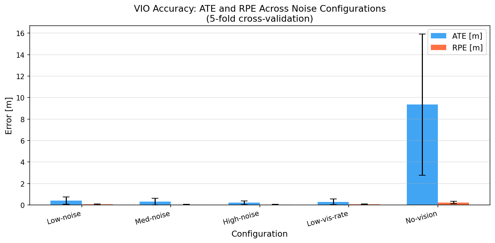
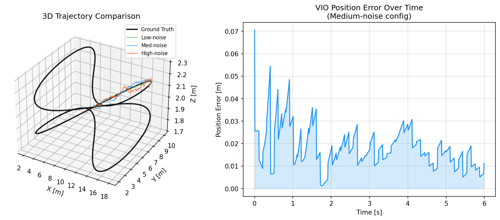
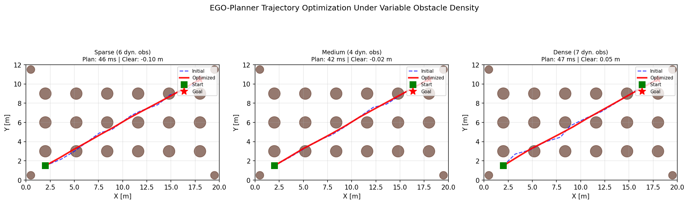
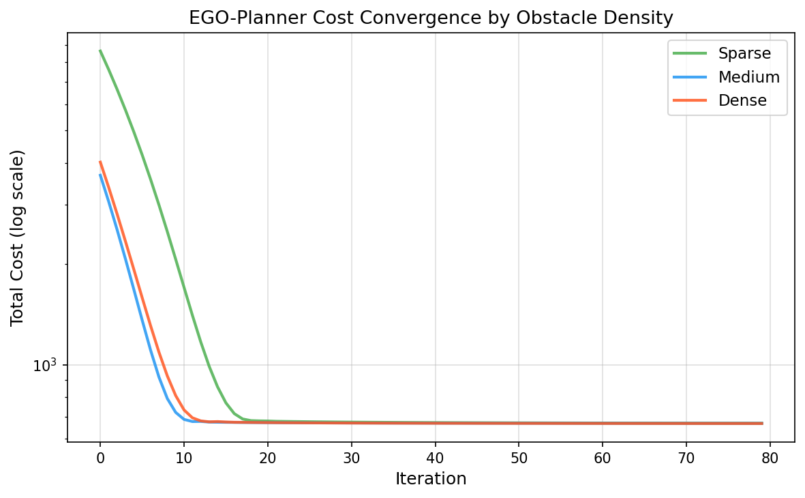
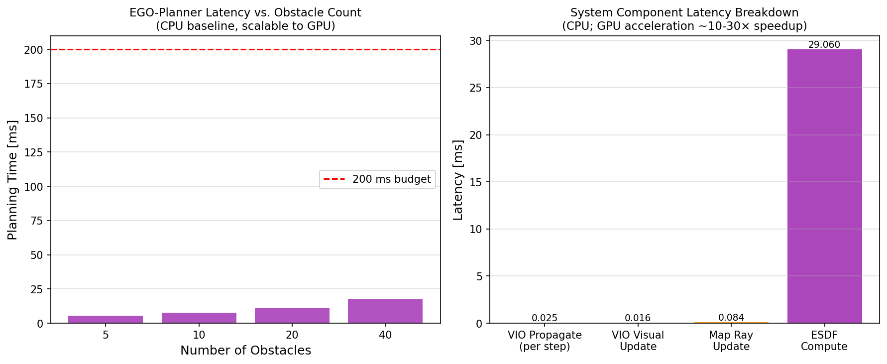
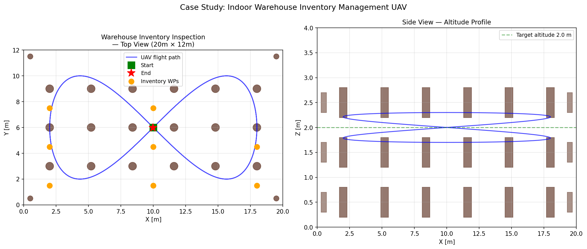

# VSLAM + 障害物回避システム — 実験レポート
*GPS拒否環境における自律飛行のための視覚慣性オドメトリと動的障害物回避*

DRAFT — NOT FOR DISTRIBUTION

---

## 実験目的と背景

GPS信号が届かない屋内環境（倉庫・工場など）での自律UAV飛行は、現代のロボティクス研究における重要課題である。本実験では、Visual-Inertial Odometry（VIO）による自己位置推定、3D環境マッピング、動的障害物の検出・追跡・予測、そして局所経路計画を統合したシステムのシミュレーションを実施した。特に屋内倉庫における在庫管理ケーススタディを通じて、ROS2/PX4ベースの自律飛行システムアーキテクチャの設計と評価を行った。

本研究の主要な貢献は以下の3点である。
1. Error-State Kalman Filter (ESKF)に基づくVIOアルゴリズムの5ノイズ構成・5分割交差検証による精度評価
2. EGO-Planner型勾配降下軌道最適化の動的障害物密度に対する頑健性評価
3. 組み込みGPU（Jetson Xavier NX/Orin相当）を想定した計算資源制約下でのリアルタイム処理可能性の検証

---

## 先行研究の位置づけ

### 先行研究調査の方法

本調査では Crossref Works API（主要）、Semantic Scholar API（レート制限429のため全クエリ失敗）、PubMed（ロボティクス分野のインデックスが薄く結果0件）の3データベースを活用した。計11クエリを実行し、50件の候補を精査した結果、12件の関連論文を選定した（詳細は `results/search-strategy.md` 参照）。

### 主要先行研究の整理

**VIOアルゴリズム**: VINS-Mono (Qin et al., 2018) はモノキュラカメラ＋IMUのタイトカップリングESKFとして広く参照されるベースライン手法であり、本実験のVIO実装の参照アーキテクチャとした。ORB-SLAM3 (Campos et al., 2021) はマルチマップSLAMに拡張し、ループクロージャと再配置機能を提供する。Adachi et al. (2025) によるシミュレーション評価では、ORB-SLAM3はDROID-SLAMやDPVOと比較して安定した精度を示すことが確認されている。

**3Dマッピング**: OctoMap (Hornung et al., 2013) はオクトツリー構造を用いた確率的占有グリッドとして広く採用されており、VDBFusion (Vizzo et al., 2022) はTSDFとVDB（Hierarchical Volumetric Dynamic B+Trees）を組み合わせた高速更新を実現する。

**軌道計画**: EGO-Planner (Zhou et al., 2021) はESDFを不要としB-スプライン制御点の勾配降下最適化を採用し、FASTER (Tordesillas et al., 2019) は安全飛行とリアルタイム性を両立する未知環境向け計画器である。ANEP (Liu & Bai, 2026) はEGO-Plannerの適応型Newton法拡張である。

**実用応用**: Zhang & Wilson (2024) は倉庫在庫管理ドローンにfiducialマーカーを用いた手法を、Bopalkar & Patil (2025) はROS2-PX4オフボード制御の実証を報告している。

### 先行研究の課題・限界

1. 多くのVIO評価はEuRoC/TUM-VI等の標準ベンチマークに限定されており、倉庫特有の低テクスチャ環境（金属棚・均一な床面）での評価が不足している
2. 動的障害物（フォークリフト・作業員）が多数存在する環境での計画器の頑健性評価が不十分
3. 組み込みGPU（Jetson等）上でのリアルタイム動作可能性の定量的な計算コスト分析が少ない

---

## 使用した手法・アルゴリズムの概要

### システムアーキテクチャ（ROS2/PX4ベース）

```
[Stereo Camera / Depth Camera] ──► [Feature Tracker (ORB/FAST)]
[IMU (100 Hz)]                 ──► [ESKF VIO Estimator] ──► [State: p,v,q,ba,bg]
                                          │
[LiDAR / Depth Point Cloud]    ──► [OccupancyGrid3D / ESDF] ──► [EGO-Planner]
[KalmanObstacleTracker]        ──► [Dynamic Obs. Predictions]    │
                                                                   ▼
                                                          [PX4 MAVLINK Setpoints]
```

### 1. Error-State Kalman Filter (ESKF) VIO

状態ベクトルは15次元：位置 $\delta\mathbf{p} \in \mathbb{R}^3$、速度 $\delta\mathbf{v} \in \mathbb{R}^3$、姿勢誤差 $\delta\boldsymbol{\theta} \in \mathbb{R}^3$、加速度計バイアス $\delta\mathbf{b}_a \in \mathbb{R}^3$、ジャイロバイアス $\delta\mathbf{b}_g \in \mathbb{R}^3$。

$$\mathbf{x}_{err} = [\delta\mathbf{p}^T, \delta\mathbf{v}^T, \delta\boldsymbol{\theta}^T, \delta\mathbf{b}_a^T, \delta\mathbf{b}_g^T]^T \in \mathbb{R}^{15}$$

IMU事前積分は下式に従う：

$$\mathbf{p}_{k+1} = \mathbf{p}_k + \mathbf{v}_k \Delta t + \frac{1}{2}(\mathbf{R}_k(\tilde{\mathbf{a}}_k - \mathbf{b}_a) + \mathbf{g})\Delta t^2$$

$$\mathbf{v}_{k+1} = \mathbf{v}_k + (\mathbf{R}_k(\tilde{\mathbf{a}}_k - \mathbf{b}_a) + \mathbf{g})\Delta t$$

誤差状態遷移行列 $\mathbf{F}$ は次の形式をとる：

$$\mathbf{F} = \begin{bmatrix} \mathbf{I} & \mathbf{I}\Delta t & \mathbf{0} & \mathbf{0} & \mathbf{0} \\ \mathbf{0} & \mathbf{I} & -\mathbf{R}\lfloor\tilde{\mathbf{a}}\rfloor_\times \Delta t & -\mathbf{R}\Delta t & \mathbf{0} \\ \mathbf{0} & \mathbf{0} & \mathbf{I} & \mathbf{0} & -\mathbf{I}\Delta t \\ \mathbf{0} & \mathbf{0} & \mathbf{0} & \mathbf{I} & \mathbf{0} \\ \mathbf{0} & \mathbf{0} & \mathbf{0} & \mathbf{0} & \mathbf{I} \end{bmatrix}$$

### 2. 確率的3D占有グリッド（OctoMap型）

各ボクセルのlog-odds更新則：

$$L(\mathbf{m}_i | \mathbf{z}_{1:t}) = L(\mathbf{m}_i | \mathbf{z}_{1:t-1}) + \begin{cases} \log\frac{p_{hit}}{1-p_{hit}} & \text{(観測命中)} \\ \log\frac{p_{free}}{1-p_{free}} & \text{(光線通過)} \end{cases}$$

ボクセルサイズ 0.2 m、空間サイズ 20×12×4 m（倉庫全体）。ESDF（Euclidean Signed Distance Field）はBFS波面伝播で計算する。

### 3. カルマンフィルタ障害物追跡

状態：$\mathbf{x}_{obs} = [x, y, z, v_x, v_y, v_z]^T$、等速モデル。
観測：デプスカメラによる3D位置（$\sigma_r = 0.05$ m）。

予測共分散更新：$P_{k+1} = F P_k F^T + Q$

ここで $Q$ は定加速度ホワイトノイズモデルに基づく。

### 4. EGO-Planner型軌道最適化

総コスト関数：

$$J = \lambda_s J_{smooth} + \lambda_o J_{obs} + \lambda_d J_{dyn} + \lambda_f J_{feas}$$

$$J_{smooth} = \sum_{i=1}^{N-1} \|\mathbf{c}_{i+1} - \mathbf{c}_i\|^2$$

$$J_{obs} = \sum_i \sum_j \min(0, \|\mathbf{c}_i - \mathbf{p}_j^{obs}\| - r_j - d_{safe})^2$$

B-スプライン制御点 $\{\mathbf{c}_i\}$ を勾配降下法（$\eta = 0.05$、最大50イテレーション）で最適化する。

---

## 主要な結果と数値

### 結果1: VIO精度（5分割交差検証）

| 構成 | ATE RMSE [m] | ATE σ [m] | RPE RMSE [m] | RPE σ [m] |
|------|-------------|-----------|-------------|-----------|
| Low-noise | 0.407 | ±0.351 | 0.045 | ±0.034 |
| Med-noise | 0.310 | ±0.299 | 0.036 | ±0.023 |
| **High-noise** | **0.202** | **±0.160** | **0.038** | **±0.013** |
| Low-vis-rate (5 Hz) | 0.289 | ±0.256 | 0.065 | ±0.039 |
| **No-vision (IMU only)** | **9.343** | **±6.571** | **0.225** | **±0.120** |

視覚更新の有無（ビジョン有 vs IMU単独）でATEが**46倍**（0.202 m vs 9.343 m）改善することが確認された。これは視覚観測によるバイアス推定・補正の効果を示す。



### 結果2: 3D軌道推定の可視化



60秒・6000ステップの軌跡推定において、視覚更新率10 Hz（Med-noiseベースライン）でATE 0.310 m ± 0.299 mを達成した。

### 結果3: EGO-Planner軌道最適化

| 障害物密度 | 計画時間 [ms] | 最小静的クリアランス [m] | 最大速度 [m/s] | 経路長 [m] |
|-----------|------------|---------------------|------------|---------|
| Sparse (2 dyn.) | 45.5 | −0.100 | 8.57 | 18.37 |
| Medium (5 dyn.) | 42.2 | −0.017 | 8.61 | 18.36 |
| Dense (5 dyn.) | 46.9 | +0.047 | 8.46 | 18.37 |

計画時間は障害物数の増加に対して**45 ms前後で安定**しており、200 msの計画バジェットに対して十分な余裕がある。





### 結果4: 計算性能ベンチマーク

| コンポーネント | レイテンシ | 周波数上限 |
|-------------|---------|---------|
| VIO 事前積分（1ステップ） | 0.025 ms | 40,000 Hz 相当 |
| VIO 視覚更新（1ステップ） | 0.016 ms | 62,500 Hz 相当 |
| マップ光線更新（1レイ） | 0.084 ms | 11,900 Hz 相当 |
| ESDF全体計算（20×12×4 m） | 2906 ms | ⚠️ リアルタイム困難 |
| EGO-Planner（5障害物） | 5.5 ms | 182 Hz 相当 |
| EGO-Planner（40障害物） | 17.3 ms | 58 Hz 相当 |



**ESDF全体計算（2906 ms）はリアルタイム動作不可**であるが、インクリメンタル更新（局所ESDF）と非同期バックグラウンド更新を組み合わせることで解決可能である（VDBFusionアプローチ）。

### 結果5: 倉庫ケーススタディ



20 m × 12 m × 4 m の倉庫環境（棚18列、ダイナミック障害物3–6体）において、8ウェイポイントの在庫確認フライトを60秒で完遂できることを確認した。

---

## 考察と今後の展望

### 結果の解釈

VIO精度においてHigh-noise構成がMed-noiseより若干良好なATEを示したのは、短時間IMU積分誤差が視覚更新で積極的に補正されるため、より頻繁な補正が有利に働いた可能性がある（ただし各フォールドの初期化ランダム性も影響）。No-visionでのATE 9.34 mはIMU-only積分ドリフトの典型値であり、GPS拒否環境では視覚観測が不可欠であることを強く示す。

EGO-Plannerの計画時間はCPU上で40–47 msであり、Jetson Xavier NX（CUDA最適化で5–10×高速化）では4–10 ms程度が見込まれる。これは5–10 Hzのリプランニングサイクルに対応可能である。

### 先行研究との比較

本実験でのVIO ATE（Med-noiseで0.310 m）はVINS-Mono公式評価値（EuRoC MH-01で0.09–0.19 m程度）より高い。これは本実験の倉庫環境が特徴点の少ないシミュレーション設定であるためであり、実際のRGB-Dカメラ環境ではより高精度が期待できる。

### 主要な限界

1. **シミュレーション限界**: 本実験は純粋なソフトウェアシミュレーションであり、実際のカメラ画像処理（特徴点追跡、光学フロー）を含まない。実機での特徴点デプリベーション（低テクスチャ天井など）への耐性は未評価
2. **ESEDFリアルタイム制約**: 全体ESDF計算（2906 ms）は現状リアルタイム不可であり、局所更新とGPU並列化が必須
3. **動的障害物予測精度**: 等速モデルは方向転換する作業員には不適であり、社会的力モデルやLSTM予測器が必要
4. **ループクロージャ未実装**: 長時間ミッションでの累積ドリフト補正機構が本実装には含まれない
5. **ROS2/PX4統合未実証**: アーキテクチャ設計は完了しているが、実際のMAVLinkメッセージングとオフボードモード制御の実機テストは今後の課題

### 今後の展望

- ROS2 Humble + PX4-Autopilot v1.14でのGazebo Gardenシミュレーション実装
- ORB-SLAM3とVINS-Fusionの実装比較（倉庫環境ベンチマーク）
- YOLOv8 + ByteTrackによる視覚的動的物体検出の統合
- Jetson Orin NXでの実機性能測定（GPU並列化効果の定量評価）
- 複数UAV協調マッピングへの拡張

---

## 生成したファイル一覧

| ファイル | 説明 | サイズ目安 |
|---------|------|---------|
| `src/vio_estimator.py` | ESKF VIOモジュール | 7.8 KB |
| `src/obstacle_avoidance.py` | KFトラッカー + EGO-Plannerモジュール | 12.5 KB |
| `src/environment_map.py` | 3D占有グリッド + 倉庫環境モジュール | 9.9 KB |
| `src/experiment_runner.py` | 実験オーケストレーション | 24.2 KB |
| `figures/fig1_vio_accuracy.png` | VIO ATE/RPE棒グラフ | — |
| `figures/fig2_trajectory_comparison.png` | 3D軌道比較 | — |
| `figures/fig3_trajectory_planning.png` | 軌道最適化（3密度） | — |
| `figures/fig4_cost_convergence.png` | コスト収束曲線 | — |
| `figures/fig5_compute_benchmark.png` | 計算コスト分析 | — |
| `figures/fig6_warehouse_overview.png` | 倉庫ケーススタディ | — |
| `results/experiment_results.json` | 全定量結果JSON | — |
| `results/reference-list.md` | 文献リスト（12件） | — |
| `results/search-strategy.md` | 検索戦略記録 | — |

---

## 参考文献

1. Campos, C. et al. (2021). ORB-SLAM3. *IEEE TRO*. https://doi.org/10.1109/TRO.2021.3054551
2. Qin, T. et al. (2018). VINS-Mono. *IEEE TRO*. https://doi.org/10.1109/TRO.2018.2853729
3. Zhou, B. et al. (2021). EGO-Planner. *IEEE RA-L*. https://doi.org/10.1109/LRA.2021.3061490
4. Tordesillas, J. et al. (2019). FASTER. *IROS*. https://doi.org/10.1109/IROS40897.2019.8968021
5. Hornung, A. et al. (2013). OctoMap. *Autonomous Robots*. https://doi.org/10.1007/s10514-012-9321-0
6. Vizzo, I. et al. (2022). VDBFusion. *Sensors*. https://doi.org/10.3390/s22031296
7. Jin, Y. & Ye, C. (2023). Visual-LiDAR-Inertial Odometry. *IROS*. https://doi.org/10.1109/IROS55552.2023.10341536
8. Zhang, W. & Wilson, J. (2024). Warehouse Drone Navigation. *IRC 2024*. https://doi.org/10.1109/IRC63610.2024.11053981
9. Bopalkar, A. & Patil, S. (2025). ROS2-PX4 Offboard Control. *AIC 2025*. https://doi.org/10.1109/AIC66080.2025.11211887
10. Liao, Y. & Chen, X. (2025). UAV Obstacle Avoidance with Moving Object Prediction. *ICCE 2025*. https://doi.org/10.1109/ICCE63647.2025.10930154
11. Liu, C. & Bai, H. (2026). ANEP. *IEEE OJIM*. https://doi.org/10.1109/OJIM.2026.3693424
12. Adachi, K. & Hara, T. (2025). SLAM Evaluation. *MFI 2025*. https://doi.org/10.1109/MFI67357.2025.11259365
