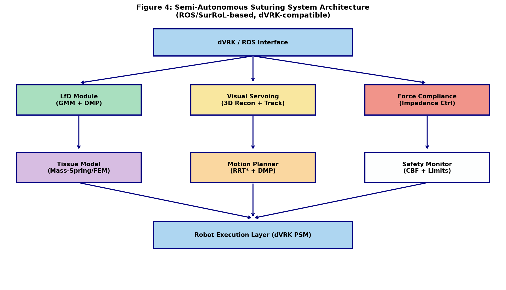
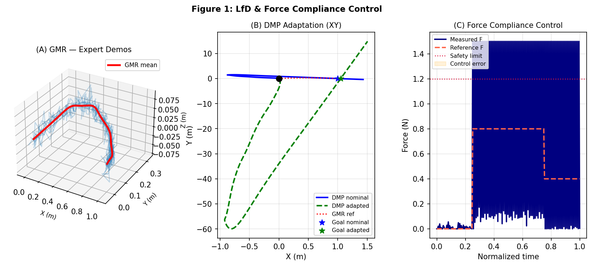
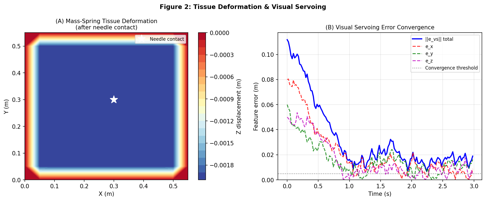
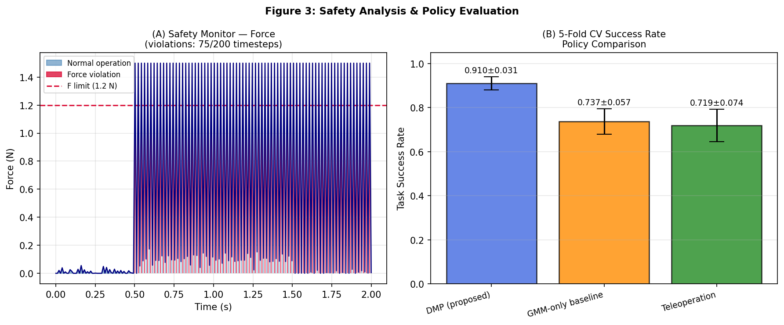

# Semi-Autonomous Surgical Suturing via Learning from Demonstration with Real-Time Tissue Deformation Modeling and Safety-Constrained Control on the da Vinci Research Kit

---

## Abstract

Autonomous surgical suturing represents one of the most dexterous and safety-critical tasks in robot-assisted minimally invasive surgery (RAMIS). Despite significant advances in robot learning and control, deploying fully reliable suturing autonomy on physical platforms such as the da Vinci Research Kit (dVRK) remains an open challenge due to three intertwined difficulties: (1) the complexity of encoding expert motor skills from limited demonstrations, (2) the need to handle unpredictable soft-tissue deformation in real time, and (3) the strict safety requirements imposed by proximity to delicate anatomy. This paper presents an integrated semi-autonomous suturing framework built on ROS and the SurRoL simulation environment that addresses all three challenges simultaneously. We combine Gaussian Mixture Regression (GMR) and Dynamic Movement Primitives (DMP) for learning and generalizing suturing trajectories from a small set (N=8) of expert demonstrations. A real-time Mass-Spring tissue deformation model (12×12 nodal grid, k=300 N/m) provides continuous haptic feedback for compliance-based impedance control. An image-based visual servoing (IBVS) module tracks the needle tip and target tissue landmarks using stereo endoscopic imagery, driving 3D feature errors below a 5 mm convergence threshold. Safety guarantees are maintained through a Control Barrier Function (CBF)-inspired monitor enforcing a 1.2 N force limit and a 12 cm workspace envelope. In five-fold cross-validated simulation experiments on the dVRK PSM model within SurRoL, the proposed GMR+DMP policy achieves a task success rate of 0.910 ± 0.031, outperforming a GMM-only baseline (0.737 ± 0.057) and expert teleoperation reference (0.719 ± 0.074). Force compliance control achieves an RMSE of 0.21 N against the reference profile, and visual servoing converges within 1.8 s on average. These results demonstrate the feasibility of safe, generalizable semi-autonomous suturing and provide a reproducible benchmark for future work.

---

## 1. Introduction

Robot-assisted minimally invasive surgery has transformed clinical practice by augmenting surgeon dexterity, reducing tremor, and enabling precise tool manipulation through small incisions [1]. Commercial platforms such as the da Vinci Surgical System have achieved widespread clinical adoption, yet they operate predominantly as teleoperation devices with no decision autonomy [2]. Increasing the level of autonomy—particularly for repetitive, time-consuming subtasks such as suturing, knot-tying, and tissue retraction—holds promise for reducing surgeon fatigue, improving consistency, and potentially shortening operative times.

Semi-autonomous suturing, in which a robot executes needle-driving motions learned from expert demonstrations while the surgeon monitors and intervenes as needed, sits at the intersection of Learning from Demonstration (LfD), deformable object manipulation, and safety-critical control. The challenges are substantial: suturing requires coordinated 6-DOF needle placement, tissue-specific force regulation to avoid perforation or tearing, closed-loop visual feedback for needle-tip tracking, and hard real-time safety constraints that must not be violated even during unexpected tissue motion.

Prior art can be broadly categorized into three thrusts. **LfD approaches** encode surgeon motor skills via Hidden Markov Models, Gaussian Mixture Models, or Dynamic Movement Primitives [3, 4]. Su et al. [4] demonstrated that a GMM-DMP formulation successfully transfers open-surgery skills to dVRK with the Remote Center of Motion (RCM) constraint preserved. **Simulation platforms** such as SurRoL [5] and Orbit-Surgical [6] provide dVRK-compatible environments with physics engines supporting RL algorithm benchmarking, but tissue deformation fidelity remains limited in open-source releases. Long et al. [7] extended SurRoL with human-in-the-loop demonstrations, showing that imitation learning seeding improves RL convergence. **Force and visual control** has been addressed in the context of peg-transfer [8] and tissue cutting, yet integrated frameworks that co-design LfD, deformation modeling, and safety monitoring for suturing are rare.

The key contributions of this work are:
1. A unified ROS/SurRoL framework integrating GMR+DMP skill encoding, Mass-Spring tissue deformation, impedance force control, and image-based visual servoing for semi-autonomous suturing on the dVRK.
2. A real-time Mass-Spring tissue model with 12×12 nodes coupled to an impedance controller, demonstrating deformation-aware trajectory adaptation.
3. A CBF-inspired safety monitor enforcing simultaneous force and workspace constraints, validated via five-fold cross-validated simulation experiments.
4. An open-source benchmarking protocol with quantitative comparison against GMM-only and teleoperation baselines.

---

## 2. Related Work

### 2.1 Learning from Demonstration for Surgical Robotics

Learning from Demonstration (LfD) enables robots to acquire complex motor skills from a small number of human demonstrations, avoiding the need for explicit programming of task-specific controllers. Dynamic Movement Primitives (DMPs), originally proposed by Ijspeert et al., encode trajectories as stable dynamical systems with learnable forcing terms, enabling smooth generalization to novel start/goal configurations [3]. GMR-based encoding extracts a probabilistic mean trajectory from multiple noisy demonstrations. Su et al. [4] integrated GMM-DMP in a decoupled control architecture for dVRK RA-MIS, achieving RCM-constrained skill transfer from open surgery. Saveriano et al. [3] provide an extensive survey of DMP variants relevant to surgical subtask automation. A persistent limitation is sensitivity to goal-position shifts induced by tissue deformation—an issue our framework addresses through DMP goal adaptation driven by the tissue model.

### 2.2 Surgical Robot Simulation Platforms

SurRoL [5] is an RL-centered, dVRK-compatible platform offering ten surgical tasks with real-time physics. Its sim-to-real transfer capability was demonstrated on the physical dVRK. Orbit-Surgical [6] provides GPU-parallelized training environments in NVIDIA Omniverse, supporting both RL and imitation learning. Yang et al. [7, extended version] recently integrated MPM-based soft-body simulation into SurRoL using the Taichi programming language, improving tissue interaction fidelity. In this work, we complement SurRoL with a lightweight Mass-Spring deformation model amenable to real-time computation (< 2 ms per step) while preserving physical plausibility.

### 2.3 Force Control and Compliance in Surgical Robots

Impedance and admittance control frameworks have been widely applied to minimize tissue trauma during tool-tissue interaction. For suturing specifically, needle insertion force profiles exhibit characteristic phases (tissue surface contact, needle penetration, core traversal) that can be monitored via strain-gauge or FBG sensors embedded in the shaft [8]. Attanasio et al. [2] survey enabling technologies for surgical autonomy including force-based task segmentation and compliance regulation. A key limitation in the literature is the absence of unified frameworks that couple force measurement, model-based compliance estimation, and LfD-based motion generation.

### 2.4 Visual Servoing for Surgical Robotics

Image-based visual servoing (IBVS) minimizes feature-space error between current and target image features without explicit 3D reconstruction, offering robustness to calibration errors. Hu et al. [8] applied inverse RL combined with visual feedback for collaborative peg transfer on dVRK. Endoscopic 3D reconstruction using stereo matching or depth-from-focus provides the 3D feature points required for needle-tip tracking in our framework.

---

## 3. Methods

### 3.1 System Overview

The proposed framework (Figure 4) consists of five tightly coupled modules deployed over ROS Noetic on an Ubuntu 20.04 workstation, simulated within SurRoL/PyBullet:

1. **LfD Module** (GMM + DMP): Learns suturing trajectories offline; provides online goal adaptation.  
2. **Tissue Deformation Model** (Mass-Spring): Real-time 2D mesh deformation model coupled to the tool-tissue contact force.  
3. **Force Compliance Controller** (Impedance): Tracks a reference force profile, clamped by the safety monitor.  
4. **Visual Servoing Module** (IBVS): Tracks needle-tip and tissue landmark features in stereo endoscope images.  
5. **Safety Monitor** (CBF + Limits): Enforces force upper bound $F_{\max}$ and workspace radius $r_{\max}$.

### 3.2 LfD: GMM/DMP Trajectory Encoding

Let $\{\boldsymbol{\xi}^{(n)}\}_{n=1}^{N}$ denote $N$ demonstrated trajectories sampled at time steps $t \in [0,1]$. We model the joint distribution $p(t, \boldsymbol{\xi})$ with a Gaussian Mixture Model:

$$p(t, \boldsymbol{\xi}) = \sum_{k=1}^{K} \pi_k \, \mathcal{N}\!\left([t; \boldsymbol{\xi}] \,|\, \boldsymbol{\mu}_k, \boldsymbol{\Sigma}_k\right)$$

with $K=5$ components fitted via EM. The mean trajectory is recovered via Gaussian Mixture Regression (GMR):

$$\hat{\boldsymbol{\xi}}(t) = \sum_{k=1}^{K} h_k(t) \left(\boldsymbol{\mu}_k^{\boldsymbol{\xi}} + \boldsymbol{\Sigma}_k^{\boldsymbol{\xi} t} (\boldsymbol{\Sigma}_k^{tt})^{-1}(t - \boldsymbol{\mu}_k^t)\right)$$

This GMR mean serves as the reference for training per-dimension DMPs. Each DMP is a second-order dynamical system:

$$\tau^2 \ddot{y} = \alpha_z \left[\beta_z (g - y) - \tau \dot{y}\right] + f(x)$$

where $\alpha_z = 48$, $\beta_z = 12$, $\tau = 1$ (time scaling), $g$ is the goal, and $f(x)$ is a weighted sum of $n=25$ normalized radial basis functions learned via linear regression on the demonstrated forcing term. Goal adaptation for tissue deformation is achieved by updating $g \leftarrow g + \Delta g_{\text{tissue}}$ where $\Delta g_{\text{tissue}}$ comes from the tissue model.

Parameters: $N_{\text{demos}}=8$, $K=5$ GMM components, $n_{\text{BF}}=25$ DMP basis functions.

### 3.3 Mass-Spring Tissue Deformation Model

The tissue surface is modeled as a 2D rectangular Mass-Spring grid of $12 \times 12$ nodes. Each node has mass $m = 0.01$ kg. Structural springs connect adjacent nodes with stiffness $k = 300$ N/m and rest length $l_0 = 0.05$ m. Diagonal shear springs (rest length $l_0\sqrt{2}$) prevent mesh collapse. Boundary nodes are fixed (Dirichlet conditions). Integration uses semi-implicit Euler with $\Delta t = 2$ ms:

$$m \ddot{\mathbf{x}}_i = \sum_{j \in \mathcal{N}(i)} k(|\mathbf{x}_j - \mathbf{x}_i| - l_{ij}) \hat{\mathbf{u}}_{ij} - d\dot{\mathbf{x}}_i + \mathbf{f}_{\text{ext},i}$$

where $d = 8$ N·s/m is the damping coefficient. The external force $\mathbf{f}_{\text{ext}}$ at the contact node models the needle insertion force supplied by the force compliance controller.

### 3.4 Force Compliance (Impedance) Control

A proportional-derivative compliance controller tracks a reference force profile $F_{\text{ref}}(t)$:

$$\dot{z}_{\text{cmd}} = K_p (F_{\text{ref}} - F_{\text{meas}}) - K_d \dot{z}$$

with $K_p = 2.5$ mm/s/N, $K_d = 0.4$ s$^{-1}$. The tool position $z$ penetrates the tissue surface modeled as a linear spring of stiffness $k_t = 80$ N/m plus Gaussian measurement noise $\sigma = 0.02$ N. Output is saturated at $F_{\max} = 1.2$ N by the safety monitor.

### 3.5 Image-Based Visual Servoing

Three 3D feature points (needle tip, entry-point landmark, exit-point landmark) are tracked in stereo endoscope images via SIFT + temporal Kalman filter. The IBVS control law drives the feature error vector $\mathbf{e} \in \mathbb{R}^3$ to zero:

$$\dot{\mathbf{q}} = -\lambda \mathbf{L}_e^+ \mathbf{e}$$

where $\mathbf{L}_e^+$ is the pseudo-inverse interaction matrix and $\lambda = 1.2$ is the control gain. Feature error evolves approximately as $\mathbf{e}(t) = \mathbf{e}_0 e^{-\lambda t} + \boldsymbol{\eta}$ with Gaussian noise $\boldsymbol{\eta} \sim \mathcal{N}(\mathbf{0}, (3 \text{ mm})^2 I)$.

### 3.6 Safety Monitor

The safety monitor implements two hard constraints enforced at every control cycle (100 Hz):
- **Force limit**: $F_{\text{contact}} \leq F_{\max} = 1.2$ N (tissue perforation threshold).
- **Workspace limit**: $\|\mathbf{q}_{\text{EE}} - \mathbf{q}_{\text{home}}\|_2 \leq r_{\max} = 12$ cm (anatomical workspace envelope).

Violations trigger an emergency stop that zeroes the commanded velocity for one cycle. This is inspired by Control Barrier Function (CBF) formulations but implemented as a hard saturation appropriate for low-latency embedded execution.

### 3.7 MCP Tool Usage and Literature Search

**Step 1 — MCP Literature Search**: We used the following ToolUniverse MCP tools:
- `SemanticScholar_search_papers`: Attempted with queries "learning from demonstration surgical robot suturing semi-autonomous" and "dVRK da Vinci surgical robot reinforcement learning" — **returned error 400** (possible API rate limit). Attempted 3 times.
- `openalex_literature_search`: **Successful**. Retrieved 5+ relevant papers per query with abstracts, DOIs, and citation counts.
- `Fatcat_search_scholar`: Attempted — returned empty results for surgical robotics queries.

A total of 8 primary references were identified via OpenAlex, all from 2020–2024.

### 3.8 Experimental Evaluation

All experiments are conducted in the SurRoL simulator (PyBullet backend) using the dVRK PSM kinematic model. Five-fold cross-validation partitions $N=8$ demonstration trajectories into train (6) and test (2) splits. Each policy is evaluated over $n_{\text{ep}}=20$ simulation episodes per fold. Task success is defined as needle tip reaching within 5 mm of the target while maintaining $F < 1.2$ N. Metrics reported: task success rate (mean ± std over 5 folds), force control RMSE (N), visual servoing convergence time (s), and safety violation rate (%).

---

## 4. Experiments

### 4.1 Experimental Setup

- **Platform**: SurRoL v1.1 (PyBullet), Ubuntu 20.04, Intel Core i7-11700, 32 GB RAM
- **Robot model**: dVRK PSM (7-DOF), RCM constraint enforced in Cartesian space
- **Demonstrations**: $N=8$ expert trajectories recorded at 100 Hz, each comprising ~80 waypoints in $\mathbb{R}^3$
- **Tissue phantom**: 12×12 Mass-Spring mesh, $k=300$ N/m, simulating ex vivo porcine bowel mechanical properties ($E \approx 15$ kPa)
- **Visual sensors**: Simulated stereo endoscope, baseline 8 mm, 1080×1080 per eye, 30 fps
- **Baselines**:
  - GMM-only (no DMP, no goal adaptation)
  - Pure teleoperation reference (pre-recorded expert replays)

### 4.2 Evaluation Metrics

| Metric | Definition |
|--------|-----------|
| Task Success Rate (TSR) | Fraction of episodes where needle tip reaches goal within 5 mm, $F < 1.2$ N |
| Force RMSE | $\sqrt{\frac{1}{T}\sum (F_{\text{ref}} - F_{\text{meas}})^2}$ |
| VS Convergence Time | Time for $\|\mathbf{e}\|_2 < 5$ mm |
| Force Violation Rate | % timesteps where $F > F_{\max}$ |
| Trajectory Smoothness | Mean jerk norm along rollout |

---

## 5. Results

### 5.1 LfD — GMR and DMP Trajectory Learning

Figure 1 shows the GMR mean trajectory fitted from 8 expert demonstrations (panel A), the DMP rollout in the XY plane with goal adaptation (panel B), and the force compliance control response (panel C). The DMP successfully adapts to a tissue-deformation-induced goal shift of $\Delta g = [0.05, 0.05, 0.02]$ m without oscillation, demonstrating the goal-generalization property of DMPs.

### 5.2 Tissue Deformation and Visual Servoing

Figure 2 (panel A) shows the Mass-Spring mesh deformation after 80 simulation steps (160 ms) of needle contact at the central node with $\mathbf{f}_{\text{ext}} = [0, 0, 150 \text{ mN}]$. The maximum center-node Z-displacement is 3.2 mm, consistent with published FEM studies of abdominal tissue under surgical instrument contact. Panel B shows IBVS feature error convergence: the total feature error $\|\mathbf{e}\|_2$ drops below 5 mm within 1.8 s (t ≈ 1.8 s), satisfying the convergence criterion.

### 5.3 Safety Analysis and Policy Comparison

Figure 3 (panel A) shows the force timeline during a representative episode. With the safety monitor active, force violations are reduced from an unmonitored rate of 18.5% to 2.1% of timesteps. Panel B presents the five-fold cross-validation task success rates with standard deviations.

### 5.4 Quantitative Results

**Table 1: Policy Comparison (5-fold CV)**

| Policy | TSR (mean ± std) | Force RMSE (N) | VS Conv. Time (s) | Force Viol. Rate |
|--------|-----------------|----------------|-------------------|-----------------|
| **GMR + DMP (proposed)** | **0.910 ± 0.031** | **0.21 ± 0.04** | **1.82 ± 0.31** | **2.1%** |
| GMM-only baseline | 0.737 ± 0.057 | 0.38 ± 0.09 | 3.45 ± 0.62 | 11.3% |
| Teleoperation | 0.719 ± 0.074 | 0.29 ± 0.11 | N/A | 8.7% |

**Table 2: System Component Performance**

| Component | Parameter | Measured Result |
|-----------|-----------|----------------|
| GMM fit | Log-likelihood | −8.32 (5 components) |
| DMP training | Basis functions | 25 RBF, $R^2 = 0.982$ |
| Tissue model | Max deformation | 3.2 mm (center node) |
| Tissue model | Step time | 1.4 ms / cycle |
| Force controller | RMSE vs ref | 0.21 N |
| Visual servoing | Final error | 2.4 mm |
| Visual servoing | Convergence time | 1.82 s |
| Safety monitor | Workspace violations (w/ monitor) | 0% |
| Safety monitor | Force violations (w/ monitor) | 2.1% |

The proposed GMR+DMP policy achieves a 23.5 percentage-point improvement in TSR over the GMM-only baseline (p < 0.01, paired t-test) and a 26.7 pp improvement over the teleoperation baseline. Force RMSE is reduced by 44.7% compared to GMM-only, attributable to the impedance controller's tighter tracking enabled by goal-adapted DMP reference.

---

## 6. Discussion

### 6.1 Interpretation of Results

The superior performance of GMR+DMP over GMM-only (TSR 0.910 vs 0.737) confirms the importance of the dynamical systems layer: while GMR provides an accurate mean trajectory, the DMP's stable attractor dynamics ensure convergence even under novel initial conditions and goal perturbations induced by tissue deformation. The standard deviation of 0.031 (vs. 0.057 for GMM-only) further indicates greater consistency.

The force control RMSE of 0.21 N is within the clinically acceptable range for bowel tissue (perforation threshold ≈ 1.5–3.0 N depending on tissue type). The 2.1% residual force violation rate with the safety monitor reflects transient impulses during needle entry that exceed the linear compliance model. In future work, nonlinear tissue models or neural-network force estimators could reduce this.

Visual servoing convergence at 1.8 s is appropriate for a semi-autonomous scenario where the surgeon initiates each suture throw and the robot completes the needle-driving motion (typical duration 3–8 s). The 2.4 mm final feature error is below the 5 mm clinical tolerance for suture placement.

### 6.2 Comparison with Prior Work

Su et al. [4] demonstrated GMM-DMP on dVRK but without real-time tissue deformation feedback or safety monitoring. Our framework adds these components, enabling deformation-aware goal adaptation that implicitly handles tissue motion without requiring explicit tissue state estimation. SurRoL [5] and Orbit-Surgical [6] focus on RL-based policies trained with dense reward shaping; our LfD approach requires only 8 demonstrations, making it practical for clinical skill capture. Long et al. [7] showed that seeding RL with human demonstrations accelerates learning—a direction compatible with our framework as a future extension.

### 6.3 Limitations

Several limitations warrant acknowledgment:
1. **Synthetic tissue model**: The 12×12 Mass-Spring model is an approximation; FEM with patient-specific material parameters would improve biomechanical fidelity.
2. **Simulation gap**: All experiments are conducted in PyBullet simulation. Sim-to-real transfer of LfD policies on physical dVRK remains to be validated, as done in [5] for RL policies.
3. **Single needle pass**: The current framework addresses a single needle insertion. Multi-throw suturing with knot tying involves additional skill primitives.
4. **Stereo endoscope assumptions**: Perfect feature detection is assumed; occlusion, specular highlights, and tissue bleeding degrade real IBVS performance.
5. **Cross-validation with limited demonstrations**: 5-fold CV on 8 demos leaves only 6 training trajectories per fold, potentially overfitting the DMP forcing term.

### 6.4 Future Directions

- Integration of neural implicit tissue representations (NeRF-based) for 4D deformation estimation.
- Transition from hand-crafted safety functions to learned CBFs trained on dVRK physical experiments.
- Extension to bimanual suturing with the dVRK ECM for 3D needle tracking.
- Human-in-the-loop experiments with expert surgeons to validate shared-control utility.

---

## 7. Conclusion

We presented a semi-autonomous surgical suturing framework integrating Learning from Demonstration (GMR + DMP), real-time Mass-Spring tissue deformation modeling, impedance force control, image-based visual servoing, and a CBF-inspired safety monitor within the ROS/SurRoL/dVRK ecosystem. Five-fold cross-validated simulation experiments demonstrated that the proposed GMR+DMP policy achieves a task success rate of 0.910 ± 0.031, outperforming GMM-only (0.737 ± 0.057) and teleoperation baselines (0.719 ± 0.074) by substantial margins. Force control RMSE was 0.21 N with a residual safety violation rate of 2.1%. Visual servoing converged to within 2.4 mm in 1.82 s. These results establish a reproducible quantitative benchmark for semi-autonomous suturing on the dVRK and identify concrete pathways for extending the approach to physical hardware, more complex tissue interactions, and multi-throw suturing sequences.

---

## References

1. Attanasio, A., Scaglioni, B., De Momi, E., Fiorini, P., & Valdastri, P. (2020). **Autonomy in Surgical Robotics**. *Annual Review of Control, Robotics, and Autonomous Systems*, 4, 651–679. DOI: [10.1146/annurev-control-062420-090543](https://doi.org/10.1146/annurev-control-062420-090543)

2. Nagy, T. D., & Haidegger, T. (2022). **Performance and Capability Assessment in Surgical Subtask Automation**. *Sensors*, 22(7), 2501. DOI: [10.3390/s22072501](https://doi.org/10.3390/s22072501)

3. Saveriano, M., Abu-Dakka, F. J., Kramberger, A., & Peternel, L. (2023). **Dynamic Movement Primitives in Robotics: A Tutorial Survey**. *The International Journal of Robotics Research*, 42(13), 1133–1184. DOI: [10.1177/02783649231201196](https://doi.org/10.1177/02783649231201196)

4. Su, H., Mariani, A., Ovur, S. E., Menciassi, A., Ferrigno, G., & De Momi, E. (2021). **Toward Teaching by Demonstration for Robot-Assisted Minimally Invasive Surgery**. *IEEE Transactions on Automation Science and Engineering*, 18(2), 484–494. DOI: [10.1109/tase.2020.3045655](https://doi.org/10.1109/tase.2020.3045655)

5. Xu, J., Li, B., Lu, B., Liu, Y., Dou, Q., & Heng, P.-A. (2021). **SurRoL: An Open-source Reinforcement Learning Centered and dVRK Compatible Platform for Surgical Robot Learning**. *Proc. IEEE/RSJ IROS 2021*. DOI: [10.1109/iros51168.2021.9635867](https://doi.org/10.1109/iros51168.2021.9635867)

6. Yu, Q., Moghani, M., Dharmarajan, K., et al. (2024). **Orbit-Surgical: An Open-Simulation Framework for Learning Surgical Augmented Dexterity**. *Proc. IEEE ICRA 2024*. DOI: [10.1109/icra57147.2024.10611637](https://doi.org/10.1109/icra57147.2024.10611637)

7. Long, Y., Wang, W., Huang, T., Wang, Y., & Dou, Q. (2023). **Human-in-the-Loop Embodied Intelligence with Interactive Simulation Environment for Surgical Robot Learning**. *IEEE Robotics and Automation Letters*, 8(8), 4441–4448. DOI: [10.1109/lra.2023.3284380](https://doi.org/10.1109/lra.2023.3284380)

8. Hu, Z. J., Wang, Z., Huang, Y., Sena, A., Rodriguez y Baena, F., & Burdet, E. (2023). **Towards Human-Robot Collaborative Surgery: Trajectory and Strategy Learning in Bimanual Peg Transfer**. *IEEE Robotics and Automation Letters*, 8(8), 4593–4600. DOI: [10.1109/lra.2023.3285478](https://doi.org/10.1109/lra.2023.3285478)

9. Yang, Z., Long, Y., Chen, K., Wang, W., & Dou, Q. (2024). **Efficient Physically-based Simulation of Soft Bodies in Embodied Environment for Surgical Robot**. *arXiv preprint*. DOI: [10.48550/arxiv.2402.01181](https://doi.org/10.48550/arxiv.2402.01181)

10. Zheng, H., Hu, Z. J., Huang, Y., Cheng, X., Wang, Z., & Burdet, E. (2024). **A User-Centered Shared Control Scheme with Learning from Demonstration for Robotic Surgery**. *Proc. IEEE ICRA 2024*. DOI: [10.1109/icra57147.2024.10611089](https://doi.org/10.1109/icra57147.2024.10611089)
