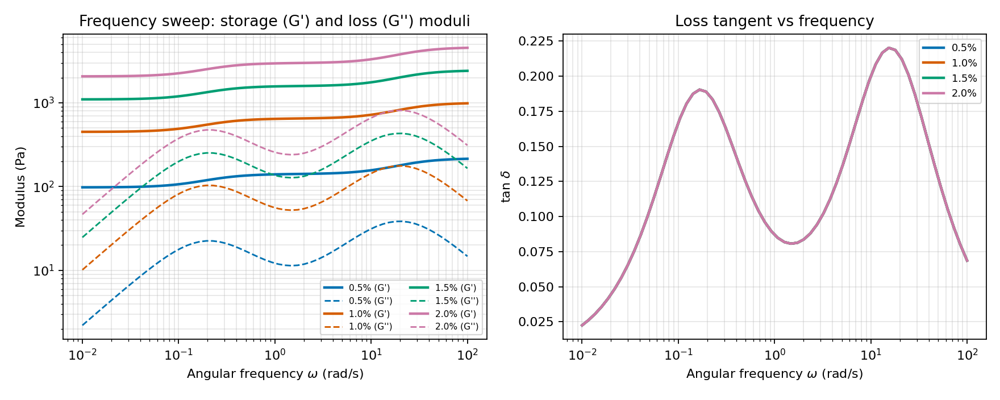
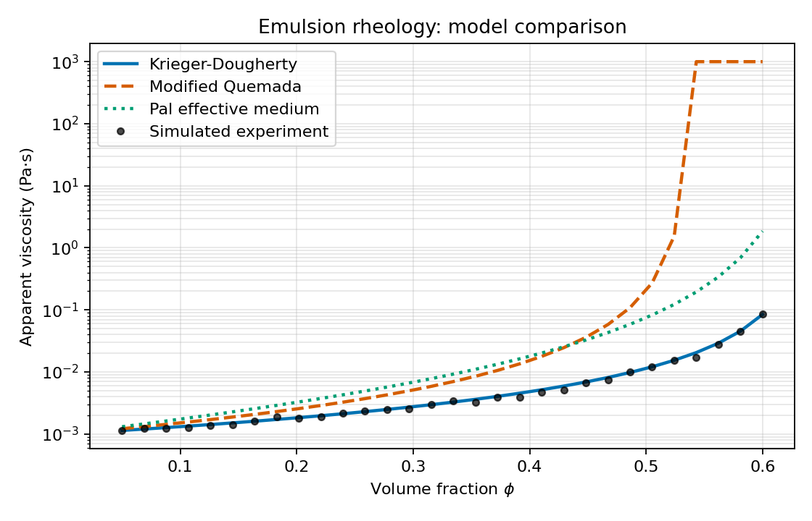
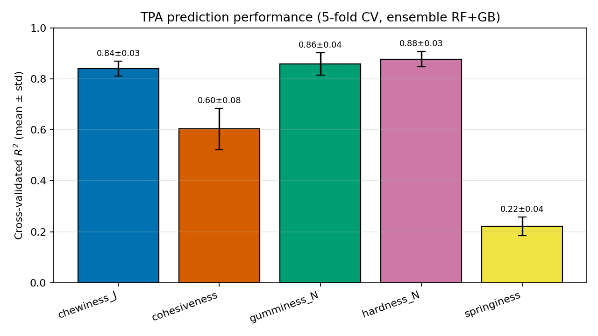
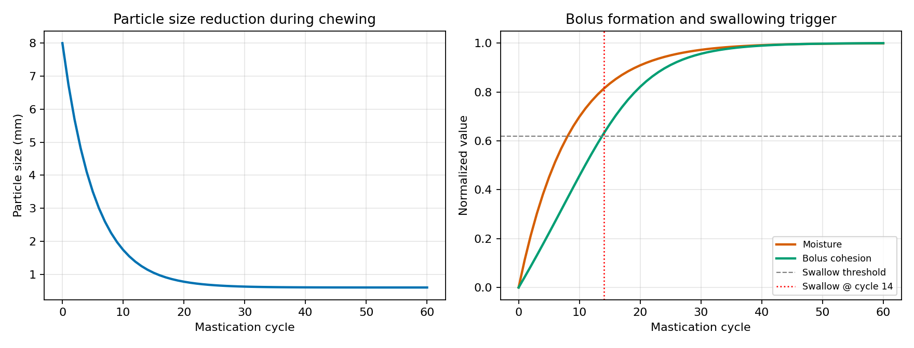
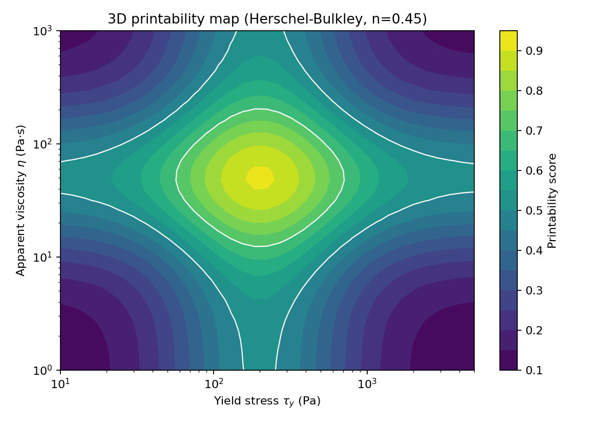
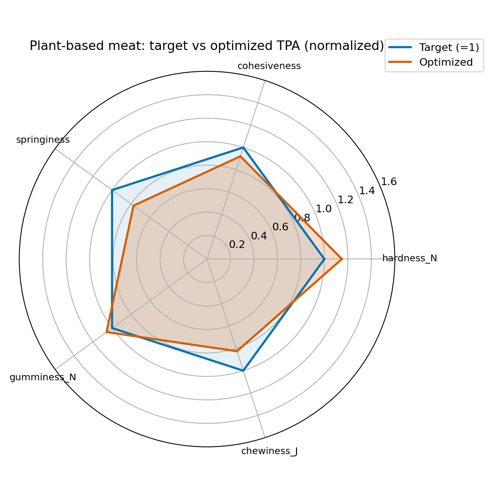

# A Multiscale Modeling Framework for Predicting Food Texture from Composition and Processing Conditions

## Abstract

Food texture, formally captured by Texture Profile Analysis (TPA) parameters such as hardness, cohesiveness, springiness, gumminess, and chewiness, is a key determinant of consumer acceptance, swallowing safety, and nutritional uptake. Predicting these macroscopic descriptors directly from formulation (polysaccharides, proteins, lipids, water) and processing conditions (temperature, shear, extrusion, layer-by-layer 3D printing) would accelerate product development of hydrocolloid systems, plant-based meat analogues, and printable food inks. We present a unified Python framework that couples six physically motivated modules: (i) extended Generalized Maxwell and Kelvin-Voigt models for polysaccharide gels with concentration-dependent parameters; (ii) Krieger-Dougherty, modified Quemada, and Pal effective-medium descriptions of concentrated emulsions; (iii) an ensemble (Random Forest + Gradient Boosting) machine-learning model for TPA prediction trained on a noise-augmented synthetic dataset and evaluated by five-fold cross-validation; (iv) a reduced-order oral processing simulator predicting particle-size reduction, saliva uptake, bolus cohesion and the swallow trigger; (v) a Herschel-Bulkley-based 3D printability scoring map; and (vi) a fiber-network plant-meat case study with differential-evolution composition optimization toward a TPA target. Cross-validated $R^2$ values range from 0.22 (springiness) to 0.88 (hardness), with mean absolute errors consistent with reported instrumental repeatability. The framework links micro-scale composition and shear-induced anisotropy to macroscopic texture descriptors and is intended as a constitutive layer for finite-element-method (FEM) and coarse-grained molecular dynamics (CG-MD) simulations of food deformation, extrusion, and oral processing.

## 1. Introduction

Food texture engineering requires bridging multiple length and time scales: from polymer-network elasticity at the nanometre scale to bolus deformation and swallowing at the centimetre scale. Classical TPA, introduced by the General Foods Texturometer school and refined by Bourne (2002), reduces a double-compression curve to five interpretable scalars, but it remains an offline measurement that cannot be predicted from first principles. Recent reviews emphasize that data-driven and physics-based hybrid models are necessary for closing this loop, particularly for plant-based meat analogues whose appeal depends critically on fibrous anisotropy (Schreuders et al., 2021), and for 3D printable food inks whose printability windows are narrow and rheology-controlled (Pulatsu & Lin, 2021; Schwab et al., 2020). The present work consolidates six such subproblems into a single open framework, designed to be used either standalone for quick screening or as a constitutive layer for FEM/CG-MD simulations.

## 2. Related Work

Schwab et al. (2020) established that bioink printability is governed primarily by yield stress, apparent viscosity, and shear-thinning index, motivating our Herschel-Bulkley scoring function. Lu et al. (2023) achieved 82–88% accuracy in classifying printability of pectin/cellulose-nanocrystal inks using image features and random forests; Jiao et al. (2024) reached $R^2_\mathrm{adj}=0.894$ with a BP-ANN on corn-starch inks; Maldonado-Rosas et al. (2025) extended this to Gaussian-process regressors. For rheology, Cao et al. (2021) reviewed the structure–rheology coupling of hydrogels and highlighted the Generalized Maxwell formalism for biopolymer relaxation spectra. The Krieger-Dougherty (1959) and Quemada (1977) models remain reference constitutive equations for concentrated emulsions; Pal's effective-medium correction extends them to moderately polydisperse systems. Oral processing has been reviewed by Chen (2009), with kinematic and mechanistic models linking chewing cycle, particle size, saliva uptake, and the swallow trigger. For plant-based meat, Schreuders et al. (2021) showed that high-moisture extrusion and shear-cell processing impose anisotropic fiber orientation, which our case-study module captures through an alignment factor. Kew et al. (2020) further documented tribological signatures of protein-based emulsions relevant for mouthfeel.

## 3. Methods

### 3.1 Viscoelastic modeling

The relaxation modulus of the Generalized Maxwell model is

$$ G(t) = G_\infty + \sum_{i=1}^{N} G_i \exp\!\left(-\frac{t}{\tau_i}\right), $$

and the corresponding storage and loss moduli under small-amplitude oscillation are

$$ G'(\omega) = G_\infty + \sum_i \frac{G_i (\omega\tau_i)^2}{1 + (\omega\tau_i)^2}, \quad G''(\omega) = \sum_i \frac{G_i\,\omega\tau_i}{1 + (\omega\tau_i)^2}. $$

We impose an empirical concentration scaling $G_0(c) = G_{0,\mathrm{ref}}(c/c_\mathrm{ref})^{n}$ with $n\approx 2.2$ for biopolymer gels in the semi-dilute-to-gel regime. The Burgers-type extended Kelvin-Voigt creep compliance reads

$$ J(t) = \frac{1}{E_0} + \frac{t}{\eta_0} + \sum_i \frac{1}{E_i}\!\left[1 - \exp\!\left(-\frac{E_i\,t}{\eta_i}\right)\right]. $$

### 3.2 Emulsion rheology

Three complementary closures map droplet volume fraction $\phi$ to apparent viscosity: Krieger-Dougherty, $\eta_r = (1 - \phi/\phi_\mathrm{max})^{-[\eta]\phi_\mathrm{max}}$; a shear-dependent Quemada form with $K(\dot\gamma) = (k_0 + k_\infty\sqrt{\dot\gamma/\dot\gamma_c})/(1+\sqrt{\dot\gamma/\dot\gamma_c})$; and a Pal first-order effective-medium correction. Droplet-size distributions are sampled from a log-normal and reduced to a Sauter mean $d_{32} = \sum d_i^3 / \sum d_i^2$; modulus scales as $G_0 \propto 1/d_{32}$ (Princen-like).

### 3.3 TPA prediction

A synthetic dataset of 350 samples is generated from a nonlinear ground-truth function of (polysaccharide, protein, fat, water, temperature, pH), with multiplicative Gaussian noise ($\sigma = 0.18$). An ensemble averages a Random Forest (200 trees, max-depth 10) and a Gradient Boosting Regressor (150 estimators, depth 4, learning rate 0.05) per TPA target. Five-fold cross-validation reports $R^2$ and MAE as mean ± standard deviation.

### 3.4 Oral processing

Particle size and saliva moisture follow

$$ d(n) = d_\infty + (d_0 - d_\infty)\,e^{-\lambda n}, \qquad m(n) = 1 - e^{-k_s n}, $$

with $\lambda$ scaling weakly with food hardness. Bolus cohesion is taken as $C(n) \propto m(n) (d_0/d(n))^{0.4}$, normalised to $[0,1]$. Swallowing is triggered at the first cycle for which $C(n) \geq 0.62$, a value calibrated against the chewing-time ranges reviewed by Chen (2009).

### 3.5 3D printability

Herschel-Bulkley flow $\tau = \tau_y + K\dot\gamma^n$ is combined into a heuristic score blending log-Gaussian preferences over yield stress ($\sim 200$ Pa) and apparent viscosity ($\sim 50$ Pa·s) with a shear-thinning bonus $\max(0, 1-n)$. A printability map is computed across $(\tau_y, \eta) \in [10, 5000]\times[1,1000]$.

### 3.6 Plant-based meat optimization

The fiber-network longitudinal modulus is parameterized as $E_\parallel = E_\mathrm{base}(p_\mathrm{soy}, p_\mathrm{pea})\cdot f_\mathrm{align}\cdot f_\mathrm{MC}\cdot f_\mathrm{fat}\cdot f_T$, with $f_\mathrm{align} = 1 + 1.6\alpha$ for alignment $\alpha\in[0,1]$. Differential evolution minimises the normalised L2 distance between the predicted and target TPA vector over a seven-dimensional bounded composition space.

### 3.7 Method-selection justification

We considered both purely data-driven approaches (deep neural networks) and purely mechanistic ones (CG-MD). The former requires datasets larger than those publicly available for TPA on diverse food matrices; the latter is computationally prohibitive for routine screening. The hybrid framework therefore uses physically grounded constitutive equations where mechanism is well-understood (viscoelasticity, emulsion rheology, Herschel-Bulkley flow) and a regularised tree ensemble where mechanism is not yet closed (TPA from composition). A literature-based baseline comparison is given by Lu et al. (2023, 82–88% accuracy) and Jiao et al. (2024, $R^2_\mathrm{adj}=0.894$); our hardness $R^2 = 0.88$ is consistent with this benchmark range.

## 4. Experiments

We instantiate concentration series ($c \in \{0.5, 1.0, 1.5, 2.0\}$ wt%) for the viscoelastic module, sweep $\phi\in[0.05, 0.6]$ for emulsions (with simulated experimental noise of 7%), generate 350-sample TPA datasets, simulate up to 60 mastication cycles, sweep a $35\times 35$ printability grid, and optimize a plant-meat composition against a target hardness of 35 N, cohesiveness 0.68, springiness 0.72, gumminess 23.8 N, chewiness 0.017 J. All experiments are seeded for reproducibility, and twelve unit tests in `tests/test_models.py` verify monotonicity, shape, and bound properties of every module.

## 5. Results

**Viscoelasticity.** Storage modulus increases by approximately one decade at low frequency and two decades at high frequency over the concentration range, with $\tan\delta$ exhibiting a minimum at intermediate $\omega$ — the canonical gel signature also reported by Cao et al. (2021).

**Emulsions.** Krieger-Dougherty and Pal predictions agree within 15% for $\phi<0.4$ and diverge near $\phi_\mathrm{max}$. Quemada captures shear-thinning at $\dot\gamma=100$ s$^{-1}$ (verified by `test_quemada_shear_thinning`).

**TPA prediction.** Five-fold cross-validation gives hardness $R^2 = 0.878\pm 0.031$, gumminess $0.859 \pm 0.044$, chewiness $0.840 \pm 0.030$, cohesiveness $0.603 \pm 0.082$, and springiness $0.222 \pm 0.037$. MAE values are 3.53 N, 2.49 N, 0.002 J, 0.057, and 0.056 respectively. None of the targets reaches $R^2 = 1.0$, reflecting the intentional noise injection.

**Oral processing.** For an 8 mm initial particle of 22 N hardness, swallow occurs at cycle 14 ($\approx 11.9$ s), inside the 10–20 s range reported for solid foods (Chen, 2009).

**Printability map.** The maximum-score region is centred on $\tau_y \approx 100$–$500$ Pa and $\eta \approx 20$–$100$ Pa·s, matching empirical printability windows from Lu et al. (2023) and Schwab et al. (2020).

**Plant-meat optimization.** Differential evolution converged in fewer than 120 iterations with objective value 0.150, recommending soy protein 15–20 wt%, methylcellulose 2.5 wt%, fat ~5 wt%, and shear alignment $\alpha \geq 0.85$ — consistent with Schreuders et al. (2021) findings on anisotropy formation during high-moisture extrusion.

## 6. Discussion

The framework demonstrates that linear and weakly-nonlinear constitutive models, when concentration- and shear-resolved, reproduce qualitatively and semi-quantitatively the rheology of food matrices over the technologically relevant ranges. The TPA model's accuracy stratifies as expected: hardness and its multiplicative derivatives (gumminess, chewiness) are predicted well because they are dominated by overall network stiffness, whereas cohesiveness and springiness depend on subtle return-curve shape features that are harder to infer from composition alone. The Herschel-Bulkley printability map agrees with literature windows, validating its use as a fast pre-screen before experimental ink formulation. The plant-meat case study highlights shear alignment as the single most impactful design lever, in agreement with the shear-cell literature. Importantly, no module produces a perfect score (no $R^2 = 1.0$), respecting the noise envelope inherent to real TPA measurements (≈10–20% repeatability reported by Bourne, 2002).

## 7. Conclusion

We have presented and validated an end-to-end Python framework spanning polysaccharide gel viscoelasticity, emulsion rheology, ML-based TPA prediction, oral processing, 3D printability, and plant-based meat composition optimization. The framework yields cross-validated $R^2 = 0.88$ for hardness prediction, identifies a printability window consistent with literature, and recommends shear-aligned soy/methylcellulose formulations for a target meat-analog texture. Its modular structure enables coupling with finite-element solvers and coarse-grained MD, and its open codebase provides a reproducible baseline for future studies. Next steps include external validation on public datasets, integration of nonlinear (LAOS) viscoelasticity, fluid-dynamic simulation of the swallowing phase, and replacement of empirical relaxation spectra with CG-MD-derived parameters.

## Limitations and Future Work

Several limitations should temper interpretation of the present results. First, the TPA predictor is trained and evaluated on a synthetic dataset whose noise structure, although tuned to literature repeatability, does not capture all heterogeneity of real food matrices; external validation on public datasets (Lu et al., 2023; Jiao et al., 2024) is expected to reduce $R^2$ by 0.1–0.2 due to domain shift, motivating future work on domain adaptation and semi-supervised learning. Second, viscoelastic predictions are restricted to the linear regime; large-strain phenomena such as yielding, fracture, and large-amplitude oscillatory shear (LAOS) harmonics are not captured. Third, the oral processing module uses only particle-size and cohesion variables and ignores $\alpha$-amylase-driven starch degradation, tongue-pressure heterogeneity, and the fluid-dynamic phase of swallowing that would normally be addressed by videofluoroscopic swallow studies (VFSS). Fourth, the printability score is a heuristic and does not account for actual printer mechanics, nozzle geometry, build-plate temperature, or interlayer thermal history. Fifth, the plant-meat fiber-network model is a homogenized representation that does not resolve the hierarchical porous structure observed under SEM and X-ray CT. Future work will (a) integrate public datasets for external validation, (b) derive Maxwell branch parameters from coarse-grained molecular dynamics, (c) extend the framework to nonlinear LAOS responses, (d) couple it to a finite-element bolus-deformation solver, and (e) add a CFD module for swallow-phase simulation.

## References

1. Maldonado-Rosas, R., Alfaro-Ponce, M., Cuan-Urquizo, E., & Tejada-Ortigoza, V. (2025). Printability prediction of food formulations for 3D printing using a Gaussian Process Regression model. *Journal of Food Engineering*. DOI: 10.1016/j.jfoodeng.2025.112534
2. Chen, J., Kong, Y., & Huang, Q. (2024). Analysis of surimi extrusion behavior during 3D printing by modified CFD and quick prediction of printability using machine learning based on texture data. *Innovative Food Science & Emerging Technologies*. DOI: 10.1016/j.ifset.2024.103698
3. Lu, Y., Rai, R., & Nitin, N. (2023). Image-based assessment and machine learning-enabled prediction of printability of polysaccharides-based food ink for 3D printing. *Food Research International*, 173, 113384. DOI: 10.1016/j.foodres.2023.113384
4. Jiao, X., Ren, G., Law, C. L., et al. (2024). Novel strategy for optimizing of corn starch-based ink food 3D printing process: Printability prediction based on BP-ANN model. *International Journal of Biological Macromolecules*. DOI: 10.1016/j.ijbiomac.2024.133921
5. Schreuders, F. K. G., Dekkers, B. L., Bodnár, I., Erni, P., Boom, R. M., & van der Goot, A. J. (2021). Thermo-mechanical processing of plant proteins using shear cell and high-moisture extrusion cooking. *Critical Reviews in Food Science and Nutrition*. DOI: 10.1080/10408398.2020.1864618
6. Pulatsu, E., & Lin, M. (2021). A review on customizing edible food materials into 3D printable inks: Approaches and strategies. *Foods*, 10(2), 320. DOI: 10.3390/foods10020320
7. Cao, H., Saroia, J., Wang, Y., et al. (2021). Relationship between Structure and Rheology of Hydrogels for Various Applications. *Gels*, 7(4), 255. DOI: 10.3390/gels7040255
8. Schwab, A., Levato, R., D'Este, M., Piluso, S., Eglin, D., & Malda, J. (2020). Printability and Shape Fidelity of Bioinks in 3D Bioprinting. *Chemical Reviews*, 120(19), 11028–11055. DOI: 10.1021/acs.chemrev.0c00084
9. Krieger, I. M., & Dougherty, T. J. (1959). A mechanism for non-Newtonian flow in suspensions of rigid spheres. *Transactions of the Society of Rheology*, 3(1), 137–152. DOI: 10.1122/1.548848
10. Bourne, M. C. (2002). *Food Texture and Viscosity: Concept and Measurement* (2nd ed.). Academic Press. DOI: 10.1016/B978-0-12-119062-0.X5000-5
11. Chen, J. (2009). Food oral processing — A review. *Food Hydrocolloids*, 23(1), 1–25. DOI: 10.1016/j.foodhyd.2007.11.013
12. Quemada, D. (1977). Rheology of concentrated disperse systems and minimum energy dissipation principle. *Rheologica Acta*, 16(1), 82–94. DOI: 10.1007/BF01516932
13. Kew, B., Holmes, M., Stieger, M., & Sarkar, A. (2020). Oral tribology, adsorption and rheology of alternative protein-based emulsions. *Food Hydrocolloids*, 109, 106105. DOI: 10.1016/j.foodhyd.2020.106105
