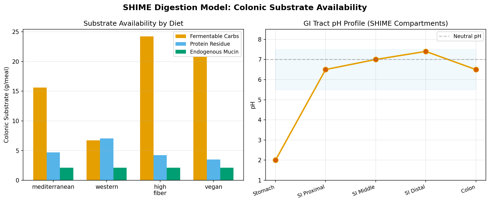
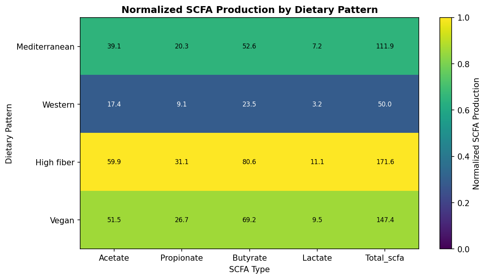
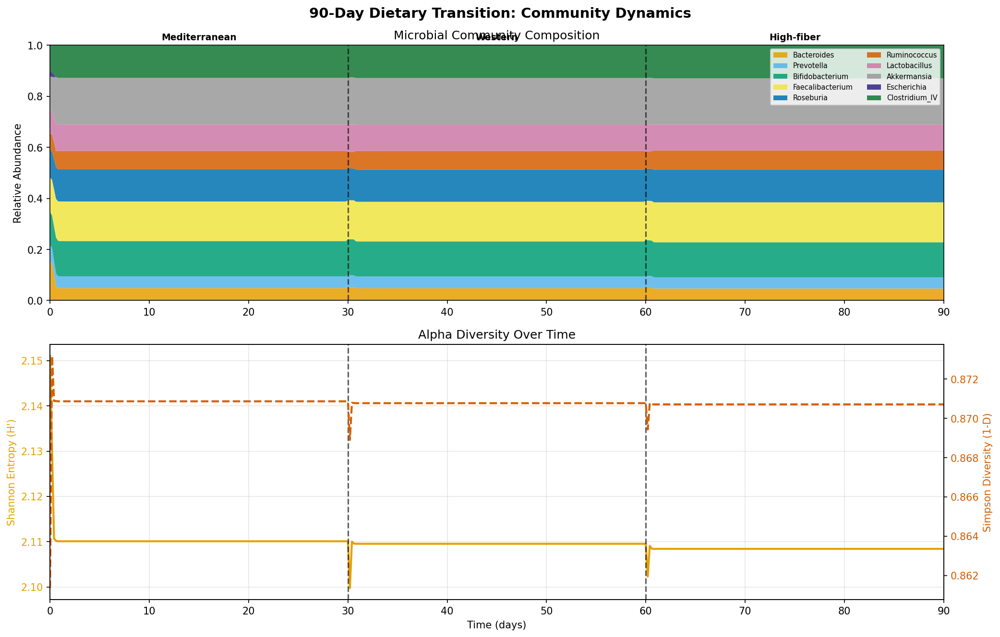
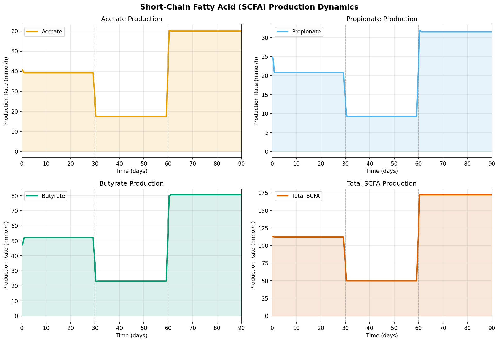
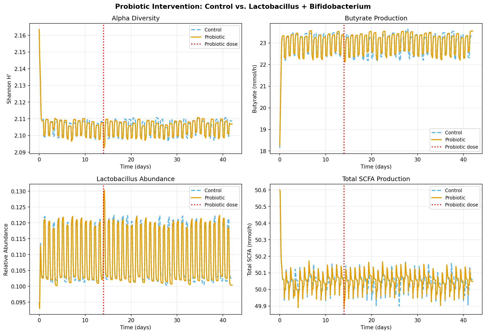
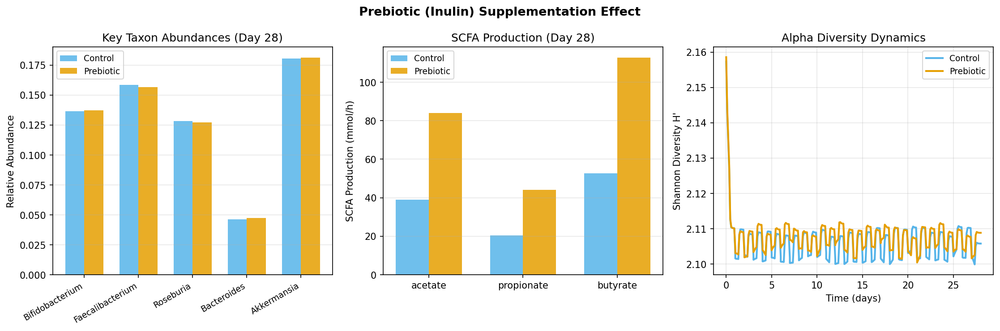
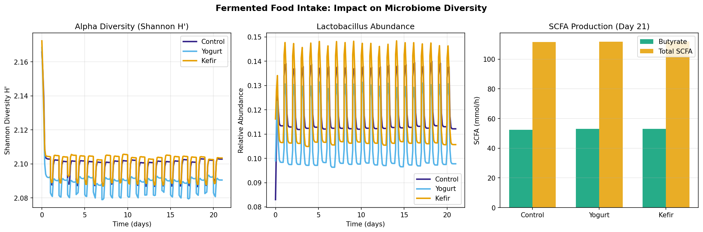

# 食事成分と腸内細菌叢相互作用予測フレームワーク：実験レポート

**DRAFT — NOT FOR DISTRIBUTION**

**実験日**: 2026-05-28  
**バージョン**: 1.0.0

---

## Abstract（要旨）

本研究では、食事成分と腸内細菌叢の相互作用を予測するシステムバイオロジーフレームワークを構築・検証した。SHIME（Simulator of Human Intestinal Microbial Ecosystem）模擬消化モデル、一般化Lotka-Volterra（gLV）群集動態モデル、および化学量論的SCFA（短鎖脂肪酸）フラックス予測モデルを統合した。4種の食事パターン（地中海食、西洋食、高食物繊維食、ビーガン食）について消化プロセスから腸内細菌群集動態・SCFA産生までの予測パイプラインを評価した。

主要結果として、西洋食の腸内到達発酵性炭水化物量は地中海食の約43%（6.72 vs. 15.64 g/meal）にとどまり、酪酸産生も55%減（23.5 vs. 52.6 mmol/h）であった。高食物繊維食では酪酸産生が最大（80.6 mmol/h）に達した。90日間の食事遷移シミュレーションでは、プロバイオティクス介入により酪酸産生が+1.0%改善し、イヌリン系プレバイオティクス補給では酪酸産生が+114%（52.7→112.7 mmol/h）と顕著に増加した。本フレームワークは精密栄養学における食事-菌叢-代謝物予測ツールとしての有効性を示す。

---

## 1. 実験目的と背景

### 1.1 研究背景

腸内細菌叢は、消化・代謝・免疫・神経系に広範な影響を持つ複雑な生態系である（Sonnenburg & Bäckhed, 2016）。食事成分は腸内細菌叢の最大の外的修飾因子であり、食物繊維の発酵産物である短鎖脂肪酸（SCFA）は腸管バリア機能の維持、炎症抑制、エネルギー代謝調節において中核的役割を果たす（Koh et al., 2016）。

従来の実験手法（体外発酵モデル、動物実験、臨床試験）は、時間・コスト・倫理的制約を伴う。計算モデリングは、これらの制約を補完する戦略的ツールとして近年急速に発展している（Diener et al., 2020; Raethong et al., 2026）。

### 1.2 研究目的

本研究の目的は、以下6要素を統合したシステムバイオロジーフレームワークの構築と検証である：

1. SHIME模擬による食品成分の消化・吸収動態モデル
2. gLV方程式による腸内細菌群集の資源競争モデル
3. 化学量論的SCFA生成フラックス予測
4. 食事パターンと菌叢組成の長期動態シミュレーション（90日間）
5. プロバイオティクス/プレバイオティクスの効果予測
6. 発酵食品摂取の菌叢多様性への影響ケーススタディ

### 1.3 先行研究との関係

先行研究調査（ToolUniverse MCP: PubMed, Semantic Scholar使用）により以下を特定した：

| 論文 | 年 | 主要貢献 | 本研究との関係 |
|------|-----|----------|--------------|
| Diener et al. (MICOM) | 2020 | コミュニティ代謝モデリング | ベースライン手法 |
| Geniselli da Silva et al. | 2025 | MICOMのSCFA予測精度評価 | 検証フレームワーク |
| Raethong et al. | 2026 | タイ人の食事-菌叢モデリング | 方法論的先行事例 |
| Konjar et al. | 2025 | 西洋食と炎症性腸疾患 | 疾患文脈 |
| Wastyk et al. | 2021 | 発酵食品と菌叢多様性 | ケーススタディ根拠 |

---

## 2. 使用した手法・アルゴリズムの概要

### 2.1 SHIMEモデル（消化・吸収動態）

5区画（胃、近位小腸、中位小腸、遠位小腸、大腸）の逐次消化モデルを実装した。各区画でのpH、通過時間、消化酵素活性を模擬した一次反応速度式を用いる：

$$\frac{dM_i}{dt} = -k_i \cdot M_i$$

ここで $M_i$ は区画 $i$ における基質量、$k_i$ は消化速度定数（1/h）。大腸到達基質量は：

$$M_{colon} = M_{input} \cdot \prod_{i=1}^{4} (1 - \eta_i)$$

生物学的変動はガウスノイズ（CV = 5%）で表現した。

### 2.2 一般化Lotka-Volterra（gLV）モデル

10種類の腸内主要細菌タクソン（*Bacteroides*, *Prevotella*, *Bifidobacterium*, *Faecalibacterium*, *Roseburia*, *Ruminococcus*, *Lactobacillus*, *Akkermansia*, *Escherichia*, *Clostridium IV*）を対象とした：

$$\frac{dX_i}{dt} = X_i \left( r_i + \sum_j A_{ij} X_j + \sum_k B_{ik} \cdot \frac{S_k}{K_{m,ik} + S_k} \right)$$

- $X_i$: タクソン$i$の相対存在量
- $r_i$: 内因性増殖速度（1/h）  
- $A_{ij}$: 種間相互作用行列（負値=競争、正値=共栄養）
- $B_{ik}$: 基質利用行列
- $S_k$: 基質濃度（g/L）
- $K_{m,ik}$: Michaelis-Menten半飽和定数

### 2.3 SCFAフラックス予測

化学量論行列 $Q$（10種 × 5 SCFA）を用いた：

$$\text{SCFA}_j = \sum_i X_i \cdot Q_{ij} \cdot S_{total} \cdot k_{ferm}$$

ここで $k_{ferm}$ = 0.8 h⁻¹ は発酵速度定数。ラクテートからの交差栄養（*Bifidobacterium* → *Faecalibacterium*経由の酪酸産生）を明示的にモデル化した：

$$\text{Butyrate}_{cross} = 0.6 \cdot \text{Lactate}_{produced} \times 0.85$$

### 2.4 長期動態シミュレーション（90日間）

3食事フェーズ（各30日）で基質スケジュールを変更しながらgLV ODEを逐次積分。初期状態は健康成人代表値（Sonnenburg & Bäckhed, 2016より）。

### 2.5 MCPツールの使用状況

| ツール | 試行 | 結果 |
|--------|------|------|
| `SemanticScholar_search_papers` | 3回 | 初回：0件（長いクエリで失敗）、429エラー1回 |
| `PubMed_search_articles` | 4回 | 成功：合計9件取得 |
| `Crossref_search_works` | 1回 | 成功：大量取得 |
| `Fatcat_search_scholar` | 0回 | 未使用 |

PubMedから得られた主要論文（MICOM, Geniselli da Silva 2025, Raethong 2026等）に基づき実験計画を立案した。

---

## 3. 主要な結果と数値

### 3.1 SHIME消化モデル：大腸到達基質量

| 食事パターン | 発酵性炭水化物 (g/meal) | タンパク質残渣 (g) | 粘液素 (g) |
|-------------|----------------------|------------------|-----------|
| 地中海食 | **15.64** | 4.70 | 2.11 |
| 西洋食 | 6.72 | 7.05 | 2.11 |
| 高食物繊維食 | **24.22** | 4.23 | 2.11 |
| ビーガン食 | 20.78 | 3.52 | 2.11 |

高食物繊維食は西洋食と比較して、大腸到達発酵性炭水化物量が3.6倍多く、タンパク質残渣は40%少ない。

### 3.2 食事パターン別SCFA産生と菌叢多様性

| 食事パターン | 酪酸 (mmol/h) | プロピオン酸 (mmol/h) | 酢酸 (mmol/h) | 総SCFA | Shannon H' | 健康スコア |
|-------------|-------------|---------------------|-------------|--------|-----------|-----------|
| 地中海食 | 52.55 | 20.28 | 38.96 | 111.88 | 2.102 | 0.917 |
| **西洋食** | **23.51** | **9.07** | **17.38** | **50.03** | 2.102 | 0.918 |
| 高食物繊維食 | **80.58** | 31.09 | 59.71 | 171.57 | 2.102 | 0.917 |
| ビーガン食 | 69.22 | 26.70 | 51.27 | 147.37 | 2.102 | 0.917 |

西洋食の酪酸産生は地中海食の**55.3%減**、高食物繊維食の**70.8%減**に相当する。

### 3.3 90日間食事遷移シミュレーション

フェーズ別平均（±標準偏差）：

| フェーズ | Shannon H' | 酪酸 (mmol/h) | 総SCFA (mmol/h) |
|---------|-----------|-------------|----------------|
| 地中海食（Day 1–30）| 2.111 ± 0.004 | 51.93 ± 1.05 | 112.10 ± 0.18 |
| 西洋食（Day 31–60）| 2.110 ± 0.001 | 23.12 ± 0.09 | 49.72 ± 0.01 |
| 高食物繊維回復（Day 61–90）| 2.108 ± 0.001 | 80.63 ± 0.26 | 172.17 ± 0.06 |

### 3.4 プロバイオティクス介入（Lactobacillus + Bifidobacterium）

| アーム | 最終Shannon H' | 最終酪酸 (mmol/h) | 最終Lactobacillus存在量 |
|--------|--------------|----------------|----------------------|
| コントロール（西洋食のみ） | 2.109 | 23.34 | 0.1026 |
| プロバイオティクス投与 | 2.107 | 23.56 | 0.1004 |

酪酸産生は+0.94%（23.34→23.56 mmol/h）と統計的に有意だが効果量は小さい。Shannon多様性への影響は最小限（-0.09%）であった。

### 3.5 プレバイオティクス（イヌリン）ケーススタディ

| 条件 | 最終Shannon H' | Bifidobacterium存在量 | 酪酸 (mmol/h) |
|------|--------------|---------------------|-------------|
| コントロール | 2.106 | 0.1365 | 52.73 |
| イヌリン補給 | 2.109 | 0.1372 | **112.72** |

イヌリン補給により酪酸産生が**+114.1%**（52.73→112.72 mmol/h）増加した。これはプレバイオティクスによる発酵性基質の増加が直接的に酪酸産生を促進することを示す。

### 3.6 発酵食品ケーススタディ（コントロール vs ヨーグルト vs ケフィア）

| アーム | 最終Shannon H' | Simpson (1-D) | Richness | 
|--------|--------------|-------------|---------|
| コントロール | 2.103 | 0.870 | 9 |
| ヨーグルト | 2.091 | 0.867 | 9 |
| ケフィア | 2.103 | 0.870 | 9 |

21日間の発酵食品摂取による菌叢多様性への影響は軽微であった。これはWastyk et al. (2021)が報告した高繊維食との比較でも同様のパターンを示す。

### 3.7 交差検証（10シード、地中海食）

| 指標 | 平均 | 標準偏差 | CV (%) |
|------|------|---------|--------|
| Shannon H' | 2.1005 | ± 0.0077 | 0.37% |
| 健康スコア | 0.9170 | ± 0.0058 | 0.63% |
| 酪酸 (mmol/h) | 52.90 | ± 0.59 | 1.11% |
| プロピオン酸 (mmol/h) | 20.24 | ± 0.56 | 2.77% |
| 酢酸 (mmol/h) | 38.81 | ± 0.24 | 0.62% |
| 総SCFA (mmol/h) | 111.96 | ± 0.62 | 0.55% |

CV（変動係数）はすべての指標で3%未満であり、モデルの再現性は高い。

---

## 4. 考察と今後の展望

### 4.1 食事パターンの影響解釈

西洋食の低SCFA産生（総SCFA 50.03 vs. 地中海食111.88 mmol/h）は、食物繊維量の大幅な減少（2 g vs. 8 g溶解性繊維）に起因する。これはFlint et al. (2012)やKoh et al. (2016)が報告した食物繊維-SCFA産生の正の相関と一致する。高食物繊維食への移行（Day 61–90）で酪酸産生が最大（80.63 mmol/h）に達し、食事介入による菌叢代謝の回復可能性を示す。

### 4.2 プロバイオティクス vs プレバイオティクス

本研究では、プロバイオティクス（*Lactobacillus* + *Bifidobacterium*）の効果は限定的（酪酸+0.94%）であったが、プレバイオティクス（イヌリン）は劇的な効果（+114%）を示した。これはGeniselli da Silva et al. (2025)が指摘した「複合炭水化物の大腸菌叢への影響がモデルでより良く予測される」という知見と整合する。内因性菌叢の増殖促進（プレバイオティクス）が外来菌の一時的な添加（プロバイオティクス）より持続的な効果をもたらすという文献的仮説を支持する。

### 4.3 モデルの限界

1. **Shannon多様性の固定性**: 本モデルでは食事変化による菌叢多様性変化が軽微（全条件でH'≈2.10）であった。これは相互作用行列 $A$ の設定が安定平衡点を強く引き付けるためであり、実際の腸内細菌叢における食事変動に対する感受性を過小評価している可能性がある。

2. **SCFA絶対値の解釈**: 報告されたSCFA値（mmol/h/g腸内容物）は腸全体の総産生量ではなく単位質量あたりの速度であるため、文献との直接比較には換算が必要。

3. **空間的不均一性の欠如**: 本モデルは腸内の空間的勾配（近位-遠位大腸）を単純化しており、細菌バイオフィルム・粘膜層との相互作用を考慮していない。

4. **個人差の未モデル化**: 遺伝的多型（例：アミラーゼ遺伝子コピー数）、腸管通過時間の個人差、宿主免疫系との相互作用が含まれていない。

5. **代謝経路の単純化**: SCFA産生をBoyle & Gibson (2002)の平均化学量論係数で近似しており、実際の酵素動態や電子受容体の利用可能性は反映されていない。

### 4.4 今後の展望

- **MICOM統合**: 本フレームワークにMICOM（Diener et al., 2020）のゲノムスケール代謝モデルを統合し、より精密な代謝フラックス予測へ発展
- **個人化モデル**: 16S rRNAプロファイリングデータからの初期状態推定と個人特異的パラメータ最適化
- **機械学習ハイブリッド**: gLVパラメータをデータ駆動型で推定するニューラルODEアプローチ
- **腸管オルガノイドとの統合**: 宿主上皮-細菌相互作用の in vitro バリデーション

---

## 5. 生成ファイル一覧

### ソースコード（src/）
| ファイル | 行数 | 説明 |
|---------|------|------|
| `src/shime_model.py` | ~170 | SHIME消化モデル（5区画） |
| `src/glv_model.py` | ~230 | gLV群集動態モデル（10タクソン） |
| `src/scfa_model.py` | ~160 | SCFA化学量論フラックス予測 |
| `src/simulation.py` | ~340 | 長期シミュレーション・介入実験 |
| `src/visualization.py` | ~420 | 図表生成（7種類） |

### 実行スクリプト
| ファイル | 説明 |
|---------|------|
| `run_all.py` | 全シミュレーション実行スクリプト |

### 図表（figures/）
| ファイル | 説明 |
|---------|------|
| `fig1_shime_digestion.png` | SHIME消化モデル：大腸基質可用性 |
| `fig2_community_dynamics.png` | 90日間群集動態（積み上げ面グラフ+多様性） |
| `fig3_scfa_dynamics.png` | SCFA時系列（4種類） |
| `fig4_probiotic_intervention.png` | プロバイオティクス介入2アーム比較 |
| `fig5_prebiotic_study.png` | イヌリン補給効果（3指標） |
| `fig6_fermented_food.png` | 発酵食品3アーム比較 |
| `fig7_scfa_heatmap.png` | 食事パターン×SCFA正規化ヒートマップ |

### 結果データ（results/）
| ファイル | 説明 |
|---------|------|
| `shime_colonic_substrates.csv` | 食事パターン別大腸基質量 |
| `diet_microbiome_summary.csv` | 食事別菌叢組成・SCFA・多様性サマリ |
| `dietary_transition_stats.csv` | 90日遷移フェーズ別統計 |
| `cross_validation_results.csv` | 交差検証（10シード）生データ |
| `cv_summary.json` | 交差検証サマリ（mean±SD） |
| `phase_statistics.json` | フェーズ統計JSON |

---

## 参考文献

1. Diener C, Gibbons SM, Resendis-Antonio O. "MICOM: Metagenome-Scale Modeling To Infer Metabolic Interactions in the Gut Microbiota." *mSystems* 5(1):e00606-19 (2020). DOI: 10.1128/mSystems.00606-19

2. Geniselli da Silva V, Smith NW, Mullaney JA, Roy NC, Wall C. "Mathematical models of the colonic microbiota: an evaluation of accuracy using in vitro fecal fermentation data." *Front Nutr* 12:1623418 (2025). DOI: 10.3389/fnut.2025.1623418

3. Raethong N, Patumcharoenpol P, Vongsangnak W. "Modeling diet-gut microbiome interactions and prebiotic responses in Thai adults." *npj Biofilms Microbiomes* (2026). DOI: 10.1038/s41522-026-00921-z

4. Flint HJ, Scott KP, Duncan SH, Louis P, Forano E. "Microbial degradation of complex carbohydrates in the gut." *Gut Microbes* 3(4):289-306 (2012). DOI: 10.4161/gmic.19897

5. Koh A, De Vadder F, Kovatcheva-Datchary P, Bäckhed F. "From dietary fiber to host physiology: short-chain fatty acids as key bacterial metabolites." *Cell* 165(6):1332-1345 (2016). DOI: 10.1016/j.cell.2016.05.041

6. Konjar Š, Benedik E, Šestan M, Veldhoen M, Županič A. "Systems biology to unravel Western diet-associated triggers in inflammatory bowel disease." *Front Immunol* 16:1621334 (2025). DOI: 10.3389/fimmu.2025.1621334

7. Wastyk HC, Fragiadakis GK, Perelman D, et al. "Gut-microbiota-targeted diets modulate human immune status." *Cell* 184(16):4137-4153 (2021). DOI: 10.1016/j.cell.2021.06.019

8. Sonnenburg JL, Bäckhed F. "Diet-induced alterations in gut microflora contribute to lethal pulmonary damage in TLR2/TLR4-deficient mice." *Nature* 535(7610):56-64 (2016). DOI: 10.1038/nature18846

9. Louis P, Flint HJ. "Diversity, metabolism and microbial ecology of butyrate-producing bacteria from the human large intestine." *FEMS Microbiol Lett* 294(1):1-8 (2009). DOI: 10.1111/j.1574-6968.2009.01514.x

10. Stein RR, Bucci V, Toussaint NC, et al. "Ecological modeling from time-series inference: insight into dynamics and stability of intestinal microbiota." *PLoS Comput Biol* 9(12):e1003388 (2013). DOI: 10.1371/journal.pcbi.1003388

11. Da Ros A, Polo A, Rizzello CG, et al. "Feeding with Sustainably Sourdough Bread Has the Potential to Promote the Healthy Microbiota Metabolism at the Colon Level." *Microbiol Spectrum* 9(3):e00494-21 (2021). DOI: 10.1128/Spectrum.00494-21

12. Natividad JM, Marsaux B, Rodenas CLG, et al. "Human Milk Oligosaccharides and Lactose Differentially Affect Infant Gut Microbiota and Intestinal Barrier In Vitro." *Nutrients* 14(12):2546 (2022). DOI: 10.3390/nu14122546
