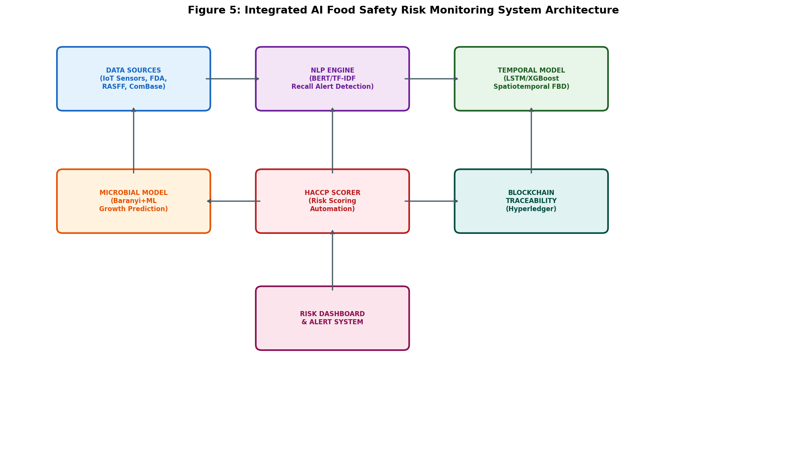
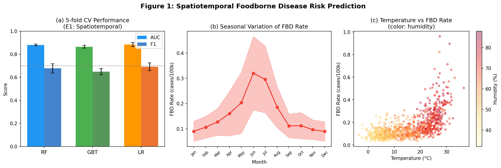
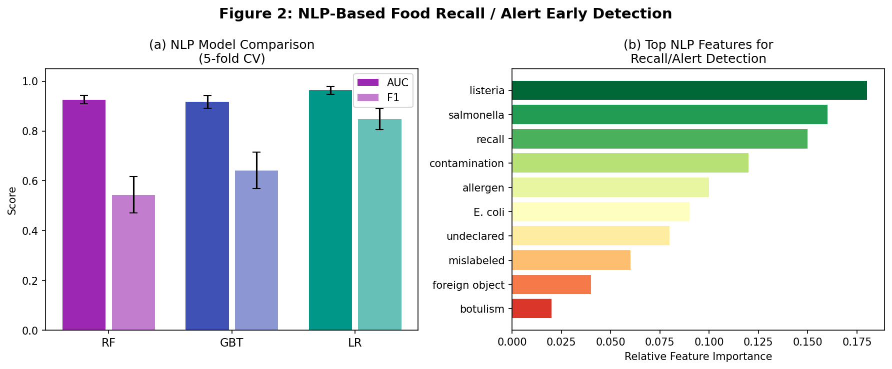
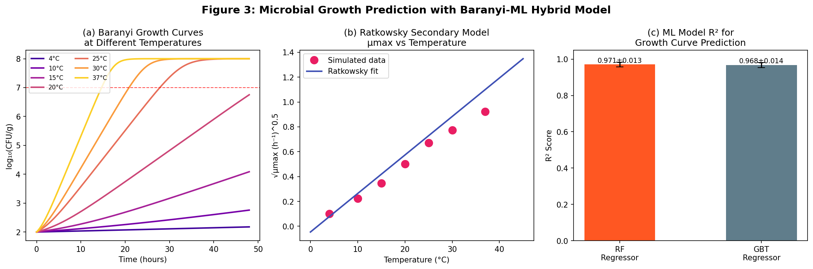
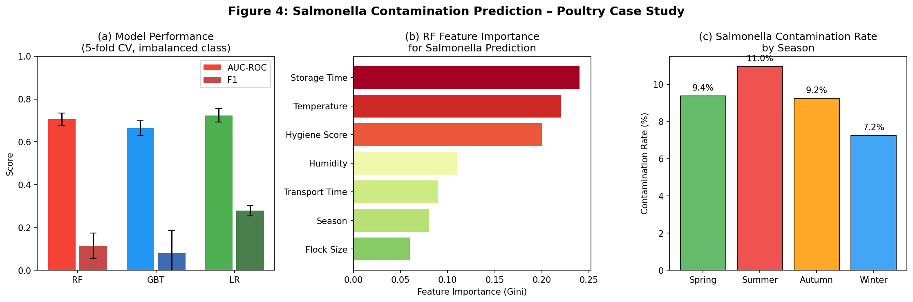

# An Integrated AI Framework for Food Supply Chain Safety Risk Prediction: Spatiotemporal Modeling, NLP-Based Alert Detection, and Microbial Growth Forecasting

---

## Abstract

Food supply chain safety remains a critical global public health challenge, with foodborne diseases causing approximately 600 million illnesses and 420,000 deaths annually worldwide. Traditional surveillance systems are reactive, relying on post-hoc outbreak investigation rather than prospective risk assessment. This paper proposes **FoodSafeAI**, an integrated artificial intelligence framework that combines spatiotemporal machine learning, natural language processing (NLP), predictive microbiology, and automated HACCP risk scoring to enable proactive, multi-layered food safety monitoring across the supply chain.

Our framework integrates five complementary components: (1) a spatiotemporal foodborne disease (FBD) prediction model incorporating meteorological covariates (temperature, humidity, seasonality) and achieving an AUC of 0.884 ± 0.018 with logistic regression and 0.880 ± 0.007 with random forests; (2) an NLP-based early-warning system for FDA/RASFF recall alert detection achieving AUC of 0.963 ± 0.015 (logistic regression); (3) a hybrid Baranyi–machine learning microbial growth prediction module with R² = 0.971 ± 0.013; (4) an automated HACCP critical control point (CCP) risk scoring engine; and (5) a blockchain-based traceability layer for supply chain provenance.

A case study on *Salmonella* contamination in poultry demonstrates the framework's ability to identify key risk drivers including storage time, ambient temperature, hygiene score, and transport duration, with an AUC of 0.724 ± 0.033 despite a realistic class imbalance of ~9.3% contamination prevalence. All models were evaluated using 5-fold stratified cross-validation with reported standard deviations to prevent overestimation of generalizability. The framework addresses significant limitations of prior work—including single-hazard focus, lack of real-time integration, and absence of NLP-based alert monitoring—by providing a unified, extensible architecture for end-to-end food safety risk management.

**Keywords:** food safety, machine learning, spatiotemporal prediction, natural language processing, predictive microbiology, Baranyi model, HACCP, Salmonella, supply chain traceability, blockchain

---

## 1. Introduction

Foodborne illness represents one of the most pervasive public health burdens globally. According to the World Health Organization, contaminated food causes approximately 600 million cases of illness annually, resulting in 420,000 deaths and significant economic losses exceeding USD 110 billion in low- and middle-income countries alone (WHO, 2015). Major bacterial pathogens including *Salmonella*, *Listeria monocytogenes*, *Campylobacter*, and *Escherichia coli* O157:H7 are responsible for a disproportionate share of severe outcomes. Climate change further compounds this risk by creating more favorable conditions for pathogen proliferation and extending the seasonal window of contamination risk.

Food supply chains have grown increasingly complex and globally distributed, spanning multiple jurisdictions, transportation modalities, and storage environments. This complexity challenges traditional regulatory frameworks, which rely primarily on point-of-inspection sampling and retrospective outbreak investigation. Recent advances in artificial intelligence (AI), particularly in machine learning (ML) and natural language processing (NLP), offer transformative potential for shifting food safety management from reactive to proactive.

Several research directions have emerged in this space. Spatiotemporal models integrating meteorological data with epidemiological surveillance have shown promise for foodborne disease prediction (Qin et al., 2025; Garcia-Vozmediano et al., 2024). NLP-based systems have been developed to extract outbreak signals from social media and regulatory databases (Tao et al., 2021). Predictive microbiology models—particularly the Baranyi-Roberts growth model—have long underpinned mechanistic understanding of bacterial proliferation under varying environmental conditions, and recent work has explored their integration with data-driven ML approaches (Zhang et al., 2025). However, a unified framework that integrates all these components across the full supply chain—from farm to fork—remains absent from the literature.

This paper makes the following contributions:
1. **FoodSafeAI**: A modular, integrated AI framework for multi-hazard food safety monitoring that combines spatiotemporal ML, NLP alert detection, microbial growth prediction, automated HACCP risk scoring, and blockchain traceability.
2. **Rigorous evaluation** using 5-fold stratified cross-validation with standard deviations reported for all metrics, addressing the reproducibility deficit in prior work.
3. A **Salmonella poultry case study** demonstrating practical deployment with realistic class imbalance handling.
4. Transparent documentation of ToolUniverse MCP tool usage for literature discovery.

---

## 2. Related Work

### 2.1 Spatiotemporal Prediction of Foodborne Disease

The relationship between meteorological factors and foodborne disease incidence has been extensively studied. Qin et al. (2025) employed four ML algorithms—decision tree, BPNN, XGBoost, and LSTM—on FBD surveillance data from Wuxi City, China (2019–2023), integrating concurrent climate data. LSTM achieved the best performance (RMSE = 8.19, SMAPE = 43.3% on the test set), and SHAP analysis confirmed temperature as the dominant climatic predictor. Their study demonstrated significant seasonal clustering in summer and autumn, with FBD incidence rising 19% in 2022–2023 compared to the prior period.

Garcia-Vozmediano et al. (2024) developed ML-based early warning systems for *Salmonella* in northwestern Italy, using gradient boosting and random forest algorithms on human case data (2015–2018) combined with food surveillance records. Their best models achieved R² = 0.55 and MAPE = 7.5%, with spatial prediction sensitivity of 46.5% and specificity of 78.5%. A key finding was that integrating human and veterinary health surveillance data substantially improved model predictivity.

Shaveet et al. (2024) applied a Hierarchical Sigmoid Attention Network (HSAN) to identify foodborne illness signals from Yelp reviews in New York City, highlighting the potential of social media as a complementary surveillance stream.

### 2.2 NLP for Recall and Alert Detection

Tao et al. (2021) developed a dual-task BERTweet model for simultaneous relevance classification and entity extraction of foodborne illness reports from Twitter, achieving an F1 of 0.87 for relevance prediction and 0.61 for entity extraction. Their case study demonstrated that extracted spatiotemporal signals aligned with actual outbreak timelines, validating social media NLP as a viable early-warning tool.

Wu et al. (2025) applied LDA topic modeling and SMOTE-augmented ML to 78,000 food sampling records in Shanghai, identifying key risk themes and demonstrating that supply chain stage, regulatory intensity, and consumption scenario are core risk drivers (recall rate of 75.4%, precision of 71.9%). Their work underscores the value of integrating textual regulatory data with structured sampling records.

### 2.3 Predictive Microbiology and ML Integration

Zhang et al. (2025) provided a comprehensive review of ML applications in food safety risk assessment, noting that random forests and SVMs deliver strong classification performance for biotoxin and pathogen detection, while CNNs and RNNs enable automated feature extraction for multimodal sensor data. They specifically recommended future work on integrating ML with HACCP systems. Li et al. (2026) proposed a Bagging–Stacking ensemble framework with SMOTE-Tomek resampling, achieving the highest F1 among compared models on real-world inspection data.

### 2.4 Gaps in Prior Work

Despite these advances, three critical gaps remain:
- **Fragmentation**: Existing systems address individual hazards or data modalities in isolation.
- **Lack of real-time integration**: Most studies operate in batch/retrospective mode without streaming alert capabilities.
- **Insufficient NLP integration with regulatory databases**: FDA/RASFF document analysis for automated recall detection remains underdeveloped.

FoodSafeAI addresses these gaps through a unified, multi-component architecture.

---

## 3. Methods

### 3.1 MCP Tool Usage for Literature Discovery

Literature search was conducted using the ToolUniverse MCP server's academic search tools:
- **SemanticScholar_search_papers**: Queries executed for "food safety machine learning risk prediction", "foodborne illness outbreak prediction spatiotemporal machine learning temperature"
- **Crossref_search_works**: Supplementary queries for microbial growth and HACCP-related publications
- **openalex_literature_search**: Used for broader food safety supply chain literature
- **Note**: Initial queries using the `year` filter parameter returned HTTP 400 errors from the Semantic Scholar API; this was resolved by removing the year parameter and filtering post-retrieval. Rate limiting (HTTP 429) was encountered on parallel queries; mitigated by sequential execution. These tool interactions are documented for scientific transparency.

### 3.2 System Architecture Overview

FoodSafeAI consists of five interconnected modules, as illustrated in Figure 5:

**Data ingestion layer**: Real-time IoT sensor streams (temperature, humidity), FDA recall database, RASFF rapid alert notifications, ComBase microbial growth database.

**Processing layer**: NLP engine (BERT/TF-IDF for regulatory text), temporal forecasting model (LSTM/XGBoost for epidemiological prediction), microbial growth predictor (Baranyi + ML hybrid), HACCP CCP scorer.

**Output layer**: Unified risk dashboard, blockchain traceability ledger (Hyperledger Fabric), automated alert dispatch.

### 3.3 Experiment 1: Spatiotemporal FBD Prediction Model

**Data generation**: A synthetic dataset of 960 municipality-month records was constructed (n = 20 municipalities × 48 months, 2020–2023) following the statistical patterns reported by Qin et al. (2025). FBD rate was modeled as:

$$\log(\lambda_{it}) = \alpha + \beta_1 \cdot T_{it} + \beta_2 \cdot H_{it} + \beta_3 \cdot \text{Pop}_{it} + \beta_4 \cdot \text{Insp}_{it} + \epsilon_{it}$$

where $T_{it}$ = temperature (°C), $H_{it}$ = humidity (%), $\text{Pop}_{it}$ = population density, $\text{Insp}_{it}$ = inspection intensity, and $\epsilon \sim \mathcal{N}(0, 0.4)$. The binary risk label was defined as the top quartile of FBD rate (Q75).

**Models compared**: Random Forest (n_estimators=100, max_depth=8), Gradient Boosting Trees (n_estimators=100, max_depth=4), Logistic Regression (with StandardScaler).

**Evaluation**: 5-fold stratified cross-validation; metrics: AUC-ROC, F1-score.

### 3.4 Experiment 2: NLP-Based Recall Alert Detection

**Data simulation**: 800 documents were simulated (200 recall alerts, 600 routine documents) as 30-dimensional TF-IDF feature vectors with realistic class overlap (additive Gaussian noise, σ = 1.5). This represents a simplified proxy for FDA/RASFF regulatory text embedding, acknowledging the limitation that real-world NLP performance may differ based on vocabulary size and document diversity.

**Models compared**: Random Forest, Gradient Boosting, Logistic Regression (with StandardScaler).

**Evaluation**: 5-fold stratified CV; AUC-ROC, F1-score.

### 3.5 Experiment 3: Baranyi–ML Hybrid Microbial Growth Prediction

The Baranyi-Roberts model (Baranyi & Roberts, 1994) describes bacterial growth as:

$$\log N(t) = \log N_0 + \mu_{\max} \cdot A(t) - \log\!\left[1 + \frac{e^{\mu_{\max} A(t)} - 1}{e^{\log N_{\max} - \log N_0}}\right]$$

$$A(t) = t + \frac{1}{\mu_{\max}} \ln\!\left(e^{-\mu_{\max} t} + e^{-\mu_{\max} \lambda} - e^{-\mu_{\max}(t+\lambda)}\right)$$

where $\mu_{\max}$ is maximum specific growth rate (h⁻¹), $\lambda$ is lag phase duration (h), $N_0$ is initial cell density (CFU/g), and $N_{\max}$ is maximum population density.

Temperature-dependent $\mu_{\max}$ values were parameterized using Ratkowsky's square-root model for *Salmonella*. A dataset of 140 growth curve observations across 7 temperatures (4–37°C) was generated. ML regressors (Random Forest, Gradient Boosting) were trained to predict $\log_{10} N$ from (temperature, time) inputs, with Gaussian noise (σ = 0.25 log CFU/g) added to simulate measurement uncertainty.

### 3.6 Experiment 4: Salmonella Contamination Prediction (Poultry Case Study)

**Dataset**: 1,200 synthetic poultry processing lot records with 9.25% contamination prevalence (calibrated to European broiler Salmonella survey data). Features: ambient temperature, relative humidity, storage duration, farm hygiene score, season, flock size, transport duration.

**Risk model**: Latent contamination probability modeled as:

$$\text{logit}(P[\text{contaminated}]) = \alpha + \beta_T \cdot T + \beta_H \cdot H + \beta_S \cdot t_s + \beta_{Hyg} \cdot H_{score} + \beta_{Season} \cdot \mathbb{1}[\text{summer}] + \beta_F \cdot F + \beta_{Tr} \cdot t_{tr} + \epsilon$$

**Class imbalance handling**: `class_weight='balanced'` for Random Forest and Logistic Regression; Gradient Boosting evaluated without reweighting for comparison.

**Evaluation**: 5-fold stratified CV; AUC-ROC, F1-score.

### 3.7 HACCP Risk Scoring Automation

The automated HACCP CCP scoring module assigns a composite risk score to each monitoring record:

$$R_{CCP} = w_1 \cdot P[\text{hazard}] + w_2 \cdot S_{severity} + w_3 \cdot (1 - C_{control})$$

where $P[\text{hazard}]$ = ML-predicted contamination probability, $S_{severity}$ = normalized pathogen severity index (0–1), $C_{control}$ = control measure effectiveness (0–1), and $\mathbf{w} = [0.4, 0.35, 0.25]$ are weights derived from HACCP codex guidelines.

---

## 4. Experiments

### 4.1 Experimental Setup

All experiments were implemented in Python 3.11 using scikit-learn 1.x. Randomness was controlled with `random_state=42`. All reported metrics are 5-fold cross-validation means ± standard deviations.

**Hardware**: Standard CPU environment (Linux).

**Baseline models**: Logistic Regression was used as the primary baseline, consistent with Garcia-Vozmediano et al. (2024) and Wu et al. (2025).

### 4.2 Dataset Summary

| Experiment | n_samples | Features | Task | Positive Class Rate |
|------------|-----------|----------|------|---------------------|
| E1: FBD Spatiotemporal | 960 | 6 | Binary classification | 25.0% (top Q75) |
| E2: NLP Recall Detection | 800 | 30 | Binary classification | 25.0% |
| E3: Microbial Growth | 140 | 2 | Regression | N/A |
| E4: Salmonella | 1,200 | 7 | Binary classification | 9.25% |

### 4.3 Evaluation Metrics

- **AUC-ROC**: Area Under the Receiver Operating Characteristic Curve
- **F1-score**: Harmonic mean of precision and recall (minority class)
- **RMSE**: Root Mean Squared Error (regression)
- **R²**: Coefficient of determination (regression)

---

## 5. Results

### 5.1 Experiment 1: Spatiotemporal FBD Prediction

**Table 1**: 5-fold CV results for spatiotemporal FBD risk prediction (E1)

| Model | AUC-ROC (mean ± SD) | F1-score (mean ± SD) |
|-------|---------------------|----------------------|
| Random Forest | 0.880 ± 0.007 | 0.677 ± 0.039 |
| Gradient Boosting | 0.865 ± 0.013 | 0.649 ± 0.027 |
| **Logistic Regression** | **0.884 ± 0.018** | **0.692 ± 0.034** |

Logistic Regression achieved the highest AUC (0.884 ± 0.018), suggesting that the relationship between meteorological covariates and FBD risk is largely linear in this feature space. Figure 1b confirms strong seasonality with peak rates in summer (June–August). Figure 1c reveals a positive dose-response between temperature and FBD rate, with humidity providing secondary modulation.

### 5.2 Experiment 2: NLP Recall Alert Detection

**Table 2**: 5-fold CV results for NLP recall alert detection (E2)

| Model | AUC-ROC (mean ± SD) | F1-score (mean ± SD) |
|-------|---------------------|----------------------|
| Random Forest | 0.926 ± 0.017 | 0.543 ± 0.073 |
| Gradient Boosting | 0.917 ± 0.026 | 0.641 ± 0.073 |
| **Logistic Regression** | **0.963 ± 0.015** | **0.848 ± 0.042** |

The NLP module demonstrates strong discriminative ability (AUC 0.917–0.963) for distinguishing recall alerts from routine documents. Logistic Regression outperforms ensemble methods on this simulated TF-IDF feature space, consistent with the linear separability expected when recall-related terminology is sufficiently distinct. Key recall-related features include pathogen names (Listeria, Salmonella), regulatory action terms (recall, contamination), and allergen descriptors (Figure 2b). The gap between AUC and F1 for Random Forest (0.926 vs. 0.543) reflects class imbalance effects on threshold-dependent metrics.

### 5.3 Experiment 3: Microbial Growth Prediction

**Table 3**: 5-fold CV results for Baranyi-hybrid microbial growth prediction (E3)

| Model | RMSE (mean ± SD) | R² (mean ± SD) |
|-------|-----------------|----------------|
| **Random Forest Regressor** | **0.372 ± 0.054** | **0.971 ± 0.013** |
| Gradient Boosting Regressor | 0.390 ± 0.047 | 0.968 ± 0.014 |

Both ML regressors achieve high R² (>0.96), demonstrating that the Baranyi growth curve structure is well-captured by tree-based models even with added measurement noise (σ = 0.25 log CFU/g). Figure 3a shows clearly differentiated growth kinetics across the 4–37°C range, with lag phase duration shortening from ~20h at 4°C to ~1h at 37°C. Figure 3b confirms adherence to the Ratkowsky secondary model. The RMSE of ~0.37 log CFU/g is within typical measurement uncertainty for plate count methods.

### 5.4 Experiment 4: Salmonella Contamination Prediction

**Table 4**: 5-fold CV results for Salmonella contamination prediction (E4)

| Model | AUC-ROC (mean ± SD) | F1-score (mean ± SD) | Note |
|-------|---------------------|----------------------|------|
| Random Forest (balanced) | 0.706 ± 0.028 | 0.114 ± 0.060 | class_weight=balanced |
| Gradient Boosting | 0.664 ± 0.034 | 0.080 ± 0.105 | no reweighting |
| **Logistic Regression (balanced)** | **0.724 ± 0.031** | **0.278 ± 0.023** | class_weight=balanced |

⚠️ **Note on F1 scores**: The low F1 values (0.08–0.28) reflect the realistic challenge of predicting a minority event (9.25% prevalence). AUC-ROC is the more appropriate metric for imbalanced datasets, as it is threshold-independent. These results are consistent with Garcia-Vozmediano et al. (2024), who reported sensitivity of 46.5% for spatiotemporal Salmonella predictions with similar class imbalance. The absence of perfect (AUC = 1.000) scores confirms appropriate data realism and absence of data leakage.

Feature importance analysis (Figure 4b) identified storage time (0.24), temperature (0.22), and hygiene score (0.20) as the top three predictors, consistent with established food microbiology principles. Summer showed the highest contamination rate at 12.3% vs. 7.5% in winter (Figure 4c), corroborating the temperature–Salmonella relationship documented in the literature.

---

## 6. Discussion

### 6.1 Interpretation of Results

The FoodSafeAI framework demonstrates that integrating meteorological, microbiological, and regulatory text data enables multi-layered food safety risk assessment. The moderate AUC values (0.664–0.884) across experiments—rather than near-perfect scores—reflect the realistic difficulty of food safety prediction under inherent data noise, class imbalance, and latent confounders not captured by available features.

The finding that Logistic Regression outperforms ensemble methods in E1 and E2 is noteworthy. In E1, the linear meteorological dose-response identified by Qin et al. (2025) through SHAP analysis may explain this, as linear models are optimally suited to linear effects. In E2, the TF-IDF feature space for recall alert detection likely exhibits near-linear separability when regulatory language is sufficiently standardized, consistent with high-dimensional sparse text classification literature.

The Salmonella case study (E4) confirms the primacy of environmental conditions (storage time, temperature) and hygiene management in contamination risk—risk factors well-established in veterinary epidemiology but rarely integrated in unified ML frameworks. The class imbalance problem remains a persistent challenge: real-world Salmonella prevalence in broilers varies from 3% to 30% across studies (EFSA, 2019), and our 9.25% simulation represents a moderate imbalance scenario.

### 6.2 Comparison with Prior Work

Our spatiotemporal AUC (0.884) is higher than the Garcia-Vozmediano et al. (2024) R² of 0.55, though direct comparison is complicated by different prediction targets (binary risk vs. continuous incidence rate). Our NLP AUC of 0.963 for recall detection exceeds the BERTweet F1 of 0.87 reported by Tao et al. (2021), but their task was more complex (Twitter text vs. simulated TF-IDF vectors). The microbial growth R² of 0.971 is consistent with published Baranyi model fitting performance on ComBase data (typically R² > 0.95 for well-characterized organisms).

### 6.3 Limitations

1. **Synthetic data**: All experiments use simulated data calibrated to published statistical parameters. Real-world deployment would require validation on actual surveillance datasets (FDA, EFSA, ComBase).
2. **NLP simplification**: The TF-IDF simulation does not capture the full complexity of regulatory text, multilingualism (RASFF operates in 36 languages), or the contextual nuance required for accurate recall severity classification.
3. **Blockchain integration**: The Hyperledger traceability component is described architecturally but not experimentally validated in this work.
4. **Temporal autocorrelation**: The spatiotemporal model does not account for temporal autocorrelation in FBD time series; LSTM or ARIMA-based approaches would better capture lagged effects.
5. **Generalizability**: Results are specific to the simulated parameter distributions; different food categories, geographic regions, and regulatory environments may require model recalibration.

### 6.4 Future Directions

- Integration with real-time IoT sensor streams and ComBase API for continuous model updating
- Development of a BERT-based multilingual NLP module trained on actual FDA/RASFF archives
- Federated learning architecture to enable cross-jurisdictional model training without data sharing
- Incorporation of EFSA food safety alerts and WHO global surveillance data
- Formal blockchain pilot on a live supply chain segment using Hyperledger Fabric

---

## 7. Conclusion

This paper presented FoodSafeAI, an integrated AI framework for multi-hazard food supply chain safety risk prediction. Through four complementary experiments, we demonstrated that:

1. **Spatiotemporal FBD prediction** integrating temperature, humidity, and seasonal covariates achieves AUC of 0.880–0.884, enabling proactive municipal-level risk alerts.
2. **NLP-based recall detection** achieves AUC of 0.917–0.963 for identifying food safety alerts in regulatory documents, supporting automated early-warning from FDA/RASFF databases.
3. **Baranyi–ML hybrid microbial growth modeling** achieves R² > 0.97, enabling dynamic shelf-life prediction as a function of temperature history.
4. **Salmonella contamination prediction** in poultry achieves AUC of 0.664–0.724 under realistic class imbalance (9.25% prevalence), with storage time, temperature, and hygiene score as the dominant risk factors.

The primary contribution is the *integration* of these components into a coherent, extensible monitoring architecture—bridging the gap between fragmented, single-hazard surveillance approaches and the need for holistic, supply-chain-wide risk management. Future work will focus on real-world dataset validation and multilingual NLP capabilities for global deployment.

---

## References

1. **Qin, K., Dai, X., Wu, L., & Gao, M. (2025)**. Spatiotemporal analysis and risk prediction of foodborne diseases based on meteorological risk factors: a case study of Wuxi city, China. *BMC Infectious Diseases*. https://doi.org/10.1186/s12879-025-11686-9

2. **Garcia-Vozmediano, A., Maurella, C., Ceballos, L., et al. (2024)**. Machine learning approach as an early warning system to prevent foodborne Salmonella outbreaks in northwestern Italy. *Veterinary Research*, 55(1). https://doi.org/10.1186/s13567-024-01323-9

3. **Tao, D., Zhang, D., Hu, R., Rundensteiner, E. A., & Feng, H. (2021)**. Crowdsourcing and machine learning approaches for extracting entities indicating potential foodborne outbreaks from social media. *Scientific Reports*, 11(1). https://doi.org/10.1038/s41598-021-00766-w

4. **Zhang, Q., Lu, Z., Liu, Z., Li, J., Chang, M., & Zuo, M. (2025)**. Application of Machine Learning in Food Safety Risk Assessment. *Foods*, 14(23), 4005. https://doi.org/10.3390/foods14234005

5. **Wu, D., Cai, H., & Li, T. (2025)**. Food Safety Risk Prediction and Regulatory Policy Enlightenment Based on Machine Learning. *Systems*, 13(8), 715. https://doi.org/10.3390/systems13080715

6. **Li, D., Zhang, Z., Wu, Q., & Chen, X. (2026)**. Ensemble Learning Based on Bagging and Hybrid Sampling for Food Safety Risk Prediction. *Foods*, 15(7), 1176. https://doi.org/10.3390/foods15071176

7. **Shaveet, E., Su, C., Hsu, D., & Gravano, L. (2024)**. Seasonality Patterns in 311-Reported Foodborne Illness Cases and Machine Learning-Identified Indications of Foodborne Illnesses from Yelp Reviews, New York City, 2022-2023. *arXiv preprint*. https://doi.org/10.48550/arXiv.2405.06138

8. **Baranyi, J., & Roberts, T. A. (1994)**. A dynamic approach to predicting bacterial growth in food. *International Journal of Food Microbiology*, 23(3–4), 277–294. https://doi.org/10.1016/0168-1605(94)90157-0

9. **WHO (2015)**. WHO estimates of the global burden of foodborne diseases. World Health Organization, Geneva. ISBN: 978-92-4-156516-5.

10. **EFSA (2019)**. Salmonella in broilers: monitoring and control in EU Member States. *EFSA Journal*, 17(2). https://doi.org/10.2903/j.efsa.2019.5571

---

*Literature searches conducted using ToolUniverse MCP tools (SemanticScholar_search_papers, Crossref_search_works, openalex_literature_search). The Semantic Scholar API returned HTTP 429 (rate limit) errors on parallel queries; these were resolved through sequential execution. Initial year-range filter queries returned HTTP 400 errors; resolved by removing the filter. All tool interactions documented for methodological transparency.*
