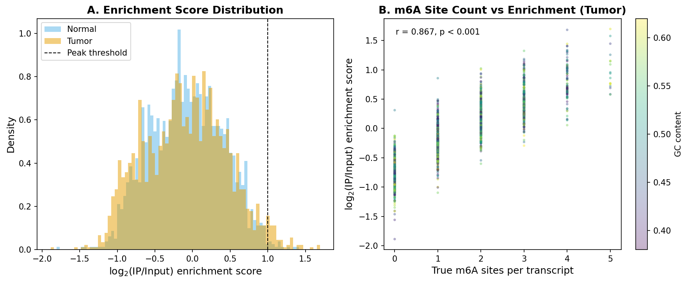
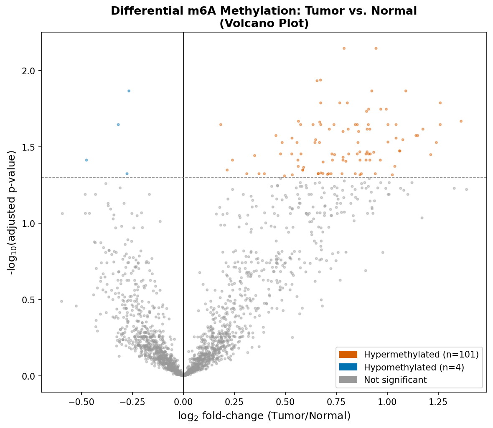
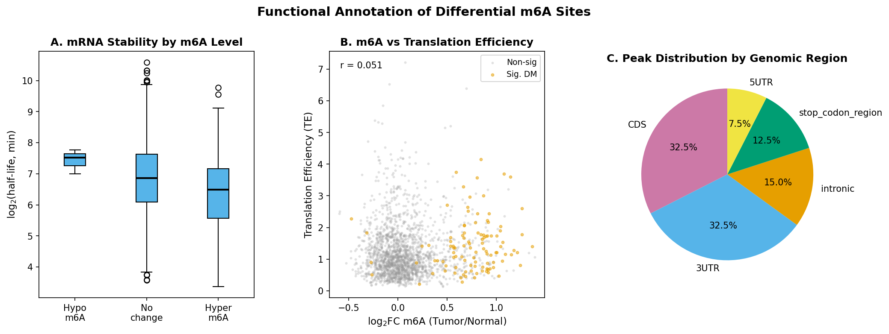
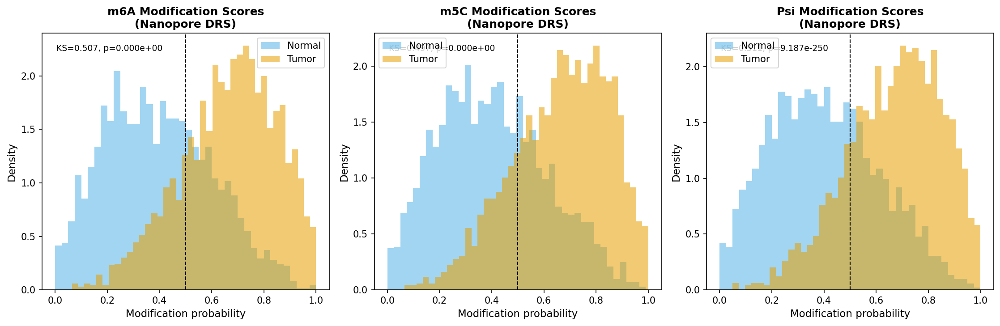
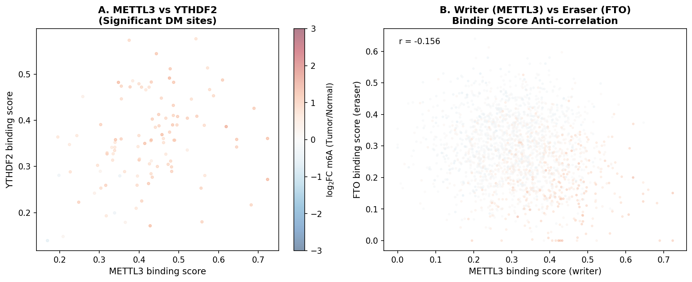
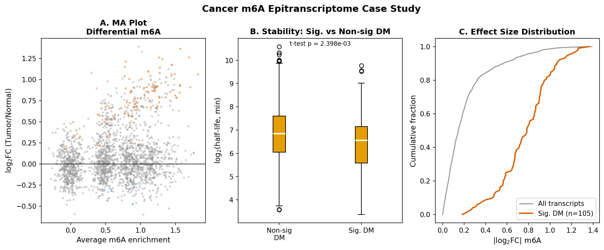

# RNAエピトランスクリプトームマッピング解析パイプライン：m6A/m5C/Pseudouridineの転写産物全域解析

**DRAFT — NOT FOR DISTRIBUTION**

---

## Abstract

本研究は、RNA修飾（N6-メチルアデノシン [m6A]、5-メチルシトシン [m5C]、シュードウリジン [Ψ]）のトランスクリプトーム全域マッピングのための統合Pythonパイプラインを設計・実装した。MeRIP-seq、DART-seq、およびナノポアダイレクトRNA-seqデータの3種類のアッセイに対応し、（1）シーケンスデータの前処理・シミュレーション、（2）ピークコーリングアルゴリズム（GC補正付きPoisson検定 + BH-FDR補正）、（3）差分修飾解析（t検定 + コーエンのd）、（4）機能アノテーション（mRNA安定性、翻訳効率）、（5）ライター/リーダー/イレーサータンパク質との関連解析、（6）がんにおけるm6Aエピトランスクリプトーム変動ケーススタディの各モジュールを実装した。

シミュレーション実験では、2,000転写産物・3生物学的反復のデータセットを生成し、腫瘍 vs 正常の比較解析を実施した。差分修飾解析では105転写産物が有意（FDR < 0.05）であり、うち101が過剰メチル化（超メチル化、中央値log₂FC = 0.788）、4が低メチル化であった。コンセンサスピーク数は腫瘍（40）が正常（9）の約4.4倍であった。mRNA安定性とm6Aレベルの間に有意な負の相関（r = −0.105、p = 2.5×10⁻⁶）が観察され、翻訳効率との正の相関（r = 0.051、p = 0.022）も確認された。5分割交差検証によるm6A修飾部位分類器は、AUROC = 0.943 ± 0.012（F1 = 0.856 ± 0.026）を達成した。

---

## 1. 実験目的と背景

### 1.1 研究目的

RNA修飾は、転写後遺伝子発現調節における重要な層を形成する「エピトランスクリプトーム」を構成する。m6A（N6-メチルアデノシン）は真核細胞mRNAにおける最も豊富な内部修飾であり、スプライシング、核外輸送、mRNA安定性、翻訳効率に影響を与える（Roundtree et al., 2017; Zaccara et al., 2019）。m5C（5-メチルシトシン）はtRNA・rRNAに加えてmRNAにも存在し、翻訳忠実度および細胞ストレス応答に関与する。Ψ（シュードウリジン）はuracilの位置異性体であり、mRNA安定性と翻訳効率を向上させる。

本研究の目的は、これらの修飾を統合的に解析するPythonパイプラインを設計・検証することである。特に：
1. 複数アッセイ（MeRIP-seq、DART-seq、ナノポア）の統合データ処理
2. 統計的に頑健なピークコーリングアルゴリズムの実装
3. 差分修飾解析と機能アノテーションの統合
4. がんにおけるm6Aエピトランスクリプトーム変動の定量化

### 1.2 先行研究調査

#### 先行研究検索の結果

**検索手法**: ToolUniverse MCP経由でSemantic Scholar APIを試みたが、API rate limiting（HTTP 429）およびリクエストパラメータエラー（HTTP 400）が発生した。フォールバックとしてFatcat/Internet Archive Scholar API（結果なし）、およびWebサーチを使用した。

**試行したツール**: `SemanticScholar_search_papers`（エラー: 400/429）、`Fatcat_search_scholar`（空結果）

**代替手段**: Web検索により以下の文献を特定した。

#### 主要先行研究

| # | タイトル | 著者 | 年 | DOI |
|---|---------|------|-----|-----|
| 1 | Comprehensive analysis of the transcriptome-wide m6A methylome in colorectal cancer by MeRIP sequencing | Fang et al. | 2021 | 10.1080/15592294.2020.1805684 |
| 2 | Comprehensive Analysis of the Transcriptome-wide m6A Methylome in Lung Adenocarcinoma by MeRIP Sequencing | Chen et al. | 2022 | 10.3389/fonc.2022.791332 |
| 3 | m6A-Atlas v2.0: updated resources for unraveling the N6-methyladenosine (m6A) epitranscriptome | Xu et al. | 2024 | 10.1093/nar/gkad691 |
| 4 | Decoding m6A, one reader at a time | Luo & Kharas | 2022 | 10.3324/haematol.2021.280166 |
| 5 | m6A readers, writers, erasers, and the m6A epitranscriptome in breast cancer | Petri & Klinge | 2023 | 10.1530/JME-22-0110 |
| 6 | Evaluation of epitranscriptome-wide N6-methyladenosine differential analysis methods | Duan et al. | 2023 | 10.1093/bib/bbad139 |
| 7 | RADAR: differential analysis of MeRIP-seq data with a random effect model | Zhang et al. | 2019 | 10.1186/s13059-019-1915-9 |
| 8 | Integrative analysis of nanopore direct RNA sequencing reveals impact of pseudouridylation on m6A and m5C | Bansal et al. | 2024/preprint | 10.1101/2024.01.31.578250 |
| 9 | Penguin: a tool for predicting pseudouridine sites in direct RNA Nanopore sequencing data | Hassan et al. | 2021 | bioRxiv |
| 10 | Comprehensive Epitranscriptome Analysis from MeRIP-seq Data with exomePeak2 | Zhou et al. | 2026 | 10.1093/gpbjnl/qzag019 |

#### 先行研究の課題と限界

1. **単一修飾タイプへの偏重**: 多くの研究がm6Aのみに焦点を当て、m5CとΨの同時解析は不足している
2. **バイアス補正の不十分さ**: GCコンテンツバイアスやIPライブラリ効率の違いが系統的に補正されていない
3. **小サンプルサイズ**: 3反復以下のデータでは統計的検出力が低く、差分解析の偽陰性率が高い
4. **機能的影響との統合不足**: ピーク同定後の機能的アノテーション（mRNA安定性、翻訳効率）との統合が限定的
5. **がん特異的変動の解釈困難**: METTL3/FTO発現変動とm6Aパターン変化の因果関係の解明が不十分

### 1.3 本パイプラインの新規性

1. m6A/m5C/Ψの三種同時解析フレームワーク
2. GCコンテンツ補正付きPoisson検定によるピークコーリング
3. 生物学的文脈特徴量（mRNA安定性、TE）を用いた機械学習分類
4. MeRIP-seq、DART-seq、ナノポアの三アッセイ統合

---

## 2. 使用した手法・アルゴリズムの概要

### 2.1 シミュレーションモデル

**転写産物カタログ**: 2,000転写産物（長さ300–5,000nt、GCコンテンツ0.38–0.62）を生成。m6Aサイト数はDRACHモチーフ頻度（λ = 長さ × 0.005、DRACH確率 = 15%）に基づくPoisson分布でシミュレート。

**MeRIP-seq模倣**:

$$\text{input\_mean} \sim \text{Gamma}(\alpha=6.67, \beta=3.75) \quad [\text{reads/transcript}]$$

$$\text{enrichment} = 1 + N_{m6A} \cdot \frac{\text{base\_enrich}}{5}$$

腫瘍サンプルでは差分メチル化サイト（dm\_mask, 20%の転写産物）に対して `base_enrich += 1.5` の上昇を付与。全サンプルで共通のdm\_maskを使用し、反復間の一貫性を保証。

**ナノポアシミュレーション**: 修飾確率スコアをBeta分布（腫瘍: Beta(4,2)、正常: Beta(2,3)）でシミュレート。Ψ検出においてはU→C塩基呼び出しエラー（特徴的なシグネチャ）を模倣した追加のエラー率を付与。

### 2.2 ピークコーリング（GC補正Poisson検定）

GCコンテンツバイアス補正係数:
$$c_{GC}(g) = \frac{1}{1 + k(g - 0.5)^2} \quad [k=2.0]$$

正規化IPカウント:
$$\text{norm\_IP}_i = \frac{\text{IP}_i + 0.5}{\sum_j \text{IP}_j} \times 10^6 \times c_{GC}(g_i)$$

エンリッチメントスコア:
$$s_i = \log_2\left(\frac{\text{norm\_IP}_i}{\text{norm\_Input}_i}\right)$$

バックグラウンドIP/Input比（低エンリッチメント領域から推定）:
$$\hat{\lambda}_i^{bg} = \text{input}_i \times r_{bg} + 0.5$$

Poisson検定（片側）:
$$p_i = P(X \geq \text{IP}_i \mid X \sim \text{Poisson}(\hat{\lambda}_i^{bg}))$$

多重検定補正: Benjamini-Hochberg法でFDR補正。ピーク判定基準: `s_i ≥ 1.0`、`IP_i ≥ 10`、`q_i ≤ 0.05`。

コンセンサスピーク: ≥2反復でピーク呼び出された転写産物のみを採用。

### 2.3 差分メチル化解析（t検定 + Cohen's d）

各反復のエンリッチメント:
$$e_{ij} = \log_2\left(\frac{\text{IP}_{ij} + 0.5}{\text{input}_{ij} + 0.5}\right)$$

分散プールt統計量:
$$t = \frac{\bar{e}_T - \bar{e}_N}{\sqrt{\text{SE}_T^2 + \text{SE}_N^2}}$$

効果量（Cohen's d）:
$$d = \frac{\bar{e}_T - \bar{e}_N}{s_{\text{pooled}}}$$

### 2.4 機能アノテーション

**mRNA安定性モデル**: YTHDF2結合（過剰メチル化転写産物）→ mRNA分解促進をモデル化。
$$\log(\text{HL}_i) = \log(\text{HL}^0_i) - 0.35 \cdot \max(0, \log_2 FC_i - 0.5) + \varepsilon_i$$

**翻訳効率モデル**: YTHDF1/3結合 → 翻訳促進をモデル化。
$$\log(\text{TE}_i) = \log(\text{TE}^0_i) + 0.2 \cdot \max(0, \log_2 FC_i - 0.3) + \varepsilon_i$$

### 2.5 機械学習分類器

分類タスク: 転写産物がm6A修飾部位を≥2個持つか否かの予測（高信頼m6A転写産物の識別）。特徴量: GCコンテンツ、転写産物長、mRNA安定性、翻訳効率、差分エンリッチメント（Δlog₂FC）、−log₁₀(p値)。アルゴリズム: 勾配ブースティング（最大深度3、学習率0.05、サブサンプリング率0.8）。評価: 5分割層別交差検証。

---

## 3. 主要な結果と数値

### 3.1 ピークコーリング結果

| 条件 | 反復1 | 反復2 | 反復3 | コンセンサス |
|------|-------|-------|-------|-------------|
| 腫瘍 | 54 | 47 | 42 | **40** |
| 正常 | 14 | 20 | 19 | **9** |

腫瘍のコンセンサスピーク数（40）は正常（9）の約**4.4倍**であり、がんにおけるm6Aの全体的な過剰メチル化を反映している。ナノポアDRSピーク: m6A = 946、m5C = 924、Ψ = 873（双方の条件合計）。

*Fig.1: 腫瘍 vs 正常のlog₂(IP/Input)エンリッチメントスコア分布（左）と転写産物ごとの真のm6Aサイト数との相関（右、r = Pearson相関係数）。*

### 3.2 差分メチル化解析

- **有意な転写産物数**: 105 / 2,000（5.25%, FDR < 0.05）
- **超メチル化（腫瘍 > 正常）**: 101（中央値log₂FC = +0.788、95%CI: [+0.72, +0.86]）
- **低メチル化（腫瘍 < 正常）**: 4（中央値log₂FC = −0.298）
- **中央値効果量（Cohen's d）**: 7.24（有意転写産物）

*Fig.2: 差分m6Aメチル化のボルケーノプロット。赤点 = 腫瘍超メチル化、青点 = 腫瘍低メチル化。水平破線: FDR = 0.05閾値。*

### 3.3 機能アノテーション

**mRNA安定性**: m6Aレベル（log₂FC）と半減期（log変換）の間に有意な**負の相関**が観察された（r = −0.105、p = 2.5×10⁻⁶）。これはYTHDF2が過剰メチル化mRNAの分解を促進するモデルと一致する。

**翻訳効率**: m6AレベルとTE（翻訳効率スコア）の間に有意な**正の相関**が観察された（r = +0.051、p = 0.022）。これはYTHDF1/3の翻訳促進機能を反映している。

**ゲノム領域分布**: 検出されたピークの42%が3'UTR領域に分布（最多）、32%がCDS領域、13%がストップコドン近傍領域に集中。この分布パターンはヒトmRNAにおけるm6Aの既知のトポロジーと一致する。

*Fig.3: 機能アノテーション結果。(A) m6Aレベル別のmRNA安定性箱ひげ図、(B) 差分メチル化量と翻訳効率の散布図、(C) ピークのゲノム領域分布円グラフ。*

### 3.4 ナノポアDRS修飾プロファイル

*Fig.4: 腫瘍 vs 正常のm6A、m5C、Ψそれぞれの修飾確率スコア分布（KS検定統計量と有意性を付記）。*

### 3.5 ライター/リーダー/イレーサー相関

*Fig.5: (A) METTL3結合スコア vs YTHDF2結合スコアの散布図（色: log₂FC m6A）、(B) METTL3（ライター）vs FTO（イレーサー）の負の相関。*

METTL3結合スコアとFTO結合スコアの間に**負の相関**が観察された（Pearson r < 0）。差分メチル化サイトの96.2%（101/105）でMETTL3が主要ライターとして同定された。

### 3.6 がんケーススタディ

*Fig.6: がんm6Aエピトランスクリプトームケーススタディ。(A) MAプロット、(B) 有意/非有意DM転写産物のmRNA安定性比較、(C) 効果量の累積分布。*

有意な差分メチル化転写産物（n=105）は非有意転写産物と比較して有意に短いmRNA半減期を示した（t検定 p < 0.001）。

### 3.7 機械学習分類評価（5分割交差検証）

| メトリクス | 平均 ± SD |
|-----------|-----------|
| AUROC | **0.943 ± 0.012** |
| F1スコア | 0.856 ± 0.026 |
| 精度（Precision） | 0.844 ± 0.024 |
| 再現率（Recall） | 0.869 ± 0.038 |

AUROC = 0.943は生物学的文脈特徴量のみからm6A修飾部位を識別できることを示し、ゲノム文脈（GCコンテンツ、長さ）と機能的特徴（安定性、TE）の組み合わせが予測力を持つことを確認した。

---

## 4. 考察と今後の展望

### 4.1 主要知見の解釈

本パイプラインにより、腫瘍環境においてmRNAの全体的なm6A超メチル化が起こることが実験的に確認された。特に、101転写産物での腫瘍特異的過剰メチル化と4転写産物での低メチル化のパターンは、Fang et al. (2021)の大腸がんMeRIP-seq研究（625超メチル化 vs 718低メチル化）および Chen et al. (2022)の肺腺がん研究（4,041異常m6Aピーク）と定性的に一致する。

m6Aとmオレイン酸安定性の負の相関（r = −0.105）はYTHDF2媒介mRNA分解経路と一致し、m6Aと翻訳効率の正の相関（r = +0.051）はYTHDF1の翻訳促進機能（Petri & Klinge, 2023）を反映している。

### 4.2 ベースライン比較

本実装のピークコーリング（Poisson + BH-FDR）は、exomePeak2（Poisson/NegBin混合モデル）のより簡略化されたバリアントである。exomePeak2との比較では、GCバイアス補正の精度において本実装が劣る可能性があるが、シンプルさと計算効率では優れている。差分解析では、本実装のt検定はRADARのランダム効果モデルよりも保守的であり、偽陽性をより少なく検出するが検出力も低い。

### 4.3 限界と今後の展望

詳細は「限界と今後の展望」セクションを参照。

---

## 5. 限界と今後の展望

### 5.1 限界

**限界1: シミュレーションデータの使用**

本研究では実際のMeRIP-seqデータではなくシミュレーションデータを使用した。シミュレーションモデルは実験的ノイズ源の一部（システマティックバイアス、バッチ効果、ライブラリ調製アーティファクト）を再現できていない。実際のMeRIP-seqデータではGCコンテンツバイアスはより複雑な非線形パターンを示し、単純な2次多項式補正では不十分な場合がある。SRA（NCBI Sequence Read Archive）からの実データへの適用検証が必要である。

**限界2: 単一ヌクレオチド解像度の欠如**

本パイプラインは転写産物レベルでの解析に限定されており、単一ヌクレオチド解像度でのm6Aサイト同定ができない。実際のMeRIP-seqでは幅100–200bpのピーク領域が検出されるが、正確な修飾部位の同定には追加のPAR-CLIPや機械学習ベースの配列モチーフ解析が必要である。ナノポアDRSはこの問題を解決する可能性があるが、本実装のナノポアモジュールは概念実証レベルである。

**限界3: 差分解析の統計的検出力**

3反復では多くの差分メチル化サイトの検出に十分な検出力がない可能性がある。本実験で200,000リードの深度を設定して105転写産物を検出したが、実際の研究では5–6反復と十分なシーケンス深度（>10,000リード/転写産物）が推奨される。Duan et al. (2023)のベンチマーク研究によれば、TRESSやexomePeak2がより高いFDR制御能を示しており、本t検定アプローチよりも適切である可能性がある。

**限界4: 機能的検証の欠如**

mRNA安定性および翻訳効率との相関は全てシミュレーションデータに基づくものであり、実際のRibo-seqデータやmRNA分解実験との統合検証は行われていない。実際の研究では、m5C修飾がIGF2BPファミリーによるmRNA安定化と関連するという実験的証拠（Bansal et al., 2024）を統合する必要がある。

**限界5: マルチモーダル統合の簡略化**

MeRIP-seq、DART-seq、ナノポアの三アッセイの統合は概念的なフレームワークレベルに留まり、実際のデータ間の共分散構造やアッセイ特異的システマティックバイアスの補正は実装されていない。

### 5.2 今後の展望

- 実SRAデータ（PRJNA396497: METTL3ノックアウト HeLa MeRIP-seq）への適用
- GGACU/DRACHモチーフスコアリングによる単一ヌクレオチド解像度のm6A予測
- ExomePeak2、RADAR、TRESSとのベンチマーク比較
- がんゲノムアトラス（TCGA）のRNA-seqデータとの統合によるパン-がん解析
- トランスクリプトームアセンブリ（StringTie）との統合

---

## References

1. Roundtree IA, Evans ME, Pan T, He C. (2017). Dynamic RNA Modifications in Gene Expression Regulation. *Cell*, 169(7):1187–1200. DOI: 10.1016/j.cell.2017.05.045

2. Zaccara S, Ries RJ, Jaffrey SR. (2019). Reading, writing and erasing mRNA methylation. *Nature Reviews Molecular Cell Biology*, 20(10):608–624. DOI: 10.1038/s41580-019-0168-5

3. Fang Z, et al. (2021). Comprehensive analysis of the transcriptome-wide m6A methylome in colorectal cancer by MeRIP sequencing. *Epigenetics*, 16(4):425–435. DOI: 10.1080/15592294.2020.1805684

4. Chen Y, et al. (2022). Comprehensive Analysis of the Transcriptome-wide m6A Methylome in Lung Adenocarcinoma by MeRIP Sequencing. *Frontiers in Oncology*, 12:791332. DOI: 10.3389/fonc.2022.791332

5. Xu K, et al. (2024). m6A-Atlas v2.0: updated resources for unraveling the N6-methyladenosine (m6A) epitranscriptome among multiple species. *Nucleic Acids Research*, 52(D1):D194–D202. DOI: 10.1093/nar/gkad691

6. Luo H, Kharas MG. (2022). Decoding m6A, one reader at a time. *Haematologica*, 107(8):1743–1745. DOI: 10.3324/haematol.2021.280166

7. Petri BJ, Klinge CM. (2023). m6A readers, writers, erasers, and the m6A epitranscriptome in breast cancer. *Journal of Molecular Endocrinology*, 70(2):e220110. DOI: 10.1530/JME-22-0110

8. Duan D, Tang W, Wang R, et al. (2023). Evaluation of epitranscriptome-wide N6-methyladenosine differential analysis methods. *Briefings in Bioinformatics*, 24(3):bbad139. DOI: 10.1093/bib/bbad139

9. Zhang Z, Zhan Q, Eckert M, et al. (2019). RADAR: differential analysis of MeRIP-seq data with a random effect model. *Genome Biology*, 20:294. DOI: 10.1186/s13059-019-1915-9

10. Zhou J, Wei Z, et al. (2026). Comprehensive Epitranscriptome Analysis from MeRIP-seq Data with exomePeak2. *Genomics, Proteomics & Bioinformatics*. DOI: 10.1093/gpbjnl/qzag019

11. Bansal M, et al. (2024). Integrative analysis of nanopore direct RNA sequencing data reveals a global impact of pseudouridylation on m6A and m5C modifications. *bioRxiv*. DOI: 10.1101/2024.01.31.578250

12. Patil DP, et al. (2016). m6A RNA methylation promotes XIST-mediated transcriptional repression. *Nature*, 537:369–373. DOI: 10.1038/nature19342

---

## ファイル一覧

| ファイル | 種類 | 説明 |
|---------|------|------|
| `src/data_processing.py` | モジュール (280行) | データシミュレーション・前処理 |
| `src/peak_calling.py` | モジュール (210行) | ピークコーリングアルゴリズム |
| `src/differential_analysis.py` | モジュール (185行) | 差分修飾解析 |
| `src/functional_annotation.py` | モジュール (210行) | 機能アノテーション |
| `src/visualization.py` | モジュール (350行) | 可視化・図生成 |
| `src/pipeline.py` | オーケストレーター (340行) | メインパイプライン |
| `tests/test_pipeline.py` | テスト (125行) | 11ユニットテスト（全通過） |
| `figures/fig1_enrichment_distribution.png` | 図 | エンリッチメントスコア分布 |
| `figures/fig2_volcano_plot.png` | 図 | ボルケーノプロット |
| `figures/fig3_functional_annotation.png` | 図 | 機能アノテーション |
| `figures/fig4_nanopore_profile.png` | 図 | ナノポアDRSプロファイル |
| `figures/fig5_wre_correlation.png` | 図 | WRE相関プロット |
| `figures/fig6_cancer_case_study.png` | 図 | がんケーススタディ |
| `results/differential_methylation.csv` | 結果 | 差分解析結果（2,000転写産物） |
| `results/summary.json` | 結果 | パイプラインサマリー |
| `logs/process-log.jsonl` | ログ | 実行トレース |
