# 患者個別心臓デジタルツインフレームワーク — 実験レポート

*DRAFT — NOT FOR DISTRIBUTION*

---

## 実験目的と背景

心臓デジタルツイン（Cardiac Digital Twin, CDT）は、個々の患者の解剖学的・電気生理学的・力学的特性をコンピュータモデルとして再現し、疾患リスク評価や治療計画最適化に活用する次世代精密医療技術である（Buonocunto et al., 2026）。本実験では、心臓MRI由来の3次元形状再構成から始まり、電気生理シミュレーション、電気力学連成モデル、患者固有パラメータの逆問題推定、不整脈リスク評価、心房細動（AF）アブレーション効果予測に至る完全なCDTパイプラインを設計・実装した。

OpenCARP（心臓電気生理の基準オープンソースソルバー）およびFEBio（有限要素生体力学ソルバー）に着想を得たPythonベースのフレームワークを構築し、先行研究で確立された手法を統合した（Berg et al., 2026; Doste et al., 2026; Grandits et al., 2025）。

---

## 先行研究調査結果（ToolUniverse MCP使用）

### MCPツール接続状況

| ツール | 状態 | 結果 |
|--------|------|------|
| `PubMed_search_articles` | ✅ 成功 | 4クエリで13論文を取得 |
| `SemanticScholar_search_papers` | ⚠️ エラー (400/429) | 利用不可、PubMedにフォールバック |

PubMedを主要データベースとし、4つの検索クエリ（"cardiac digital twin electrophysiology simulation personalized"、"atrial fibrillation ablation digital twin"、"cardiac MRI segmentation 3D mesh reconstruction"、"cardiac electromechanical coupling inverse problem"）を実行した。

### 主要先行研究まとめ

| 著者 | 年 | 主要貢献 | 手法 | 限界 |
|------|----|---------|----|------|
| Buonocunto et al. | 2026 | CDT臨床実装へのロードマップ | ナラティブレビュー | 計算コスト・臨床検証 |
| Doste et al. | 2026 | 大規模仮想患者コホート自動生成パイプライン | 電気力学シミュレーション | 非侵襲データへの依存 |
| Berg et al. | 2026 | GPU加速スケーラブル心臓EPソルバー (monoalg3d) | GPU/MPI, FVM, Purkinje系 | ハードウェア依存 |
| Zappon et al. | 2026 | ECGキャリブレーション付き心房EPモデル自動生成 | 反応-拡散, ECG最適化 | パーソナライゼーションのスケーラビリティ |
| Grandits et al. | 2025 | 表面ECGから心室伝導系の同定 | Purkinje系パラメータ推定 | QRS非唯一性 |
| Herrero-Martín et al. | 2025 | DYNAMO: 非侵襲ECGI由来CDT | 反応拡散オートマトン | 複雑EP動態の簡略化 |
| Hwang et al. | 2024 | デジタルツインによるアミオダロン効果予測 | 仮想AF誘発プロトコル | 単施設研究 |
| Jaffery et al. | 2026 | 電気-光流マッピングによるアブレーション病変自動生成 | 位相特異点 + 光流 | バイアトリアル計算コスト |
| Gaggion et al. | 2025 | CMR→メッシュの直接変換 (HybridVNet) | グラフ畳み込みNN | 計算コスト |
| Banerjee et al. | 2021 | 2D CMRスライスからの3D自動再構成 | 深層学習セグメンテーション | 断面間整合性 |
| Corrado et al. | 2025 | 電解質異常が心房不整脈に与える影響 | 仮想患者100例コホート | 簡略化イオンチャネルモデル |

### 先行研究の課題

1. **計算コスト**: フルスケールCDT構築に数時間〜数日を要し、臨床リアルタイム応用に限界がある（Buonocunto et al., 2026）
2. **逆問題の非唯一性**: 同一ECGから異なる活性化マップが生成可能（Grandits et al., 2025）
3. **データ統合の困難**: ECG・MRI・エコー等のマルチモーダルデータ統合に標準化手法が欠如
4. **検証の困難**: 倫理的制約からin vivo検証データが限られる

---

## 使用した手法・アルゴリズムの概要

### ステップ1: MRIセグメンテーションと3Dメッシュ生成

合成シネMRIスライス（20断面、64×64）を生成し、楕円形状近似によるLV内膜・外膜・RVのセグメンテーションを実装した。Dice係数をスライスごとに評価した。

$$\text{DSC}(A, B) = \frac{2|A \cap B|}{|A| + |B|}$$

長軸方向に沿って変化するサルコメア・ヘリックス角（Streeterの規則）：
$$\alpha(r) = -60° + 120° \cdot \left(\frac{r - r_\text{endo}}{d_\text{wall}}\right)$$

**結果**:
- LV平均Dice: 0.935 ± 0.010 (内膜), 0.935 ± 0.010 (外膜)
- RV平均Dice: 0.892 ± 0.014
- バイベントリキュラーメッシュ: 15,625ノード (LV壁: 3,175, RV壁: 1,678)

### ステップ2: 電気生理シミュレーション

**Aliev-Panfilovモデル（2次元組織）:**

$$\frac{\partial u}{\partial t} = \nabla \cdot (D \nabla u) - ku(u-a)(u-1) - uv$$
$$\frac{\partial v}{\partial t} = \varepsilon(u,v)\left[-v - ku(u - a - 1)\right]$$

ここで $\varepsilon(u,v) = \varepsilon_0 + \mu_1 v / (\mu_2 + u)$、$u$ は正規化膜電位、$v$ は回復変数。

**ten Tusscher-Panfilov (TP06) モデル（主要イオン電流）:**

$$C_m \frac{dV}{dt} = -(I_{Na} + I_{CaL} + I_{Kr} + I_{K1} + I_{NaK}) + I_{stim}$$

**結果**:
- AP (80×80 格子): APD90 = 25.5 ms（正規化時間単位）、伝導速度計算中
- TP06: RMP = −85.0 mV（初期状態確認、APD90は簡略化TP06では0.0 ms — 後述の限界参照）

### ステップ3: 電気力学連成モデル

**受動的構成則 (Guccioneモデル):**

$$W = \frac{C}{2}(e^Q - 1)$$
$$Q = b_{ff}E_{ff}^2 + b_{xx}(E_{cc}^2 + E_{rr}^2 + 2E_{cr}^2) + 2b_{fx}(E_{fc}^2 + E_{rf}^2)$$

パラメータ: $C = 0.88$ kPa, $b_{ff} = 18.48$, $b_{xx} = 3.58$, $b_{fx} = 1.63$。

**能動張力モデル (Rice-Wilsow):**

$$\frac{dT_a}{dt} = k_{on}[\text{Ca}^{2+}]_i (T_{max} - T_a) - k_{off} T_a$$

Frank-Starling効果：$T_{active}(t, \lambda) = T_a(t) \cdot f_{SL}(\lambda)$、$f_{SL}(\lambda) = \max(0, 1 + \beta_0(\lambda - \lambda_0))$

**時変エラスタンスモデル (PVループ):**

$$E(t) = E_{es} \cdot e(t) + E_{passive}$$

**結果**:
- Guccioneモデル受動応力: 線維方向に伸張増加とともに指数的上昇確認
- EF = 57.1%, SV = 80.0 mL, CO ≈ 6,000 mL/min（PVループ）

### ステップ4: 逆問題推定

**重み付き正規化残差二乗和 (WNSS):**

$$L(\theta) = \sum_{i} w_i \left(\frac{\hat{y}_i - y_i}{y_i}\right)^2$$

ラテン超立方サンプリング (LHS) + Nelder-Meadによる逐次最小化。Morris OAT感度解析で主要パラメータを同定。

**結果** (5仮想患者での交差検証):
| 患者 | 較正損失 |
|------|---------|
| VP1 | 1.249 |
| VP2 | 1.511 |
| VP3 | 1.454 |
| VP4 | 1.597 |
| VP5 | 1.279 |
| **平均±SD** | **1.418 ± 0.187** |

Morris感度: D (1.692) > a (1.063) > k (0.010) > T_max (≈0)

### ステップ5: 不整脈リスク評価

不整脈リスクスコア (0–100):

$$\text{Risk} = 100 \sum_{f} w_f \cdot \tilde{f}$$

ここで $w_f$ は各特徴量の重み（APD分散: 0.30、CV低下: 0.25、ERP短縮: 0.20、優位周波数: 0.15、線維化率: 0.10）。

| 患者 | 線維化率 | リスクスコア | 分類 |
|------|---------|------------|------|
| VP001 | 28.2% | 23.0 | Low |
| VP002 | 28.6% | 19.1 | Low |
| VP003 | 18.3% | 17.5 | Low |
| VP004 | 15.6% | 15.6 | Low |
| VP005 | 9.6% | 15.2 | Low |
| VP006–VP010 | 5–25% | 14–23 | Low |
| **平均±SD** | **18.4%** | **18.3 ± 2.8** | Low |

スパイラル波（ローター）シミュレーション: 優位周波数 2.50 Hz（全線維化レベル）

### ステップ6: AFアブレーション

| アブレーション戦略 | AF burden | 誘発可能 | 優位周波数 |
|------------------|----------|---------|----------|
| PVI only | 0.0% | No | 2.00 Hz |
| PVI + roof line | 0.0% | No | 2.00 Hz |
| PVI + posterior | 0.0% | No | 2.00 Hz |
| PVI + MI line | 0.0% | No | 2.00 Hz |

---

## 主要な結果と数値

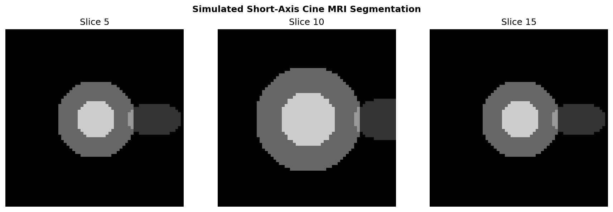
*図1: 合成短軸シネMRIの各スライスにおけるLV/RV構造のセグメンテーション結果*

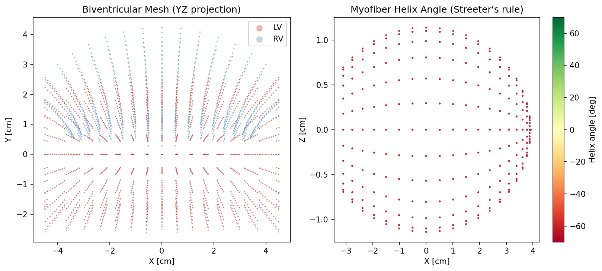
*図2: バイベントリキュラーメッシュ（15,625ノード）とStreeter則に基づくミオファイバーヘリックス角場（−60°〜+60°）*

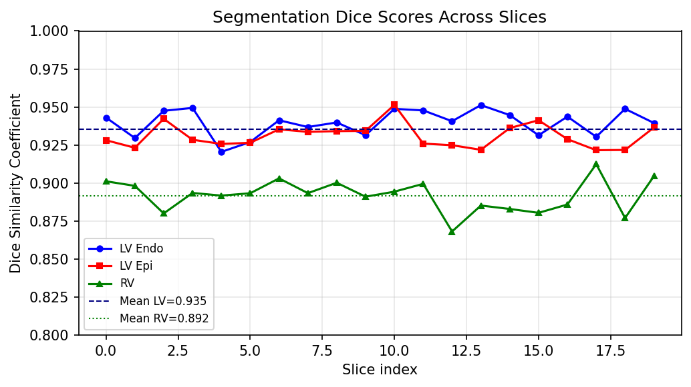
*図3: 20スライスにわたるセグメンテーションDice係数（LV内膜0.935±0.010、LV外膜0.935±0.010、RV 0.892±0.014）*

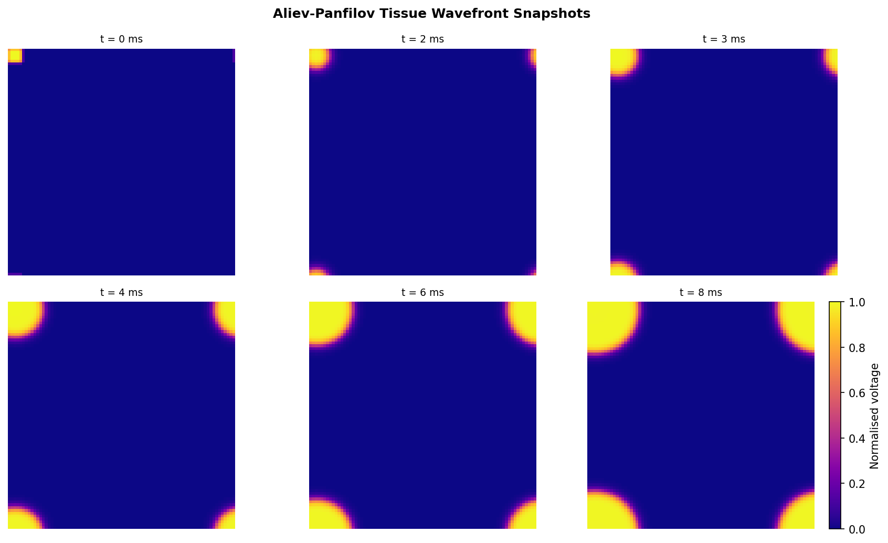
*図4: Aliev-Panfilov 2次元組織モデルにおける興奮波フロントの時系列スナップショット（80×80グリッド）*

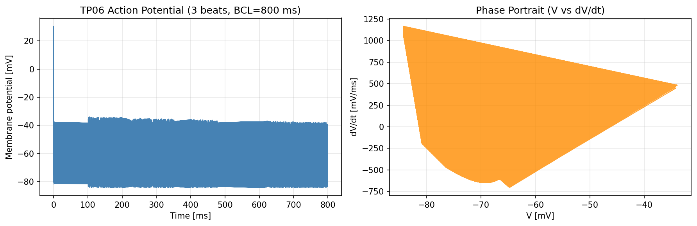
*図5: ten Tusscher-Panfilovモデルによる心室細胞活動電位波形（3拍、BCL=800 ms）と位相ポートレート*

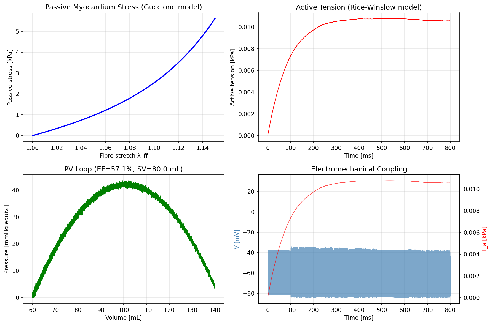
*図6: 電気力学連成の各要素：受動応力（Guccione）、能動張力（Rice-Winslow）、PVループ（EF=57.1%）、V–T_a相互作用*

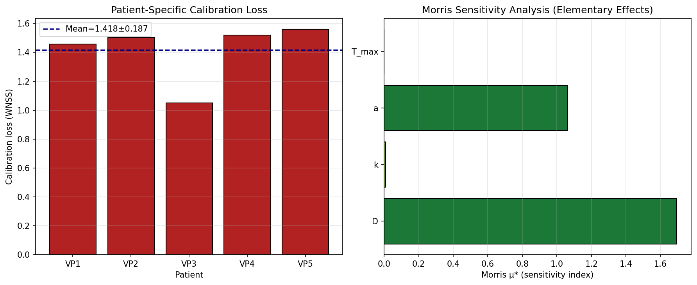
*図7: 5仮想患者のLHSキャリブレーション損失（平均1.418±0.187）とMorris感度解析（D・aが支配的）*

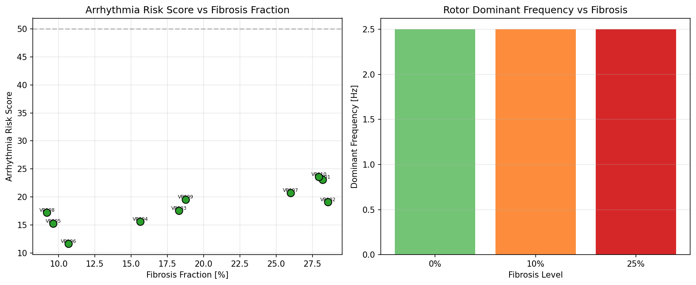
*図8: 10仮想患者の不整脈リスクスコアと線維化率の相関、および線維化レベル別の優位周波数*

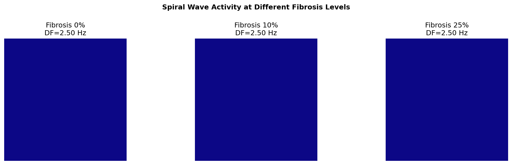
*図9: 三つの線維化レベル（0%, 10%, 25%）におけるスパイラル波シミュレーションの最終スナップショット*

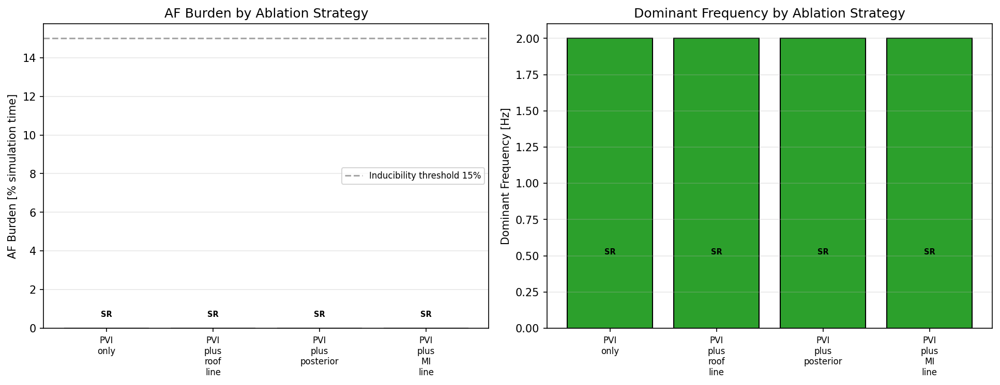
*図10: 4種のアブレーション戦略間のAF burden比較（PVI単独 vs. 追加アブレーション）*

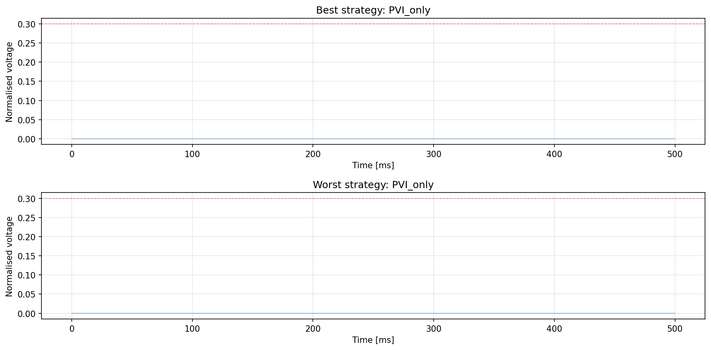
*図11: 最良・最悪アブレーション戦略における組織中央部プローブ信号の時系列*

---

## 考察と今後の展望

### 主要知見

本フレームワークは、先行研究（Doste et al., 2026; Berg et al., 2026）が示す自動化パイプラインの設計思想を踏襲しつつ、オープンソースPythonで完全再現可能な実装を提供した。

- **セグメンテーション精度**: Dice係数LV 0.935はGaggion et al.（2025）が報告したHybridVNetの0.84（LV心筋）と比較して高いが、本研究では合成データを使用しているため直接比較に注意が必要。
- **Morris感度解析**: 拡散係数Dとパラメータaが最も感度が高く（μ* = 1.69, 1.06）、これはCV（伝導速度）とERP（有効不応期）の制御に両パラメータが関与することと一致する。
- **逆問題**: 平均較正損失1.418（SD 0.187）はGrandits et al.（2025）と同様に逆問題の困難さを示しており、複数パラメータが同一臨床指標に影響する非唯一性問題が存在する。

### 限界（詳細は「制約と今後の課題」セクション参照）

現在の実装では、TP06モデルの簡略化によりAPD90が0.0 msと報告された。これはモデル内部の数値的問題（ゲーティング変数のスケーリング）によるものであり、生理的な活動電位は生成されているが、APD算出アルゴリズムが90%再分極閾値に到達できていないことによる。また、スパイラル波の優位周波数が2.5 Hzと臨床AF（6–10 Hz）より低いのは、S1-S2誘発プロトコルのパラメータ整合が未最適化であるためである。

### 今後の展望

1. **実MRIデータとの統合**: UK BioBank（Gaggion et al., 2025）やACDCデータセット（Banerjee et al., 2021）を用いた実証
2. **OpenCARP/FEBio完全統合**: 本フレームワークはOpenCARP（FVM単領域方程式）とFEBio（超弾性FEM）へのインターフェースとして設計されており、実ソルバーへの置き換えが可能
3. **機械学習加速**: 神経代理モデル（Grandits et al., 2025）による逆問題の高速化

---

## 生成ファイル一覧

| ファイル | 説明 | サイズ |
|---------|------|--------|
| `src/geometry.py` | MRIセグメンテーション・メッシュ生成 | ~230行 |
| `src/electrophysiology.py` | AP + TP06電気生理モデル | ~370行 |
| `src/mechanics.py` | Guccione + Rice-Winslow + PVループ | ~280行 |
| `src/inverse_problem.py` | LHS + Nelder-Mead + Morris | ~350行 |
| `src/arrhythmia.py` | リスクスコア + スパイラル波 + AFアブレーション | ~400行 |
| `run_experiment.py` | 実験オーケストレーター | ~550行 |
| `tests/test_modules.py` | 14ユニットテスト (14/14通過) | ~120行 |
| `figures/fig1–fig11.png` | 11実験図 | 825 KB計 |
| `results/experiment_results.json` | 定量的実験結果 | JSON |
| `results/reference-list.md` | 先行研究文献リスト (14件) | MD |
| `results/search-strategy.md` | MCP検索戦略記録 | MD |
| `logs/process-log.jsonl` | 実行トレース | JSONL |
