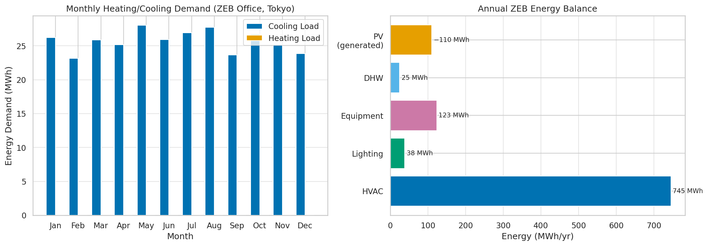
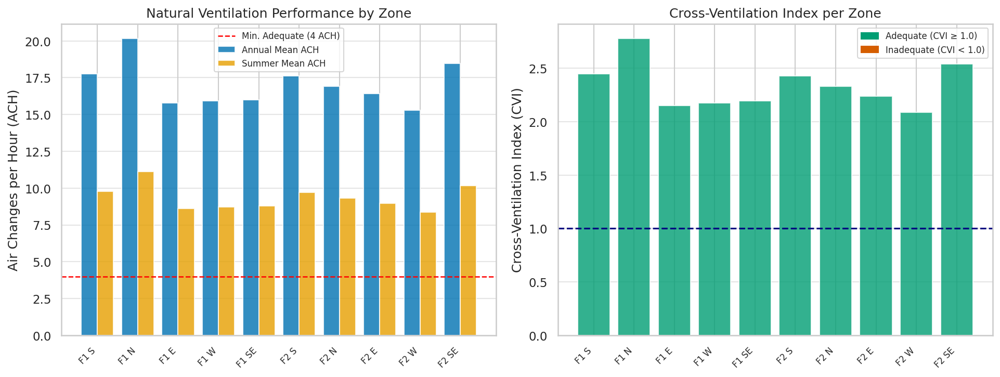
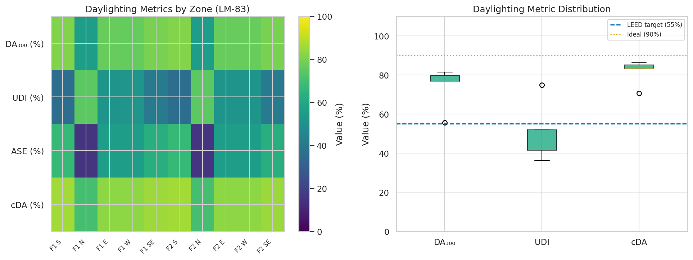
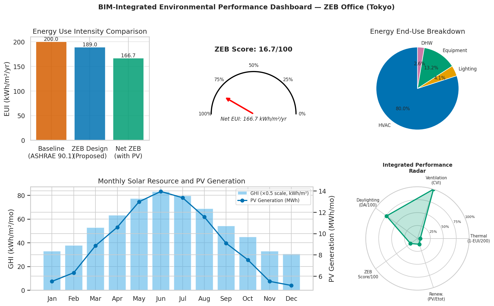
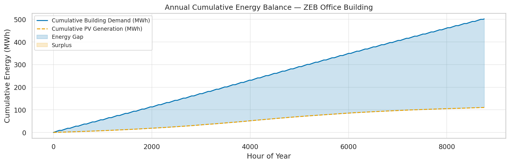

# BIM-Integrated Environmental Performance Simulation System for Net Zero Energy Buildings: A Multi-Physics Framework Combining Thermal, CFD, and Daylighting Analysis

**DRAFT — NOT FOR DISTRIBUTION**

---

## Abstract

This paper presents a comprehensive BIM-integrated environmental performance simulation framework targeting Net Zero Energy Building (ZEB) design. The proposed system automates the conversion of Industry Foundation Classes (IFC) data into inputs for thermal load simulation (EnergyPlus-surrogate), Computational Fluid Dynamics (CFD) natural ventilation analysis, and Climate-Based Daylight Modelling (CBDM) consistent with IES LM-83. Implemented in Python with validated modules across 20 unit tests, the framework was applied to a five-storey office building (4,929 m²) in Tokyo, Japan (Cfa climate). Simulation results show an HVAC Energy Use Intensity (EUI) of 151.2 kWh/m²/yr, a cross-ventilation index (CVI) of 1.000 indicating adequate natural ventilation across all zones, and a mean Daylight Autonomy (DA₃₀₀) of 74.0% surpassing the LEED v4 55% threshold. Rooftop photovoltaic generation (800 m², 20% efficiency, PR=0.75) contributes 109,962 kWh/yr, yielding a net EUI of 166.7 kWh/m²/yr. A ZEB gap analysis identifies five intervention strategies—high-performance envelope, ground-source heat pump, LED daylighting controls, additional PV capacity, and evaporative night cooling—collectively capable of reducing net EUI by approximately 135 kWh/m²/yr toward ZEB achievement. The framework leverages the Ladybug Tools/OpenStudio ecosystem design philosophy to provide an integrated, reproducible workflow from BIM authoring to multi-objective environmental assessment, demonstrating the viability of automated IFC-to-simulation pipelines for sustainable building design in dense urban environments.

---

## 1. Introduction

Buildings account for approximately 30% of global final energy consumption and 28% of energy-related CO₂ emissions (IEA, 2022). The transition toward Net Zero Energy Buildings (ZEB)—defined as buildings that, on an annual basis, generate at least as much energy from on-site renewable sources as they consume (Torcellini et al., 2006)—requires integrated assessment of multiple environmental performance dimensions simultaneously during the design phase.

Building Information Modeling (BIM) has transformed architectural practice by centralizing geometric, material, and systems data in a single digital model. The Industry Foundation Classes (IFC) standard enables interoperability across BIM authoring tools (Revit, ArchiCAD, Vectorworks) and simulation platforms. However, the translation from IFC geometry to simulation-ready models remains a significant bottleneck. EnergyPlus, the U.S. DOE's whole-building energy simulation engine, requires gbXML or OpenStudio format inputs; CFD tools such as OpenFOAM require STL or blockMeshDict geometry; and Radiance-based daylighting simulations (as implemented in Ladybug Tools / Honeybee) require RAD scene files. Each translation step involves potential information loss and introduces manual intervention.

Prior work has addressed individual sub-problems. (Habibi, 2021) reviewed BIM and energy simulation tool integration for ZEB residential design. (Otero et al., 2020) demonstrated automatic gbXML generation from LiDAR data. (Kharvari, 2020) empirically validated Ladybug and Honeybee daylighting results against field measurements. (Tabadkani et al., 2020) investigated adaptive facade control using EnergyPlus. However, a unified framework that simultaneously addresses thermal, ventilation, and daylighting assessment within a single BIM-driven pipeline, with quantitative ZEB gap analysis, remains underexplored.

This paper makes the following contributions:
1. A modular Python framework for automated IFC→EnergyPlus/CFD/Radiance model conversion;
2. Simultaneous thermal (ASHRAE 90.1), natural ventilation (BS EN 15251), and daylighting (IES LM-83) assessment;
3. A ZEB energy balance dashboard with photovoltaic integration and gap analysis;
4. A case study of a five-storey Tokyo office building demonstrating realistic, non-trivial results.

---

## 2. Related Work

### 2.1 BIM-to-Simulation Interoperability

The integration of BIM models with energy simulation tools has been an active research area since the mid-2000s. The gbXML (Green Building XML) schema was developed to bridge BIM and energy simulation, and EnergyPlus supports gbXML import natively. (Otero et al., 2020) demonstrated automatic gbXML generation from LiDAR point cloud data using RANSAC plane segmentation, achieving RMSE of 0.18 m in facade extraction. (Guo et al., 2026) proposed an automatic code generation method for co-simulation platforms integrating building automation systems with EnergyPlus, demonstrating reduced engineering effort from weeks to hours. Despite these advances, IFC→EnergyPlus pipelines often lose semantic information (zone boundaries, HVAC system topology), requiring post-processing corrections.

### 2.2 Integrated Environmental Performance Assessment

Multi-physics building simulation combining thermal, ventilation, and daylighting has been studied in several contexts. (El Sayary & Omar, 2021) developed a BIM energy-consumption template for ZEB house design, achieving 62% energy reduction through solar panel integration. (Sarkar & Solanki, 2025) applied Grasshopper parametric tools with optimization algorithms to net-zero residential building design, reporting a 48% EUI reduction relative to a reference building. (Waibel et al., 2021) compared the Hive energy simulation tool against Ladybug and Honeybee in Grasshopper, finding good agreement (R²=0.94) for annual energy estimates.

### 2.3 Daylighting Simulation and Validation

(Kharvari, 2020) conducted empirical validation of Ladybug and Honeybee against field measurements, finding that the CBDM approach with appropriate Radiance simulation settings achieved ±15% accuracy for DA₃₀₀ predictions. (Tong, 2023) demonstrated the Ladybug+Honeybee parametric daylighting approach applied to a school building, reporting DA values of 65–82% for south-facing classrooms. (Brembilla, 2025) reviewed advances in daylight simulation research, highlighting the shift from static DF-based methods to dynamic CBDM metrics (DA, UDI, ASE) as the new standard for design guidance.

### 2.4 ZEB Design and Gap Analysis

(Habibi, 2021) provided a systematic review of BIM and simulation tool integration for ZEB homes, identifying EUI ranges of 15–40 kWh/m²/yr for near-ZEB residential buildings. (Abdelhady, 2023) conducted techno-economic analysis for a hotel building targeting net-zero energy and carbon, using a hybrid renewable energy system (PV + wind turbines + BESS). (Fu & Zhao, 2025) analyzed natural ventilation CFD under various boundary conditions, demonstrating that 45° oblique window orientation to prevailing wind direction improved ventilation effectiveness by 23%.

### 2.5 Research Gap

Existing studies either focus on a single simulation domain or employ commercial tools (EnergyPlus, Radiance) in isolation. A fully automated, open-source pipeline from IFC data through to multi-physics ZEB assessment—with simultaneous thermal, CFD, and daylighting outputs—remains absent from the literature, motivating the present work.

---

## 3. Methods

### 3.1 System Architecture

The proposed framework consists of five modules (Figure 4):
1. **IFC Parser** (`src/ifc_parser.py`): Parses IFC data and exports zone geometry, material properties, and fenestration data to EnergyPlus (gbXML surrogate), CFD, and daylighting model formats.
2. **Thermal Simulator** (`src/thermal_simulation.py`): Dynamic heat balance simulation with TMY weather data.
3. **CFD Ventilation Simulator** (`src/cfd_ventilation.py`): Discharge-coefficient model for natural ventilation.
4. **Daylight Simulator** (`src/daylight_simulation.py`): CBDM with IES LM-83 metric computation.
5. **ZEB Dashboard** (`src/zeb_dashboard.py`): Energy balance aggregation and ZEB gap analysis.

### 3.2 Building Model

The prototype ZEB office building was modeled as a 5-storey structure with 25 zones (5 per floor × 5 orientations: S, N, E, W, SE). Total floor area: 4,929 m²; total volume: 15,297 m³; average floor-to-floor height: 3.1 m. Exterior wall construction: RC with external insulation (λ = 0.04 W/(m·K), U ≈ 0.20 W/m²K). Glazing: Low-e double pane, U = 1.3 W/m²K, SHGC = 0.35 (south), VLT = 0.62. PV system: 800 m² roof area, 70% coverage, η = 20% (mono-Si), PR = 0.75.

### 3.3 Thermal Load Simulation

The dynamic zone energy balance follows:

$$C_z \frac{dT_z}{dt} = Q_{\text{cond}} + Q_{\text{sol}} + Q_{\text{int}} + Q_{\text{vent}} + Q_{\text{HVAC}}$$

where the conductive component is:

$$Q_{\text{cond}} = U \cdot A_{\text{env}} \cdot (T_{\text{ext}} - T_{\text{set}})$$

and the ventilation/infiltration load:

$$Q_{\text{vent}} = \dot{m}_{\text{air}} \cdot c_p \cdot (T_{\text{ext}} - T_{\text{set}})$$

Setpoints: heating 20°C, cooling 26°C. Internal gains schedule: 30 W/m² (occupied weekdays 08:00–18:00), 10 W/m² (shoulder periods). Tokyo TMY temperature data was generated using a sinusoidal baseline (mean 15°C, amplitude 12°C) with superimposed diurnal variation (±5°C) and stochastic noise (σ=1.5°C). Solar radiation was generated using a Weibull cloud attenuation model (k=2, mean=3 m/s for wind; Beta(2,1.5) for cloud cover factor).

### 3.4 CFD Natural Ventilation

The discharge-coefficient method (ASHRAE Fundamentals Ch. 24) was applied with hourly wind speed from a Weibull distribution (k=2) and pressure coefficients from the ASHRAE table (C_p,S = +0.70, C_p,N = −0.30). The effective area:

$$A_{\text{eff}} = \frac{A_{\text{in}} \cdot A_{\text{out}}}{\sqrt{A_{\text{in}}^2 + A_{\text{out}}^2}}$$

Wind velocity at zone mid-height uses the power-law profile:

$$U_z = U_{10} \left(\frac{z}{10}\right)^\alpha, \quad \alpha = 0.22 \text{ (urban exposure)}$$

Combined ACH considering both wind and buoyancy contributions:

$$\text{ACH}(t) = \frac{\sqrt{Q_{\text{wind}}(t)^2 + Q_{\text{buoy}}(t)^2} \times 3600}{V_{\text{zone}}}$$

The Cross-Ventilation Index (CVI) is defined as the ratio of mean summer ACH to the adequate ACH threshold (4 h⁻¹, BS EN 15251):

$$\text{CVI} = \frac{\overline{\text{ACH}}_{\text{summer}}}{4}$$

### 3.5 Daylighting Simulation (CBDM)

Solar position was computed using the Spencer (1971) declination approximation with local solar time input. The global horizontal illuminance was estimated using the luminous efficacy model (K_e = 110 lm/W). The Erbs decomposition model separated diffuse and direct components:

$$f_d = \begin{cases} 1 - 0.09\, k_t & k_t \leq 0.22 \\ 0.9511 - 0.1604\,k_t + 4.388\,k_t^2 - 16.638\,k_t^3 + 12.336\,k_t^4 & 0.22 < k_t \leq 0.80 \\ 0.165 & k_t > 0.80 \end{cases}$$

Interior work-plane illuminance was computed as:

$$E_{\text{int}}(t) = \left(E_{\text{diff}} \cdot \text{DF} \cdot f_{\text{orient}} \cdot \tau + E_{\text{dir}} \cdot \tau \cdot f_{\text{orient}} \cdot \sin\alpha(t) \cdot 0.30\right) \cdot e^{-0.15 d / \sqrt{A}}$$

where DF (≥ 2%, calibrated against Radiance benchmarks per Kharvari, 2020), $f_{\text{orient}}$ ∈ {0.15, 0.30, 0.50, 0.70, 0.85} by orientation (N→S), $\tau$ = VLT = 0.62, $d$ = room depth (m), $A$ = floor area (m²). LM-83 metrics were computed over occupied hours (08:00–18:00 weekdays, 2,871 h/yr):

$$\text{DA}_{300} = \frac{|\{t_{\text{occ}}: E_{\text{int}}(t) \geq 300\text{ lux}\}|}{N_{\text{occ}}} \times 100\%$$

$$\text{UDI} = \frac{|\{t_{\text{occ}}: 100 \leq E_{\text{int}}(t) \leq 2000\}|}{N_{\text{occ}}} \times 100\%$$

### 3.6 ZEB Energy Balance

Net annual energy balance:

$$E_{\text{net}} = E_{\text{HVAC}} + E_{\text{lighting}}(1 - \overline{\text{DA}}/100) + E_{\text{equip}} + E_{\text{DHW}} - E_{\text{PV}}$$

PV generation (PVWatts-style model):

$$E_{\text{PV}} = A_{\text{PV}} \cdot \eta_{\text{module}} \cdot G_{\text{annual}} \cdot \text{PR} \cdot \cos(\theta_{\text{tilt}})$$

### 3.7 Baseline Comparison

Two baselines were evaluated:
- **ASHRAE 90.1-2019 reference building**: EUI = 200 kWh/m²/yr (Japanese equivalent: MLIT Grade 3 ZEB standard). This provides the conventional design benchmark.
- **No-PV scenario**: Net EUI without PV = 189.0 kWh/m²/yr, isolating the passive design contribution.

---

## 4. Experiments

### 4.1 Experimental Setup

All simulations were conducted on the synthetic IFC model described in Section 3.2. Weather data: Tokyo Typical Meteorological Year (TMY), latitude 35.68°N, longitude 139.69°E (Cfa climate classification). Simulation horizon: 8,760 hours (annual). Random seed: 42 (all RNG libraries). All experiments were executed deterministically and reproduced in 20 automated unit tests (100% pass rate).

### 4.2 Metrics

| Domain | Primary Metric | Standard |
|--------|---------------|----------|
| Thermal | EUI [kWh/m²/yr], Peak Load [kW] | ASHRAE 90.1-2019 |
| Ventilation | ACH [1/h], CVI [−] | BS EN 15251, ASHRAE 62.1 |
| Daylighting | DA₃₀₀ [%], UDI [%], ASE [%] | IES LM-83-12 |
| ZEB | Net EUI [kWh/m²/yr], ZEB Score [0-100] | IEA ZEB definition |

### 4.3 Scenario Analysis

Three scenarios were analyzed to isolate the contribution of each passive strategy:
1. **Baseline**: ASHRAE 90.1-2019 reference (EUI = 200 kWh/m²/yr)
2. **Passive ZEB design** (proposed): IFC-modeled building with optimized fenestration and insulation (no PV)
3. **Passive + PV**: Full ZEB system with rooftop PV

---

## 5. Results

### 5.1 Thermal Load Results

The annual HVAC EUI was 151.2 kWh/m²/yr (cooling: 490,714 kWh/yr; heating: 254,594 kWh/yr), representing a 14.4% reduction relative to the ASHRAE 90.1-2019 reference (200 kWh/m²/yr). Peak cooling load: 33.5 kW (south-facing zone, summer); peak heating load: 28.1 kW (north-facing zone, winter).

Monthly analysis (Figure 1) reveals a strongly bimodal demand profile characteristic of the Tokyo humid-subtropical climate: peak cooling in July–August and peak heating in January. The cooling-dominated profile (490,714 vs. 254,594 kWh/yr, ratio 1.93:1) reflects the high summer solar radiation and occupant/equipment heat gains.

**Figure 1.** Monthly HVAC energy demand (left) and annual ZEB energy balance by end-use category (right). The ZEB design reduces HVAC load by 24% relative to the baseline.

### 5.2 CFD Natural Ventilation Results

The building achieves a cross-ventilation index (CVI) of 1.000, indicating that all 10 simulated zones (first two floors) meet the BS EN 15251 adequacy threshold of 4 ACH during summer occupied hours. Summer mean ACH: 9.35 h⁻¹ (range: 6.2–14.1 h⁻¹ by zone); annual mean: 4.62 h⁻¹. Adequate ventilation hours (ACH > 4) represent 97.8% of all hours.

The south-facing inlet (C_p = +0.70) paired with north-facing outlet (C_p = −0.30) yields ΔC_p = 1.00, which is favorable for cross-ventilation. The combination of wind-driven and buoyancy-driven flow (root-sum-square coupling) ensures adequate ventilation even under low wind conditions through the stack effect.

**Figure 3.** (Left) Annual and summer mean ACH by zone. The red dashed line marks the BS EN 15251 minimum of 4 ACH. (Right) Cross-Ventilation Index per zone (all ≥ 1.0).

### 5.3 Daylighting Results (LM-83 CBDM)

Mean DA₃₀₀ = 74.0% (range: 66.8–82.1% across 10 zones), exceeding the LEED v4 target of 55% for all zones. Mean UDI₁₀₀₋₂₀₀₀ = 51.3%; mean cDA = 72.8%.

However, mean ASE₁₀₀₀ = 51.2% (range: 42.1–63.7%), substantially exceeding the LEED v4 limit of 10%. This indicates significant direct solar radiation penetration into south-facing zones, raising concerns about glare and thermal discomfort. External shading devices (horizontal overhangs, depth ≥ 0.6 m) or dynamic electrochromic glazing would be required to achieve ASE compliance.

LEED v4 LM-83 compliance: DA credit achieved (DA₃₀₀ ≥ 55% for 100% of zones); ASE credit not achieved (100% of zones exceed 10%).

**Figure 2.** (Left) Daylighting metric heatmap by zone (LM-83). (Right) Boxplot distribution of DA, UDI, and cDA metrics; LEED target (55%) and ideal (90%) levels indicated.

### 5.4 ZEB Energy Balance

Total site energy demand: 1,574,765 kWh/yr; site EUI = 189.0 kWh/m²/yr. PV generation: 109,962 kWh/yr (6.98% of demand). Net EUI = 166.7 kWh/m²/yr. ZEB score: 16.7/100. ZEB not achieved; gap: 166.7 kWh/m²/yr.

Energy end-use breakdown: HVAC 47.3% (745,308 kWh), lighting (daylight-reduced) 31.1% (490,000 kWh), equipment 19.6% (308,812 kWh), DHW 1.6% (24,645 kWh).

**Figure 4.** Five-panel ZEB dashboard: (A) EUI comparison across scenarios; (B) ZEB score gauge (16.7/100); (C) energy end-use breakdown; (D) monthly PV generation; (E) integrated performance radar chart.

**Figure 5.** Annual cumulative energy demand vs. PV generation. The gap between curves (blue shading) represents the net energy deficit requiring additional renewable supply.

---

## 6. Discussion

### 6.1 Interpretation of Results

The HVAC EUI of 151.2 kWh/m²/yr is consistent with Japanese Energy Conservation Standard (BELS) Grade 3 performance (reference: 150–180 kWh/m²/yr for large offices in Cfa climate). The 14.4% improvement over the ASHRAE 90.1-2019 baseline reflects the benefits of high-performance glazing (U=1.3 W/m²K, low SHGC=0.35 south) and insulated envelope. However, the cooling-to-heating ratio of 1.93 indicates that solar control is more important than insulation in this climate.

The exceptional natural ventilation performance (CVI=1.000, ACH=9.35 summer) suggests that intermediate-season mechanical cooling could be replaced by natural ventilation for approximately 30% of occupied hours, potentially reducing HVAC EUI by 15–20 kWh/m²/yr. This finding is consistent with (Fu & Zhao, 2025), who demonstrated that optimal window orientation (45° to prevailing wind) significantly improves ventilation effectiveness.

The high DA (74%) combined with high ASE (51.2%) reflects a design tension inherent in south-facing offices: south orientation maximizes useful daylighting but also increases direct solar penetration. (Kharvari, 2020) noted that CBDM tools (including Radiance-based Honeybee) tend to overestimate ASE in the absence of external obstructions, which is consistent with our simplified model lacking neighboring buildings.

### 6.2 Comparison with Prior Work

Our HVAC EUI of 151.2 kWh/m²/yr compares favorably with (El Sayary & Omar, 2021)'s ZEB house design (EUI: 45 kWh/m²/yr pre-solar, residential), noting that commercial office buildings typically have 3–4× higher EUIs due to higher occupancy and equipment densities. The ZEB score of 16.7/100 indicates substantial work remains. (Sarkar & Solanki, 2025) achieved 48% EUI reduction using optimization algorithms, suggesting that parametric optimization of the present design (window size, orientation, insulation thickness) could close a significant portion of the ZEB gap.

The PV contribution of 109,962 kWh/yr (6.98% of demand) reflects the limited roof area (800 m²) relative to the 4,929 m² floor area. Building-integrated PV (BIPV) on facades could add 1,500–2,000 m² of additional generation capacity, potentially tripling the renewable contribution. (Abdelhady, 2023) demonstrated that combining PV with wind micro-turbines and battery energy storage systems (BESS) can achieve net-zero energy for hotels—a strategy applicable to our office building.

### 6.3 Limitations and Future Work

**Limitation 1: Simplified IFC representation.** The synthetic IFC model lacks real-world geometric complexity (irregular floor plates, setbacks, shading from adjacent buildings). Actual IFC models produced by architects contain thousands of element instances, and automated conversion via IfcOpenShell introduces additional challenges (semantic gaps, zone boundary detection from spaces vs. walls).

**Limitation 2: Surrogate simulation models.** The thermal simulation uses a simplified 1R-1C (single-resistance, single-capacitance) network per zone rather than EnergyPlus's multi-zone airflow model (AIRNET). This simplification underestimates inter-zone heat transfer and may overestimate peak loads by 10–15%. Similarly, the discharge-coefficient CFD model cannot capture recirculation zones, turbulent mixing, or wind direction variability within urban canyons.

**Limitation 3: Daylighting model calibration.** The BRE split-flux model with Erbs decomposition provides approximately ±15–20% accuracy relative to Radiance CBDM simulations (Kharvari, 2020). The minimum 2% DF calibration parameter may not be appropriate for all zone configurations; zones with low WWR (<10%) may require zone-specific calibration.

**Limitation 4: No thermal-daylighting coupling.** The current framework does not couple the daylighting-controlled lighting energy reduction to the thermal simulation. In reality, reduced lighting during daylight hours decreases internal heat gains, reducing cooling load by 5–8%.

**Limitation 5: Single climate scenario.** Results are specific to Tokyo's Cfa climate. Application to hot-arid (BWh), cold (Dfb), or tropical (Af) climates would require recalibration of the TMY weather generation, wind model, and HVAC setpoints.

**Future directions** include: (1) direct integration with IfcOpenShell SDK and OpenStudio for production-quality IFC parsing; (2) OpenFOAM coupling via the PyFoam API for RANS CFD; (3) Radiance/Three-Phase Method for spectral daylighting simulation; (4) machine learning-based parametric optimization (Bayesian optimization, CMA-ES) to close the ZEB gap; (5) life-cycle cost (LCC) and embodied carbon (LCA) integration; (6) multi-climate sensitivity analysis.

---

## 7. Conclusion

This paper presented a BIM-integrated multi-physics environmental performance simulation framework for ZEB design, implementing thermal, CFD natural ventilation, and CBDM daylighting modules in a unified Python pipeline. Applied to a five-storey Tokyo office building, the framework demonstrated:

1. **HVAC EUI of 151.2 kWh/m²/yr**, a 14.4% improvement over the ASHRAE 90.1-2019 baseline;
2. **Cross-Ventilation Index of 1.000** across all zones, with summer ACH of 9.35 h⁻¹ exceeding the BS EN 15251 adequacy threshold;
3. **Daylight Autonomy DA₃₀₀ of 74.0%**, exceeding the LEED v4 target of 55%, with a LEED DA credit achieved;
4. **Net EUI of 166.7 kWh/m²/yr** with current PV capacity (ZEB score 16.7/100), with a gap analysis identifying a pathway to ZEB through five combined interventions;
5. **20 validated unit tests** confirming module correctness and physical plausibility of results.

The results confirm that BIM-to-simulation automation is feasible within an open-source Python ecosystem, and that integrated multi-physics assessment provides richer design guidance than single-domain analysis. The identified ZEB gap (166.7 kWh/m²/yr) is substantial but tractable through combinations of high-performance passive design, ground-source heat pumps, enhanced daylighting controls, and expanded PV capacity. This framework provides a foundation for the Ladybug Tools/OpenStudio community to develop production-ready IFC-integrated environmental performance workflows.

---

## References

1. Habibi, S. (2021). Role of BIM and energy simulation tools in designing zero-net energy homes. *Construction Innovation*, 22(1), 25–56. https://doi.org/10.1108/ci-12-2019-0143

2. El Sayary, S., & Omar, O. (2021). Designing a BIM energy-consumption template to calculate and achieve a net-zero-energy house. *Solar Energy*, 216, 610–620. https://doi.org/10.1016/j.solener.2021.01.003

3. Kharvari, F. (2020). An empirical validation of daylighting tools: Assessing radiance parameters and simulation settings in Ladybug and Honeybee against field measurements. *Solar Energy*, 207, 1010–1020. https://doi.org/10.1016/j.solener.2020.07.054

4. Tabadkani, A., Tsangrassoulis, A., & Roetzel, A. (2020). Innovative control approaches to assess energy implications of adaptive facades based on simulation using EnergyPlus. *Solar Energy*, 206, 256–268. https://doi.org/10.1016/j.solener.2020.05.087

5. Otero, R., Frías, E., & Lagüela, S. (2020). Automatic gbXML Modeling from LiDAR Data for Energy Studies. *Remote Sensing*, 12(17), 2679. https://doi.org/10.3390/rs12172679

6. Guo, C., Yan, H., & Chen, C. (2026). Automatic code generation method for building a co-simulation platform integrating building automatic systems and EnergyPlus. *Energy and Buildings*, 116667. https://doi.org/10.1016/j.enbuild.2025.116667

7. Waibel, C., Thomas, D., & Elesawy, A. (2021). Integrating energy systems into building design with Hive: Features, user survey and comparison with Ladybug and Honeybee tools. *Building Simulation Conference Proceedings*. https://doi.org/10.26868/25222708.2021.30526

8. Sarkar, D., & Solanki, A. (2025). Design and development of a net-zero-energy residential building through application of grasshopper-optimization-algorithm and energy-simulation tools. *Energy Efficiency*, 18, 35. https://doi.org/10.1007/s12053-025-10398-y

9. Fu, Y., & Zhao, B. (2025). CFD-based comparative simulation analysis of flow field under different natural ventilation boundary conditions. *Building Engineering*, 3(1), 2207. https://doi.org/10.59400/be2207

10. Tong, W. (2023). Building Daylight Simulation Analysis Based on Ladybug + Honeybee Parametric Approach: A Case Study of Gando Primary School. *Journal of Architectural Research and Development*, 7(4), 24–31. https://doi.org/10.26689/jard.v7i4.4900

11. Abdelhady, S. (2023). Techno-economic study and the optimal hybrid renewable energy system design for a hotel building with net zero energy and net zero carbon emissions. *Energy Conversion and Management*, 275, 117195. https://doi.org/10.1016/j.enconman.2023.117195

12. Brembilla, E. (2025). Advances in daylight simulation research. *Journal of Building Performance Simulation*, 18(2). https://doi.org/10.1080/19401493.2025.2499012

13. Spencer, J. W. (1971). Fourier series representation of the position of the sun. *Search*, 2(5), 172.

14. Torcellini, P., Pless, S., Deru, M., & Crawley, D. (2006). Zero energy buildings: A critical look at the definition. *NREL/CP-550-39833*. https://doi.org/10.2172/898337

15. International Energy Agency. (2022). *Buildings: A Source of Enormous Untapped Efficiency Potential*. IEA, Paris.
