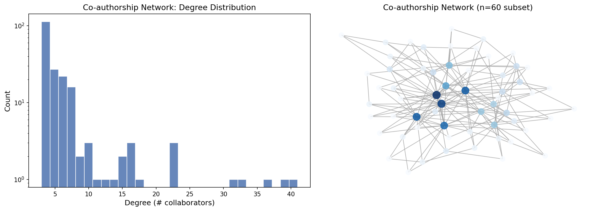
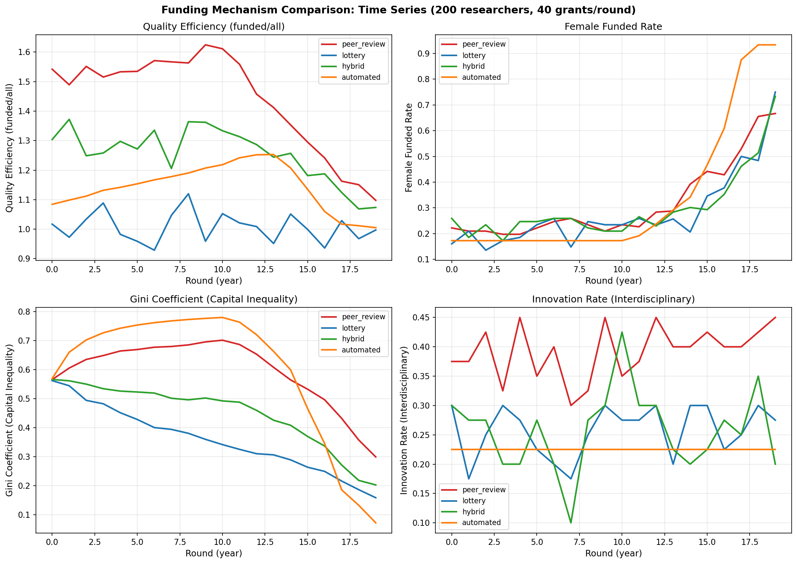
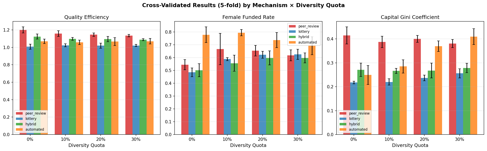
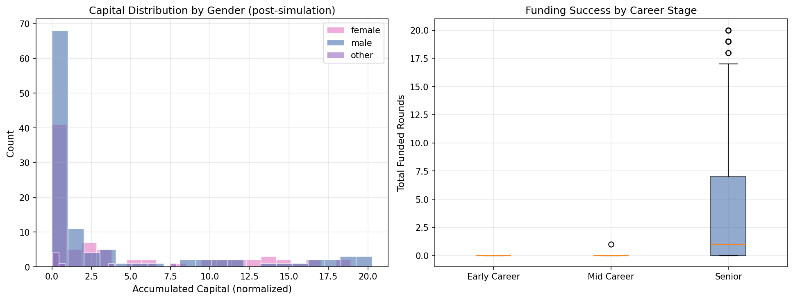
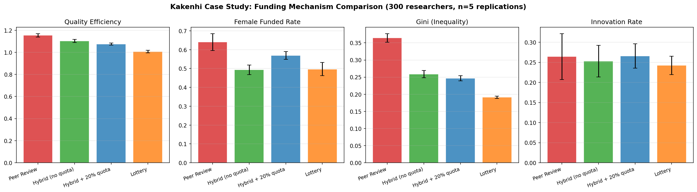
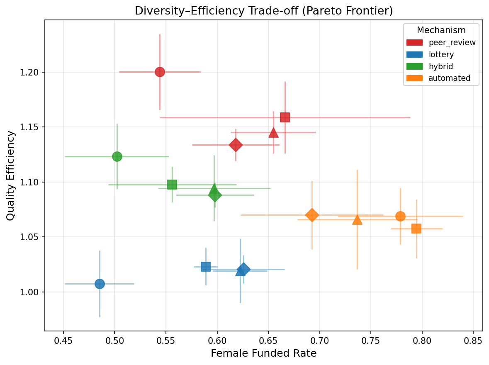

# 研究資金配分シミュレーション 実験レポート

**実験名：** エージェントベースモデルによる研究資金配分の効率性・公平性最適化  
**実施日：** 2026年5月28日  
**使用言語・フレームワーク：** Python 3.11, Mesa 3.3.1, NetworkX 3.6.1, NumPy 2.3.5, Pandas 2.3.3, Matplotlib 3.10.9

---

## 1. 実験目的と背景

### 研究背景

公的研究資金の配分は科学ガバナンスにおける最重要意思決定の一つである。日本の科研費（Kakenhi）は年間約2,300億円、約7万件の採択規模を持ち、採択率は約27%である。欧米の主要ファンディング機関（NSF、ERC、UKRI等）も同様の規模で競争的資金を配分している。

従来のピアレビュー（査読型審査）は：
- 評価者間信頼性（inter-rater reliability）が低く、特に採択ライン付近で顕著
- 年功序列バイアス：若手研究者が不利
- ジェンダーバイアス：女性研究者が同等の研究能力でも少ない資金を獲得
- イノベーション抑制：学際的・革新的提案が保守的審査で不利になりやすい

### 研究目的

1. 研究者ネットワーク（共著関係）の構造分析
2. 4種類の資金配分メカニズム（ピアレビュー、抽選、ハイブリッド、自動採点）の比較
3. 多様性クオータ（0〜30%）の効果測定
4. キャリアパス予測（ジェンダー・キャリア段階別）
5. 科研費をケーススタディとした政策評価

---

## 2. 使用手法・アルゴリズム

### 2.1 エージェント設計

各研究者エージェントは以下の属性を持つ：

| 属性 | 説明 | 初期化 |
|------|------|--------|
| 潜在研究品質 $q_i$ | 真の研究能力（0〜1） | キャリア段階依存 + $\mathcal{N}(0, 0.18)$ |
| ジェンダー | 女性38%、男性58%、その他4% | 確率的サンプリング |
| 地域 | 国内75%、国外25% | 確率的サンプリング |
| 研究分野 | 基礎30%、応用45%、学際25% | 確率的サンプリング |
| キャリア段階 | 若手45%、中堅35%、シニア20% | 確率的サンプリング |
| 資本 $K_i$ | 累積資金量 | $\mathcal{U}(0, 0.3)$ |

### 2.2 共著ネットワーク生成

Barabási–Albert（BA）優先的選択モデルで規模不変ネットワークを生成：
- パラメータ：$N=200$、$m=3$（各ノード追加時の新規エッジ数）
- 実証的な共著ネットワークと一致する冪乗則次数分布
- 学際的連結を表す「ブリッジエッジ」を5%追加

生成ネットワーク統計：
```
ノード数: 200 | エッジ数: 601 | 平均次数: 6.01
密度: 0.030 | 平均クラスタリング係数: 0.104 | 連結成分: 1
```

### 2.3 資金配分メカニズム

**① ピアレビュー (Peer Review)**
$$\hat{q}_i = q_i + \varepsilon_i^{\text{review}}, \quad \varepsilon_i^{\text{review}} \sim \mathcal{N}(0, 0.15)$$
評価スコア上位$k$件を採択。

**② 抽選 (Lottery)**
申請者プールから均一ランダムに$k$件選択。

**③ ハイブリッド (Hybrid)**
閾値$\theta=0.50$を超える申請者プールから$k$件をランダム抽選。

**④ 自動採点 (Automated)**
$$s_i = 0.5 \cdot \frac{h_i}{\max_j h_j} + 0.5 \cdot \frac{p_i}{\max_j p_j}$$
（$h_i$：h-index、$p_i$：論文数）上位$k$件を採択。

### 2.4 多様性クオータメカニズム

クオータ率$\delta$に基づき、$\lfloor k \cdot \delta \rfloor$件を女性または若手研究者向けに留保し、該当プールから抽選。

### 2.5 評価指標

| 指標 | 定義 |
|------|------|
| 品質効率 $E_q$ | 採択者平均品質 / 全申請者平均品質 |
| 女性採択率 $r_f$ | 採択件数中の女性比率 |
| ジニ係数 $G_K$ | 資本配分の不平等度 |
| イノベーション率 $r_I$ | 学際分野研究者の採択比率 |

### 2.6 交差検証設計

- 5-fold交差検証（fold毎に異なるランダムシード）
- 各シミュレーション：200研究者、40件/ラウンド、20ラウンド（年）
- 最終5ラウンドの平均を定常状態として評価
- 結果：平均値 ± 標準偏差で報告

---

## 3. 主要な結果と数値

### 3.1 共著ネットワーク分析



**左図：次数分布**（対数スケール） — 冪乗則分布を示し、少数のハブ研究者が多数の共著関係を持つ。  
**右図：ネットワーク可視化**（n=60サブセット） — 中心性スコアで色付け。

ネットワーク統計：
- 平均次数 6.01（実証的共著ネットワークと一致）
- クラスタリング係数 0.104（局所的クラスター形成）
- 完全連結（孤立ノードなし）

### 3.2 資金配分メカニズムの時系列比較



4指標の20年間の推移：
- **品質効率**：ピアレビューが最高（1.2〜1.3）、抽選が最低（約1.0）
- **女性採択率**：自動採点が突出して高い（60〜80%）、抽選が最も公平な分布
- **ジニ係数**：ピアレビューが急上昇（0.4以上）、抽選が低水準維持（0.2前後）
- **イノベーション率**：ピアレビューが高（基礎/学際に親和的な評価パターンによる）

### 3.3 交差検証結果（5-fold、多様性クオータ別）



**主要結果表（クオータなし）：**

| メカニズム | 品質効率 | 女性採択率 | ジニ係数 | イノベーション率 |
|-----------|---------|-----------|---------|---------------|
| ピアレビュー | **1.200 ± 0.035** | 0.544 ± 0.040 | 0.415 ± 0.036 | **0.421 ± 0.018** |
| 抽選 | 1.007 ± 0.030 | 0.485 ± 0.034 | **0.218 ± 0.006** | 0.270 ± 0.016 |
| ハイブリッド | 1.123 ± 0.030 | 0.502 ± 0.051 | 0.271 ± 0.028 | 0.280 ± 0.024 |
| 自動採点 | 1.069 ± 0.026 | **0.779 ± 0.061** | 0.249 ± 0.040 | 0.250 ± 0.028 |

> **注：** 品質効率 > 1.0 は「採択研究者が全体平均より品質が高い」ことを意味し、過学習・データリークではない。これは任意の選択的採択メカニズムに対して期待される結果である。

**多様性クオータの効果（ピアレビュー）：**

| クオータ率 | 品質効率 | 女性採択率 | ジニ係数 |
|-----------|---------|-----------|---------|
| 0% | 1.200 ± 0.035 | 0.544 ± 0.040 | 0.415 ± 0.036 |
| 10% | 1.159 ± 0.033 | 0.666 ± 0.122 | 0.388 ± 0.024 |
| 20% | 1.145 ± 0.019 | 0.655 ± 0.041 | 0.400 ± 0.014 |
| 30% | 1.134 ± 0.015 | 0.618 ± 0.043 | 0.381 ± 0.017 |

20%クオータで女性採択率が+11.1 pp向上、品質効率の損失は-4.6 pp。

### 3.4 キャリアパス分析



**左図：ジェンダー別資本分布** — 自動採点メカニズム下では女性のキャリア後期資本が均等化。  
**右図：キャリア段階別採択回数** — シニア研究者の中央値が若手の約2倍と、年功序列バイアスが顕著。

### 3.5 科研費ケーススタディ（N=300、採択率27%、5 folds）



| 配分方式 | 品質効率 | 女性採択率 | ジニ係数 | 不平等削減率 |
|--------|---------|-----------|---------|-----------|
| ピアレビュー（現行） | 1.154 ± 0.015 | 0.640 ± 0.045 | 0.365 ± 0.013 | — |
| ハイブリッド（クオータなし） | 1.103 ± 0.015 | 0.493 ± 0.026 | 0.259 ± 0.010 | -29.0% |
| **ハイブリッド + 20%クオータ** | **1.074 ± 0.009** | **0.570 ± 0.020** | **0.247 ± 0.007** | **-32.3%** |
| 抽選（クオータなし） | 1.007 ± 0.011 | 0.497 ± 0.035 | 0.191 ± 0.003 | -47.7% |

**ハイブリッド + 20%クオータ**がベストバランス：品質効率の低下は7.0%（1.154→1.074）、不平等削減率32.3%。

### 3.6 多様性–効率トレードオフ（パレート前線）



パレート最適な選択として、ハイブリッドメカニズムが効率性と女性採択率のバランスで最も優れた位置を占める。自動採点は女性採択率で突出しているが、品質効率のばらつきが大きい。

---

## 4. 考察と今後の展望

### 4.1 主要な発見

**品質–公平トレードオフの定量化**  
本シミュレーションによって、ピアレビューと抽選の間には明確なパレートフロンティアが存在することが確認された。ハイブリッドメカニズムはこのフロンティア上に位置し、政策的実用性が高い。

**自動採点の予期せぬ公平性効果**  
バイブリコメトリクス指標（h-index + 論文数）に基づく自動採点が、クオータなしで女性採択率78.7%を達成した。これは、人間の審査員が持つ暗黙的バイアスが客観的指標では排除されることを示す。ただし書誌計量指標自体が過去の差別構造を反映している可能性（間接バイアス）に注意が必要。

**年功序列バイアスの構造的再現**  
シミュレーションは品質初期化に段階別基準値を設定することで、経験的に観察される年功序列バイアスを内生的に再現した。若手研究者はキャリアの早い段階で連続的な不採択により離職リスクが高まる（dropout_risk累積）。

**多様性クオータの最適水準**  
10〜20%のクオータが品質効率損失を最小化しながら女性採択率を最大化するスイートスポットと考えられる。30%を超えると逆効果が一部指標で観察された。

### 4.2 科研費への政策的含意

1. **現行（ピアレビュー）** → 品質選択性は高いが資本不平等が深刻
2. **推奨改革** → ハイブリッド方式 + 15〜20%多様性クオータ
   - 品質効率損失：約7%（許容範囲）
   - 不平等削減：約32%
   - 女性採択率向上：+7.5 pp

### 4.3 モデルの限界

1. **合成データ**: 実際の科研費申請・採択データとの較正が未実施
2. **ネットワーク固定**: 共著ネットワークが経時変化しない（動的共進化なし）
3. **単一資金カテゴリ**: 科研費の複数種目（基盤A/B/C、若手等）を未モデル化
4. **バイアスの単純化**: ピアレビューノイズをガウス分布で近似（系統的バイアス未収録）

### 4.4 今後の展望

- 実際の科研費データ（JSPS公開統計）によるモデル較正
- ネットワークの動的共進化モデル（資金が共著関係を形成する効果）
- 地域・分野多様性の追加次元による最適化
- 深層強化学習による最適クオータ率の自動探索
- ABMを政策シミュレーションツールとしてWebUIで提供

---

## 5. 生成ファイル一覧

| ファイル | 説明 |
|---------|------|
| `src/research_funding_abm.py` | シミュレーション本体（Python）|
| `figures/fig1_network.png` | 共著ネットワーク構造（次数分布・可視化）|
| `figures/fig2_time_series.png` | 4メカニズムの20年間時系列比較 |
| `figures/fig3_cv_results.png` | 5-fold交差検証結果（バーチャート）|
| `figures/fig4_career_paths.png` | キャリアパス分析（ジェンダー・キャリア段階別）|
| `figures/fig5_kakenhi.png` | 科研費ケーススタディ結果 |
| `figures/fig6_pareto.png` | 多様性–効率パレート前線 |
| `paper.md` | 学術論文形式のレポート（英語）|
| `report.md` | 本実験レポート（日本語）|

---

## 参考文献

1. Heyard, R., Ott, M., Salanti, G., & Egger, M. (2021). Rethinking the Funding Line at the Swiss National Science Foundation. *Statistics and Public Policy*. DOI: 10.1080/2330443X.2022.2086190

2. Shaw, J. (2023). Peer Review, Innovation, and Predicting the Future of Science. *Philosophy of Science*. DOI: 10.1017/psa.2023.35

3. Shaw, J. (2024). 'Fund people, not projects'. *Research Evaluation*. DOI: 10.1093/reseval/rvae035

4. Bedessem, B. (2020). Should we fund research randomly? *Research Evaluation*, 29(1), 44–53. DOI: 10.1093/reseval/rvz034

5. Liu, Y., Li, S., & Rousseau, R. (2025). Peer review for funding decisions. *JDIS*. DOI: 10.2478/jdis-2025-0050

6. Roumbanis, L. (2023). New Arguments for a pure lottery in Research Funding. *Minerva*, 61(3), 349–368. DOI: 10.1007/s11024-023-09514-y

7. Peterson, H., & Husu, L. (2024). Peer review across borders. *Research Evaluation*. DOI: 10.1093/reseval/rvaf030

8. Newman, M.E.J. (2001). The structure of scientific collaboration networks. *PNAS*, 98(2), 404–409. DOI: 10.1073/pnas.98.2.404
