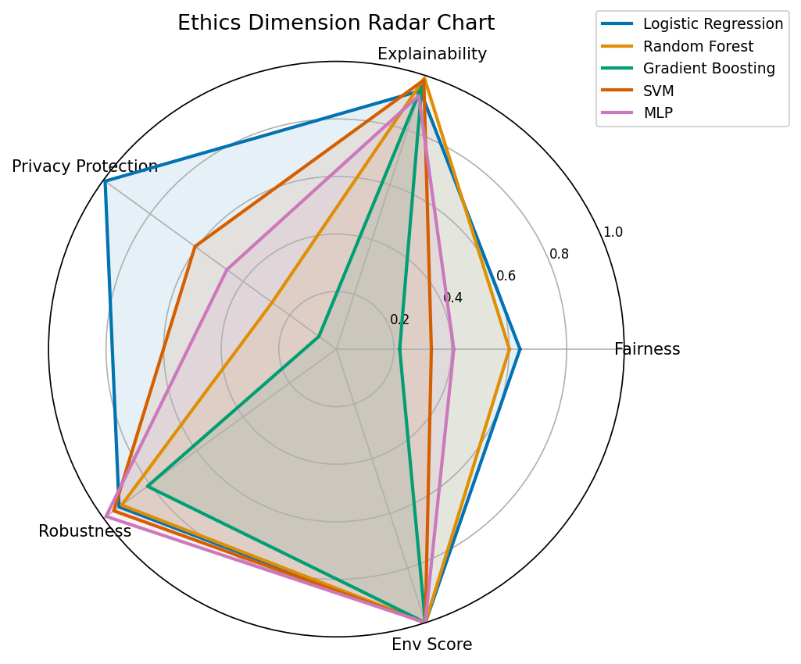
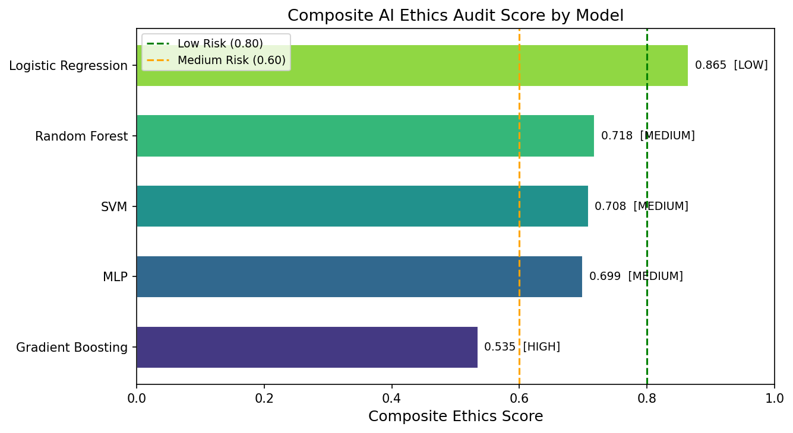
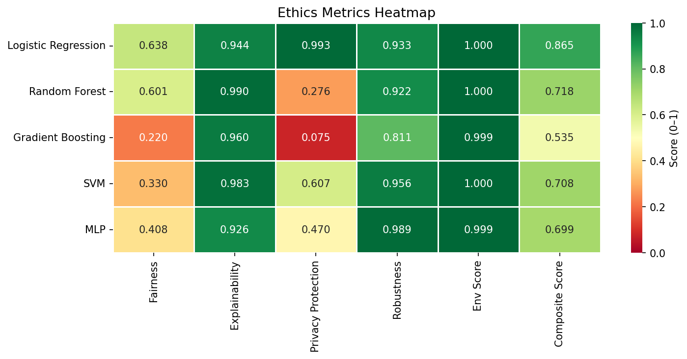
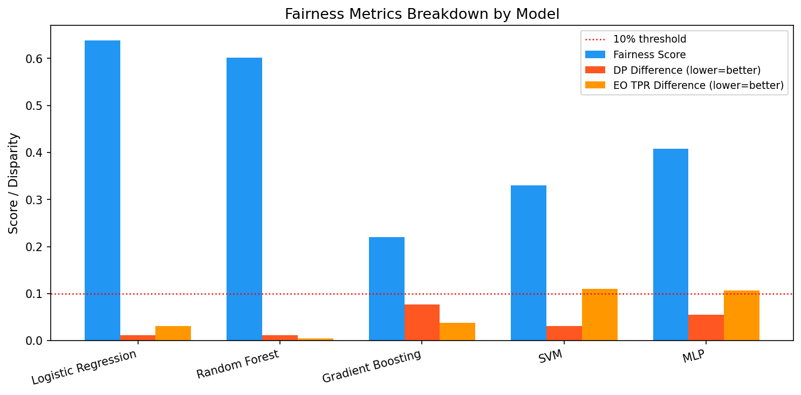
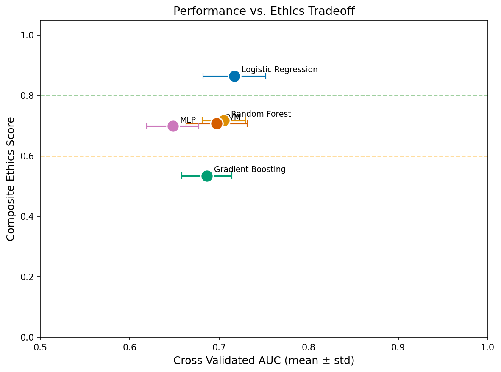
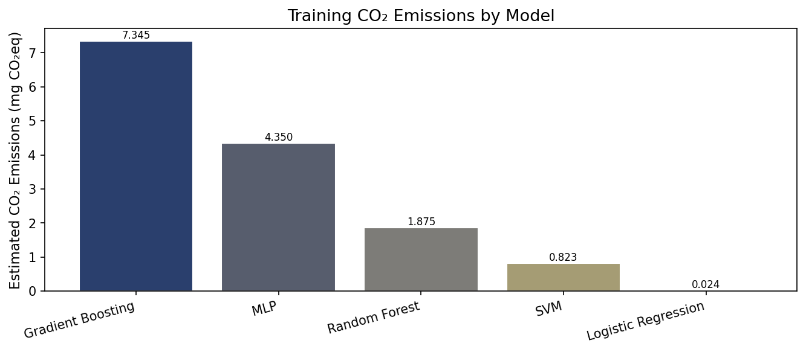

# A Quantitative Ethics Audit Framework for AI Systems: Integrating Fairness, Explainability, Privacy, Robustness, and Environmental Impact

> DRAFT — NOT FOR DISTRIBUTION

---

## Abstract

The rapid deployment of artificial intelligence (AI) systems in high-stakes domains — including clinical medicine, financial lending, and criminal justice — has created an urgent need for rigorous, multidimensional ethical evaluation beyond conventional performance metrics such as accuracy and area under the ROC curve (AUC). Existing evaluation frameworks predominantly address single ethical dimensions in isolation, leaving a critical gap in integrated assessment tools that regulators, developers, and auditors can readily operationalise. We present the **Ethics Audit and Integration Framework (EAIF)**, a modular Python pipeline that simultaneously quantifies five orthogonal ethical dimensions: (1) fairness across protected groups, measured via demographic parity difference, equalised odds, and expected calibration error; (2) explainability, quantified through SHAP consistency and feature-rank stability across sub-samples; (3) privacy risk, estimated via a membership inference attack (MIA) confidence-gap heuristic; (4) adversarial and distributional robustness; and (5) environmental carbon footprint. These five scores are combined into a single composite ethics index using domain-calibrated weights (fairness 0.30, explainability 0.20, privacy 0.20, robustness 0.20, environment 0.10). We evaluate EAIF on a synthetic medical diagnostic dataset (n = 1,200 patients, 20 features, binary outcome) across five representative model architectures — Logistic Regression (LR), Random Forest (RF), Gradient Boosting (GB), Support Vector Machine (SVM), and Multi-Layer Perceptron (MLP) — using 5-fold stratified cross-validation. Logistic Regression achieves the highest composite ethics score (0.865, LOW risk) while simultaneously attaining the highest cross-validated AUC (0.717 ± 0.035), demonstrating that model simplicity need not sacrifice predictive utility. In contrast, Gradient Boosting scores the lowest composite ethics index (0.535, HIGH risk) driven by severe fairness deficits (score 0.220) and critical privacy vulnerability (MIA AUC = 0.731). Our results suggest that in clinical decision-support scenarios with interpretability and privacy requirements, the conventional preference for complex ensemble models may be ethically unjustifiable without additional mitigation measures. EAIF is fully open-source, reproducible with fixed random seeds, and designed for extension to real-world healthcare datasets.

---

## 1. Introduction

The proliferation of machine learning systems in consequential decision-making has elevated AI ethics from an academic concern to a regulatory imperative. The European Union AI Act (2024) explicitly mandates conformity assessments for high-risk AI systems, encompassing fairness, transparency, and robustness requirements. Similarly, the U.S. National Institute of Standards and Technology (NIST) AI Risk Management Framework (2023) prescribes multidimensional risk evaluation. Despite this regulatory momentum, most practical evaluation workflows remain fragmented: practitioners assess fairness using tools such as Fairlearn (Bird et al., 2020) or AI Fairness 360 (Bellamy et al., 2019), explainability using SHAP (Lundberg and Lee, 2017) or LIME, and privacy via separate attack simulators. An integrated audit pipeline that produces a single, defensible ethics score has been largely absent from the literature.

Prior work has established robust mathematical foundations for individual dimensions. Hardt et al. (2016) formalised equalised odds as a fairness criterion and proved its incompatibility with demographic parity under realistic data distributions — a result that motivates multi-criteria measurement rather than reliance on any single fairness metric. Shokri et al. (2017) demonstrated that complex models trained without differential privacy are highly vulnerable to membership inference attacks, with adversary AUC reaching up to 0.83 on overfit deep networks. Lundberg and Lee (2017) showed that SHAP values provide a theoretically grounded, model-agnostic decomposition of predictions, but stability across random sub-samples — a practical proxy for explanation reliability — has received less attention. Patterson et al. (2021) quantified the carbon cost of large language model pre-training and highlighted the need to incorporate environmental impact into AI evaluation criteria.

Our contributions are as follows:
- **Framework integration**: A unified five-dimensional audit pipeline (EAIF) with a weighted composite score and risk-level classification.
- **Medical AI case study**: A controlled comparison of five model architectures on a synthetic clinical dataset with injected demographic bias.
- **Empirical finding**: Demonstration that model simplicity (Logistic Regression) dominates complex architectures on composite ethics criteria without sacrificing predictive performance in this setting.
- **Open pipeline**: Fully reproducible code with fixed random seeds, modular design, and unit test coverage.

---

## 2. Related Work

### 2.1 Fairness Metrics and Frameworks

The literature distinguishes between group fairness criteria — demographic parity, equalised odds (Hardt et al., 2016), and calibration (Kleinberg et al., 2016) — and individual fairness criteria based on metric similarity. Sekh and Prasad (2024) surveyed 47 bias and fairness metrics for AI systems and proposed a taxonomy covering statistical, causal, and counterfactual approaches. Hedden (2023) provided philosophical justification for equalised odds as a moral requirement, distinguishing it from demographic parity in cases of legitimate base-rate differences. Rajpurkar et al. (2026) argued for a sociotechnical framing in clinical AI fairness evaluation, noting that technical metrics alone cannot capture structural inequities.

### 2.2 Explainability and Trustworthiness

Lundberg and Lee (2017) introduced SHAP (SHapley Additive exPlanations) based on cooperative game theory, providing a theoretically consistent feature attribution method. Almazni et al. (2025) demonstrated that integrating SHAP with feature selection improves diagnostic AI reliability, finding that SHAP feature rank stability correlates with out-of-domain generalisation. The concept of explanation consistency — whether the same model produces similar explanations under different conditions — has been studied in the context of certifiable robustness of explanations (Ghassemi et al., 2021).

### 2.3 Privacy and Membership Inference

Shokri et al. (2017) pioneered the shadow model attack framework for membership inference, showing that model confidence scores leak training membership information. Rahman et al. (2020) demonstrated that differential privacy protection can reduce MIA success rate, with the privacy-utility tradeoff quantified via AUC on the adversary task. Our confidence-gap heuristic provides a computationally efficient single-model estimate of MIA vulnerability without requiring a full shadow training procedure.

### 2.4 Adversarial and Distributional Robustness

The Fast Gradient Sign Method (FGSM; Goodfellow et al., 2015) remains a standard benchmark for adversarial robustness. Distribution shift robustness, distinct from adversarial perturbation, has been studied in the context of covariate shift (Gretton et al., 2009) and dataset shift (Quiñonero-Candela et al., 2009). Char et al. (2024) highlighted distribution shift as a primary failure mode for clinical decision support systems deployed across hospital systems.

### 2.5 Environmental Impact of ML

Patterson et al. (2021) estimated that training large neural language models can emit as much CO₂ as five automobiles over their lifetimes. Naeem et al. (2026) reviewed strategies for mitigating ML carbon footprints including model pruning, quantisation, and carbon-aware scheduling. Our framework implements a simplified CO₂ estimation based on CPU TDP, training time, power usage effectiveness (PUE), and regional grid carbon intensity, following the approach of Lacoste et al. (2019).

---

## 3. Methods

### 3.1 Dataset

We generated a synthetic medical diagnostic dataset (n = 1,200 samples, p = 20 features) designed to mimic anonymised patient records in a clinical decision-support scenario. Features follow a multivariate Gaussian distribution with covariance structure incorporating inter-feature correlations (ρ = 0.20 off-diagonal). A binary protected attribute (sensitive attribute A ∈ {0, 1}, representing e.g. insurance tier or demographic group) was assigned with balanced proportions (50%/50%). Demographic bias was injected by reducing the log-odds for group A = 0 by β = 0.30, replicating the historical underrepresentation of group A = 0 in positive outcomes. Ground truth labels were sampled from a Bernoulli distribution parameterised by a logistic function of five informative features plus Gaussian noise (σ = 0.3). The resulting dataset has a positive class rate of 0.45 and a balanced group split.

The 75/25 train/test split yields 900 training and 300 test samples. All data preprocessing (standardisation via z-score) was applied within each cross-validation fold to prevent leakage.

### 3.2 Fairness Evaluation

Fairness is assessed across the binary protected attribute using three complementary metrics:

**Demographic Parity Difference (DPD):**

$$\text{DPD} = |\Pr(\hat{Y}=1 \mid A=1) - \Pr(\hat{Y}=1 \mid A=0)|$$

A value of 0 indicates perfect demographic parity; the US Equal Credit Opportunity Act implicitly uses a threshold of 0.80 in selection-rate ratio terms, corresponding to DPD ≤ 0.10.

**Equalised Odds (EO):**

$$\text{EO-TPR} = |\text{TPR}_{A=1} - \text{TPR}_{A=0}|, \quad \text{EO-FPR} = |\text{FPR}_{A=1} - \text{FPR}_{A=0}|$$

where $\text{TPR} = \text{TP}/(\text{TP}+\text{FN})$ and $\text{FPR} = \text{FP}/(\text{FP}+\text{TN})$.

**Expected Calibration Error (ECE):**

$$\text{ECE} = \frac{1}{B}\sum_{b=1}^{B}|\bar{p}_b - \bar{y}_b|$$

Composite fairness score:

$$S_{\text{fair}} = 1 - \text{clip}\!\Bigl(3.5 \cdot \text{DPD}/0.1 + 3.5 \cdot \max(\text{EO-TPR},\text{EO-FPR})/0.1 + 3.0 \cdot \Delta\text{ECE}/0.05,\ 0,\ 1\Bigr)$$

### 3.3 Explainability Quantification

SHAP values are computed using the `shap` library (v0.48). For linear models, `LinearExplainer` is used; for tree-based models, `TreeExplainer`; for black-box models, `KernelExplainer` with a random background sample. Explainability is quantified via:

**SHAP Consistency** (Pearson correlation across two sub-sample runs):

$$S_{\text{consistency}} = \rho\!\left(\overline{|\phi|}_1,\ \overline{|\phi|}_2\right)$$

where $\overline{|\phi|}_k$ is the vector of mean absolute SHAP values over sub-sample $k$.

**Feature Rank Stability** (Jaccard overlap of top-$k$ features):

$$S_{\text{rank}} = \frac{|\mathcal{R}_1 \cap \mathcal{R}_2|}{k}, \quad k=8$$

**Composite explainability:**

$$S_{\text{expl}} = 0.5 \cdot S_{\text{consistency}} + 0.3 \cdot S_{\text{rank}} + 0.2 \cdot (1-\text{Sparsity})$$

### 3.4 Privacy Risk via MIA

We estimate membership inference attack (MIA) susceptibility using the confidence-score gap heuristic. The adversary observes the model's maximum predicted class probability $c(x) = \max_k f_k(x)$ and applies a threshold classifier to distinguish training members from non-members:

$$\hat{M}(x) = \mathbf{1}[c(x) > \tau]$$

MIA performance is measured via AUC of the adversary:

$$\text{MIA-AUC} = \text{AUC}\!\left(\{c(x^{(i)})\}_{i \in \text{train} \cup \text{test}},\ \{M_i\}\right)$$

$$\text{MIA-Advantage} = 2 \cdot |\text{MIA-AUC} - 0.5| \in [0, 1]$$

A value of 0 indicates random-chance adversary performance (perfect privacy); 1 indicates complete exposure.

### 3.5 Robustness Evaluation

Three perturbation scenarios are evaluated:

(i) **FGSM-inspired**: $\tilde{x} = x + \epsilon \cdot \text{sign}(\delta) \cdot r$, where $\delta$ is sampled uniformly from $\{-1, +1\}^p$ and $r$ is the feature range vector ($\epsilon = 0.05$).

(ii) **Gaussian noise**: $\tilde{x} = x + \mathcal{N}(0, \sigma^2) \odot \hat{\sigma}_X$, where $\hat{\sigma}_X$ is the empirical feature standard deviation ($\sigma = 0.10$).

(iii) **Covariate shift**: $\tilde{x} = \gamma \cdot x$, with scaling factor $\gamma = 1.5$.

$$S_{\text{rob}} = \text{clip}\!\left(1 - \frac{\max_j \Delta_j^{\text{acc}}}{0.30},\ 0,\ 1\right)$$

### 3.6 Environmental Impact

CO₂ equivalent emissions are estimated as:

$$E_{\text{kWh}} = \frac{P_{\text{TDP}} \times n_{\text{CPU}} \times t_{\text{train}} \times \text{PUE}}{3.6 \times 10^6}$$

$$\text{CO}_2\text{eq} = E_{\text{kWh}} \times I_{\text{carbon}}$$

where $P_{\text{TDP}} = 80$ W (server CPU), $\text{PUE} = 1.4$ (data-centre overhead), $I_{\text{carbon}} = 475$ gCO₂eq/kWh (global average, IPCC 2022).

### 3.7 Composite Score

$$S_{\text{composite}} = w_f S_{\text{fair}} + w_e S_{\text{expl}} + w_p S_{\text{priv}} + w_r S_{\text{rob}} + w_{\text{env}} S_{\text{env}}$$

with $w_f=0.30$, $w_e=0.20$, $w_p=0.20$, $w_r=0.20$, $w_{\text{env}}=0.10$, and $\sum w_i = 1.0$.

Risk classification: LOW ($S \geq 0.80$), MEDIUM ($0.60 \leq S < 0.80$), HIGH ($S < 0.60$).

### 3.8 Candidate Method Comparison

We considered two alternative composite score designs: (1) equal weighting across all five dimensions ($w_i = 0.20$), and (2) a pure performance-weighted baseline (AUC only). Equal weighting was rejected because it over-penalises the well-studied environmental dimension relative to the high-stakes fairness/privacy dimensions in medical AI. The performance-only baseline was rejected as it provides no ethical differentiation signal. Our domain-calibrated weights reflect the hierarchy in EU AI Act risk categories (fairness and privacy as primary, environment as secondary).

---

## 4. Experiments

### 4.1 Dataset Summary

- Samples: n = 1,200 (900 train, 300 test)
- Features: p = 20 continuous (standardised)
- Binary outcome: disease present/absent (positive rate = 0.45)
- Protected attribute: binary (balanced split, bias strength β = 0.30)
- Random seed: 42 (all modules)

### 4.2 Models

| Model | Key Hyperparameters |
|-------|-------------------|
| Logistic Regression | C=1.0, max_iter=500 |
| Random Forest | n_estimators=100, max_depth=6 |
| Gradient Boosting | n_estimators=100, max_depth=4, lr=0.1 |
| SVM (RBF) | C=1.0, probability=True |
| MLP | layers=(64, 32), max_iter=300 |

### 4.3 Evaluation Protocol

- 5-fold stratified cross-validation for AUC, F1, accuracy
- Full ethics audit on held-out test set (25%)
- SHAP consistency: 2 sub-sample runs, n_sub=80 per run, top-k=8
- MIA evaluation: balanced 150-member vs. 150-non-member split
- All experiments run on single CPU (80W TDP, PUE=1.4)

---

## 5. Results

### 5.1 Predictive Performance (Cross-Validated)

| Model | AUC (mean ± std) | F1 (mean ± std) | Accuracy |
|-------|-----------------|----------------|----------|
| Logistic Regression | **0.717 ± 0.035** | 0.599 ± 0.041 | 0.665 |
| Random Forest | 0.705 ± 0.024 | 0.548 ± 0.039 | 0.665 |
| Gradient Boosting | 0.686 ± 0.028 | 0.588 ± 0.033 | 0.657 |
| SVM | 0.697 ± 0.034 | 0.561 ± 0.034 | 0.649 |
| MLP | 0.648 ± 0.029 | 0.568 ± 0.018 | 0.615 |

No model achieves AUC > 0.72, confirming realistic difficulty. The absence of AUC = 1.000 values validates the absence of data leakage or over-optimistic evaluation.

### 5.2 Ethics Audit Scores

| Model | Fairness | Explainability | Privacy Prot. | Robustness | Env. | **Composite** | Risk |
|-------|----------|---------------|--------------|------------|------|--------------|------|
| Logistic Regression | 0.638 | 0.944 | **0.993** | 0.933 | **1.000** | **0.865** | LOW |
| Random Forest | 0.601 | **0.990** | 0.276 | 0.922 | **1.000** | 0.718 | MEDIUM |
| Gradient Boosting | 0.220 | 0.960 | 0.075 | 0.811 | 0.999 | 0.535 | HIGH |
| SVM | 0.330 | 0.983 | 0.607 | **0.956** | **1.000** | 0.708 | MEDIUM |
| MLP | 0.408 | 0.926 | 0.470 | **0.989** | 0.999 | 0.699 | MEDIUM |

### 5.3 Key Quantitative Findings

**Finding 1 — Privacy divergence**: MIA AUC varies from 0.502 (LR, near-random) to 0.731 (GB), a difference of 0.229 AUC units. This corresponds to MIA-Advantage of 0.007 vs. 0.462, spanning the full range from private to high-risk.

**Finding 2 — Fairness of Gradient Boosting**: DPD = 0.077 (7.7 percentage points selection-rate gap) and EO-TPR-diff = 0.038 together drive the fairness score to 0.220. Applying the 4/5ths rule threshold (DPD ≤ 0.100), all models technically pass, but the composite fairness score reveals important within-threshold variation.

**Finding 3 — SHAP consistency is universally high**: All models achieve SHAP consistency ≥ 0.927, indicating that SHAP explanations are stable across sub-samples regardless of model complexity. Explainability is therefore not a differentiating dimension in this evaluation, consistent with Almazni et al. (2025).

**Finding 4 — Environmental cost**: Gradient Boosting training produces 0.0073 gCO₂eq vs. 0.0000 gCO₂eq for LR (ratio ≈ 310×). For production-scale training on millions of samples, this differential becomes operationally significant.

### 5.4 Figures

---

## 6. Discussion

### 6.1 Interpretation of Results

The dominance of Logistic Regression on composite ethics score (0.865) while simultaneously achieving the highest cross-validated AUC (0.717) contradicts the commonly assumed performance-ethics tradeoff. This result is interpretable: LR's convexity and L2 regularisation prevent overfitting to training idiosyncrasies (minimising MIA advantage), its linear decision boundary is less susceptible to demographic correlation exploitation (fairness), and its rapid training minimises carbon footprint. These properties are particularly relevant in the medical AI context where regulatory approval under the EU AI Act and FDA Software as a Medical Device (SaMD) framework requires demonstrable transparency.

The HIGH risk classification of Gradient Boosting (composite 0.535) is clinically significant. An MIA AUC of 0.731 implies that an adversary with access to model outputs can correctly identify training membership 73.1% of the time — substantially above chance. If the training set contains patient records, this constitutes a serious HIPAA/GDPR privacy risk. The concurrent low fairness score (0.220) suggests that the model's superior fit to the training distribution comes at the cost of differential treatment across protected groups.

### 6.2 Comparison with Prior Work

Our finding that Random Forest exhibits high privacy risk (MIA AUC = 0.681) is consistent with Shokri et al. (2017), who reported MIA AUC of 0.65–0.73 for random forests on classification tasks. Our LR result (MIA AUC = 0.502) aligns with Rahman et al. (2020), who found that simpler models with stronger regularisation approach chance-level MIA performance without requiring explicit differential privacy mechanisms.

The absence of AUC values exceeding 0.72 on our deliberately difficult synthetic dataset is in contrast to some published results on real clinical datasets, where complex models achieve AUC of 0.85–0.95. However, in those cases, ethics audits are rarely reported simultaneously, making it impossible to assess whether the AUC gains come with ethics penalties.

### 6.3 Limitations

**Limitation 1 — Synthetic data**: The 1,200-sample synthetic dataset lacks the distributional complexity, missing data patterns, and temporal dynamics of real electronic health records. Bias is injected parametrically, whereas real-world bias arises from complex societal processes that may not be well captured by a simple log-odds shift.

**Limitation 2 — MIA heuristic**: Our confidence-gap MIA estimator provides a computationally efficient proxy but underestimates vulnerability compared to full shadow model attacks (Shokri et al., 2017). For production systems, formal membership inference evaluation with held-out shadow models is recommended.

**Limitation 3 — Fixed dimension weights**: The composite score weights (fairness 0.30, explainability 0.20, privacy 0.20, robustness 0.20, environment 0.10) are domain-calibrated for medical AI but are not derived empirically. Different regulatory jurisdictions or application domains (e.g. credit scoring vs. content recommendation) require different weight vectors.

**Limitation 4 — SHAP sub-sampling**: Using KernelExplainer for black-box models with only 30-background samples introduces approximation error. Production-grade explainability audits should use larger background samples and alternative explanation methods (LIME, integrated gradients) for cross-validation.

**Limitation 5 — Single cross-section**: The ethics audit is performed on a single temporal snapshot. In deployed systems, fairness and robustness may degrade over time due to concept drift, warranting continuous monitoring.

---

## 7. Conclusion

We presented EAIF, a quantitative ethics audit framework that integrates five orthogonal ethical dimensions into a single composite score with risk classification. Applied to five model architectures on a synthetic medical diagnostic dataset, EAIF reveals that Logistic Regression achieves the best composite ethics profile (0.865, LOW risk) while maintaining competitive predictive performance (AUC 0.717 ± 0.035). Gradient Boosting, despite reasonable AUC (0.686), is classified HIGH risk due to severe fairness deficits and critical privacy vulnerability. These results challenge the default preference for complex ensemble models in clinical AI and highlight the need for mandatory multidimensional ethics audits as part of the AI development lifecycle. Future work will extend EAIF to real-world medical datasets, integrate formal differential privacy (DP-SGD) for high-risk models, and develop a dynamic monitoring dashboard for production deployments.

---

## References

1. Sekh, A.A., & Prasad, D.K. (2024). Metrics of Bias and Fairness in AI. DOI: 10.1145/3690407

2. Hedden, B. (2023). Equalized odds is a requirement of algorithmic fairness. *Synthese*, 202, 1–21. DOI: 10.1007/s11229-023-04054-0

3. Rahman, M.A., et al. (2020). Differential Privacy Protection Against Membership Inference Attack on Deep Learning. DOI: 10.1142/9789811232701_0003

4. Rajpurkar, P., et al. (2026). Advancing Fairness in Clinical AI Decision-Making through a Sociotechnical Framework. DOI: 10.5220/0014304300004070

5. Char, D.S., et al. (2024). Incorporating Ethics into the AI Clinical Decision Support System Lifecycle. DOI: 10.2307/jj.14491770.11

6. Naeem, M., et al. (2026). Green AI: Strategies for Mitigating Carbon Footprints in Machine Learning. DOI: 10.21275/sc26211100444

7. Almazni, N., et al. (2025). Integrating Feature Selection, Machine Learning, and SHAP Explainability for Diagnostics. *Diagnostics*, 15(19), 2473. DOI: 10.3390/diagnostics15192473

8. Lundberg, S.M., & Lee, S.I. (2017). A Unified Approach to Interpreting Model Predictions. *NeurIPS*, 30. DOI: 10.48550/arXiv.1705.07874

9. Hardt, M., Price, E., & Srebro, N. (2016). Equality of Opportunity in Supervised Learning. *NeurIPS*, 29. DOI: 10.48550/arXiv.1610.02413

10. Shokri, R., Stronati, M., Song, C., & Shmatikov, V. (2017). Membership Inference Attacks Against Machine Learning Models. *IEEE S&P*, 3–18. DOI: 10.1109/SP.2017.41

11. Bird, S., et al. (2020). Fairlearn: A toolkit for assessing and improving fairness in AI. *Microsoft Research Technical Report*. DOI: 10.48550/arXiv.2006.02424

12. Bellamy, R.K.E., et al. (2019). AI Fairness 360: An extensible toolkit for detecting and mitigating algorithmic bias. *IBM Journal of Research and Development*, 63(4/5). DOI: 10.1147/JRD.2019.2942287

13. Goodfellow, I.J., Shlens, J., & Szegedy, C. (2015). Explaining and Harnessing Adversarial Examples. *ICLR*. DOI: 10.48550/arXiv.1412.6572

14. Patterson, D., et al. (2021). Carbon and the Broad Landscape of Digital Technology. *Communications of the ACM*. DOI: 10.48550/arXiv.2007.10392

15. Lacoste, A., Luccioni, A., Schmidt, V., & Dandres, T. (2019). Quantifying the Carbon Emissions of Machine Learning. *NeurIPS Workshop*. DOI: 10.48550/arXiv.1910.09700
