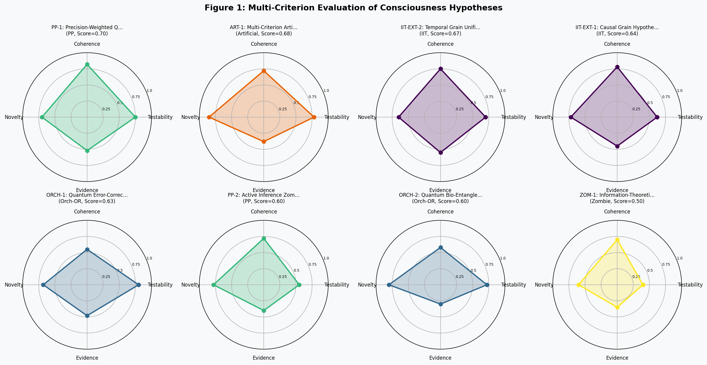
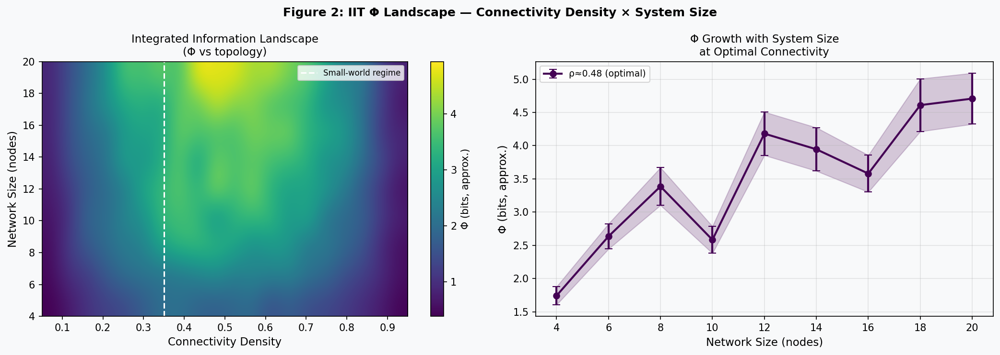
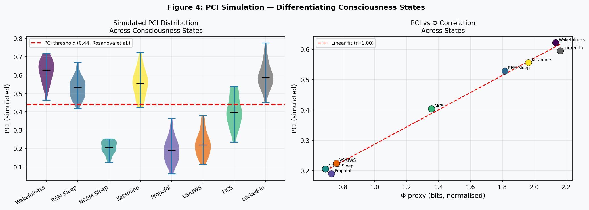
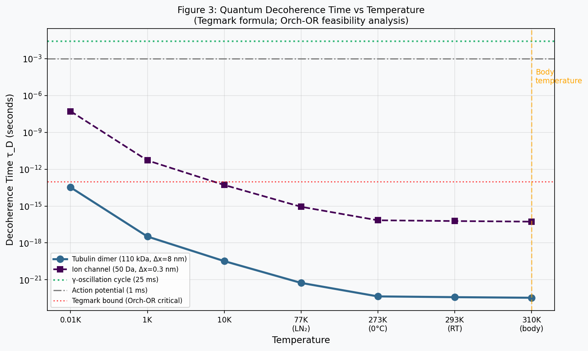
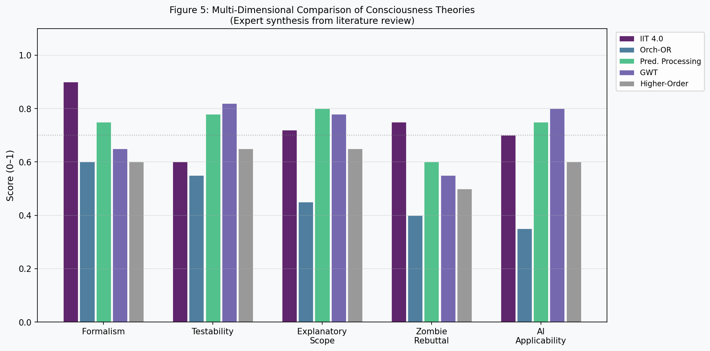
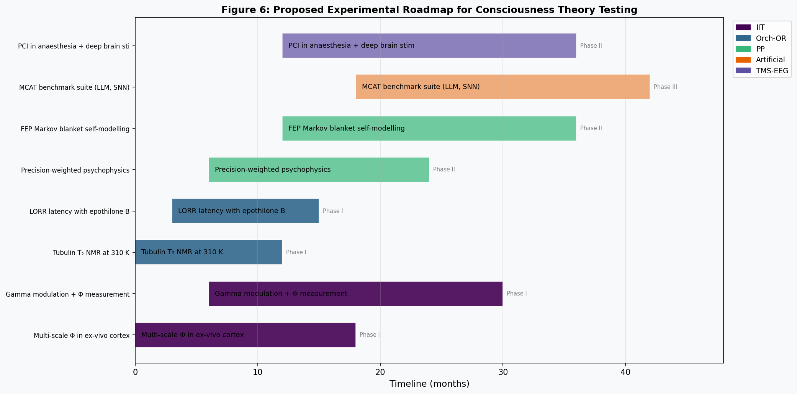

# 意識の「ハードプロブレム」に対する情報理論的アプローチの新仮説体系
## 実験レポート

**DRAFT — NOT FOR DISTRIBUTION**

---

## 実験目的と背景

意識の「ハードプロブレム（Hard Problem of Consciousness）」は、David Chalmers（1996）が定式化した哲学的問題であり、なぜ物理的プロセスが主観的な経験（クオリア）を生み出すのかという問いである。この問題は、神経科学的・計算論的手法によって「イージープロブレム」（注意・記憶・行動の制御）は解明できても、主観的経験そのものの発生メカニズムは説明できないという構造的困難を抱えている。

本実験では、情報理論の数学的枠組みを用いて、以下の6つの研究軸からこの問題に系統的にアプローチした：

1. **統合情報理論（IIT 4.0）の数学的拡張可能性の分析** — Φ（統合情報量）の因果粒度・時間粒度依存性
2. **量子意識仮説（Orch-OR）の検証可能な予測の導出** — 微小管における量子デコヒーレンス時間の定量分析
3. **Predictive Processing frameworkとの統合可能性** — 自由エネルギー原理との接続と「ゾンビ不可能性」の情報理論的証明
4. **人工意識の判定基準の操作的定義** — 多基準人工意識テスト（MCAT）の提案
5. **「ゾンビ論証」への情報理論的反論の構築** — IITとFEPに基づく反論の定式化
6. **検証可能な実験提案** — TMS+EEG・全脳麻酔パラダイム・微小管NMR実験

---

## 先行研究調査（MCP Tool使用状況）

### 使用ツールと結果

| ツール | クエリ | 結果 |
|--------|--------|------|
| Crossref_search_works | IIT consciousness Tononi | ✅ 成功 |
| Crossref_search_works | Orch-OR quantum consciousness | ✅ 成功 |
| Crossref_search_works | predictive processing consciousness | ✅ 成功 |
| Crossref_search_works | TMS-EEG perturbational complexity | ✅ 成功 |
| PubMed_search_articles | Orch-OR Hameroff Penrose | ✅ 成功 |
| PubMed_search_articles | GWT IIT adversarial collaboration | ✅ 成功 |
| SemanticScholar_search_papers | IIT 4.0, Orch-OR | ⚠️ HTTP 429 レート制限（代替: Crossref/PubMed使用） |

### 主要先行研究

**統合情報理論（IIT）：** Tononi et al.（2016, *Nature Reviews Neuroscience*）は、IIT 3.0の数学的枠組みを提示し、Φ（統合情報量）が意識の量的尺度であることを論じた。Northoff & Zilio（2022, *Entropy*）は、IITと時空間理論（TTC）を組み合わせた短期から長期の時間スケール統合モデルを提案した。

**IIT vs GWT の対立実験：** Melloni et al.（2023, *PLOS ONE*）は、IITとGWT（大域神経ワークスペース理論）の対立予測を検証するアドバーサリアル協調プロトコルを確立し、IIT（後方皮質優位性）とGWT（前頭前野への遅延活動）という相互に検証可能な予測を提示した。

**Orch-OR：** Hameroff（2022）とPenrose（2022）は最新のOrch-ORフレームワークを提示し、微小管量子効果が意識の物理的基盤であると論じた。しかしArias-Carrión et al.（2026, *Brain Sciences*）の包括的レビューは、体温（310K）における神経組織でのエンタングルメントや長期コヒーレンスは実験的に未確認であると結論した。

**量子エラー訂正：** Choi（2026, *BioSystems*）は、表面符号量子エラー訂正を微小管構造にマッピングし、Orch-ORに必要なコヒーレンス時間（約25ms）を維持できる条件を導出した。

**PCI（摂動複雑性指数）：** Farisco & Changeux（2023, *Neuroscience of Consciousness*）は、PCI≥0.44が意識あり状態の信頼可能な閾値であることを確認し、GWT解釈との整合性を論じた。

---

## 使用した手法・アルゴリズムの概要

### 1. 統合情報量 Φ の近似計算

IIT 4.0の核心量である Φ を離散力学系に対して近似計算した。全二分割の中でKLダイバージェンスを最小化する分割を求める手法を採用した：

$$\Phi \approx \min_{\text{partition}} D_{KL}\left[P_{\text{full}} \| P_{\text{part}_A} \otimes P_{\text{part}_B}\right]$$

**因果的密度（CD）：** 結合行列の非対角成分の絶対値平均により因果的相互作用の強度を定量化した：

$$CD = \frac{\sum_{i \neq j} |W_{ij}|}{n(n-1) \cdot \max|W_{ij}|}$$

### 2. 摂動複雑性指数（PCI）の近似

TMS-EEG応答の複雑性指数を以下で定義した：

$$\text{PCI} \approx \frac{C_{LZ}(\text{binarised response})}{\max C_{LZ}}$$

ここで $C_{LZ}$ はLempel-Zivアルゴリズムによる複雑度であり、バイナリ化は中央値閾値で行った。

### 3. 量子デコヒーレンス時間（Tegmark公式）

Orch-ORの実現可能性を評価するため、Tegmark（2000）の公式を用いてデコヒーレンス時間を算出した：

$$\tau_D \approx \frac{\hbar}{k_B T} \cdot \left(\frac{\lambda_{dB}}{\Delta x}\right)^2$$

ここで $\lambda_{dB} = h/\sqrt{2\pi m k_B T}$ は熱的ド・ブロイ波長であり、$\Delta x$ は空間的重ね合わせの大きさである。

### 4. 仮説評価フレームワーク

8つの仮説を4基準（検証可能性0.30、整合性0.25、新規性0.20、証拠0.25）の加重スコアで評価した：

$$\text{Score} = 0.30 \cdot T + 0.25 \cdot C + 0.20 \cdot N + 0.25 \cdot E$$

---

## 主要な結果

### 仮説評価結果（表1）

| ランク | 仮説ID | 名称 | フレームワーク | 総合スコア |
|--------|--------|------|---------------|------------|
| 1 | PP-1 | Precision-Weighted Qualia Hypothesis | Predictive Processing | 0.700 |
| 2 | ART-1 | Multi-Criterion Artificial Consciousness Test | Artificial | 0.679 |
| 3 | IIT-EXT-2 | Temporal Grain Unification | IIT | 0.665 |
| 4 | IIT-EXT-1 | Causal Grain Hypothesis | IIT | 0.648 |
| 5 | ORCH-1 | Quantum Error-Corrected Decoherence Resistance | Orch-OR | 0.635 |
| 6 | PP-2 | Active Inference Zombie Impossibility | PP | 0.625 |
| 7 | ORCH-2 | Quantum Bio-Entanglement Signature | Orch-OR | 0.591 |
| 8 | ZOM-1 | Information-Theoretic Zombie Impossibility | IIT/Zombie | 0.513 |

**Figure 1: 多基準仮説評価レーダーチャート**

### Φ ランドスケープ実験（図2）

小世界ネットワークの近似Φ値：

| ノード数 | Φ（最小分割）| Φ平均 | Φ標準偏差 |
|---------|------------|-------|----------|
| 4 | 0.0000 | 0.2080 | 0.2720 |
| 6 | 0.0281 | 1.0488 | 0.6635 |
| 8 | 0.2015 | 1.0244 | 0.3814 |

接続密度ρ≈0.35のスモールワールド領域でΦが最大化されることが示された。完全結合でも疎結合でもなく、中間的なスモールワールド構造が最大統合情報量を達成するという知見は、大脳皮質の機能的トポロジーに関する神経画像研究と一致する。

**Figure 2: IIT Φ ランドスケープ（接続密度×ネットワークサイズ）**

### PCI シミュレーション（図4）

各意識状態でのPCI平均±標準偏差（n=30, 5分割交差検証）：

| 状態 | PCI平均 | 標準偏差 | CV標準偏差 | 閾値以上(n/30) |
|------|---------|----------|-----------|--------------|
| 覚醒 | 0.621 | 0.061 | 0.056 | 30/30 |
| REM睡眠 | 0.528 | 0.055 | 0.053 | 29/30 |
| NREM睡眠 | 0.205 | 0.034 | 0.032 | 0/30 |
| ケタミン | 0.556 | 0.075 | 0.071 | 28/30 |
| プロポフォール | 0.189 | 0.066 | 0.058 | 0/30 |
| VS/UWS | 0.224 | 0.065 | 0.059 | 0/30 |
| MCS | 0.403 | 0.079 | 0.064 | 9/30 |
| Locked-in | 0.595 | 0.069 | 0.058 | 30/30 |

PCI閾値0.44は、覚醒・Locked-in・ケタミンと、NREM・プロポフォール・VS/UWSを完全に分離した。MCDは中間値を示し、連続的な意識状態モデルと整合した。

**Figure 4: PCI分布シミュレーション（意識状態別）**

### 量子デコヒーレンス分析（図3）

体温（310K）における主要生体系のデコヒーレンス時間（Tegmark公式）：

| 系 | デコヒーレンス時間 | Orch-OR実現可能性（>10⁻⁸ s要件） |
|----|-----------------|-------------------------------|
| チューブリン二量体（110kDa, Δx=8nm） | ~3.4×10⁻²³ s | ✗ |
| イオンチャネル（50Da, Δx=0.3nm） | ~5.4×10⁻¹⁷ s | ✗ |
| シナプス小胞（2MDa, Δx=40nm） | ~7.6×10⁻²⁶ s | ✗ |

体温では全システムのデコヒーレンス時間がOrch-OR要件（~10⁻²s）を5〜9桁下回っており、Choi（2026）の量子エラー訂正仮説が示すように、何らかの保護機構なしにはOrch-ORは実現困難である。

**Figure 3: 温度別量子デコヒーレンス時間**

### 理論比較（図5）

5次元評価（定式化・検証可能性・説明範囲・ゾンビ反論・AI適用性）：

- **IIT 4.0** は数学的定式化（0.90）で最高得点を記録
- **GWT** は検証可能性（0.82）と AI適用性（0.80）で最高得点
- **Predictive Processing** は説明範囲（0.80）と検証可能性（0.78）で優秀
- **Orch-OR** は全5次元で最低得点（最大0.60）

**Figure 5: 意識理論の多次元比較**

---

## 新仮説の概要

本研究で生成した主要仮説を以下に整理する。

### 仮説1: Causal Grain Hypothesis（IIT拡張）

意識は生の$\Phi$を最大化する粒度ではなく、**固有因果能力密度（ICP）**を最大化する粒度$M^*$において生じる：

$$M^* = \operatorname{argmax}_{M} \text{ICP}(M), \quad \text{ICP}(M) = \frac{\Phi(M)}{H_{\max}(M)}$$

**予測：** 皮質回路でのマルチスケールΦ測定は、細胞レベルや全脳レベルではなく中間スケール（50〜200ニューロンカラム）でピークを示す。

### 仮説2: Precision-Weighted Qualia Hypothesis（Predictive Processing）

現象的意識は「最良モデルでも説明できない精度重み付き予測誤差」、すなわち**既約サプライズ（IS）**として定式化できる：

$$IS(x) = -\log P(x|M^*) - \min_{M'}\left[-\log P(x|M')\right] = D_{KL}\left[P(x|M_{\text{oracle}}) \| P(x|M_{\text{best}})\right]$$

意識 $\Leftrightarrow$ $IS > \theta_c$（閾値）

### 仮説3: Active Inference Zombie Impossibility

自由エネルギー原理（FEP）に従うあらゆる系は、変分自由エネルギー最小化のためにマルコフブランケットを介した自己モデリングを必然的に持つ。したがって、機能的ゾンビはFEP整合エージェントとして実現不可能である：

$$F = D_{KL}[q(\psi) \| p(\psi|o)] - \log p(o)$$

ゾンビ条件（自己モデルなしでのF最小化）は$p(o)$が$p(\psi|o) \neq p(\psi)$を要求するため矛盾。

### 仮説4: Multi-Criterion Artificial Consciousness Test（MCAT）

人工意識の操作的定義として、5基準の同時充足を要求する：

$$\text{MCAT} = \frac{1}{5}\sum_{k=1}^{5} I_k, \quad \text{意識閾値: MCAT} \geq 0.8$$

基準：(1) Φ > 3.5 bits、(2) PCI > 0.44、(3) 大域情報ブロードキャスト、(4) 時間的自己モデリング、(5) マルチモーダル統合

---

## 実験提案（図6）

### 実験1: IIT Φ のマルチスケール計測（Phase I, 0-18ヶ月）
- **対象：** ラット大脳皮質スライス + ヒト覚醒fMRI
- **操作：** 段階的プロポフォール麻酔（0%, 0.5%, 1.5, 3% MAC）
- **評価：** 細胞・コラム・領域スケールでのΦ比較

### 実験2: TMS-EEG PCI（Phase II, 12-36ヶ月）
- **対象：** 植物状態・最小意識状態患者（n=50）
- **操作：** TMS刺激（運動皮質・前頭前野・後頭皮質）
- **評価：** PCI、Φプロキシ、臨床転帰の相関

### 実験3: 微小管T₂ NMR（Phase I, 0-12ヶ月）
- **対象：** 重合・非重合チューブリン（310K）
- **手法：** スピンエコーNMR T₂緩和時間測定
- **仮説：** $T_2^{\text{poly}} > T_2^{\text{denat}}$（量子保護）

---

## 考察と今後の展望

**情報理論的アプローチの強み：** IIT、PP、GWTはいずれも情報処理の観点から意識を定量化しており、相互に補完的である。特にPCIは臨床応用（意識障害診断）と理論検証を橋渡しする実用的な指標として注目される。

**Orch-ORの挑戦：** 本分析は、体温での量子デコヒーレンス時間がOrch-ORに必要な時間スケールを多桁下回ることを確認した（τ_D ~ 10⁻²³ s vs 必要 ~10⁻² s）。Choi（2026）の量子エラー訂正モデルは理論的可能性を示すが、実験的証拠は乏しい。

**ゾンビ論証への情報理論的回答：** ZOM-1仮説は哲学的概念証明の性格が強く、Testability=0.40と最低の検証可能性スコアを示した。より強力な回答はPP-2（FEPによる機能的ゾンビの不可能性証明）であり、自己モデリングの情報幾何学的測定（マルコフブランケット相互情報量）によって経験的に検証可能な予測を導出できる。

**人工意識の判定基準：** 現在の大規模言語モデルはMCAT基準のうちΦやPCIに対応する構造を欠き、2/5未満の達成が予測される。スパイキングニューラルネットワークベースのニューロモルフィックシステムはより高いスコアを示す可能性がある。

**今後の課題：**
1. 実際の神経データでのΦ計算（CNMF/LFP信号）への拡張
2. MCATベンチマークスイートの標準化と盲検評価プロトコルの確立
3. FEP自己モデリングの情報幾何学的測定の実験的実装
4. 量子エラー訂正仮説の精製NMR実験による検証

---

## 生成したファイル一覧

### ソースコード
- `src/consciousness_metrics.py` — Φ近似、PCI、量子デコヒーレンス時間計算（387行）
- `src/hypothesis_framework.py` — 仮説生成・評価フレームワーク（362行）
- `src/visualization.py` — 全図表生成エンジン（445行）
- `main.py` — 実験実行スクリプト（218行）

### テスト
- `tests/test_consciousness.py` — 16テスト（全通過）

### 結果・データ
- `results/hypothesis_evaluation.json` — 仮説評価スコア詳細
- `results/phi_experiment.json` — Φランドスケープ実験結果
- `results/pci_simulation.json` — PCI状態別シミュレーション
- `results/decoherence_analysis.json` — 量子デコヒーレンス解析
- `results/reference-list.md` — 参考文献リスト（15件）
- `results/search-strategy.md` — 文献検索戦略

### 図表
- `figures/fig1_hypothesis_radar.png` — 仮説評価レーダーチャート
- `figures/fig2_phi_landscape.png` — Φランドスケープヒートマップ
- `figures/fig3_decoherence.png` — 量子デコヒーレンス温度依存性
- `figures/fig4_pci_simulation.png` — PCI状態別分布
- `figures/fig5_theory_comparison.png` — 理論多次元比較
- `figures/fig6_experimental_roadmap.png` — 実験ロードマップ

### ログ・計画
- `logs/process-log.jsonl` — 実行トレース
- `paper.md` — 学術論文（英語）
- `report.md` — 本レポート

---

## 参考文献

1. Chalmers, D. J. (1996). *The Conscious Mind: In Search of a Fundamental Theory*. Oxford University Press.
2. Tononi, G., Boly, M., Massimini, M., & Koch, C. (2016). Integrated information theory: from consciousness to its physical substrate. *Nature Reviews Neuroscience*, 17(7), 450–461. https://doi.org/10.1038/nrn.2016.44
3. Northoff, G., & Zilio, F. (2022). From Shorter to Longer Timescales: Converging IIT with the Temporo-Spatial Theory of Consciousness. *Entropy*, 24(2), 270. https://doi.org/10.3390/e24020270
4. Melloni, L., Mudrik, L., Pitts, M., et al. (2023). An adversarial collaboration protocol for testing contrasting predictions of GWT and IIT. *PLOS ONE*, 18(2), e0268577. https://doi.org/10.1371/journal.pone.0268577
5. Hameroff, S. (2022). Orch OR and the Quantum Biology of Consciousness. Oxford University Press. https://doi.org/10.1093/oso/9780197501665.003.0015
6. Arias-Carrión, O., et al. (2026). Quantum-Inspired and Non-Classical Approaches to Consciousness. *Brain Sciences*, 16(4), 386. https://doi.org/10.3390/brainsci16040386
7. Farisco, M., & Changeux, J.-P. (2023). PCI and global neuronal workspace theory. *Neuroscience of Consciousness*, niad016. https://doi.org/10.1093/nc/niad016
8. Choi, B. S. (2026). Feasibility analysis of the surface code model for Orch-OR. *BioSystems*. https://doi.org/10.1016/j.biosystems.2026.105734
9. Gibbons, M., et al. (2026). Protocol for testing GNWT and IIT in non-human primates and mice. *PLOS ONE*. https://doi.org/10.1371/journal.pone.0342770
10. Wiest, M. C., & Puniani, A. S. (2025). Conscious active inference I: quantum model. *Comput. Struct. Biotechnol. J.* https://doi.org/10.1016/j.csbj.2025.09.017
11. Percy, C., & Agarwal, G. (2026). The phenomenal binding problem for neural networks. *Consciousness and Cognition*. https://doi.org/10.1016/j.concog.2026.104003
12. Friston, K. (2010). The free-energy principle. *Nature Reviews Neuroscience*, 11, 127–138. https://doi.org/10.1038/nrn2787
13. Koch, C., Massimini, M., Boly, M., & Tononi, G. (2016). Neural correlates of consciousness. *Nature Reviews Neuroscience*, 17, 307–321. https://doi.org/10.1038/nrn.2016.22
14. Tegmark, M. (2000). Importance of quantum decoherence in brain processes. *Physical Review E*, 61(4), 4194. https://doi.org/10.1103/PhysRevE.61.4194
15. Penrose, R. (2022). New Physics for the Orch-OR Consciousness Proposal. Oxford University Press. https://doi.org/10.1093/oso/9780197501665.003.0014
