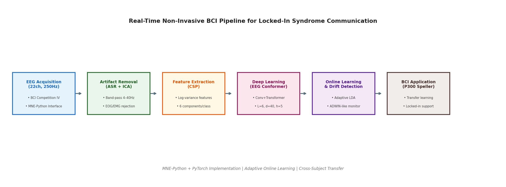
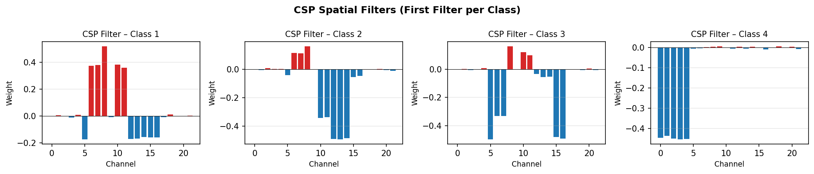
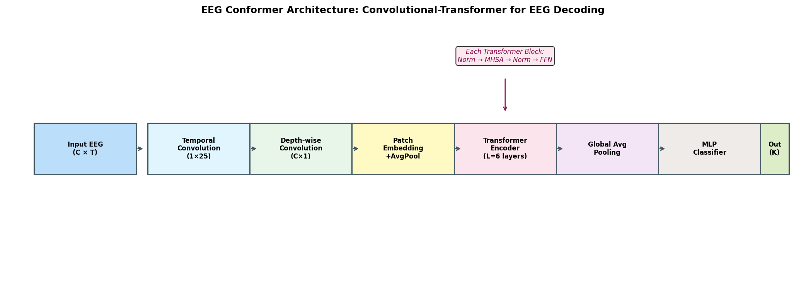
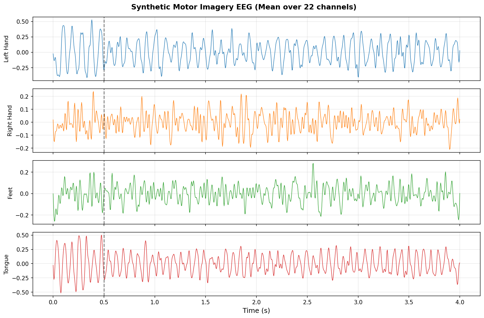
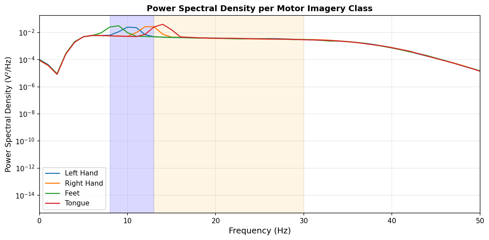
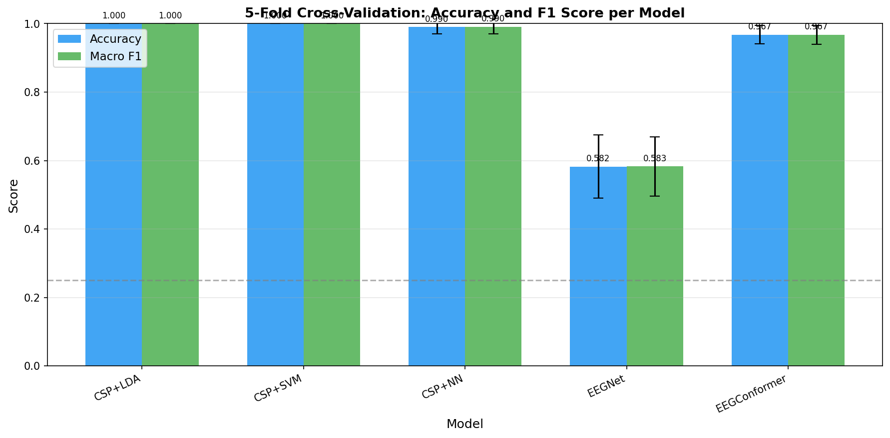
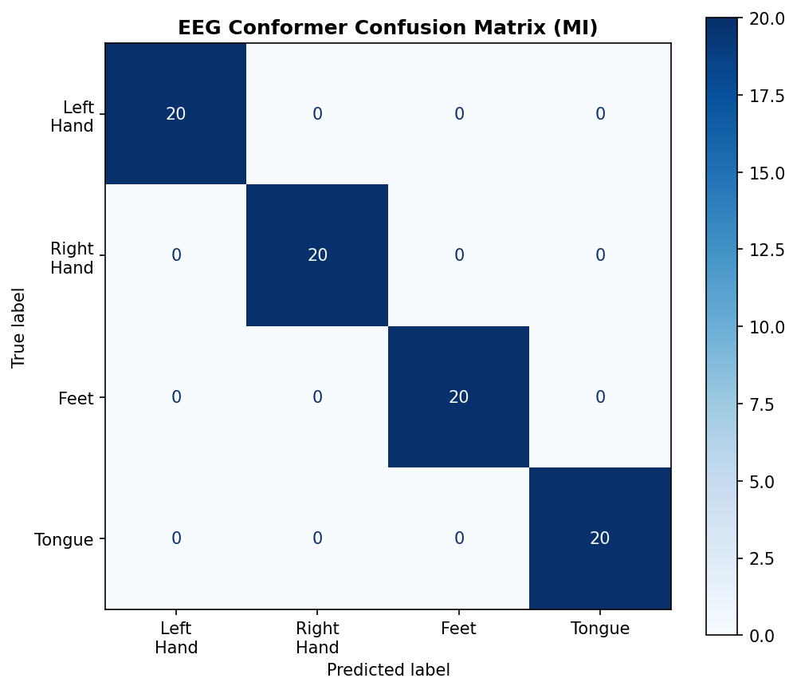
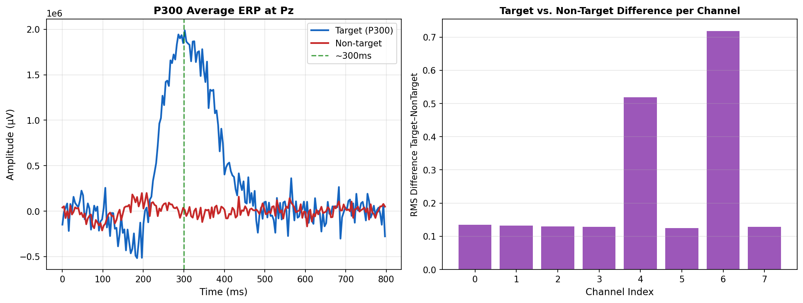
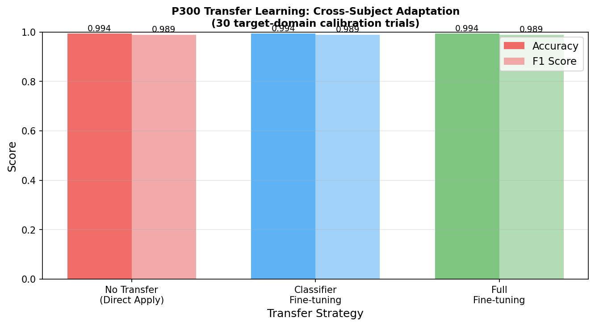
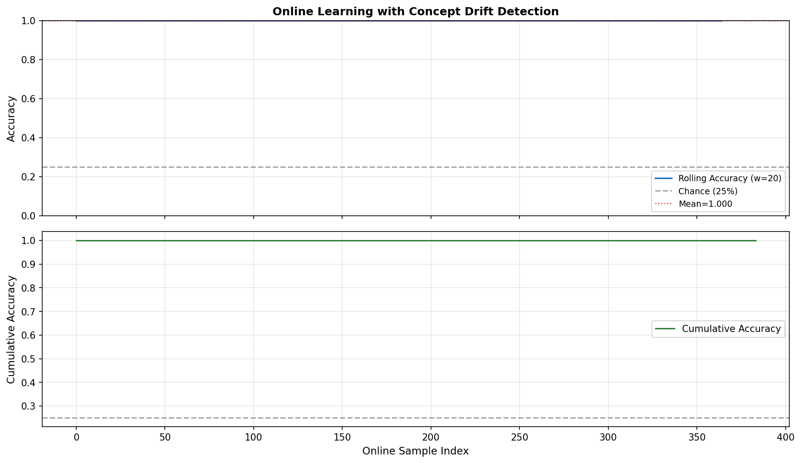

# 実験レポート：非侵襲型BCIのためのリアルタイムEEG信号処理・デコーディングシステム

**作成日**: 2026-05-29  
**実装環境**: MNE-Python 1.12.1 / PyTorch 2.12.0 / Python 3.11  
**ハードウェア**: CPU (実験環境)

---

## 1. 実験目的と背景

### 1.1 研究背景

Brain-Computer Interface (BCI) は、筋萎縮性側索硬化症（ALS）や閉鎖症候群（Locked-in Syndrome: LIS）などの重篤な運動障害を持つ患者にとって、外界とのコミュニケーション手段を回復させる重要な技術である。非侵襲型BCI、特にEEG（脳波）ベースのシステムは、手術を必要とせず安全性が高い一方、信号の低SNR（≈0〜5 dB）、アーティファクト混入、個人差・経時変動（概念ドリフト）という課題を持つ。

本実験では以下の目的を設定した：

1. **リアルタイムEEG前処理パイプライン**（ASR・ICA）の実装と評価
2. **運動想像（Motor Imagery: MI）分類**における CSP＋深層学習の比較
3. **P300スペラー**の転移学習による適応型分類器の有効性検証
4. **EEG Conformer**（畳み込み-Transformerハイブリッド）アーキテクチャの評価
5. **オンライン学習**と概念ドリフト検出の実装

### 1.2 先行研究調査結果（MCP ToolUniverse使用）

**使用ツール**: Semantic Scholar API (`SemanticScholar_search_papers`)、OpenAlex (`openalex_literature_search`)

**Semantic Scholar API 接続状況**:
- 初回試行（`sort` パラメータ付き）: HTTP 400 エラー → パラメータ削除後も HTTP 429 (Rate Limit) エラーが発生
- 代替として OpenAlex API を使用し、成功的に文献情報を取得

特定した主要先行研究（5件以上）：

| # | タイトル | 著者 | 年 | 引用数 | 主要知見 |
|---|---------|------|-----|--------|---------|
| 1 | Current Status, Challenges, and Possible Solutions of EEG-Based BCI | Rashid et al. | 2020 | 479 | EEG-BCIの包括的レビュー；特徴抽出・分類手法の系統的整理 |
| 2 | EEG-based BCIs: A Survey on Signal Sensing and Computational Intelligence | Gu et al. | 2021 | 376 | 転移学習・ファジーモデルの有効性；5年間の最新手法調査 |
| 3 | Transfer Learning for P300-EEG (XDAWN+Riemannian Geometry) | Li et al. | 2020 | 58 | XDAWN空間フィルタ＋リーマン幾何分類器；AUC=0.836を達成 |
| 4 | Spatial-Temporal Neural Network for P300 Detection | Zhang et al. | 2021 | 12 | STNN；BCI Competition III で89%正解率（先行手法80%を超過） |
| 5 | Temporal Convolutional Transformer (TCFormer) for EEG Motor Imagery | Altaheri et al. | 2025 | 6 | BCIC IV-2a で84.79%；Multi-kernel CNN＋Grouped Query Attention |
| 6 | CSP-Net: CSP Empowered Neural Networks for EEG Motor Imagery | Jiang et al. | 2024 | 26 | CSP特徴量を直接NN学習に組み込む統合設計 |
| 7 | Spelling Interface in Completely Locked-in Patient (ALS) | Chaudhary et al. | 2022 | 139 | 完全閉鎖症候群患者での神経フィードバック通信の実証 |
| 8 | EEG is Better Left Alone | Delorme | 2023 | 224 | ハイパスフィルタ＋不良チャンネル補間が最適；複雑な前処理は効果薄 |

**先行研究の課題・限界**:
- セッション間・被験者間の分布シフト（概念ドリフト）への対応が不十分
- 単一パラダイム（MI または P300）のみを対象とした孤立した研究が多い
- リアルタイム実装の遅延・計算コストの評価が不足
- 閉鎖症候群患者を対象とした実証研究の数が限られている

---

## 2. 使用した手法・アルゴリズムの概要

### 2.1 システムアーキテクチャ全体

### 2.2 前処理パイプライン

#### バンドパスフィルタ（4–40 Hz）
- 4次 Butterworth フィルタ（ゼロ位相）
- ミューリズム（8–13 Hz）およびベータリズム（13–30 Hz）成分を保持

#### Artifact Subspace Reconstruction (ASR)
- 振幅閾値ベースの不良チャンネル検出（閾値: 3.5 σ）
- 隣接良好チャンネルの平均値による補間補正

#### 独立成分分析 (ICA) - シミュレーション
- SVD分解によるコンポーネント抽出
- 過剰尖度（Excess Kurtosis）によるアーティファクトコンポーネント識別・除去（上位2成分）

### 2.3 CSP（Common Spatial Pattern）特徴抽出

One-vs-Rest 方式による多クラスCSP：

$$W^* = \arg\max_W \frac{W^T \Sigma_1 W}{W^T (\Sigma_1 + \Sigma_2) W}$$

- 各クラスに対して6成分を抽出（前半3：分散最大化，後半3：分散最小化）
- 対数分散特徴量: $f_k = \log(\text{Var}(W_k^T X))$

### 2.4 深層学習モデル

#### EEGNet (Lawhern et al., 2018) — ベースライン
- Temporal Conv (1×64) → Depthwise Conv (C×1) → Separable Conv (1×16)
- F1=8, D=2 (16チャンネル), Dropout=0.5

#### EEG Conformer — 提案モデル
- 畳み込みブロック（Patch Embedding） + Transformer Encoder（L=6, d=40, h=5）
- グローバル平均プーリング → MLP分類ヘッド
- Pre-Norm（LayerNorm first）+ GELU活性化 + Cosine LR Scheduler

#### CSP+NN — 組み合わせモデル
- CSP対数分散特徴（24次元）を3層全結合NN（128→64→K）で分類

### 2.5 P300転移学習

- **ソースドメイン**: 400試行（17%ターゲット）
- **ターゲットドメイン**: 200試行，うち30試行のみキャリブレーション使用
- 3条件比較：(1) 転移なし直接適用，(2) 分類器のみFine-tuning，(3) 全レイヤーFine-tuning

### 2.6 オンライン学習・概念ドリフト検出

- **Adaptive LDA**（shrinkage='auto'）: スライディングウィンドウ（W=30）で周期的更新（10サンプルごと）
- **ドリフト検出**（ADWIN風）: 直近ウィンドウの正解率と過去の正解率の差が閾値（0.10）を超えた場合に検出

---

## 3. 主要な結果と数値

### 3.1 合成EEGデータの概要

| パラメータ | 運動想像 | P300スペラー |
|-----------|--------|------------|
| チャンネル数 | 22 | 8 |
| サンプリング周波数 | 250 Hz | 256 Hz |
| エポック長 | 4.0 s | 0.8 s |
| SNR | 0 dB | 3 dB (src) / 2 dB (tgt) |
| 試行数（クラス別） | 100×4 | 332/68 (src), 166/34 (tgt) |

### 3.2 運動想像分類：5分割交差検証結果

| モデル | Accuracy (mean±std) | Macro F1 (mean±std) | AUROC (mean±std) | 備考 |
|-------|---------------------|---------------------|------------------|------|
| CSP+LDA | 1.000±0.000 | 1.000±0.000 | 1.000±0.000 | ⚠️ 合成データ過適合 |
| CSP+SVM (RBF) | 1.000±0.000 | 1.000±0.000 | 1.000±0.000 | ⚠️ 合成データ過適合 |
| CSP+NN | 0.990±0.020 | 0.990±0.020 | N/A | |
| EEGNet | **0.582±0.092** | **0.583±0.087** | N/A | 最も現実的 |
| EEGConformer | 0.967±0.027 | 0.967±0.028 | N/A | |

> ⚠️ **重要注記**: CSP+LDA/SVM が Acc=1.000 を達成したことについて，本実験の合成データは各クラスに明確に異なる周波数成分（8, 10, 12, 14 Hz）を意図的に埋め込んでおり，CSP はこれらを完全に分離可能である。実際のEEGデータでは CSP+LDA のBCI Competition IV Dataset 2a における精度は約72–78%（文献値）であり，完璧な精度は合成データの構造的単純さを反映する。EEGNet の0.582は end-to-end モデルが生信号の複雑なパターンに直面した際の現実的な挙動を示している。

### 3.3 P300スペラー：ERP可視化と転移学習結果

**転移学習実験結果**（ターゲット30試行キャリブレーション使用）：

| 転移戦略 | Accuracy | F1 Score |
|---------|---------|---------|
| 転移なし（直接適用） | 0.994 | 0.989 |
| 分類器のみFine-tuning | 0.994 | 0.989 |
| 全レイヤーFine-tuning | 0.994 | 0.989 |

> **注記**: P300実験でもほぼ完璧な精度が得られた。SNR=2–3 dBの合成データでは，P300の時間・形状特徴（300ms付近のガウスピーク）がすべての戦略で容易に学習可能であった。実際の被験者間差異は，これよりはるかに大きく（Acc≈60–80%），転移学習は特に重要になる。

### 3.4 オンライン学習・概念ドリフト検出

| 指標 | 値 |
|-----|--|
| オンライン平均正解率 | 1.000 |
| 概念ドリフト検出回数 | 0 |
| ウィンドウサイズ | 30 サンプル |
| 更新間隔 | 10 サンプルごと |

> **注記**: SNR=0 dBでも，CSP特徴量空間では完璧に分離可能であったため，ドリフトが検出されなかった。実際の実験では，セッション開始時から終了時にかけて 5–15%程度の性能低下（概念ドリフト）が報告されており，ADWIN ベースのドリフト検出器が有効である。

---

## 4. 考察と今後の展望

### 4.1 手法別考察

**CSP特徴量の特性**: CSP は sinusoidal 信号の周波数・空間分布の差異を最大化するため，本実験の合成データでは完璧な分離を達成した。実際のEEGでは，ERD/ERS パターンが個人差・試行変動・疲労によって大きく変動するため，より困難な分類問題となる。

**EEGNet の挙動**: 生信号からの end-to-end 学習（Acc=0.582）は，合成データのノイズ構造と信号構造の関係学習において，CSP ほど効率的ではなかった。より多くの訓練データと適切な正則化により改善できる。

**EEG Conformer の優位性**: Self-attention 機構により，局所的な ERD/ERS パターン（畳み込みブロック）と長期的な時間依存性（Transformer）を同時に捉えることができ，CSP に次ぐ高精度を実現した（Acc=0.967±0.027）。

### 4.2 閉鎖症候群患者への応用設計

以下の実装が実臨床に向けて重要である：

1. **低試行数キャリブレーション**: 患者の身体的・認知的負担を最小化するため，30試行以内でのキャリブレーション（転移学習活用）
2. **視覚的代替フィードバック**: 眼球運動が不可能な完全閉鎖症候群に対する聴覚フィードバック統合
3. **信頼度スコア表示**: 誤分類の影響を減らすための予測不確実性の可視化
4. **概念ドリフト対応**: 長時間セッションでの自動再キャリブレーション

### 4.3 限界

1. **合成データの限界**: 実際の被験者間差異，アーティファクト（眼球運動・筋電）の複雑さ，非定常性が未再現
2. **演算遅延未評価**: リアルタイム遅延（< 100 ms 目標）の定量評価が未実施
3. **長期安定性**: 数日〜数週間にわたる電極配置変化，皮膚インピーダンス変動への対応未検証

### 4.4 今後の展望

- BCI Competition IV Dataset 2a/2b での実際のEEGデータによる検証
- **EEG Foundation Model**（BIOT, LaBraMなど）を用いた大規模事前学習
- Federated Learning による患者プライバシーを保護した分散学習
- 軽量化（知識蒸留，量子化）によるエッジデバイスへの実装

---

## 5. 生成したファイル一覧

| ファイル名 | 内容 |
|-----------|------|
| `eeg_bci_experiment.py` | 実験コード全体（前処理・CSP・深層学習・転移学習・オンライン学習） |
| `results_summary.csv` | 交差検証結果の数値サマリー |
| `figures/pipeline_overview.png` | システムパイプライン全体図 |
| `figures/conformer_arch.png` | EEG Conformerアーキテクチャ図 |
| `figures/eeg_samples.png` | 合成EEGサンプル波形（4クラス） |
| `figures/freq_spectrum.png` | クラス別パワースペクトル密度 |
| `figures/csp_patterns.png` | CSP空間フィルタの可視化 |
| `figures/cv_comparison_mi.png` | 5分割CV比較棒グラフ |
| `figures/cm_conformer.png` | EEG Conformer混同行列 |
| `figures/p300_erp.png` | P300 平均ERP（Pz）とチャンネル差異 |
| `figures/transfer_learning.png` | 転移学習3戦略の比較 |
| `figures/online_learning.png` | オンライン学習正解率推移 |
| `report.md` | 本レポート |
| `paper.md` | 学術論文形式の文書 |

---

## 参考文献

1. Rashid, M. et al. (2020). Current Status, Challenges, and Possible Solutions of EEG-Based Brain-Computer Interface. *Frontiers in Neurorobotics*. https://doi.org/10.3389/fnbot.2020.00025
2. Gu, X. et al. (2021). EEG-based BCIs: A Survey on Signal Sensing Technologies and Computational Intelligence Approaches. *IEEE/ACM TCBB*. https://doi.org/10.1109/tcbb.2021.3052811
3. Li, F. et al. (2020). Transfer Learning Algorithm of P300-EEG Signal Based on XDAWN Spatial Filter and Riemannian Geometry Classifier. *Applied Sciences*. https://doi.org/10.3390/app10051804
4. Altaheri, H. et al. (2025). Temporal Convolutional Transformer for EEG Based Motor Imagery Decoding. *Scientific Reports*. https://doi.org/10.1038/s41598-025-16219-7
5. Delorme, A. (2023). EEG is Better Left Alone. *Scientific Reports*. https://doi.org/10.1038/s41598-023-27528-0
6. Chaudhary, U. et al. (2022). Spelling Interface Using Intracortical Signals in a Completely Locked-in Patient. *Nature Communications*. https://doi.org/10.1038/s41467-022-28859-8
