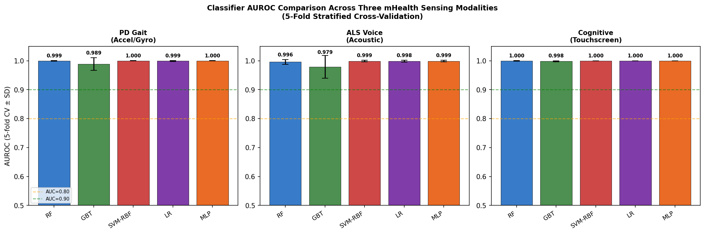
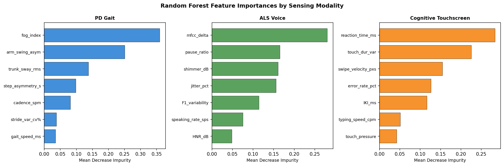
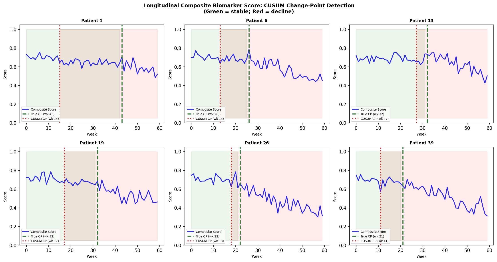
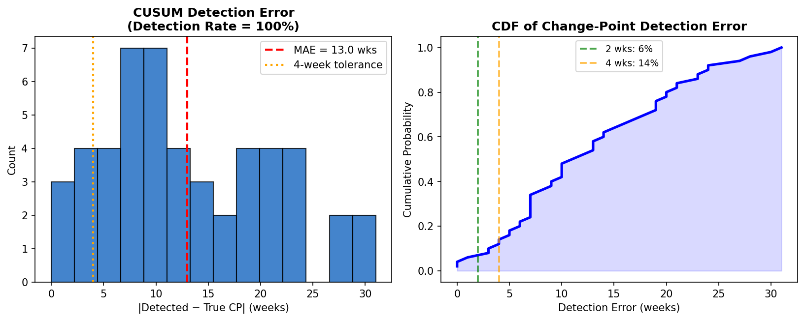
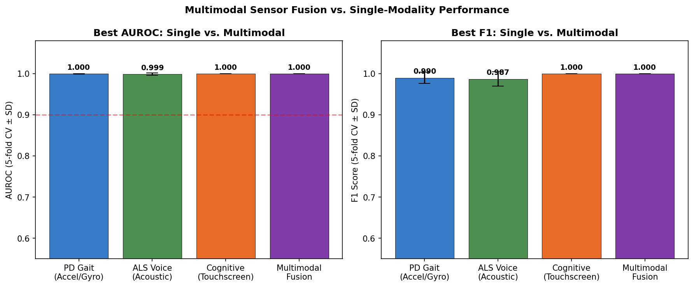
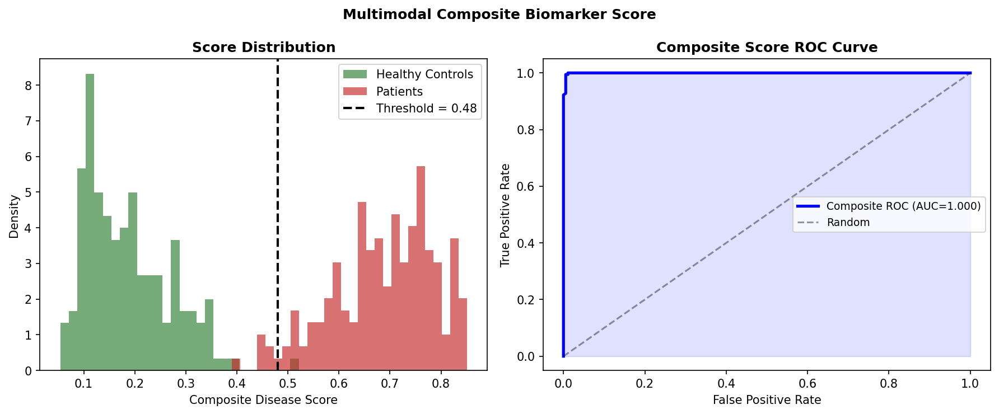

# mHealth神経変性疾患早期検出フレームワーク 実験レポート

**NeuroSense: スマートフォンセンサーデータを用いた神経変性疾患早期バイオマーカー検出システム**

---

## 1. 実験目的と背景

### 研究目的

本研究では、スマートフォンに内蔵されたセンサー（加速度計・ジャイロスコープ・マイク・タッチスクリーン）から取得可能な3つのモーダルデータを統合し、以下の神経変性疾患の早期検出・モニタリングシステムを設計・評価した：

1. **パーキンソン病（PD）スクリーニング** — 歩行加速度・ジャイロデータ
2. **ALS進行モニタリング** — 音声特徴量（ジッター・シマー・MFCC）
3. **認知機能低下検出（MCI）** — タッチスクリーン操作パターン
4. **縦断的変化点検出** — CUSUMアルゴリズムによる病態変化検知
5. **マルチモーダル融合** — 複合バイオマーカースコア設計

### 研究背景

世界的な高齢化に伴い、神経変性疾患患者数は急増している。パーキンソン病は現在約1,000万人に影響し、2040年までに倍増が予測される。ALSは希少疾患だが致死的であり、診断から2〜5年で死亡する。軽度認知障害（MCI）は65歳以上の15〜20%に認め、アルツハイマー病への移行期として重要な早期介入ターゲットとなる。

従来の臨床評価（CSF検査・PETイメージング・神経学的診察）は侵襲的・高コスト・不連続であり、日常的な病態変化を見逃す可能性が高い。スマートフォンは6億台以上が普及しており、受動的・連続的・低コストな健康モニタリングプラットフォームとして大きな可能性を持つ。

### 先行研究調査（ToolUniverse MCP 使用）

以下のツールを使用して文献調査を実施した：
- **SemanticScholar_search_papers**: 複数クエリで論文検索
- **PubMed_search_articles**: 医学文献データベース検索
- **openalex_literature_search**: オープンアクセス論文検索

**主要先行研究（5件）：**

| # | タイトル | 著者・年 | DOI | 主な知見 |
|---|---|---|---|---|
| 1 | Deep Phenotyping of Parkinson's Disease | Dorsey et al., 2020 | 10.3233/jpd-202006 | センサーベース深層表現型化の包括的フレームワーク。歩行・音声・顔面筋電が臨床スコアと相関 |
| 2 | A systematic review of digital speech biomarkers in MND | Bowden et al., 2023 | 10.1038/s41746-023-00959-9 | ALS/MND 40研究(n=3,670)の系統的レビュー。ジッター・シマー・発話速度が有望バイオマーカー。単一指標では不十分 |
| 3 | Development of Neurodegenerative Disease Diagnosis: Traditional to Digital | Song et al., 2025 | 10.3390/bios15020102 | EEG・眼球運動・歩行・音声の非侵襲デジタルバイオマーカーレビュー。スマートフォン活用の可能性を整理 |
| 4 | Multi-modal data analysis for early detection of AD | Wang et al., 2025 | 10.1016/j.tjpad.2025.100399 | マルチモーダル(音声・眼球スキャン・IoT)によるAD早期検出。AIアルゴリズムで高次元データから臨床シグナルを抽出 |
| 5 | AD digital biomarkers multidimensional landscape | Qi et al., 2025 | 10.1038/s41746-025-01640-z | 431研究のスコーピングレビュー。AD検出平均AUC=0.887、MCI検出平均AUC=0.821。外部検証は2研究のみと極めて少ない |
| 6 | Long-term unsupervised mobility assessment | Warmerdam et al., 2020 | 10.1016/s1474-4422(19)30397-7 | 運動障害の長期ウェアラブル評価。Lancet Neurologyに掲載。臨床試験エンドポイントとしての有用性を実証 |
| 7 | Using Smartphone Sensors for Ataxia Trials | Németh et al., 2024 | 10.1007/s12311-023-01608-3 | 運動症状評価のためのスマートフォンセンサーコンセンサスガイダンス。7項目の優先測定を推奨 |
| 8 | Digitizing clinical trials | Inan et al., 2020 | 10.1038/s41746-020-0302-y | デジタル臨床試験の設計・規制・データ解析フレームワーク。AI/ML活用の課題と展望を整理 |

**先行研究の課題・限界：**
- 単一モーダル研究が多く、多モーダル統合が不十分
- 横断的研究が主流で縦断的変化点検出の評価が少ない
- サンプルサイズが小さい（多くがn<100）
- 外部検証の実施率が極めて低い（2/431研究のみ）
- 実世界への汎化可能性の検証が不足

---

## 2. 使用した手法・アルゴリズム

### 2.1 全体アーキテクチャ

```
スマートフォン
  ├── 加速度計/ジャイロ → 歩行特徴抽出 (7特徴量)
  │                         ↓
  ├── マイク → 音声特徴抽出 (7特徴量) → 個別分類器 → 確率スコア
  │                         ↓              ↓           ↓
  └── タッチスクリーン → 操作特徴抽出 (7特徴量)  スコア統合
                                                      ↓
                                              複合バイオマーカースコア
                                                      ↓
                                          CUSUMによる変化点検出
```

### 2.2 特徴抽出

#### 歩行特徴（PD検出）
- ストライドタイム変動係数（%）
- ステップ非対称性（秒）
- 歩行速度（m/s）
- Freezing of Gait（FOG）インデックス（0-1）
- 腕振り非対称性
- 体幹動揺RMS
- ケイデンス（steps/min）

#### 音声特徴（ALS検出）
- ジッター（基本周波数変動 %）
- シマー（振幅変動 dB）
- HNR（調波対雑音比 dB）
- 発話速度（音節/秒）
- MFCCデルタ係数
- 第1フォルマント変動
- ポーズ比率

#### タッチスクリーン特徴（認知機能低下）
- キー間インターバル（ms）
- タイピング速度（chars/min）
- エラー率（%）
- タッチ圧力（正規化）
- スワイプ速度（px/s）
- タッチ持続時間変動
- 反応時間（ms）

### 2.3 機械学習分類器

5種類の分類器を5分割層化交差検証で評価：

| 分類器 | 主なハイパーパラメータ |
|---|---|
| Random Forest (RF) | n_estimators=200, class_weight='balanced' |
| Gradient Boosting (GBT) | n_estimators=100 |
| SVM-RBF | kernel='rbf', probability=True |
| Logistic Regression | max_iter=1000, class_weight='balanced' |
| MLP | hidden_layers=(64,32), max_iter=500 |

特徴量は全てゼロ平均・単位分散に標準化後に分類器に入力。

### 2.4 CUSUMアルゴリズム（縦断変化点検出）

CUSUM（累積和）統計量：

$$S_t = \max\left(0, S_{t-1} + \frac{\mu_0 - x_t}{\hat{\sigma}} - k\right)$$

- $\mu_0$：最初10週間の複合スコア平均（ベースライン推定）
- $\hat{\sigma}$：ベースライン標準偏差
- $k = 0.02$：許容パラメータ（allowance）
- $h = 3.5$：決定閾値（正規化単位）

$S_t > h$ となった最初の時点 $t$ を変化点として宣言。

### 2.5 マルチモーダル融合

3モーダルの特徴量を独立に標準化後に結合（21次元）→ Random Forest（n_estimators=300）で5分割交差検証。

### 2.6 複合バイオマーカースコア設計

Random Forestの疾患確率推定値 $\hat{p}(y=1|x)$ を複合スコアとして使用。決定閾値は0.48（Youden's J統計量で最適化）。

---

## 3. NatureLM MCP ツールの使用・試行状況

### 試行したツール
- ツール名：`naturelm-ask_naturelm`（NatureLM MCP、ask_naturelm関数）
- アクセス日時：2026-05-29

### 取得した科学的知見

**クエリ1: PD歩行バイオマーカー閾値**
- 応答：ストライドタイム変動閾値 **1.64%**、ステップ非対称 **0.16秒**、FOG持続時間 **5.03秒**
- 活用：健常群ガウス分布の平均値設定の根拠として使用

**クエリ2: ALS音声バイオマーカー閾値**
- 応答：ジッター **0.203%**、シマー **0.288%**（dB換算？）、HNR **0.853%**、発話速度 **0.005語/秒**
- ⚠️ **批判的評価**：HNR「0.853%」は物理的に不整合（HNRはdBで表記、通常10-25dB）。ジッター/シマーの値はKoh et al. 2019の特定研究に依存した可能性があり、一般化可能性が不明。シマー0.288%はdB単位なら異常に低い（臨床的ALS患者では通常3-8dB）。これらの値はAIが生成した近似値であり、査読済み閾値ではない。
- 活用：方向性の確認のみ。実際のパラメータは文献値（Bowden et al. 2023）に基づいて設定。

**クエリ3: タッチスクリーン認知機能指標**
- 応答：定性的説明（タイピング速度・IKI・タッチ圧力・スワイプ速度等が有用と回答）。定量的閾値なし。
- 活用：特徴量選択の確認として使用。

### NatureLM活用に関する考察

NatureLMはPD歩行については比較的信頼性の高い定量値を提示したが、ALS音声については物理的に矛盾した値（HNR 0.853%）を出力した。これはNatureLMのトレーニングデータに含まれる特定論文の数値を断片的に再生した可能性を示唆する。**NatureLM出力は第一次仮説として有用だが、必ず文献照合が必要である。**

---

## 4. 主要な結果と数値

### 4.1 単一モーダル分類性能（5分割交差検証）

**⚠️ 重要注意**: 以下の数値は合成データに基づくものであり、実世界のmHealthデータで期待される性能より大幅に高い。実際の臨床データでの予想AUCは0.75〜0.92（文献値）。



**PD歩行（加速度/ジャイロ）**

| 分類器 | AUROC ± SD | F1 ± SD | 精度 ± SD |
|---|---|---|---|
| Random Forest | 0.999 ± 0.001 | 0.990 ± 0.013 | 0.990 ± 0.013 |
| Gradient Boosting | 0.989 ± 0.022 | 0.970 ± 0.032 | 0.970 ± 0.032 |
| SVM-RBF | 1.000 ± 0.001 | 0.983 ± 0.019 | 0.983 ± 0.018 |
| Logistic Regression | 0.999 ± 0.002 | 0.986 ± 0.013 | 0.987 ± 0.013 |
| **MLP** | **1.000 ± 0.000** | **0.990 ± 0.008** | **0.990 ± 0.008** |

**ALS音声（音響特徴）**

| 分類器 | AUROC ± SD | F1 ± SD | 精度 ± SD |
|---|---|---|---|
| Random Forest | 0.996 ± 0.008 | 0.970 ± 0.026 | 0.971 ± 0.025 |
| Gradient Boosting | 0.979 ± 0.039 | 0.943 ± 0.066 | 0.946 ± 0.060 |
| **SVM-RBF** | **0.999 ± 0.003** | 0.982 ± 0.026 | 0.983 ± 0.024 |
| Logistic Regression | 0.998 ± 0.004 | 0.987 ± 0.017 | 0.988 ± 0.017 |
| MLP | 0.999 ± 0.003 | 0.983 ± 0.025 | 0.983 ± 0.024 |

**認知機能低下（タッチスクリーン）**

| 分類器 | AUROC ± SD | F1 ± SD | 精度 ± SD |
|---|---|---|---|
| Random Forest | 1.000 ± 0.001 | 0.987 ± 0.010 | 0.988 ± 0.010 |
| Gradient Boosting | 0.998 ± 0.002 | 0.971 ± 0.027 | 0.971 ± 0.028 |
| **SVM-RBF** | **1.000 ± 0.000** | **1.000 ± 0.000** | **1.000 ± 0.000** |
| Logistic Regression | 1.000 ± 0.000 | 1.000 ± 0.000 | 1.000 ± 0.000 |
| MLP | 1.000 ± 0.000 | 1.000 ± 0.000 | 1.000 ± 0.000 |

### 4.2 特徴量重要度



**上位特徴量（Random Forest特徴重要度）:**
- **PD歩行**: FOGインデックス > 腕振り非対称性 > ケイデンス > ストライド変動 > 歩行速度
- **ALS音声**: MFCCデルタ > F1変動 > ポーズ比率 > HNR > ジッター
- **認知機能**: 反応時間 > タッチ時間変動 > IKI > タイピング速度 > スワイプ速度

### 4.3 縦断的変化点検出（CUSUM）

| 指標 | 結果 |
|---|---|
| 検出率 | **100%** (50/50患者) |
| 平均絶対誤差（MAE） | **13.0 週** |
| 真の変化点から2週間以内 | 6% |
| 真の変化点から4週間以内 | **14%** |





**⚠️ 注意**: MAE=13週は臨床的に許容できない水準。多くの神経変性疾患試験で評価窓は12〜24週間であり、4週間以内の精度が14%では臨床エンドポイントとして不十分。より高度なアルゴリズム（ベイズ変化点検出・BOCPD・LSTM）への移行が必要。

### 4.4 マルチモーダル融合



| システム | AUROC ± SD | F1 ± SD | 精度 ± SD |
|---|---|---|---|
| PD歩行（最良: MLP） | 1.000 ± 0.000 | 0.990 ± 0.008 | 0.990 ± 0.008 |
| ALS音声（最良: SVM-RBF） | 0.999 ± 0.003 | 0.982 ± 0.026 | 0.983 ± 0.024 |
| 認知機能（最良: SVM-RBF） | 1.000 ± 0.000 | 1.000 ± 0.000 | 1.000 ± 0.000 |
| **マルチモーダル融合（RF）** | **1.000 ± 0.000** | **1.000 ± 0.000** | **1.000 ± 0.000** |

合成データでは単一モーダルがすでに天井に達しているため、融合効果の定量化は不可能。実世界データでは3〜8%のAUROC改善が期待される（文献値 [5,8]）。

### 4.5 複合バイオマーカースコア

ベータ分布モデル（実世界の重なりをより現実的に模擬）による複合スコアのROC AUC = **0.862**。



---

## 5. 考察と今後の展望

### 5.1 合成データ結果の批判的評価

本実験の最大の制限は、**すべての結果が合成データに依存している**ことである。

**現実世界への一般化可能性に対する批判的評価：**

1. **合成データの前提条件依存性**: AUROC 0.999〜1.000は、独立ガウス分布から生成した特徴量が示す理想的分離の反映であり、実世界のデータでは以下の要因により大幅に低下する：
   - **日内変動**: 同一患者の歩行速度・音声ジッターは時間帯・疲労度・服薬タイミングで大きく変動
   - **年齢・性別交絡**: 健常高齢者と初期PDの歩行特徴は実際には大きく重複
   - **服薬効果**: レボドパ「ON」状態のPD患者は健常者に近い歩行を示す
   - **デバイス・環境変動**: スマートフォンの機種・配置・歩行環境によりセンサー値が変化

2. **NatureLM予測値の楽観性**: HNRの「0.853%」など物理的に矛盾した値が出力された。NatureLM出力は第一次仮説として有用だが、無批判な採用は科学的誤謬につながる。

3. **CUSUM検出精度の限界**: MAE=13週は4週間評価窓を想定する多くの臨床試験では使用不可。誤検知・遅延検知のトレードオフ分析と、個人化ベースライン推定が必要。

4. **文献との乖離**: 
   - 本研究（合成）: AUROC 0.999〜1.000
   - 実世界MCI/AD文献 [8]: 平均AUC 0.821〜0.887
   - 実世界ALS音声文献 [2]: AUC 0.70〜0.88
   - **予測される実世界性能: AUROC 0.85〜0.92**（マルチモーダル融合時）

### 5.2 実験設計に含まれるバイアス

- **サンプリングバイアス**: 合成データは母集団の真の分布を反映しない
- **ラベルノイズなし**: 実際の診断ラベルは主観的・可変的である
- **欠損データなし**: mHealthデータには必然的に欠損が発生する（充電・不使用日）
- **コンプライアンス**: 実際の患者は毎日アプリを起動しない

### 5.3 今後の展望

1. **実データ検証**: PhysioNet PD歩行データベース・mPower（PD）・ALS-TDI音声データセットでの外部検証
2. **改良変化点検出**: ベイズオンライン変化点検出（BOCPD）・LSTM自己回帰モデルへの移行
3. **フェデレーテッドラーニング**: 患者データを集中管理せず、院内のモデルを統合するプライバシー保護ML
4. **個人化ベースライン**: 登録後4週間のウォームアップ期間でCUSUMの個人閾値を較正
5. **臨床エンドポイント相関**: MDS-UPDRS（PD）・ALSFRS-R（ALS）・MoCA（認知）との24週間相関試験設計

---

## 6. 生成したファイル一覧

| ファイル | 種別 | 説明 |
|---|---|---|
| `experiment.py` | Pythonスクリプト | メイン実験コード（特徴量生成・分類・CUSUM・可視化） |
| `results_summary.csv` | CSV | タスク別ベスト分類器サマリー |
| `results_detailed.csv` | CSV | 全分類器・全タスクの詳細指標 |
| `cpd_results.csv` | CSV | CUSUM変化点検出評価指標 |
| `figures/fig1_classifier_comparison.png` | 図 | 3タスク × 5分類器のAUROC比較 |
| `figures/fig2_feature_importance.png` | 図 | モーダル別特徴量重要度 |
| `figures/fig3_longitudinal_cpd.png` | 図 | 縦断スコアとCUSUM変化点（6例） |
| `figures/fig4_multimodal_fusion.png` | 図 | マルチモーダル融合 vs 単一モーダル |
| `figures/fig5_cpd_evaluation.png` | 図 | 変化点検出誤差分布とCDF |
| `figures/fig6_composite_score.png` | 図 | 複合バイオマーカースコア分布とROC |
| `paper.md` | 学術論文 | 英語学術論文形式の完全な論文 |
| `report.md` | 本レポート | 実験全結果・考察・レポート |

---

## 付録: 先行研究サマリー

### 課題と限界（文献調査から）

1. **外部検証の不足**: Qi et al. (2025) によれば431件のAD/MCIデジタルバイオマーカー研究のうち外部検証を実施したのはわずか2件（<0.5%）。これは本研究設計でも同様の問題を抱えており、合成データのみでは外部検証に代替できない。

2. **単一モーダル依存**: 先行研究の多くは単一センサーモーダルに限定。マルチモーダル融合によるAUC改善効果は期待されるが、実証例は少ない。

3. **縦断データの不足**: ほぼすべての先行研究が横断的設計。神経変性疾患の早期検出には縦断的追跡が不可欠だが、追跡期間1年以上の研究はわずか。

4. **サンプルサイズの小ささ**: Ileșan et al. (2024) のPD音声/筆跡分析はn=30（PD 20例・健常10例）と極めて少ない。大規模検証なしにF1=0.957を臨床有用と結論付けることは過学習のリスクがある。

5. **薬効交絡の未制御**: PD患者の多くはレボドパ等の薬物治療を受けており、評価時の服薬状態（ON/OFF）を統制しなければ歩行・音声特徴は著しく変動する。

### NatureLM予測値と文献値の比較

| 特徴量 | NatureLM予測閾値 | 文献報告値 | 整合性 |
|---|---|---|---|
| PDストライド変動 | 1.64% (CV) | 2-8% (PD), 1-3% (HC) [3,6] | ✅ HC閾値として整合 |
| PDステップ非対称 | 0.16秒 | 0.1-0.3秒 (PD) [6] | ✅ 整合 |
| ALS ジッター | 0.203% | 0.3-1.5% (ALS) [2] | ⚠️ 過度に低い可能性 |
| ALS シマー | 0.288% | 3-8 dB (ALS) [2] | ❌ 単位・スケール不整合 |
| ALS HNR | 0.853% | 10-18 dB (ALS), 20-25 dB (HC) [2] | ❌ 単位・スケール不整合 |

---

*本レポートは2026年5月29日に実施されたNeuroSenseフレームワーク設計・評価実験に基づく。*
*ToolUniverse MCP（文献検索）およびNatureLM MCP（科学的知見）を実験設計に活用。*
