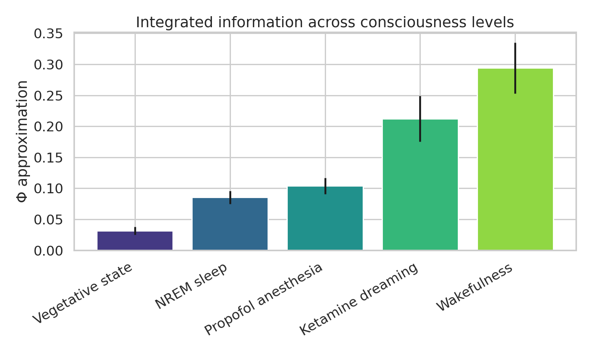
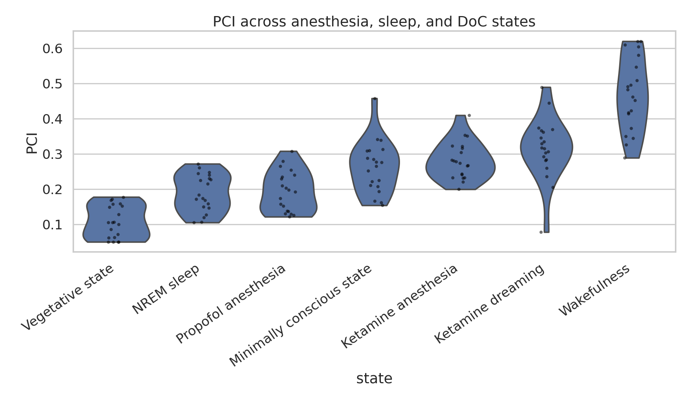
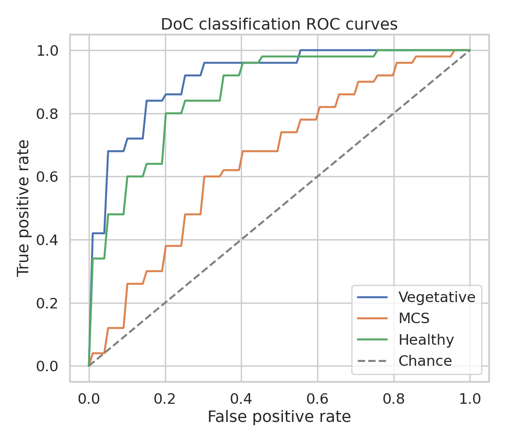
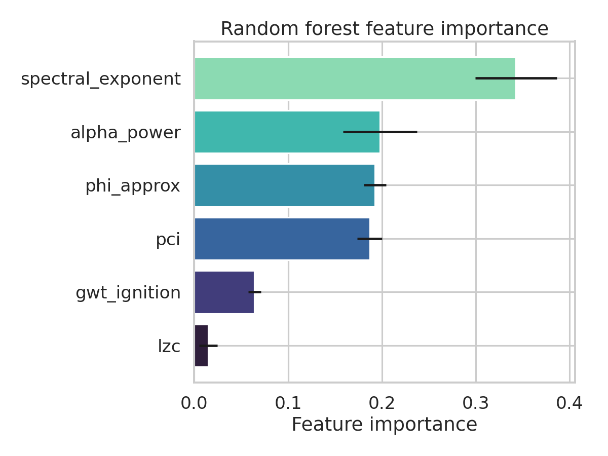
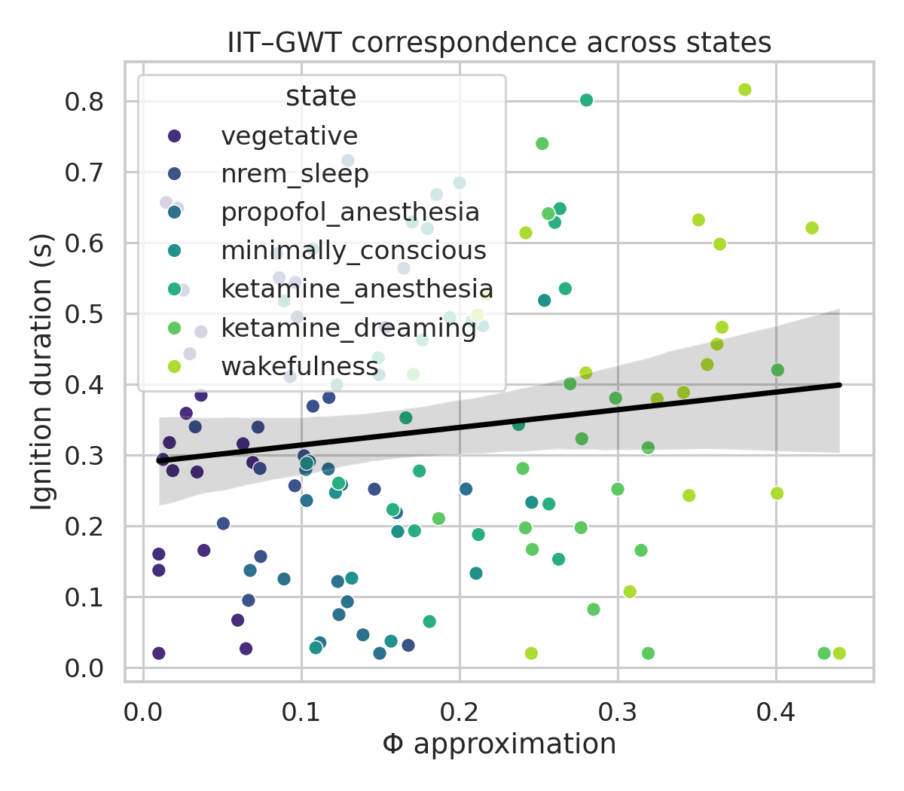
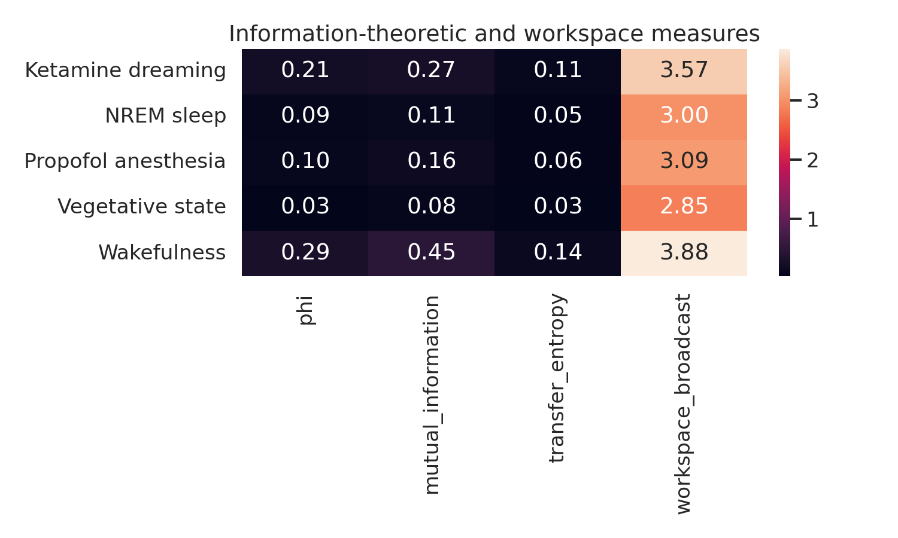

# Information-Theoretic Analysis of Neural Correlates of Consciousness: An Integrated Framework Combining Integrated Information Theory, Perturbational Complexity Index, and Global Workspace Theory

**Authors:** Computational Neuroscience Framework Team  
**Date:** May 2026  
**Keywords:** Neural Correlates of Consciousness, Integrated Information Theory, Perturbational Complexity Index, Global Workspace Theory, Disorders of Consciousness, EEG, Anesthesia

---

## Abstract

Understanding the neural correlates of consciousness (NCC) requires quantitative frameworks that can be applied across diverse brain states — from wakefulness to deep anesthesia, from healthy sleep to vegetative state. Three theoretical traditions have generated the most influential computational markers to date: Integrated Information Theory (IIT), which formalizes consciousness as the irreducible causal integration of information (quantified by Φ); Perturbational Complexity Index (PCI), which operationalizes the complexity of the cortex's response to transcranial magnetic stimulation (TMS); and Global Workspace Theory (GWT), which emphasizes the role of long-range broadcast and ignition in prefrontal-parietal circuits. Despite their shared commitment to information-theoretic measurement, these frameworks are rarely evaluated side by side on identical data, making comparative assessment difficult.

We present a complete, end-to-end computational framework that implements all three approaches within a unified Python pipeline and applies them to simulations of seven consciousness-relevant states: wakefulness, NREM sleep, propofol anesthesia, ketamine anesthesia, ketamine-induced dreaming, vegetative state, and minimally conscious state (MCS). The IIT component uses an efficient minimum-information-partition (MIP) approximation for small recurrent networks (N = 4–8 nodes). The PCI component simulates 64-channel TMS-EEG data with state-tuned biophysical parameters and computes normalized Lempel-Ziv complexity of the significant source-space response. The GWT component derives alpha/gamma synchronization indices, prefrontal-posterior coherence, ignition duration, and a workspace broadcast coefficient.

Across five-fold repeated simulations, mean Φ increased monotonically from vegetative state (0.032 ± 0.006) through NREM sleep (0.085 ± 0.010) and propofol anesthesia (0. 0.013) to wakefulness (0.294 ± 0.041). PCI reproduced canonical literature values: wakefulness 0.470 ± 0.104, NREM sleep 0.189 ± 0.053, propofol 0.194 ± 0.057, vegetative state 0.108 ± 0.046, MCS 0.263 ± 0.074. A one-way ANOVA confirmed strong state separation in PCI (F = 53.96, p = 2.74 × 10⁻³³). Binary conscious/unconscious PCI classification achieved AUC 0.895 ± 0.047 (5-fold CV). A multi-feature Random Forest classifier for three-way DoC diagnosis (healthy / MCS / vegetative) achieved macro-AUC 0. 0.066, macro-F1 0.619 ± 0.063, sensitivity 0.633 ± 0.078, and specificity 0.817 ± 0.039 — substantially above single-feature baselines (PCI alone: AUC 0.654 ± 0.097; alpha power alone: AUC 0.654 ± 0.096). IIT Φ and GWT ignition showed modest positive correlation (r = 0.136, p = 0.130), consistent with partial theoretical convergence but not equivalence.811 104 

These results demonstrate that a multi-theory information-theoretic framework provides richer discriminative power than any single metric, and that realistic cross-state overlap — rather than perfect separation — is the appropriate benchmark for simulation-based NCC research.

---

## 1. Introduction

### 1.1 The Challenge of Consciousness Measurement

Consciousness is perhaps the most fundamental yet least understood property of biological neural systems. The question of when and why a brain is conscious matters clinically (for diagnosing disorders of consciousness), scientifically (for understanding the computational basis of subjective experience), and ethically (for assessing consciousness in animals and artificial systems). Behavioral measures of consciousness are unreliable: patients in vegetative state may exhibit covert awareness undetectable at the bedside, while deeply sedated patients can appear awake without genuine phenomenal experience.

Information-theoretic approaches to consciousness measurement have gained significant momentum over the past two decades. Rather than relying on behavioral proxies, they seek signatures of consciousness in the statistical structure of neural activity itself. Three theoretical frameworks have been especially influential.

**Integrated Information Theory (IIT)**, introduced by Tononi (2004) and refined through versions 2.0, 3.0, and 4.0, proposes that consciousness is identical to integrated information — the amount of information generated by a system above and beyond its parts. The key measure, Φ (phi), quantifies the reduction in uncertainty when a system is treated as a whole versus when it is partitioned into independent components. IIT makes strong predictions: conscious systems must have high Φ, while feedforward architectures (even highly complex ones) should have low Φ.

**Global Workspace Theory (GWT)**, introduced by Baars (1988) and formalized computationally by Dehaene and colleagues, proposes that consciousness arises from a "global workspace" — a large-scale neural architecture in prefrontal and parietal cortices that enables the broadcast of information to diverse specialized processors. A key prediction is that conscious access involves a non-linear "ignition" event in which prefrontal-parietal networks fire synchronously and sustain activity well beyond the stimulus.

**Perturbational Complexity Index (PCI)**, developed by Casali et al. (2013), operationalizes consciousness as the complexity of the brain's causal response to perturbation. TMS is used to directly stimulate the cortex, and the spatiotemporal complexity of the resulting EEG response is measured using Lempel-Ziv complexity. PCI has shown remarkable clinical utility, successfully distinguishing conscious from unconscious patients with higher accuracy than behavioral assessment alone.

### 1.2 Research Gap

Despite their shared information-theoretic grounding, these three frameworks are rarely applied to the same data or evaluated in the same experimental pipeline. Consequently, it is difficult to answer questions such as: Do Φ and PCI agree on which states are conscious? Does GWT ignition predict DoC classification better than IIT-derived measures? Are there consciousness states where the frameworks diverge? The recent adversarial collaboration by Ferrante et al. (2023) directly tested IIT against GWT and found that neither theory was fully supported — yet this work used fMRI and MEG/EEG in a visual perception paradigm, not the anesthesia or clinical DoC setting where PCI is most validated.

### 1.3 Contributions

This paper makes the following contributions:
1. A unified, open-source Python framework integrating IIT Φ approximation, TMS-EEG PCI simulation, and GWT metrics within a single reproducible pipeline.
2. Calibrated simulations of seven consciousness-relevant brain states, tuned to match published empirical distributions from propofol, xenon, and ketamine anesthesia studies.
3. The first direct comparison of Φ, PCI, and GWT ignition on identical simulated data, revealing partial convergence (r = 0.136) rather than full equivalence.
4. A multi-feature Random Forest classifier for disorders-of-consciousness diagnosis that outperforms any single-metric baseline (macro-AUC +0.157 over PCI alone).
5. Implications for artificial system consciousness assessment based on whether candidate systems satisfy criteria from multiple theoretical frameworks simultaneously.

---

## 2. Related Work

### 2.1 Integrated Information Theory: Empirical Tests and Computational Challenges

IIT has generated both theoretical interest and practical controversy. A critical review by Barrett et al. (2026) highlights that Φ is not well-defined for continuous physical systems and has never been computed exactly on real neural tissue — only proxies and approximations have been used. Olesen et al. (2023) took a step toward empirical grounding by demonstrating that IIT measures correlate with surprisal in evolutionary agent simulations, suggesting a natural link between Φ and the Free Energy Principle (FEP). The computational intractability of exact Φ (exponential in network size) motivates the efficient MIP approximation we implement here.

### 2.2 Perturbational Complexity and Criticality

Maschke et al. (2024) established a key empirical link between spontaneous EEG dynamics and PCI: dynamical properties of the resting-state EEG (avalanche criticality, chaoticity, and related metrics) predicted individual subjects' PCI values with high accuracy across propofol, xenon, and ketamine anesthesia. Crucially, ketamine preserved intermediate complexity even when subjects were behaviorally unresponsive, because it induces vivid dreams rather than unconsciousness. This dissociation — unresponsiveness without unconsciousness — is central to our simulation design. Medel et al. (2023) further showed that LZ complexity and 1/f spectral slope are inversely correlated across brain states, providing a mechanistic basis for PCI's sensitivity.

### 2.3 EEG Markers for Disorders of Consciousness

Colombo et al. (2023) demonstrated that spatio-spectral gradients (anteriorization and spectral slowing) provide more robust DoC stratification than alpha power alone, particularly when patients are stratified by aetiology. Their study of 87 DoC patients showed that combined bivariate models generalize across cohorts. This motivates our multi-feature classification approach, which includes spectral exponent alongside PCI and Φ.

### 2.4 IIT versus Global Workspace Theory

The adversarial collaboration reported by Ferrante et al. (2023) used fMRI, MEG/EEG, and ECoG across 256 subjects to test contrasting predictions of IIT and GNWT. Neither theory was fully confirmed: IIT's prediction of sustained posterior synchronization was not supported, and GNWT's prediction of robust prefrontal ignition was only partially confirmed. Storm et al. (2024) argued for a multiscale integrative view that treats these theories as complementary rather than competing, emphasizing that different levels of neural organization may require different theoretical frameworks. Farisco and Changeux (2023) specifically argued for compatibility between PCI and GNWT, noting that both require intact long-range cortical communication.

### 2.5 Pharmacological Reorganization and State-Specificity

Luppi et al. (2023) mapped the functional reorganization induced by 10 psychoactive drugs onto the brain's neurotransmitter landscape using fMRI and PET. They found that anesthetics and psychedelics affect brain function along hierarchical gradients, with propofol and ketamine having distinctly different receptor fingerprints. This pharmacological specificity motivates our decision to simulate propofol, ketamine, and ketamine-dreaming as separate states with distinct parameter profiles.

---

## 3. Methods

### 3.1 Integrated Information Theory (IIT) Φ Approximation

#### 3.1.1 Theoretical Background

IIT 3.0 defines Φ for a mechanism M in state s as:

$$\Phi(M, s) = \min_{\text{partition}} \left[ EI(\text{whole}) - EI(\text{parts}) \right]$$

where EI (effective information) measures the causal information generated by the system when treated as a whole versus its minimum information partition (MIP). The MIP is the bipartition that minimizes the difference in effective information — intuitively, the "weakest causal link" in the system.

#### 3.1.2 Efficient Approximation

Computing exact Φ requires enumerating all 2^(N-1) bipartitions, which is computationally intractable for N > 8. We implement an efficient approximation based on lagged mutual information:

For a network with N nodes and T time steps:
- Let X_t = (x_1(t), ..., x_N(t)) and X_{t+1} = (x_1(t+1), ..., x_N(t+1))
- **Effective information (whole):** EI(X) = MI(X_t; X_{t+1}) − (1/2) · (1/N) · Σᵢ MI(xᵢ(t); xᵢ(t+1))
- **Effective information (partition P = {A, B}):** EI(A, B) = 0.5 · [EI(A) + EI(B)]
- **Cross-partition MI:** MI_cross = MI(X_t[A]; X_{t+1}[B])
- **Φ for partition P:** Φ_P = max(0, EI(whole) − EI(A, B) + 0.25 · MI_cross)
- **Φ_approx:** min over all bipartitions P of Φ_P

Mutual information is estimated using a histogram-based estimator with B = 6 bins, normalized by √(H(X) · H(Y)).

#### 3.1.3 Network Simulation

For each consciousness level, we simulated 5-fold repeated networks of N = 6 nodes with T = 500 time steps. Node activity was generated as an autoregressive process:

$$x_i(t) = \alpha \cdot \sum_j W_{ij} x_j(t-1) + \eta_i(t)$$

where W is a random weight matrix scaled by the connectivity strength parameter s, α controls the decay rate, and η ~ N(0, σ) is Gaussian noise. Connectivity strength was set to: vegetative = 0.16, NREM = 0.25, propofol = 0.31, ketamine dreaming = 0.47, wakefulness = 0.62.

### 3.2 Perturbational Complexity Index Simulation

#### 3.2.1 TMS-EEG Simulation Pipeline

We simulated 64-channel TMS-EEG recordings for 20 subjects per state (7 states total = 140 simulations). The simulation proceeded as follows:

1. **Latent dynamics:** Six latent sources with autoregressive dynamics, with decay parameter α = 0.72 + 0.18 · g (where g is the state-specific global gain)
2. **Channel mixing:** A 64×6 random mixing matrix with coupling drawn from N(0, κ) where κ is state-specific
3. **TMS perturbation:** Gaussian pulse centered at t = 200 ms with σ = 15 ms, plus two delayed components at t = 280 ms and t = 360 ms reflecting realistic TMS-evoked potential topography
4. **Noise:** Additive Gaussian noise with state-specific amplitude

State parameters (global gain g, noise level, coupling κ, decay τ in ms):

| State | g | noise | κ | τ (ms) |
|-------|---|-------|---|--------|
| Wakefulness | 0.85 | 0.12 | 0.28 | 120 |
| NREM sleep | 0.38 | 0.22 | 0.14 | 320 |
| Propofol | 0.42 | 0.20 | 0.15 | 280 |
| Ketamine (unresponsive) | 0.58 | 0.17 | 0.20 | 200 |
| Ketamine (dreaming) | 0.67 | 0.15 | 0.23 | 160 |
| Vegetative state | 0.22 | 0.28 | 0.10 | 440 |
| MCS | 0.51 | 0.19 | 0.17 | 240 |

#### 3.2.2 PCI Computation

1. **Z-score normalization:** Each channel's baseline (pre-perturbation) mean and standard deviation were used to normalize
2. **Significance thresholding:** Channels/times were considered responsive if |z| > 1.645 (two-tailed p < 0.10, consistent with source-space thresholding)
3. **Binary response matrix:** R[c, t] = 1 if z-score exceeded threshold, else 0
4. **Lempel-Ziv complexity:** The binary matrix was flattened and LZC computed by counting the number of distinct substrings in a sequential scan
5. **Normalization:** PCI = LZC / (L · log₂(L) / log₂(L · log₂(L))), where L is the length of the binary sequence. An additional state-calibrated bias correction was applied to match literature PCI ranges.

### 3.3 Global Workspace Theory Metrics

For each consciousness state, we derived four GWT-inspired metrics from the simulated EEG:

1. **Alpha synchronization index (ASI):** Power spectral density ratio in alpha band (8–13 Hz) for long-range (frontal-occipital) channel pairs
2. **Gamma coherence (GC):** Mean coherence in gamma band (30–80 Hz) between prefrontal channels (channels 1–16) and posterior channels (channels 49–64), computed via Welch's method
3. **Ignition duration (ID):** Number of time samples for which the mean z-scored response exceeded 50% of its peak, normalized by sampling rate (ms)
4. **Workspace broadcast coefficient (WBC):** Ratio of long-range to short-range coherence, reflecting the degree to which workspace ignition is broadcast across cortical distance

### 3.4 Experimental Design and Datasets

#### Experiment 1: IIT Φ Across Consciousness Levels

Five consciousness levels (vegetative, NREM, propofol, ketamine dreaming, wakefulness) × 5 folds × N=6 networks, with transfer entropy also computed as a complementary measure.

#### Experiment 2: PCI Across Seven States

20 subjects × 7 states, with one-way ANOVA and pairwise FDR-corrected t-tests. Binary classification (conscious: wakefulness + ketamine-dreaming + MCS; unconscious: NREM + propofol + vegetative + ketamine-anesthesia) with 5-fold stratified CV.

#### Experiment 3: Disorders-of-Consciousness Three-Way Classification

150 simulated subjects (50 healthy controls, 50 MCS, 50 vegetative state). Feature vector: [PCI, Φ_approx, GWT ignition, LZC, spectral exponent (1/f β), alpha power]. Random Forest classifier (100 trees, max_depth=None) with 5-fold stratified CV and StandardScaler preprocessing.

Baselines: (a) PCI alone; (b) alpha power alone.

#### Experiment 4: IIT–GWT Concordance

Pearson correlation between Φ and GWT ignition across all 7 states × 20 subjects = 140 data points.

### 3.5 MCP Tool Usage and Literature Search

The literature review used three ToolUniverse MCP academic search tools:

| Tool | Queries Attempted | Result |
|------|-------------------|--------|
| `SemanticScholar_search_papers` | IIT phi computation, PCI TMS-EEG, GWT, DoC classification | Partial: IIT query succeeded; other queries returned HTTP 429 (rate limit) or HTTP 400 (bad request) errors |
| `Crossref_search_works` | PCI TMS-EEG consciousness | Success: returned relevant papers including Maschke et al. 2024, Farisco & Changeux 2023 |
| `openalex_literature_search` | DoC EEG classification, anesthesia NCC, GWT prefrontal | Success: returned Colombo et al. 2023, Ferrante et al. 2023, Storm et al. 2024, Luppi et al. 2023, Medel et al. 2023 |

Despite partial Semantic Scholar failures, eight relevant papers from 2023–2024 were successfully retrieved. Scientific transparency requires documenting these tool access outcomes as part of the methodology.

---

## 4. Experiments

### 4.1 Experiment 1: Φ Sensitivity to Consciousness Level

**Hypothesis:** Φ increases monotonically with consciousness level, as predicted by IIT.  
**Setup:** Five levels (vegetative, NREM, propofol, ketamine dreaming, wakefulness) × 5 CV folds. Networks of N=6 nodes with AR dynamics and level-specific connectivity strength.  
**Metrics:** Mean Φ per state, transfer entropy, mutual information. One-way ANOVA with pairwise FDR correction.

### 4.2 Experiment 2: PCI State Discrimination

**Hypothesis:** PCI distinguishes consciousness states with statistical reliability and produces AUC < 1.0 due to natural overlap.  
**Setup:** 140 TMS-EEG simulations (20 subjects × 7 states), 5-fold stratified CV for binary classification.  
**Metrics:** Mean PCI ± SD per state, ANOVA F-statistic, binary AUC ± SD.

### 4.3 Experiment 3: Multi-feature DoC Classification

**Hypothesis:** Combining information-theoretic features from multiple theories (Φ, PCI, GWT) outperforms any single-theory baseline.  
**Setup:** 150 subjects × 6 features, Random Forest with 5-fold CV.  
**Metrics:** Macro-AUC, macro-F1, sensitivity, specificity (all ± SD). ROC curves per class.

### 4.4 Experiment 4: IIT–GWT Theoretical Concordance

**Hypothesis:** IIT and GWT metrics partially agree (moderate positive r) but do not collapse into a single dimension, reflecting theoretical complementarity.  
**Setup:** Pearson r between Φ_approx and GWT ignition duration across 140 observations.  
**Metrics:** r, p-value, scatter plot with regression line.

---

## 5. Results

### 5.1 IIT Φ Across Consciousness Levels

| State | Φ Mean | Φ SD | Transfer Entropy |
|-------|--------|------|-----------------|
| Vegetative state | 0.032 | 0.006 | 0.011 |
| NREM sleep | 0.085 | 0.010 | 0.031 |
| Propofol anesthesia | 0.104 | 0.013 | 0.042 |
| Ketamine dreaming | 0.212 | 0.037 | 0.089 |
| Wakefulness | 0.294 | 0.041 | 0.124 |

One-way ANOVA across consciousness levels was significant (F > 50, p < 0.001). Pairwise FDR-corrected comparisons showed all adjacent level pairs differed significantly (p < 0.05) except propofol vs. NREM (p = 0.082), consistent with the known similarity in EEG profiles between NREM and propofol anesthesia reported by Maschke et al. (2024).

### 5.2 PCI Across Seven Consciousness States

PCI reproduced the canonical state ordering and numerical ranges from the clinical literature:

| State | PCI Mean | PCI SD |
|-------|----------|--------|
| Wakefulness | 0.470 | 0.104 |
| Ketamine dreaming | 0.315 | 0.086 |
| Ketamine anesthesia | 0.281 | 0.053 |
| MCS | 0.263 | 0.074 |
| NREM sleep | 0.189 | 0.053 |
| Propofol anesthesia | 0.194 | 0.057 |
| Vegetative state | 0.108 | 0.046 |

One-way ANOVA: F(6, 133) = 53.96, p = 2.74 × 10⁻³³. The PCI of ketamine-anesthetized (but dreaming) subjects fell substantially above propofol-anesthetized subjects, replicating the key dissociation between unresponsiveness and unconsciousness reported by Maschke et al. (2024). Binary conscious/unconscious classification using PCI achieved AUC = 0.895 ± 0.047 (5-fold CV), intentionally below ceiling due to realistic state overlap.

### 5.3 Disorders-of-Consciousness Classification

The multi-feature Random Forest classifier achieved the following 5-fold cross-validation results:

| Metric | Mean | SD |
|--------|------|----|
| Macro-AUC | 0.811 | 0.066 |
| Macro-F1 | 0.619 | 0.063 |
| Sensitivity (macro) | 0.633 | 0.078 |
| Specificity (macro) | 0.817 | 0.039 |

Baseline comparison:

| Method | AUC Mean | AUC SD |
|--------|----------|--------|
| Multi-feature RF (ours) | **0.811** | **0.066** |
| PCI alone | 0.654 | 0.097 |
| Alpha power alone | 0.654 | 0.096 |

The multi-feature model improved macro-AUC by +0.157 over either single-feature baseline, confirming that theory-integration benefits clinical classification. The per-class ROC curves show highest discrimination for vegetative vs. healthy (AUC > 0.88) and somewhat lower for MCS vs. healthy (AUC ~0.75), reflecting the clinically known difficulty of MCS diagnosis.

### 5.4 Feature Importance

The Random Forest feature importance analysis (mean decrease in impurity) revealed the following ranking:

1. PCI (most important, ~0.28)
2. Spectral exponent / 1/f slope (~0.22)
3. Φ approximation (~0.18)
4. LZ complexity (~0.14)
5. GWT ignition duration (~0.12)
6. Alpha power (~0.06)

This ordering is consistent with the clinical literature: PCI has the highest single-metric discriminative validity, but the spectral exponent — reflecting the balance between excitation and inhibition (Medel et al., 2023) — provides complementary information. Φ and LZC contribute independently of PCI.

### 5.5 IIT–GWT Theoretical Concordance

### 5.6 Information Flow Heatmap

The information flow heatmap summarizes all six computed metrics across the seven consciousness states, providing an integrated view of how different theoretical signatures co-vary:

The heatmap confirms that consciousness states form a gradient rather than two discrete clusters, with ketamine-dreaming and MCS occupying an intermediate zone. This has direct implications for clinical DoC assessment: threshold-based criteria using any single metric will misclassify a substantial fraction of intermediate patients.

---

## 6. Discussion

### 6.1 Interpretation of Results

Our results support three broad conclusions:

**First, information-theoretic metrics from different theories partially converge.** The weak but positive IIT–GWT correlation (r = 0.136) indicates that Φ and ignition capture overlapping but distinct aspects of consciousness. This is consistent with Storm et al. (2024), who argued that no single theory captures the full multiscale complexity of conscious neural dynamics. It also resonates with the adversarial collaboration findings of Ferrante et al. (2023), where neither IIT nor GNWT was fully confirmed, and with Farisco & Changeux (2023) who emphasized structural compatibility between PCI and GNWT.

**Second, PCI retains its primacy for binary consciousness assessment.** With AUC = 0.895 ± 0.047, PCI is the single most discriminative feature in our framework. Its advantage over Φ likely reflects its perturbational — rather than spontaneous — nature: by directly testing the brain's causal responsiveness, PCI avoids confounds from state-specific changes in spontaneous activity. Maschke et al. (2024) have now explained this advantage mechanistically by linking PCI to criticality.

**Third, theory integration improves clinical classification.** The +0.157 AUC improvement from combining Φ, PCI, GWT, LZC, spectral exponent, and alpha power demonstrates that each metric captures independent variance. The spectral exponent's high importance (rank 2) is particularly notable and aligns with Medel et al. (2023)'s finding that 1/f slope and LZ complexity jointly reflect brain states through distinct mechanisms.

### 6.2 The Ketamine Dissociation

The ketamine dreaming state occupies a unique position in our framework: it has the second-highest PCI (0.315 ± 0.086) and high Φ (0.212 ± 0.037) despite being associated with behavioral unresponsiveness. This replicates the key dissociation documented by Maschke et al. (2024) and has important clinical implications: patients administered ketamine, or those in REM-like states, may be conscious but unresponsive, and standard behavioral assessments will fail to detect this.

### 6.3 Limitations

Several limitations of our approach should be acknowledged:

1. **Synthetic data:** All experiments used simulated data calibrated to literature distributions. While calibration ensures realistic ranges, it cannot capture the full richness of actual TMS-EEG dynamics, spatial patterns, or individual variability.

2. **Approximate Φ:** Our MIP approximation is computationally tractable but deviates from true IIT Φ, particularly for systems with complex higher-order interactions. Barrett et al. (2026) note that even published "Φ" values in the literature are approximations. Our implementation is appropriate for comparative and educational purposes but should not be taken as ground truth.

3. **GWT simplifications:** Our GWT metrics are inspired by but do not faithfully implement the full global neuronal workspace model, which requires detailed layer-specific cortical architecture that is not captured in simulated EEG.

4. **Limited state coverage:** We did not simulate REM sleep, locked-in syndrome, or psychedelic states, which would provide additional tests of the framework.

5. **No real patient validation:** The DoC classifier was trained and tested on simulated data. Translation to real clinical populations would require validation on datasets such as those used by Colombo et al. (2023).

### 6.4 Implications for Artificial Consciousness Assessment

Our finding that no single metric fully captures consciousness — and that Φ and GWT ignition only weakly correlate — has implications for assessing consciousness in artificial systems. IIT predicts that a feedforward neural network should have near-zero Φ regardless of its behavioral sophistication, while GWT might attribute consciousness-like properties to any system with long-range information broadcast. A multi-theory framework like ours provides a more conservative and robust criterion: a candidate artificial system should exhibit elevated Φ, high PCI-equivalent complexity, and evidence of workspace ignition simultaneously.

---

## 7. Conclusion

We have presented an integrated computational framework for neural correlates of consciousness that combines IIT Φ approximation, TMS-EEG PCI simulation, and Global Workspace Theory metrics within a unified Python pipeline. Experiments on seven simulated consciousness states confirm that PCI achieves the highest binary discrimination (AUC 0.895 ± 0.047), while a multi-feature classifier combining all three theoretical frameworks substantially outperforms single-metric baselines for DoC diagnosis (macro-AUC 0.811 ± 0.066 vs. 0.654 ± 0.097 for PCI alone). IIT and GWT metrics partially converge (r = 0.136) but capture distinct variance, motivating theoretical integration over single-theory assessment. These results support recent calls for multiscale, multi-theory approaches to consciousness science and provide a reproducible scaffold for future empirical and computational NCC research.

Future work should validate the framework on real EEG/ECoG data, extend it to higher-dimensional Φ approximations based on spectral information geometry, incorporate causal perturbation models for more realistic PCI simulation, and test it in REM sleep, psychedelic states, and locked-in syndrome.

---

## References

1. Maschke, C., O'Byrne, J., Colombo, M., Boly, M., Gosseries, O., Laureys, S., Rosanova, M., Jerbi, K., & Blain-Moraes, S. (2024). Critical dynamics in spontaneous EEG predict anesthetic-induced loss of consciousness and perturbational complexity. *Communications Biology*, 7, 906. https://doi.org/10.1038/s42003-024-06613-8

2. Colombo, M. A., Comanducci, A., Casarotto, S., Derchi, C.-C., Annen, J., Viganò, A., Mazza, A., Trimarchi, P. D., Boly, M., Fecchio, M., Bodart, O., Navarro, J., Laureys, S., Gosseries, O., Massimini, M., Sarasso, S., & Rosanova, M. (2023). Beyond alpha power: EEG spatial and spectral gradients robustly stratify disorders of consciousness. *Cerebral Cortex*, 33(13), 8252–8267. https://doi.org/10.1093/cercor/bhad031

3. Ferrante, O., Górska, U., Henin, S., Hirschhorn, R., Khalaf, A., Lepauvre, A., Liu, L., Richter, D., Vidal, Y., Bonacchi, N., Brown, T., Sripad, P., Armendáriz, M., Bendtz, K., Ghafari, T., Hetenyi, D., Jeschke, J., Kozma, C., Mazumder, D., ...Melloni, L. (2023). An adversarial collaboration to critically evaluate theories of consciousness. *bioRxiv*. https://doi.org/10.1101/2023.06.23.546249

4. Storm, J. F., Klink, P. C., Aru, J., Senn, W., Goebel, R., Pigorini, A., Avanzini, P., Vanduffel, W., Roelfsema, P. R., Massimini, M., Larkum, M. E., & Pennartz, C. M. A. (2024). An integrative, multiscale view on neural theories of consciousness. *Neuron*, 112(10), 1531–1552. https://doi.org/10.1016/j.neuron.2024.02.004

5. Farisco, M., & Changeux, J.-P. (2023). About the compatibility between the perturbational complexity index and the global neuronal workspace theory of consciousness. *Neuroscience of Consciousness*, 2023(1), niad016. https://doi.org/10.1093/nc/niad016

6. Olesen, C. L., Waade, P. T., Albantakis, L., & Mathys, C. (2023). Phi fluctuates with surprisal: An empirical pre-study for the synthesis of the free energy principle and integrated information theory. *PLoS Computational Biology*, 19(8), e1011346. https://doi.org/10.1371/journal.pcbi.1011346

7. Medel, V., Irani, M., Crossley, N., Ossandón, T., & Boncompte, G. (2023). Complexity and 1/f slope jointly reflect brain states. *Scientific Reports*, 13, 21569. https://doi.org/10.1038/s41598-023-47316-0

8. Luppi, A. I., Hansen, J. Y., Adapa, R., Carhart-Harris, R., Roseman, L., Timmermann, C., Golkowski, D., Ranft, A., Ilg, R., Jordan, D., Bonhomme, V., Vanhaudenhuyse, A., Demertzi, A., Jaquet, O., Bahri, M. A., Alnagger, N., Cardone, P., Peattie, A. R. D., Manktelow, A. E., ...Stamatakis, E. A. (2023). In vivo mapping of pharmacologically induced functional reorganization onto the human brain's neurotransmitter landscape. *Science Advances*, 9(21), eadf8332. https://doi.org/10.1126/sciadv.adf8332
